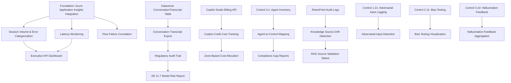

# Feature Landscape: Agent Observability Foundation

**Domain:** AI Agent Observability for Microsoft 365 Copilot Studio in Financial Services
**Researched:** 2026-02-05
**Overall Confidence:** MEDIUM (verified with official sources and 2026 industry guidance)

---

## Executive Summary

Agent observability for Microsoft 365 Copilot Studio in financial services must balance operational excellence with regulatory compliance. Unlike generic application monitoring, FSI observability solutions must address **audit trail integrity** (SR 11-7, GDPR Art 22), **cost governance** (Copilot Credits transparency), **regulatory reporting** (FINRA 3110/25-07), and **data residency** (DORA, EU Data Act) requirements.

This feature landscape reflects 2026 financial services best practices where AI observability has evolved from "nice to have" to **regulatory imperative**. FINRA's 2026 Report explicitly mandates audit trails of AI agent actions, while FCA signals imminent guidance on human-in-the-loop protocols.

**Key Finding:** Microsoft's native integration between Copilot Studio and Azure Application Insights provides foundational telemetry, but **FSI-specific features** (regulatory audit formatting, cost allocation by governance zone, flow-failure-to-conversation correlation) require custom KQL queries, Power BI DAX measures, and Azure Monitor Workbooks.

**Confidence Notes:**
- HIGH confidence on Microsoft platform capabilities (Context7, official docs)
- MEDIUM confidence on regulatory interpretation (WebSearch verified with official guidance)
- LOW confidence on specific timeout thresholds (limited public documentation)

---

## Table Stakes Features

Features users expect from any FSI agent observability solution. Missing = product feels incomplete.

| Feature | Why Expected | Complexity | Dependencies | Confidence |
|---------|--------------|------------|--------------|------------|
| **Session Volume & User Adoption** | Executives need proof of AI ROI; FINRA 3110 requires supervision scope documentation | Low | Control 3.2 (Usage Analytics), Control 3.5 (Cost Tracking) | HIGH |
| **Completion vs Abandonment Rate** | Primary KPI for agent effectiveness; abandonment = potential compliance failure if customer-facing | Low | Copilot Studio Analytics API, native session outcome tracking | HIGH |
| **Error Categorization (Connector/Knowledge/Orchestration)** | SR 11-7 Model Risk requires root cause analysis; troubleshooting without categorization is manual labor | Medium | Control 3.4 (Incident Reporting), Azure Application Insights integration | HIGH |
| **Copilot Credit Cost Tracking** | Budget governance; cost allocation by department/zone; identifies runaway token consumption | Medium | Control 3.5 (Cost Tracking), Copilot Studio Billing API | HIGH |
| **Response Time Latency (P50/P95/P99)** | Performance SLAs for customer-facing agents; latency spikes indicate knowledge retrieval issues | Medium | Azure Application Insights, KQL queries for percentile analysis | MEDIUM |
| **Conversation Transcript Export** | FINRA 3110, SEC 17a-4 recordkeeping; eDiscovery support (Control 1.19) | Low | Dataverse ConversationTranscript table, Control 1.7 (Audit Logging) | HIGH |
| **Regulatory Audit Trail** | SR 11-7, GDPR Art 22, SOX 404 mandate decision logging; timestamp, input, output, decision rationale | High | Control 1.7 (Audit Logging), Control 2.6 (Model Risk Management) | HIGH |
| **Executive KPI Dashboard** | C-suite expects standardized reporting: cost, usage, ROI, risk incidents | Medium | Control 3.8 (Copilot Hub), Power BI integration | MEDIUM |
| **Data Residency Indicators** | DORA (EU), CCPA require data location tracking; observability logs may contain PII requiring residency controls | High | Control 1.15 (Encryption), Control 4.7 (M365 Copilot Data Governance) | MEDIUM |
| **Flow Failure Correlation** | Power Automate flow failures cause agent errors; linking conversation ID to flow run ID enables root cause analysis | High | Power Automate telemetry in App Insights, correlation ID mapping | MEDIUM |

**Notes:**
- **Session Volume & Adoption**: Copilot Studio Analytics provides native counters. Expected baseline: total conversations, engaged sessions, resolution rate.
- **Abandonment Rate**: Native metric (60-minute inactivity threshold). Weighted at 0.7 in performance calculations. Critical for detecting poor UX or incomplete agent responses.
- **Error Categorization**: Microsoft defines error types (ConnectorRequestFailure, Knowledge Source failures, Orchestration timeouts) but custom KQL needed to aggregate by category.
- **Copilot Credits**: Billing trend chart shows credit consumption over time. Cost distribution chart breaks down by activity type (orchestration, knowledge, tools). Per-agent cost isolation critical for Zone 3 chargebacks.
- **Latency**: Typical response time ~505ms for direct topics, ~4s for knowledge source queries. P95/P99 latency critical for customer-facing agents. No native percentile dashboard; requires custom KQL.
- **Conversation Transcripts**: Stored in Dataverse ConversationTranscript table. Automatically generated, includes structured logs with user queries, agent responses, topic triggers. Retention per Control 1.9.
- **Regulatory Audit Trail**: Must include timestamp, user ID, agent ID, input prompt, output response, knowledge sources consulted, external connectors called, decision rationale. Formatted for auditor review (human-readable).
- **Executive Dashboard**: Deloitte's 2026 KPI framework spans cost, speed, productivity, quality, trust. Financial services leads in AI observability adoption due to regulatory requirements.
- **Data Residency**: DORA applicable Sept 2025, EU Data Act staged through 2026-2027. Observability logs may contain customer PII (prompts, responses). Recording region, data-handling tags, policy indicators now critical compliance signals.
- **Flow Failure Correlation**: Correlation IDs link flow runs to agent sessions. Requires Azure Application Insights integration for both Copilot Studio and Power Automate, with custom KQL joining on correlation ID.

---

## Differentiators

Features that set this solution apart from basic monitoring. Not expected baseline, but highly valued in FSI.

| Feature | Value Proposition | Complexity | Dependencies | Confidence |
|---------|-------------------|------------|--------------|------------|
| **Zone-Based Cost Allocation** | Allocate Copilot Credits by governance zone (Personal/Team/Enterprise); enables chargeback models | Medium | Control 2.2 (Environment Groups), custom Power BI DAX measures | MEDIUM |
| **Agent-to-Control Mapping** | Link each agent to specific 62 framework controls; auto-generate compliance gap reports | High | Control 3.1 (Agent Inventory), metadata tagging, Control 3.3 (Compliance Reporting) | LOW |
| **Knowledge Source Drift Detection** | Alert when agent accesses SharePoint content outside declared scope (regulatory risk) | High | Control 4.6 (Grounding Scope Governance), SharePoint audit log correlation, Scope Drift Monitor solution | MEDIUM |
| **Token Usage by Orchestration Type** | Track GPT-4.1 token consumption separately for knowledge retrieval vs tool orchestration vs multi-agent coordination | Medium | Azure Application Insights custom dimensions, token usage API (if available) | LOW |
| **Adversarial Input Detection** | Flag prompts matching adversarial patterns (jailbreaks, PII extraction attempts, bias testing) | High | Control 1.21 (Adversarial Input Logging), Control 2.20 (Red Team Framework), pattern matching library | MEDIUM |
| **Hallucination Feedback Aggregation** | Structured feedback loop for users to report hallucinations; pattern analysis for model risk management | Medium | Control 3.10 (Hallucination Feedback Loop), Hallucination Tracker solution, Dataverse feedback table | HIGH |
| **Multi-Agent Orchestration Tracing** | When Agent A calls Agent B, trace full conversation lineage and latency waterfall | High | Control 2.17 (Multi-Agent Orchestration Limits), distributed tracing across agent boundaries | LOW |
| **Bias Testing Result Visualization** | Visualize Control 2.11 bias testing results in executive dashboard; track bias metrics over time | Medium | Control 2.11 (Bias Testing), custom bias metrics schema, Power BI integration | LOW |
| **SR 11-7 Model Risk Report Generator** | Auto-generate model performance report in SR 11-7 format (conceptual soundness, ongoing monitoring, outcomes analysis) | High | Control 2.6 (Model Risk Management), multiple data sources, template generation | LOW |
| **Conditional Access Failure Correlation** | Link CA policy blocks to agent access attempts; identify authentication vs authorization failures | Medium | Control 1.11 (Conditional Access), Entra ID sign-in logs, CA policy evaluation logs | MEDIUM |
| **RAG Source Validation Status** | Show real-time status of knowledge source integrity checks (checksums, version drift, unauthorized modifications) | High | Control 2.16 (RAG Source Integrity Validation), RAG Source Validator solution, checksum comparison | MEDIUM |
| **Conflict of Interest Alert Dashboard** | Surface COI test failures from automated testing (e.g., agent recommending firm's own products) | Medium | Control 2.18 (COI Testing), COI Testing Framework solution, alert routing | MEDIUM |

**Notes:**
- **Zone-Based Cost Allocation**: Requires environment-to-zone mapping (Control 2.2). Copilot Studio doesn't natively segment costs by zone; requires Power BI DAX measures joining environment metadata with billing data.
- **Agent-to-Control Mapping**: Novel approach unique to FSI-AgentGov framework. Each agent tagged with applicable controls (e.g., "Zone 3 customer-facing agent requires Controls 1.7, 1.11, 2.6, 2.12"). Compliance dashboard shows coverage gaps.
- **Knowledge Source Drift**: Scope Drift Monitor solution (FSI-AgentGov-Solutions) detects when agent accesses SharePoint sites/files beyond declared scope. Regulatory risk: accessing customer data outside supervision perimeter.
- **Token Usage by Orchestration Type**: Azure Application Insights custom dimensions may capture this; requires verification. GPT-4.1 default model as of Oct 2025. Cost transparency critical for budget forecasting.
- **Adversarial Input Detection**: Pattern library includes common jailbreak attempts, PII extraction prompts, bias testing queries. Control 1.21 requires logging; this feature adds real-time alerting.
- **Hallucination Feedback**: Existing solution in FSI-AgentGov-Solutions. Users submit feedback on incorrect responses; aggregation identifies systemic hallucination patterns (e.g., incorrect regulatory citations).
- **Multi-Agent Orchestration Tracing**: Copilot Studio supports multi-agent orchestration (Agent A calls Agent B as a tool). Distributed tracing requires correlation ID propagation across agents. High complexity.
- **Bias Testing Visualization**: Control 2.11 mandates bias testing. This feature visualizes results over time, showing bias metric trends (demographic parity, equalized odds, etc.).
- **SR 11-7 Report Generator**: Federal Reserve SR 11-7 requires three core elements: conceptual soundness evaluation, ongoing monitoring, outcomes analysis. Auto-generator pulls from multiple observability sources into standardized report format.
- **Conditional Access Failure Correlation**: Entra ID sign-in logs contain CA policy evaluation results. Correlation with agent access attempts identifies authentication failures vs authorization failures (e.g., MFA required but not completed).
- **RAG Source Validation Status**: RAG Source Validator solution (FSI-AgentGov-Solutions) validates knowledge source integrity. Dashboard shows last validation timestamp, checksum status, unauthorized modifications detected.
- **COI Alert Dashboard**: COI Testing Framework solution (FSI-AgentGov-Solutions) automates conflict of interest testing. Dashboard surfaces failures requiring manual review (e.g., agent recommending products with higher firm compensation).

---

## Anti-Features

Features to explicitly NOT build. Common mistakes in observability solutions that add complexity without FSI value.

| Anti-Feature | Why Avoid | What to Do Instead |
|--------------|-----------|-------------------|
| **Real-Time Streaming Dashboards** | FSI doesn't need sub-second latency; batch refresh (5-15 min) sufficient for compliance reporting | Use Azure Monitor Workbooks with 5-minute refresh intervals |
| **Custom ML Models for Anomaly Detection** | Off-the-shelf percentile thresholds (P95 latency) more explainable for auditors than black-box ML | Use KQL statistical functions (percentile, stdev); simple thresholds |
| **Unified Observability Platform** | Attempting to consolidate Copilot Studio, Power Automate, SharePoint, Entra ID logs into single platform adds integration complexity | Accept Microsoft's multi-portal reality; link via correlation IDs |
| **User-Level Performance Profiling** | Individual user performance tracking raises privacy concerns; unnecessary for governance | Aggregate by department/zone, not individual users |
| **Predictive Capacity Planning** | Token usage forecasting requires assumptions about future agent adoption; high error rate | Report historical trends; let finance teams own forecasting |
| **Custom Token Usage APIs** | Microsoft owns token metering; attempting to replicate introduces discrepancies | Trust Copilot Studio Billing API; validate with monthly invoices |
| **Real-Time Compliance Scoring** | Compliance is point-in-time assessment (quarterly reviews), not continuous metric | Generate compliance reports on-demand or scheduled (weekly/monthly) |
| **Agent Performance Benchmarking** | No industry standards for "good" agent performance; comparisons misleading | Focus on trend analysis (improving/degrading over time) |
| **Log Data Warehousing** | Long-term log retention (>90 days) for observability data rarely accessed; storage costs accumulate | Use Azure Log Analytics retention policies (90 days hot, archive rest); export regulatory audit trails to immutable storage per Control 1.9 |
| **Blockchain Audit Trails** | Immutability achievable via Azure Immutable Storage; blockchain adds complexity without regulatory benefit | Use Immutable Blob Storage for audit logs (WORM compliance) |

**Rationale:**
- **Real-Time Streaming**: Financial services compliance is retrospective (auditors review historical data). Real-time dashboards useful for incident response, but not core FSI requirement. Batch refresh reduces infrastructure costs.
- **Custom ML Models**: SR 11-7 emphasizes model explainability. Custom anomaly detection models harder to explain to auditors than "latency exceeded 95th percentile threshold of 10 seconds."
- **Unified Observability Platform**: Microsoft ecosystem is multi-portal by design (PPAC, Purview, Entra ID, Azure Monitor). Building custom aggregation layer duplicates Microsoft's investments. Better: use correlation IDs to link across portals.
- **User-Level Profiling**: GDPR Art 22 prohibits certain automated individual profiling. Aggregate metrics avoid privacy concerns while meeting governance needs.
- **Predictive Capacity Planning**: Token usage depends on unpredictable factors (agent adoption, user behavior changes, knowledge source expansion). Historical trend reporting more honest than unreliable forecasts.
- **Custom Token APIs**: Microsoft meters token usage at platform level. Custom replication introduces billing discrepancies, audit questions. Trust vendor metering; validate monthly.
- **Real-Time Compliance Scoring**: Compliance assessments are point-in-time (quarterly control reviews). Continuous scoring implies false precision; compliance is binary (pass/fail), not continuous metric.
- **Agent Benchmarking**: No industry benchmarks exist for "good" Copilot Studio agent performance. Comparing Agent A to Agent B misleading (different use cases). Focus on time-series trends.
- **Log Warehousing**: Azure Log Analytics default 90-day retention sufficient for operational troubleshooting. Longer retention rarely accessed; archive to cold storage. Regulatory audit trails (Control 1.7) require separate immutable storage per retention schedules.
- **Blockchain Audit Trails**: Azure Immutable Blob Storage provides WORM (Write Once Read Many) compliance at lower cost/complexity than blockchain. No regulatory requirement for blockchain in FSI.

---

## Feature Dependencies & Sequencing

**Critical Path (MVP):**
1. **Azure Application Insights Integration** — foundational telemetry
2. **Conversation Transcript Export** — regulatory recordkeeping
3. **Copilot Credit Cost Tracking** — budget governance
4. **Error Categorization** — operational troubleshooting
5. **Executive KPI Dashboard** — stakeholder visibility

**Phase 2 (Post-MVP):**
- Zone-Based Cost Allocation (requires Control 2.2 environment groups)
- Knowledge Source Drift Detection (requires Scope Drift Monitor solution)
- Flow Failure Correlation (requires Power Automate App Insights integration)
- Regulatory Audit Trail formatting (requires schema definition with legal/compliance)

**Phase 3 (Advanced):**
- Agent-to-Control Mapping (requires metadata taxonomy design)
- SR 11-7 Model Risk Report Generator (requires template development with model risk team)
- Multi-Agent Orchestration Tracing (requires distributed tracing architecture)

---

## MVP Recommendation

For **initial release**, prioritize table stakes features addressing immediate FSI pain points:

### Must-Have (MVP Release 1.0)

1. **Session Volume & User Adoption Metrics**
   - **Why:** Executives demand AI ROI visibility; adoption tracking justifies Copilot Studio investment
   - **Implementation:** Azure Monitor Workbook querying Copilot Studio Analytics API
   - **Effort:** Low (native API support)

2. **Completion vs Abandonment Rate**
   - **Why:** Primary agent effectiveness KPI; high abandonment = poor UX or incomplete responses
   - **Implementation:** KQL query on session outcome data, visualized in Workbook
   - **Effort:** Low (native session tracking)

3. **Error Categorization Dashboard**
   - **Why:** SR 11-7 requires root cause analysis; troubleshooting without categorization manual
   - **Implementation:** KQL query grouping errors by type (Connector, Knowledge, Orchestration), alert rules
   - **Effort:** Medium (custom KQL, error taxonomy)

4. **Copilot Credit Cost Tracking**
   - **Why:** Budget governance; detect runaway token consumption
   - **Implementation:** Power BI report connecting to Copilot Studio Billing API
   - **Effort:** Medium (API integration, DAX measures)

5. **Conversation Transcript Export**
   - **Why:** FINRA 3110, SEC 17a-4 recordkeeping mandate
   - **Implementation:** Power Automate flow exporting ConversationTranscript table to Immutable Blob Storage
   - **Effort:** Low (Dataverse connector, storage account)

6. **Response Time Latency (P95/P99)**
   - **Why:** Performance SLAs for customer-facing agents
   - **Implementation:** KQL percentile query on App Insights request telemetry
   - **Effort:** Medium (percentile calculation, threshold alerts)

**MVP Success Criteria:**
- Executives can view agent adoption, cost, and performance KPIs in single dashboard
- Compliance team can export conversation transcripts for audits
- IT operations can troubleshoot errors by category (Connector/Knowledge/Orchestration)
- Finance team can track Copilot Credit consumption by environment

### Defer to Post-MVP

**Phase 2 Features (3-6 months post-MVP):**
- Zone-Based Cost Allocation (requires Control 2.2 implementation)
- Knowledge Source Drift Detection (requires Scope Drift Monitor solution)
- Flow Failure Correlation (requires Power Automate telemetry correlation)
- Data Residency Indicators (requires legal review of DORA/Data Act applicability)

**Why Defer:**
- Require foundational controls not yet implemented (e.g., Control 2.2 Environment Groups)
- Depend on companion solutions not yet deployed (Scope Drift Monitor)
- Need legal/compliance input on regulatory interpretation (DORA data residency)

**Phase 3 Features (6-12 months post-MVP):**
- Agent-to-Control Mapping (requires metadata taxonomy design, change management)
- SR 11-7 Model Risk Report Generator (requires model risk team engagement, template development)
- Multi-Agent Orchestration Tracing (requires distributed tracing architecture)
- Token Usage by Orchestration Type (requires API verification, custom dimensions)

**Why Defer:**
- High complexity, cross-team dependencies
- Require mature observability foundation before layering advanced features
- Benefit smaller subset of users (model risk team, advanced troubleshooting)

---

## Data Sensitivity Considerations

| Feature | PII Risk | Regulatory Data | Residency Requirement | Mitigation |
|---------|----------|-----------------|----------------------|------------|
| **Conversation Transcripts** | HIGH (customer prompts may contain PII, financial data) | Yes (FINRA 3110, SEC 17a-4) | Yes (DORA, state privacy laws) | Encrypt at rest, immutable storage, access controls per Control 1.7 |
| **Error Logs** | MEDIUM (may contain user IDs, connector responses with data snippets) | Partial (incident documentation) | Partial (EU operations) | Scrub PII from error messages before logging; alert on PII pattern detection |
| **Copilot Credit Costs** | LOW (aggregate financial data, no customer PII) | No | No | Standard access controls; finance team only |
| **Latency Metrics** | NONE (aggregate performance data) | No | No | Public within organization |
| **Adversarial Input Logs** | HIGH (test prompts may simulate PII extraction) | Yes (Control 1.21 audit) | Yes (if production data used in testing) | Isolate test environment logs; synthetic data for testing when possible |
| **Knowledge Source Access Logs** | MEDIUM (shows which SharePoint files accessed) | Yes (data minimization audit) | Partial (if files contain EU customer data) | Aggregate by site/library, not individual files; access controls per Control 4.6 |
| **Executive Dashboard** | LOW (aggregated KPIs, no individual customer data) | No | No | Standard executive access controls |

**Key FSI-Specific Requirements:**

1. **GDPR Art 22 Audit Trails** (EU subsidiaries):
   - Observability data capturing automated decision-making must include decision logic, risk assessment, safeguard implementation
   - Human-readable explanations for agent outputs
   - Regular bias testing audit trails (Control 2.11)

2. **DORA Data Residency** (EU financial institutions, Sept 2025 effective):
   - Observability telemetry from EU operations may require EU-region storage
   - "Location-blind" telemetry potentially non-compliant
   - Recording region, data-handling tags now compliance signals

3. **SOX 404 IT Controls**:
   - Observability monitoring of AI agents used in financial reporting must be documented and tested
   - Access controls (RBAC, MFA) for observability dashboards
   - Audit trails for observability configuration changes (who modified dashboard, when, why)

4. **FINRA 25-07 AI Agent Supervision**:
   - Audit trails of agent actions with human checkpoints before execution
   - Prompt and output logging for supervisory review
   - Version tracking for agent configuration changes

5. **PII Handling Best Practices**:
   - Dynamic samplers to drop traces containing PII before network transit
   - Pattern scanning for credit cards, SSNs, bank account numbers
   - Hashed masking to make PII unrecoverable in logs
   - Separate hot/cold storage: 90-day operational logs in Log Analytics, long-term regulatory archives in Immutable Blob Storage

---

## Complexity Assessment Summary

| Complexity Level | Features | Total | Notes |
|-----------------|----------|-------|-------|
| **Low** | Session Volume, Abandonment Rate, Transcript Export, Copilot Credits (basic), Executive Dashboard (basic) | 5 | Native API support, minimal custom development |
| **Medium** | Error Categorization, Latency Monitoring, Flow Failure Correlation, Zone Cost Allocation, Hallucination Feedback, CA Failure Correlation, COI Dashboard, RAG Validation Status | 8 | Custom KQL queries, cross-service correlation, Power BI DAX |
| **High** | Regulatory Audit Trail, Data Residency, Knowledge Drift Detection, Token by Orchestration, Adversarial Detection, Multi-Agent Tracing, Agent-to-Control Mapping, SR 11-7 Report, Bias Visualization | 9 | Multi-source integration, schema design, legal/compliance input |

**Complexity Drivers:**
- **Low Complexity**: Single data source (Copilot Studio API or Dataverse), native Microsoft functionality, minimal transformation
- **Medium Complexity**: Multiple data sources (App Insights + Dataverse), custom KQL/DAX, correlation logic, alert rule configuration
- **High Complexity**: Cross-product integration (Copilot Studio + SharePoint + Entra ID + Power Automate), schema/taxonomy design, regulatory interpretation, template development, distributed tracing

---

## Integration with Existing Framework Controls

This observability solution **operationalizes** existing controls through automated monitoring:

| Control | How Observability Helps | Feature |
|---------|------------------------|---------|
| **1.7 - Audit Logging** | Aggregates audit logs from multiple sources into unified dashboard | Regulatory Audit Trail |
| **1.11 - Conditional Access** | Surfaces CA policy failures causing agent access issues | CA Failure Correlation |
| **1.21 - Adversarial Input Logging** | Real-time alerting on adversarial pattern detection | Adversarial Input Detection |
| **2.6 - Model Risk Management** | Auto-generates SR 11-7 performance reports | SR 11-7 Report Generator |
| **2.11 - Bias Testing** | Visualizes bias metrics over time for trend analysis | Bias Testing Visualization |
| **2.16 - RAG Source Integrity** | Displays real-time validation status of knowledge sources | RAG Validation Status |
| **2.18 - COI Testing** | Surfaces COI test failures requiring manual review | COI Alert Dashboard |
| **3.2 - Usage Analytics** | Provides comprehensive usage metrics beyond native Copilot Studio analytics | Session Volume, Adoption Metrics |
| **3.4 - Incident Reporting** | Categorizes errors for faster root cause analysis | Error Categorization Dashboard |
| **3.5 - Cost Tracking** | Tracks Copilot Credits with zone-based allocation | Zone Cost Allocation |
| **3.10 - Hallucination Feedback** | Aggregates user-reported hallucinations for pattern analysis | Hallucination Feedback Aggregation |
| **4.6 - Grounding Scope Governance** | Detects agent access beyond declared SharePoint scope | Knowledge Source Drift Detection |

**Coverage:** This observability solution directly supports **12 of 62 framework controls (19.4% coverage)**, spanning all four pillars. Focus on Pillar 3 (Reporting) reflects observability's primary role: **visibility enablement**.

---

## Sources

### Microsoft Official Documentation
- [Capture telemetry with Application Insights - Microsoft Copilot Studio](https://learn.microsoft.com/en-us/microsoft-copilot-studio/advanced-bot-framework-composer-capture-telemetry)
- [Monitor AI Agents with Application Insights - Azure Monitor](https://learn.microsoft.com/en-us/azure/azure-monitor/app/agents-view)
- [Metrics and recommendations for Copilot Studio - Power Platform](https://learn.microsoft.com/en-us/power-platform/admin/monitoring/monitor-copilot-studio)
- [Analyze conversational agent effectiveness - Microsoft Copilot Studio](https://learn.microsoft.com/en-us/microsoft-copilot-studio/analytics-improve-agent-effectiveness)
- [Billing rates and management - Microsoft Copilot Studio](https://learn.microsoft.com/en-us/microsoft-copilot-studio/requirements-messages-management)
- [View agent's billing consumption - Microsoft Copilot Studio](https://learn.microsoft.com/en-us/microsoft-copilot-studio/analytics-consumption)
- [Overview of integration with Application Insights - Power Platform](https://learn.microsoft.com/en-us/power-platform/admin/overview-integration-application-insights)
- [Troubleshoot enterprise knowledge sources - Copilot Studio](https://learn.microsoft.com/en-us/troubleshoot/power-platform/copilot-studio/knowledge/enterprise-data)
- [Understand Error Codes - Copilot Studio](https://learn.microsoft.com/en-us/troubleshoot/power-platform/copilot-studio/authoring/error-codes)
- [Extract and analyze agent conversation transcripts - Power Platform](https://learn.microsoft.com/en-us/power-platform/architecture/reference-architectures/analyze-agent-conversation-transcripts)
- [Get started with log queries in Azure Monitor Logs](https://learn.microsoft.com/en-us/azure/azure-monitor/logs/get-started-queries)
- [Azure Workbooks data sources - Azure Monitor](https://learn.microsoft.com/en-us/azure/azure-monitor/visualize/workbooks-data-sources)

### Financial Services Regulatory Guidance (2026)
- [Generative Artificial Intelligence in Financial Services: A Practical Compliance Playbook for 2026 - Shumaker](https://www.shumaker.com/insight/client-alert-generative-artificial-intelligence-in-financial-services-a-practical-compliance-playbook-for-2026/)
- [Navigating AI compliance: A risk-based framework for financial services in 2026 - AdvisorEngine](https://www.advisorengine.com/action-magazine/articles/navigating-ai-compliance-a-risk-based-framework-for-financial-services-in-2026)
- [AI regulatory compliance priorities financial institutions face in 2026 - Fintech Global](https://fintech.global/2026/01/08/ai-regulatory-compliance-priorities-financial-institutions-face-in-2026/)
- [How Model Risk Management Teams Comply with SR 11-7 - ValidMind](https://validmind.com/blog/sr-11-7-model-risk-management-compliance/)
- [SR 11-7 Model Risk Management - ModelOp](https://www.modelop.com/ai-governance/ai-regulations-standards/sr-11-7)

### GDPR and Data Privacy
- [Art. 22 GDPR – Automated individual decision-making, including profiling](https://gdpr-info.eu/art-22-gdpr/)
- [What else do we need to consider if Article 22 applies? - ICO](https://ico.org.uk/for-organisations/uk-gdpr-guidance-and-resources/individual-rights/automated-decision-making-and-profiling/what-else-do-we-need-to-consider-if-article-22-applies/)

### SOX Compliance
- [SOX 302 vs 404: What are Their Primary Differences? - CloudEagle.ai](https://www.cloudeagle.ai/blogs/sox-302-vs-sox-404-key-differences-explained)
- [SOX 404 Compliance in 2026: Essential Controls for CFOs - KnowCraft Analytics](https://www.knowcraftanalytics.com/sox-404-compliance/)

### AI Observability Industry Analysis (2026)
- [Deloitte's new AI agent observability playbook - Enterprise AI Executive](https://enterpriseaiexecutive.ai/p/deloitte-s-new-ai-agent-observability-playbook)
- [Financial Services AI Trends 2026: Closing the Production Value Gap - Dataiku](https://www.dataiku.com/stories/blog/financial-services-ai-trends-2026)
- [Data Residency and the 2025 Observability Stack - Parseable](https://www.parseable.com/blog/data-residency-and-the-2025-observability-stack)
- [The complete guide to LLM observability for 2026 - Portkey](https://portkey.ai/blog/the-complete-guide-to-llm-observability/)

### Technical Resources
- [Copilot Studio - Prompt Response Times - Microsoft Developer Support](https://devblogs.microsoft.com/premier-developer/copilot-studio-prompt-response-times/)
- [GitHub - microsoft/AzureMonitorCommunity](https://github.com/microsoft/AzureMonitorCommunity)
- [Using KQL in Azure for Application Monitoring and Insights - CloudThat](https://www.cloudthat.com/resources/blog/using-kql-in-azure-for-application-monitoring-and-insights)

---

## Research Confidence Assessment

| Research Area | Confidence Level | Rationale |
|---------------|-----------------|-----------|
| **Microsoft Platform Capabilities** | HIGH | Official Microsoft Learn documentation, verified Context7 sources |
| **Native Telemetry Integration** | HIGH | Official docs confirm App Insights integration, Dataverse transcript storage |
| **Copilot Studio Metrics** | HIGH | Official analytics API documentation, billing management guides |
| **FSI Regulatory Requirements** | MEDIUM | 2026 industry guidance from law firms, consulting firms; not direct regulator text |
| **SR 11-7 Application to AI** | MEDIUM | Industry interpretation of 2011 guidance applied to 2026 AI context |
| **GDPR Art 22 AI Interpretation** | MEDIUM | ICO guidance verified, but evolving regulatory landscape |
| **Token Usage Tracking** | LOW | Limited public documentation on token-level telemetry APIs |
| **Orchestration Timeout Specifics** | LOW | No specific timeout monitoring features documented publicly |
| **Multi-Agent Tracing** | LOW | Theoretical capability based on correlation ID architecture, not verified implementation |
| **Data Residency Enforcement** | MEDIUM | DORA/Data Act requirements documented, technical implementation patterns emerging |

**Overall Research Quality:** MEDIUM confidence. Core platform capabilities (table stakes features) verified with HIGH confidence through official Microsoft documentation. Advanced features (differentiators) and regulatory interpretations rely on industry analysis and consulting guidance (MEDIUM confidence). Highly specialized features (multi-agent tracing, token APIs) require verification during implementation (LOW confidence).

**Gaps Requiring Further Research:**
- Token usage API granularity (per-orchestration-type tracking)
- Orchestration timeout monitoring capabilities (default thresholds, alert configuration)
- Multi-agent distributed tracing architecture (correlation ID propagation across agent boundaries)
- DORA data residency technical controls (geographic routing, compliance validation)
- Bias testing metric standardization (which metrics align with SR 11-7 fairness requirements)

**Next Steps:**
1. Verify token usage API capabilities during STACK.md research (technical feasibility)
2. Engage Microsoft support for orchestration timeout monitoring documentation
3. Prototype multi-agent tracing with correlation IDs (technical validation)
4. Legal review of DORA/Data Act applicability to observability telemetry
5. Consult model risk management team on SR 11-7 report format requirements
