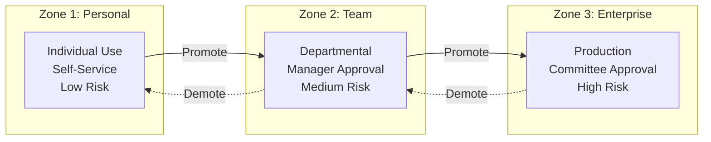

# FSI Agent Governance Framework v1.0 Beta

Comprehensive governance framework for Microsoft 365 AI agents in financial services organizations.

## 📋 Overview

This framework provides complete guidance for deploying, governing, and managing Microsoft 365 agents (Copilot Studio, Agent Builder, and related AI services) in regulated financial services environments.

**Version:** 1.0 Beta (December 2025)
**Target Audience:** Financial Services Organizations (FSI)
**Regulatory Focus:** FINRA, SEC, SOX, GLBA, OCC, Federal Reserve

> **Important:** This framework is provided for informational purposes only and does not constitute legal, regulatory, or compliance advice. See [DISCLAIMER.md](DISCLAIMER.md) for full details.

---

## 🎯 Framework Structure

### Four Governance Pillars

| Pillar | Controls | Focus | Examples |
|--------|----------|-------|----------|
| **1. Security** | 18 | Protect data and systems | DLP, Audit, Encryption, MFA |
| **2. Management** | 14 | Govern lifecycle and risk | Change Control, Testing, Model Risk |
| **3. Reporting** | 6 | Monitor and track | Inventory, Usage, Incidents, Costs |
| **4. SharePoint Mgmt** | 5 | SharePoint-specific controls | Access, Retention, External Sharing |

**Total: 43 Comprehensive Controls**

### Three Governance Zones

| Zone | Level | Risk | Data Access | Approval |
|------|-------|------|-------------|----------|
| **Zone 1: Personal** | Low | Individual development | M365 Graph only | Self-service |
| **Zone 2: Team** | Medium | Departmental agents | Internal data | Manager approval |
| **Zone 3: Enterprise** | High | Production/customer-facing | Regulated data | Governance committee |

---

## 📁 What's Included

### Control Files (43 Total)
- **Pillar 1:** 18 Security Controls (1.1-1.18)
- **Pillar 2:** 14 Management Controls (2.1-2.14)
- **Pillar 3:** 6 Reporting Controls (3.1-3.6)
- **Pillar 4:** 5 SharePoint Controls (4.1-4.5)

Each control includes:
- Overview and regulatory reference
- 3 governance levels (Baseline, Recommended, Regulated)
- Verification and testing procedures
- Implementation guidance

### Documentation Files
- **README.md** - This file (overview)
- **Zones-Overview.md** - [Detailed governance zones](docs/getting-started/zones.md)
- **Regulatory-Mappings.md** - [Regulation-to-control mapping](docs/reference/regulatory-mappings.md)
- **Quick-Start-Guide.md** - [How to use the framework](docs/getting-started/quick-start.md)
- **Glossary.md** - [Key terms and definitions](docs/reference/glossary.md)
- **RACI-Matrix.md** - [Roles and responsibilities](docs/reference/raci-matrix.md)
- **Implementation-Checklist.md** - [Implementation roadmap](docs/getting-started/checklist.md)
- **FAQ.md** - [Frequently asked questions](docs/reference/faq.md)

### Supporting Files
- **CONTROL-INDEX.md** - [Master index of all controls](docs/reference/CONTROL-INDEX.md)
- **FSI_Agent_Governance_Framework_v1.0_Beta.xlsx** - Excel workbook (22 sheets):
  - Dashboard, Executive Summary, Quick Reference
  - Security Controls, Management Controls, Agent Reporting
  - RACI Matrix, Compliance Matrix, Zones Definition
  - Implementation Checklist, Runbooks, Exam Prep
  - Glossary, Key Contacts, Admin Paths
- **FSI_Agent_Governance_Complete_v1.0_Beta.docx** - Detailed written guidance (43 sections)

---

## 🚀 Quick Start

### For First-Time Users
1. Read **[Quick Start Guide](docs/getting-started/quick-start.md)** (10 minutes)
2. Review **[Zones Overview](docs/getting-started/zones.md)** to classify your agents (15 minutes)
3. Check **[Regulatory Mappings](docs/reference/regulatory-mappings.md)** for your relevant regulations (10 minutes)

### For Implementation
1. Use **[Implementation Checklist](docs/getting-started/checklist.md)** for step-by-step guidance
2. Reference individual control files for detailed procedures
3. Document evidence in your compliance system
4. Schedule quarterly reviews

### For Governance
1. Use **[RACI Matrix](docs/reference/raci-matrix.md)** to assign roles and responsibilities
2. Establish governance committee per **[Zones Overview](docs/getting-started/zones.md)**
3. Schedule recurring compliance reviews
4. Track incidents and remediation

---

## Regulatory Coverage

The framework maps controls to regulatory requirements:

| Regulation | Coverage | Key Controls | Notes |
|-----------|----------|--------------|-------|
| **FINRA 4511** | 100% (43/43) | 1.7, 1.9, 2.9, 2.12 | Full coverage |
| **SEC 17a-3/4** | 88% (38/43) | 1.7, 1.9, 1.13 | Recordkeeping focus |
| **SOX 302/404** | 81% (35/43) | 2.5, 2.10, 2.12 | Internal controls |
| **GLBA 501(b)** | 93% (40/43) | 1.11, 1.15, 1.18 | Safeguards focus |
| **OCC 2011-12** | 58% (25/43) | 2.6, 2.11 | Model risk focus |
| **Fed SR 11-7** | 58% (25/43) | 2.6, 2.11 | Model risk focus |

> **Note:** Coverage percentages indicate which framework controls address aspects of each regulation. Actual compliance requires implementation, validation, and ongoing maintenance. Consult legal counsel for regulatory interpretation. See [DISCLAIMER.md](DISCLAIMER.md).

---

## 💡 Key Concepts

### Governance Maturity Levels

Each control is documented with 4 maturity levels:

- **Level 0:** Not implemented
- **Level 1:** Baseline (minimal compliance)
- **Level 2-3:** Recommended (best practices)
- **Level 4:** Regulated/High-Risk (comprehensive)

### Control Implementation Approach

1. **Assess** - Current state vs. required level
2. **Implement** - Follow control guidance
3. **Verify** - Use verification procedures
4. **Document** - Record evidence for audit
5. **Review** - Schedule recurring reviews (quarterly)

---

## 📋 Governance Roles

Key roles from **[RACI Matrix](docs/reference/raci-matrix.md)**:

| Role | Responsibility |
|------|-----------------|
| **AI Governance Lead** | Framework oversight, policy decisions |
| **Compliance Officer** | Regulatory alignment, audit coordination |
| **CISO** | Security policy, threat response |
| **Power Platform Admin** | Technical implementation, environments |
| **Internal Audit** | Independent control testing |

---

## 🔧 Implementation Timeline

Typical 8-week rollout:

- **Phase 1 (Weeks 1-2):** Regulatory Compliance Baseline (11 tasks)
- **Phase 2 (Weeks 3-4):** Security Enhancements (10 tasks)
- **Phase 3 (Weeks 5-6):** Advanced Governance (8 tasks)
- **Phase 4 (Weeks 7-8):** Finalization & Operationalization (9 tasks)

See **[Implementation Checklist](docs/getting-started/checklist.md)** for detailed tasks.

---

## ❓ Support & Questions

### For Different Questions:
- **"How do I get started?"** → Read **[Quick Start Guide](docs/getting-started/quick-start.md)**
- **"What's my governance zone?"** → See **[Zones Overview](docs/getting-started/zones.md)**
- **"Which controls apply to my regulation?"** → Check **[Regulatory Mappings](docs/reference/regulatory-mappings.md)**
- **"Who does what?"** → Review **[RACI Matrix](docs/reference/raci-matrix.md)**
- **"What does this term mean?"** → Look up **[Glossary](docs/reference/glossary.md)**
- **"How do I implement this?"** → Use **[Implementation Checklist](docs/getting-started/checklist.md)**
- **"Common questions?"** → See **[FAQ](docs/reference/faq.md)**

### For Technical Implementation:
- Reference individual control files (1.1-4.5)
- Each control includes step-by-step verification procedures
- Contact your Power Platform Admin for platform-specific setup

### For Regulatory Questions:
- Review **[Regulatory Mappings](docs/reference/regulatory-mappings.md)** for regulation-to-control alignment
- Contact your Compliance Officer for regulatory interpretation
- Escalate to General Counsel for legal questions

---

## 📈 Continuous Improvement

This framework is designed for continuous evolution:

- **Quarterly Reviews:** Assess control effectiveness
- **Annual Updates:** Incorporate regulatory changes and Microsoft updates
- **Version History:** Track changes and improvements
- **Feedback Loop:** Gather input from governance team

---

## 📄 Document Version History

| Version | Date | Changes | Author |
|---------|------|---------|--------|
| 1.0 Beta | Dec 2025 | Enhanced with AI data governance (DSPM), bias testing, runtime protection, FINRA Notice 25-07 alignment | FSI Governance Team |
| 0.9 | Oct 2025 | Initial Internal Draft | FSI Governance Team |

---

## 📝 License

This framework is provided for use by financial services organizations. Modify as needed for your organization's specific requirements.

---

## ⚠️ Legal Disclaimer

> **This framework is provided for informational purposes only and does not constitute legal, regulatory, or compliance advice.**

Organizations using this framework should consult with their legal counsel and compliance teams to validate applicability and ensure compliance with all applicable regulations. See [DISCLAIMER.md](DISCLAIMER.md) for full details.

---

## 🎯 Next Steps

1. **Review** the [Quick Start Guide](docs/getting-started/quick-start.md)
2. **Assess** your current state against the framework
3. **Implement** using the step-by-step guidance
4. **Document** evidence for audit compliance
5. **Review** quarterly and update as regulations change

---

*FSI Agent Governance Framework v1.0 Beta - December 2025*  
*Comprehensive governance for Microsoft 365 agents in financial services*
