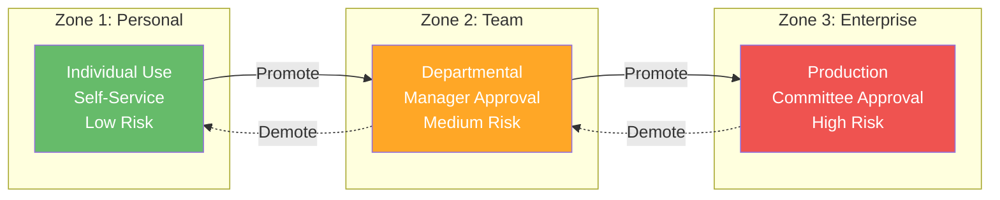
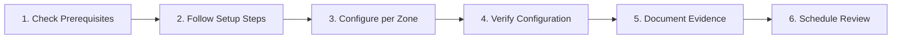

# FSI Agent Governance Framework v1.0

Comprehensive governance framework for Microsoft 365 AI agents in financial services organizations.

## 📋 Overview

This framework provides complete guidance for deploying, governing, and managing Microsoft 365 agents (Copilot Studio, Agent Builder, and related AI services) in regulated financial services environments.

**Version:** 1.0 (January 2026)
**Target Audience:** Financial Services Organizations (FSI)
**Regulatory Focus:** FINRA, SEC, SOX, GLBA, OCC, Federal Reserve, FDIC, NCUA

To stay current: **Star** this repository, use **Watch → Releases** for low-noise update notifications, and **share with your compliance team** as part of your review.

> **Scope:** This framework is designed for **US financial institutions** using **Microsoft 365 AI agents** (Copilot Studio, Agent Builder). Non-US regulations (EU AI Act, GDPR, DORA) and non-M365 AI platforms are out of scope.

> **Important:** This framework is provided for informational purposes only and does not constitute legal, regulatory, or compliance advice. See [Disclaimer](docs/disclaimer.md) for full details.

---

## 🎯 Framework Structure

### Four Governance Pillars

| Pillar | Controls | Focus | Examples |
|--------|----------|-------|----------|
| **1. Security** | 21 | Protect data and systems | DLP, Audit, Encryption, MFA, eDiscovery, Network Isolation |
| **2. Management** | 18 | Govern lifecycle and risk | Change Control, Testing, Model Risk, Multi-Agent Orchestration |
| **3. Reporting** | 10 | Monitor and track | Inventory, Usage, Incidents, PPAC, Sentinel, Hallucination Feedback |
| **4. SharePoint Mgmt** | 6 | SharePoint-specific controls | Access, Retention, External Sharing, Grounding Scope |

**Total: 55 Comprehensive Controls**

### Three Governance Zones

| Zone | Level | Risk | Data Access | Approval |
|------|-------|------|-------------|----------|
| **Zone 1: Personal** | Low | Individual development | M365 Graph only | Self-service |
| **Zone 2: Team** | Medium | Departmental agents | Internal data | Manager approval |
| **Zone 3: Enterprise** | High | Production/customer-facing | Regulated data | Governance committee |

---

## 📁 What's Included

### Control Files (55 Total)
- **Pillar 1:** 21 Security Controls (1.1-1.21)
- **Pillar 2:** 18 Management Controls (2.1-2.18)
- **Pillar 3:** 10 Reporting Controls (3.1-3.10)
- **Pillar 4:** 6 SharePoint Controls (4.1-4.6)

Each control includes:
- Overview and regulatory reference
- 3 governance levels (Baseline, Recommended, Regulated)
- Verification and testing procedures
- Implementation guidance

### Documentation Files
- **README.md** - This file (overview)
- **Zones-Overview.md** - [Detailed governance zones](docs/getting-started/zones.md)
- **Regulatory-Mappings.md** - [Regulation-to-control mapping](docs/reference/regulatory-mappings.md)
- **Quick-Start-Guide.md** - [How to use the framework](docs/getting-started/quick-start.md)
- **Glossary.md** - [Key terms and definitions](docs/reference/glossary.md)
- **RACI-Matrix.md** - [Roles and responsibilities](docs/reference/raci-matrix.md)
- **Implementation-Checklist.md** - [Implementation roadmap](docs/getting-started/checklist.md)
- **FAQ.md** - [Frequently asked questions](docs/reference/faq.md)

### Supporting Files
- **CONTROL-INDEX.md** - [Master index of all controls](docs/reference/CONTROL-INDEX.md)
- **Administrator Excel Templates** - Role-specific checklists and dashboards (see [Downloads](docs/downloads/index.md))
- **Offline Deliverables** - This repository ships **web docs + Excel templates only** (no Word/PDF document bundle)

---

## 🚀 Quick Start

### For First-Time Users
1. Read **[Quick Start Guide](docs/getting-started/quick-start.md)** (10 minutes)
2. Review **[Zones Overview](docs/getting-started/zones.md)** to classify your agents (15 minutes)
3. Check **[Regulatory Mappings](docs/reference/regulatory-mappings.md)** for your relevant regulations (10 minutes)

### For Implementation
1. Use **[Implementation Checklist](docs/getting-started/checklist.md)** for step-by-step guidance
2. Reference individual control files for detailed procedures
3. Document evidence in your compliance system
4. Schedule quarterly reviews

### For Governance
1. Use **[RACI Matrix](docs/reference/raci-matrix.md)** to assign roles and responsibilities
2. Establish governance committee per **[Zones Overview](docs/getting-started/zones.md)**
3. Schedule recurring compliance reviews
4. Track incidents and remediation

---

## 🔧 Setup & Verification Workflow

Each control in this framework follows a consistent documentation structure.

This repo is actively being expanded to include **how-to configure** guidance (step-by-step portal paths, optional automation, and evidence-grade verification).

Use this workflow for implementing controls:

### Control Documentation Structure

Every control file (1.1-4.5) follows this enhanced structure:

| Section | Purpose |
|---------|---------|
| **Overview** | Control ID, name, regulatory references, setup time |
| **Prerequisites** | Required licenses, admin roles, dependencies |
| **Governance Levels** | Baseline, Recommended, and Regulated configurations |
| **Setup & Configuration** | Step-by-step portal navigation and PowerShell scripts |
| **Financial Sector Considerations** | Regulatory alignment, zone-specific guidance, FSI examples |
| **Verification & Testing** | Steps to confirm configuration is active |
| **Troubleshooting** | Common issues and resolutions |
| **Additional Resources** | Microsoft Learn links and admin portal URLs |

### Implementation Steps

1. **Check Prerequisites**: Verify licenses, admin roles, and dependencies (other controls that must be configured first)
2. **Follow Setup Steps**: Use portal-based or PowerShell configuration methods
3. **Configure per Zone**: Apply settings appropriate for Zone 1, 2, or 3
4. **Verify Configuration**: Execute verification steps to confirm active controls
5. **Document Evidence**: Capture screenshots, export logs, record in compliance system
6. **Schedule Review**: Set quarterly review cadence for control effectiveness

### Maintainers: Validate Locally

Run these from the repo root (`FSI-AgentGov/`):

- `python scripts\verify_controls.py`
- `python scripts\verify_templates.py`
- `python scripts\audit_controls_zone_hygiene.py`
- `mkdocs build --strict`

### Quick Reference Resources

| Resource | Description | Location |
|----------|-------------|----------|
| **Control Template** | Standard template for control documentation | [templates/control-setup-template.md](docs/templates/control-setup-template.md) |
| **Microsoft Learn URLs** | Master list of official documentation | [reference/microsoft-learn-urls.md](docs/reference/microsoft-learn-urls.md) |
| **Portal Navigation Paths** | Quick reference for admin center navigation | [reference/portal-paths-quick-reference.md](docs/reference/portal-paths-quick-reference.md) |
| **License Requirements** | License mapping for all 55 controls | [reference/license-requirements.md](docs/reference/license-requirements.md) |
| **FSI Configuration Examples** | Bank, broker-dealer, and insurance scenarios | [reference/fsi-configuration-examples.md](docs/reference/fsi-configuration-examples.md) |

### Priority Controls (Start Here)

These foundation controls should be implemented first as other controls depend on them:

| Priority | Control | Why First |
|----------|---------|-----------|
| 1 | [2.1 - Managed Environments](docs/reference/pillar-2-management/2.1-managed-environments.md) | Required for 15+ other controls |
| 2 | [1.7 - Audit Logging](docs/reference/pillar-1-security/1.7-comprehensive-audit-logging-and-compliance.md) | Compliance evidence for all controls |
| 3 | [1.11 - Conditional Access & MFA](docs/reference/pillar-1-security/1.11-conditional-access-and-phishing-resistant-mfa.md) | Security baseline |
| 4 | [1.5 - DLP & Sensitivity Labels](docs/reference/pillar-1-security/1.5-data-loss-prevention-dlp-and-sensitivity-labels.md) | Data protection foundation |
| 5 | [1.4 - Advanced Connector Policies](docs/reference/pillar-1-security/1.4-advanced-connector-policies-acp.md) | Connector governance for agents |

### Admin Portal Quick Access

| Portal | URL | Primary Use |
|--------|-----|-------------|
| Power Platform Admin Center | [admin.powerplatform.microsoft.com](https://admin.powerplatform.microsoft.com) | Environments, DLP, connectors |
| Microsoft Purview Portal | [compliance.microsoft.com](https://compliance.microsoft.com) | Audit, DLP, retention |
| Microsoft Entra Admin Center | [entra.microsoft.com](https://entra.microsoft.com) | Conditional access, MFA, roles |
| SharePoint Admin Center | [admin.microsoft.com/sharepoint](https://admin.microsoft.com/sharepoint) | SharePoint governance |
| Copilot Studio | [copilotstudio.microsoft.com](https://copilotstudio.microsoft.com) | Agent development |

---

## Regulatory Coverage

Regulatory mappings and coverage are maintained in a single canonical table:

- See [Regulatory Mappings](docs/reference/regulatory-mappings.md)

> **Note:** Coverage indicates which framework controls address aspects of each regulation. Actual compliance requires implementation, validation, and ongoing maintenance. Consult legal counsel for regulatory interpretation. See [Disclaimer](docs/disclaimer.md).

---

## 💡 Key Concepts

### Governance Maturity Levels

Each control is documented with 4 maturity levels:

- **Level 0:** Not implemented
- **Level 1:** Baseline (minimal compliance)
- **Level 2-3:** Recommended (best practices)
- **Level 4:** Regulated/High-Risk (comprehensive)

### Control Implementation Approach

1. **Assess** - Current state vs. required level
2. **Implement** - Follow control guidance
3. **Verify** - Use verification procedures
4. **Document** - Record evidence for audit
5. **Review** - Schedule recurring reviews (quarterly)

---

## 📋 Governance Roles

Key roles from **[RACI Matrix](docs/reference/raci-matrix.md)**:

| Role | Responsibility |
|------|-----------------|
| **AI Governance Lead** | Framework oversight, policy decisions |
| **Compliance Officer** | Regulatory alignment, audit coordination |
| **CISO** | Security policy, threat response |
| **Power Platform Admin** | Technical implementation, environments |
| **Internal Audit** | Independent control testing |

---

## 🔧 Implementation Timeline

Typical 8-week rollout:

- **Phase 1 (Weeks 1-2):** Regulatory Compliance Baseline (11 tasks)
- **Phase 2 (Weeks 3-4):** Security Enhancements (10 tasks)
- **Phase 3 (Weeks 5-6):** Advanced Governance (8 tasks)
- **Phase 4 (Weeks 7-8):** Finalization & Operationalization (9 tasks)

See **[Implementation Checklist](docs/getting-started/checklist.md)** for detailed tasks.

---

## ❓ Support & Questions

### For Different Questions:
- **"How do I get started?"** → Read **[Quick Start Guide](docs/getting-started/quick-start.md)**
- **"What's my governance zone?"** → See **[Zones Overview](docs/getting-started/zones.md)**
- **"Which controls apply to my regulation?"** → Check **[Regulatory Mappings](docs/reference/regulatory-mappings.md)**
- **"Who does what?"** → Review **[RACI Matrix](docs/reference/raci-matrix.md)**
- **"What does this term mean?"** → Look up **[Glossary](docs/reference/glossary.md)**
- **"How do I implement this?"** → Use **[Implementation Checklist](docs/getting-started/checklist.md)**
- **"Common questions?"** → See **[FAQ](docs/reference/faq.md)**

### For Technical Implementation:
- Reference individual control files (1.1-4.5)
- Each control includes step-by-step verification procedures
- Contact your Power Platform Admin for platform-specific setup

### For Regulatory Questions:
- Review **[Regulatory Mappings](docs/reference/regulatory-mappings.md)** for regulation-to-control alignment
- Contact your Compliance Officer for regulatory interpretation
- Escalate to General Counsel for legal questions

---

## 📈 Continuous Improvement

This framework is designed for continuous evolution:

- **Quarterly Reviews:** Assess control effectiveness
- **Annual Updates:** Incorporate regulatory changes and Microsoft updates
- **Version History:** Track changes and improvements
- **Feedback Loop:** Gather input from governance team

---

## 📄 Document Version History

| Version | Date | Changes | Author |
|---------|------|---------|--------|
| 1.0 | Jan 2026 | Added evaluation gates, adversarial testing, multi-agent governance, RACI templates, governance review cadence | FSI Governance Team |
| 1.0 Beta | Dec 2025 | Enhanced with AI data governance (DSPM), bias testing, runtime protection, FINRA Notice 25-07 alignment | FSI Governance Team |
| 0.9 | Oct 2025 | Initial Internal Draft | FSI Governance Team |

---

## 📝 License

This framework is provided for use by financial services organizations. Modify as needed for your organization's specific requirements.

---

## ⚠️ Legal Disclaimer

See [Disclaimer](docs/disclaimer.md).

---

## 🎯 Next Steps

1. **Review** the [Quick Start Guide](docs/getting-started/quick-start.md)
2. **Assess** your current state against the framework
3. **Implement** using the step-by-step guidance
4. **Document** evidence for audit compliance
5. **Review** quarterly and update as regulations change

---

*FSI Agent Governance Framework v1.0 - January 2026*
*Comprehensive governance for Microsoft 365 agents in financial services*
