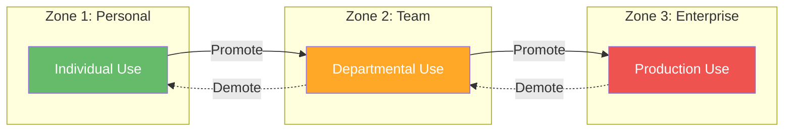
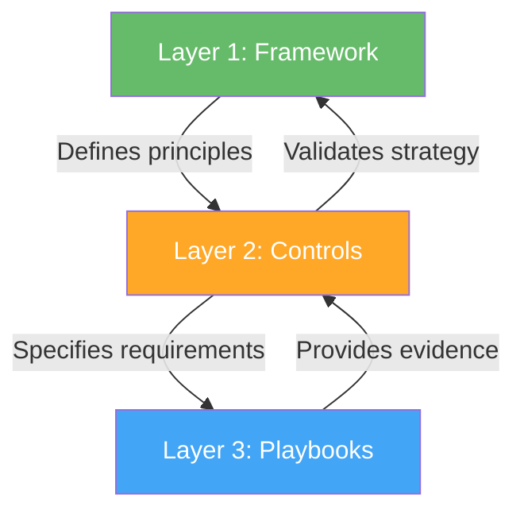
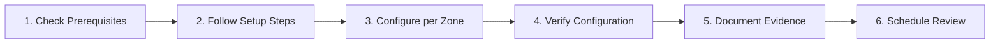

# FSI Agent Governance Framework v1.6.2

**Governance framework for Microsoft 365 AI agents in US financial services.**

## Latest Release

**[v1.6.2 — May 11, 2026](https://github.com/judeper/FSI-AgentGov/releases/latest)** (Frontier Readiness auto-evaluator wave)

- Six telemetry-driven Frontier evaluators (Q01, Q03, Q13, Q16, Q17, Q18) take auto-evaluable coverage from 0% to 24% — remaining 76% are facilitator-only by design.
- Honesty principle: every new evaluator is **partial-capped** (never returns `"yes"`) and explicitly names residual facilitator burden in its evidence string.
- 21 new tests (114 total); existing 78-control assessment behaviour unchanged. Safe to upgrade in place — see [`CHANGELOG.md`](CHANGELOG.md#162--may-11-2026-frontier-readiness-auto-evaluator-wave).

> **New to this framework? [Start Here](docs/start-here.md)** — understand what FSI-AgentGov covers, why it exists, and where to begin.

> ⚠️ **Scope:** This framework is designed exclusively for **US financial institutions** using **Microsoft 365 AI agents** (Copilot Studio, Agent Builder). Non-US regulations (EU AI Act, GDPR, DORA) and non-M365 AI platforms are out of scope.

> **Important:** This framework is provided for informational purposes only and does not constitute legal, regulatory, or compliance advice. See [Disclaimer](docs/disclaimer.md) for full details.

## What's New in v1.6

Version 1.6.x ships in three releases — v1.6.0 (Solutions Discoverability), v1.6.1 (Microsoft Learn drift patch), and v1.6.2 (Frontier Readiness auto-evaluator wave). Together they:

- **Frontier Readiness auto-scoring**: Six telemetry-driven evaluators (Q01, Q03, Q13, Q16, Q17, Q18) take Frontier auto-evaluable coverage from 0% to 24%. The remaining 76% are facilitator-only by design (board attestation, written policy text, executive interviews, regulatory committee minutes) and cannot be honestly derived from M365/PPAC/Sentinel/SharePoint telemetry. See the [Frontier assessment coverage](docs/reference/frontier-assessment-coverage.md) honest report.
- **Honesty principle for Frontier**: Every evaluator is **partial-capped** — none ever returns `"yes"`. Each cites the residual facilitator burden in its evidence string.
- **CAPE alignment metadata**: All 35 live companion solutions are tagged with `applicable_patterns`, `applicable_drivers`, and `coe_function` frontmatter in the FSI-AgentGov-Solutions repo (the preview `agent-intake` solution is not yet tagged); this framework regenerates `pattern-coverage.md` from those tags via a CI drift gate. See [Solutions Index](docs/reference/solutions-index.md) and [Pattern Coverage](docs/reference/pattern-coverage.md).
- **Microsoft Learn drift patches**: Five upstream Microsoft documentation changes (analytics retention, 7-area effectiveness scoring, Purview policy refresh, AI agent license footprint, communication-compliance scope) propagated across 5 controls + 5 playbooks + `license-requirements.md`.
- **Agent 365 enrichment**: Repo-wide truthfulness sweep (current-state version strings, Quick Start control counts, control cross-references), license overlay normalization for Agent 365 / E7 controls, and four net-new content drops — Bring Your Own MCP server (BYO MCP) terminology in the [MCP server governance playbook](docs/playbooks/advanced-implementations/mcp-server-governance/index.md), [Work IQ governance reference](docs/reference/work-iq-governance.md), [Windows 365 for Agents (W365A) reference](docs/reference/windows-365-for-agents.md), and a Secure Web and AI Gateway subsection in [Control 1.29](docs/controls/pillar-1-security/1.29-global-secure-access-network-controls.md). Pillar 1 substantive Microsoft Learn drift fixes (controls 1.5/1.6/1.9/1.10) and Control 3.13 hero-metrics correction also landed.

Earlier in **v1.5.0** the framework added an FSI translation layer for Microsoft CAPE materials: six transformation patterns, five capability drivers, the standalone Agentic CoE blueprint, the 25-question Frontier Readiness questionnaire (initially 100% manual), and CSA-facing reference docs. The `controls.json` schema gained three additive fields (`applicable_drivers`, `applicable_patterns`, `pattern_critical`) — backward-compatible.

Earlier in **v1.4.x** the assessment platform was unified (single manifest source-of-truth across Python engine + browser SPA), the solutions bridge was committed (35 solutions indexed via `solutions-lock.json`), facilitator mode + role-based homework + How-to-verify drawer + collector evidence import shipped, and an end-to-end Playwright suite (~60 specs) plus four new CI workflows hardened the SPA.

See [`CHANGELOG.md`](CHANGELOG.md) for full release-by-release detail; [`CHANGELOG-v1.4.md`](releases/CHANGELOG-archive/CHANGELOG-v1.4.md) and [`CHANGELOG-v1.3.md`](releases/CHANGELOG-archive/CHANGELOG-v1.3.md) cover prior major versions (see [`releases/CHANGELOG-archive/`](releases/CHANGELOG-archive/) for the full archive).

## Why This Repository Exists

Financial institutions can build and publish agents faster than they can consistently govern who may create them, what data and connectors they can access, how they move from experimentation to production, and what evidence must be retained for risk and compliance review. Microsoft product documentation explains how to create agents; FSI-AgentGov explains how to govern them in a regulated operating model.

This repository helps teams:

- classify agents into governance zones before rollout
- identify the foundational controls needed before broader adoption
- implement technical and procedural controls with step-by-step playbooks
- support risk, compliance, and operational review with a common reference point

**Version:** 1.6.2 (May 2026)
**Primary Audience:** AI governance leads, Power Platform Admins, compliance teams, security architects, internal audit, and business sponsors in US financial services
**Regulatory Focus:** FINRA, SEC, SOX, GLBA, OCC, Federal Reserve, FDIC, NCUA

## Who Should Use This Repository

Use this repository if you are:

- deploying or reviewing **Copilot Studio**, **Agent Builder**, or related Microsoft 365 AI agents
- responsible for **managed environments, connector governance, lifecycle controls, or approval workflows**
- preparing a more defensible governance approach for **regulated agent deployments** in financial services

This is not the right starting point if you are:

- governing **Microsoft 365 Copilot** in Word, Excel, PowerPoint, Outlook, Teams, Copilot Chat, or Copilot Pages — use **[FSI-CopilotGov](https://github.com/judeper/FSI-CopilotGov)**
- looking for **end-user prompting tips** or general user adoption guidance
- working outside **regulated US financial services**

## Relationship to FSI-CopilotGov

FSI-AgentGov and FSI-CopilotGov are complementary:

- **FSI-AgentGov** focuses on agent creation, publishing, environments, connectors, lifecycle, and agent-specific governance controls.
- **FSI-CopilotGov** focuses on Microsoft 365 Copilot experiences embedded across M365 applications.
- **If your program includes both**, use both repositories. See [Relationship to FSI-CopilotGov](docs/framework/relationship-to-copilotgov.md) for scope boundaries and routing guidance.

To stay current: **Star** this repository, use **Watch → Releases** for low-noise update notifications, and **share with your compliance team** as part of your review.

---

## 🎯 Framework Structure

### Four Governance Pillars

| Pillar | Controls | Focus | Examples |
|--------|----------|-------|----------|
| **1. Security** | 29 | Protect data and systems | DLP, Audit, Encryption, MFA, eDiscovery, Network Isolation, Information Barriers, Content Moderation, Publishing Restrictions |
| **2. Management** | 26 | Govern lifecycle and risk | Change Control, Testing, Model Risk, Multi-Agent Orchestration, HITL Framework, Inactivity Timeout, Feature Governance |
| **3. Reporting** | 14 | Monitor and track | Inventory, Usage, Incidents, PPAC, Sentinel, Hallucination Feedback, Exception Management |
| **4. SharePoint Mgmt** | 9 | SharePoint-specific controls | Access, Retention, External Sharing, Grounding Scope, Knowledge Source Scanning, Embedded File Content Governance |

**Total: 78 Comprehensive Controls**

### Three Governance Zones

| Zone | Level | Risk | Data Access | Approval |
|------|-------|------|-------------|----------|
| **Zone 1: Personal** | Low | Individual development | M365 Graph only | Self-service |
| **Zone 2: Team** | Medium | Departmental agents | Internal data | Manager approval |
| **Zone 3: Enterprise** | High | Production/customer-facing | Regulated data | Governance committee |

```mermaid
graph LR
    subgraph "Zone 1: Personal"
        Z1[Individual Use]
    end
    subgraph "Zone 2: Team"
        Z2[Departmental Use]
    end
    subgraph "Zone 3: Enterprise"
        Z3[Production Use]
    end
    Z1 -->|Promote| Z2
    Z2 -->|Promote| Z3
    Z3 -.->|Demote| Z2
    Z2 -.->|Demote| Z1

    style Z1 fill:#66BB6A,color:#fff
    style Z2 fill:#FFA726,color:#fff
    style Z3 fill:#EF5350,color:#fff
```

> :inbox_tray: **Download diagram:** [PNG](docs/images/diagrams/README-three-governance-zones.png) | [SVG](docs/images/diagrams/README-three-governance-zones.svg)

---

## 📁 What's Included

### Framework Documents (12 Files)
Strategic governance principles in `docs/framework/`:
- Executive summary and adoption roadmap
- Governance zones and tiers
- Agent lifecycle management
- Operating model and regulatory framework
- Agent identity architecture and solutions integration

### Control Files (78 Total)
Technical specifications in `docs/controls/`:
- **Pillar 1:** 29 Security Controls (1.1-1.29)
- **Pillar 2:** 26 Management Controls (2.1-2.26)
- **Pillar 3:** 14 Reporting Controls (3.1-3.14)
- **Pillar 4:** 9 SharePoint Controls (4.1-4.9)

Each control includes:
- Overview and regulatory reference
- 3 governance levels (Baseline, Recommended, Regulated)
- Zone-specific requirements
- Verification and testing procedures

### Implementation Playbooks
Step-by-step procedures in `docs/playbooks/control-implementations/`:
- **4 playbooks per control** (78 controls × 4 = 312 playbooks)
- Portal walkthrough guides with click-by-click navigation
- PowerShell automation scripts with validation
- Verification testing procedures with evidence checklists
- Troubleshooting guides with common issues and resolutions

### Documentation Files
- **README.md** - This file (overview)
- **Start-Here.md** - [New user orientation](docs/start-here.md)
- **Relationship-to-CopilotGov.md** - [Scope boundary with the companion framework](docs/framework/relationship-to-copilotgov.md)
- **Zones-Overview.md** - [Detailed governance zones](docs/framework/zones-and-tiers.md)
- **Regulatory-Mappings.md** - [Regulation-to-control mapping](docs/reference/regulatory-mappings.md)
- **Quick-Start-Guide.md** - [How to use the framework](docs/getting-started/quick-start.md)
- **Glossary.md** - [Key terms and definitions](docs/reference/glossary.md)
- **RACI-Matrix.md** - [Roles and responsibilities](docs/reference/raci-matrix.md)
- **Implementation-Checklist.md** - [Implementation roadmap](docs/getting-started/checklist.md)
- **FAQ.md** - [Frequently asked questions](docs/reference/faq.md)

### Companion Solutions (36 Companion Solutions: 35 Live + 1 Preview)
Companion automation lives in the **[FSI-AgentGov-Solutions](https://github.com/judeper/FSI-AgentGov-Solutions)** repository:
- 36 companion solution implementations (35 live + 1 preview) aligned to the companion repository inventory
- Coverage spans security, management, reporting, SharePoint governance, and cross-solution integration
- Solutions provide deployment documentation, governance scripts, KQL queries, and templates for manual Power Platform builds
- Framework-native assets without matching top-level solution folders remain documented in this repository and are not counted as companion solutions
- See [Solutions Index](docs/reference/solutions-index.md) for the live catalog and primary control mappings

### Supporting Files
- **CONTROL-INDEX.md** - [Master index of all controls](docs/controls/CONTROL-INDEX.md)
- **Administrator Excel Templates** - Role-specific checklists and dashboards (see [Downloads](docs/downloads/index.md))
- **Offline Deliverables** - This repository ships **web docs + Excel templates only** (no Word/PDF document bundle)

### Automated Assessment Engine
The `assessment/` directory provides programmatic governance assessment:
- **5 PowerShell collectors** gather tenant configuration from PPAC, Graph, Purview, SharePoint, and Sentinel
- **Python scoring engine** evaluates 78 controls against zone thresholds (maturity 0–4)
- **Report generator** produces a pre-filled assessment with evidence tables plus a focused manual questionnaire for the ~30 controls requiring human attestation
- **Cross-repository solutions lock file** lives at `assessment/data/solutions-lock.json` — the canonical path consumed by the assessment SPA, validators, and refresh scripts
- See [Assessment README](assessment/README.md) for prerequisites and usage

---

## 🚀 Quick Start

### For First-Time Users
1. Read **[Start Here](docs/start-here.md)** to understand why the framework exists and when to use it
2. Review **[Zones Overview](docs/framework/zones-and-tiers.md)** to classify your agents
3. Use the **[Quick Start Guide](docs/getting-started/quick-start.md)** for the initial implementation path
4. If needed, compare scope with **[FSI-CopilotGov](docs/framework/relationship-to-copilotgov.md)**

### For Implementation
1. Use **[Implementation Checklist](docs/getting-started/checklist.md)** for step-by-step guidance
2. Reference individual control files for detailed procedures
3. Document evidence in your compliance system
4. Schedule quarterly reviews

### For Governance
1. Use **[RACI Matrix](docs/reference/raci-matrix.md)** to assign roles and responsibilities
2. Establish governance committee per **[Zones Overview](docs/framework/zones-and-tiers.md)**
3. Schedule recurring compliance reviews
4. Track incidents and remediation

---

## 📚 Three-Layer Documentation Architecture

The framework uses a three-layer documentation model designed to serve different audiences and use cases:

### Layer 1: Framework (`docs/framework/`)
**Purpose:** Strategic governance principles and organizational context
**Audience:** Executives, compliance officers, governance leads

12 comprehensive documents covering:
- Executive summary for leadership buy-in
- Governance zone definitions (Zone 1/2/3)
- 30/60/90-day adoption roadmap
- Agent lifecycle management process
- Operating model with RACI
- Regulatory framework landscape

**Start here:** [Framework Overview](docs/framework/index.md)

### Layer 2: Controls (`docs/controls/`)
**Purpose:** Technical control specifications
**Audience:** Administrators, engineers, security teams

78 detailed controls organized by pillar:
- **Pillar 1 - Security:** 29 controls (1.1-1.29)
- **Pillar 2 - Management:** 26 controls (2.1-2.26)
- **Pillar 3 - Reporting:** 14 controls (3.1-3.14)
- **Pillar 4 - SharePoint:** 9 controls (4.1-4.9)

Each control follows a 10-section format including objective, regulatory alignment, configuration points, zone-specific requirements, and verification criteria.

**Start here:** [Control Index](docs/controls/CONTROL-INDEX.md)

### Layer 3: Playbooks (`docs/playbooks/`)
**Purpose:** Step-by-step implementation procedures
**Audience:** Hands-on implementers, auditors

312 implementation playbooks (4 per control):
1. **Portal Walkthrough** - Click-by-click configuration in admin portals
2. **PowerShell Setup** - Automation scripts with validation
3. **Verification Testing** - Test cases, evidence collection, attestation templates
4. **Troubleshooting** - Common issues, resolutions, escalation paths

**Start here:** [Playbooks Overview](docs/playbooks/control-implementations/index.md)

```mermaid
graph TD
    A[Layer 1: Framework] -->|Defines principles| B[Layer 2: Controls]
    B -->|Specifies requirements| C[Layer 3: Playbooks]
    C -->|Provides evidence| B
    B -->|Validates strategy| A

    style A fill:#66BB6A,color:#fff
    style B fill:#FFA726,color:#fff
    style C fill:#42A5F5,color:#fff
```

> :inbox_tray: **Download diagram:** [PNG](docs/images/diagrams/README-layer-3-playbooks-docsplaybooks.png) | [SVG](docs/images/diagrams/README-layer-3-playbooks-docsplaybooks.svg)

---

## 🔗 Companion Solutions

The **[FSI-AgentGov-Solutions](https://github.com/judeper/FSI-AgentGov-Solutions)** repository provides **36 companion solution implementations (35 live + 1 preview)** that operationalize framework controls. The companion catalog remains aligned to the top-level companion repository inventory.

Companion solutions provide deployment documentation, governance scripts, KQL queries, and templates for manual Power Platform builds instead of exported runtime artifacts. Coverage spans step-up authentication, lifecycle governance, access monitoring, analytics, RAG source validation, supervision workflows, disaster recovery testing, and SharePoint knowledge source controls.

> **Full catalog:** See [Solutions Index](docs/reference/solutions-index.md) for the live inventory, versions, and primary control mappings. See [Solutions Integration](docs/framework/solutions-integration.md) for architecture and control mappings. The cross-repo versioning expectations live in the [Solutions Contract](docs/reference/solutions-contract.md).

---

## 🔧 Setup & Verification Workflow

Each control in this framework follows a consistent documentation structure.

Each control includes linked **implementation playbooks** with step-by-step portal walkthroughs, PowerShell automation, verification testing, and troubleshooting.

Use this workflow for implementing controls:

### Control Documentation Structure

Every control file (1.1–4.9) follows this standardized 10-section structure:

| Section | Purpose |
|---------|---------|
| **Objective** | Concise purpose statement |
| **Why This Matters for FSI** | Regulatory justifications with specific regulation references |
| **Control Description** | Detailed technical explanation |
| **Key Configuration Points** | Specific settings to configure |
| **Zone-Specific Requirements** | Zone 1/2/3 requirements and rationale |
| **Roles & Responsibilities** | Admin roles mapped to responsibilities |
| **Related Controls** | Cross-references to related controls |
| **Implementation Playbooks** | Links to portal-walkthrough, PowerShell-setup, verification-testing, and troubleshooting guides |
| **Verification Criteria** | Numbered checklist for validating effectiveness |
| **Additional Resources** | Microsoft Learn links and admin portal URLs |

### Implementation Steps

```mermaid
graph LR
    A[1. Check Prerequisites] --> B[2. Follow Setup Steps]
    B --> C[3. Configure per Zone]
    C --> D[4. Verify Configuration]
    D --> E[5. Document Evidence]
    E --> F[6. Schedule Review]
```

> :inbox_tray: **Download diagram:** [PNG](docs/images/diagrams/README-implementation-steps.png) | [SVG](docs/images/diagrams/README-implementation-steps.svg)

1. **Check Prerequisites**: Verify licenses, admin roles, and dependencies (other controls that must be configured first)
2. **Follow Setup Steps**: Use portal-based or PowerShell configuration methods
3. **Configure per Zone**: Apply settings appropriate for Zone 1, 2, or 3
4. **Verify Configuration**: Execute verification steps to confirm active controls
5. **Document Evidence**: Capture screenshots, export logs, record in compliance system
6. **Schedule Review**: Set quarterly review cadence for control effectiveness

### Maintainers: Validate Locally

Run these from the repo root (`FSI-AgentGov/`):

- `python scripts/verify_controls.py`
- `python scripts/verify_templates.py`
- `python scripts/verify_excel_templates.py`
- `mkdocs build --strict`

### Quick Reference Resources

| Resource | Description | Location |
|----------|-------------|----------|
| **Control Template** | Standard template for control documentation | [templates/control-setup-template.md](docs/templates/control-setup-template.md) |
| **Microsoft Learn URLs** | Master list of official documentation | [reference/microsoft-learn-urls.md](docs/reference/microsoft-learn-urls.md) |
| **Portal Navigation Paths** | Quick reference for admin center navigation | [reference/portal-paths-quick-reference.md](docs/reference/portal-paths-quick-reference.md) |
| **License Requirements** | License mapping for the current control catalog | [reference/license-requirements.md](docs/reference/license-requirements.md) |
| **FSI Configuration Examples** | Bank, broker-dealer, and insurance scenarios | [reference/fsi-configuration-examples.md](docs/reference/fsi-configuration-examples.md) |
| **Solutions Index** | Catalog of 35 deployable automation solutions | [reference/solutions-index.md](docs/reference/solutions-index.md) |

### Priority Controls (Start Here)

These foundation controls should be implemented first as other controls depend on them:

| Priority | Control | Why First |
|----------|---------|-----------|
| 1 | [2.1 - Managed Environments](docs/controls/pillar-2-management/2.1-managed-environments.md) | Required for 15+ other controls |
| 2 | [1.7 - Audit Logging](docs/controls/pillar-1-security/1.7-comprehensive-audit-logging-and-compliance.md) | Compliance evidence for all controls |
| 3 | [1.11 - Conditional Access & MFA](docs/controls/pillar-1-security/1.11-conditional-access-and-phishing-resistant-mfa.md) | Security baseline |
| 4 | [1.5 - DLP & Sensitivity Labels](docs/controls/pillar-1-security/1.5-data-loss-prevention-dlp-and-sensitivity-labels.md) | Data protection foundation |
| 5 | [1.4 - Advanced Connector Policies](docs/controls/pillar-1-security/1.4-advanced-connector-policies-acp.md) | Connector governance for agents |

### Admin Portal Quick Access

| Portal | URL | Primary Use |
|--------|-----|-------------|
| Power Platform Admin Center | [admin.powerplatform.microsoft.com](https://admin.powerplatform.microsoft.com) | Environments, DLP, connectors |
| Microsoft Purview Portal | [purview.microsoft.com](https://purview.microsoft.com) | Audit, DLP, retention |
| Microsoft Entra Admin Center | [entra.microsoft.com](https://entra.microsoft.com) | Conditional access, MFA, roles |
| SharePoint Admin Center | [admin.microsoft.com/sharepoint](https://admin.microsoft.com/sharepoint) | SharePoint governance |
| Copilot Studio | [copilotstudio.microsoft.com](https://copilotstudio.microsoft.com) | Agent development |

---

## Regulatory Coverage

Regulatory mappings and coverage are maintained in a single canonical table:

- See [Regulatory Mappings](docs/reference/regulatory-mappings.md)

> **Note:** Coverage indicates which framework controls address aspects of each regulation. Actual compliance requires implementation, validation, and ongoing maintenance. Consult legal counsel for regulatory interpretation. See [Disclaimer](docs/disclaimer.md).

---

## 💡 Key Concepts

### Governance Maturity Levels

Each control supports **three implementation levels** with a **five-point maturity scale**:

**Implementation Levels:**

- **Baseline:** Minimum required (Zone 1)
- **Recommended:** Best practice (Zone 2)
- **Regulated:** Comprehensive controls (Zone 3)

**Maturity Assessment (0-4):**

- **Level 0 (0%):** Not implemented
- **Level 1 (25%):** Baseline
- **Level 2-3 (50-75%):** Recommended
- **Level 4 (100%):** Regulated

### Control Implementation Approach

1. **Assess** - Current state vs. required level
2. **Implement** - Follow control guidance
3. **Verify** - Use verification procedures
4. **Document** - Record evidence for audit
5. **Review** - Schedule recurring reviews (quarterly)

---

## 📋 Governance Roles

Key roles from **[RACI Matrix](docs/reference/raci-matrix.md)**:

| Role | Responsibility |
|------|-----------------|
| **AI Governance Lead** | Framework oversight, policy decisions |
| **Compliance Officer** | Regulatory alignment, audit coordination |
| **CISO** | Security policy, threat response |
| **Power Platform Admin** | Technical implementation, environments |
| **Internal Audit** | Independent control testing |

---

## 🔧 Implementation Timeline

Typical 8-week rollout:

- **Phase 1 (Weeks 1-2):** Regulatory Compliance Baseline (11 tasks)
- **Phase 2 (Weeks 3-4):** Security Enhancements (10 tasks)
- **Phase 3 (Weeks 5-6):** Advanced Governance (8 tasks)
- **Phase 4 (Weeks 7-8):** Finalization & Operationalization (9 tasks)

See **[Implementation Checklist](docs/getting-started/checklist.md)** for detailed tasks.

---

## ❓ Support & Questions

### For Different Questions:
- **"How do I get started?"** → Read **[Quick Start Guide](docs/getting-started/quick-start.md)**
- **"What's my governance zone?"** → See **[Zones Overview](docs/framework/zones-and-tiers.md)**
- **"Which controls apply to my regulation?"** → Check **[Regulatory Mappings](docs/reference/regulatory-mappings.md)**
- **"Who does what?"** → Review **[RACI Matrix](docs/reference/raci-matrix.md)**
- **"What does this term mean?"** → Look up **[Glossary](docs/reference/glossary.md)**
- **"How do I implement this?"** → Use **[Implementation Checklist](docs/getting-started/checklist.md)**
- **"Common questions?"** → See **[FAQ](docs/reference/faq.md)**
- **"How do I automate this?"** → See **[Solutions Index](docs/reference/solutions-index.md)**
- **"What's the assessment engine actually automating?"** → See **[Assessment Engine Coverage](docs/reference/assessment-coverage.md)**
- **"How should I pin to a framework version?"** → See **[Solutions Contract](docs/reference/solutions-contract.md)** and **[Versioning and Support](docs/reference/versioning-and-support.md)**
- **"Found a vulnerability?"** → See **[SECURITY.md](SECURITY.md)**

### For Technical Implementation:
- Reference individual control files (1.1-4.9)
- Each control includes step-by-step verification procedures
- Contact your Power Platform Admin for platform-specific setup

### For Regulatory Questions:
- Review **[Regulatory Mappings](docs/reference/regulatory-mappings.md)** for regulation-to-control alignment
- Contact your Compliance Officer for regulatory interpretation
- Escalate to General Counsel for legal questions

---

## 📈 Continuous Improvement

This framework is designed for continuous evolution:

- **Quarterly Reviews:** Assess control effectiveness
- **Annual Updates:** Incorporate regulatory changes and Microsoft updates
- **Version History:** Track changes and improvements
- **Feedback Loop:** Gather input from governance team

---

## 📄 Document Version History

> For detailed changes, see the [Changelog](CHANGELOG.md) index. Current: [v1.6.x and v1.5.x](CHANGELOG.md) | [v1.4.x](releases/CHANGELOG-archive/CHANGELOG-v1.4.md) | [v1.3.x](releases/CHANGELOG-archive/CHANGELOG-v1.3.md) | [v1.1.x](releases/CHANGELOG-archive/CHANGELOG-v1.1.md) | v1.2.x and earlier — archived (see git history prior to April 2026)

| Version | Date | Changes | Author |
|---------|------|---------|--------|
| [1.6.2](CHANGELOG.md#162--may-11-2026-frontier-readiness-auto-evaluator-wave) | May 11, 2026 | Frontier Readiness auto-evaluator wave: six partial-capped evaluators take Frontier auto coverage from 0% to 24% (structural ceiling — remaining 76% facilitator-only by design) | [@judeper](https://github.com/judeper) |
| [1.6.1](CHANGELOG.md#161--may-10-2026-microsoft-learn-drift-patch) | May 10, 2026 | Microsoft Learn drift patch: five upstream Microsoft doc changes propagated across 5 controls + 5 playbooks + license-requirements.md | [@judeper](https://github.com/judeper) |
| [1.6.0](CHANGELOG.md#160--may-10-2026-solutions-discoverability-release) | May 10, 2026 | Solutions Discoverability: 35 companion solutions tagged with CAPE alignment metadata (`applicable_patterns`, `applicable_drivers`, `coe_function`); pattern-coverage.md regenerated from companion frontmatter via CI gate | [@judeper](https://github.com/judeper) |
| [1.5.0](CHANGELOG.md#150--may-10-2026-microsoft-alignment-release) | May 10, 2026 | Microsoft Alignment Release: FSI translation layer for CAPE — six transformation patterns, five capability drivers, Agentic CoE blueprint, 25-question Frontier Readiness questionnaire, CSA-facing reference docs | [@judeper](https://github.com/judeper) |
| [1.4.2](CHANGELOG.md#142--april-30-2026-phase-b-triage-fixes) | April 30, 2026 | Phase B′ triage: markdown export header escaping, xlsx.full.min.js binary attribute, two flaky Playwright specs hardened | [@judeper](https://github.com/judeper) |
| [1.4.1](CHANGELOG.md#141--april-30-2026-e2e-test-infrastructure--spa-hardening) | April 30, 2026 | E2E test infrastructure (~60 Playwright specs), 4 new CI workflows, branch protection as code, 12+ assessment SPA hardening fixes | [@judeper](https://github.com/judeper) |
| [1.4.0](releases/CHANGELOG-archive/CHANGELOG-v1.4.md) | April 2026 | Assessment tool unification, solutions bridge (35 solutions), 10 SPA enhancements, manifest schema extension | [@judeper](https://github.com/judeper) |
| [1.3.5](releases/CHANGELOG-archive/CHANGELOG-v1.3.md#135--april-2026-opus-47-council-catalog-completion) | Apr 2026 | Opus 4.7 council pass — 52 controls + 208 playbooks fully uplifted (full 78/78 coverage) | [@judeper](https://github.com/judeper) |
| [1.3.4](releases/CHANGELOG-archive/CHANGELOG-v1.3.md#134--april-2026-autonomous-dual-model-council-review) | Apr 2026 | Autonomous dual-model council review — FINRA 25-07 across all 78 controls, 14 control-specific fixes | [@judeper](https://github.com/judeper) |
| [1.3.0](releases/CHANGELOG-archive/CHANGELOG-v1.3.md) | Mar 2026 | Six new controls, 24 playbooks, five control patches, and catalog expansion to 78 controls | [@judeper](https://github.com/judeper) |
| v1.2.x and earlier | Oct 2025 – Mar 2026 | Archived. Highlights: four-pillar expansion to 78 controls, 284 playbooks, companion solutions, three-layer documentation architecture, evaluation gates, adversarial testing, multi-agent governance, DSPM, bias testing, FINRA Notice 25-07 alignment. See [git history](https://github.com/judeper/FSI-AgentGov/commits/main/) prior to April 2026. | [@judeper](https://github.com/judeper) |

---

## 📝 License

This framework is provided for use by financial services organizations. Modify as needed for your organization's specific requirements.

---

## ⚠️ Legal Disclaimer

See [Disclaimer](docs/disclaimer.md).

---

## 🎯 Next Steps

1. **Review** the [Quick Start Guide](docs/getting-started/quick-start.md)
2. **Assess** your current state against the framework
3. **Implement** using the step-by-step guidance
4. **Document** evidence for audit compliance
5. **Review** quarterly and update as regulations change

---

*FSI Agent Governance Framework v1.6.2 - May 2026*
*Comprehensive governance for Microsoft 365 agents in financial services*
