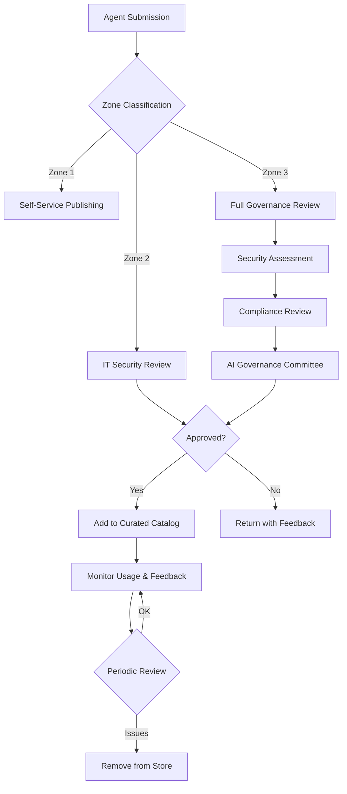

# Control 1.2: Agent Registry and Integrated Apps Management

**Control ID:** 1.2<br>
**Pillar:** Security<br>
**Regulatory Reference:** FINRA Rule 4511, FINRA Regulatory Notice 25-07, SEC Rule 17a-4(b)(4) / 17a-4(g), SOX Sections 302 / 404, GLBA 501(b), NYDFS 23 NYCRR 500.07 / 500.16 / 500.17, OCC Bulletin 2011-12, Fed SR 11-7, NIST AI RMF 1.0 GOVERN 1.4 / 1.6, FTC Safeguards Rule 16 CFR §314.4(c)<br>
**Last UI Verified:** April 2026<br>
**Governance Levels:** Baseline / Recommended / Regulated<br>

---

!!! tip "Agent 365 Architecture Update"
    **Microsoft Agent 365 / Agent 365 admin surfaces remain rollout- and preview-dependent as of April 2026.** Use them as an additional governance surface where available, but continue to reconcile Entra app objects, Integrated Apps, Copilot Studio, and the authoritative inventory in [Control 3.1](../pillar-3-reporting/3.1-agent-inventory-and-metadata-management.md) until tenant parity is verified.

## Objective

Establish a governed registration and ownership model for AI agents, integrated apps, service principals, managed identities, and related non-human identities so the organization can trace who approved them, what permissions they hold, where they are published, and how they are supervised throughout their lifecycle.

---

## Why This Matters for FSI

- **FINRA Rule 4511 + SEC Rule 17a-4(b)(4) / 17a-4(g):** A governed agent/app registry supports compliance with books-and-records obligations by preserving approval, ownership, consent, and lifecycle evidence for AI-enabled business activity.
- **FINRA Regulatory Notice 25-07:** As firms modernize workplace tooling and retain AI-generated business records, they should be able to identify the registered app or agent, its sponsor, and its approval trail.
- **SOX Sections 302 / 404:** Finance-touching agents should have named ownership, controlled permissions, and documented approval evidence to support access-control attestations.
- **GLBA 501(b) + FTC Safeguards Rule 16 CFR §314.4(c):** App inventory, least-privilege consent, and sponsor accountability help protect customer information and support periodic risk assessment.
- **NYDFS 23 NYCRR 500.07 / 500.16 / 500.17:** Controlled registration aids privilege management, incident investigation, and breach-response readiness for AI-connected applications.
- **OCC Bulletin 2011-12 + Fed SR 11-7 + NIST AI RMF GOVERN 1.4 / 1.6:** Higher-risk AI capabilities should be cataloged, attributable, reviewable, and subject to ongoing governance.

---

!!! info "No companion solution by design"
    Not all controls have a companion solution in [FSI-AgentGov-Solutions](https://github.com/judeper/FSI-AgentGov-Solutions); solution mapping is selective by design. This control is operated via native Microsoft admin surfaces and verified by the framework's assessment-engine collectors. See the [Solutions Index](../../reference/solutions-index.md#coverage-scope) for the catalog and coverage scope.

!!! info "License Requirements (verify before implementation)"
    - **Microsoft 365 Copilot** — needed for Microsoft 365 admin center Copilot / Agents / Integrated Apps governance surfaces and first-party declarative agent management.
    - **Microsoft Entra ID P1 / P2** — P1 supports Conditional Access prerequisites; P2 / Governance SKU is needed for access reviews, lifecycle workflows, and stronger ownership recertification patterns.
    - **Microsoft Entra Workload ID Premium** — recommended for workload identity Conditional Access, service principal governance, and richer non-human identity controls.
    - **Defender for Cloud Apps** — recommended for discovery of shadow / unsanctioned app activity and investigation support.
    - **Purview Compliance / Audit** — recommended for evidence retention, examiner-ready exports, and investigation support.
    - **Graph permissions matrix** — document the approved delegated / application permissions required for `/applications`, `/servicePrincipals`, audit access, and automation scripts.
    - **Power Platform admin tier / Copilot Studio administrative access** — required for environment-scoped registration, sharing, and publish governance.

!!! warning "Sovereign Cloud Parity (verify at deploy time)"
    | Surface | Commercial | GCC | GCC High | DoD |
    |---|---|---|---|---|
    | **Microsoft Entra Agent ID** | Preview / rolling | Limited preview / verify | Verify | Verify |
    | **Integrated Apps (Microsoft 365 admin center)** | GA | GA / verify rollout | Verify | Verify |
    | **App consent workflow** | GA | GA | GA / verify UX parity | GA / verify UX parity |
    | **Service principal sign-in audit** | GA | GA | GA | GA |
    | **Defender for Cloud Apps discovery** | GA | Rolling / verify | Limited / verify | Verify |
    | **Power Platform Copilot Studio registration** | GA | GA / verify feature scope | Verify | Verify |
    | **Agent 365 Admin Center** | Preview / rolling | Limited / verify | Verify | Verify |

    Treat any cross-cloud gap as a **compensating-control conversation**, not an assumption of feature parity.

## Control Description

This control governs the **agent identity and registration plane** for AI agents and integrated applications. It is the foundational sister to [Control 3.1 - Agent Inventory and Metadata Management](../pillar-3-reporting/3.1-agent-inventory-and-metadata-management.md), which handles the reporting and system-of-record inventory layer.

A governed deployment should be traceable across one or more of the following registration surfaces:

1. **Microsoft Entra Agent ID**
2. **Integrated Apps in the Microsoft 365 admin center**
3. **Power Platform Copilot Studio agent registration**
4. **Microsoft Graph `/applications` and `/servicePrincipals`**
5. **Microsoft 365 Copilot declarative agent manifest registration**
6. **MCP server registration via Entra App Registration**
7. **Agent 365 Admin Center (preview)**

Registration is not complete until the organization can identify the app or agent, its **Agent Sponsor**, **Agent Owner**, **Backup Owner**, approved business purpose, zone, permission set, and review cadence. Where Entra Agent ID preview is unavailable, the underlying Entra app registration or service principal should be used as the identity anchor and documented as the compensating control.

---

## Key Configuration Points

- Restrict **user consent** and enable an **admin consent workflow** for higher-risk or externally sourced apps.
- Require **publisher verification** or document a compensating review when the publisher cannot be verified.
- Assign a named **Agent Owner** for every registration and a **Backup Owner** for all Zone 2 / Zone 3 agents.
- Minimize Graph and connector permission scopes; maintain a documented **Graph permissions matrix** for every approved high-privilege scope.
- Apply **Conditional Access for workload identities / service principals** where supported, especially for Zone 3 or finance-touching agents.
- Review **service principal sign-in risk**, anomalous token use, and credential changes on a documented cadence.
- Prefer **certificate-based authentication** or **managed identities** over client secrets; if secrets are used, enforce rotation and expiry monitoring.
- Establish an **app registration approval workflow** before production publishing or tenant-wide deployment.
- Run a recurring **ownerless-app / stale-owner remediation** process and escalate unresolved exceptions to [Control 3.6](../pillar-3-reporting/3.6-orphaned-agent-detection-and-remediation.md).
- Maintain an **Integrated Apps allow/block list** aligned to approved publishers, zones, and business use cases.

### Registration Surface Minimum Metadata

The registration plane for this control spans multiple Microsoft surfaces. Capture at least the following evidence for each one in use:

| Surface | Evidence to capture | Minimum governance expectation |
|---|---|---|
| **Microsoft Entra Agent ID** | Agent ID / object ID, sponsor, owner, backup owner, lifecycle state | Use as the identity anchor where preview is available |
| **Integrated Apps in the Microsoft 365 admin center** | App/agent name, publisher, deployment scope, approval state | Review org-wide versus scoped deployment and maintain allow/block decisions |
| **Power Platform Copilot Studio** | Environment, agent name, owner, connectors/actions, sharing model | Tie publication to managed environments and DLP posture |
| **Microsoft Graph `/applications`** | App ID, owners, requested permissions, credential type and expiry | Treat as the authoritative programmatic source for app-registration evidence |
| **Microsoft Graph `/servicePrincipals`** | Enterprise app object ID, consent state, sign-in activity, CA/workload identity policy | Use for runtime identity, audit, and ownerless-app review |
| **M365 Copilot declarative agent manifest** | Manifest package/version, permissions requested, reviewer | Retain the manifest or package hash with the approval record |
| **MCP server via Entra App Registration** | Endpoint, auth mode, approved tools, sponsor, network boundary | Treat MCP-connected tools as external integration risk and apply least privilege |
| **Agent 365 Admin Center (preview)** | Preview visibility status, discovered metadata, exception notes | Use as additive evidence until parity is verified |

### Sponsorship Integration

Every Zone 2 and Zone 3 registration should include a named **Agent Sponsor**, an operational **Agent Owner**, and a **Backup Owner**. Use the supplemental playbook [Sponsorship Lifecycle Workflows](../../playbooks/control-implementations/1.2/sponsorship-lifecycle-workflows.md) to operationalize sponsor attestation, sponsor departure handling, and reassignment.

---

## Agent 365 Unified Registry

!!! warning "Preview / rollout note (April 2026)"
    Microsoft Agent 365 admin-center capabilities continue to vary by tenant, cloud, and rollout ring. Treat the unified registry as a helpful discovery and operations surface where available, not as the only authoritative record for registration governance.

Use Agent 365 data to cross-check what is visible in Entra app objects, service principals, Integrated Apps, and Copilot Studio. If a tenant does not yet expose the preview or exposes only partial metadata, document the gap as a compensating control and continue to rely on the primary registration evidence sources above.

---

## Agent Store Governance

The Microsoft 365 Agent Store provides a curated catalog of agents available to users within the organization. FSI organizations should implement governance controls over the Agent Store to help limit discoverability to approved agents and to document any pilot or preview exceptions.

### Agent Store Configuration

**Portal Path:** Microsoft 365 Admin Center > Settings > Agent settings > Agent Store

| Setting | Zone 1 | Zone 2 | Zone 3 | Description |
|---------|--------|--------|--------|-------------|
| **Store visibility** | Enabled | Enabled | Restricted | Control whether users can browse the Agent Store |
| **Third-party agents** | Allowed with consent | IT approval required | Blocked or pre-approved only | Control access to non-Microsoft agents |
| **Custom agent publishing** | Self-service | Approval required | AI Governance Committee approval | Control who can publish to the store |
| **Agent ratings/reviews** | Enabled | Enabled | Moderated | Allow user feedback on agents |

### Curation Workflow

Organizations should establish an Agent Store curation process:



> :inbox_tray: **Download diagram:** [PNG](../../images/diagrams/1-2-agent-registry-and-integrated-apps-management-curation-w.png) | [SVG](../../images/diagrams/1-2-agent-registry-and-integrated-apps-management-curation-w.svg)

### Curation Criteria

| Criterion | Zone 2 Threshold | Zone 3 Threshold |
|-----------|------------------|------------------|
| **Security scan** | Automated scan pass | Automated + manual review |
| **Data classification** | Internal or below | Compliance-approved data sources only |
| **Connector review** | Standard connectors | Premium connectors require justification |
| **Sponsor assignment** | Required | Required + backup sponsor |
| **Business justification** | Brief description | Full business case with ROI |
| **Testing evidence** | Functional testing | Functional + UAT + security testing |

### Agent Store Visibility Controls

Control which agents appear in the store for different user groups:

```powershell
# Pseudocode: Configure agent store visibility by security group
# Note: Verify current cmdlet names against Agent 365 Admin PowerShell documentation

# Get current store settings
$storeSettings = Get-M365AgentStoreSettings

# Configure visibility for Zone 3 users
$zone3Config = @{
    TargetGroup = "sg-zone3-agent-users"
    AllowThirdParty = $false
    AllowCustomAgents = $true
    RequireApproval = $true
    ApprovalGroup = "sg-ai-governance-committee"
}

# Apply configuration
Set-M365AgentStoreVisibility @zone3Config
```

### Curated Catalog Categories

Organize approved agents into discoverable categories:

| Category | Description | Governance Level |
|----------|-------------|------------------|
| **IT-Approved** | Agents reviewed and approved by IT security | Zone 2+ |
| **Compliance-Verified** | Agents validated for regulatory requirements | Zone 3 |
| **Department-Specific** | Agents curated for specific business units | Zone 2+ |
| **Pilot/Preview** | Agents in evaluation phase with limited distribution | Restricted |
| **Deprecated** | Agents scheduled for retirement (visible but discouraged) | All zones |

### Store Monitoring

Monitor Agent Store activity for governance insights:

| Metric | Alert Threshold | Action |
|--------|----------------|--------|
| **Unapproved agent requests** | >5/week | Review demand; consider fast-track approval |
| **Third-party agent installs** | Any (Zone 3) | Immediate review |
| **Low-rated agents** | <3 stars average | Review for quality issues |
| **Unused curated agents** | No usage in 90 days | Consider removal |
| **Shadow agent submissions** | Agents bypassing curation | Enforce publishing controls |

### Agent 365 Registry: Agent Type Categories and Enhanced Visibility

The Agent 365 registry formalizes Microsoft's official taxonomy for agent types visible in the M365 admin center. The following categories are the authoritative classification scheme for the current Agent 365 experience and supersede any earlier informal categorization used in this framework.

#### Official Microsoft Agent Type Categories

| Agent Type | Description | Registration Mechanism | Governance Zone |
|---|---|---|---|
| Microsoft agents | Built and maintained by Microsoft, such as Researcher, Analyst, and People agent | Automatically registered with no admin action required | Not individually governable through standard agent controls |
| External partner-built agents | Agents built by trusted non-Microsoft developers and ISVs | Appear in Integrated Apps and require admin approval to deploy | Zone 2 minimum |
| Shared by creator | Agents created and shared by individual users or developers inside the organization | Self-service creation; appear in the registry upon sharing | Zone 1 / Zone 2 |
| Published by org | Custom agents approved and published by the organization for broader organizational use | Requires admin approval workflow | Zone 2 / Zone 3 |

!!! note "Researcher and Analyst governance exception"
    Microsoft 365 Copilot's **Researcher** and **Analyst** first-party agents are classified as **Microsoft agents** in the registry. They are first-party Microsoft experiences that inherit Microsoft 365 security, privacy, and compliance controls. They coexist with agents and abide by agent governance capabilities, but they do not fall under the standard agent-related settings used for custom or partner agents. Governance of these agents is handled through the Copilot control system. Document this exception in the agent inventory for examiner awareness. See **Control 2.24** for the feature-governance exception and **Control 2.25** for Researcher with Computer Use administration.

#### Shadow Agents: Updated Terminology

!!! warning "Terminology update - Microsoft now uses 'shadow agent' officially"
    The term **shadow agent** is now Microsoft's official terminology for unregistered agents that lack a Microsoft Entra Agent ID. Earlier versions of this framework described shadow agent as a framework-specific term; that note should be retired anywhere it still appears.

**Shadow agents** are agents discovered in the tenant inventory outside normal governed registration. Because they may lack a registered Entra identity, shadow agents can bypass identity-based governance controls including Conditional Access policies, Identity Protection monitoring, and lifecycle management workflows.

Shadow agents are surfaced in the Agent 365 registry with a distinct visual indicator. Administrators can take the following actions directly from the registry:

- **Quarantine**: Block the shadow agent from accessing tenant identities and resources until it is reviewed and either registered or decommissioned
- **Investigate**: Drill into discovered capabilities, data connections, and originating user
- **Register**: Initiate an Entra Agent ID provisioning request to bring the agent into the governed identity framework

#### Agent Metadata: Data & Tools Tab

For custom agents, the following metadata is available in the admin center under **Agents > All Agents > [Select Agent] > Data & tools**:

| Metadata Field | Description | Governance Use |
|---|---|---|
| Agent capabilities | Declared functional capabilities of the agent | Assess scope of agent permissions during review |
| Data sources | OneDrive and SharePoint files or sites, plus Graph connectors accessed by the agent | Data residency and sensitivity classification input |
| Custom actions | External API connections and custom action definitions | Third-party integration risk assessment |

!!! note
    The Data & tools tab is available for **custom agents only**. Microsoft first-party agents, including Researcher and Analyst, do not expose this metadata view in the admin center.

#### Agent Inventory Export for Compliance

The agent registry provides a direct export capability for compliance documentation and examination evidence.

**Export Path:**

```text
M365 admin center
  > Agents
    > All Agents
      > Export
```

The export produces a structured file containing agent name, publisher, agent type, status, owner, and created date for all agents in the tenant inventory. This export is a primary examination evidence artifact for demonstrating agent inventory completeness. Capture and retain exports at minimum on the following cadence:

- Monthly for Zone 1 agents
- Weekly for Zone 2 agents
- Daily for Zone 3 agents

Retain exports in the compliance document management system with appropriate version history.

!!! info
    For analytics, trend reporting, and usage metrics built on registry data, see **Control 3.13 - Agent 365 Admin Center Analytics and Reporting**.

---

## Zone-Specific Requirements

| Zone | Requirement | Rationale |
|------|-------------|-----------|
| **Zone 1** (Personal) | Capture, in the active registration plane, at minimum: agent/app name, creator or owner, registration surface used, business purpose, and last review date. External publisher use is recommended to be pre-approved or blocked by default. | Lower-risk experimentation still needs attributable ownership and basic evidence. |
| **Zone 2** (Team) | Capture the Zone 1 set **plus** Agent Sponsor, Agent Owner, Backup Owner, environment/tenant, permission scopes, consent type, publisher-verification state, data classification, and approval ticket/reference for each registration plane in use. Review at least weekly. | Shared agents increase blast radius and require repeatable approval evidence. |
| **Zone 3** (Enterprise) | Capture the full Zone 2 set **plus** appId / objectId / servicePrincipalId, auth mode (managed identity / certificate / secret), credential expiry, Conditional Access or compensating-control reference, sign-in audit evidence, DfCA discovery status, sovereign cloud boundary, and sponsor attestation history. Review daily or via automation. | Customer-, finance-, or regulator-facing agents require examiner-ready traceability and rapid investigation support. |

---

## Roles & Responsibilities

| Role | Responsibility |
|------|----------------|
| Entra Global Admin | Used only for tenant-wide defaults, initial admin consent, or preview gates that lower-privilege roles cannot yet perform; time-box via Entra PIM and record justification. |
| Entra App Admin | Manages app registrations, enterprise apps, service principal ownership, credentials, and permission review for agent-backed applications. |
| Entra Identity Governance Admin | Configures access reviews, ownership attestation, lifecycle workflows, and ownerless-app remediation cadence. |
| Entra Agent ID Admin | Manages Entra Agent ID registrations, sponsor assignment, and agent identity lifecycle where the feature is available. |
| AI Administrator | Oversees Microsoft 365 Copilot / Agents / Integrated Apps governance surfaces and publication settings in the Microsoft 365 admin center. |
| Power Platform Admin | Governs Copilot Studio environments, connector posture, agent sharing, and publish workflows. |
| Entra Security Admin | Reviews risky or anomalous service principal sign-ins and supports Defender for Cloud Apps discovery and investigation workflows. |
| Purview Compliance Admin | Supports evidence retention, audit readiness, and alignment with records-management requirements for regulated agents. |
| Agent Sponsor | Approves business justification, attests continued need, and accepts accountability for the governed agent. |
| Agent Owner | Maintains configuration, metadata accuracy, and evidence for the assigned registration. |
| Backup Owner | Provides continuity when the primary owner is unavailable or departs. |
| Compliance Officer | Reviews regulatory alignment, exception handling, and examination evidence. |

---

## Related Controls

| Control | Relationship |
|---------|--------------|
| [1.4 - Advanced Connector Policies (ACP)](1.4-advanced-connector-policies-acp.md) | Connector governance constrains the external tools and actions available to registered agents and integrated apps. |
| [1.7 - Comprehensive Audit Logging and Compliance](1.7-comprehensive-audit-logging-and-compliance.md) | Audit logs provide the evidence trail for app registration changes, consent, sign-ins, and owner updates. |
| [1.10 - Communication Compliance Monitoring](1.10-communication-compliance-monitoring.md) | Shared and published agents may enter supervisory-review scope; the registry provides the accountable identity context. |
| [1.19 - eDiscovery for Agent Interactions](1.19-ediscovery-for-agent-interactions.md) | Registration metadata helps legal and compliance teams scope the correct app, owner, and content locations during investigations. |
| [1.21 - Adversarial Input Logging](1.21-adversarial-input-logging.md) | Identity-aware registration improves attribution when prompts, tool calls, or attack attempts must be tied back to a specific governed agent. |
| [1.23 - Step-Up Authentication for AI Agent Operations](1.23-step-up-authentication-for-agent-operations.md) | Sensitive admin actions on agents and app registrations should use stronger authentication and fresh session controls. |
| [1.24 - Defender AI Security Posture Management (AI-SPM)](1.24-defender-ai-security-posture-management.md) | Defender and DfCA discovery help identify shadow or risky agents that should be reconciled with the governed registry. |
| [2.1 - Managed Environments](../pillar-2-management/2.1-managed-environments.md) | Power Platform environment structure shapes where Copilot Studio registrations are allowed and how they are tiered. |
| [2.5 - Testing, Validation, and Quality Assurance](../pillar-2-management/2.5-testing-validation-and-quality-assurance.md) | Agents and app integrations should be tested before publication or permission elevation. |
| [3.1 - Agent Inventory and Metadata Management](../pillar-3-reporting/3.1-agent-inventory-and-metadata-management.md) | Sister control: 1.2 governs registration and identity; 3.1 governs the authoritative inventory and reporting layer. |
| [3.6 - Orphaned Agent Detection and Remediation](../pillar-3-reporting/3.6-orphaned-agent-detection-and-remediation.md) | Detects ownerless or departed-owner agents/apps that should be remediated through this control's sponsorship workflow. |
| [3.11 - Centralized Agent Inventory Enforcement](../pillar-3-reporting/3.11-centralized-agent-inventory-enforcement.md) | Enforces registration as a prerequisite for broader production use and ongoing metadata completeness. |

---

## Implementation Playbooks

!!! info "Step-by-Step Implementation"

    This control has detailed playbooks for implementation, automation, testing, and troubleshooting:

    - [Portal Walkthrough](../../playbooks/control-implementations/1.2/portal-walkthrough.md) — Step-by-step portal configuration
    - [PowerShell Setup](../../playbooks/control-implementations/1.2/powershell-setup.md) — Automation scripts
    - [Verification & Testing](../../playbooks/control-implementations/1.2/verification-testing.md) — Test cases and evidence collection
    - [Troubleshooting](../../playbooks/control-implementations/1.2/troubleshooting.md) — Common issues and resolutions
    - [Sponsorship Lifecycle Workflows](../../playbooks/control-implementations/1.2/sponsorship-lifecycle-workflows.md) — Sponsor attestation, departure handling, backup-owner assignment, and reassignment workflow

---

## Verification Criteria

Confirm control effectiveness by verifying:

1. Every Zone 2 and Zone 3 agent or integrated app has a documented **AgentID or AppID/ObjectID**, named **Agent Owner**, and **Backup Owner**.
2. No production service principal, managed identity, or app-connected agent lacks a named **Agent Sponsor** and approval reference.
3. High-privilege Graph, connector, or API permissions have a documented business justification and least-privilege review record.
4. Admin consent settings are configured as intended, and risky or external app requests route through the documented approval workflow.
5. Publisher verification is present for third-party apps where available, or a compensating exception record exists.
6. Credentials are certificate-based or managed-identity-based where possible; any remaining client secrets have valid expiry dates and documented rotation evidence.
7. Service principal sign-ins appear in Entra audit/sign-in logs and are reviewed on the required cadence for anomalous behavior.
8. Conditional Access for workload identities or an equivalent compensating control is applied for supported Zone 3 / finance-touching agents.
9. The Integrated Apps allow/block list matches the approved registry and no unresolved unapproved org-wide deployments remain.
10. Defender for Cloud Apps or an equivalent discovery surface is reviewed for shadow / unsanctioned app activity, and unresolved findings are escalated.
11. Sponsor attestation and ownerless-app remediation evidence is complete and reconciled with [Control 3.1](../pillar-3-reporting/3.1-agent-inventory-and-metadata-management.md) and [Control 3.6](../pillar-3-reporting/3.6-orphaned-agent-detection-and-remediation.md).
12. Sovereign-cloud capability gaps are documented with a compensating-control statement before the control is attested as fully implemented.

---

## Additional Resources

!!! note "April 2026 validation reminder"
    Microsoft continues to ship agent identity and admin-center changes quickly. Re-verify preview / GA status in your tenant before relying on a single portal as the only evidence source.

- [Microsoft Learn: App objects and service principals in Microsoft Entra ID](https://learn.microsoft.com/en-us/entra/identity-platform/app-objects-and-service-principals)
- [Microsoft Learn: Configure the admin consent workflow](https://learn.microsoft.com/en-us/entra/identity/enterprise-apps/configure-admin-consent-workflow)
- [Microsoft Learn: Configure user consent to applications](https://learn.microsoft.com/en-us/entra/identity/enterprise-apps/configure-user-consent)
- [Microsoft Learn: Conditional Access for workload identities](https://learn.microsoft.com/en-us/entra/identity/conditional-access/workload-identity)
- [Microsoft Learn: Managed identities for Azure resources overview](https://learn.microsoft.com/en-us/entra/identity/managed-identities-azure-resources/overview)
- [Microsoft Learn: Manage Integrated Apps in Microsoft 365 admin center](https://learn.microsoft.com/en-us/microsoft-365/admin/manage/manage-addins-in-the-admin-center)
- [Microsoft Learn: Copilot Studio administration overview](https://learn.microsoft.com/en-us/microsoft-copilot-studio/administer/environments-overview)
- [Microsoft Learn: Microsoft Graph application resource type](https://learn.microsoft.com/en-us/graph/api/resources/application)
- [Framework Role Catalog](../../reference/role-catalog.md)
- [Framework Regulatory Mappings](../../reference/regulatory-mappings.md)
- [Agent Identity Architecture](../../framework/agent-identity-architecture.md)

---

*Updated: April 2026 | Version: v1.4.0 | UI Verification Status: Current*
