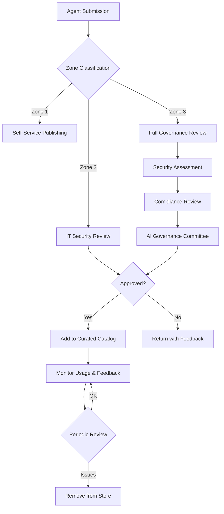

# Control 1.2: Agent Registry and Integrated Apps Management

**Control ID:** 1.2<br>
**Pillar:** Security<br>
**Regulatory Reference:** FINRA 4511, SEC 17a-3/4, OCC 2011-12<br>
**Last UI Verified:** February 2026<br>
**Governance Levels:** Baseline / Recommended / Regulated<br>
**Last Verified:** 2026-02-03

---

!!! tip "Agent 365 Architecture Update"
    Agent 365 Unified Registry (preview) offers a future architecture that consolidates all agent types -- Copilot Studio, Agent Builder, Microsoft Foundry, and SharePoint agents -- into a single registry with automatic discovery, rich metadata, and Graph API export. This replaces manual consolidation of per-platform inventories. See [Unified Agent Governance](../../framework/agent-identity-architecture.md) for registry comparison and migration guidance.

## Objective

Maintain a comprehensive inventory of all AI agents deployed across the organization, tracking ownership, data access, approval status, and lifecycle to support regulatory examination readiness and governance oversight.

---

## Why This Matters for FSI

- **FINRA 4511:** Requires books and records for all electronic systems including AI agents
- **SEC 17a-3/4:** Record-keeping requirements for broker-dealers extend to AI systems
- **OCC 2011-12:** Model inventory mandate for AI/ML systems in banks
- **Fed SR 11-7:** Comprehensive inventory of models with risk ratings
- **Examination Readiness:** Enables rapid response to regulatory inquiries about AI deployments

---

!!! info "No Automation Solution"
    No companion automation solution is currently available for this control. See the [Solutions Index](../../framework/solutions-integration.md) for the full catalog of available solutions.


## Control Description

This control establishes a centralized registry for tracking all AI agents across Microsoft 365 and Power Platform environments. The registry captures essential metadata including ownership, business purpose, data sources, connectors, approval status, and review schedule. Combined with Integrated Apps management in the M365 Admin Center, organizations can maintain complete visibility into agent deployments.

The registry serves as the authoritative source for agent governance, enabling:

1. **Inventory Management** - Know what agents exist and where they are deployed
2. **Ownership Accountability** - Track responsible individuals for each agent
3. **Approval Tracking** - Document governance approvals and risk assessments
4. **Lifecycle Management** - Monitor review schedules and decommissioning
5. **Audit Readiness** - Provide immediate response capability for examinations

---

## Key Configuration Points

- Create SharePoint list with required metadata schema (Agent ID, Owner, Zone, Data Sources, Approval Status)
- Configure M365 Integrated Apps visibility and user consent settings
- Configure Agent 365 settings in Microsoft 365 Admin Center (agent types, sharing controls, templates, user access)
- Configure Agent Store curation and visibility settings
- Implement automated discovery to detect unregistered agents
- Establish approval workflow requiring registration before publishing
- Configure review schedule notifications (quarterly for enterprise, monthly for customer-facing)
- Define orphaned agent detection and remediation process

### M365 Admin Center Agent Registry Enhancements

The M365 Admin Center agent registry at **Copilot** > **Agents & connectors** > **Agents** now provides enhanced metadata and governance capabilities:

- **Rich agent metadata:** Registry displays agent type, current status, owner, last modified date, and **risk level** (sourced from Entra-based risk signals) for each registered agent
- **Governance templates:** Organizational governance templates can be applied during agent activation, helping maintain consistent security and compliance standards across all agents
- **Creation source tracking:** Agent metadata includes the creation source — Copilot Studio, Agent Builder, SharePoint, or third-party — enabling platform-specific governance workflows
- **Programmatic access:** Microsoft Graph API provides programmatic access to agent inventory data, supporting automated compliance reporting and integration with GRC tools
- **Ownership management:** Registry supports ownership reassignment and ownerless agent identification, helping address continuity risks when staff depart

---

## Agent 365 Unified Registry (Preview)

!!! info "Preview Feature - Frontier Program"
    Agent 365 provides a unified registry across all agent types within the Microsoft 365 admin center. Organizations enrolled in Microsoft's Frontier program can evaluate this preview capability now. Expect changes before general availability.

The current implementation of Control 1.2 uses a combination of platform-specific inventories (Power Platform environments, Copilot Studio, SharePoint) and custom SharePoint lists for centralized tracking. **Agent 365 unified registry** offers a future architecture that consolidates all agent types into a single governance view:

**What Agent 365 Unified Registry Adds:**

- **Single view of ALL agent types** — Copilot Studio, Agent Builder (formerly Microsoft Copilot agents), SharePoint Agents, third-party agents, and open-source agents appear in one registry
- **Rich metadata with usage analytics** — View exception rates, last update dates, deployment status, and usage patterns across all agents
- **Lifecycle actions from a central location** — Block, delete, update, or reassign agents without navigating to individual platforms
- **Security integration** — Microsoft Defender for Cloud Apps flags high-risk agents; Purview DLP status shows data protection policy enforcement; Conditional Access policies display agent identity compliance

**Migration Path:**

Organizations currently using platform-specific registries (Pillar 3 reporting + custom SharePoint lists) can transition incrementally to the Agent 365 unified registry. The unified registry provides richer metadata and cross-platform visibility than per-platform inventories.

**See also:** [Agent 365 Architecture](../../framework/agent-identity-architecture.md) for unified governance migration guidance, zone classification alignment, and integration with existing Control 1.2 registry implementations.

---

## Agent Store Governance

The Microsoft 365 Agent Store provides a curated catalog of agents available to users within the organization. FSI organizations should implement governance controls over the Agent Store to ensure only approved agents are discoverable.

### Agent Store Configuration

**Portal Path:** Microsoft 365 Admin Center > Settings > Agent settings > Agent Store

| Setting | Zone 1 | Zone 2 | Zone 3 | Description |
|---------|--------|--------|--------|-------------|
| **Store visibility** | Enabled | Enabled | Restricted | Control whether users can browse the Agent Store |
| **Third-party agents** | Allowed with consent | IT approval required | Blocked or pre-approved only | Control access to non-Microsoft agents |
| **Custom agent publishing** | Self-service | Approval required | AI Governance Committee approval | Control who can publish to the store |
| **Agent ratings/reviews** | Enabled | Enabled | Moderated | Allow user feedback on agents |

### Curation Workflow

Organizations should establish an Agent Store curation process:



> :inbox_tray: **Download diagram:** [PNG](../../images/diagrams/1-2-agent-registry-and-integrated-apps-management-curation-w.png) | [SVG](../../images/diagrams/1-2-agent-registry-and-integrated-apps-management-curation-w.svg)

### Curation Criteria

| Criterion | Zone 2 Threshold | Zone 3 Threshold |
|-----------|------------------|------------------|
| **Security scan** | Automated scan pass | Automated + manual review |
| **Data classification** | Internal or below | Compliance-approved data sources only |
| **Connector review** | Standard connectors | Premium connectors require justification |
| **Sponsor assignment** | Required | Required + backup sponsor |
| **Business justification** | Brief description | Full business case with ROI |
| **Testing evidence** | Functional testing | Functional + UAT + security testing |

### Agent Store Visibility Controls

Control which agents appear in the store for different user groups:

```powershell
# Example: Configure agent store visibility by security group
# Note: Verify current cmdlet availability - Agent 365 Admin PowerShell is in preview

# Get current store settings
$storeSettings = Get-M365AgentStoreSettings

# Configure visibility for Zone 3 users
$zone3Config = @{
    TargetGroup = "sg-zone3-agent-users"
    AllowThirdParty = $false
    AllowCustomAgents = $true
    RequireApproval = $true
    ApprovalGroup = "sg-ai-governance-committee"
}

# Apply configuration
Set-M365AgentStoreVisibility @zone3Config
```

### Curated Catalog Categories

Organize approved agents into discoverable categories:

| Category | Description | Governance Level |
|----------|-------------|------------------|
| **IT-Approved** | Agents reviewed and approved by IT security | Zone 2+ |
| **Compliance-Verified** | Agents validated for regulatory requirements | Zone 3 |
| **Department-Specific** | Agents curated for specific business units | Zone 2+ |
| **Pilot/Preview** | Agents in evaluation phase with limited distribution | Restricted |
| **Deprecated** | Agents scheduled for retirement (visible but discouraged) | All zones |

### Store Monitoring

Monitor Agent Store activity for governance insights:

| Metric | Alert Threshold | Action |
|--------|----------------|--------|
| **Unapproved agent requests** | >5/week | Review demand; consider fast-track approval |
| **Third-party agent installs** | Any (Zone 3) | Immediate review |
| **Low-rated agents** | <3 stars average | Review for quality issues |
| **Unused curated agents** | No usage in 90 days | Consider removal |
| **Shadow agent submissions** | Agents bypassing curation | Enforce publishing controls |

---

## Zone-Specific Requirements

| Zone | Requirement | Rationale |
|------|-------------|-----------|
| **Zone 1** (Personal) | Basic inventory; monthly updates; minimal metadata | Low risk, self-service with guardrails |
| **Zone 2** (Team) | Full metadata schema; weekly updates; team lead + IT approval | Shared data access requires accountability |
| **Zone 3** (Enterprise) | Real-time inventory; full audit trail; AI Governance Committee approval; 7–10 year retention | Customer-facing, regulatory examination risk |

---

## Roles & Responsibilities

| Role | Responsibility |
|------|----------------|
| Power Platform Admin | Manage environments, run discovery scripts, configure settings |
| AI Administrator | Manage agent registry and Copilot agent approvals (delegated) |
| AI Governance Lead | Define metadata schema, approval workflow, review schedule |
| Compliance Officer | Validate regulatory alignment, review audit evidence |
| Agent Owners | Maintain accurate registry entries, complete reviews on schedule |
| SharePoint Admin | Configure registry list, permissions, automation |

---

## Related Controls

| Control | Relationship |
|---------|--------------|
| [1.1 - Restrict Agent Publishing](1.1-restrict-agent-publishing-by-authorization.md) | Publishing restrictions ensure registry compliance |
| [2.1 - Managed Environments](../pillar-2-management/2.1-managed-environments.md) | Environment structure informs zone classification |
| [3.1 - Agent Inventory Reporting](../pillar-3-reporting/3.1-agent-inventory-and-metadata-management.md) | Registry feeds inventory reporting |
| [3.6 - Orphaned Agent Detection](../pillar-3-reporting/3.6-orphaned-agent-detection-and-remediation.md) | Registry enables orphan detection |

---

## Implementation Playbooks

!!! info "Step-by-Step Implementation"

    This control has detailed playbooks for implementation, automation, testing, and troubleshooting:

    - [Portal Walkthrough](../../playbooks/control-implementations/1.2/portal-walkthrough.md) — Step-by-step portal configuration
    - [PowerShell Setup](../../playbooks/control-implementations/1.2/powershell-setup.md) — Automation scripts
    - [Verification & Testing](../../playbooks/control-implementations/1.2/verification-testing.md) — Test cases and evidence collection
    - [Troubleshooting](../../playbooks/control-implementations/1.2/troubleshooting.md) — Common issues and resolutions

---

## Verification Criteria

Confirm control effectiveness by verifying:

1. All discovered agents appear in the registry (compare PowerShell discovery with SharePoint list)
2. Published agents are visible in M365 Admin Center Integrated Apps
3. User consent settings prevent unauthorized agent deployment
4. Automated discovery detects and alerts on unregistered agents
5. Review notifications are sent on schedule for upcoming reviews

---

## Additional Resources

- [Microsoft Learn: Agent settings in Microsoft 365 Admin Center](https://learn.microsoft.com/en-us/microsoft-365/admin/manage/agent-settings)
- [Microsoft Learn: Manage Integrated Apps in M365](https://learn.microsoft.com/en-us/microsoft-365/admin/manage/manage-addins-in-the-admin-center)
- [Microsoft Learn: Copilot Studio Overview](https://learn.microsoft.com/en-us/microsoft-copilot-studio/fundamentals-what-is-copilot-studio)
- [Microsoft Learn: Power Platform Admin PowerShell](https://learn.microsoft.com/en-us/power-platform/admin/powerapps-powershell)
- [Microsoft Learn: Microsoft Graph API for Apps](https://learn.microsoft.com/en-us/graph/api/resources/application)

### Agent Identity & Blueprint Registration (Preview)

!!! warning "Preview Notice"
    Microsoft Agent 365 SDK and Agent Essentials are in limited preview (Frontier program). Verify feature availability and GA timelines before implementing production controls dependent on these capabilities. Expect changes before general availability.

- [Microsoft Learn: Agent 365 Blueprint Registration (Preview)](https://learn.microsoft.com/en-us/microsoft-agent-365/developer/registration) - Formal agent registration process for enterprise governance
- [Microsoft Learn: Microsoft Entra Agent ID](https://learn.microsoft.com/en-us/entra/agent-id/) - Agent identity management for registry integration
- [Agent Identity Architecture](../../framework/agent-identity-architecture.md) - Framework guidance on Agent ID vs. Blueprint approaches

---

*Updated: February 2026 | Version: v1.3 | UI Verification Status: Current*
