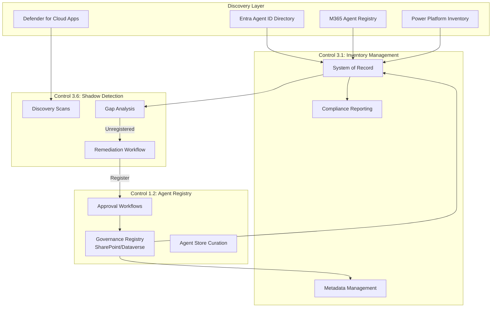

# Control 3.1: Agent Inventory and Metadata Management

**Control ID:** 3.1<br>
**Pillar:** Reporting<br>
**Regulatory Reference:** FINRA 4511, SEC 17a-3/4, SOX 404, GLBA 501(b), NYDFS Part 500<br>
**Last UI Verified:** February 2026<br>
**Governance Levels:** Baseline / Recommended / Regulated<br>
**Last Verified:** 2026-02-03

---

!!! info "Agent 365 Architecture Update"
    Agent 365 Unified Registry provides a single source of truth for all agent types, reducing reliance on manual inventory consolidation from multiple admin portals. The registry supports automatic discovery, rich metadata, and Graph API export for compliance reporting. See [Unified Agent Governance](../../framework/agent-identity-architecture.md) for registry capabilities and migration guidance.

## Objective

Maintain a comprehensive inventory of all AI agents across the organization to demonstrate regulatory compliance, ensure proper oversight, track ownership, and respond to regulatory examinations.

---

## Why This Matters for FSI

- **FINRA 4511:** Requires maintaining books and records of all AI systems used in business operations
- **SEC 17a-3/4:** Mandates documentation of systems processing customer data with retention requirements
- **SOX 404:** Inventory of systems in financial reporting is essential for internal controls documentation
- **GLBA 501(b):** Tracking systems accessing customer information supports the Safeguards Rule
- **NYDFS Part 500 §500.13:** Requires asset inventory including owner, location, classification, support expiration, and RTO. RPO, criticality tier, and backup compliance status are FSI recommended fields for operational resilience (not minimum regulatory requirements).

---

!!! tip "Automation Available"
    See [Compliance Dashboard](https://github.com/judeper/FSI-AgentGov-Solutions/tree/main/compliance-dashboard) in FSI-AgentGov-Solutions for aggregated compliance reporting across all 71 framework controls with zone-based filtering.


## Control Description

This control establishes a comprehensive agent inventory practice using both the Power Platform Admin Center (PPAC) inventory and the M365 Admin Center Agent Registry. Financial institutions must monitor both sources since they track different agent types.

!!! info "Power Platform Inventory (GA)"
    The **Power Platform Inventory** feature is generally available at **PPAC > Manage > Inventory**. Organizations should be aware of current limitations:

    - **~15-minute refresh cycle** - Inventory data refreshes approximately every 15 minutes ([Learn source](https://learn.microsoft.com/en-us/power-platform/admin/copilot/copilot-hub)); newly created or modified agents may not appear immediately
    - **500-agent display limit** - PPAC portal displays up to 500 agents; larger tenants must use PowerShell or Azure Resource Graph for complete enumeration
    - **Deleted agent visibility** - Deleted agents may remain visible for up to 48 hours after deletion
    - **Metadata availability** - Some metadata fields may not populate until the next refresh cycle

The control distinguishes between a **system of record** (the authoritative inventory register used for audit and reporting) and **discovery sources** (portals and exports used to find and validate what exists). A canonical AgentID should be assigned at registration and used as the immutable join key across systems.

For NYDFS Part 500-covered entities, inventory records must include recovery objectives (RTO/RPO), criticality tier, support expiration dates, and backup compliance status.

---

## Key Configuration Points

- Access Power Platform inventory at PPAC > Manage > Inventory for Copilot Studio agents, apps, and flows in a unified view
- Access M365 Agent Registry at admin.microsoft.com > Copilot > Agents & connectors > Agents for declarative agents
- Use **Export Inventory** in the M365 Admin Center to download agent inventory as CSV for audit evidence and compliance reporting
- Establish a system of record (SharePoint list or GRC tool) as the authoritative register
- Assign a canonical AgentID that remains immutable throughout agent lifecycle
- Perform weekly reconciliation between discovery sources and system of record
- Compute SHA-256 hashes for all inventory exports to ensure evidence integrity
- Monitor the **Risks column** in M365 Admin Center agent inventory for Entra-based risk alerts surfaced per agent
- Review ownerless agents using the **Manage Ownerless** action in M365 Admin Center to identify and remediate agents without active owners
- Cross-reference agent usage analytics from Copilot Hub for activity-based inventory enrichment (see [Control 3.8 - Copilot Hub and Governance Dashboard](3.8-copilot-hub-and-governance-dashboard.md))

### Programmatic Inventory Access

For tenants exceeding the 500-agent portal display limit, use Azure Resource Graph for complete enumeration:

```kusto
// Azure Resource Graph query for Power Platform agent inventory
resources
| where type =~ 'Microsoft.PowerPlatform/environments'
| extend environmentName = name
| join kind=leftouter (
    resources
    | where type =~ 'Microsoft.PowerPlatform/environments/components'
    | where properties.componentType == 'agent'
    | extend agentName = name, agentId = properties.agentId
) on $left.id == $right.properties.environmentId
| project environmentName, agentName, agentId, properties
```

**PowerShell Alternative:**

```powershell
# Complete agent enumeration via Power Platform Admin PowerShell
$environments = Get-AdminPowerAppEnvironment
foreach ($env in $environments) {
    Get-AdminPowerApp -EnvironmentName $env.EnvironmentName |
        Where-Object { $_.Properties.appType -eq "Agent" }
}
```

!!! tip "Quality Monitoring as Inventory Metadata"
    Organizations can track agent quality trends over time using Copilot Studio's evaluation framework (step 8 — Comparative Monitoring), supporting ongoing compliance monitoring. Consider including evaluation scores or quality metrics as recommended inventory metadata fields to provide a holistic view of each agent's operational health alongside ownership and classification data. Sequential evaluation comparisons help identify quality regressions that may warrant inventory status changes or agent lifecycle actions. See [Control 2.18 - Automated Conflict of Interest Testing](../pillar-2-management/2.18-automated-conflict-of-interest-testing.md) for evaluation methodology details.

---

## Zone-Specific Requirements

| Zone | Requirement | Rationale |
|------|-------------|-----------|
| **Zone 1** (Personal) | Monthly inventory review with basic metadata (owner, environment, dates); document exceptions for personal agents | Reduces risk from personal use while keeping friction low |
| **Zone 2** (Team) | Weekly inventory with extended metadata (purpose, data sources, approvals); require identified owner and approval trail | Shared agents increase blast radius; controls must be consistently applied |
| **Zone 3** (Enterprise) | Daily inventory reviews with comprehensive metadata (risk, validation, regulatory mapping); enforce via policy | Enterprise agents handle sensitive content and are highest audit risk |

---

## Roles & Responsibilities

| Role | Responsibility |
|------|----------------|
| Power Platform Admin | Access and export Power Platform inventory; configure environment visibility |
| AI Administrator | Copilot agent inventory and metadata management |
| Entra Global Reader | Review inventory for compliance purposes without modification rights |
| AI Governance Lead | Define inventory governance policy; establish metadata requirements |
| Compliance Officer | Review inventory for regulatory examination readiness; validate completeness |

---

## Unified Agent Visibility Architecture

Three FSI-AgentGov controls work together to provide complete agent visibility across the organization. Understanding this relationship helps organizations implement comprehensive governance.



> :inbox_tray: **Download diagram:** [PNG](../../images/diagrams/3-1-agent-inventory-and-metadata-management-unified-agent-vi.png) | [SVG](../../images/diagrams/3-1-agent-inventory-and-metadata-management-unified-agent-vi.svg)

### Control Relationship Summary

| Control | Primary Function | Data Flow |
|---------|------------------|-----------|
| **[1.2 - Agent Registry](../pillar-1-security/1.2-agent-registry-and-integrated-apps-management.md)** | Governance registration and approval | Receives approved agents; feeds inventory |
| **3.1 - Agent Inventory** (this control) | Authoritative system of record | Aggregates all discovery sources |
| **[3.6 - Orphaned Agent Detection](3.6-orphaned-agent-detection-and-remediation.md)** | Gap identification and remediation | Compares inventory vs. registry; triggers remediation |

### How the Controls Work Together

1. **Registration (Control 1.2):** New agents must be registered with metadata, owner, and approval status before publishing
2. **Inventory (Control 3.1):** All agents—registered and discovered—are tracked in the authoritative inventory
3. **Shadow Detection (Control 3.6):** Periodic scans compare discovered agents against registered agents; gaps trigger remediation
4. **Remediation Loop:** Unregistered agents are either registered (Control 1.2), transferred, or decommissioned

This unified architecture supports compliance with regulatory inventory requirements by:

- ✅ No agent operates without governance oversight
- ✅ Shadow agents are detected and addressed
- ✅ Regulatory examinations can be answered from a single source of truth
- ✅ Orphaned agents (no owner) are remediated before becoming compliance risks

---

## Related Controls

| Control | Relationship |
|---------|--------------|
| [1.2 - Agent Registry](../pillar-1-security/1.2-agent-registry-and-integrated-apps-management.md) | Governance registration feeds inventory |
| [2.1 - Managed Environments](../pillar-2-management/2.1-managed-environments.md) | Enables advanced governance features for inventory tracking |
| [2.2 - Environment Groups](../pillar-2-management/2.2-environment-groups-and-tier-classification.md) | Provides environment classification for inventory categorization |
| [3.2 - Usage Analytics](3.2-usage-analytics-and-activity-monitoring.md) | Monitors activity for agents in inventory |
| [3.3 - Compliance Reporting](3.3-compliance-and-regulatory-reporting.md) | Compliance Dashboard aggregates inventory metadata ([Compliance Dashboard](https://github.com/judeper/FSI-AgentGov-Solutions/tree/main/compliance-dashboard)) |
| [3.6 - Orphaned Agent Detection](3.6-orphaned-agent-detection-and-remediation.md) | Remediates unowned agents discovered in inventory |

---

## Implementation Playbooks

!!! info "Step-by-Step Implementation"

    This control has detailed playbooks for implementation, automation, testing, and troubleshooting:

    - [Portal Walkthrough](../../playbooks/control-implementations/3.1/portal-walkthrough.md) — Step-by-step portal configuration
    - [PowerShell Setup](../../playbooks/control-implementations/3.1/powershell-setup.md) — Automation scripts
    - [Verification & Testing](../../playbooks/control-implementations/3.1/verification-testing.md) — Test cases and evidence collection
    - [Troubleshooting](../../playbooks/control-implementations/3.1/troubleshooting.md) — Common issues and resolutions

---

## Verification Criteria

Confirm control effectiveness by verifying:

1. Power Platform inventory at PPAC > Manage > Inventory displays all known environments, agents, apps, and flows
2. M365 Agent Registry shows declarative agents and extensions with risk level indicators
3. System of record contains all agents with required metadata fields
4. Orphaned agents (missing valid owners) are identified and documented via Manage Ownerless workflow
5. Weekly inventory exports are retained with SHA-256 hash verification
6. Export-to-CSV from M365 Admin Center produces complete agent inventory data
7. Agent usage analytics from Copilot Hub are cross-referenced with inventory records

---

## Additional Resources

- [Microsoft Learn: Copilot Hub - Agent Inventory](https://learn.microsoft.com/en-us/power-platform/admin/copilot/copilot-hub)
- [Microsoft Learn: Defender for Cloud Apps - AI Agent Inventory (Preview)](https://learn.microsoft.com/en-us/defender-cloud-apps/ai-agent-inventory)
- [Microsoft Learn: Manage Copilot agents in Integrated Apps](https://learn.microsoft.com/en-us/microsoft-365/admin/manage/manage-copilot-agents-integrated-apps)
- [Microsoft Learn: Power Platform Admin Center overview](https://learn.microsoft.com/en-us/power-platform/admin/admin-documentation)
- [Microsoft Learn: PowerShell for Power Platform Administrators](https://learn.microsoft.com/en-us/power-platform/admin/powershell-getting-started)

### Agent Essentials Checklist Guidance (Preview)

!!! warning "Preview Notice"
    Microsoft Agent 365 SDK and Agent Essentials are in limited preview (Frontier program). Verify feature availability and GA timelines before implementing production controls dependent on these capabilities. Expect changes before general availability.

Microsoft's Agent Deployment Checklist includes inventory requirements across 8 categories:

- **Category 6 (Inventory & Lifecycle)** provides specific inventory fields and review cadences
- Blueprint registration adds metadata fields for governance tracking

- [Microsoft Learn: Agent Deployment Checklist (Preview)](https://learn.microsoft.com/en-us/copilot/microsoft-365/agent-essentials/m365-agents-checklist) - Comprehensive inventory guidance in Category 6

### Environment Provisioning Registration

For automatic registration of new environments in the inventory system:

- [Environment Lifecycle Management](../../playbooks/advanced-implementations/environment-lifecycle-management/index.md) - New environments are logged with full metadata for inventory tracking

---

*Updated: February 2026 | Version: v1.2 | UI Verification Status: Current*
