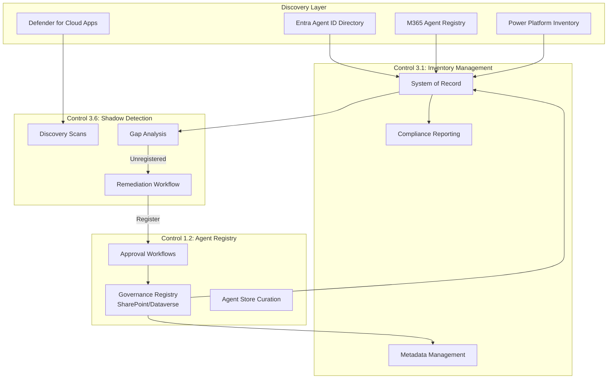

# Control 3.1: Agent Inventory and Metadata Management

**Control ID:** 3.1<br>
**Pillar:** Reporting<br>
**Regulatory Reference:** FINRA Rule 4511, FINRA RN 24-09 + Rule 3110, SEC 17a-4(b)(4), SOX Sections 302/404, GLBA 501(b), NYDFS Part 500.16 / 500.17, OCC Bulletin 2026-13 (formerly OCC Bulletin 2011-12) / Fed SR 26-2 (formerly SR 11-7), NIST AI RMF 1.0 GOVERN 1.6, FTC Safeguards Rule 16 CFR §314<br>
**Last UI Verified:** May 2026<br>
**Governance Levels:** Baseline / Recommended / Regulated<br>

---

!!! info "Agent 365 Architecture Update"
    **Microsoft Agent 365** is Microsoft's cross-cloud control plane for agent identity, lifecycle, observability, and registry functions. As of May 2026, capability and cloud availability still vary by tenant and service rollout, and enablement still requires at least one user to be assigned a qualifying Microsoft Agent 365 license or bundled entitlement. Treat Agent 365 as an additional discovery and governance surface—not a replacement for the organization’s authoritative inventory register—until parity is verified. See [Unified Agent Governance](../../framework/agent-identity-architecture.md) for capability mapping and migration guidance.

## Objective

Maintain an authoritative inventory of all AI agents across the organization to support examination response, help evidence ownership and oversight, track lifecycle state, and aid reconciliation across Microsoft discovery surfaces.

---

## Why This Matters for FSI

- **FINRA Rule 4511 + SEC 17a-4(b)(4):** The agent inventory supports the firm’s books-and-records posture by providing a defensible register of AI assets, owners, approval state, and evidence references.
- **FINRA RN 24-09 / Rule 3110 (March 2025):** Firms should be able to enumerate, supervise, and explain their use of generative AI tools; an incomplete inventory weakens that supervisory story.
- **SOX Sections 302/404:** Any agent that influences finance, controllership, disclosure drafting, reconciliations, or ICFR workflows should appear in the controls inventory with named ownership and review evidence.
- **OCC Bulletin 2026-13 (formerly OCC Bulletin 2011-12) / Fed SR 26-2 (formerly SR 11-7):** Higher-risk or finance-touching AI capabilities should be present in the model / use-case inventory and subject to ongoing monitoring and periodic review.
- **GLBA 501(b) + FTC Safeguards Rule 16 CFR §314:** Asset inventory is a foundational safeguard for systems that access or process customer information.
- **NYDFS Part 500.16 / 500.17:** Covered entities should be able to enumerate relevant cyber assets and document ownership, classification, and response context for higher-risk AI systems.
- **NIST AI RMF 1.0 GOVERN 1.6:** Maintaining a current inventory of AI systems is a core governance baseline.

---

!!! tip "Automation Available"
    See [Compliance Dashboard](https://github.com/judeper/FSI-AgentGov-Solutions/tree/main/compliance-dashboard) in FSI-AgentGov-Solutions for aggregated compliance reporting across the framework control catalog with zone-based filtering.

!!! info "License Requirements"
    - **Microsoft 365 Copilot** — required for the Microsoft 365 admin center Copilot / Agents inventory surfaces and related first-party agent governance features.
    - **Microsoft Copilot Studio / Power Platform admin access** — required for PPAC environment-scoped agent inventory and export workflows.
    - **Microsoft Agent 365** — generally available in Commercial as of May 2026, but enablement still requires at least one user to be assigned a qualifying Microsoft Agent 365 license or bundled entitlement. Verify per-cloud availability before relying on it as a primary evidence source.
    - **Supplemental monitoring surfaces** such as preview discovery views should be treated as additive, not as the only system of record.
    - **Microsoft Graph and CLI automation** rely on the underlying service entitlements and appropriate admin permissions already in scope.

    Re-verify SKU and preview availability at deploy time against current Microsoft Learn licensing guidance and your tenant Message Center.


!!! warning "Sovereign Cloud Parity (verify at deploy time)"
    | Capability / Surface | Commercial | GCC | GCC High | DoD |
    |---|---|---|---|---|
    | Microsoft 365 admin center Agents / Agent Registry | GA | GA / verify feature rollout | Verify | Verify |
    | Power Platform admin center Copilot / Copilot agents surfaces | GA | Rolling / verify | Verify | Verify |
    | Microsoft Agent 365 admin center | GA (May 1, 2026) — enablement requires at least one user assigned a qualifying Microsoft Agent 365 license or bundled entitlement | Limited / verify SKU availability | Verify availability | Verify availability |
    | Programmatic agent inventory APIs / exports | Rolling / verify | Verify | Verify | Verify |

    Treat any parity gap as a **compensating-control conversation**, not an assumption of feature equivalence across clouds.

## Control Description

This control establishes an authoritative agent inventory practice across the Microsoft 365 admin center (**Copilot > Agents / Inventory**), the Power Platform admin center (**Resources > Copilot agents** plus Copilot Hub reporting), the emerging **Entra Agent Registry / Agent ID** plane, and **Microsoft Agent 365** observability where available. No single Microsoft surface is complete on its own; FSI organizations should reconcile all discovery sources into one examiner-ready system of record.

!!! info "Power Platform Inventory (GA)"
    The **Power Platform Inventory** feature is generally available at **PPAC > Manage > Inventory**. Organizations should be aware of current limitations:

    - **~20-minute refresh window** - Inventory data is refreshed automatically; changes to an agent typically appear within 20 minutes ([Microsoft Copilot Studio Agent inventory](https://learn.microsoft.com/microsoft-copilot-studio/admin-agent-inventory)); newly created or modified agents may not appear immediately
    - **~1,000-resource display limit per type** - PPAC inventory shows up to 1,000 resources of each type at a time ([Microsoft Learn](https://learn.microsoft.com/power-platform/admin/power-platform-inventory)); larger inventories require filtering or programmatic enumeration via the `PowerPlatformResources` Azure Resource Graph table or PowerShell
    - **Deleted agent visibility** - Deleted agents may remain visible for up to 48 hours after deletion
    - **Metadata availability** - Some metadata fields may not populate until the next refresh cycle

The control distinguishes between a **system of record** (the authoritative inventory register used for audit and reporting) and **discovery sources** (portals and exports used to find and validate what exists). A canonical AgentID should be assigned at registration and used as the immutable join key across systems.

For NYDFS Part 500-covered entities, inventory records must include recovery objectives (RTO/RPO), criticality tier, support expiration dates, and backup compliance status.

### Canonical Inventory Metadata Schema

| Metadata Field | Minimum expectation for the system of record |
|---|---|
| **AgentID** | Immutable unique identifier used across portals, exports, and evidence packages |
| **Display Name / Agent Type** | Human-readable name plus agent type (Copilot Studio, declarative, connected / partner, Microsoft-provided, other) |
| **Owner / Backup Owner** | Named accountable owner and backup owner; backup owner is required for Zone 2 and Zone 3 |
| **Business Justification** | Short statement of purpose, approved use case, and business sponsor |
| **Zone** | Zone 1 / 2 / 3 classification |
| **Data Classification** | Firm taxonomy for data handled or grounded on |
| **Regulatory Scope** | Whether the agent is in scope for FINRA communications, SOX ICFR, GLBA, Reg BI, privacy, or other supervisory regimes |
| **Approval Record** | CAB / ticket / GRC / exception reference and approval date |
| **Lifecycle State** | Draft, In Review, Approved, Active, Deprecated, or Decommissioned |
| **Last Reviewed / Next Review Due** | Review cadence evidence and next required governance date |
| **Connected Knowledge Sources** | Sites, libraries, files, external knowledge, or embedded content used for grounding |
| **Connected Actions / Connectors / Apps** | Approved actions, connectors, plugins, connected apps, and auth mode |
| **Foundation Model / Runtime** | Model family or runtime in use, where known and relevant |
| **Effective Sensitivity Label** | Record the highest effective label where Microsoft applies label inheritance or labeled content is involved |
| **DLP Policy Mapping** | Linked DLP policy, monitoring control, or approved exception |
| **Sovereign Cloud Boundary** | Commercial / GCC / GCC High / DoD plus residency caveat where relevant |
| **Evidence Reference** | Export hash, evidence package ID, or storage location for retained inventory snapshots |

---

## Key Configuration Points

- Access environment-scoped inventory in **Power Platform admin center** and review **Resources > Copilot agents** plus the **Copilot** area for usage and management context.
- Access organization-wide agent inventory in **Microsoft 365 admin center** at **admin.microsoft.com > Copilot > Agents / Inventory** for declarative, shared, published, and Microsoft-provided agents.
- Use inventory exports and admin-center details as **discovery evidence**, then reconcile them into a separate **system of record** (SharePoint list, Dataverse table, CMDB, or GRC tool).
- Assign a canonical **AgentID** that remains immutable throughout the lifecycle and serves as the join key across portals, exports, tickets, and evidence.
- Record the required metadata fields for every agent: **Owner, Backup Owner, Business Justification, Zone, Data Classification, Regulatory Scope, Last Reviewed, Next Review Due, Approval Record, Connected Knowledge Sources, Connected Actions/Connectors, Connected Apps/Plugins, Foundation Model, DLP Mapping, effective sensitivity label, and Sovereign Cloud Boundary**.
- Perform at least **weekly reconciliation** between discovery sources and the system of record; use higher cadence for Zone 3.
- Compute **SHA-256 hashes** for inventory exports used as audit evidence and retain the evidence ID with the inventory snapshot.
- Review **ownerless, departed-owner, dormant, and unapproved shared agents** as part of the inventory operating cadence and route exceptions to [Control 3.6 - Orphaned Agent Detection](3.6-orphaned-agent-detection-and-remediation.md).
- Cross-reference usage analytics from Copilot Hub and related reports for activity-based inventory enrichment (see [Control 3.8 - Copilot Hub and Governance Dashboard](3.8-copilot-hub-and-governance-dashboard.md)).

### Programmatic Inventory Access

For tenants that exceed the inventory page's display window (PPAC shows up to 1,000 resources of each type at a time per the [inventory page documentation](https://learn.microsoft.com/power-platform/admin/power-platform-inventory)), use the Power Platform inventory feed in Azure Resource Graph for complete enumeration. The query targets the `PowerPlatformResources` table — the standard `resources` table does not contain Power Platform agent records. Power Platform inventory must be enabled in the tenant before the table is populated.

```kusto
// Azure Resource Graph query for Copilot Studio agent inventory.
// Runs against the PowerPlatformResources table (Power Platform inventory),
// not the standard `resources` table.
// Source: https://learn.microsoft.com/power-platform/admin/inventory-schema
//         https://learn.microsoft.com/power-platform/admin/power-platform-inventory
PowerPlatformResources
| where type == "microsoft.copilotstudio/agents"
| extend properties = parse_json(properties)
| extend
    environmentId = tostring(properties.environmentId),
    agentName     = tostring(name),
    createdBy     = tostring(properties.createdBy),
    lastModified  = tostring(properties.lastModified)
| project environmentId, agentName, createdBy, lastModified, properties
| order by lastModified desc
```

**PowerShell Alternative:**

```powershell
# Complete agent enumeration via Power Platform Admin PowerShell
$environments = Get-AdminPowerAppEnvironment
foreach ($env in $environments) {
    Get-AdminPowerApp -EnvironmentName $env.EnvironmentName |
        Where-Object { $_.Properties.appType -eq "Agent" }
}
```

!!! tip "Quality Monitoring as Inventory Metadata"
    Organizations can track agent quality trends over time using Copilot Studio's evaluation framework (step 8 — Comparative Monitoring), supporting ongoing compliance monitoring. Consider including evaluation scores or quality metrics as recommended inventory metadata fields to provide a holistic view of each agent's operational health alongside ownership and classification data. Sequential evaluation comparisons help identify quality regressions that may warrant inventory status changes or agent lifecycle actions. See [Control 2.18 - Automated Conflict of Interest Testing](../pillar-2-management/2.18-automated-conflict-of-interest-testing.md) for evaluation methodology details.

---

### Lifecycle State Machine

| State | Minimum governance requirement | Inventory implication |
|---|---|---|
| **Draft** | Named owner and business justification assigned | Track as not yet approved for end-user access |
| **In Review** | Approval workflow started and metadata substantially complete | Capture reviewer / approver evidence |
| **Approved** | Governance, compliance, and technical checks complete | Eligible for controlled activation |
| **Active** | Deployed and monitored | Included in reconciliation, orphan detection, and reporting |
| **Deprecated** | New use blocked or discouraged; migration plan documented | Remain in inventory until retirement is complete |
| **Decommissioned** | Access removed, connectors disabled, and disposition documented | Retain the inventory record and supporting evidence for the applicable books-and-records period |

## Zone-Specific Requirements

| Zone | Requirement | Rationale |
|------|-------------|-----------|
| **Zone 1** (Personal) | Monthly inventory review with minimum metadata: owner, business justification, environment, lifecycle state, and last review date; document exceptions for personal agents | Reduces risk from personal use while keeping friction low |
| **Zone 2** (Team) | Weekly inventory reconciliation with named **owner and backup owner**, approval record, data classification, connected knowledge sources, and connector/action inventory | Shared agents increase blast radius; controls must be consistently applied |
| **Zone 3** (Enterprise) | Daily or automated reconciliation with full metadata set, regulatory scope, DLP mapping, effective sensitivity label, validation status, and orphan/dormancy review; enforce via policy and exception workflow | Enterprise agents handle sensitive content and are highest audit risk |

---

## Roles & Responsibilities

| Role | Responsibility |
|------|----------------|
| Power Platform Admin | Access and export Power Platform environment-scoped inventory; manage visibility across environments and Copilot Studio surfaces |
| AI Administrator | Day-to-day Microsoft 365 Copilot agent inventory review, metadata governance, and admin-center reporting |
| Entra Agent ID Admin | Review and manage Entra-side agent identity registrations and related metadata where Agent ID is in use |
| Entra Global Reader | Read-only review of inventory and reporting evidence without modification rights |
| Entra Global Admin | Required only where tenant-wide or Agent 365 administrative access still depends on this role; use Entra PIM for time-bound elevation |
| Agent Owner | Maintain the business justification, metadata accuracy, review cadence, and exception status for the assigned agent |
| AI Governance Lead | Define inventory governance policy, required metadata schema, and reconciliation cadence |
| Compliance Officer | Review inventory completeness and evidence readiness for supervisory, audit, and examination use |

---

## Unified Agent Visibility Architecture

Three FSI-AgentGov controls work together to provide complete agent visibility across the organization. Understanding this relationship helps organizations implement comprehensive governance.



> :inbox_tray: **Download diagram:** [PNG](../../images/diagrams/3-1-agent-inventory-and-metadata-management-unified-agent-vi.png) | [SVG](../../images/diagrams/3-1-agent-inventory-and-metadata-management-unified-agent-vi.svg)

### Control Relationship Summary

| Control | Primary Function | Data Flow |
|---------|------------------|-----------|
| **[1.2 - Agent Registry](../pillar-1-security/1.2-agent-registry-and-integrated-apps-management.md)** | Governance registration and approval | Receives approved agents; feeds inventory |
| **3.1 - Agent Inventory** (this control) | Authoritative system of record | Aggregates all discovery sources |
| **[3.6 - Orphaned Agent Detection](3.6-orphaned-agent-detection-and-remediation.md)** | Gap identification and remediation | Compares inventory vs. registry; triggers remediation |

### How the Controls Work Together

1. **Registration (Control 1.2):** New agents must be registered with metadata, owner, and approval status before publishing
2. **Inventory (Control 3.1):** All agents—registered and discovered—are tracked in the authoritative inventory
3. **Shadow Detection (Control 3.6):** Periodic scans compare discovered agents against registered agents; gaps trigger remediation
4. **Remediation Loop:** Unregistered agents are either registered (Control 1.2), transferred, or decommissioned

This unified architecture supports compliance with regulatory inventory requirements by:

- ✅ No agent operates without governance oversight
- ✅ Shadow agents are detected and addressed
- ✅ Regulatory examinations can be answered from a single source of truth
- ✅ Orphaned agents (no owner) are remediated before becoming compliance risks

---

## Related Controls

| Control | Relationship |
|---------|--------------|
| [1.2 - Agent Registry](../pillar-1-security/1.2-agent-registry-and-integrated-apps-management.md) | Governance registration feeds the authoritative inventory |
| [1.19 - eDiscovery for Agent Interactions](../pillar-1-security/1.19-ediscovery-for-agent-interactions.md) | Inventory snapshots and ownership records support evidence preservation and examination response |
| [1.21 - Adversarial Input Logging](../pillar-1-security/1.21-adversarial-input-logging.md) | Higher-risk agents and incident-prone agents should be traceable back to inventory ownership and metadata |
| [2.1 - Managed Environments](../pillar-2-management/2.1-managed-environments.md) | Enables advanced governance features for inventory tracking |
| [2.2 - Environment Groups](../pillar-2-management/2.2-environment-groups-and-tier-classification.md) | Provides environment classification for inventory categorization |
| [2.5 - Testing, Validation, and Quality Assurance](../pillar-2-management/2.5-testing-validation-and-quality-assurance.md) | Validation status and approval evidence should map back to the inventory record |
| [3.2 - Usage Analytics](3.2-usage-analytics-and-activity-monitoring.md) | Monitors activity for agents in inventory |
| [3.6 - Orphaned Agent Detection](3.6-orphaned-agent-detection-and-remediation.md) | Detects departed-owner, dormant, or unowned agents discovered in inventory |
| [3.8 - Copilot Hub and Governance Dashboard](3.8-copilot-hub-and-governance-dashboard.md) | Provides dashboarding and reporting over the inventory baseline |
| [3.11 - Centralized Agent Inventory Enforcement](3.11-centralized-agent-inventory-enforcement.md) | Uses the inventory register as the enforcement baseline |
| [4.7 - Microsoft 365 Copilot Data Governance](../pillar-4-sharepoint/4.7-microsoft-365-copilot-data-governance.md) | Data-governance and oversharing posture should be linked to the same authoritative inventory record |

---

## Implementation Playbooks

!!! info "Step-by-Step Implementation"

    This control has detailed playbooks for implementation, automation, testing, and troubleshooting:

    - [Portal Walkthrough](../../playbooks/control-implementations/3.1/portal-walkthrough.md) — Step-by-step portal configuration
    - [PowerShell Setup](../../playbooks/control-implementations/3.1/powershell-setup.md) — Automation scripts
    - [Verification & Testing](../../playbooks/control-implementations/3.1/verification-testing.md) — Test cases and evidence collection
    - [Troubleshooting](../../playbooks/control-implementations/3.1/troubleshooting.md) — Common issues and resolutions

---

## Verification Criteria

Confirm control effectiveness by verifying:

1. The organization maintains a documented **system of record** for agents and can reconcile it to the current Microsoft discovery surfaces on the defined cadence.
2. Microsoft 365 admin center and Power Platform admin center inventory views are reviewed and any reconciliation gap is documented, investigated, and resolved according to the zone-based SLA.
3. **100% of Zone 3 agents** and all finance-touching or customer-facing agents have complete metadata for owner, backup owner, justification, classification, regulatory scope, approval record, lifecycle state, and review dates.
4. Ownerless, departed-owner, dormant, or unapproved shared agents are identified and routed for remediation; unresolved exceptions are tracked.
5. Inventory exports retained as evidence are hashed with **SHA-256** and linked to an evidence location or evidence package ID.
6. DLP mapping, effective sensitivity label, and connected knowledge/action inventory are recorded for higher-risk agents and spot-checked for accuracy.
7. Usage analytics from Copilot Hub and related reporting surfaces are cross-referenced with the inventory so dormant agents and untracked agents can be detected.
8. Decommissioned agents remain represented in the inventory with retirement date, owner sign-off, and retained evidence reference where applicable.

---

## Additional Resources

- [Microsoft Learn: Track, manage, and scale Copilot adoption in the Power Platform](https://learn.microsoft.com/en-us/power-platform/admin/copilot/copilot-hub)
- [Microsoft Learn: Manage agents in the Microsoft 365 admin center](https://learn.microsoft.com/en-us/microsoft-365/admin/manage/manage-copilot-agents-integrated-apps?view=o365-worldwide)
- [Microsoft Learn: Agent Registry in the Microsoft 365 admin center](https://learn.microsoft.com/en-us/microsoft-365/admin/manage/agent-registry?view=o365-worldwide)
- [Microsoft Learn: Overview of Microsoft Agent 365](https://learn.microsoft.com/en-us/microsoft-agent-365/overview)
- [Microsoft Learn: Microsoft 365 Copilot reports for IT admins](https://learn.microsoft.com/en-us/microsoft-365/copilot/microsoft-365-copilot-reports-for-admins)
- [Microsoft Learn: Power Platform admin center overview](https://learn.microsoft.com/en-us/power-platform/admin/admin-documentation)
- [Microsoft Learn: PowerShell for Power Platform administrators](https://learn.microsoft.com/en-us/power-platform/admin/powershell-getting-started)

### Agent Essentials Checklist Guidance (Preview)

!!! info "Agent 365 GA — May 2026"
    Microsoft Agent 365 reached general availability on May 1, 2026. At least one user must be assigned a qualifying Microsoft Agent 365 license or bundled entitlement to enable the service. Agent Essentials category definitions and SDK feature scope continue to mature post-GA — verify current feature availability against Microsoft Learn before implementing production controls dependent on specific Agent 365 capabilities.

Microsoft's Agent Deployment Checklist includes inventory requirements across 8 categories:

- **Category 6 (Inventory & Lifecycle)** provides specific inventory fields and review cadences
- Blueprint registration adds metadata fields for governance tracking

- [Microsoft Learn: Agent Deployment Checklist (Preview)](https://learn.microsoft.com/en-us/microsoft-365/copilot/agent-essentials/m365-agents-checklist) - Comprehensive inventory guidance in Category 6

### Environment Provisioning Registration

For automatic registration of new environments in the inventory system:

- [Environment Lifecycle Management](../../playbooks/advanced-implementations/environment-lifecycle-management/index.md) - New environments are logged with full metadata for inventory tracking

---

*Updated: June 2026 | Version: v1.6.2 | UI Verification Status: Current (re-verified May 2026)*
