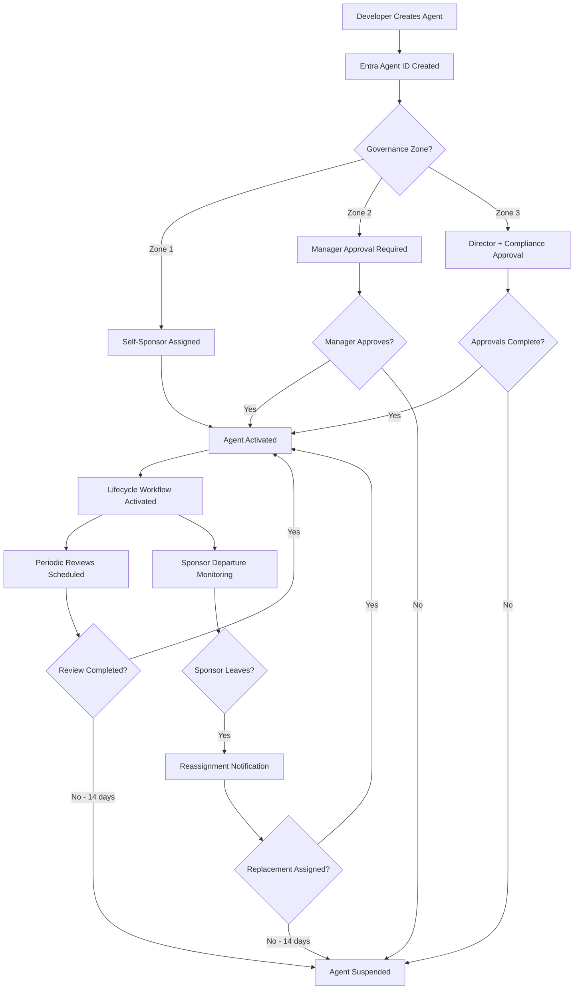
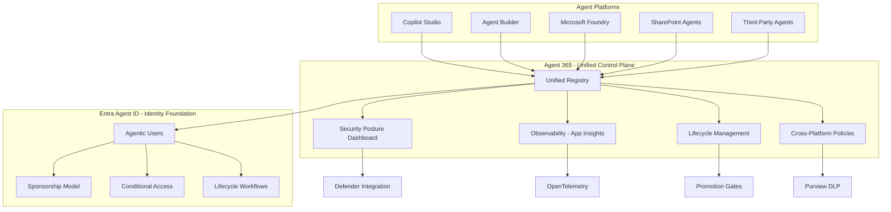

# Unified Agent Governance: Agent 365, Entra Agent ID, and Admin Center Settings

**Last Updated:** February 2026

!!! warning "Preview Features - Verify Before Implementing"
    This document covers both generally available and preview features as of February 2026. Agent 365 Unified Control Plane and Agent 365 Observability are in Frontier Preview. **Entra Agent ID** is in **Public Preview** (since November 2025). M365 Admin Center Agent Settings and Registry are generally available. **Conditional Access for agents** depends on Entra Agent ID and should be treated as preview until Entra Agent ID reaches GA. Verify current GA status at Microsoft Learn before implementing preview capabilities in production.

    **Known Limitations (February 2026):**

    - **Entra Agent ID:** Currently in **Public Preview**; do not deploy agent identity workflows in production until GA is confirmed.
    - **Declarative agent deployment:** Export/import is required for org-wide deployment; direct publish is under consideration. Admins can block or delete declarative agents but cannot deploy them org-wide from the registry.
    - **Shadow AI discovery:** Planned for post-GA using Entra and Defender capabilities, including agents hosted on non-Microsoft cloud platforms.
    - **Licensing:** Feature-to-license mappings are not finalized; current preview access may not reflect final licensing requirements.
    - **Multi-tenant API:** Not committed; Agent 365 focuses on single-tenant governance only.
    - **Agent onboarding:** Known activation bugs are being addressed; fixes are rolling out.
    - **Foundry agents:** Microsoft Foundry agents are expected to appear in the Agent 365 registry at GA.

---

## Overview

Microsoft's agent governance architecture represents a fundamental shift from per-platform management to unified control plane governance. This document provides comprehensive guidance on three interconnected capabilities that together form the foundation for FSI-compliant AI agent governance:

1. **Microsoft Entra Agent ID** - The identity service that provides authentication, lifecycle management, and human accountability for AI agents (analogous to Entra ID for users)
2. **Agent 365 Unified Control Plane** - The centralized governance platform that consolidates registry, security posture, observability, and lifecycle management across all agent types (analogous to M365 Admin Center for organizational resources)
3. **M365 Admin Center Agent Settings** - The administrative interface for configuring agent sharing controls, templates, and user access policies

Understanding the distinction between these components is critical: **Agent 365 is the control plane** (where you govern resources at scale), while **Entra Agent ID is the identity foundation** (what agents authenticate against). Agent 365 uses Entra Agent ID as its identity service, just as M365 Admin Center relies on Entra ID for user identities.

### Why This Matters for FSI Organizations

Prior to Agent 365, financial services organizations faced fragmented governance across four administrative portals:

- **Copilot Studio** agents managed in Power Platform Admin Center
- **Agent Builder** agents managed in Microsoft 365 Admin Center
- **Microsoft Foundry** agents managed in Azure Portal
- **SharePoint** agents managed in SharePoint Admin Center

This fragmentation creates compliance gaps: separate audit trails requiring manual consolidation for regulatory examinations, inconsistent policy enforcement (DLP policies in Power Platform don't apply to Agent Builder agents), and no single source of truth for agent inventory. Agent 365's unified control plane addresses these challenges by consolidating governance functions while maintaining the flexibility of multiple agent development platforms.

This document targets two audiences: **M365 administrators** implementing tactical controls and **security architects** planning strategic governance architecture. Readers are assumed to be familiar with the FSI-AgentGov framework's three governance zones and 62-control catalog. For framework fundamentals, see [Governance Fundamentals](governance-fundamentals.md) and [Zones and Tiers](zones-and-tiers.md).

---

## Entra Agent ID: Identity Foundation

Microsoft Entra Agent ID provides identity and access management specifically designed for AI agents. Unlike traditional service principals or managed identities, Entra Agent ID introduces **Agentic Users** as first-class identity objects with human sponsorship, Conditional Access policies, and lifecycle governance.

### What is an Agent Identity?

An **Agentic User** is a distinct identity type in Microsoft Entra ID, purpose-built for AI agents. This identity type represents autonomous agents that act on behalf of the organization while maintaining clear human accountability.

| Characteristic | Description |
|----------------|-------------|
| **Identity Type** | First-class identity in Entra directory (not a service principal or managed identity) |
| **Credentials** | Cannot have traditional credentials (no password, no MFA prompts) |
| **Authentication** | Uses certificate-based or managed identity authentication |
| **Licensing** | Can be assigned licenses (e.g., Copilot Studio, Microsoft 365, Agent 365) |
| **Directory Visibility** | Appears in organization directory alongside users |
| **Sponsorship** | Requires human sponsor for accountability and lifecycle governance |
| **Group Membership** | Can be added to security groups for access management |
| **Conditional Access** | Subject to Conditional Access policies like human users |

**Directory Representation:**

Agentic Users appear in Entra ID with the following attributes:

- `userType`: `"AgenticUser"` (Entra directory attribute; in token claims, agent identity is indicated by the `idtyp` claim value `user`, not a separate type)
- `accountEnabled`: `true` or `false` (for lifecycle management)
- `sponsorId`: Reference to human sponsor's Entra ID
- `agentMetadata`: Custom attributes for zone classification and governance

### Why Agentic Users Matter for FSI

- **Audit Trail** - Agentic Users provide distinct identity records in audit logs, separating agent actions from human actions (supports SEC 17a-3/4 recordkeeping)
- **Access Governance** - License assignment and group membership enable granular access control
- **Regulatory Visibility** - Examiners can query the directory to see all agents with organizational access (supports FINRA 4511 books and records)
- **Accountability Chain** - Sponsor requirement creates clear human accountability for agent behavior (aligns with FINRA 3110 supervision)

### Sponsorship Model: Human Accountability

Entra Agent ID enforces human accountability through a three-role model that separates technical administration from business oversight:

| Role | Access Level | Responsibilities | Typical Persona |
|------|--------------|------------------|------------------|
| **Owners** | Technical admin | Modify settings, credentials, re-enable agents | Developers, IT admins |
| **Sponsors** | Business oversight | Lifecycle decisions, access requests, incident response, supervision | Business owners, team leads, managers |
| **Managers** | Hierarchical view | Request access packages, view reporting agents | Organizational managers |

!!! note "New Entra RBAC Roles for Agent Identity Management"
    Microsoft has introduced two dedicated Entra RBAC roles for agent identity governance:

    - **Agent ID Administrator** — Manages the full agent identity lifecycle, including permissions, credentials, and suspension/reactivation. Intended for IT admins responsible for agent identity operations.
    - **Agent ID Developer** — Creates and manages agent identities within their assigned scope (e.g., specific environments or business units). Intended for developers building agents who need identity provisioning without full administrative rights.

    These roles complement the sponsorship model by providing fine-grained RBAC control over agent identity operations separate from business oversight.

**Separation of Concerns:**

- **Owners** provide technical control WITHOUT business decision-making authority
- **Sponsors** provide business accountability WITHOUT technical modification rights
- **Managers** provide organizational visibility WITHOUT administrative control

This separation aligns with FINRA 3110's supervision requirements: sponsors provide business oversight (supervision), while owners handle technical operations (execution). Sponsors cannot delete agents they sponsor, enforcing separation of duties for regulatory compliance.

#### Sponsor Requirements by Governance Zone

| Zone | Self-Sponsor? | Approval Required | Documentation |
|------|---------------|-------------------|---------------|
| **Zone 1 (Personal Productivity)** | Yes | None (self-sponsor) | Business justification optional |
| **Zone 2 (Team Collaboration)** | No | Manager approval | Business justification required |
| **Zone 3 (Enterprise Managed)** | No | Director + Compliance approval | Business justification + risk assessment required |

**Sponsor Limits:**

- Recommended maximum: 10 agents per sponsor (configurable by organizational policy)
- No hard technical limit enforced by Entra Agent ID
- Organizations should monitor sponsor workload during periodic reviews
- Backup sponsors recommended for Zone 3 agents to prevent disruption

### Lifecycle Workflows: Automated Governance

Entra ID Lifecycle Workflows automate sponsor-related governance activities, reducing manual overhead while ensuring continuous supervision:

#### Periodic Sponsor Reviews

| Zone | Review Frequency | Review Scope |
|------|------------------|--------------|
| **Zone 1** | Semi-annual | Sponsor confirms continued need |
| **Zone 2** | Quarterly | Sponsor + manager attestation |
| **Zone 3** | Monthly | Sponsor + compliance review of agent activity |

**Re-Attestation Workflow:**

1. Lifecycle Workflow triggers review task based on zone schedule
2. Sponsor receives attestation request via email or Teams
3. Sponsor reviews agent activity summary and confirms continued need
4. If not attested within 14 days, agent is automatically suspended
5. Compliance team notified of suspensions for regulatory tracking

#### Sponsor Departure Handling

When a sponsor leaves the organization or changes roles:

| Trigger | Action | Timeline |
|---------|--------|----------|
| Sponsor termination detected | Workflow triggers reassignment task | Immediate |
| No replacement assigned | Agent suspended (not deleted) | 14 days |
| Replacement sponsor assigned | Agent reactivated with new sponsor | Upon assignment |
| Agent in Zone 3 | Auto-suspend immediately; compliance notification | Immediate |

**Configuration Example:**

```json
{
  "displayName": "Agent sponsor departure handling",
  "isEnabled": true,
  "executionConditions": {
    "trigger": { "type": "userDeparture" },
    "scope": { "subjectType": "agentic_user_sponsor" }
  },
  "tasks": [
    {
      "taskDefinitionId": "sendNotificationToBackupSponsor",
      "arguments": [
        { "name": "messageTemplate", "value": "AgentSponsorDepartureNotification" }
      ]
    },
    {
      "taskDefinitionId": "suspendAgentIfNoAction",
      "arguments": [
        { "name": "delayInDays", "value": "14" }
      ]
    }
  ]
}
```

**Configuration Steps:**

1. Navigate to **Entra ID** > **Identity Governance** > **Lifecycle Workflows**
2. Create workflow with trigger: "Employee leaves organization"
3. Add condition: User is sponsor of Agentic User(s)
4. Configure tasks: notification to backup sponsor → escalation to manager after 7 days → suspend agent after 14 days
5. Enable workflow and monitor in Lifecycle Workflows dashboard

#### Agent Registry Activation Workflow

When an agent is registered via the Agent 365 Blueprint process, a Lifecycle Workflow triggers to activate the agent identity and establish governance tracking:

| Step | Action | Automated? |
|------|--------|------------|
| 1 | Blueprint registration creates agent record | Yes |
| 2 | Lifecycle Workflow assigns sponsor based on zone rules | Yes (Zone 1 self-sponsor) / Manual (Zone 2-3) |
| 3 | Sponsor approval received | Manual |
| 4 | Agent identity activated in Entra Agent ID | Yes (upon approval) |
| 5 | Periodic review schedule established per zone | Yes |

This workflow complements the Sponsor Departure Handling workflow by ensuring agents enter governance tracking at creation, not just when sponsors change.

#### Sponsorship Best Practices

- **Backup Sponsors** - Designate secondary sponsors for Zone 3 agents to prevent disruption
- **Sponsor Training** - Require sponsors to complete agent governance training before assignment
- **Activity Visibility** - Ensure sponsors have access to agent activity dashboards (Application Insights or Power BI)
- **Escalation Paths** - Define clear escalation procedures when sponsors are unresponsive to attestation requests

### Conditional Access Policies for Agents

Entra Agent ID extends Conditional Access to agent identities, enabling risk-based access control with agent-specific signals:

**Agent-Specific Risk Signals:**

- Agent authentication from unexpected locations
- Agent accessing resources outside declared scope
- Agent behavior anomalies detected by Defender
- Agent missing required compliance attributes

#### Policy Example 1: Block High-Risk Agent Identities

```json
{
  "displayName": "Block high-risk agent identities",
  "state": "enabled",
  "conditions": {
    "users": { "includeAgents": "all" },
    "applications": { "includeApplications": ["All"] },
    "agentRisk": { "riskLevels": ["high"] }
  },
  "grantControls": {
    "operator": "AND",
    "builtInControls": ["block"]
  }
}
```

#### Policy Example 2: Allow Only Approved Agents Using Custom Security Attributes

```json
{
  "displayName": "Allow only HR-approved agents to access HR resources",
  "state": "enabled",
  "conditions": {
    "users": {
      "includeAgents": "all",
      "excludeAgents": {
        "attributeFilter": {
          "attribute": "AgentApprovalStatus",
          "operator": "Contains",
          "value": "HR_Approved"
        }
      }
    },
    "applications": {
      "includeApplications": ["All"],
      "excludeApplications": {
        "attributeFilter": {
          "attribute": "Department",
          "operator": "Contains",
          "value": "HR"
        }
      }
    }
  },
  "grantControls": {
    "operator": "AND",
    "builtInControls": ["block"]
  }
}
```

**Recommended FSI Policies:**

1. **Block high-risk agents** - Automatically block agents with elevated risk scores
2. **Require approval for sensitive data access** - Use custom security attributes to gate access to regulated data
3. **Enforce geographic restrictions** - Block agent authentication from unauthorized locations
4. **Time-based access** - Restrict agent access to business hours for Zone 3 agents

### Entra Agent ID Architecture Flow



---

## Agent 365: Unified Control Plane

Agent 365 represents a strategic architectural shift from per-platform governance to unified control plane governance. Rather than managing agents through separate administrative portals, Agent 365 consolidates registry, security posture, observability, and lifecycle management into a single administrative experience accessed through the Microsoft 365 Admin Center.

### Architecture Comparison

#### Current State: Per-Platform Governance

| Platform | Admin Portal | Capabilities | Limitations |
|----------|--------------|--------------|-------------|
| **Copilot Studio** | Power Platform Admin Center | Environment-level DLP, connector policies, audit logs | No visibility into Agent Builder or Microsoft Foundry agents |
| **Agent Builder** | Microsoft 365 Admin Center | Agent inventory for M365 agents, publication controls | Siloed from Copilot Studio; limited cross-platform policy enforcement |
| **Microsoft Foundry** | Azure Portal | Azure RBAC, resource management, Azure Monitor integration | Separate identity model from M365/Power Platform |
| **SharePoint Agents** | SharePoint Admin Center | Site-level permissions, content governance | No unified registry with other agent types |

**Compliance Challenges:**

- **Fragmented Audit Trail** - Examiners must request evidence from 4+ portals with different log formats
- **Inconsistent Policy Enforcement** - DLP policies in Power Platform don't apply to Agent Builder agents
- **Manual Inventory Consolidation** - No single source of truth for "all agents with organizational access"
- **Delayed Incident Response** - Security teams lack unified view during investigations

#### Future State: Agent 365 Unified Control Plane

| Aspect | Current (Per-Platform) | Agent 365 (Unified) |
|--------|------------------------|---------------------|
| **Discovery** | Manual scripts across PPAC, M365 Admin Center, Azure Portal, SharePoint Admin Center | Automatic aggregation from all agent platforms |
| **Metadata** | Basic (name, owner, environment) | Rich (usage analytics, risk scores, compliance status, data sources, approval history) |
| **Audit Trail** | Separate logs per platform; manual consolidation for examinations | Unified activity log in Application Insights; single export for regulatory reporting |
| **Policy Enforcement** | DLP policies applied separately in each platform; inconsistent coverage | Cross-platform DLP enforcement via Purview; uniform policies across all agent types |
| **Compliance Reporting** | Custom PowerShell scripts to aggregate data from multiple sources | Pre-built dashboards; Graph API export; automated compliance monitoring |
| **Security Visibility** | Per-platform threat detection; manual correlation of security events | Centralized security posture dashboard with real-time policy violations and risk scores |
| **Lifecycle Management** | Per-platform approval workflows; no standardized promotion gates | Standardized promotion gates and approval workflows across agent types |

### Unified Registry

Agent 365's unified registry automatically aggregates agents from all platforms into a single inventory:

**Registry Capabilities:**

- **Automatic Discovery** - Agents registered across Copilot Studio, Agent Builder, Microsoft Foundry, SharePoint, and third-party platforms appear automatically
- **Rich Metadata** - Usage analytics, risk scores, compliance status, data sources, approval history, sponsor information
- **Graph API Export** - Compliance reporting systems can query registry via Graph API for regulatory evidence
- **Real-Time Sync** - Registry updates reflect changes in near real-time (within minutes of agent creation/modification)

**FSI Value:**

Regulatory examinations now receive a single evidence package instead of piecemeal exports from multiple portals. Examination response time reduced from days (manual consolidation) to minutes (single registry export).

### Security Posture Management

Agent 365 provides a centralized security dashboard showing misconfigurations, policy violations, and risk scores across all agent types:

**Security Posture Capabilities:**

- **Misconfiguration Detection** - Agents missing required DLP policies, sensitivity labels, or approval workflows
- **Policy Violation Alerts** - Real-time notifications when agents violate organizational policies
- **Risk Scoring** - Agents assigned risk scores based on data access, usage patterns, and compliance status
- **Defender Integration** - Security posture dashboard integrates with Microsoft Defender for threat detection

**Risk Score Factors:**

- Access to regulated data (high-risk: PII, PCI, PHI)
- External sharing enabled (high-risk for Zone 3 agents)
- Missing required governance policies (DLP, sensitivity labels)
- Unusual usage patterns detected by observability telemetry

### Observability: Application Insights Integration

Agent 365 Observability consolidates telemetry, activity logs, and performance metrics using Application Insights and OpenTelemetry standard:

**Observability Capabilities:**

- **Unified Telemetry** - All agent invocations logged with timestamp, identity, action, result, latency
- **Cross-Platform Coverage** - Copilot Studio, Agent Builder, Microsoft Foundry, Agent 365 SDK agents all telemetry in single workspace
- **OpenTelemetry Standard** - Industry-standard instrumentation enables integration with third-party monitoring tools
- **Pre-Built Dashboards** - Operational health, error diagnostics, usage analytics, compliance reporting

!!! warning "Observability SDK Mandatory for Organizational Store"
    Observability SDK integration is **mandatory** for all agents published to the organizational store. Agents without SDK instrumentation will not pass promotion gates for Zone 2 or Zone 3 deployment. This requirement supports SEC 17a-4 audit trail obligations and FINRA 3110 supervisory visibility.

**Integration with FSI-AgentGov-Solutions:**

The [Agent Observability Foundation](https://github.com/judeper/FSI-AgentGov-Solutions/tree/main/agent-observability-foundation) solution provides FSI-compliant telemetry infrastructure with SEC 17a-4 retention and FINRA supervision workbooks. Agent 365 Observability complements this solution by providing unified cross-platform telemetry ingestion.

**SEC 17a-4 Compliance Considerations:**

- Configure Application Insights retention to meet regulatory retention periods (3-6 years)
- Enable diagnostic settings export to Azure Data Lake Storage Gen2 with immutable storage
- Implement workspace access controls to prevent unauthorized log deletion

### Cross-Platform Governance

Agent 365 enables consistent governance policies across all agent types:

**Unified DLP Enforcement:**

- Purview DLP policies applied uniformly to Copilot Studio, Agent Builder, and Microsoft Foundry agents
- Single policy definition replicated across platforms automatically
- Unified deny event reporting for compliance monitoring

**Lifecycle Management:**

- Standardized promotion gates (Development → Test → Production) across agent types
- Approval workflows enforced regardless of agent platform
- Zone-based policies automatically applied based on agent classification

**Identity Governance:**

- All agents use Entra Agent ID as identity foundation
- Conditional Access policies apply uniformly across platforms
- Sponsorship model enforced consistently

### Agent 365 Control Plane Architecture



---

## M365 Admin Center: Agent Settings

The Microsoft 365 Admin Center provides administrative controls for agent sharing, templates, and user access through the **Agent Settings** interface:

### Allowed Agent Types

Administrators can configure which agent types are permitted in the organization:

**Configuration Options:**

- **Copilot Studio agents** - Allow/Block agents created in Copilot Studio
- **Agent Builder agents** - Allow/Block agents created in Agent Builder
- **Third-party agents** - Allow/Block external agents from organizations outside your tenant
- **Custom agents** - Allow/Block custom-built agents using Agent 365 SDK

**FSI Recommendation:**

- Zone 1: Allow Copilot Studio and Agent Builder (personal productivity)
- Zone 2: Allow Copilot Studio and Agent Builder; Block third-party (team collaboration)
- Zone 3: Copilot Studio only with custom template (enterprise managed)

### Sharing Controls

Control how agents can be shared within and outside the organization:

**Sharing Options:**

| Option | Description | FSI Use Case |
|--------|-------------|--------------|
| **Allow All** | Any user can share agents with anyone | Not recommended for FSI |
| **Specific Groups Only** | Only designated groups can share agents | Recommended for Zone 2 (team leads, project managers) |
| **None** | Agent sharing disabled; admins must explicitly enable per agent | Recommended for Zone 3 (full governance) |

**External Sharing:**

- **Block external sharing** for Zone 3 agents (customer-facing, regulated data access)
- **Allow external sharing with approval** for Zone 2 agents (partner collaboration with business justification)
- **Allow external sharing** for Zone 1 agents (personal productivity, non-sensitive)

### Templates: Default and Custom

Agent templates define governance policies that are automatically applied to agents at creation:

#### Default Template

Microsoft provides a default template with preselected policies that are locked and cannot be removed:

- **Sensitivity Labels** - Require agents to be classified (General, Confidential, Highly Confidential)
- **DLP Policies** - Basic DLP rules from Purview applied automatically
- **Audit Logging** - All agent invocations logged to unified audit log
- **External Sharing** - Controlled by organization's external sharing settings

Organizations can add custom policies to the default template but cannot remove Microsoft's preselected policies.

#### Custom Templates

Organizations can create custom templates for zone-specific governance:

**Custom Template Example: Zone 3 Enterprise Managed Agents**

**Portal Walkthrough:**

1. Open **Microsoft 365 Admin Center**
2. Navigate to **Agents** > **Settings** > **Template** > **Add New Template**
3. Select agent type: **"Copilot Studio agents"**
4. Provide template details:
   - Template name: "Zone 3 Enterprise Managed Agents"
   - Description: "Template for customer-facing agents with full governance"
5. Add custom policies (Microsoft's default policies are preselected and locked):
   - Require sensitivity label: **"Highly Confidential"**
   - Require DLP policy: **"FSI Data Protection"**
   - Require approval workflow: **"AI Governance Committee"**
   - Block external sharing: **Enabled**
   - Require sponsor: **Director-level or above**
6. Review and save

**Template Assignment:**

- Templates can be assigned manually to specific agents
- Templates can be set as default for agent type (all new Copilot Studio agents use Zone 3 template)
- Agents inherit template policies at creation; changes to template do not retroactively apply to existing agents

### User Access: Agent Store Visibility

Control which users can discover and install agents from the organization's agent store:

**Access Options:**

| Option | Description | FSI Use Case |
|--------|-------------|--------------|
| **All users** | Everyone can browse and install agents | Zone 1 agents only |
| **Specific groups** | Only designated groups see agent store | Recommended for Zone 2 (department-specific agents) |
| **Admin-only** | Users cannot browse agent store; admins assign agents directly | Recommended for Zone 3 (controlled deployment) |

### Agent Registry in Admin Center

View and manage registered agents directly in the Microsoft 365 Admin Center:

**Registry Capabilities:**

- **Agent Inventory** - View all agents across all platforms in unified list
- **Agent Details** - Click agent to see metadata, usage analytics, sponsor information, compliance status
- **Manual Registration** - Register third-party or custom agents that don't auto-register
- **Agent Suspension** - Administrators can manually suspend agents (separate from sponsor suspension)
- **Export** - Export agent inventory to CSV for compliance reporting

**FSI Use Case:**

Compliance teams can query the registry during examinations to demonstrate comprehensive agent inventory (FINRA 4511, OCC 2011-12 model inventory requirements).

### M365 Admin Center Agent Settings Hierarchy

```mermaid
graph TD
    A[Agent Settings Root] --> B[Allowed Agent Types]
    A --> C[Sharing Controls]
    A --> D[Templates]
    A --> E[User Access]
    A --> F[Agent Registry]

    B --> B1[Copilot Studio: Allow/Block]
    B --> B2[Agent Builder: Allow/Block]
    B --> B3[Third-Party: Allow/Block]
    B --> B4[Custom: Allow/Block]

    C --> C1[Allow All]
    C --> C2[Specific Groups Only]
    C --> C3[None - Admin Approval Required]

    D --> D1[Default Template - Microsoft Policies]
    D --> D2[Custom Templates - Zone-Specific]
    D1 --> D1A[Sensitivity Labels]
    D1 --> D1B[Basic DLP]
    D1 --> D1C[Audit Logging]
    D2 --> D2A[Zone 3: Highly Confidential + FSI DLP]
    D2 --> D2B[Zone 2: Confidential + Team DLP]
    D2 --> D2C[Zone 1: General + Basic DLP]

    E --> E1[All Users]
    E --> E2[Specific Groups]
    E --> E3[Admin-Only]

    F --> F1[View Agent Inventory]
    F --> F2[Agent Details & Metadata]
    F --> F3[Manual Registration]
    F --> F4[Suspend/Reactivate]
    F --> F5[Export to CSV]
```



---

## Migration Roadmap

Financial services organizations should adopt Agent 365 capabilities in phases, balancing early access to governance improvements with production stability requirements. This roadmap adopts a **"prepare now, migrate later"** approach with actionable steps readers can take before GA.

### Agent 365 Platform Status — February 2026

The following status reflects findings from the February 2026 governance review and Microsoft Frontier program engagement:

| Component | Status | Notes |
|-----------|--------|-------|
| **Entra Agent ID** | Public Preview | Identity service for AI agents; Agentic Users, sponsorship model, lifecycle workflows |
| **Conditional Access for Agents** | Public Preview | Depends on Entra Agent ID; agent-specific risk signals and custom security attribute policies |
| **M365 Admin Center Agent Settings** | GA | Agent sharing controls, templates, user access policies |
| **M365 Admin Center Agent Registry** | GA | Copilot Studio agents visible; Foundry agents expected at full GA; declarative agents appear but lack org-wide deployment capability |
| **Agent 365 Unified Control Plane** | Preview (Frontier) | Centralized registry, security posture, cross-platform policies |
| **Agent 365 Observability** | Preview (Frontier) | Application Insights integration, OpenTelemetry, unified telemetry |

**Key Findings:**

- **Declarative agent deployment limitations:** Administrators can view and block declarative agents in the registry, but org-wide deployment requires export/import workflows. Direct publish from the registry is under consideration but not yet available.
- **Agent registry visibility:** Copilot Studio agents are fully visible; Microsoft Foundry agents are expected to be included in the registry at GA. Declarative agents appear in the registry but with limited administrative actions compared to Copilot Studio agents.
- **Shadow AI discovery roadmap:** Microsoft plans post-GA capabilities for discovering agents hosted on non-Microsoft cloud platforms (GCP, AWS) using Entra and Defender signals.
- **Licensing caveats:** Feature-to-license mappings for Agent 365 are not finalized. Current preview access through the Frontier program may not reflect final licensing requirements. Organizations should not assume current preview entitlements will carry over to GA.
- **Multi-tenant scope:** Agent 365 is focused on single-tenant governance. Multi-tenant API support is not committed for GA.
- **Agent onboarding bugs:** Known activation issues are affecting some tenants; Microsoft is rolling out fixes. Organizations experiencing onboarding failures should contact their Frontier program representative.
- **Observability for supervision:** Agent 365 Observability integration with supervision evidence collection (supporting FINRA 3110 requirements) remains in preview. Organizations should continue using existing Application Insights solutions for production supervision evidence until Observability reaches GA.

### Phase 1: Foundation (Available Now with GA Features)

**Objective:** Establish identity governance foundation using Entra Agent ID

**Prerequisites:**

- Microsoft 365 E5 licenses (includes Entra ID P2 for Conditional Access and Lifecycle Workflows)
- Power Platform Premium capacity (for Copilot Studio agents in Managed Environments)
- Administrative access to Entra ID and M365 Admin Center

**Key Actions:**

1. **Enable Entra Agent ID** in your tenant
   - Navigate to Entra admin center > Identity Governance > Agent ID
   - Enable "Agentic User" identity type
   - Configure tenant-wide sponsorship requirements

2. **Assign human sponsors to existing agents**
   - Conduct agent inventory across all platforms (PPAC, M365 Admin Center, Azure Portal)
   - Identify business owner for each agent
   - Assign sponsors based on governance zone:
     - **Zone 1 (Personal):** Agents sponsor themselves
     - **Zone 2 (Team):** Require manager approval for sponsorship
     - **Zone 3 (Enterprise):** Require director + compliance approval

3. **Configure Entra ID Lifecycle Workflows**
   - **Periodic sponsor reviews:**
     - Monthly reviews for Zone 3 agents (customer-facing, regulated data access)
     - Quarterly reviews for Zone 2 agents (team collaboration)
     - Semi-annual reviews for Zone 1 agents (personal productivity)
   - **Sponsor departure handling:**
     - Automatic reassignment to sponsor's manager (if configured)
     - Notification sent to backup sponsor (if designated)
     - Agent suspension if no action within 14 days
     - Immediate suspension for Zone 3 agents when sponsor departs

4. **Implement Conditional Access policies** for agent authentication
   - Policy 1: Block high-risk agent identities (Agent risk = High)
   - Policy 2: Allow only approved agents to access sensitive resources (using custom security attributes)
   - Policy 3: Enforce geographic restrictions (block authentication from unauthorized locations)
   - Policy 4: Time-based access for Zone 3 agents (restrict to business hours)

5. **Configure M365 Admin Center Agent Settings**
   - Set allowed agent types based on governance zones
   - Configure sharing controls (recommend "Specific Groups Only" or "None" for Zone 2/3)
   - Create custom templates for Zone 3 agents with full governance policies

**Success Criteria:**

- All Zone 2/3 agents have assigned human sponsors with documented business justification
- Lifecycle workflows active with successful review completions (check Lifecycle Workflows dashboard)
- Conditional Access policies enforced for high-risk agent operations (validate with test agent)
- M365 Admin Center Agent Settings configured with zone-appropriate sharing controls

**Timeline:** 4-6 weeks

---

### Phase 2: Evaluation (Frontier Preview - Non-Production)

**Objective:** Evaluate Agent 365 unified registry and governance capabilities in test environments

**Prerequisites:**

- Phase 1 complete (Entra Agent ID foundation established)
- Microsoft 365 Frontier program enrollment (approval process managed by Microsoft)
- Separate test/development environments for evaluation
- Stakeholder availability for comparative analysis (compliance team, IT admins, security architects)

**Key Actions:**

1. **Enroll in Microsoft 365 Frontier program** to access Agent 365 preview features
   - Submit enrollment request through Microsoft 365 Admin Center or account team
   - Wait for approval (typically 2-4 weeks)
   - Accept preview terms and conditions

2. **Access Agent 365 preview features** through M365 Admin Center
   - Navigate to Agents > Agent 365 Preview (Frontier participants only)
   - Explore unified registry interface
   - Review security posture dashboard

3. **Register test agents** from multiple platforms in Agent 365 unified registry
   - Copilot Studio development environment agents
   - Agent Builder test agents
   - Microsoft Foundry proof-of-concept agents
   - Validate automatic discovery and registry sync

4. **Compare governance approaches** and document findings
   - **Effort comparison:** Time required for per-platform governance vs. Agent 365 unified approach
   - **Compliance reporting:** Measure time to generate regulatory evidence using Agent 365 dashboard vs. manual consolidation
   - **Security visibility:** Assess security posture improvements with unified dashboard
   - **Gap analysis:** Document unsupported agent types, missing features, integration limitations

5. **Identify gaps and limitations**
   - Document unsupported agent types or platforms (e.g., third-party agents)
   - Identify missing observability features vs. existing Application Insights solution
   - Evaluate integration with existing FSI governance workflows (ServiceNow, Azure DevOps, custom GRC systems)
   - Assess Graph API completeness for compliance reporting

6. **Provide feedback to Microsoft** through Frontier program channels
   - Submit feature requests for identified gaps
   - Report bugs or unexpected behavior
   - Share FSI-specific use cases and requirements

**Success Criteria:**

- Successfully registered agents from 3+ platforms in Agent 365 unified registry
- Documented comparison of per-platform vs. unified governance effort (quantified time savings)
- Identified gap list with workarounds or mitigation strategies
- Feedback submitted to Microsoft through Frontier program

**Timeline:** 6-8 weeks

---

### Phase 3: Adoption (Post-GA - Production)

**Objective:** Migrate production agent governance to Agent 365 as unified control plane

**Prerequisites:**

- Agent 365 general availability announcement (expected Q1-Q2 2026)
- Phase 2 evaluation complete with documented readiness
- Executive approval for production governance migration
- Compliance team sign-off on audit trail completeness

**Key Actions:**

1. **Wait for Agent 365 general availability** announcement
   - Monitor Microsoft Learn documentation for GA announcement
   - Review GA feature set and licensing model
   - Confirm support commitments and SLAs

2. **Validate GA feature set** against Phase 2 gap analysis
   - Confirm all identified gaps addressed or acceptable workarounds exist
   - Verify licensing model and cost implications (per-agent fees, capacity requirements)
   - Review Microsoft support commitments for GA features
   - Assess impact on existing FSI-AgentGov-Solutions deployments

3. **Pilot production migration** with limited scope
   - Select low-risk agent population (Zone 1 personal agents recommended)
   - Migrate selected agents to Agent 365 unified governance
   - Run parallel governance (Agent 365 + per-platform) for 30 days
   - Validate audit trail completeness (compare logs from both approaches)
   - Measure incident response time improvements

4. **Phased rollout by governance zone**
   - **Phase 3a: Zone 1 agents** (lower risk, simpler governance)
     - Timeline: Weeks 1-4
     - Success metric: 100% Zone 1 agents in Agent 365 registry
   - **Phase 3b: Zone 2 agents** (team collaboration agents)
     - Timeline: Weeks 5-10
     - Success metric: Team-level governance policies enforced via Agent 365
   - **Phase 3c: Zone 3 agents** (enterprise managed with full regulatory requirements)
     - Timeline: Weeks 11-16
     - Success metric: Full compliance reporting via Agent 365 dashboard

5. **Sunset per-platform governance processes** once Agent 365 coverage complete
   - Archive per-platform PowerShell scripts and manual procedures
   - Update runbooks and SOPs to reference Agent 365 unified approach
   - Decommission legacy agent registry (SharePoint lists, custom databases)
   - Update compliance team procedures for regulatory examinations

**Success Criteria:**

- All agents registered in Agent 365 unified registry (100% coverage)
- Compliance reports generated from Agent 365 dashboard meet regulatory requirements (validated by compliance team)
- Incident response time improved through unified security view (measure before/after)
- Regulatory examinations streamlined with single evidence source (examination response time reduced by 50%+)

**Timeline:** 12-16 weeks post-GA

---

### Migration Readiness Checklist

#### Pre-GA Actions (Available Now)

- [ ] **Identity Audit:** Inventory all existing agents across platforms (PPAC, M365 Admin Center, Azure Portal, SharePoint Admin Center)
- [ ] **Enable Entra Agent ID** in your tenant (Entra admin center > Identity Governance > Agent ID)
- [ ] **Assign sponsors to existing agents:**
  - [ ] Zone 1: Agents sponsor themselves
  - [ ] Zone 2: Manager approval required for sponsorship
  - [ ] Zone 3: Director + compliance approval required
- [ ] **Configure Entra ID Lifecycle Workflows:**
  - [ ] Periodic sponsor reviews (monthly for Zone 3, quarterly for Zone 2, semi-annual for Zone 1)
  - [ ] Automatic sponsor reassignment when sponsor departs
  - [ ] Agent suspension if sponsor review not completed within 14 days
- [ ] **Implement Conditional Access policies** for agent authentication:
  - [ ] Policy 1: Block high-risk agent identities
  - [ ] Policy 2: Allow only approved agents using custom security attributes
  - [ ] Policy 3: Enforce geographic restrictions
  - [ ] Policy 4: Time-based access for Zone 3 agents
- [ ] **Configure M365 Admin Center Agent Settings:**
  - [ ] Set allowed agent types by governance zone
  - [ ] Configure sharing controls (recommend "Specific Groups Only" or "None" for Zone 2/3)
  - [ ] Create custom templates for Zone 3 agents
- [ ] **Enroll in Microsoft 365 Frontier program** to access Agent 365 preview (optional for evaluation)

#### Post-GA Actions (After Agent 365 GA Announcement)

- [ ] **Validate GA feature set** against Phase 2 gap analysis
  - [ ] Confirm identified gaps addressed or workarounds acceptable
  - [ ] Review licensing model and budget implications
  - [ ] Assess impact on existing FSI-AgentGov-Solutions deployments
- [ ] **Pilot production migration** with Zone 1 agents (low risk)
  - [ ] Migrate selected Zone 1 agents to Agent 365 governance
  - [ ] Run parallel governance for 30 days (Agent 365 + per-platform)
  - [ ] Validate audit trail completeness
- [ ] **Phased rollout by zone:**
  - [ ] Phase 3a: Zone 1 agents (weeks 1-4)
  - [ ] Phase 3b: Zone 2 agents (weeks 5-10)
  - [ ] Phase 3c: Zone 3 agents (weeks 11-16)
- [ ] **Sunset per-platform processes** once Agent 365 coverage complete
  - [ ] Archive per-platform PowerShell scripts
  - [ ] Update runbooks and SOPs
  - [ ] Decommission legacy agent registry
  - [ ] Update compliance team procedures

---

### Migration Roadmap Summary

| Phase | Timeline | Key Actions | Prerequisites |
|-------|----------|-------------|---------------|
| **Phase 1: Foundation** | Now (4-6 weeks) | Enable Entra Agent ID; assign sponsors; configure lifecycle workflows; implement Conditional Access; configure M365 Admin Center Agent Settings | M365 E5, Power Platform Premium |
| **Phase 2: Evaluation** | Frontier Preview (6-8 weeks) | Enroll in Frontier; register test agents in Agent 365; compare governance approaches; identify gaps; provide Microsoft feedback | Phase 1 complete; Frontier enrollment approved; test environments available |
| **Phase 3: Adoption** | Post-GA (12-16 weeks) | Validate GA features; pilot production migration; phased rollout by zone (Zone 1 → Zone 2 → Zone 3); sunset per-platform processes | Agent 365 GA; Phase 2 evaluation complete; compliance approval |

---

## Control Impact Analysis

Agent 365's unified architecture and Entra Agent ID identity foundation affect 17 controls across the FSI-AgentGov framework (27% of 62 controls). The following table shows how governance approaches change with Agent 365 adoption:

### High Impact Controls (Major Changes)

| Control | Current Approach | Agent 365 Approach |
|---------|------------------|-------------------|
| **[1.2 Agent Registry](../controls/pillar-1-security/1.2-agent-registry-and-integrated-apps-management.md)** | Custom SharePoint list + per-platform inventories (manual consolidation from PPAC, M365 Admin Center, Azure Portal, SharePoint Admin Center) | Agent 365 Unified Registry with automatic discovery, rich metadata (usage analytics, risk scores, compliance status), Graph API export for compliance reporting systems |
| **[1.11 Conditional Access](../controls/pillar-1-security/1.11-conditional-access-and-phishing-resistant-mfa.md)** | Per-app policies; service principals for Copilot Studio, managed identities for Microsoft Foundry; inconsistent Conditional Access coverage | Entra Agent ID provides consistent identity model; Conditional Access policies apply uniformly across all agent types with agent-specific risk signals |
| **[2.12 FINRA 3110 Supervision](../controls/pillar-2-management/2.12-supervision-and-oversight-finra-rule-3110.md)** | Manual supervisor assignment documented in spreadsheets or SharePoint; no enforced separation of duties | Entra Agent ID sponsorship model enforces human accountability; sponsors cannot delete agents (separation of duties); lifecycle workflows automate supervisor attestation |
| **[3.6 Orphaned Agent Detection](../controls/pillar-3-reporting/3.6-orphaned-agent-detection-and-remediation.md)** | PowerShell scripts query multiple platforms; manual correlation to identify agents with departed owners | Agent 365 lifecycle governance automatically flags agents with inactive sponsors; Entra ID Lifecycle Workflows trigger reassignment or suspension |

### Medium Impact Controls (Enhanced Capabilities)

| Control | Current Approach | Agent 365 Approach |
|---------|------------------|-------------------|
| **[1.5 DLP and Sensitivity Labels](../controls/pillar-1-security/1.5-data-loss-prevention-dlp-and-sensitivity-labels.md)** | Per-platform DLP policies (PPAC for Copilot Studio, M365 for Agent Builder); inconsistent coverage | Cross-platform DLP enforcement via Purview integration with Agent 365; single policy definition applied uniformly |
| **[1.7 Comprehensive Audit Logging](../controls/pillar-1-security/1.7-comprehensive-audit-logging-and-compliance.md)** | Separate logs per platform; manual consolidation for regulatory examinations | Unified activity logs in Application Insights via Agent 365 Observability; single export for eDiscovery |
| **[1.8 Runtime Protection](../controls/pillar-1-security/1.8-runtime-protection-and-external-threat-detection.md)** | Per-platform threat detection (Defender for Cloud Apps for PPAC, Azure Defender for Microsoft Foundry) | Centralized security posture dashboard in Agent 365 with real-time policy violation visibility and integrated Defender threat detection |
| **[2.1 Managed Environments](../controls/pillar-2-management/2.1-managed-environments.md)** | Power Platform Managed Environments (PPAC); limited to Copilot Studio agents | Agent 365 lifecycle management with promotion gates and approval workflows across all agent types |
| **[2.3 Change Management](../controls/pillar-2-management/2.3-change-management-and-release-planning.md)** | Per-platform approval workflows; manual tracking of agent promotions | Agent 365 promotion gates enforce consistent approval workflows across agent types; automated change tracking |
| **[3.1 Agent Inventory](../controls/pillar-3-reporting/3.1-agent-inventory-and-metadata-management.md)** | Manual inventory consolidation from multiple platforms; reconciliation required | Agent 365 unified registry eliminates manual consolidation; single source of truth with real-time sync |

### Low Impact Controls (Minor References)

| Control | Forward Reference Note |
|---------|------------------------|
| **[1.6 DSPM for AI](../controls/pillar-1-security/1.6-microsoft-purview-dspm-for-ai.md)** | Agent 365 integrates with Purview DSPM for comprehensive data flow visibility across all agent types. See unified document for security posture integration. |
| **[1.18 RBAC](../controls/pillar-1-security/1.18-application-level-authorization-and-role-based-access-control-rbac.md)** | Entra Agent ID supports role assignments for agent identities. Agentic Users can be assigned to security groups for RBAC. See unified document for agent RBAC configuration. |
| **[1.24 Defender AI-SPM](../controls/pillar-1-security/1.24-defender-ai-security-posture-management.md)** | Agent 365 security posture dashboard integrates with Microsoft Defender for threat detection and misconfiguration alerts. See unified document for Defender integration. |
| **[2.4 Business Continuity](../controls/pillar-2-management/2.4-business-continuity-and-disaster-recovery.md)** | Agent 365 observability supports DR testing through unified telemetry and agent health monitoring. See unified document for observability configuration. |
| **[2.5 Testing & Validation](../controls/pillar-2-management/2.5-testing-validation-and-quality-assurance.md)** | Agent 365 lifecycle management supports promotion gates for testing validation before production deployment. See unified document for testing workflows. |
| **[2.13 Documentation](../controls/pillar-2-management/2.13-documentation-and-record-keeping.md)** | Agent 365 unified registry provides comprehensive agent documentation including business purpose, data sources, and approval history. See unified document for registry metadata. |
| **[3.2 Usage Analytics](../controls/pillar-3-reporting/3.2-usage-analytics-and-activity-monitoring.md)** | Agent 365 observability provides rich usage analytics through Application Insights with pre-built dashboards. See unified document for usage reporting. |

---

## FSI Regulatory Alignment

Agent 365 and Entra Agent ID help support multiple FSI regulatory requirements by consolidating governance functions and providing unified audit trails. Organizations should work with legal and compliance teams to validate regulatory alignment for their specific business activities.

### FINRA 3110: Supervision and Oversight

**How Agent 365 and Entra Agent ID Help Support Compliance:**

- **Sponsorship Model:** Entra Agent ID sponsorship creates clear human accountability for agent behavior, aligning with FINRA 3110's requirement for designated supervisors
- **Separation of Duties:** Sponsors provide business oversight (supervision), while owners handle technical operations (execution)
- **Lifecycle Workflows:** Automated sponsor reviews help ensure continuous supervision; monthly reviews for Zone 3 help align with FINRA's supervision requirements
- **Audit Trail:** Unified activity logs in Application Insights help support supervision evidence collection

**Implementation Guidance:**

- Map Entra Agent ID "sponsors" to FINRA 3110 "designated supervisors"
- Implement monthly sponsor reviews for customer-facing agents (Zone 3)
- Configure lifecycle workflows to notify compliance team of suspended agents
- Provide sponsors with access to agent activity dashboards for ongoing supervision

### SEC 17a-3/4: Recordkeeping

**How Agent 365 and Entra Agent ID Help Support Compliance:**

- **Unified Audit Trail:** Agent 365 Observability consolidates activity logs across all agent types into Application Insights
- **Time-Stamped Records:** OpenTelemetry standard captures timestamp, identity, action, and result for all agent invocations
- **Identity Attribution:** Entra Agent ID helps ensure all agent actions are attributable to a specific agent identity (not shared service principal)
- **Retention Integration:** Application Insights retention policies can be configured to meet SEC 17a-4's 3-6 year retention requirements

**Implementation Guidance:**

- Configure Application Insights retention to meet regulatory retention periods (3-6 years for broker-dealers)
- Enable diagnostic settings export to Azure Data Lake Storage Gen2 with immutable storage (WORM compliance)
- Implement workspace access controls to prevent unauthorized log deletion
- Map agent activity logs to SEC 17a-4's "communications" definition for recordkeeping scope

### OCC 2011-12 / Fed SR 11-7: Model Risk Management

**How Agent 365 and Entra Agent ID Help Support Compliance:**

- **Comprehensive Inventory:** Agent 365 unified registry provides single source of truth for all agents (supports OCC 2011-12's model inventory mandate)
- **Rich Metadata:** Registry captures business purpose, data sources, risk ratings, and approval status (helps support model governance)
- **Lifecycle Management:** Promotion gates help enforce formal approval workflows before agents move to production (aids in meeting model validation requirements)
- **Ongoing Monitoring:** Observability and security posture dashboard enable continuous monitoring (recommended for OCC 2011-12's ongoing monitoring requirement)

**Implementation Guidance:**

- Map Agent 365 unified registry to OCC 2011-12's "model inventory" requirement
- Tag agents with OCC risk ratings (low/medium/high) using custom metadata in registry
- Configure promotion gates to require validation team approval (align with three-line defense model)
- Implement drift detection monitoring using Application Insights telemetry (aids in identifying model changes)

### SOX 302/404: Internal Controls

**How Agent 365 and Entra Agent ID Help Support Compliance:**

- **Change Management:** Agent 365 promotion gates help enforce approval workflows and separation of duties
- **Access Control:** Entra Agent ID Conditional Access policies help enforce risk-based access control for agents
- **Audit Trail:** Unified activity logs help support SOX audit evidence collection
- **Configuration Baselines:** Agent 365 templates (default and custom) help enforce security baselines

**Implementation Guidance:**

- Map Agent 365 promotion gates to SOX 302's change management controls
- Implement custom templates for Zone 3 agents with full governance policies
- Configure Conditional Access policies to restrict agent access based on risk
- Enable lifecycle workflows to automate control testing (periodic sponsor reviews)

### GLBA 501(b): Safeguards Rule

**How Agent 365 and Entra Agent ID Help Support Compliance:**

- **Access Control:** Entra Agent ID Conditional Access policies help enforce authentication requirements
- **Monitoring:** Agent 365 Observability enables continuous monitoring of agent activity
- **Encryption:** Agent 365 integrates with Microsoft's encryption-at-rest and encryption-in-transit
- **Risk Assessment:** Security posture dashboard helps identify misconfigurations and policy violations

**Implementation Guidance:**

- Configure Conditional Access policies to block high-risk agent identities
- Enable security posture dashboard monitoring for misconfiguration alerts
- Implement DLP policies via Purview to help prevent unauthorized data access
- Conduct periodic risk assessments using registry metadata and usage analytics

---

## Related Framework Components

| Component | Relationship |
|-----------|--------------|
| [Zones and Tiers](zones-and-tiers.md) | Governance zone classification (Personal, Team, Enterprise) referenced throughout Agent 365 adoption roadmap |
| [Governance Fundamentals](governance-fundamentals.md) | Core principles underlying Agent 365 control plane design (centralized policy, decentralized execution, audit trail completeness) |
| [Regulatory Framework](regulatory-framework.md) | Comprehensive regulatory mapping for FSI agent governance |
| [Agent Lifecycle](agent-lifecycle.md) | Lifecycle stages (Development, Testing, Production, Decommissioning) aligned with Agent 365 promotion gates |
| [Solutions Integration](solutions-integration.md) | FSI-AgentGov-Solutions repository integration with Agent 365 capabilities |
| [Control 1.2 - Agent Registry](../controls/pillar-1-security/1.2-agent-registry-and-integrated-apps-management.md) | Agent 365 Unified Registry implementation guidance |
| [Control 1.11 - Conditional Access](../controls/pillar-1-security/1.11-conditional-access-and-phishing-resistant-mfa.md) | Entra Agent ID Conditional Access policies for agents |
| [Control 2.12 - FINRA 3110 Supervision](../controls/pillar-2-management/2.12-supervision-and-oversight-finra-rule-3110.md) | Entra Agent ID sponsorship model alignment with FINRA 3110 supervision |
| [Control 3.6 - Orphaned Agent Detection](../controls/pillar-3-reporting/3.6-orphaned-agent-detection-and-remediation.md) | Agent 365 lifecycle governance for orphan detection and remediation |

---

## Additional Resources

### Generally Available Features

**M365 Admin Center Agent Settings (GA):**

- [Agent Settings in Microsoft 365 Admin Center](https://learn.microsoft.com/en-us/microsoft-365/admin/manage/agent-settings)
- [Agent Registry in Microsoft 365 Admin Center](https://learn.microsoft.com/en-us/microsoft-365/admin/manage/agent-registry)
- [Agent 365 Overview](https://learn.microsoft.com/en-us/microsoft-365/admin/manage/agent-365-overview)
- [Manage Copilot Agents and Integrated Apps](https://learn.microsoft.com/en-us/microsoft-365/admin/manage/manage-copilot-agents-integrated-apps)
- [Share and Manage Agents in Agent Builder](https://learn.microsoft.com/en-us/microsoft-365-copilot/extensibility/agent-builder-share-manage-agents)

### Public Preview Features

**Entra Agent ID (Public Preview):**

- [Microsoft Entra Agent ID Overview](https://learn.microsoft.com/en-us/entra/agent-id/)
- [Microsoft Entra Agent Identities for AI Agents](https://learn.microsoft.com/en-us/entra/agent-id/identity-professional/microsoft-entra-agent-identities-for-ai-agents)
- [Administrative Relationships in Microsoft Entra Agent ID](https://learn.microsoft.com/en-us/entra/agent-id/identity-platform/agent-owners-sponsors-managers)
- [Governing Agent Identities](https://learn.microsoft.com/en-us/entra/id-governance/agent-id-governance-overview)
- [Agent Sponsor Tasks in Lifecycle Workflows](https://learn.microsoft.com/en-us/entra/id-governance/agent-sponsor-tasks)

**Conditional Access for Agents (Public Preview):**

- [Conditional Access for Agent Identities](https://learn.microsoft.com/en-us/entra/identity/conditional-access/agent-id)
- [Policy: Block High-Risk Agent Identities](https://learn.microsoft.com/en-us/entra/identity/conditional-access/policy-agent-block-high-risk)

### Preview Features (Frontier Program)

**Agent 365 Unified Control Plane (Preview):**

- [Agent 365 Blueprint (Preview)](https://learn.microsoft.com/en-us/copilot/microsoft-365/agent-essentials/m365-agents-blueprint)
- [Agent 365 Deployment Checklist (Preview)](https://learn.microsoft.com/en-us/copilot/microsoft-365/agent-essentials/m365-agents-checklist)
- [Agent 365 Identity (Preview)](https://learn.microsoft.com/en-us/microsoft-agent-365/developer/identity)
- [Agent 365 Observability (Preview)](https://learn.microsoft.com/en-us/microsoft-agent-365/developer/observability)
- [Agent 365 Observability Schema Reference (Preview)](https://learn.microsoft.com/en-us/microsoft-agent-365/developer/reference/observability-schema/)

### Microsoft Official Blogs

- [Microsoft Agent 365: The Control Plane for AI Agents](https://www.microsoft.com/en-us/microsoft-365/blog/2025/11/18/microsoft-agent-365-the-control-plane-for-ai-agents/)
- [New Capabilities for AI Admins from Ignite 2025](https://techcommunity.microsoft.com/blog/microsoft365copilotblog/new-capabilities-for-ai-admins-from-ignite-2025/4478906)
- [Four Priorities for AI-Powered Identity and Network Access Security in 2026](https://www.microsoft.com/en-us/security/blog/2026/01/20/four-priorities-for-ai-powered-identity-and-network-access-security-in-2026/)
- [New Era of Agents, New Era of Posture](https://www.microsoft.com/en-us/security/blog/2026/01/21/new-era-of-agents-new-era-of-posture/)

---

*Updated: February 2026 | Version: v2.0*
