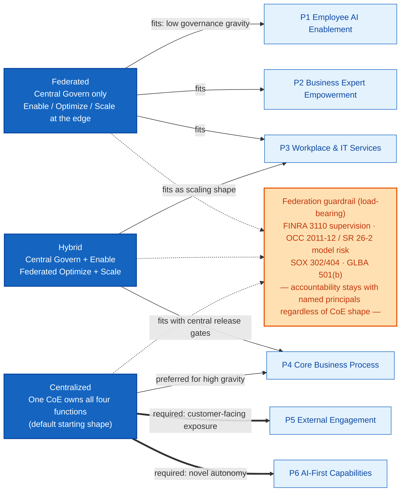
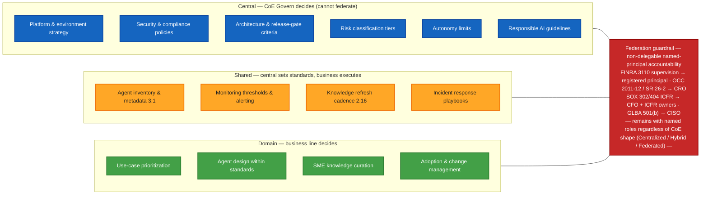

# Agentic Center of Excellence

!!! info "Audience"
    AI governance leads, CoE leads, and executive sponsors planning a Center of Excellence for AI agent governance in a US financial services organization. This is a **strategic** layer — admins implementing individual controls should start with the [control catalog](../controls/CONTROL-INDEX.md) instead.

!!! note "Companion to the Operating Model"
    This blueprint is **standalone** and complements [operating-model.md](operating-model.md) — it does not replace it. The operating model remains the load-bearing RACI-by-zone artifact for examiner workpapers (FFIEC IT examination, FINRA WSP supervisory documentation). This document adds a CoE-as-engine vocabulary above the RACI spine.

---

## Why a CoE matters for FSI agent governance

Microsoft's "Frontier Center of Excellence" concept (paraphrased from the [Microsoft CAPE materials](../reference/microsoft-cape-crosswalk.md)) describes a standing capability that runs an agent portfolio as a long-lived program — not a one-time deployment project. The CoE is the team that owns the operating rhythm, intake, enablement, and portfolio-level performance signals. Microsoft frames this as four functions: **Govern, Enable, Optimize, Scale**, organized in one of three structural shapes — **Centralized, Hybrid, or Federated**.

US financial services organizations face a particular version of this problem. Regulated lines of business cannot tolerate "shadow agents" appearing on customer-impacting pathways without a documented supervisor (FINRA Rule 3110), a model risk tier (OCC Bulletin 2011-12 / Fed SR 26-2), and a books-and-records pipeline (SEC 17a-4, FINRA 4511). At the same time, an FSI institution that centralizes every agent decision in one team will create a Gatekeeper bottleneck that pushes business lines to deploy outside the governance perimeter. The framework's job is to give institutions a CoE blueprint that scales enablement without sacrificing supervision.

The framework's promise here is a **blueprint, not a turnkey operating model**: four functions × three shapes × explicit federation guardrails, mapped to the 78-control catalog and the 7-stage agent lifecycle. The right CoE shape for any institution depends on size, regulatory archetype, business-line count, and existing operating-model maturity. A regional bank with two business lines should not run the same CoE as a global SIFI with a dozen.

> **Important caveat.** This document defines the *functional accountabilities* a CoE owns. It is not a headcount mandate. In smaller institutions one person may hold three CoE function roles, just as today the AI Governance Lead may also serve as Compliance Officer per the [operating-model.md note for smaller institutions](operating-model.md#raci-definitions). The functions remain distinct even when the people overlap.

---

## The four CoE functions

| Function | Mandate | Primary FSI roles | Cross-link |
|----------|---------|-------------------|------------|
| **Govern** | Policy, controls, audit readiness, risk register, release gates | AI Governance Lead, CCO, CRO, CISO | [Pillar 1 controls](../controls/CONTROL-INDEX.md#pillar-1-security-controls-29-controls) |
| **Enable** | Builder enablement, knowledge sources, design patterns, training, community | AI Governance Lead, Adoption Lead, SME, Copilot Studio Agent Author | [Pillar 2 controls](../controls/CONTROL-INDEX.md#pillar-2-management-controls-26-controls) |
| **Optimize** | Performance monitoring, drift detection, hallucination tracking, agent retirement signal | Service Owner, Power Platform Admin, SOC Analyst | [Pillar 3 controls](../controls/CONTROL-INDEX.md#pillar-3-agent-reporting-14-controls) |
| **Scale** | Pattern intake, portfolio prioritization, business-line expansion, productization | Executive Sponsor, Agent Product Owner, Business Owner | [Operating model](operating-model.md) |

### Function: Govern

**Mandate.** Govern is the function that holds the regulatory record. It owns the controls catalog, release gates, audit-evidence pipelines, and the risk register that maps each agent to its mandatory controls. In FSI, Govern is the function an examiner will speak to first.

**Owns:**

- Zone classification at intake; release-gate enforcement at deploy
- Audit log retention and evidence chain (Control 1.7)
- Risk register and incident postmortems
- Change-management approval for any prompt, model, or RAG-corpus change material under SR 26-2
- Retirement decisions and records-retention disposition

**Primary FSI roles:** AI Governance Lead, Chief Compliance Officer, Chief Risk Officer, CISO. See [role-catalog.md](../reference/role-catalog.md) for canonical role names and the CAPE Role Mapping cross-reference.

**Key controls:** [1.7](../controls/pillar-1-security/1.7-comprehensive-audit-logging-and-compliance.md), [2.3](../controls/pillar-2-management/2.3-change-management-and-release-planning.md), [2.6](../controls/pillar-2-management/2.6-model-risk-management-alignment-with-occ-2011-12-sr-11-7.md), [2.12](../controls/pillar-2-management/2.12-supervision-and-oversight-finra-rule-3110.md), [3.1](../controls/pillar-3-reporting/3.1-agent-inventory-and-metadata-management.md).

**FSI-specific guardrail.** Govern is the function whose accountability is examiner-facing. Even in a Federated CoE shape where Build and Optimize are distributed to business lines, the named principal who answers an OCC, FINRA, or SEC examiner question must sit inside the Govern function. The federation guardrail (below) applies most acutely here.

**Maps to lifecycle stages:** Intake (primary), Triage (primary), Deploy (supporting gate), Retire (primary). See [agent-lifecycle.md](agent-lifecycle.md).

### Function: Enable

**Mandate.** Enable is the function that makes safe agent-building easier than unsafe agent-building. It owns the golden-path templates, knowledge-source curation patterns, builder training, and the FSI-specific design patterns that translate Microsoft CAPE patterns into Zone-1 / Zone-2 / Zone-3 implementations.

**Owns:**

- Golden-path agent templates aligned to each zone
- Knowledge-source quality standards (RAG corpus governance, refresh cadence, SME ownership — Control 2.16)
- Builder enablement materials, office hours, community of practice
- Adoption metrics and behavior-change campaigns
- SME engagement model for knowledge validation

**Primary FSI roles:** AI Governance Lead, Adoption Lead, Subject Matter Expert (SME), Copilot Studio Agent Author. The Adoption Lead and SME are net-new roles introduced in the [role-catalog.md](../reference/role-catalog.md) update for this release.

**Key controls:** [2.5](../controls/pillar-2-management/2.5-testing-validation-and-quality-assurance.md), [2.13](../controls/pillar-2-management/2.13-documentation-and-record-keeping.md), [2.16](../controls/pillar-2-management/2.16-rag-source-integrity-validation.md), [2.19](../controls/pillar-2-management/2.19-customer-ai-disclosure-and-transparency.md).

**FSI-specific guardrail.** Enable in FSI must produce templates that ship with the disclosure, supervision, and recordkeeping controls already wired in. A "starter agent" template that omits Control 2.19 disclosure language for a customer-facing deployment is a Reg BI / FINRA 2210 exposure waiting to happen. Enable is responsible for ensuring the easy path is also the compliant path.

**Maps to lifecycle stages:** Intake (supporting), Build (primary), Improve (supporting). See [agent-lifecycle.md](agent-lifecycle.md).

### Function: Optimize

**Mandate.** Optimize is the function that watches agents in production and detects when they begin to drift — slowly providing wrong answers with confidence, hallucinating against stale knowledge, or operating outside their documented decision-rights boundary. In FSI this is also the function that surfaces the data needed to satisfy SR 26-2 ongoing-monitoring expectations.

**Owns:**

- Agent health dashboards (latency, error rate, hallucination feedback)
- Drift detection and re-validation triggers
- Incident triage coordination with SOC and Compliance
- Retirement-signal generation (low-utilization or high-incident agents flagged for Govern review)
- Telemetry pipeline integrity (Control 3.14 Agent 365 Observability SDK)

**Primary FSI roles:** Service Owner, Power Platform Admin, SOC Analyst, Agent Product Owner.

**Key controls:** [3.1](../controls/pillar-3-reporting/3.1-agent-inventory-and-metadata-management.md), [3.2](../controls/pillar-3-reporting/3.2-usage-analytics-and-activity-monitoring.md), [3.10](../controls/pillar-3-reporting/3.10-hallucination-feedback-loop.md), [3.14](../controls/pillar-3-reporting/3.14-agent-365-observability-sdk.md), [1.27](../controls/pillar-1-security/1.27-ai-agent-content-moderation-enforcement.md).

**FSI-specific guardrail.** Optimize must produce evidence that an FSI examiner accepts as ongoing monitoring under OCC 2011-12 §V — not just operational dashboards. A weekly hallucination dashboard that nobody attests to is not the same artifact as a monthly model-monitoring memo signed by the model owner. Optimize is responsible for both the signal *and* the human attestation chain.

**Maps to lifecycle stages:** Deploy (primary), Monitor (primary), Improve (primary), Retire (supporting). See [agent-lifecycle.md](agent-lifecycle.md).

### Function: Scale

**Mandate.** Scale is the function that decides what agents to build next, sponsors business-line expansion, and turns one-off pilots into reusable patterns. It is the portfolio function — the lens through which the CoE asks "do we have the right *set* of agents, not just the right individual agents?"

**Owns:**

- Intake pipeline for new agent requests from business lines
- Portfolio prioritization (value × risk × feasibility scoring)
- Pattern reuse and productization (turning pilot agents into business services)
- Executive scorecard and outcome KPIs
- Business-line expansion roadmap

**Primary FSI roles:** Executive Sponsor, Agent Product Owner, Business Owner. The Executive Sponsor and Agent Product Owner are net-new roles introduced in the [role-catalog.md](../reference/role-catalog.md) update for this release.

**Key controls:** [3.1](../controls/pillar-3-reporting/3.1-agent-inventory-and-metadata-management.md) (portfolio inventory), plus the [adoption roadmap](adoption-roadmap.md) cross-reference.

**FSI-specific guardrail.** Scale in an FSI institution must respect the regulator perimeter. A pattern that works in a wealth advisory line may not be appropriate for a retail lending line because the credit-decisioning ECOA exposure changes the autonomy cap. Scale's prioritization model needs explicit zone and pattern inputs; it cannot prioritize purely on business value.

**Maps to lifecycle stages:** Intake (supporting / portfolio input), Build (supporting / pattern reuse), Improve (supporting / productization). See [agent-lifecycle.md](agent-lifecycle.md).

---

## The three CoE shapes

| Shape | Structure | Best fit FSI archetype | Federation degree |
|-------|-----------|------------------------|-------------------|
| **Centralized** | Single CoE team holds all four functions | Specialized broker-dealer; community bank starting an AI program; mid-size institution with one or two business lines | Minimal — business lines consume CoE services |
| **Hybrid** | Central CoE owns Govern + Enable; business lines own Optimize + Scale for their portfolios | Regional bank with multiple business lines; insurance carrier with several books of business; mid-tier asset manager | Moderate — Govern stays central, execution federates |
| **Federated** | Federated builder enablement across business lines; central CoE owns Govern only | Global SIFI; large diversified institution with many regulated business lines | High — but Govern remains centrally accountable |

The diagram below shows which CoE shape generally fits each CAPE pattern. Lighter-touch patterns (P1–P3) tolerate Federated execution because the named-principal accountability chain stays light; higher-gravity patterns (P4–P6) typically require Hybrid or Centralized so that release gates, model risk classification, and customer-facing review remain centrally consistent. The federation guardrail (later in this document) applies regardless of shape.

Editable Mermaid source: [`docs/images/diagrams/source/cape/coe-structure-by-pattern.mmd`](https://github.com/judeper/FSI-AgentGov/blob/main/docs/images/diagrams/source/cape/coe-structure-by-pattern.mmd). See the [Diagram Catalog](../reference/diagram-catalog.md) for export and licensing notes.

### Shape: Centralized

**When this fits.** A single CoE team owns all four functions and serves the whole institution. This is the right starting shape for most FSI institutions because it produces consistent regulatory artifacts and avoids early federation mistakes. Specialized broker-dealers, community banks, and mid-size institutions running one or two business lines should default to Centralized.

**Structure.** One AI Governance Lead chairs the CoE. A small team (3–8 people in most FSI institutions) covers Enable, Optimize, and Scale activities. Govern responsibilities are shared with the CCO, CRO, and CISO under the existing [operating model RACI](operating-model.md). Business lines participate as Business Owners and Service Owners but do not run their own CoE chapters.

**Trade-offs.**

- (+) Consistent control posture across all agents; one set of templates; one audit pipeline
- (+) Easiest path to defensible examiner artifacts
- (−) Bottleneck risk: if all intake goes through one team, business lines may bypass the CoE
- (−) Limited business-line context inside the CoE team

**FSI examples (typology).** A mid-size regional bank with retail and wealth lines deploying its first 5–15 production agents. A specialized broker-dealer building an internal compliance Q&A agent and a customer servicing agent. A community bank standing up its first three Pattern 1 / Pattern 2 agents.

**Federation guardrail.** Even in Centralized, the named principal for FINRA 3110 supervision and OCC 2011-12 model risk oversight is identified explicitly in the operating-model RACI. Centralized does not mean "the CoE is the supervisor"; it means the CoE coordinates the work of the named supervisors.

### Shape: Hybrid

**When this fits.** Govern and Enable stay central; Optimize and Scale federate to the business lines. This is the right shape for institutions running 4+ patterns across 3+ business lines, where central control consistency matters for regulatory artifacts but business-line proximity matters for prioritization and operational signal interpretation. Regional banks with multiple business lines and mid-tier asset managers are typical fits.

**Structure.** A central CoE team chaired by the AI Governance Lead owns Govern and Enable. Each business line names an embedded Agent Product Owner and Service Owner who own that line's portfolio (Scale) and operational health (Optimize). Weekly business-line health reviews feed into a monthly central CoE rhythm.

**Trade-offs.**

- (+) Business-line proximity for prioritization and incident triage
- (+) Central consistency for templates and audit pipelines
- (−) Coordination overhead between central and embedded roles
- (−) Risk that "Optimize" data quality varies by business line

**FSI examples (typology).** A regional bank with retail, wealth, and commercial lines, each with its own Agent Product Owner. A diversified insurance carrier with separate property-and-casualty and life books.

**Federation guardrail.** When Optimize federates, the central Govern function still owns the audit-evidence chain. Business-line Service Owners produce operational dashboards; the central Govern function attests to those dashboards as monitoring evidence under SR 26-2. Optimize federation does not transfer attestation authority.

### Shape: Federated

**When this fits.** Builder enablement and operational management federate fully to the business lines; only Govern remains centrally accountable. This shape suits global SIFIs and large diversified institutions where each business line is large enough to staff its own CoE chapter, and where centralizing all four functions would create unworkable bottlenecks across hundreds of agents.

**Structure.** Each business line runs its own CoE chapter with Enable, Optimize, and Scale functions staffed locally. A small central Govern team owns the controls catalog, the consolidated risk register, and the unified audit-evidence pipeline. Business-line CoE chapters report to the central Govern team for risk and audit purposes; they report to their business-line management for operational matters.

**Trade-offs.**

- (+) Scales to many business lines and many hundreds of agents
- (+) Maximum business-line context and prioritization velocity
- (−) Highest coordination cost
- (−) Most exposure to inconsistent control implementation if Govern is under-resourced
- (−) Federation guardrail (below) becomes load-bearing

**FSI examples (typology).** A global SIFI with separate CoE chapters in capital markets, retail banking, asset management, and insurance. A large diversified bank with each business line operating its own CoE chapter under a thin central Govern function.

**Federation guardrail.** Federated is the shape where the federation guardrail (below) does the most work. Pillar 3 (Reporting) controls become disproportionately important — a Federated CoE without strong reporting infrastructure loses central visibility into business-line agent populations, and the central Govern function cannot satisfy its supervisory accountability if it cannot see what business lines are doing.

---

## The federation guardrail

This guardrail is load-bearing for the federated and hybrid shapes. It is reproduced from the [Council Regulatory Counsel memo](../reference/microsoft-cape-crosswalk.md#13-the-frontier-center-of-excellence-govern-enable-optimize-scale) and applies regardless of which CoE shape an institution chooses.

> **Federating CoE roles to business units does NOT transfer regulated supervisory accountability. FINRA 3110 supervision, OCC 2011-12 model risk oversight, SR 26-2 obligations, and SOX 302/404 attestations remain with the named FSI roles regardless of where the CoE function operationally sits.**

### What this means in practice

A Federated CoE can have business-unit "AI Champions" running Build and Deploy stages locally, but the AI Governance Lead, Chief Compliance Officer, Chief Risk Officer, and CISO retain end-to-end accountability for the regulatory record. "Federated" describes the operating shape; it does not describe the legal accountability model. An institution cannot federate the accountability that a controlling regulation places on a named principal.

### Examiner-facing implication

Examiners (OCC, Fed, FDIC, FINRA, SEC, NYDFS, state regulators) will trace decisions back to the named principal regardless of CoE shape. A Federated CoE must produce evidence that the named principal had visibility and review authority over the business-line activity — usually in the form of consolidated dashboards, risk-register entries, and exception-escalation logs that flow up to the central Govern function. If that evidence chain is absent, "the business line owns it" is not a defensible answer in an exam.

### Operational implication

Federated CoE shapes need disproportionately strong reporting infrastructure. Pillar 3 controls — particularly [3.1 Agent Inventory](../controls/pillar-3-reporting/3.1-agent-inventory-and-metadata-management.md), [3.2 Usage Analytics](../controls/pillar-3-reporting/3.2-usage-analytics-and-activity-monitoring.md), [3.10 Hallucination Feedback](../controls/pillar-3-reporting/3.10-hallucination-feedback-loop.md), and [3.14 Observability SDK](../controls/pillar-3-reporting/3.14-agent-365-observability-sdk.md) — must be implemented to a higher maturity in Federated shapes than in Centralized, because the central Govern function depends on them for visibility. A Federated institution with weak Pillar 3 has effectively delegated supervision without the reporting plumbing to oversee it.

### Two specific scenarios

**Scenario A — Federated wealth division deploying a Pattern 4 agent.** A wealth division stands up a KYC document-review agent in its own business-line environment, with its own builders and Service Owner. The federation guardrail requires: (1) a designated registered principal in the wealth division named on the agent's metadata as the FINRA 3110 supervisor; (2) the agent inventoried in the central Pillar 3 register; (3) the model classified under the central Govern function's OCC 2011-12 / SR 26-2 model risk tier; (4) re-validation triggered through the central Govern function on any material change. The wealth division operates the agent; the central Govern function owns the supervisory record.

**Scenario B — Federated retail bank deploying a Pattern 5 agent.** A retail bank business line deploys a customer-facing servicing agent. The federation guardrail requires: (1) a designated principal who satisfies FINRA Rule 3110 supervisory obligations for the agent's communications; (2) Control 2.19 disclosure language reviewed and approved by central Compliance before launch; (3) ECOA / Reg B / Reg E exposure assessed by central Compliance even though the deployment lives in the business-line environment; (4) consumer complaints routed to a central pipeline that the CCO can attest to. Federated execution; central regulatory record.

---

## Decision rights at a glance

The federation guardrail above states the principle. The diagram below visualizes how it lands in day-to-day decision rights. CAPE's framing — *centralize HOW scale works, not WHO builds everything* — sorts decisions into three columns: central CoE Govern decisions (cannot federate), shared decisions (central sets standards, business executes), and domain decisions (business line owns). Underneath all three columns sits the non-delegable named-principal layer: regardless of which CoE shape the institution chooses, FINRA 3110 supervision, OCC 2011-12 / SR 26-2 model risk, SOX 302/404 ICFR, and GLBA 501(b) safeguards remain with the named FSI roles called out in the [operating model](operating-model.md).

Editable Mermaid source: [`docs/images/diagrams/source/cape/decision-rights.mmd`](https://github.com/judeper/FSI-AgentGov/blob/main/docs/images/diagrams/source/cape/decision-rights.mmd). For canonical role names, see [Role Catalog](../reference/role-catalog.md). For the full RACI by lifecycle stage, see [Operating Model](operating-model.md). For export and licensing notes, see the [Diagram Catalog](../reference/diagram-catalog.md).

---

## CoE × Lifecycle ownership matrix

The 7-stage agent lifecycle (Intake → Triage → Build → Deploy → Monitor → Improve → Retire) — see [agent-lifecycle.md](agent-lifecycle.md) for the full FSI treatment — maps to the four CoE functions as follows.

| Stage | Govern | Enable | Optimize | Scale | Primary owner |
|-------|:------:|:------:|:--------:|:-----:|---------------|
| **Intake** | (P) | ✓ |  | ✓ | AI Governance Lead |
| **Triage** | (P) | ✓ |  | ✓ | AI Governance Lead + CRO |
| **Build** |  | (P) |  | ✓ | Copilot Studio Agent Author + Agent Product Owner |
| **Deploy** | ✓ | ✓ | (P) |  | Power Platform Admin + Service Owner |
| **Monitor** |  |  | (P) |  | Service Owner + Power Platform Admin |
| **Improve** |  | ✓ | (P) | ✓ | Service Owner |
| **Retire** | (P) |  | ✓ |  | AI Governance Lead |

**Reading the matrix.** **(P)** marks the *primary* function owner for that stage; ✓ marks supporting functions that contribute. Multiple functions may share a stage — a Build stage in a Pattern 4 deployment has heavy Govern oversight even though Enable is the primary function. The "Primary owner" column names the [role-catalog.md](../reference/role-catalog.md) role that holds operational accountability for the stage; this role's accountability is layered on top of (not in place of) the supervisory accountability described in the [federation guardrail](#the-federation-guardrail). Cross-link [agent-lifecycle.md](agent-lifecycle.md) for the per-stage activity detail and zone-specific requirements.

---

## FSI-specific CoE anti-patterns

These failure modes are diagnostic. An institution that recognizes itself in any of the following should treat the recognition as a signal to remediate before the next examination cycle, not as a critique. All five are common in FSI organizations because they emerge from FSI-specific cultural and structural pressures.

### Anti-pattern 1 — Federated maker enablement without federated audit reporting

**What it looks like.** Business lines stand up their own builders and ship agents into production. The central CoE is told about deployments after the fact, or learns of them through helpdesk tickets. There is no consolidated agent inventory; Pillar 3 controls are uneven across business lines.

**Why it fails examiner scrutiny.** When an examiner asks "show me every agent in production that touches customer data," the central Govern function cannot answer. The evidence chain from business-line activity to central supervisory attestation is broken. This is a SR 26-2 ongoing-monitoring finding and, depending on what the agents do, a FINRA 4511 / SEC 17a-4 books-and-records finding.

**How to fix.** Make agent registration in the central Pillar 3 inventory a release-gate prerequisite. No agent moves to a Zone 2 or Zone 3 environment without a central inventory entry naming the supervisor, model risk tier, and disclosure posture. Central Govern owns the gate; business-line builders register the agent.

### Anti-pattern 2 — CoE Govern function configured as advisory rather than as a release gate

**What it looks like.** The CoE Govern function reviews agents and issues recommendations, but the business line decides whether to deploy. Controls become aspirational rather than enforced. Govern's findings appear in advisory memos that nobody is required to act on before a release.

**Why it fails.** Controls that are advisory are not controls — they are documentation. Examiners read the gap between documented expectations and observed practice as the institution's actual control posture. An advisory Govern function produces a control catalog that the institution itself does not enforce, which is worse than not having one.

**How to fix.** Govern owns release-gate enforcement on Zone 2 and Zone 3 agents, with documented criteria, named approvers, and an exception process that requires written justification and CRO sign-off. The exception process is the safety valve that prevents Govern from becoming a Gatekeeper anti-pattern; the gate itself is non-optional.

### Anti-pattern 3 — Treating the CoE as an IT function rather than a cross-functional governance function

**What it looks like.** The CoE reports up through the CIO organization. Compliance, Risk, and Internal Audit participate as consulted parties at best; the CRO and CCO are not in the CoE rhythm. Decisions about disclosure posture, supervisory model, and model risk tier get made by IT staff who are not the regulated principals.

**Why it fails.** The CRO and CCO carry the regulated accountability, but they are not in the room when the agent is built. By the time they see the agent at a quarterly governance committee, the disclosure language is set, the supervisor is unnamed, and the model risk tier is implicit. Their only options are accept or veto — neither produces a good outcome.

**How to fix.** The CoE is chaired by the AI Governance Lead, not by an IT function, and its standing membership includes the CCO and CRO (or their delegated representatives). Reporting lines are dotted to the CIO for technical platform matters and dotted to the CCO/CRO for governance matters. The Pillar 1 / Pillar 2 / Pillar 3 / Pillar 4 split is a good organizing principle for CoE meeting agendas — it prevents the conversation from collapsing into "the technical pillar."

### Anti-pattern 4 — Skipping the Retire stage

**What it looks like.** Agents are deployed, run for years, and accumulate. There is no scheduled review for low-utilization or high-incident agents. Retired agents are not formally decommissioned; their data, audit logs, and connector permissions linger. The agent inventory grows; nobody owns the cleanup.

**Why it fails.** SEC 17a-4 records-retention obligations attach to the agent's outputs and supervisory record. An informally abandoned agent whose audit logs are still being generated but whose owner has left the firm is a compliance gap waiting to be discovered. SR 26-2 also expects formal retirement of models that are no longer used, with documented rationale and re-baseline if reactivated.

**How to fix.** Build the Retire stage into the operating rhythm. Quarterly, the Optimize function flags candidates for retirement (low utilization, persistent quality issues, replaced by newer agents). Govern owns the retirement decision and the records-retention disposition. The disposition documents which audit logs continue to be retained, for how long, and under which regulation.

### Anti-pattern 5 — Federation read as relief from supervision

**What it looks like.** A business line, on adopting a Federated or Hybrid CoE shape, interprets the federation as a transfer of supervisory accountability — "we run our own AI now, so the central CCO doesn't need to attest." The central Govern function tacitly accepts this because the business line is producing its own dashboards.

**Why it fails.** This is the failure mode the [federation guardrail](#the-federation-guardrail) exists to prevent. Federation is an operating-shape decision, not an accountability transfer. An examiner asking who supervises the business-line agents will not accept "the business line supervises itself" as an answer for a regulated activity.

**How to fix.** Document explicitly, in the CoE charter and in each business-line CoE chapter charter, that the named central principals (AI Governance Lead, CCO, CRO, CISO) retain accountability for the regulated supervisory functions regardless of CoE shape. The federation guardrail belongs in the charter, not just in this framework document.

### Anti-pattern 6 — Ghost CoE charter

**What it looks like.** A CoE charter is signed, the four functions are named, the operating rhythm is defined on paper. Then the rhythm never materializes. The weekly standup is cancelled three times in a row; the monthly scorecard is produced once and forgotten. The charter satisfies an audit finding but the operating engine never starts.

**Why it fails.** The CoE only exists to the extent it operates. A ghost CoE charter is worse than no charter — it gives the institution a false sense of governance posture. Examiners and internal audit alike will identify the gap between documented charter and observed cadence as a control failure.

**How to fix.** Treat the CoE rhythm as a Pillar 1 audit-logged activity. Meeting attendance, decisions, and action items belong in a Control 1.7 audit-logged location (a controlled SharePoint site, a Dataverse table, or equivalent). Missed cadence shows up in audit evidence and triggers escalation. The cadence becomes self-monitoring.

---

## How to choose a CoE shape for your institution

This is a decision aid, not a prescription. Institutions vary; use the steps as a starting point, not as a directive.

**Step 1 — Count business lines with AI mandates.** One or two business lines pursuing agent work → start Centralized. Three to five business lines → consider Hybrid. Six or more business lines, especially in distinct regulatory regimes (banking + securities + insurance) → Federated is likely necessary, but only with disproportionately strong central Govern and Pillar 3 reporting infrastructure.

**Step 2 — Assess existing operating-model maturity.** Low maturity (no standing AI committee, no documented operating model for technology change) → Centralized to develop the capability before federating. High maturity (mature model risk function, standing technology change committees, established audit-evidence pipelines) → Hybrid or Federated is workable because the underlying governance plumbing already exists.

**Step 3 — Map the regulator perimeter.** A single primary regulator (e.g., a bank holding company supervised primarily by the OCC and Fed) → simpler CoE shapes work because the regulatory translation is unified. Multiple primary regulators (e.g., a diversified financial holding company supervised by OCC, Fed, FINRA, SEC, and a state insurance regulator) → Federated complexity is often worth the cost because business-line proximity to the controlling regulator matters for translation.

**Step 4 — Identify the scale-breaker.** The [agentic capability drivers](agentic-capability-drivers.md) lens (Phase 2 sibling document) identifies which capability driver is the institution's binding constraint — Organization & Culture, AI Strategy & Experience, Business Strategy, AI Governance & Security, or Technology & Data. Where Organization & Culture is weak (immature change management, low builder community), Centralized helps build that capability. Where Technology & Data is weak (no telemetry pipeline, no observability), Hybrid that centralizes technical excellence works better. Where AI Governance & Security is the binding constraint, Centralized is mandatory until the binding constraint is addressed.

**Step 5 — Re-evaluate annually.** CoE shape is not a one-time decision. An institution that starts Centralized in year one may move to Hybrid in year three as the agent population grows and business-line maturity develops. The [governance cadence](governance-cadence.md) annual review is the right place to re-examine the shape choice.

> See also: the [CAPE pattern × CoE shape recommendations](../reference/microsoft-cape-crosswalk.md#3-pattern-zone-fit-matrix) for pattern-specific shape guidance, and the [agentic capability drivers](agentic-capability-drivers.md) lens as a complementary diagnostic.

---

## See also

- [Operating model](operating-model.md) — FSI roles, RACI by zone, governance committee structure (this CoE blueprint sits above the operating model and references but does not replace it)
- [Agent lifecycle](agent-lifecycle.md) — full 7-stage lifecycle treatment with FSI activity detail
- [Governance cadence](governance-cadence.md) — review schedules and operating rhythm
- [Capability drivers](agentic-capability-drivers.md) — the readiness lens for CoE shape selection (Phase 2 sibling document)
- [Frontier transformation patterns](transformation-patterns.md) — what the CoE governs (Phase 2 sibling document)
- [Microsoft CAPE crosswalk](../reference/microsoft-cape-crosswalk.md) — pattern-by-pattern regulatory mapping with FSI Regulatory Exposure callouts
- [Role catalog](../reference/role-catalog.md) — FSI canonical roles plus the five new roles introduced for the CoE blueprint (Executive Sponsor, Agent Product Owner, Subject Matter Expert, Service Owner, Adoption Lead)

---

*Updated: May-2026 | Version: v1.5.0-draft | Audience: AI governance leads, CoE leads, executive sponsors*
