# Solutions Integration

How FSI-AgentGov-Solutions automation aligns with the governance framework.

---

## Overview

The FSI Agent Governance Framework defines **what** controls organizations should implement. The FSI-AgentGov-Solutions repository provides **how**—ready-to-deploy automation that operationalizes key controls.

```mermaid
flowchart TB
    subgraph Framework["FSI-AgentGov (Framework)"]
        direction TB
        P1[Pillar 1: Security<br/>24 Controls]
        P2[Pillar 2: Management<br/>21 Controls]
        P3[Pillar 3: Reporting<br/>10 Controls]
        P4[Pillar 4: SharePoint<br/>7 Controls]
    end

    subgraph Solutions["FSI-AgentGov-Solutions (13 Deployable Automation Solutions)"]
        direction TB
        ELM[Environment Lifecycle<br/>Management]
        MCM[Message Center<br/>Monitor]
        PGC[Pipeline Governance<br/>Cleanup]
        DEC[Deny Event<br/>Correlation]
        FSW[FINRA Supervision<br/>Workflow]
        CAA[Conditional Access<br/>Automation]
        CD[Compliance<br/>Dashboard]
        SDD[Segregation<br/>Detector]
        SDM[Scope Drift<br/>Monitor]
        RSV[RAG Source<br/>Validator]
        COI[COI Testing<br/>Framework]
        HT[Hallucination<br/>Tracker]
        DR[DR Testing<br/>Framework]
    end

    P2 --> ELM
    P2 --> MCM
    P2 --> PGC
    P1 --> DEC
    P3 --> DEC
    P2 --> FSW
    P1 --> CAA
    P3 --> CD
    P2 --> SDD
    P1 --> SDM
    P2 --> RSV
    P2 --> COI
    P3 --> HT
    P2 --> DR
```



---

## Solution-to-Control Mapping

### Environment Lifecycle Management

Automates environment provisioning with zone classification.

| Control | How Solution Helps |
|---------|-------------------|
| **2.1 Managed Environments** | Automatically enables managed environment settings during provisioning |
| **2.2 Environment Groups** | Assigns environments to zone-appropriate environment groups |
| **2.15 Environment Routing** | Implements default environment policies through provisioning workflow |

**Applicable Zones:** Zone 2, Zone 3

**Playbook:** [Environment Lifecycle Management](../playbooks/advanced-implementations/environment-lifecycle-management/index.md)

---

### Message Center Monitor

Operationalizes platform change tracking for governance workflows.

| Control | How Solution Helps |
|---------|-------------------|
| **2.3 Change Management** | Delivers structured notifications for platform changes requiring assessment |
| **2.10 Patch Management** | Tracks Microsoft-initiated updates affecting Power Platform and M365 |

**Applicable Zones:** All zones (organization-wide)

**Playbook:** [Platform Change Governance](../playbooks/advanced-implementations/platform-change-governance/index.md)

---

### Pipeline Governance Cleanup

Transitions from personal to centralized deployment pipelines.

| Control | How Solution Helps |
|---------|-------------------|
| **2.3 Change Management** | Enforces centralized ALM governance by removing ungoverned personal pipelines |

**Applicable Zones:** Zone 2, Zone 3 (production-path environments)

**Related Control:** [2.3 - Change Management](../controls/pillar-2-management/2.3-change-management-and-release-planning.md)

---

### Deny Event Correlation Report

Aggregates block events for unified compliance visibility.

| Control | How Solution Helps |
|---------|-------------------|
| **1.5 DLP and Sensitivity Labels** | Correlates DLP policy violation events |
| **1.7 Comprehensive Audit Logging** | Extracts Purview audit events for agent activities |
| **3.4 Incident Reporting** | Provides unified deny event view for incident investigation |

**Applicable Zones:** Zone 2, Zone 3

**Status:** Work In Progress

**Playbook:** [Deny Event Correlation Report](../playbooks/advanced-implementations/deny-event-correlation-report/index.md)

---

### FINRA Supervision Workflow

Automates supervision queue for AI agent outputs supporting FINRA Rule 3110.

| Control | How Solution Helps |
|---------|-------------------|
| **2.12 Supervision and Oversight** | Routes flagged content to supervisory principals with SLA tracking |
| **1.10 Communication Compliance** | Ingests policy violations from Communication Compliance |
| **1.7 Comprehensive Audit Logging** | Maintains immutable audit trail with SHA-256 integrity hashing |

**Applicable Zones:** Zone 2, Zone 3

**Status:** Validated

**Repository Link:** [finra-supervision-workflow](https://github.com/judeper/FSI-AgentGov-Solutions/tree/main/finra-supervision-workflow)

**Prerequisites:**
- Microsoft Purview Communication Compliance configured
- Supervisory principal role assignments in place
- Dataverse database with appropriate capacity

---

### Conditional Access Automation

Automates CA policy deployment and compliance monitoring for AI workloads.

| Control | How Solution Helps |
|---------|-------------------|
| **1.11 Conditional Access and MFA** | Deploys 8 zone-aligned CA policies with break-glass exclusions |
| **1.23 Step-Up Authentication** | Enforces step-up authentication for sensitive agent operations |
| **1.18 Service Principal Governance** | Validates service principal access controls meet zone requirements |

**Applicable Zones:** All zones (zone-specific policy requirements)

**Status:** Work In Progress

**Repository Link:** [conditional-access-automation](https://github.com/judeper/FSI-AgentGov-Solutions/tree/main/conditional-access-automation)

**Prerequisites:**
- Microsoft Entra ID P1 licenses
- Break-glass account configuration
- Zone classification completed

---

### Compliance Dashboard

Unified compliance visibility across all 62 framework controls.

| Control | How Solution Helps |
|---------|-------------------|
| **3.3 Compliance and Regulatory Reporting** | Aggregates control scores with zone-based filtering and trend analysis |
| **3.1 Operational Dashboards** | Provides executive visibility into governance posture |
| **3.2 Security Dashboards** | Integrates security control scores with operational metrics |

**Applicable Zones:** All zones (organization-wide reporting)

**Status:** Work In Progress (Beta - Power BI template requires manual creation)

**Repository Link:** [compliance-dashboard](https://github.com/judeper/FSI-AgentGov-Solutions/tree/main/compliance-dashboard)

**Prerequisites:**
- Power BI Pro licenses for dashboard consumers
- Dataverse database with appropriate capacity
- Control assessment process established

---

### Segregation of Duties Detector

Identifies and prevents SoD violations in agent development workflows.

| Control | How Solution Helps |
|---------|-------------------|
| **2.8 Access Control and Segregation of Duties** | Scans for incompatible role assignments across development and deployment |
| **2.1 Managed Environments** | Validates Maker/Checker separation in environment configurations |
| **2.3 Change Management** | Enforces deployment approval separation from developer roles |

**Applicable Zones:** Zone 2, Zone 3

**Status:** Work In Progress

**Repository Link:** [segregation-detector](https://github.com/judeper/FSI-AgentGov-Solutions/tree/main/segregation-detector)

**Prerequisites:**
- Environment role assignments documented
- SoD policy requirements defined
- Exception approval workflow established

---

### Scope Drift Monitor

Detects agent data access beyond declared operational scope.

| Control | How Solution Helps |
|---------|-------------------|
| **1.14 Data Minimization and Agent Scope Control** | Compares actual data access against declared scope baselines |
| **1.4 Connector Governance** | Monitors connector usage for scope expansion patterns |
| **1.5 DLP and Sensitivity Labels** | Correlates DLP events with scope violation alerts |

**Applicable Zones:** Zone 2, Zone 3

**Status:** Work In Progress

**Repository Link:** [scope-drift-monitor](https://github.com/judeper/FSI-AgentGov-Solutions/tree/main/scope-drift-monitor)

**Prerequisites:**
- Agent scope baselines defined
- Unified Audit Log enabled
- Defender for Cloud Apps configured

---

### RAG Source Validator

Validates integrity of RAG knowledge sources with change detection.

| Control | How Solution Helps |
|---------|-------------------|
| **2.16 RAG Source Integrity Validation** | SHA-256 hash validation detects unauthorized content modifications |
| **1.7 Comprehensive Audit Logging** | Tracks knowledge source changes with immutable audit trail |
| **2.13 Model Lifecycle Management** | Monitors knowledge source freshness for RAG model accuracy |

**Applicable Zones:** Zone 2, Zone 3

**Status:** Work In Progress

**Repository Link:** [rag-source-validator](https://github.com/judeper/FSI-AgentGov-Solutions/tree/main/rag-source-validator)

**Prerequisites:**
- RAG knowledge sources cataloged
- Baseline hash values generated
- SharePoint/Dataverse/Blob access configured

---

### Conflict of Interest Testing Framework

Automated testing for conflicts of interest in agent recommendations.

| Control | How Solution Helps |
|---------|-------------------|
| **2.18 Automated Conflict of Interest Testing** | Runs 10 predefined scenarios for proprietary bias and suitability violations |
| **2.11 Model Validation and Testing** | Integrates COI testing into agent validation lifecycle |
| **2.5 Risk Assessment** | Provides evidence for COI risk mitigation |

**Applicable Zones:** Zone 2, Zone 3

**Status:** Planned

**Repository Link:** [coi-testing](https://github.com/judeper/FSI-AgentGov-Solutions/tree/main/coi-testing)

**Prerequisites:**
- Test scenarios aligned with product catalog
- Integration with FINRA Supervision Workflow
- Agent response baselines established

---

### Hallucination Tracker

Feedback aggregation for hallucination pattern analysis.

| Control | How Solution Helps |
|---------|-------------------|
| **3.10 Hallucination Feedback Loop** | Collects multi-source feedback and clusters hallucination patterns |
| **2.9 Continuous Monitoring** | Tracks hallucination trends for model performance degradation |
| **2.12 Supervision and Oversight** | Routes high-severity hallucinations to supervisory review |

**Applicable Zones:** Zone 2, Zone 3

**Status:** Planned

**Repository Link:** [hallucination-tracker](https://github.com/judeper/FSI-AgentGov-Solutions/tree/main/hallucination-tracker)

**Prerequisites:**
- Feedback collection channels configured
- Hallucination taxonomy aligned with firm policies
- Integration with FINRA Supervision Workflow

---

### DR Testing Framework

Automated disaster recovery testing for AI agent infrastructure.

| Control | How Solution Helps |
|---------|-------------------|
| **2.4 Business Continuity and Disaster Recovery** | Validates agent restore procedures against RTO/RPO targets |
| **2.1 Managed Environments** | Tests environment failover for production agent infrastructure |
| **1.9 Backup and Disaster Recovery** | Verifies backup integrity for agent configurations and data |

**Applicable Zones:** Zone 3 (production)

**Status:** Planned

**Repository Link:** [dr-testing-framework](https://github.com/judeper/FSI-AgentGov-Solutions/tree/main/dr-testing-framework)

**Prerequisites:**
- RTO/RPO targets defined
- DR environment provisioned
- Backup and restore procedures documented

---

## Zone Applicability Matrix

| Solution | Zone 1 | Zone 2 | Zone 3 | Notes |
|----------|:------:|:------:|:------:|-------|
| Environment Lifecycle Management | — | ✓ | ✓ | Zone 1 uses default environment |
| Message Center Monitor | ✓ | ✓ | ✓ | Organization-wide change tracking |
| Pipeline Governance Cleanup | — | ✓ | ✓ | Only applies to production paths |
| Deny Event Correlation | — | ✓ | ✓ | Zone 2/3 have audit requirements |
| FINRA Supervision Workflow | — | ✓ | ✓ | Required for customer-facing agents |
| Conditional Access Automation | ✓ | ✓ | ✓ | Zone-specific policy requirements |
| Compliance Dashboard | ✓ | ✓ | ✓ | Organization-wide reporting |
| Segregation Detector | — | ✓ | ✓ | SoD required for production paths |
| Scope Drift Monitor | — | ✓ | ✓ | Data minimization for regulated data |
| RAG Source Validator | — | ✓ | ✓ | Knowledge integrity for compliance |
| COI Testing | — | ✓ | ✓ | Customer-facing recommendations only |
| Hallucination Tracker | — | ✓ | ✓ | Customer-facing agents require tracking |
| DR Testing | — | — | ✓ | Production disaster recovery only |

---

## Pillar Coverage

| Pillar | Solutions Covering | Coverage Notes |
|--------|-------------------|----------------|
| **Pillar 1: Security** | Deny Event Correlation, Conditional Access Automation, Scope Drift Monitor | DLP correlation, access controls, data minimization |
| **Pillar 2: Management** | ELM, MCM, PGC, FINRA Supervision, Segregation Detector, RAG Validator, COI Testing, DR Testing | Environment lifecycle, change management, supervision, testing |
| **Pillar 3: Reporting** | Deny Event Correlation, Compliance Dashboard, Hallucination Tracker | Incident visibility, compliance reporting, feedback loops |
| **Pillar 4: SharePoint** | — | SharePoint controls use native admin tools |

---

## Deployment Sequence

For organizations implementing the full framework, deploy solutions in this order:

**Phase 1: Foundation (Completed Solutions)**
1. **Message Center Monitor** — Establishes platform change visibility
2. **Environment Lifecycle Management** — Provides governed provisioning
3. **Pipeline Governance Cleanup** — Transitions to centralized ALM

**Phase 2: Compliance & Access Controls (Work In Progress)**
4. **Conditional Access Automation** — Deploys Zero Trust access policies
5. **Segregation Detector** — Validates role separation before production use
6. **Deny Event Correlation** — Aggregates security events
7. **Compliance Dashboard** — Establishes baseline compliance visibility

**Phase 3: Regulatory & Operational (Validated/In Progress)**
8. **FINRA Supervision Workflow** — Routes customer-facing content for review
9. **Scope Drift Monitor** — Monitors data access patterns
10. **RAG Source Validator** — Validates knowledge source integrity

**Phase 4: Quality & Resilience (Planned)**
11. **COI Testing** — Tests for conflicts of interest
12. **Hallucination Tracker** — Collects feedback for model improvement
13. **DR Testing Framework** — Validates disaster recovery procedures

---

## Repository Structure

```
FSI-AgentGov-Solutions/
├── environment-lifecycle-management/      # v1.1.2 (Completed)
├── message-center-monitor/               # v2.1.1 (Completed)
├── pipeline-governance-cleanup/          # v1.0.8 (Completed)
├── deny-event-correlation-report/        # v1.1.0 (Work In Progress)
├── finra-supervision-workflow/           # v1.0.0 (Validated)
├── conditional-access-automation/        # v1.0.0 (Work In Progress)
├── compliance-dashboard/                 # v1.0.0-beta (Work In Progress)
├── segregation-detector/                 # v1.0.0 (Work In Progress)
├── scope-drift-monitor/                  # v1.0.0 (Work In Progress)
├── rag-source-validator/                 # v1.0.0 (Work In Progress)
├── coi-testing/                          # v1.0.0 (Planned)
├── hallucination-tracker/                # v1.0.0 (Planned)
├── dr-testing-framework/                 # v1.0.0 (Planned)
├── scripts/
│   └── hooks/
└── .claude/
```

---

## CoE Starter Kit Alignment

Microsoft's Power Platform Center of Excellence (CoE) Starter Kit provides comprehensive governance patterns. FSI-AgentGov-Solutions complements the CoE Starter Kit for financial services-specific requirements.

### Comparison

| Capability | CoE Starter Kit | FSI-AgentGov-Solutions |
|------------|:---------------:|:----------------------:|
| Environment inventory | ✓ | — |
| Environment provisioning | Basic | Zone-based with approvals |
| Pipeline discovery | ✓ | ✓ (cleanup focused) |
| Message Center monitoring | ✓ | ✓ (simpler setup) |
| Deny event correlation | — | ✓ |
| Power BI governance reports | ✓ | Limited |

### Integration Recommendations

| Scenario | Recommendation |
|----------|----------------|
| **Existing CoE deployment** | Add ELM for zone-based provisioning, DEC for deny visibility |
| **Greenfield FSI deployment** | Deploy FSI solutions first, consider CoE for broader inventory |
| **Enterprise hybrid** | CoE for platform-wide governance, FSI solutions for AI agent-specific controls |

For detailed architecture guidance including scalability limits and alternative patterns, see the [Solutions Architecture Guide](../reference/solutions-architecture-guide.md).

---

## Related Documentation

- [Solutions Index](../reference/solutions-index.md) — Complete solution catalog with version history
- [Solutions Architecture Guide](../reference/solutions-architecture-guide.md) — Enterprise scalability and platform limits
- [Adoption Roadmap](adoption-roadmap.md) — Phased implementation guidance
- [FSI-AgentGov-Solutions Repository](https://github.com/judeper/FSI-AgentGov-Solutions) — Source code and deployment scripts

---

## Summary Statistics

**Solutions:** 13 deployable automation solutions
**Control Coverage:** 27 of 62 controls (43.5%) have direct solution support
**Status Distribution:**
- Completed: 4 solutions (ELM, MCM, PGC, FINRA Supervision Workflow validated)
- Work In Progress: 6 solutions
- Planned: 3 solutions

**Pillar Support:**
- Pillar 1 (Security): 3 solutions
- Pillar 2 (Management): 8 solutions
- Pillar 3 (Reporting): 3 solutions
- Pillar 4 (SharePoint): 0 solutions

---

*FSI Agent Governance Framework v1.2.37 - February 2026*
