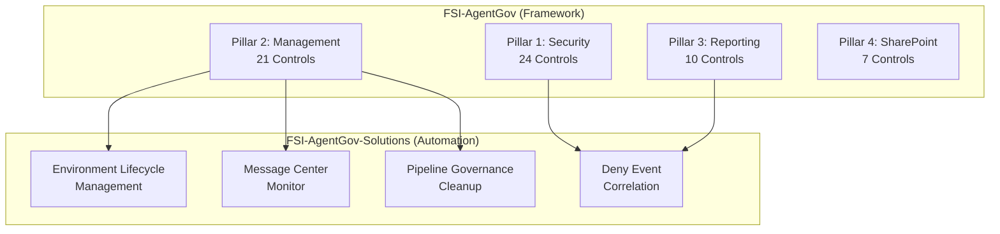

# Solutions Integration

How FSI-AgentGov-Solutions automation aligns with the governance framework.

---

## Overview

The FSI Agent Governance Framework defines **what** controls organizations should implement. The FSI-AgentGov-Solutions repository provides **how**—ready-to-deploy automation that operationalizes key controls.



---

## Solution-to-Control Mapping

### Environment Lifecycle Management

Automates environment provisioning with zone classification.

| Control | How Solution Helps |
|---------|-------------------|
| **2.1 Managed Environments** | Automatically enables managed environment settings during provisioning |
| **2.2 Environment Groups** | Assigns environments to zone-appropriate environment groups |
| **2.15 Environment Routing** | Implements default environment policies through provisioning workflow |

**Applicable Zones:** Zone 2, Zone 3

**Playbook:** [Environment Lifecycle Management](../playbooks/advanced-implementations/environment-lifecycle-management/index.md)

---

### Message Center Monitor

Operationalizes platform change tracking for governance workflows.

| Control | How Solution Helps |
|---------|-------------------|
| **2.3 Change Management** | Delivers structured notifications for platform changes requiring assessment |
| **2.10 Patch Management** | Tracks Microsoft-initiated updates affecting Power Platform and M365 |

**Applicable Zones:** All zones (organization-wide)

**Playbook:** [Platform Change Governance](../playbooks/advanced-implementations/platform-change-governance/index.md)

---

### Pipeline Governance Cleanup

Transitions from personal to centralized deployment pipelines.

| Control | How Solution Helps |
|---------|-------------------|
| **2.3 Change Management** | Enforces centralized ALM governance by removing ungoverned personal pipelines |

**Applicable Zones:** Zone 2, Zone 3 (production-path environments)

**Related Control:** [2.3 - Change Management](../controls/pillar-2-management/2.3-change-management-and-release-planning.md)

---

### Deny Event Correlation Report

Aggregates block events for unified compliance visibility.

| Control | How Solution Helps |
|---------|-------------------|
| **1.5 DLP and Sensitivity Labels** | Correlates DLP policy violation events |
| **1.7 Comprehensive Audit Logging** | Extracts Purview audit events for agent activities |
| **3.4 Incident Reporting** | Provides unified deny event view for incident investigation |

**Applicable Zones:** Zone 2, Zone 3

**Playbook:** [Deny Event Correlation Report](../playbooks/advanced-implementations/deny-event-correlation-report/index.md)

---

## Zone Applicability Matrix

| Solution | Zone 1 | Zone 2 | Zone 3 | Notes |
|----------|:------:|:------:|:------:|-------|
| Environment Lifecycle Management | — | ✓ | ✓ | Zone 1 uses default environment |
| Message Center Monitor | ✓ | ✓ | ✓ | Organization-wide change tracking |
| Pipeline Governance Cleanup | — | ✓ | ✓ | Only applies to production paths |
| Deny Event Correlation | — | ✓ | ✓ | Zone 2/3 have audit requirements |

---

## Pillar Coverage

| Pillar | Solutions Covering | Coverage Notes |
|--------|-------------------|----------------|
| **Pillar 1: Security** | Deny Event Correlation | DLP and audit log correlation |
| **Pillar 2: Management** | ELM, MCM, PGC | Environment lifecycle and change management |
| **Pillar 3: Reporting** | Deny Event Correlation | Incident visibility |
| **Pillar 4: SharePoint** | — | No solutions yet; SharePoint controls use native admin tools |

---

## Deployment Sequence

For organizations implementing the full framework, deploy solutions in this order:

1. **Message Center Monitor** — Establishes platform change visibility before other deployments
2. **Environment Lifecycle Management** — Provides governed provisioning for new environments
3. **Pipeline Governance Cleanup** — Transitions existing environments to centralized ALM
4. **Deny Event Correlation** — Adds unified compliance reporting after controls are in place

---

## Repository Structure

```
FSI-AgentGov-Solutions/
├── environment-lifecycle-management/   # v1.0.1
│   ├── README.md
│   ├── deploy.py
│   └── schema/
├── message-center-monitor/            # v2.0.0
│   ├── README.md
│   └── flows/
├── pipeline-governance-cleanup/       # v1.0.8
│   ├── README.md
│   └── scripts/
├── deny-event-correlation-report/     # v1.0.0
│   ├── README.md
│   └── queries/
├── scripts/
│   └── hooks/
└── .claude/
```

---

## Related Documentation

- [Solutions Index](../reference/solutions-index.md) — Complete solution catalog with version history
- [Adoption Roadmap](adoption-roadmap.md) — Phased implementation guidance
- [FSI-AgentGov-Solutions Repository](https://github.com/judeper/FSI-AgentGov-Solutions) — Source code and deployment scripts

---

*FSI Agent Governance Framework v1.2 - January 2026*
