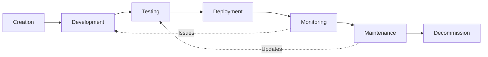
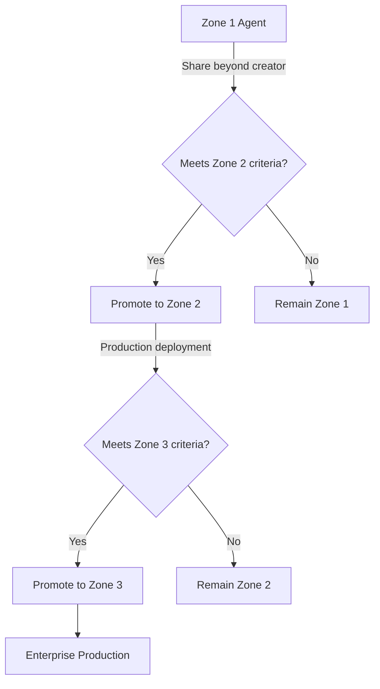
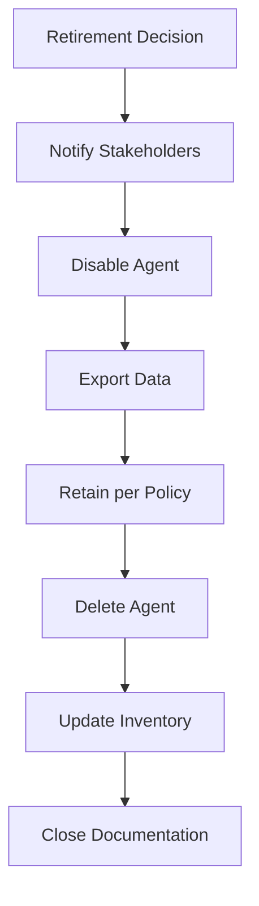

# Agent Lifecycle Governance

## Overview

This guide covers the complete agent lifecycle from creation through decommissioning, with zone-specific governance requirements at each stage. Effective lifecycle management ensures agents remain compliant, secure, and aligned with business objectives throughout their operational life.

See [Governance and security best practices](https://learn.microsoft.com/en-us/microsoft-copilot-studio/guidance/sec-gov-intro) for Microsoft's recommended approach.

---

## Lifecycle Phases

| Phase | Description | Key Activities |
|-------|-------------|----------------|
| **Creation** | Initial agent setup | Zone classification, environment selection |
| **Development** | Building and configuring | Topics, knowledge sources, connectors |
| **Testing** | Validation before promotion | Functional testing, security review |
| **Deployment** | Production release | Channel publication, user access |
| **Monitoring** | Ongoing observation | Performance, usage, compliance |
| **Maintenance** | Updates and changes | Enhancements, fixes, retraining |
| **Decommission** | Secure retirement | Data retention, access removal |

---

## Phase 1: Creation - Building Safely Within the Right Zone

### Zone Selection

Before creating an agent, determine the appropriate governance zone:

| Factor | Zone 1 | Zone 2 | Zone 3 |
|--------|--------|--------|--------|
| **Data sensitivity** | Public/internal only | Departmental data | Customer PII, financial |
| **User scope** | Individual | Team/department | Enterprise-wide |
| **External access** | No | No | Yes (with approval) |
| **Approval required** | Self-service | Manager | Governance committee |

See [Zones Guide](./zones.md) for detailed zone selection criteria.

### Environment Routing

Makers are automatically routed to appropriate environments based on security group membership:

1. **Zone 1**: Personal developer environment (auto-provisioned)
2. **Zone 2**: Team/departmental environment
3. **Zone 3**: Enterprise managed environment

See [Control 2.15: Environment Routing](../reference/pillar-2-management/2.15-environment-routing.md) for configuration.

### Initial Governance Classification

| Requirement | Zone 1 | Zone 2 | Zone 3 |
|-------------|--------|--------|--------|
| Business justification | Optional | Required | Detailed |
| Sponsor approval | None | Manager | Executive |
| Risk assessment | None | Basic | Comprehensive |
| Documentation | Minimal | Standard | Full |

---

## Phase 2: Development - Controlled Building

### Developer Environment Usage

| Environment Type | Purpose | Governance Level |
|------------------|---------|------------------|
| **Personal developer** | Individual experimentation | Minimal (Zone 1) |
| **Shared development** | Team collaboration | Standard (Zone 2) |
| **Controlled development** | Enterprise solutions | Full (Zone 3) |

### Version Control with Solutions

For Zone 2-3 agents, use Power Platform solutions for version control:

1. Create a solution containing the agent
2. Export solution for backup/deployment
3. Use ALM pipelines for promotion

See [Overview of pipelines](https://learn.microsoft.com/en-us/power-platform/alm/pipelines) for ALM guidance.

### Co-Authoring Controls

| Zone | Co-Authoring | Configuration |
|------|--------------|---------------|
| Zone 1 | Disabled | Single owner only |
| Zone 2 | Limited | Team members via security group |
| Zone 3 | Controlled | Governance-approved editors only |

### Development Checklist

- [ ] Agent created in appropriate environment
- [ ] Solution created (Zone 2-3)
- [ ] Knowledge sources configured
- [ ] Connectors reviewed for DLP compliance
- [ ] Authentication configured appropriately
- [ ] Initial testing completed

---

## Phase 3: Testing - Validation Before Promotion

### Test Environment Requirements

| Zone | Test Environment | Requirements |
|------|------------------|--------------|
| Zone 1 | Same as development | Basic functional testing |
| Zone 2 | Dedicated test environment | Formal test plan |
| Zone 3 | Production-like environment | Full validation suite |

### Validation Checklists by Zone

#### Zone 1 Testing

- [ ] Agent responds correctly to expected queries
- [ ] No sensitive data exposed
- [ ] Performance acceptable

#### Zone 2 Testing

- [ ] All Zone 1 checks
- [ ] Connectors function correctly
- [ ] Team members can access appropriately
- [ ] Manager approval obtained

#### Zone 3 Testing

- [ ] All Zone 2 checks
- [ ] Security testing completed
- [ ] Compliance review passed
- [ ] Performance benchmarks met
- [ ] Fallback scenarios tested
- [ ] User acceptance testing completed
- [ ] Governance committee approval

### Security Testing Requirements

| Test Type | Zone 1 | Zone 2 | Zone 3 |
|-----------|--------|--------|--------|
| DLP policy validation | Automatic | Required | Required |
| Authentication testing | N/A | Required | Required |
| Data access review | Optional | Required | Required |
| Penetration testing | N/A | Optional | Required |
| Bias assessment | N/A | Optional | Required |

See [Control 2.5: Testing and Validation](../reference/pillar-2-management/2.5-testing-validation-and-quality-assurance.md) for detailed procedures.

---

## Phase 4: Deployment - Controlled Promotion

### Zone Promotion Process

### ALM Pipeline Usage

For Zone 2-3 promotions, use Power Platform pipelines:

1. **Configure pipeline** in Power Apps (Solutions → Pipelines)
2. **Add stages** (Development, Test, Production)
3. **Deploy solution** with agent through pipeline
4. **Validate deployment** in target environment

> **Important:** Target environments in pipelines must be enabled as Managed Environments. Configure this in PPAC → Deployment → Settings.

**Admin monitoring:** Use PPAC → Deployment → Overview to track pending approvals and failed deployments.

See [Set up pipelines](https://learn.microsoft.com/en-us/power-platform/alm/set-up-pipelines) for configuration steps.

### Approval Workflows

| Promotion | Approvers | Documentation |
|-----------|-----------|---------------|
| Zone 1 → Zone 2 | Manager, Environment owner | Business justification |
| Zone 2 → Zone 3 | Governance committee, Compliance, Security | Full assessment package |
| Within Zone | Environment owner | Change request |

### Channel Publication

| Channel | Zone 1 | Zone 2 | Zone 3 |
|---------|--------|--------|--------|
| Microsoft 365 Chat | ✓ | ✓ | ✓ |
| Teams | ✗ | ✓ | ✓ |
| SharePoint | ✗ | ✓ | ✓ |
| External website | ✗ | ✗ | ✓ (approved) |
| Direct Line | ✗ | ✗ | ✓ (approved) |

---

## Phase 5: Monitoring - Ongoing Governance

### Performance Monitoring

| Metric | Zone 1 Target | Zone 2 Target | Zone 3 Target |
|--------|---------------|---------------|---------------|
| Success rate | >80% | >90% | >95% |
| Response time | <10s | <5s | <3s |
| Availability | 95% | 99% | 99.9% |

See [Control 3.2: Usage Analytics](../reference/pillar-3-reporting/3.2-usage-analytics-and-activity-monitoring.md) for monitoring setup.

### Usage Tracking

| Tracking | Zone 1 | Zone 2 | Zone 3 |
|----------|--------|--------|--------|
| Session counts | Monthly | Weekly | Daily |
| User analytics | Optional | Required | Required |
| Conversation logs | N/A | Sampled | Full |
| Cost tracking | Aggregate | Department | Per-agent |

### Compliance Verification

| Verification | Frequency | Zone 1 | Zone 2 | Zone 3 |
|--------------|-----------|--------|--------|--------|
| DLP compliance | Automatic | ✓ | ✓ | ✓ |
| Access review | Quarterly | ✗ | ✓ | ✓ |
| Security scan | Monthly | ✗ | ✓ | ✓ |
| Full audit | Annual | ✗ | ✗ | ✓ |

### Alert Configuration

Configure alerts for:

- Success rate drops below threshold
- Unusual usage patterns
- Security events
- Capacity approaching limits

See [Control 3.2: Usage Analytics](../reference/pillar-3-reporting/3.2-usage-analytics-and-activity-monitoring.md) for alert setup.

---

## Phase 6: Maintenance - Updates and Changes

### Change Management Process

| Change Type | Zone 1 | Zone 2 | Zone 3 |
|-------------|--------|--------|--------|
| Minor updates | Self-service | Notify manager | Change request |
| Major changes | Self-service | Manager approval | CAB approval |
| Knowledge updates | Self-service | Review required | Formal process |
| Connector changes | Self-service | Security review | Full assessment |

See [Control 2.3: Change Management](../reference/pillar-2-management/2.3-change-management-and-release-planning.md) for detailed procedures.

### Version Updates

1. **Create new solution version** in development
2. **Test changes** in test environment
3. **Deploy via pipeline** to production
4. **Validate deployment** and rollback if needed

### Owner Transitions

When agent ownership changes:

| Task | Zone 1 | Zone 2 | Zone 3 |
|------|--------|--------|--------|
| Transfer ownership | Self-service | Document transfer | Formal handover |
| Update documentation | Optional | Required | Required |
| Notify stakeholders | N/A | Team | All users |
| Compliance review | N/A | Optional | Required |

### Periodic Reviews

| Review Type | Zone 1 | Zone 2 | Zone 3 |
|-------------|--------|--------|--------|
| Business value | Annual | Quarterly | Monthly |
| Security posture | N/A | Semi-annual | Quarterly |
| Compliance | N/A | Annual | Quarterly |
| Performance | As needed | Monthly | Weekly |

---

## Phase 7: Decommissioning - Secure Retirement

### Agent Retirement Process

### Decommission Checklist

- [ ] Business justification for retirement documented
- [ ] Stakeholders notified (users, compliance, security)
- [ ] Agent disabled (not deleted initially)
- [ ] User access removed
- [ ] Conversation history exported (if required)
- [ ] Data retention requirements met
- [ ] Agent deleted from environment
- [ ] Inventory updated
- [ ] Documentation archived

### Data Retention Requirements

| Data Type | Retention Period | Zone Requirement |
|-----------|------------------|------------------|
| Conversation logs | Per retention policy | Zone 2-3 |
| Configuration | 7 years (FSI) | Zone 3 |
| Audit trail | 7 years (FSI) | Zone 2-3 |
| User data | Per privacy policy | All zones |

See [Control 1.9: Data Retention](../reference/pillar-1-security/1.9-data-retention-and-deletion-policies.md) for detailed requirements.

### Audit Trail Preservation

For Zone 3 agents:

1. Export complete audit log
2. Document reason for retirement
3. Preserve approval chain
4. Archive in compliance system
5. Retain per regulatory requirements

---

## Zone-Specific Lifecycle Summary

### Zone 1: Personal Productivity

| Phase | Governance |
|-------|------------|
| Creation | Auto-provisioned developer environment |
| Development | Self-service, minimal oversight |
| Testing | Basic functional testing |
| Deployment | Creator-only access, M365 Chat channel |
| Monitoring | Basic metrics, aggregate reporting |
| Maintenance | Self-service updates |
| Decommission | Creator-initiated, minimal retention |

### Zone 2: Team Collaboration

| Phase | Governance |
|-------|------------|
| Creation | Manager approval, team environment |
| Development | Team collaboration, version control |
| Testing | Formal test plan, security review |
| Deployment | Team access, internal channels |
| Monitoring | Weekly metrics, compliance checks |
| Maintenance | Documented changes, manager approval |
| Decommission | Stakeholder notification, data export |

### Zone 3: Enterprise Managed

| Phase | Governance |
|-------|------------|
| Creation | Committee approval, risk assessment |
| Development | Controlled environment, full documentation |
| Testing | Complete validation, security testing |
| Deployment | Phased rollout, all channels (approved) |
| Monitoring | Daily metrics, continuous compliance |
| Maintenance | CAB approval, formal change process |
| Decommission | Full audit trail, 7-year retention |

---

## Regulatory Considerations

### FSI Regulatory Requirements by Lifecycle Phase

| Phase | FINRA | SEC | SOX | GLBA |
|-------|-------|-----|-----|------|
| Creation | Supervision (3110) | - | IT Controls | - |
| Development | Documentation (4511) | 17a-3/4 | 302 | 501(b) |
| Testing | Validation | 17a-4 | 404 | - |
| Deployment | Approval records | - | 302 | 501(b) |
| Monitoring | Supervision (3110) | 17a-3/4 | 404 | 501(b) |
| Maintenance | Change records (4511) | 17a-4 | 404 | - |
| Decommission | Retention (4511) | 17a-4 | 802 | 501(b) |

### Examination Readiness

Maintain documentation at each phase for regulatory examinations:

- Agent creation requests and approvals
- Development records and version history
- Test results and validation evidence
- Deployment approvals and access lists
- Monitoring reports and incident records
- Change history and maintenance logs
- Decommission decisions and data retention proof

---

## Related Controls

- [Control 2.1: Managed Environments](../reference/pillar-2-management/2.1-managed-environments.md)
- [Control 2.3: Change Management](../reference/pillar-2-management/2.3-change-management-and-release-planning.md)
- [Control 2.5: Testing and Validation](../reference/pillar-2-management/2.5-testing-validation-and-quality-assurance.md)
- [Control 2.15: Environment Routing](../reference/pillar-2-management/2.15-environment-routing.md)
- [Control 3.1: Agent Inventory](../reference/pillar-3-reporting/3.1-agent-inventory-and-metadata-management.md)
- [Control 3.6: Orphaned Agent Detection](../reference/pillar-3-reporting/3.6-orphaned-agent-detection-and-remediation.md)

---

## Support & Questions

For lifecycle governance questions, contact:
- AI Governance Lead (governance direction)
- Compliance Officer (regulatory requirements)
- Power Platform Admin (technical setup)

---

*Last Updated: December 2025*
*Version: 1.0 Beta*
