# FSI Agent Governance Framework

Comprehensive governance framework for Microsoft 365 AI agents in financial services organizations.

## 📋 Overview

This framework provides complete guidance for deploying, governing, and managing Microsoft 365 agents (Copilot Studio, Agent Builder, and related AI services) in regulated financial services environments.

**Version:** 1.0 (January 2026)
**Target Audience:** Financial Services Organizations (FSI)
**Regulatory Focus:** FINRA, SEC, SOX, GLBA, OCC, Federal Reserve

!!! warning
    This framework is provided for informational purposes only and does not constitute legal,
    regulatory, or compliance advice. See [Disclaimer](../disclaimer.md) for full details.

---

## 📋 Scope & Assumptions

### What This Framework Covers

This framework provides governance guidance for:

- **Copilot Studio** agents
- **Agent Builder** agents
- **Power Platform** environments hosting agents
- **SharePoint** as a knowledge source for agents

### Agent Types: What's In Scope

| Agent Type | In Scope? | Governance Location |
|------------|-----------|---------------------|
| Copilot Studio custom agents | ✅ Primary focus | Power Platform Admin Center |
| Agent Builder agents (M365) | ✅ Primary focus | M365 Admin Center + PPAC |
| Microsoft-built agents (Researcher, Analyst, Facilitator) | ⚠️ Partial | M365 Admin Center (limited controls) |
| Third-party/partner agents | ⚠️ Varies by integration | M365 Admin Center |
| Agent 365 control plane | ❌ Future (Frontier preview) | M365 Admin Center |

!!! info "Microsoft Agent 365"
    **Microsoft Agent 365** is a new centralized control plane for agent governance announced at Ignite 2025, currently in **Frontier preview**. It provides centralized agent registry, Entra Agent ID, lifecycle management, and observability dashboards. This framework will incorporate Agent 365 capabilities as they reach general availability. Monitor for GA announcements if your organization participates in the Frontier program.

### What This Framework Does NOT Cover

- **Non-US regulations** (EU AI Act, GDPR, DORA, MiFID II are out of scope)
- **Non-Microsoft AI platforms** (OpenAI direct, AWS Bedrock, Google Vertex AI, etc.)
- Custom ML model development, training, or validation
- Quantitative model risk management (requires dedicated MRM programs)
- State privacy laws (CCPA/CPRA require separate analysis; see [Regulatory Mappings](../reference/regulatory-mappings.md#state-level-regulations-for-awareness))
- Third-party AI integrations outside Microsoft 365 ecosystem

!!! note
    This framework is designed for **US financial institutions** only. Institutions subject to
    non-US regulations should supplement this framework with jurisdiction-specific guidance.

### Key Assumptions

| Assumption | Rationale |
|------------|-----------|
| **Microsoft 365 E3/E5** | Required for Copilot Studio, Purview, and advanced governance features |
| **Microsoft Entra ID** | Identity and access management foundation |
| **Microsoft Purview** | Compliance and data governance capabilities |
| **Power Platform licensing** | Required for environment management and DLP policies |
| **Foundational IT controls** | Network security, endpoint protection, backup/recovery assumed in place |

### Integration with Existing Governance

This framework is designed to **complement, not replace** existing enterprise governance programs:

- Integrate controls with your existing IT risk management framework
- Align with enterprise information security policies
- Coordinate with records retention and eDiscovery requirements
- Map to your organization's internal audit program

!!! note
    Organizations should validate all controls against their specific regulatory obligations and
    existing policy frameworks.

---

## 🎯 Framework Structure

### Four Governance Pillars {#four-governance-pillars}

| Pillar | Controls | Focus | Examples |
|--------|----------|-------|----------|
| **1. [Security](../reference/pillar-1-security/index.md)** | 21 | Protect data and systems | DLP, Audit, Encryption, MFA, eDiscovery, Network Isolation |
| **2. [Management](../reference/pillar-2-management/index.md)** | 18 | Govern lifecycle and risk | Change Control, Testing, Model Risk, Multi-Agent Orchestration |
| **3. [Reporting](../reference/pillar-3-reporting/index.md)** | 10 | Monitor and track | Inventory, Usage, PPAC, Sentinel, Hallucination Feedback |
| **4. [SharePoint Mgmt](../reference/pillar-4-sharepoint/index.md)** | 6 | SharePoint-specific controls | Access, Retention, External Sharing, Grounding Scope |

**Total: 55 Comprehensive Controls**

```mermaid
graph TB
    subgraph P4["Pillar 4: SharePoint (6)"]
        SP[Access · Retention · External · Grounding]
    end
    subgraph P3["Pillar 3: Reporting (10)"]
        RP[Inventory · Usage · PPAC · Sentinel · Feedback]
    end
    subgraph P2["Pillar 2: Management (18)"]
        MG[Lifecycle · Testing · Model Risk · Multi-Agent]
    end
    subgraph P1["Pillar 1: Security (21)"]
        SC[DLP · Audit · Encryption · MFA · Network · Adversarial]
    end

    P1 --> P2 --> P3 --> P4

    style P1 fill:#42A5F5,color:#fff
    style P2 fill:#66BB6A,color:#fff
    style P3 fill:#FFA726,color:#fff
    style P4 fill:#AB47BC,color:#fff
```

### Three Governance Zones {#three-governance-zones}

| Zone | Level | Risk | Data Access | Approval |
|------|-------|------|-------------|----------|
| **[Zone 1: Personal](zones.md#zone-1)** | Low | Individual development | M365 Graph only | Self-service |
| **[Zone 2: Team](zones.md#zone-2)** | Medium | Departmental agents | Internal data | Manager approval |
| **[Zone 3: Enterprise](zones.md#zone-3)** | High | Production/customer-facing | Regulated data | Governance committee |

---

## 🔺 Governance Fundamentals

Effective agent governance operates through three interconnected layers that work together to ensure secure, compliant AI deployment.

```mermaid
graph TB
    subgraph Triangle["Governance Triangle"]
        direction TB
        Policy["🛡️ Policy<br/>Technical Controls & Guardrails"]
        Process["⚙️ Process<br/>Operational Workflows"]
        People["👥 People<br/>Roles & Responsibilities"]
    end

    Policy --> Process
    Process --> People
    People --> Policy

    style Policy fill:#42A5F5,color:#fff
    style Process fill:#66BB6A,color:#fff
    style People fill:#FFA726,color:#fff
```

### Policy Layer (Technical Controls)

The policy layer establishes automated guardrails that enforce governance without manual intervention:

| Component | Purpose | Implementation |
|-----------|---------|----------------|
| **Environment Groups** | Consistent policy across environments | [Environment groups](https://learn.microsoft.com/en-us/power-platform/admin/environment-groups) |
| **Group Rules** | Connector, sharing, channel controls | [Environment group rules](https://learn.microsoft.com/en-us/power-platform/admin/environment-groups-rules) |
| **DLP Policies** | Data boundary enforcement | [Data policies](https://learn.microsoft.com/en-us/power-platform/admin/wp-data-loss-prevention) |
| **Environment Routing** | Automatic maker placement | [Environment routing](https://learn.microsoft.com/en-us/power-platform/admin/default-environment-routing) |

### Process Layer (Operational Workflows)

The process layer defines how governance decisions are made and executed:

- **Agent Lifecycle Management** - Creation, testing, deployment, monitoring, retirement
- **Approval Workflows** - Zone-appropriate authorization paths
- **Change Control** - Controlled promotion between environments
- **Incident Response** - Detection, investigation, remediation procedures
- **Compliance Reviews** - Scheduled verification of control effectiveness

See [Governance and security best practices](https://learn.microsoft.com/en-us/microsoft-copilot-studio/guidance/sec-gov-intro) for detailed process guidance.

### People Layer (Organizational Structure)

The people layer assigns accountability and ensures human oversight:

| Role | Governance Function | Zone Focus |
|------|---------------------|------------|
| **AI Governance Lead** | Framework ownership, policy decisions | All zones |
| **Power Platform Admin** | Technical implementation, environment management | Zones 2-3 |
| **Compliance Officer** | Regulatory alignment, audit coordination | Zones 2-3 |
| **Business Owner** | Agent sponsorship, use case validation | Per agent |
| **Security / CISO** | Threat monitoring, incident response | Zone 3 |

### How the Layers Interact

1. **Policy enables Process** - Technical controls automate workflow enforcement
2. **Process guides People** - Defined procedures clarify responsibilities
3. **People inform Policy** - Human judgment shapes control configuration

!!! tip "FSI Note"
    In regulated environments, all three layers must be documented and auditable. Examiners expect
    evidence of policy configuration, process execution, and role assignment.

---

## 📁 What's Included

### Control Files (55 Total)
- **Pillar 1:** 21 Security Controls (1.1-1.21)
- **Pillar 2:** 18 Management Controls (2.1-2.18)
- **Pillar 3:** 10 Reporting Controls (3.1-3.10)
- **Pillar 4:** 6 SharePoint Controls (4.1-4.6)

Each control includes:

- Overview and regulatory reference
- 3 governance levels (Baseline, Recommended, Regulated)
- Verification and testing procedures
- Implementation guidance

### Documentation Files
- **Overview** - This page (framework introduction)
- **Quick Start** - How to start using the framework
- **Zones Guide** - Zone 1/2/3 classification and requirements
- **Lifecycle Governance** - Governance lifecycle and review cadence
- **Implementation Checklist** - Practical rollout checklist
- **Glossary** - Key terms and definitions
- **RACI Matrix** - Roles and responsibilities
- **Regulatory Mappings** - Regulation-to-control mapping
- **FAQ** - Frequently asked questions

### Supporting Files
- **CONTROL-INDEX.md** - Master index of all controls
- **Administrator Excel Templates** - Role-specific checklists and dashboards (see [Downloads](../downloads/index.md))
- **Microsoft Learn URLs** - Master list of official documentation links used in this framework

---

## 🚀 Quick Start

### For First-Time Users
1. Read [Quick Start](quick-start.md) (10 minutes)
2. Review [Zones Guide](zones.md) to classify your agents (15 minutes)
3. Check [Regulatory Mappings](../reference/regulatory-mappings.md) for your relevant regulations (10 minutes)

### For Implementation
1. Use the [Implementation Checklist](checklist.md) for step-by-step guidance
2. Reference individual control files for detailed procedures
3. Document evidence in your compliance system
4. Schedule quarterly reviews

### For Governance
1. Use the [RACI Matrix](../reference/raci-matrix.md) to assign roles and responsibilities
2. Establish governance committee per the [Zones Guide](zones.md)
3. Schedule recurring compliance reviews
4. Track incidents and remediation

---

## Regulatory Coverage

Regulatory mappings and coverage are maintained in a single canonical table.

- See [Regulatory Mappings](../reference/regulatory-mappings.md)

!!! note
    Coverage indicates which framework controls address aspects of each regulation. Actual
    compliance requires implementation, validation, and ongoing maintenance. Consult legal counsel
    for regulatory interpretation.

---

## 💡 Key Concepts

### Governance Maturity Levels

Each control is documented with 3 governance levels:

- **Level 1 - Baseline:** Minimum required implementation for compliance
- **Level 2-3 - Recommended:** Best practice implementation for Zone 2+ agents
- **Level 4 - Regulated/High-Risk:** Comprehensive controls for Zone 3 and regulated environments

### Control Implementation Approach

1. **Assess** - Current state vs. required level
2. **Implement** - Follow control guidance
3. **Verify** - Use verification procedures
4. **Document** - Record evidence for audit
5. **Review** - Schedule recurring reviews (quarterly)

**How the 5-step approach maps to control documentation:**

| Step | Control Template Section | Purpose |
|------|--------------------------|---------|
| **Assess** | Governance Levels | Determine target maturity level |
| **Implement** | Setup & Configuration | Step-by-step implementation guidance |
| **Verify** | Verification & Testing | Confirm control is working |
| **Document** | Additional Resources, Related Controls | Reference materials for audit |
| **Review** | [Governance Review Cadence](governance-review-cadence.md) | Quarterly/semi-annual/annual reviews |

---

## 📋 Governance Roles

Key roles from the [RACI Matrix](../reference/raci-matrix.md):

| Role | Responsibility |
|------|-----------------|
| **AI Governance Lead** | Framework oversight, policy decisions |
| **Compliance Officer** | Regulatory alignment, audit coordination |
| **CISO** | Security policy, threat response |
| **Power Platform Admin** | Technical implementation, environments |
| **Internal Audit** | Independent control testing |

---

## 🔧 Implementation Timeline

Typical 8-week rollout:

- **Phase 1 (Weeks 1-2):** Regulatory Compliance Baseline (11 tasks)
- **Phase 2 (Weeks 3-4):** Security Enhancements (10 tasks)
- **Phase 3 (Weeks 5-6):** Advanced Governance (8 tasks)
- **Phase 4 (Weeks 7-8):** Finalization & Operationalization (9 tasks)

See the [Implementation Checklist](checklist.md) for detailed tasks.

---

## ❓ Support & Questions

### For Different Questions:
- **"How do I get started?"** → Read [Quick Start](quick-start.md)
- **"What's my governance zone?"** → See [Zones Guide](zones.md)
- **"Which controls apply to my regulation?"** → Check [Regulatory Mappings](../reference/regulatory-mappings.md)
- **"Who does what?"** → Review [RACI Matrix](../reference/raci-matrix.md)
- **"What does this term mean?"** → Look up **Glossary.md**
- **"How do I implement this?"** → Use the [Implementation Checklist](checklist.md)
- **"Common questions?"** → See **FAQ.md**

### For Technical Implementation:
- Reference individual control files (1.1-4.5)
- Each control includes step-by-step verification procedures
- Contact your Power Platform Admin for platform-specific setup

### For Regulatory Questions:
- Review [Regulatory Mappings](../reference/regulatory-mappings.md) for regulation-to-control alignment
- Contact your Compliance Officer for regulatory interpretation
- Escalate to General Counsel for legal questions

---

## 📈 Continuous Improvement

This framework is designed for continuous evolution:

- **Quarterly Reviews:** Assess control effectiveness
- **Annual Updates:** Incorporate regulatory changes and Microsoft updates
- **Version History:** Track changes and improvements
- **Feedback Loop:** Gather input from governance team

---

## 📝 License

This framework is provided for use by financial services organizations. Modify as needed for your organization's specific requirements.

---

## 🎯 Next Steps

1. **Review** [Quick Start](quick-start.md)
2. **Assess** your current state against the framework
3. **Implement** using the step-by-step guidance
4. **Document** evidence for audit compliance
5. **Review** quarterly and update as regulations change

---

*FSI Agent Governance Framework v1.0 - January 2026*
*Comprehensive governance for Microsoft 365 agents in financial services*
