# FSI Agent Governance Framework Beta

Comprehensive governance framework for Microsoft 365 AI agents in financial services organizations.

## 📋 Overview

This framework provides complete guidance for deploying, governing, and managing Microsoft 365 agents (Copilot Studio, Agent Builder, and related AI services) in regulated financial services environments.

**Version:** 1.0 Beta (December 2025)
**Target Audience:** Financial Services Organizations (FSI)
**Regulatory Focus:** FINRA, SEC, SOX, GLBA, OCC, Federal Reserve

> **Important:** This framework is provided for informational purposes only and does not constitute legal, regulatory, or compliance advice. See [DISCLAIMER.md](/DISCLAIMER.md) for full details.

---

## 🎯 Framework Structure

### Four Governance Pillars

| Pillar | Controls | Focus | Examples |
|--------|----------|-------|----------|
| **1. Security** | 18 | Protect data and systems | DLP, Audit, Encryption, MFA |
| **2. Management** | 14 | Govern lifecycle and risk | Change Control, Testing, Model Risk |
| **3. Reporting** | 6 | Monitor and track | Inventory, Usage, Incidents, Costs |
| **4. SharePoint Mgmt** | 5 | SharePoint-specific controls | Access, Retention, External Sharing |

**Total: 43 Comprehensive Controls**

```mermaid
graph TB
    subgraph P4["Pillar 4: SharePoint (5)"]
        SP[Access · Retention · External]
    end
    subgraph P3["Pillar 3: Reporting (6)"]
        RP[Inventory · Usage · Incidents]
    end
    subgraph P2["Pillar 2: Management (14)"]
        MG[Lifecycle · Testing · Model Risk]
    end
    subgraph P1["Pillar 1: Security (18)"]
        SC[DLP · Audit · Encryption · MFA]
    end

    P1 --> P2 --> P3 --> P4

    style P1 fill:#42A5F5,color:#fff
    style P2 fill:#66BB6A,color:#fff
    style P3 fill:#FFA726,color:#fff
    style P4 fill:#AB47BC,color:#fff
```

### Three Governance Zones

| Zone | Level | Risk | Data Access | Approval |
|------|-------|------|-------------|----------|
| **Zone 1: Personal** | Low | Individual development | M365 Graph only | Self-service |
| **Zone 2: Team** | Medium | Departmental agents | Internal data | Manager approval |
| **Zone 3: Enterprise** | High | Production/customer-facing | Regulated data | Governance committee |

---

## 🔺 Governance Fundamentals

Effective agent governance operates through three interconnected layers that work together to ensure secure, compliant AI deployment.

```mermaid
graph TB
    subgraph Triangle["Governance Triangle"]
        direction TB
        Policy["🛡️ Policy<br/>Technical Controls & Guardrails"]
        Process["⚙️ Process<br/>Operational Workflows"]
        People["👥 People<br/>Roles & Responsibilities"]
    end

    Policy --> Process
    Process --> People
    People --> Policy

    style Policy fill:#42A5F5,color:#fff
    style Process fill:#66BB6A,color:#fff
    style People fill:#FFA726,color:#fff
```

### Policy Layer (Technical Controls)

The policy layer establishes automated guardrails that enforce governance without manual intervention:

| Component | Purpose | Implementation |
|-----------|---------|----------------|
| **Environment Groups** | Consistent policy across environments | [Environment groups](https://learn.microsoft.com/en-us/power-platform/admin/environment-groups) |
| **Group Rules** | Connector, sharing, channel controls | [Environment group rules](https://learn.microsoft.com/en-us/power-platform/admin/environment-groups-rules) |
| **DLP Policies** | Data boundary enforcement | [Data policies](https://learn.microsoft.com/en-us/power-platform/admin/wp-data-loss-prevention) |
| **Environment Routing** | Automatic maker placement | [Environment routing](https://learn.microsoft.com/en-us/power-platform/admin/default-environment-routing) |

### Process Layer (Operational Workflows)

The process layer defines how governance decisions are made and executed:

- **Agent Lifecycle Management** - Creation, testing, deployment, monitoring, retirement
- **Approval Workflows** - Zone-appropriate authorization paths
- **Change Control** - Controlled promotion between environments
- **Incident Response** - Detection, investigation, remediation procedures
- **Compliance Reviews** - Scheduled verification of control effectiveness

See [Governance and security best practices](https://learn.microsoft.com/en-us/microsoft-copilot-studio/guidance/sec-gov-intro) for detailed process guidance.

### People Layer (Organizational Structure)

The people layer assigns accountability and ensures human oversight:

| Role | Governance Function | Zone Focus |
|------|---------------------|------------|
| **AI Governance Lead** | Framework ownership, policy decisions | All zones |
| **Power Platform Admin** | Technical implementation, environment management | Zones 2-3 |
| **Compliance Officer** | Regulatory alignment, audit coordination | Zones 2-3 |
| **Business Owner** | Agent sponsorship, use case validation | Per agent |
| **Security Team** | Threat monitoring, incident response | Zone 3 |

### How the Layers Interact

1. **Policy enables Process** - Technical controls automate workflow enforcement
2. **Process guides People** - Defined procedures clarify responsibilities
3. **People inform Policy** - Human judgment shapes control configuration

> **FSI Note:** In regulated environments, all three layers must be documented and auditable. Examiners expect evidence of policy configuration, process execution, and role assignment.

---

## 📁 What's Included

### Control Files (48 Total)
- **Pillar 1:** 19 Security Controls (1.1-1.19)
- **Pillar 2:** 15 Management Controls (2.1-2.15)
- **Pillar 3:** 9 Reporting Controls (3.1-3.9)
- **Pillar 4:** 5 SharePoint Controls (4.1-4.5)

Each control includes:
- Overview and regulatory reference
- 3 governance levels (Baseline, Recommended, Regulated)
- Verification and testing procedures
- Implementation guidance

### Documentation Files
- **README.md** - This file (overview)
- **Zones-Overview.md** - Detailed governance zones
- **Regulatory-Mappings.md** - Regulation-to-control mapping
- **Quick-Start-Guide.md** - How to use the framework
- **Glossary.md** - Key terms and definitions
- **RACI-Matrix.md** - Roles and responsibilities
- **Implementation-Checklist.md** - Implementation roadmap
- **FAQ.md** - Frequently asked questions

### Supporting Files
- **CONTROL-INDEX.md** - Master index of all controls
- **controls_structure.json** - Control data structure
- **FSI_Agent_Governance_Framework_Beta.xlsx** - Excel workbook with templates
- **FSI_Agent_Governance_Complete_Beta.docx** - Detailed written guidance

---

## 🚀 Quick Start

### For First-Time Users
1. Read **Quick-Start-Guide.md** (10 minutes)
2. Review **Zones-Overview.md** to classify your agents (15 minutes)
3. Check **Regulatory-Mappings.md** for your relevant regulations (10 minutes)

### For Implementation
1. Use **Implementation-Checklist.md** for step-by-step guidance
2. Reference individual control files for detailed procedures
3. Document evidence in your compliance system
4. Schedule quarterly reviews

### For Governance
1. Use **RACI-Matrix.md** to assign roles and responsibilities
2. Establish governance committee per **Zones-Overview.md**
3. Schedule recurring compliance reviews
4. Track incidents and remediation

---

## Regulatory Coverage

The framework maps controls to regulatory requirements:

| Regulation | Coverage | Key Controls | Notes |
|-----------|----------|--------------|-------|
| **FINRA 4511** | 100% (43/43) | 1.7, 1.9, 2.9, 2.12 | Full coverage |
| **SEC 17a-3/4** | 88% (38/43) | 1.7, 1.9, 1.13 | Recordkeeping focus |
| **SOX 302/404** | 81% (35/43) | 2.5, 2.10, 2.12 | Internal controls |
| **GLBA 501(b)** | 93% (40/43) | 1.11, 1.15, 1.18 | Safeguards focus |
| **OCC 2011-12** | 58% (25/43) | 2.6, 2.11 | Model risk focus |
| **Fed SR 11-7** | 58% (25/43) | 2.6, 2.11 | Model risk focus |

> **Note:** Coverage percentages indicate which framework controls address aspects of each regulation. Actual compliance requires implementation, validation, and ongoing maintenance. Consult legal counsel for regulatory interpretation.

---

## 💡 Key Concepts

### Governance Maturity Levels

Each control is documented with 4 maturity levels:

- **Level 0:** Not implemented
- **Level 1:** Baseline (minimal compliance)
- **Level 2-3:** Recommended (best practices)
- **Level 4:** Regulated/High-Risk (comprehensive)

### Control Implementation Approach

1. **Assess** - Current state vs. required level
2. **Implement** - Follow control guidance
3. **Verify** - Use verification procedures
4. **Document** - Record evidence for audit
5. **Review** - Schedule recurring reviews (quarterly)

---

## 📋 Governance Roles

Key roles from **RACI-Matrix.md**:

| Role | Responsibility |
|------|-----------------|
| **AI Governance Lead** | Framework oversight, policy decisions |
| **Compliance Officer** | Regulatory alignment, audit coordination |
| **CISO** | Security policy, threat response |
| **Power Platform Admin** | Technical implementation, environments |
| **Internal Audit** | Independent control testing |

---

## 🔧 Implementation Timeline

Typical 8-week rollout:

- **Phase 1 (Weeks 1-2):** Regulatory Compliance Baseline (11 tasks)
- **Phase 2 (Weeks 3-4):** Security Enhancements (10 tasks)
- **Phase 3 (Weeks 5-6):** Advanced Governance (8 tasks)
- **Phase 4 (Weeks 7-8):** Finalization & Operationalization (9 tasks)

See **Implementation-Checklist.md** for detailed tasks.

---

## ❓ Support & Questions

### For Different Questions:
- **"How do I get started?"** → Read **Quick-Start-Guide.md**
- **"What's my governance zone?"** → See **Zones-Overview.md**
- **"Which controls apply to my regulation?"** → Check **Regulatory-Mappings.md**
- **"Who does what?"** → Review **RACI-Matrix.md**
- **"What does this term mean?"** → Look up **Glossary.md**
- **"How do I implement this?"** → Use **Implementation-Checklist.md**
- **"Common questions?"** → See **FAQ.md**

### For Technical Implementation:
- Reference individual control files (1.1-4.5)
- Each control includes step-by-step verification procedures
- Contact your Power Platform Admin for platform-specific setup

### For Regulatory Questions:
- Review **Regulatory-Mappings.md** for regulation-to-control alignment
- Contact your Compliance Officer for regulatory interpretation
- Escalate to General Counsel for legal questions

---

## 📈 Continuous Improvement

This framework is designed for continuous evolution:

- **Quarterly Reviews:** Assess control effectiveness
- **Annual Updates:** Incorporate regulatory changes and Microsoft updates
- **Version History:** Track changes and improvements
- **Feedback Loop:** Gather input from governance team

---

## 📝 License

This framework is provided for use by financial services organizations. Modify as needed for your organization's specific requirements.

---

## 🎯 Next Steps

1. **Review** the Quick-Start-Guide.md
2. **Assess** your current state against the framework
3. **Implement** using the step-by-step guidance
4. **Document** evidence for audit compliance
5. **Review** quarterly and update as regulations change

---

*FSI Agent Governance Framework Beta - December 2025*  
*Comprehensive governance for Microsoft 365 agents in financial services*
