# Governance Zones: Complete Overview

## Three-Zone Governance Model {#three-zone-governance-model}

The framework uses three governance zones to balance innovation with compliance. Agents progress from development (Zone 1) through team collaboration (Zone 2) to enterprise production (Zone 3).

### Quick Comparison {#quick-comparison}

| Attribute | Zone 1: Personal | Zone 2: Team | Zone 3: Enterprise |
|-----------|-----------------|--------------|-------------------|
| **Risk Level** | Low | Medium | High |
| **Scope** | Individual | Department | Organization-wide |
| **Data Access** | M365 Graph only | Internal data | Regulated/sensitive |
| **Approval** | Self-service | Manager | Governance Committee |
| **Audit Retention** | 30 days | 1 year | 10 years |
| **Managed Environment** | Not required | Recommended | Mandatory |
| **MFA** | Standard | Enforced | Phishing-resistant |
| **Regulatory Scrutiny** | None | Moderate | Full compliance |
| **Setup Time** | 1-2 days | 1-2 weeks | 3-6 weeks |

---

## Zone 1: Personal Productivity {#zone-1}

### Profile
- **Risk Level:** Low
- **Scope:** Individual developers
- **Typical Users:** Single user or small team
- **Data Access:** Microsoft Graph only
- **Regulatory Scrutiny:** Minimal

### Characteristics
- Development and learning environment
- Isolated from organizational controls
- Quick prototyping and experimentation
- No production customer data
- Self-service deployment

### Governance Model
- **Approval:** Self-service (no approval needed)
- **Publishing:** Self-published by creator
- **Data:** Personal data only
- **Retention:** 30 days (default)
- **Audit:** Basic logging only
- **Access Reviews:** Annual (if any)

### Typical Agents
- Personal productivity bot
- Learning/development agent
- Proof-of-concept demonstration
- Personal research assistant

### Technology Stack
- Managed Environments: Not required
- DLP: Baseline only
- Audit: 30-day retention acceptable
- Connectors: Restricted connectors allowed
- MFA: Basic (standard M365 login)

### Regulatory Status
**Zone 1 is NOT subject to FINRA, SEC, or GLBA examination.**

- No books and records requirements
- No formal supervision required
- No model risk management needed
- Sandbox environment for innovation

### Compliance Requirements
- Document agent purpose
- Maintain creator documentation
- Basic audit logging
- No external data sharing

---

## Zone 2: Team Collaboration {#zone-2}

### Profile
- **Risk Level:** Medium
- **Scope:** Teams or departments
- **Typical Users:** Team members within department
- **Data Access:** Internal departmental data
- **Regulatory Scrutiny:** Moderate

### Characteristics
- Shared across team/department
- Internal data access
- Collaboration and workflow support
- Medium business impact if fails
- Cross-team dependencies possible

### Governance Model
- **Approval:** Manager/Department Head approval required
- **Publishing:** Central publishing workflow
- **Data:** Departmental data only
- **Retention:** 1 year minimum
- **Audit:** Weekly exports recommended
- **Access Reviews:** Quarterly

### Typical Agents
- HR benefits assistant
- IT help desk support
- Document processing for team
- Compliance training delivery
- Internal knowledge bot

### Technology Stack
- Managed Environments: Recommended
- DLP: Strict policies
- Audit: 1-year retention
- Connectors: Approved connectors only
- MFA: Enforced
- Environment Groups: Recommended

### Regulatory Status
**Zone 2 is subject to MODERATE regulatory oversight:**

- FINRA examiners may request agent list and approval documentation
- SEC reviewers may inquire about data handling
- Supervisory controls per FINRA Rule 3110 required
- Annual testing recommended

### Compliance Requirements
- Formal approval workflow
- Documented business justification
- Data source documentation
- Access controls and permissions
- Monthly compliance reviews
- Training for users

### Implementation Considerations
- Department head signs off on deployment
- Compliance reviews recorded
- Access permissions documented
- Data sources approved
- Incident response procedures

---

## Zone 3: Enterprise Managed {#zone-3}

### Profile
- **Risk Level:** High
- **Scope:** Organization-wide or customer-facing
- **Typical Users:** Multiple departments, external customers
- **Data Access:** Sensitive, regulated data
- **Regulatory Scrutiny:** High / Critical

### Characteristics
- Production environment
- Customer-facing or high-value business
- Sensitive or regulated data
- Critical business impact if fails
- Full compliance requirements

### Governance Model
- **Approval:** Governance Committee + Legal review
- **Publishing:** Change control process
- **Data:** All regulated and sensitive data
- **Retention:** 10 years minimum (per SEC 17a-3/4)
- **Audit:** Real-time monitoring
- **Access Reviews:** Monthly with attestation

### Typical Agents
- Client service chatbot
- Compliance monitoring
- Trading/transaction processing
- Document processing for regulated data
- Risk assessment/credit scoring
- Financial reporting assistant

### Technology Stack
- Managed Environments: Mandatory
- DLP: Strictest policies
- Audit: 10-year retention with WORM
- Connectors: Allowlisted only
- MFA: Phishing-resistant (FIDO2/Windows Hello)
- Runtime Protection: Mandatory
- DSPM for AI: Recommended

### Regulatory Considerations
**Zone 3 agents handling regulated data may be subject to comprehensive oversight depending on institution type and use case:**

| Institution Type | Primary Regulator(s) | Key Requirements |
|-----------------|---------------------|------------------|
| **National banks** | OCC | Model risk (OCC 2011-12), third-party guidance |
| **State member banks** | Federal Reserve | SR 11-7 model risk, supervision |
| **State non-member banks** | FDIC | Interagency guidance, FFIEC IT Handbook |
| **Credit unions** | NCUA | Part 748 security program |
| **Broker-dealers** | FINRA, SEC | FINRA 3110 supervision, SEC 17a-3/4 records |
| **Investment advisers** | SEC | SEC examination, Reg BI compliance |
| **Insurers** | State regulators | NAIC model law, state-specific requirements |
| **NY-licensed entities** | NYDFS | Part 500 cybersecurity requirements |

Additional oversight may include:
- CFPB examination (consumer financial services)
- SOX controls testing (public companies)
- Internal audit review (all organizations)

### Compliance Requirements
**MANDATORY Controls:**

1. **Governance Committee Approval**
   - AI Governance Lead
   - Compliance Officer
   - CISO
   - Legal/General Counsel
   - Business Owner

2. **Model Risk Management**
   - Validation testing
   - Bias testing and fairness assessment
   - Performance monitoring vs. baseline
   - Annual third-party validation (recommended)

3. **Data Security**
   - DLP with strictest policies
   - Sensitivity labels mandatory
   - Encryption in transit and at rest
   - Customer-managed keys (recommended)

4. **Audit and Logging**
   - 10-year retention with immutable storage
   - Real-time monitoring and alerting
   - Daily compliance reviews
   - Weekly executive reporting

5. **Change Management**
   - 48-hour change review window
   - Formal change advisory board (CAB)
   - Automated rollback capability
   - Testing in lower tier before promotion

6. **Incident Response**
   - SLA for incident investigation (<4 hours)
   - Root cause analysis required
   - Executive escalation procedures
   - Board notification procedures

### Implementation Considerations
- Formal governance committee established
- Comprehensive risk assessment completed
- Model validation documented
- Security testing completed
- Legal review and sign-off obtained
- Training and awareness program implemented
- Incident response playbooks documented

---

## Zone Progression Model

Agents typically progress through zones as they mature:

### Promotion Criteria

**Zone 1 → Zone 2:**
- Proof of concept validated
- Manager approval obtained
- Data source identified and approved
- User training completed
- Incident response procedures documented

**Zone 2 → Zone 3:**
- Production readiness testing completed
- Security assessment passed
- Model risk validation completed
- Bias testing results documented
- Governance committee approval obtained
- Legal and compliance sign-off received

### Demotion/Remediation

If an agent violates governance requirements:

- **Zone 3 → Zone 2:** Policy violations, performance issues
- **Zone 2 → Zone 1:** Compliance failures, security incidents
- **Suspension:** Critical security issues (any zone)

Demotion typically requires:
- Root cause analysis
- Remediation plan
- Re-approval before re-promotion

---

## Regulation-Zone Mapping

### FINRA Examination Focus by Zone

| Zone | FINRA Focus | Key Controls | Examination Depth |
|------|-------------|--------------|-------------------|
| Zone 1 | None | N/A | None |
| Zone 2 | Supervisory controls | Rule 3110 | Moderate |
| Zone 3 | Complete oversight | Rules 3110, 4511, Notice 25-07 | Comprehensive |

### SEC Examination Focus by Zone

| Zone | SEC Focus | Key Controls | Examination Depth |
|------|-----------|--------------|-------------------|
| Zone 1 | None | N/A | None |
| Zone 2 | Data handling | Reg S-P | Limited |
| Zone 3 | Complete compliance | Rules 17a-3/4, AI disclosure | Comprehensive |

### SOX Internal Controls by Zone

| Zone | SOX Scope | Documentation | Testing |
|------|-----------|---------------|---------|
| Zone 1 | None | N/A | None |
| Zone 2 | Limited | Process docs | Annual |
| Zone 3 | Full | All controls | Annual + Continuous |

---

## Zone Decision Matrix {#zone-decision-matrix}

Use this decision tree to determine the appropriate zone for your agent:

### Questions to Determine Zone

| Question | Zone 1 | Zone 2 | Zone 3 |
|----------|--------|--------|--------|
| Who uses the agent? | Individual only | Team/Department | Organization-wide |
| What data accessed? | Microsoft Graph only | Internal data | Regulated/sensitive data |
| Customer-facing? | No | No (internal only) | Yes or customer data |
| Regulatory scrutiny? | Minimal | Moderate | High |
| Business impact if fails? | Low - inconvenience | Medium - workflow disruption | High - financial/reputational |
| Approval required? | Self-service | Manager/Dept Head | Governance Committee |
| Audit retention? | 30 days | 1 year | 10 years |

---

## Zone Selection: Detailed Criteria

### Risk-Based Classification

When determining the appropriate zone for an agent, evaluate these risk factors:

```mermaid
flowchart TD
    A[📋 New Agent Request] --> B{Data Classification?}

    B -->|Public/Personal Only| C{User Scope?}
    B -->|Internal Business Data| D{External Access?}
    B -->|Customer PII/Financial| E[🔴 Zone 3<br/>Enterprise Managed]

    C -->|Individual| F[🟢 Zone 1<br/>Personal Productivity]
    C -->|Team/Department| G{Regulatory Impact?}

    D -->|No| H[🟡 Zone 2<br/>Team Collaboration]
    D -->|Yes| E

    G -->|Minimal| H
    G -->|Moderate-High| E

    style F fill:#66BB6A,color:#fff
    style H fill:#FFA726,color:#fff
    style E fill:#EF5350,color:#fff
```

### Zone Selection Scorecard

Use this scorecard to determine the appropriate zone. Score each factor and total:

| Factor | Zone 1 (0 pts) | Zone 2 (1 pt) | Zone 3 (2 pts) |
|--------|----------------|---------------|----------------|
| **Data Sensitivity** | Personal/public | Internal business | Customer/regulated |
| **User Count** | 1 user | 2-50 users | 50+ users |
| **Business Impact** | Inconvenience | Workflow disruption | Financial/legal |
| **External Access** | None | Internal only | Customer-facing |
| **Regulatory Scope** | None | FINRA 3110 | Full compliance |
| **Data Sources** | M365 Graph | Internal SharePoint | CRM/Financial systems |

**Scoring:**
- **0-2 points:** Zone 1 - Personal Productivity
- **3-6 points:** Zone 2 - Team Collaboration
- **7+ points:** Zone 3 - Enterprise Managed

### Automatic Zone Triggers

Certain characteristics **automatically** require a specific zone:

| Trigger | Required Zone | Rationale |
|---------|---------------|-----------|
| Customer PII accessed | Zone 3 | GLBA, Reg S-P compliance |
| Financial transaction data | Zone 3 | SOX, SEC requirements |
| Credit/lending decisions | Zone 3 | ECOA, fair lending |
| External customer access | Zone 3 | Full supervision required |
| Cross-department sharing | Zone 2+ | Governance oversight |
| Production deployment | Zone 2+ | Change control required |

---

## Zone-Specific Sharing Controls

Agent sharing and publishing are enforced through individual rules in [Environment groups](https://learn.microsoft.com/en-us/power-platform/admin/environment-groups). Configure these rules in PPAC under **Manage → Environment groups → [Group] → Rules**.

### Available Sharing & Channel Rules

Based on current PPAC capabilities (29 rules available):

| Rule Name | Description | Zone Relevance |
|-----------|-------------|----------------|
| **Sharing agents with Editor permissions** | Controls who can co-author agents | All zones |
| **Sharing agents with Viewer permissions** | Controls who can view/run agents | All zones |
| **Channel access for published agents** (preview) | Controls which channels agents can publish to | Zones 2-3 |
| **Authentication for agents** (preview) | Controls agent authentication requirements | Zones 2-3 |
| **Maker welcome content** | Onboarding guidance for new makers | All zones |

### AI Model Governance Rules

| Rule Name | Description | Zone Relevance |
|-----------|-------------|----------------|
| **Enable External Models** (preview) | Allow AI models hosted outside Microsoft | Zone 3 only |
| **Preview and experimental AI models** | Allow pre-release AI capabilities | Zones 1-2 |
| **Generative AI setting** | Enable/disable generative AI features | All zones |
| **AI prompts** | Enable AI prompts feature | All zones |

### Sharing Rule Configuration

The sharing rules in PPAC are simple enable/disable toggles:

#### Sharing agents with Editor permissions

**Setting:** Checkbox - "Let people grant Editor permissions when agents are shared"

| Option | Effect |
|--------|--------|
| ☑️ Enabled | Owners/editors can grant edit access to individuals |
| ☐ Disabled | No one can share edit permissions |

**Constraints:**
- Editor permissions can only be shared with **individuals** (not security groups)
- Only people with Editor or Owner permissions can share
- Sharing limits **do not apply** when agent authentication is set to "No authentication"

See [Share and manage agents](https://learn.microsoft.com/en-us/microsoft-copilot-studio/admin-share-bots) for detailed sharing guidance.

### Zone Sharing Recommendations

| Zone | Editor Sharing | Viewer Sharing | Authentication |
|------|----------------|----------------|----------------|
| **Zone 1** | ☐ Disabled | ☐ Disabled | Required (prevents bypass) |
| **Zone 2** | ☑️ Enabled | ☑️ Enabled | Required (Entra ID) |
| **Zone 3** | ☐ Disabled* | ☑️ Enabled | Required (Entra ID) |

*Zone 3 editor sharing disabled to enforce change control - edits go through ALM pipeline.

> ⚠️ **FSI Note:** Always enable authentication for agents in Zones 2-3. Sharing limits are bypassed when authentication is disabled, creating a governance gap.

---

## Channel Access for Published Agents

Control which channels agents can publish to. Configure in PPAC under **Manage → Environment groups → [Group] → Rules → Channel access for published agents**.

> ⚠️ **Note:** If more restrictive data policies exist, those will override these channel settings.

### Available Channels

| Channel | Description | Risk Level |
|---------|-------------|------------|
| **Teams + Microsoft 365 Copilot** | Internal Microsoft channels | Low |
| **SharePoint** | SharePoint site integration | Low |
| **Dynamics 365 for Customer Service** | CRM integration | Medium |
| **Direct Line channels** | Secure connections to websites and apps | Medium-High |
| **Facebook** | Social media channel | High |
| **WhatsApp** | External messaging | High |

### Zone-Based Channel Recommendations

| Channel | Zone 1 | Zone 2 | Zone 3 |
|---------|--------|--------|--------|
| Teams + Microsoft 365 Copilot | ☑️ | ☑️ | ☑️ |
| SharePoint | ☐ | ☑️ | ☑️ |
| Dynamics 365 for Customer Service | ☐ | ☐ | ☑️ |
| Direct Line channels | ☐ | ☐ | ☑️* |
| Facebook | ☐ | ☐ | ☐** |
| WhatsApp | ☐ | ☐ | ☐** |

*Zone 3 only with security review and approval
**External social/messaging channels typically blocked in FSI for compliance

> 🏦 **FSI Compliance Note:** External channels (Facebook, WhatsApp) require FINRA-compliant archiving and supervision. Most FSI organizations disable these channels unless specific compliance controls are in place per [FINRA Rule 3110](https://www.finra.org/rules-guidance/rulebooks/finra-rules/3110) and [FINRA Regulatory Notice 17-18](https://www.finra.org/rules-guidance/notices/17-18).

---

## Implementation Guidance by Zone

### Zone 1 Setup (1-2 days)
1. Enable personal environments
2. Configure basic DLP
3. Document agent purpose
4. Train user on best practices

### Zone 2 Setup (1-2 weeks)
1. Establish approval workflow
2. Configure Managed Environments
3. Implement DLP policies
4. Set up audit logging (1-year)
5. Document compliance procedures
6. Train team members

### Zone 3 Setup (3-6 weeks)
1. Establish governance committee
2. Perform model risk assessment
3. Conduct bias and fairness testing
4. Implement comprehensive DLP
5. Configure 10-year audit retention
6. Deploy runtime protection
7. Establish incident response
8. Obtain legal and compliance sign-off
9. Train governance team and operators

---

## Common Zone Questions

**Q: Can an agent be in multiple zones?**
A: No. Each agent exists in one zone. It may progress to a higher zone as it matures.

**Q: What if an agent crosses zone boundaries?**
A: If a Zone 1 agent needs to access team data, it should be promoted to Zone 2 with appropriate approvals.

**Q: How do we prevent zone bypassing?**
A: Use environment groups, Managed Environments, and DLP policies to enforce zone boundaries technically.

**Q: Can we have Zone 1 agents access Zone 3 data?**
A: No. Zone 1 is restricted to Microsoft Graph. Access to regulated data requires Zone 3.

---

## Quarterly Zone Reviews

Each zone should have recurring compliance reviews:

- **Zone 1:** Annual review (if tracked)
- **Zone 2:** Quarterly compliance review
- **Zone 3:** Monthly review with attestation

---

*FSI Agent Governance Framework Beta - December 2025*
