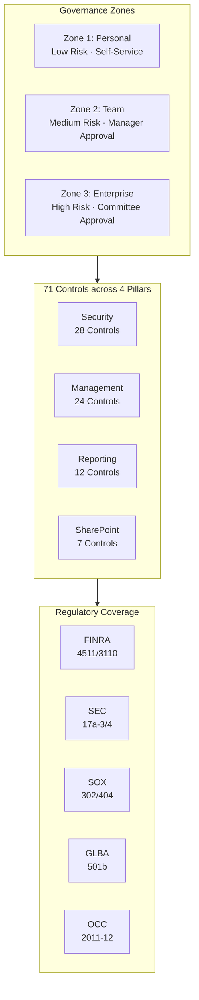

---
hide:
  - navigation
  - toc
---

# AI Agent Governance for **Financial Services**

Govern Microsoft 365 AI agents with confidence — from policy to production.
71 controls, implementation playbooks, and regulatory mappings for
Copilot Studio, Agent Builder, and custom agent deployments.

[Get Started](getting-started/quick-start.md){ .md-button .md-button--primary }
[View Control Catalog](controls/index.md){ .md-button }

  

    71
    Controls
  

  

    4
    Governance Pillars
  

  

    5
    Regulatory Frameworks
  

  

    3
    Governance Zones
  

  FINRA · SEC · SOX · GLBA · OCC/SR 11-7

## Quick Start by Role

-   :material-shield-check:{ .lg .middle } **Compliance Officer**

    ---

    Map controls to FINRA, SEC, SOX, and GLBA requirements.
    Build examination-ready evidence packs.

    [:material-arrow-right: Start Here](framework/executive-summary.md)

-   :material-cog:{ .lg .middle } **Power Platform Admin**

    ---

    Deploy controls, run playbooks, and configure
    governance across your M365 tenant.

    [:material-arrow-right: Start Here](controls/index.md)

-   :material-security:{ .lg .middle } **IT Security / InfoSec**

    ---

    Implement DLP, audit logging, encryption, MFA,
    and 28 security controls across your tenant.

    [:material-arrow-right: Start Here](controls/pillar-1-security/index.md)

-   :material-file-document-check:{ .lg .middle } **Examination Readiness**

    ---

    Prepare for FINRA/SEC examinations with
    evidence standards and audit checklists.

    [:material-arrow-right: Start Here](playbooks/compliance-and-audit/audit-readiness-checklist.md)

-   :material-account-tie:{ .lg .middle } **Business Owner**

    ---

    Understand zone requirements and the agent
    approval lifecycle for your team.

    [:material-arrow-right: Start Here](framework/zones-and-tiers.md)

## Framework Architecture

---

!!! warning "Disclaimer"
    This framework is provided for informational purposes only and does not constitute legal, regulatory, or compliance advice. Organizations should consult with their legal counsel and compliance teams. See [Disclaimer](disclaimer.md) for full details.
