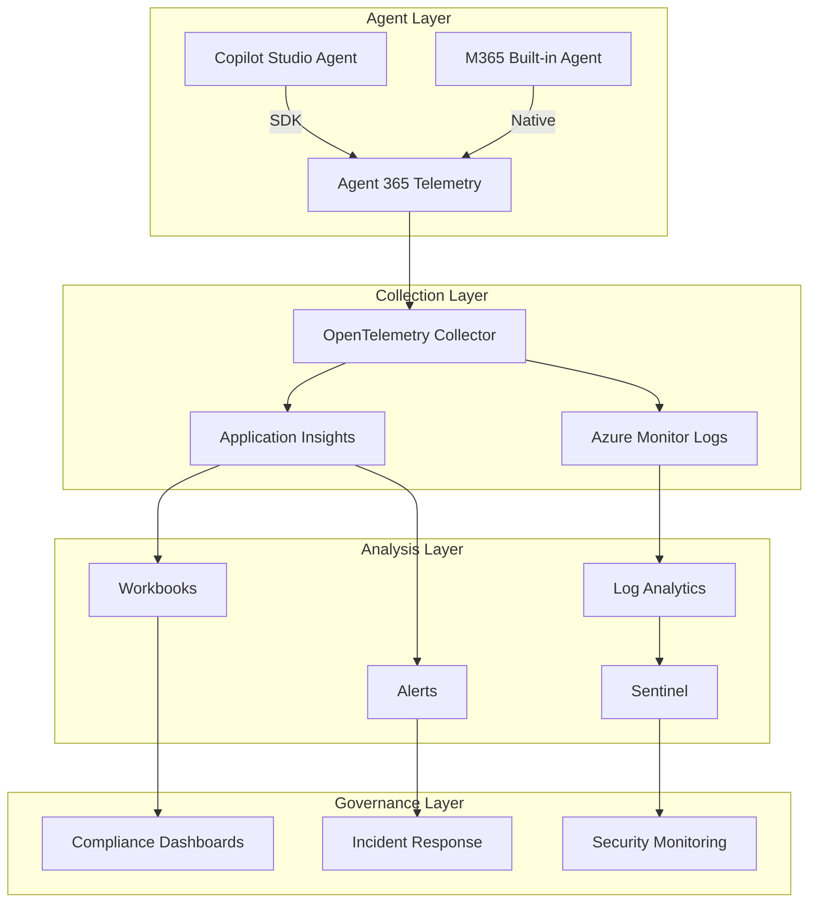

# Agent 365 Observability Implementation Guide

**Last Updated:** January 2026
**Version:** v1.2.6

---

## Overview

This playbook provides implementation guidance for Microsoft Agent 365 SDK observability features, enabling enterprise-grade telemetry capture for AI agents. The observability framework supports both Copilot Studio custom agents and M365 built-in agents.

!!! note "Preview Features"
    Agent 365 SDK observability features are in preview. Telemetry schemas and configuration options may change before general availability.

---

## Why Observability Matters for FSI

| Regulatory Driver | Observability Requirement |
|-------------------|---------------------------|
| **FINRA 25-07** | Capture interaction patterns for supervision |
| **SEC 17a-3/4** | Retain telemetry for regulatory examination |
| **SOX 302/404** | Monitor agent reliability for internal controls |
| **OCC 2011-12** | Performance metrics for model risk management |
| **GLBA 501(b)** | Security event monitoring |

---

## Architecture Overview



---

## Telemetry Signal Categories

### Performance Signals

| Signal | Description | FSI Use Case |
|--------|-------------|--------------|
| `agent.response.latency` | End-to-end response time | SLA monitoring, user experience |
| `agent.response.success` | Success/failure ratio | Reliability tracking |
| `agent.tool.duration` | Tool/connector call duration | Performance optimization |
| `agent.token.usage` | Token consumption per interaction | Cost allocation |

### Interaction Signals

| Signal | Description | FSI Use Case |
|--------|-------------|--------------|
| `agent.interaction.count` | Interaction volume | Usage analytics |
| `agent.topic.triggered` | Topic activation patterns | Intent analysis |
| `agent.fallback.triggered` | Fallback topic usage | Quality monitoring |
| `agent.handoff.count` | Human handoff frequency | Supervision metrics |

### Security Signals

| Signal | Description | FSI Use Case |
|--------|-------------|--------------|
| `agent.rai.filter.triggered` | RAI content filter activations | Safety monitoring |
| `agent.dlp.block` | DLP policy blocks | Data protection evidence |
| `agent.auth.failure` | Authentication failures | Security monitoring |
| `agent.access.denied` | Authorization denials | Access governance |

### Governance Signals

| Signal | Description | FSI Use Case |
|--------|-------------|--------------|
| `agent.blueprint.phase` | Current lifecycle phase | Change tracking |
| `agent.sponsor.status` | Sponsorship validation | Accountability |
| `agent.config.change` | Configuration modifications | Audit trail |

---

## Implementation Scope

### By Zone

| Component | Zone 1 | Zone 2 | Zone 3 |
|-----------|--------|--------|--------|
| Basic telemetry | ✓ | ✓ | ✓ |
| Application Insights | Optional | Recommended | Required |
| Custom workbooks | - | ✓ | ✓ |
| Real-time alerting | - | Optional | Required |
| Sentinel integration | - | - | Required |
| Long-term retention | 30 days | 90 days | 7+ years |

### By Agent Type

| Agent Type | Native Telemetry | SDK Required | Custom Signals |
|------------|------------------|--------------|----------------|
| M365 Copilot | ✓ (UAL) | No | Limited |
| Copilot Studio | ✓ (UAL) | Recommended | Full support |
| M365 Built-in (Researcher, etc.) | ✓ (UAL) | No | Limited |
| Blueprint-registered | ✓ | Yes | Full support |

---

## Quick Start

### 1. Enable Application Insights

```powershell
# Create Application Insights resource
$aiParams = @{
    ResourceGroupName = "rg-agent-governance"
    Name = "ai-agent-observability"
    Location = "eastus"
    Kind = "web"
    ApplicationType = "web"
}
$appInsights = New-AzApplicationInsights @aiParams

# Store connection string securely
$connectionString = $appInsights.ConnectionString
Set-AzKeyVaultSecret -VaultName "kv-agent-governance" -Name "AppInsightsConnection" -SecretValue (ConvertTo-SecureString $connectionString -AsPlainText -Force)
```

### 2. Configure Agent SDK (Preview)

For Copilot Studio agents with SDK observability:

```javascript
// Agent SDK configuration (preview)
const agentConfig = {
  observability: {
    enabled: true,
    connectionString: process.env.APPLICATIONINSIGHTS_CONNECTION_STRING,
    signals: {
      performance: true,
      interactions: true,
      security: true,
      governance: true
    },
    sampling: {
      rate: 1.0,  // 100% for Zone 3
      excludeHealthChecks: true
    },
    enrichment: {
      zone: "Zone3",
      blueprintId: process.env.BLUEPRINT_ID,
      sponsorId: process.env.SPONSOR_ID
    }
  }
};
```

### 3. Create Workbooks

Deploy standard workbooks for FSI monitoring:

- [Application Insights Workbooks](application-insights-workbooks.md) - Dashboard templates

### 4. Configure Alerts

Set up zone-based alerting thresholds:

- [Alerting Configuration](alerting-configuration.md) - Alert rules

---

## Playbook Contents

| Document | Description |
|----------|-------------|
| [OpenTelemetry Setup](opentelemetry-setup.md) | Collector configuration for custom telemetry export |
| [Application Insights Workbooks](application-insights-workbooks.md) | Dashboard templates for Zone 2/3 monitoring |
| [Alerting Configuration](alerting-configuration.md) | Zone-based alert thresholds and escalation |

---

## Data Retention Requirements

| Zone | Hot Storage | Warm Storage | Cold/Archive |
|------|-------------|--------------|--------------|
| Zone 1 | 30 days | - | - |
| Zone 2 | 90 days | 1 year | - |
| Zone 3 | 90 days | 1 year | 7-10 years |

### Regulatory Alignment

| Regulation | Minimum Retention | Recommended |
|------------|-------------------|-------------|
| FINRA 4511 | 6 years | 7 years |
| SEC 17a-3/4 | 6 years | 7 years |
| SOX 404 | 7 years | 7 years |
| GLBA | 5 years | 7 years |

---

## Correlation ID Tracing

### Cross-System Correlation

The Agent 365 SDK generates correlation IDs that flow through:

1. **User Request** → Copilot interaction
2. **Agent Processing** → Agent 365 telemetry
3. **Tool Invocation** → Connector/API calls
4. **Audit Logging** → Purview UAL
5. **Security Events** → Sentinel

### Correlation Query Example

```kql
// Trace complete interaction path
let correlationId = "abc123-correlation-id";

// Application Insights traces
let aiTraces = traces
| where timestamp > ago(24h)
| where customDimensions.correlationId == correlationId
| project timestamp, Source = "AppInsights", Operation = operation_Name, Details = message;

// Purview audit events
let auditEvents = OfficeActivity
| where TimeGenerated > ago(24h)
| where CorrelationId == correlationId
| project timestamp = TimeGenerated, Source = "UAL", Operation = Operation, Details = tostring(AuditData);

// Combine
union aiTraces, auditEvents
| order by timestamp asc
```

---

## Integration with Existing Controls

| Control | Integration Point |
|---------|-------------------|
| [1.7 - Audit Logging](../../../controls/pillar-1-security/1.7-comprehensive-audit-logging-and-compliance.md) | Complement UAL with SDK telemetry |
| [3.2 - Usage Analytics](../../../controls/pillar-3-reporting/3.2-usage-analytics-and-activity-monitoring.md) | Enhanced interaction metrics |
| [3.9 - Sentinel Integration](../../../controls/pillar-3-reporting/3.9-microsoft-sentinel-integration.md) | Security signal forwarding |
| [1.8 - Runtime Protection](../../../controls/pillar-1-security/1.8-runtime-protection-and-external-threat-detection.md) | RAI filter telemetry |

---

## Related Resources

- [Microsoft Learn: Agent 365 Observability (Preview)](https://learn.microsoft.com/en-us/microsoft-agent-365/developer/observability)
- [Microsoft Learn: Application Insights Overview](https://learn.microsoft.com/en-us/azure/azure-monitor/app/app-insights-overview)
- [Microsoft Learn: OpenTelemetry in Azure Monitor](https://learn.microsoft.com/en-us/azure/azure-monitor/app/opentelemetry-overview)
- [Agent Audit Event Taxonomy](../../../reference/agent-audit-event-taxonomy.md)

---

*FSI Agent Governance Framework v1.2.6 - January 2026*
