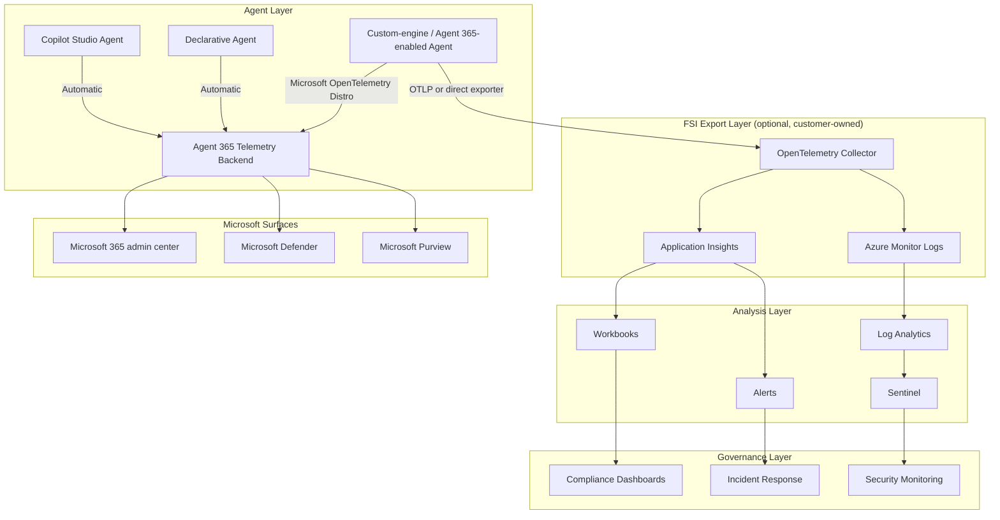

# Agent 365 Observability Implementation Guide

**Last Updated:** June 2026
**Version:** v1.6.2

---

## Overview

This playbook provides implementation guidance for capturing Microsoft Agent 365 telemetry in an FSI-governed environment. Microsoft documents two distinct telemetry paths ([Agent observability](https://learn.microsoft.com/en-us/microsoft-agent-365/developer/observability), [Observability integration for Copilot Studio](https://learn.microsoft.com/microsoft-agent-365/builder/observability)):

| Agent type | How telemetry is emitted | Action required |
|------------|--------------------------|-----------------|
| **Copilot Studio agents** | Automatic — the platform runtime emits OpenTelemetry-compliant spans to the Agent 365 observability backend with no SDK code required | No code; verify telemetry appears in Microsoft 365 admin center, Defender, and Purview |
| **Declarative agents** | Automatic ("supported out of the box. No SDK implementation required" per Learn) | No code; same admin surfaces as above |
| **Custom-engine agents** | Manual instrumentation via the Microsoft OpenTelemetry Distro (or the legacy Agent 365 Observability SDK) | Install packages and call the distro's enable function in the agent host |
| **Agent 365-enabled agents** | Manual instrumentation via the Microsoft OpenTelemetry Distro (or the legacy Agent 365 Observability SDK) | Install packages and call the distro's enable function in the agent host |

This playbook focuses on the FSI overlay (zone-based retention, SIEM/Sentinel export, App Insights workbooks, and regulatory retention mapping) that wraps either telemetry path.

!!! note "Status and SDK direction"
    Per Learn, the recommended path for new manual instrumentation is the **[Microsoft OpenTelemetry Distro](https://learn.microsoft.com/en-us/microsoft-agent-365/developer/microsoft-opentelemetry)** — a single distribution that powers Agent 365, Microsoft Foundry, and Azure Monitor. The legacy Agent 365 Observability SDK "continues to work without breaking changes," and per-language migration guides are linked from Learn. SDK packages are pre-1.0 today (for example, Python `microsoft-agents-a365-observability-core` at `0.3.x`, Node `@microsoft/agents-a365-observability` at `0.2.0-preview.1`, .NET `Microsoft.Agents.A365.Observability.Runtime` at `0.3-beta`); pin versions and review the Learn migration guides before upgrading. <!-- NEEDS_HUMAN_REVIEW: Microsoft Learn does not publish an explicit "Preview" or "GA" status label for the Agent 365 Observability surface as a whole; treat the pre-1.0 package versions as the practical maturity signal. -->

!!! note "What Copilot Studio captures automatically"
    Per Learn, Copilot Studio currently emits **Invoke agent**, **Output message**, and **Execute tool** spans for authenticated, single-tenant sessions only. Multi-tenant agents, unauthenticated sessions, and agents with names longer than 42 characters are excluded; large message and tool fields are truncated. Plan FSI evidence collection accordingly. ([Source](https://learn.microsoft.com/microsoft-agent-365/builder/observability))

---

## Why Observability Matters for FSI

| Regulatory Driver | Observability Requirement |
|-------------------|---------------------------|
| **FINRA 3110** | Capture interaction patterns for supervision |
| **SEC 17a-3/4** | Retain telemetry for regulatory examination |
| **SOX 302/404** | Monitor agent reliability for internal controls |
| **OCC Bulletin 2026-13 (formerly OCC 2011-12)** | Performance metrics for model risk management |
| **GLBA 501(b)** | Security event monitoring |

---

## Architecture Overview


```mermaid
flowchart TB
    subgraph "Agent Layer"
        A[Copilot Studio Agent] -->|Automatic| B[Agent 365 Telemetry Backend]
        C[Declarative Agent] -->|Automatic| B
        N[Custom-engine / Agent 365-enabled Agent] -->|Microsoft OpenTelemetry Distro| B
    end

    subgraph "FSI Export Layer (optional, customer-owned)"
        N -->|OTLP or direct exporter| D[OpenTelemetry Collector]
        D --> E[Application Insights]
        D --> F[Azure Monitor Logs]
    end

    subgraph "Microsoft Surfaces"
        B --> P[Microsoft 365 admin center]
        B --> Q[Microsoft Defender]
        B --> R[Microsoft Purview]
    end

    subgraph "Analysis Layer"
        E --> G[Workbooks]
        E --> H[Alerts]
        F --> I[Log Analytics]
        I --> J[Sentinel]
    end

    subgraph "Governance Layer"
        G --> K[Compliance Dashboards]
        H --> L[Incident Response]
        J --> M[Security Monitoring]
    end
```

> :inbox_tray: **Download diagram:** [PNG](../../../images/diagrams/index-architecture-overview.png) | [SVG](../../../images/diagrams/index-architecture-overview.svg)

---

## Telemetry Schema

### Documented Agent 365 scopes (manual instrumentation)

Per [Agent observability](https://learn.microsoft.com/en-us/microsoft-agent-365/developer/observability), the Microsoft OpenTelemetry Distro (and the legacy Agent 365 Observability SDK) emit spans organized into four scopes. The attribute names below are taken directly from the Learn "Validate for store publishing" section.

| Scope | Purpose | Selected required attributes |
|-------|---------|-------------------------------|
| `InvokeAgentScope` | Wraps an end-to-end agent invocation | `gen_ai.agent.id`, `gen_ai.agent.name`, `gen_ai.operation.name`, `gen_ai.conversation.id`, `gen_ai.input.messages`, `gen_ai.output.messages`, `microsoft.a365.agent.blueprint.id`, `microsoft.tenant.id`, `microsoft.channel.name`, `user.id`, `user.email`, `client.address` |
| `ExecuteToolScope` | Tool / connector call inside an invocation | `gen_ai.tool.name`, `gen_ai.tool.type`, `gen_ai.tool.call.id`, `gen_ai.tool.call.arguments`, `gen_ai.tool.call.result`, plus the agent-identity attributes above |
| `InferenceScope` | LLM call(s) inside an invocation | `gen_ai.provider.name`, `gen_ai.request.model`, `gen_ai.usage.input_tokens`, `gen_ai.usage.output_tokens`, `gen_ai.response.finish_reasons`, plus agent identity |
| `OutputScope` | Asynchronous agent output when the parent scope cannot capture it inline | `gen_ai.output.messages`, agent identity, conversation identity |

Latency is the inherent span duration of each scope. The `error.type` attribute is optional on every scope and is the documented success/failure indicator.

### Copilot Studio automatic spans

Per [Observability integration for Copilot Studio](https://learn.microsoft.com/microsoft-agent-365/builder/observability), Copilot Studio emits three event types automatically using OpenTelemetry generative-AI semantic conventions:

| Span name | Purpose | Selected attributes |
|-----------|---------|---------------------|
| `InvokeAgent` | Agent invocation start | `gen_ai.operation.name = invoke_agent`, `gen_ai.agent.id`, `gen_ai.agent.name`, `gen_ai.agent.type = CopilotStudio`, `gen_ai.conversation.id`, `gen_ai.input.messages`, `tenant.id` |
| `OutputMessages` | Agent response | `gen_ai.operation.name = output_messages`, `gen_ai.output.messages`, agent and conversation identity |
| `ExecuteTool` | Connector / action invocation | `gen_ai.operation.name = execute_tool`, `gen_ai.tool.name`, `gen_ai.tool.arguments`, `gen_ai.tool.call.id`, `gen_ai.tool.type` |

Copilot Studio attribute names use a slightly different prefix scheme than the manual-instrumentation scopes (for example, `gen_ai.agent.applicationid` and `gen_ai.agent.platformid` rather than `microsoft.a365.agent.platform.id`). When you query telemetry from both populations, account for both naming styles.

### FSI projections (illustrative, not a Microsoft schema)

The metric names below are convenient FSI shorthand. They are **not** documented Agent 365 telemetry fields. To use them you must derive them at query time from the documented scopes above, or add them via an OpenTelemetry Collector `attributes` processor as shown in [OpenTelemetry Setup](opentelemetry-setup.md).

| Projection | Derived from | FSI use case |
|------------|--------------|--------------|
| Response latency (P50/P95/P99) | `InvokeAgentScope` span duration | SLA monitoring |
| Success / failure ratio | `error.type` presence on `InvokeAgentScope` | Reliability tracking |
| Tool call duration | `ExecuteToolScope` span duration grouped by `gen_ai.tool.name` | Performance optimization |
| Token usage | `gen_ai.usage.input_tokens` + `gen_ai.usage.output_tokens` on `InferenceScope` | Cost allocation |
| Interaction volume | Count of `InvokeAgentScope` (or Copilot Studio `InvokeAgent`) spans | Usage analytics |

<!-- NEEDS_HUMAN_REVIEW: Signals previously listed in this section as "agent.topic.triggered", "agent.fallback.triggered", "agent.handoff.count", "agent.rai.filter.triggered", "agent.dlp.block", "agent.auth.failure", "agent.access.denied", "agent.blueprint.phase", "agent.sponsor.status", and "agent.config.change" are NOT documented in Microsoft Learn for the Agent 365 SDK / Microsoft OpenTelemetry Distro. RAI, DLP, authentication, and access-control events surface through Microsoft Defender and Microsoft Purview (referenced from the Agent 365 admin surface) rather than as named SDK telemetry fields. Lifecycle (Blueprint phase / sponsor status / config change) is an FSI-overlay concern that must be emitted by the agent application itself or sourced from a separate audit pipeline. Before promoting any of these to a production signal, confirm the exact emission point with the Agent 365 product team or the relevant Defender/Purview admin-surface documentation. -->

The KQL examples in [Application Insights Workbooks](application-insights-workbooks.md) and [Alerting Configuration](alerting-configuration.md) use illustrative span names and custom dimensions (for example, `fsi_zone`) that are added by the OTel Collector pipeline in this playbook, not by the Agent 365 SDK.

---

## Implementation Scope

### By Zone

| Component | Zone 1 | Zone 2 | Zone 3 |
|-----------|--------|--------|--------|
| Basic telemetry | ✓ | ✓ | ✓ |
| Application Insights | Optional | Recommended | Required |
| Custom workbooks | - | ✓ | ✓ |
| Real-time alerting | - | Optional | Required |
| Sentinel integration | - | - | Required |
| Long-term retention | 30 days | 90 days | 7+ years |

### By Agent Type

Per [Agent observability](https://learn.microsoft.com/en-us/microsoft-agent-365/developer/observability) "Supported agents":

| Agent Type | Microsoft-emitted telemetry | Manual SDK instrumentation | Custom attributes for FSI overlay |
|------------|------------------------------|----------------------------|------------------------------------|
| Declarative agent | Automatic (Agent 365 backend; "supported out of the box. No SDK implementation required") | No | Limited — additional FSI dimensions cannot be added at the agent |
| Copilot Studio agent | Automatic (Agent 365 backend; spans listed above) | No | Limited — additional FSI dimensions must be projected at query time or attached downstream via the Collector |
| Custom-engine agent | None until SDK is wired in | Yes — Microsoft OpenTelemetry Distro (preferred) or legacy SDK | Full — add via OpenTelemetry resource attributes and Collector processors |
| Agent 365-enabled agent | None until SDK is wired in | Yes — Microsoft OpenTelemetry Distro (preferred) or legacy SDK | Full — add via OpenTelemetry resource attributes and Collector processors |

<!-- NEEDS_HUMAN_REVIEW: Microsoft 365 Unified Audit Log (UAL) covers tenant-level admin and activity events. The Learn observability articles do not assert that every Agent 365 telemetry signal is mirrored to UAL; FSI teams that depend on UAL evidence should validate coverage in their tenant before relying on it. -->


---

## Quick Start

### 1. Enable Application Insights

```powershell
# Create Application Insights resource
$aiParams = @{
    ResourceGroupName = "rg-agent-governance"
    Name = "ai-agent-observability"
    Location = "eastus"
    Kind = "web"
    ApplicationType = "web"
}
$appInsights = New-AzApplicationInsights @aiParams

# Store connection string securely
$connectionString = $appInsights.ConnectionString
Set-AzKeyVaultSecret -VaultName "kv-agent-governance" -Name "AppInsightsConnection" -SecretValue (ConvertTo-SecureString $connectionString -AsPlainText -Force)
```

### 2. Enable telemetry export from a custom-engine or Agent 365-enabled agent

Skip this step for Copilot Studio or declarative agents — they emit telemetry automatically (verify in Microsoft 365 admin center).

For Node.js custom-engine agents, install and enable the [Microsoft OpenTelemetry Distro](https://learn.microsoft.com/en-us/microsoft-agent-365/developer/microsoft-opentelemetry):

```bash
npm install @microsoft/opentelemetry
```

```typescript
// Call this as early as possible in the agent host entry point so
// instrumentations can patch libraries before they're loaded.
import { useMicrosoftOpenTelemetry, AgenticTokenCacheInstance } from '@microsoft/opentelemetry';
import { resourceFromAttributes } from '@opentelemetry/resources';

useMicrosoftOpenTelemetry({
  resource: resourceFromAttributes({
    'service.name': process.env.AGENT_NAME ?? 'fsi-agent',
    'service.version': process.env.AGENT_VERSION ?? '0.0.0',
    // FSI overlay attributes flow through as resource attributes on every span.
    'fsi.zone': process.env.GOVERNANCE_ZONE,
    'fsi.blueprint.id': process.env.BLUEPRINT_ID,
    'fsi.sponsor.id': process.env.SPONSOR_ID,
  }),
  azureMonitor: {
    enabled: Boolean(process.env.APPLICATIONINSIGHTS_CONNECTION_STRING),
  },
  a365: {
    enabled: process.env.ENABLE_A365_OBSERVABILITY_EXPORTER !== 'false',
    tokenResolver: (agentId, tenantId) =>
      AgenticTokenCacheInstance.getObservabilityToken(agentId, tenantId) ?? '',
  },
});
```

The Microsoft OpenTelemetry Distro exports directly to Azure Monitor and to the Agent 365 backend; a separate OpenTelemetry Collector is **only** required when you need to fan out to additional sinks (for example, Splunk, Datadog, or WORM file storage). See [OpenTelemetry Setup](opentelemetry-setup.md) for the Collector pattern.

For Python and .NET equivalents, see the corresponding tabs in the Learn doc and the per-language migration guides linked from the [Observability SDK overview](https://learn.microsoft.com/en-us/microsoft-agent-365/developer/observability).

<!-- NEEDS_HUMAN_REVIEW: The `AgenticTokenCacheInstance` helper is documented as the recommended pattern for agents using the @microsoft/agents-hosting package. For agent hosts that don't use that package, a custom token resolver is required; see the "Token resolver" and "Manual token resolver" sections in Learn before adopting in production. -->


### 3. Create Workbooks

Deploy standard workbooks from **Azure portal > Application Insights resource > Monitoring > Workbooks** for FSI monitoring. ([Application Insights Workbooks](https://learn.microsoft.com/en-us/azure/azure-monitor/visualize/workbooks-overview))

- [Application Insights Workbooks](application-insights-workbooks.md) - Dashboard templates

### 4. Configure Alerts

Set up zone-based alerting thresholds:

- [Alerting Configuration](alerting-configuration.md) - Alert rules

---

## Playbook Contents

| Document | Description |
|----------|-------------|
| [OpenTelemetry Setup](opentelemetry-setup.md) | Collector configuration for custom telemetry export |
| [Application Insights Workbooks](application-insights-workbooks.md) | Dashboard templates for Zone 2/3 monitoring |
| [Alerting Configuration](alerting-configuration.md) | Zone-based alert thresholds and escalation |

---

## Data Retention Requirements

| Zone | Hot Storage | Warm Storage | Cold/Archive |
|------|-------------|--------------|--------------|
| Zone 1 | 30 days | - | - |
| Zone 2 | 90 days | 1 year | - |
| Zone 3 | 90 days | 1 year | 7-10 years |

### Regulatory Alignment

| Regulation | Minimum Retention | Recommended |
|------------|-------------------|-------------|
| FINRA 4511 | 6 years | 7 years |
| SEC 17a-3/4 | 6 years | 7 years |
| SOX 404 | 7 years | 7 years |
| GLBA | 5 years | 7 years |

---

## Trace correlation

### Cross-System correlation

Agent 365 telemetry uses standard OpenTelemetry trace IDs and span IDs, plus baggage attributes that propagate identifiers across services. Per Learn ([Baggage attributes](https://learn.microsoft.com/en-us/microsoft-agent-365/developer/observability#baggage-attributes)), the SDK supports automatic baggage population from `TurnContext`, carrying caller, agent, tenant, channel, and conversation details. The OpenTelemetry trace context (`traceparent` / `tracestate` HTTP headers) connects spans across:

1. **User request** — Copilot interaction
2. **Agent processing** — `InvokeAgentScope` (or Copilot Studio `InvokeAgent`)
3. **Tool invocation** — `ExecuteToolScope` (or Copilot Studio `ExecuteTool`) with `gen_ai.tool.call.id`
4. **Inference** — `InferenceScope`
5. **Downstream audit** — Microsoft 365 Unified Audit Log (UAL) entries can be joined on tenant and time, but UAL does not currently carry the OpenTelemetry trace ID. <!-- NEEDS_HUMAN_REVIEW: Confirm whether any Defender/Purview event taxonomy carries the OTel trace ID; the Learn observability articles do not explicitly assert this. -->

### Correlation query example

```kql
// Trace a complete interaction path using the OpenTelemetry trace ID.
// In Application Insights, the OTel trace ID surfaces as `operation_Id`.
let traceId = "abc123-trace-id";

// Application Insights traces
let aiTraces = traces
| where timestamp > ago(24h)
| where operation_Id == traceId
| project timestamp, Source = "AppInsights", Operation = operation_Name, Details = message;

// Purview audit events (best-effort join on tenant and time window)
let auditEvents = OfficeActivity
| where TimeGenerated > ago(24h)
| project timestamp = TimeGenerated, Source = "UAL", Operation = Operation, Details = tostring(AuditData);

// Combine
union aiTraces, auditEvents
| order by timestamp asc
```

---

## Integration with Existing Controls

| Control | Integration Point |
|---------|-------------------|
| [1.7 - Audit Logging](../../../controls/pillar-1-security/1.7-comprehensive-audit-logging-and-compliance.md) | Complement UAL with SDK telemetry |
| [3.2 - Usage Analytics](../../../controls/pillar-3-reporting/3.2-usage-analytics-and-activity-monitoring.md) | Enhanced interaction metrics |
| [3.9 - Sentinel Integration](../../../controls/pillar-3-reporting/3.9-microsoft-sentinel-integration.md) | Security signal forwarding |
| [1.8 - Runtime Protection](../../../controls/pillar-1-security/1.8-runtime-protection-and-external-threat-detection.md) | RAI filter telemetry |

---

## Related Resources

- [Microsoft Learn: Agent observability (SDK overview)](https://learn.microsoft.com/en-us/microsoft-agent-365/developer/observability)
- [Microsoft Learn: Microsoft OpenTelemetry Distro](https://learn.microsoft.com/en-us/microsoft-agent-365/developer/microsoft-opentelemetry)
- [Microsoft Learn: Observability integration for Copilot Studio](https://learn.microsoft.com/microsoft-agent-365/builder/observability)
- [Microsoft Learn: Application Insights overview](https://learn.microsoft.com/en-us/azure/azure-monitor/app/app-insights-overview)
- [Microsoft Learn: OpenTelemetry in Azure Monitor](https://learn.microsoft.com/en-us/azure/azure-monitor/app/opentelemetry-overview)
- [Agent Audit Event Taxonomy](../../../reference/agent-audit-event-taxonomy.md)

---

*Updated: June 2026 | Version: v1.6.2 | UI Verification Status: Current*
