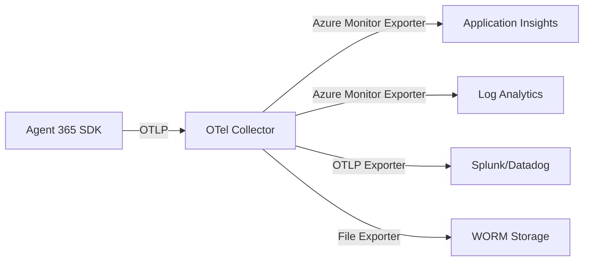

# OpenTelemetry Collector Configuration

> Part of [Agent 365 Observability Implementation Guide](index.md)

---

## Overview

This guide covers OpenTelemetry Collector configuration for capturing and exporting Agent 365 telemetry to multiple destinations including Application Insights, Azure Monitor, and third-party SIEM systems.

---

## Architecture



---

## Prerequisites

- Azure subscription with monitoring resources
- Application Insights workspace
- Log Analytics workspace
- Network connectivity from agent hosting environment

---

## Step 1: Deploy OpenTelemetry Collector

### Azure Container Apps Deployment

Deploy the collector as an Azure Container App for scalability:

```bicep
// otel-collector.bicep
resource containerApp 'Microsoft.App/containerApps@2023-05-01' = {
  name: 'otel-collector-agents'
  location: resourceGroup().location
  properties: {
    managedEnvironmentId: containerAppEnv.id
    configuration: {
      ingress: {
        external: false
        targetPort: 4317
        transport: 'http2'
      }
      secrets: [
        {
          name: 'appinsights-connection'
          value: appInsightsConnectionString
        }
      ]
    }
    template: {
      containers: [
        {
          name: 'otel-collector'
          image: 'otel/opentelemetry-collector-contrib:latest'
          resources: {
            cpu: json('0.5')
            memory: '1Gi'
          }
          env: [
            {
              name: 'APPLICATIONINSIGHTS_CONNECTION_STRING'
              secretRef: 'appinsights-connection'
            }
          ]
          volumeMounts: [
            {
              volumeName: 'config'
              mountPath: '/etc/otelcol-contrib'
            }
          ]
        }
      ]
      volumes: [
        {
          name: 'config'
          storageType: 'AzureFile'
          storageName: 'otel-config'
        }
      ]
      scale: {
        minReplicas: 2
        maxReplicas: 10
      }
    }
  }
}
```

### Kubernetes Deployment

For AKS environments:

```yaml
# otel-collector-deployment.yaml
apiVersion: apps/v1
kind: Deployment
metadata:
  name: otel-collector-agents
  namespace: agent-governance
spec:
  replicas: 2
  selector:
    matchLabels:
      app: otel-collector
  template:
    metadata:
      labels:
        app: otel-collector
    spec:
      containers:
        - name: otel-collector
          image: otel/opentelemetry-collector-contrib:0.91.0
          ports:
            - containerPort: 4317  # OTLP gRPC
            - containerPort: 4318  # OTLP HTTP
            - containerPort: 8888  # Metrics
          volumeMounts:
            - name: config
              mountPath: /etc/otelcol-contrib
          env:
            - name: APPLICATIONINSIGHTS_CONNECTION_STRING
              valueFrom:
                secretKeyRef:
                  name: otel-secrets
                  key: appinsights-connection
      volumes:
        - name: config
          configMap:
            name: otel-collector-config
---
apiVersion: v1
kind: Service
metadata:
  name: otel-collector
  namespace: agent-governance
spec:
  selector:
    app: otel-collector
  ports:
    - name: otlp-grpc
      port: 4317
      targetPort: 4317
    - name: otlp-http
      port: 4318
      targetPort: 4318
```

---

## Step 2: Configure Collector

### Base Configuration

```yaml
# otel-collector-config.yaml
receivers:
  otlp:
    protocols:
      grpc:
        endpoint: 0.0.0.0:4317
      http:
        endpoint: 0.0.0.0:4318

processors:
  # Batch processing for efficiency
  batch:
    timeout: 10s
    send_batch_size: 1000
    send_batch_max_size: 1500

  # Memory limiter to prevent OOM
  memory_limiter:
    check_interval: 5s
    limit_percentage: 80
    spike_limit_percentage: 25

  # Attribute enrichment for FSI governance
  attributes:
    actions:
      - key: fsi.governance.version
        action: upsert
        value: "1.2.6"
      - key: fsi.data.classification
        action: upsert
        from_attribute: agent.zone

  # Resource detection
  resourcedetection:
    detectors: [env, azure]
    timeout: 5s

  # Filter sensitive data
  filter:
    error_mode: ignore
    traces:
      span:
        # Remove PII from span names
        - 'attributes["user.email"] != nil'

exporters:
  # Azure Monitor / Application Insights
  azuremonitor:
    connection_string: ${env:APPLICATIONINSIGHTS_CONNECTION_STRING}
    maxbatchsize: 100
    maxbatchinterval: 10s

  # Log Analytics for Sentinel integration
  azuremonitor/logs:
    connection_string: ${env:APPLICATIONINSIGHTS_CONNECTION_STRING}
    instrumentation_key: ${env:APPINSIGHTS_INSTRUMENTATIONKEY}

  # Debug logging (development only)
  logging:
    verbosity: detailed
    sampling_initial: 5
    sampling_thereafter: 200

  # File export for WORM compliance
  file:
    path: /var/log/otel/agent-telemetry.json
    rotation:
      max_megabytes: 100
      max_days: 1
      max_backups: 7
      localtime: true

service:
  pipelines:
    traces:
      receivers: [otlp]
      processors: [memory_limiter, batch, attributes, resourcedetection]
      exporters: [azuremonitor, file]
    metrics:
      receivers: [otlp]
      processors: [memory_limiter, batch, attributes]
      exporters: [azuremonitor]
    logs:
      receivers: [otlp]
      processors: [memory_limiter, batch, attributes, filter]
      exporters: [azuremonitor/logs, file]

  telemetry:
    logs:
      level: info
    metrics:
      address: 0.0.0.0:8888
```

---

## Step 3: Zone-Specific Configuration

### Zone 2 Configuration

```yaml
# Zone 2: Standard telemetry with 90-day retention focus
processors:
  attributes/zone2:
    actions:
      - key: fsi.zone
        action: upsert
        value: "Zone2"
      - key: fsi.retention.days
        action: upsert
        value: "90"

  # Sample to reduce volume (90% retention)
  probabilistic_sampler:
    sampling_percentage: 90

exporters:
  azuremonitor/zone2:
    connection_string: ${env:APPINSIGHTS_ZONE2_CONNECTION}
```

### Zone 3 Configuration

```yaml
# Zone 3: Full telemetry capture, no sampling
processors:
  attributes/zone3:
    actions:
      - key: fsi.zone
        action: upsert
        value: "Zone3"
      - key: fsi.retention.days
        action: upsert
        value: "2555"  # 7 years
      - key: fsi.regulatory.finra
        action: upsert
        value: "true"

# No sampling for Zone 3 - capture everything
# Remove probabilistic_sampler from pipeline

exporters:
  # Primary: Application Insights
  azuremonitor/zone3:
    connection_string: ${env:APPINSIGHTS_ZONE3_CONNECTION}

  # Secondary: Blob storage for WORM
  azureblob:
    container: agent-telemetry-archive
    connection_string: ${env:STORAGE_CONNECTION}
    partition: minute
    file_prefix: zone3-

  # Tertiary: Sentinel workspace
  azuremonitor/sentinel:
    connection_string: ${env:SENTINEL_WORKSPACE_CONNECTION}
```

---

## Step 4: Agent SDK Integration

### Copilot Studio Agent Configuration

Configure the Agent 365 SDK to export telemetry:

```javascript
// agent-telemetry-config.js
const { NodeSDK } = require('@opentelemetry/sdk-node');
const { OTLPTraceExporter } = require('@opentelemetry/exporter-trace-otlp-grpc');
const { OTLPMetricExporter } = require('@opentelemetry/exporter-metrics-otlp-grpc');
const { Resource } = require('@opentelemetry/resources');
const { SemanticResourceAttributes } = require('@opentelemetry/semantic-conventions');

// Configure SDK
const sdk = new NodeSDK({
  resource: new Resource({
    [SemanticResourceAttributes.SERVICE_NAME]: process.env.AGENT_NAME,
    [SemanticResourceAttributes.SERVICE_VERSION]: process.env.AGENT_VERSION,
    'fsi.zone': process.env.GOVERNANCE_ZONE,
    'fsi.blueprint.id': process.env.BLUEPRINT_ID,
    'fsi.sponsor.id': process.env.SPONSOR_ID,
    'fsi.environment': process.env.ENVIRONMENT_NAME
  }),
  traceExporter: new OTLPTraceExporter({
    url: process.env.OTEL_COLLECTOR_ENDPOINT
  }),
  metricExporter: new OTLPMetricExporter({
    url: process.env.OTEL_COLLECTOR_ENDPOINT
  })
});

// Custom spans for agent operations
const tracer = sdk.trace.getTracer('agent-365-telemetry');

function instrumentAgentInteraction(interactionId, userId) {
  return tracer.startActiveSpan('agent.interaction', {
    attributes: {
      'agent.interaction.id': interactionId,
      'agent.user.id': userId,
      'agent.timestamp': new Date().toISOString()
    }
  }, (span) => {
    return {
      recordToolCall: (toolName, duration, success) => {
        span.addEvent('tool.invocation', {
          'tool.name': toolName,
          'tool.duration.ms': duration,
          'tool.success': success
        });
      },
      recordRaiFilter: (filterType, action) => {
        span.addEvent('rai.filter', {
          'rai.filter.type': filterType,
          'rai.filter.action': action
        });
      },
      end: (status) => {
        span.setStatus({ code: status });
        span.end();
      }
    };
  });
}

module.exports = { sdk, instrumentAgentInteraction };
```

### PowerShell Agent Instrumentation

For PowerShell-based agents:

```powershell
# Agent telemetry helper functions
function Initialize-AgentTelemetry {
    param(
        [string]$AgentName,
        [string]$Zone,
        [string]$CollectorEndpoint
    )

    $script:TelemetryConfig = @{
        AgentName = $AgentName
        Zone = $Zone
        CollectorEndpoint = $CollectorEndpoint
        SessionId = [Guid]::NewGuid().ToString()
    }
}

function Send-AgentTrace {
    param(
        [string]$OperationName,
        [hashtable]$Attributes,
        [timespan]$Duration
    )

    $trace = @{
        resourceSpans = @(
            @{
                resource = @{
                    attributes = @(
                        @{ key = "service.name"; value = @{ stringValue = $script:TelemetryConfig.AgentName } }
                        @{ key = "fsi.zone"; value = @{ stringValue = $script:TelemetryConfig.Zone } }
                    )
                }
                scopeSpans = @(
                    @{
                        scope = @{ name = "agent-powershell-telemetry" }
                        spans = @(
                            @{
                                traceId = [Convert]::ToBase64String([Guid]::NewGuid().ToByteArray())
                                spanId = [Convert]::ToBase64String([Guid]::NewGuid().ToByteArray()[0..7])
                                name = $OperationName
                                startTimeUnixNano = ([DateTimeOffset]::UtcNow.AddMilliseconds(-$Duration.TotalMilliseconds)).ToUnixTimeMilliseconds() * 1000000
                                endTimeUnixNano = [DateTimeOffset]::UtcNow.ToUnixTimeMilliseconds() * 1000000
                                attributes = $Attributes.GetEnumerator() | ForEach-Object {
                                    @{ key = $_.Key; value = @{ stringValue = $_.Value.ToString() } }
                                }
                            }
                        )
                    }
                )
            }
        )
    }

    try {
        Invoke-RestMethod -Uri "$($script:TelemetryConfig.CollectorEndpoint)/v1/traces" `
                          -Method Post `
                          -ContentType "application/json" `
                          -Body ($trace | ConvertTo-Json -Depth 10)
    } catch {
        Write-Warning "Failed to send telemetry: $_"
    }
}
```

---

## Step 5: Verify Telemetry Flow

### Health Check Queries

```kql
// Verify traces are flowing to Application Insights
traces
| where timestamp > ago(1h)
| where customDimensions.fsi_zone != ""
| summarize count() by bin(timestamp, 5m), tostring(customDimensions.fsi_zone)
| render timechart

// Check for telemetry gaps
traces
| where timestamp > ago(24h)
| summarize Count = count() by bin(timestamp, 1h)
| where Count < 10
| project GapTime = timestamp, Count
```

### PowerShell Verification

```powershell
# Test OTLP endpoint connectivity
function Test-OTelCollector {
    param([string]$Endpoint)

    try {
        $response = Invoke-RestMethod -Uri "$Endpoint/health" -Method Get -TimeoutSec 5
        Write-Host "Collector healthy: $($response.status)" -ForegroundColor Green
        return $true
    } catch {
        Write-Host "Collector unreachable: $_" -ForegroundColor Red
        return $false
    }
}

# Verify telemetry in Application Insights
function Get-RecentAgentTelemetry {
    param(
        [string]$AppInsightsId,
        [string]$AgentName,
        [int]$Minutes = 60
    )

    $query = @"
traces
| where timestamp > ago($($Minutes)m)
| where customDimensions.service_name == '$AgentName'
| summarize TotalTraces = count(),
            Zones = make_set(customDimensions.fsi_zone)
| project TotalTraces, Zones
"@

    $result = Invoke-AzOperationalInsightsQuery -WorkspaceId $AppInsightsId -Query $query
    return $result.Results
}
```

---

## Troubleshooting

### Common Issues

| Issue | Cause | Resolution |
|-------|-------|------------|
| No telemetry in App Insights | Connection string incorrect | Verify env variable |
| High latency in traces | Batch size too large | Reduce `send_batch_size` |
| Missing attributes | Processor order wrong | Check processor pipeline order |
| OOM errors | No memory limiter | Add `memory_limiter` processor |
| Sampling artifacts | Wrong sampler | Use `probabilistic_sampler` for consistency |

### Debug Mode

Enable verbose logging temporarily:

```yaml
service:
  telemetry:
    logs:
      level: debug
      output_paths: [stdout, /var/log/otel/collector.log]
```

---

## Related Resources

- [Overview](index.md) - Observability architecture
- [Application Insights Workbooks](application-insights-workbooks.md) - Dashboard templates
- [Alerting Configuration](alerting-configuration.md) - Alert rules
- [Microsoft Learn: OpenTelemetry in Azure](https://learn.microsoft.com/en-us/azure/azure-monitor/app/opentelemetry-overview)

---

*FSI Agent Governance Framework v1.2.6 - January 2026*
