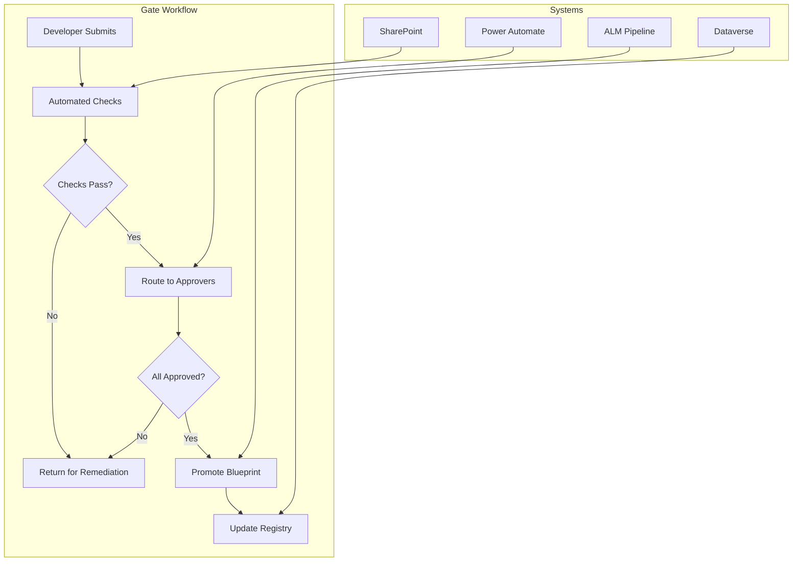

# Blueprint Promotion Gates Implementation Guide

> Part of [Agent Blueprint Promotion Gates](index.md)

---

## Overview

This guide provides step-by-step instructions for implementing Blueprint promotion gates using Power Platform ALM pipelines and Power Automate approval workflows.

---

## Prerequisites

- Power Platform Admin role or Environment Admin role
- Power Automate Premium license (for approvals)
- SharePoint site for artifact storage
- Security groups for approver roles configured
- Agent 365 Blueprint registration enabled (Preview)

---

## Architecture Overview



---

## Step 1: Configure SharePoint Artifact Storage

### Create Document Library Structure

1. Navigate to your governance SharePoint site
2. Create document libraries:

```powershell
# Connect to SharePoint
Connect-PnPOnline -Url "https://contoso.sharepoint.com/sites/AgentGovernance" -Interactive

# Create libraries for gate artifacts
$libraries = @(
    @{ Name = "Design"; Description = "Gate 1 artifacts" },
    @{ Name = "Build"; Description = "Gate 2 artifacts" },
    @{ Name = "Test"; Description = "Gate 3 artifacts" },
    @{ Name = "UAT"; Description = "Gate 4 UAT artifacts" },
    @{ Name = "Production"; Description = "Production configuration" },
    @{ Name = "Security"; Description = "Security scan reports" },
    @{ Name = "Compliance"; Description = "Compliance attestations" }
)

foreach ($lib in $libraries) {
    New-PnPList -Title $lib.Name -Template DocumentLibrary -Url $lib.Name
    Set-PnPList -Identity $lib.Name -Description $lib.Description
}
```

### Configure Metadata Columns

Add tracking metadata to each library:

```powershell
# Add common columns to all libraries
$commonColumns = @(
    @{ Name = "AgentId"; Type = "Text" },
    @{ Name = "BlueprintId"; Type = "Text" },
    @{ Name = "Zone"; Type = "Choice"; Choices = @("Zone1", "Zone2", "Zone3") },
    @{ Name = "GateNumber"; Type = "Choice"; Choices = @("G1", "G2", "G3", "G4") },
    @{ Name = "Version"; Type = "Text" },
    @{ Name = "SubmittedBy"; Type = "User" },
    @{ Name = "ApprovalStatus"; Type = "Choice"; Choices = @("Pending", "Approved", "Rejected") }
)

foreach ($lib in $libraries) {
    foreach ($col in $commonColumns) {
        if ($col.Type -eq "Choice") {
            Add-PnPField -List $lib.Name -DisplayName $col.Name -InternalName $col.Name -Type Choice -Choices $col.Choices
        } else {
            Add-PnPField -List $lib.Name -DisplayName $col.Name -InternalName $col.Name -Type $col.Type
        }
    }
}
```

---

## Step 2: Create Dataverse Gate Tracking Tables

### Gate Request Table

Create a Dataverse table to track gate requests:

**Table Name:** `fsi_gaterequest`

| Column | Type | Description |
|--------|------|-------------|
| `fsi_gaterequestid` | GUID (PK) | Unique identifier |
| `fsi_name` | Text | Request display name |
| `fsi_agentid` | Text | Agent identifier |
| `fsi_blueprintid` | Text | Blueprint identifier |
| `fsi_gatenumber` | Choice | G1, G2, G3, G4 |
| `fsi_zone` | Choice | Zone1, Zone2, Zone3 |
| `fsi_status` | Choice | Draft, Submitted, InReview, Approved, Rejected |
| `fsi_submittedby` | Lookup (User) | Submitter |
| `fsi_submittedon` | DateTime | Submission timestamp |
| `fsi_currentphase` | Text | Current blueprint phase |
| `fsi_targetphase` | Text | Target blueprint phase |

### Gate Approval Table

**Table Name:** `fsi_gateapproval`

| Column | Type | Description |
|--------|------|-------------|
| `fsi_gateapprovalid` | GUID (PK) | Unique identifier |
| `fsi_gaterequest` | Lookup | Parent gate request |
| `fsi_approverrole` | Text | Approver role name |
| `fsi_approver` | Lookup (User) | Approving user |
| `fsi_decision` | Choice | Pending, Approved, Rejected, Conditional |
| `fsi_decisiondate` | DateTime | Decision timestamp |
| `fsi_comments` | Multiline Text | Approver comments |
| `fsi_conditions` | Multiline Text | Conditional requirements |

### PowerShell: Create Tables

```powershell
# Connect to Dataverse
$conn = Connect-CrmOnline -ServerUrl "https://contoso.crm.dynamics.com"

# Create Gate Request table
$gateRequestEntity = @{
    LogicalName = "fsi_gaterequest"
    DisplayName = "Gate Request"
    DisplayCollectionName = "Gate Requests"
    Description = "Blueprint promotion gate requests"
    PrimaryAttributeName = "fsi_name"
}

# Create via XRM Tooling or Power Platform CLI
pac solution add-table --name fsi_gaterequest --display-name "Gate Request"
```

---

## Step 3: Configure Power Automate Approval Workflows

### Gate 1 Approval Flow

Create a cloud flow triggered when a Gate 1 request is submitted.

**Flow Name:** `FSI-Gate1-DesignReview`

```json
{
  "definition": {
    "$schema": "https://schema.management.azure.com/providers/Microsoft.Logic/schemas/2016-06-01/workflowdefinition.json#",
    "triggers": {
      "When_Gate_Request_Created": {
        "type": "OpenApiConnectionWebhook",
        "inputs": {
          "host": {
            "connectionName": "shared_commondataservice"
          },
          "parameters": {
            "entityName": "fsi_gaterequest",
            "filterExpression": "fsi_gatenumber eq 'G1' and fsi_status eq 'Submitted'"
          }
        }
      }
    },
    "actions": {
      "Get_Approvers": {
        "type": "OpenApiConnection",
        "inputs": {
          "parameters": {
            "groupId": "sg-gate1-approvers-{zone}"
          }
        }
      },
      "Run_Automated_Checks": {
        "type": "Scope",
        "actions": {
          "Check_Data_Sources_Declared": {},
          "Check_Sponsor_Assigned": {},
          "Check_Zone_Classification": {}
        }
      },
      "Start_Approval": {
        "type": "OpenApiConnection",
        "inputs": {
          "host": {
            "connectionName": "shared_approvals"
          },
          "parameters": {
            "approvalType": "Custom",
            "title": "Gate 1 Design Review: @{triggerBody()?['fsi_name']}",
            "assignedTo": "@{body('Get_Approvers')?['value']}",
            "details": "Agent: @{triggerBody()?['fsi_agentid']}\nZone: @{triggerBody()?['fsi_zone']}\nBlueprint: @{triggerBody()?['fsi_blueprintid']}",
            "itemLink": "@{triggerBody()?['fsi_designdocurl']}",
            "responseOptions": ["Approve", "Reject", "Request Changes"]
          }
        }
      },
      "Process_Response": {
        "type": "Switch",
        "expression": "@body('Start_Approval')?['outcome']",
        "cases": {
          "Approve": {
            "actions": {
              "Update_Status_Approved": {},
              "Promote_Blueprint": {},
              "Notify_Submitter": {}
            }
          },
          "Reject": {
            "actions": {
              "Update_Status_Rejected": {},
              "Create_Remediation_Task": {},
              "Notify_Submitter_Rejection": {}
            }
          }
        }
      }
    }
  }
}
```

### Zone-Specific Approver Routing

Configure dynamic approver selection based on zone:

```json
{
  "Get_Approvers_By_Zone": {
    "type": "Switch",
    "expression": "@triggerBody()?['fsi_zone']",
    "cases": {
      "Zone2": {
        "actions": {
          "Get_Zone2_Approvers": {
            "inputs": {
              "groupId": "sg-gate1-zone2-approvers"
            }
          }
        }
      },
      "Zone3": {
        "actions": {
          "Get_Zone3_Approvers": {
            "inputs": {
              "groupId": "sg-gate1-zone3-approvers"
            }
          },
          "Get_Compliance_Approvers": {
            "inputs": {
              "groupId": "sg-compliance-officers"
            }
          },
          "Merge_Approvers": {
            "type": "Compose",
            "inputs": "@union(body('Get_Zone3_Approvers')?['value'], body('Get_Compliance_Approvers')?['value'])"
          }
        }
      }
    }
  }
}
```

---

## Step 4: Integrate with Power Platform ALM Pipelines

### Configure Pipeline with Gate Checkpoints

1. Navigate to **Power Platform Admin Center** > **Pipelines**
2. Create or edit your deployment pipeline
3. Add pre-deployment gates:

**Portal Path:** PPAC > Environments > [Environment] > Pipelines > [Pipeline] > Pre-deployment

| Gate Type | Configuration |
|-----------|---------------|
| **Manual validation** | Require approval from gate approver group |
| **Invoke REST API** | Call gate status check endpoint |
| **Query Azure Monitor** | Verify automated checks passed |

### Pre-Deployment Gate Script

Create an Azure Function to verify gate status:

```csharp
[FunctionName("CheckGateStatus")]
public static async Task<IActionResult> Run(
    [HttpTrigger(AuthorizationLevel.Function, "get", "post")] HttpRequest req,
    ILogger log)
{
    string blueprintId = req.Query["blueprintId"];
    string gateNumber = req.Query["gateNumber"];

    // Query Dataverse for gate status
    var gateRequest = await GetGateRequest(blueprintId, gateNumber);

    if (gateRequest == null)
    {
        return new BadRequestObjectResult(new {
            status = "failed",
            message = $"No gate request found for Blueprint {blueprintId}, Gate {gateNumber}"
        });
    }

    if (gateRequest.Status != "Approved")
    {
        return new BadRequestObjectResult(new {
            status = "failed",
            message = $"Gate {gateNumber} not approved. Current status: {gateRequest.Status}"
        });
    }

    return new OkObjectResult(new {
        status = "succeeded",
        message = $"Gate {gateNumber} approved on {gateRequest.ApprovalDate}",
        approvers = gateRequest.Approvers
    });
}
```

### Pipeline YAML with Gates

For Azure DevOps integration:

```yaml
trigger:
  - main

stages:
  - stage: Gate1_Design
    displayName: 'Gate 1: Design Review'
    jobs:
      - deployment: DesignGate
        environment: 'AgentGovernance-Design'
        strategy:
          runOnce:
            preDeploy:
              steps:
                - task: InvokeRESTAPI@1
                  inputs:
                    connectionType: 'connectedServiceName'
                    serviceConnection: 'GateService'
                    method: 'GET'
                    urlSuffix: '/api/CheckGateStatus?blueprintId=$(BlueprintId)&gateNumber=G1'
                    waitForCompletion: true
            deploy:
              steps:
                - script: echo "Design review passed"

  - stage: Gate2_Build
    displayName: 'Gate 2: Build Complete'
    dependsOn: Gate1_Design
    jobs:
      - deployment: BuildGate
        environment: 'AgentGovernance-Build'
        strategy:
          runOnce:
            preDeploy:
              steps:
                - task: InvokeRESTAPI@1
                  inputs:
                    urlSuffix: '/api/CheckGateStatus?blueprintId=$(BlueprintId)&gateNumber=G2'
                - task: PowerShell@2
                  displayName: 'Run Security Scan'
                  inputs:
                    targetType: 'inline'
                    script: |
                      # Run automated security checks
                      $scanResult = Invoke-SecurityScan -AgentId $(AgentId)
                      if ($scanResult.CriticalFindings -gt 0) {
                        throw "Security scan failed with critical findings"
                      }
            deploy:
              steps:
                - script: echo "Build complete, ready for test"

  - stage: Gate3_Test
    displayName: 'Gate 3: Test Complete'
    dependsOn: Gate2_Build
    jobs:
      - deployment: TestGate
        environment: 'AgentGovernance-Test'
        strategy:
          runOnce:
            preDeploy:
              steps:
                - task: ManualValidation@0
                  displayName: 'QA Sign-off Required'
                  inputs:
                    notifyUsers: 'qa-leads@contoso.com'
                    instructions: 'Review test results and approve for staging'
            deploy:
              steps:
                - script: echo "Testing complete"

  - stage: Gate4_Production
    displayName: 'Gate 4: Production Deployment'
    dependsOn: Gate3_Test
    jobs:
      - deployment: ProductionGate
        environment: 'AgentGovernance-Production'
        strategy:
          runOnce:
            preDeploy:
              steps:
                - task: ManualValidation@0
                  displayName: 'CAB Approval Required'
                  inputs:
                    notifyUsers: 'cab@contoso.com,compliance@contoso.com'
                    instructions: 'Review UAT results and rollback plan. Approve for production.'
                - task: InvokeRESTAPI@1
                  displayName: 'Verify All Gates Passed'
                  inputs:
                    urlSuffix: '/api/VerifyAllGates?blueprintId=$(BlueprintId)'
            deploy:
              steps:
                - task: PowerPlatformExportSolution@2
                  inputs:
                    authenticationType: 'PowerPlatformSPN'
                    PowerPlatformSPN: 'ProductionConnection'
                    SolutionName: '$(SolutionName)'
```

---

## Step 5: Configure Automated Gate Checks

### Security Scan Automation

```powershell
function Invoke-AgentSecurityScan {
    param(
        [string]$AgentId,
        [string]$EnvironmentId
    )

    # Export agent for analysis
    $agent = Get-AdminPowerAppAgent -AgentId $AgentId -EnvironmentId $EnvironmentId

    $scanResults = @{
        AgentId = $AgentId
        ScanDate = Get-Date -Format "o"
        Findings = @()
    }

    # Check for hardcoded credentials
    $topics = Get-AdminPowerAppAgentTopics -AgentId $AgentId
    foreach ($topic in $topics) {
        $content = $topic.Content | ConvertFrom-Json
        if ($content -match '(password|secret|key|token)\s*[:=]\s*["\x27][^"\x27]+["\x27]') {
            $scanResults.Findings += @{
                Severity = "Critical"
                Type = "CredentialExposure"
                Location = "Topic: $($topic.Name)"
                Description = "Potential hardcoded credential detected"
            }
        }
    }

    # Check connector permissions
    $connectors = Get-AdminPowerAppAgentConnectors -AgentId $AgentId
    foreach ($connector in $connectors) {
        if ($connector.Permissions -contains "FullAccess") {
            $scanResults.Findings += @{
                Severity = "High"
                Type = "ExcessivePermissions"
                Location = "Connector: $($connector.Name)"
                Description = "Connector has FullAccess permission"
            }
        }
    }

    # Check DLP policy compliance
    $dlpResult = Test-DlpPolicyCompliance -AgentId $AgentId
    if (-not $dlpResult.Compliant) {
        $scanResults.Findings += @{
            Severity = "High"
            Type = "DLPViolation"
            Location = "Agent"
            Description = "Agent violates DLP policy: $($dlpResult.Policy)"
        }
    }

    # Calculate summary
    $scanResults.Summary = @{
        Critical = ($scanResults.Findings | Where-Object { $_.Severity -eq "Critical" }).Count
        High = ($scanResults.Findings | Where-Object { $_.Severity -eq "High" }).Count
        Medium = ($scanResults.Findings | Where-Object { $_.Severity -eq "Medium" }).Count
        Low = ($scanResults.Findings | Where-Object { $_.Severity -eq "Low" }).Count
        Passed = $scanResults.Summary.Critical -eq 0 -and $scanResults.Summary.High -eq 0
    }

    return $scanResults
}
```

### DLP Compliance Check

```powershell
function Test-DlpPolicyCompliance {
    param([string]$AgentId)

    $connectors = Get-AdminPowerAppAgentConnectors -AgentId $AgentId
    $policies = Get-DlpPolicy -EnvironmentName (Get-AdminPowerAppAgent -AgentId $AgentId).EnvironmentId

    $violations = @()

    foreach ($policy in $policies) {
        $businessConnectors = $policy.BusinessDataGroup
        $nonBusinessConnectors = $policy.NonBusinessDataGroup
        $blockedConnectors = $policy.BlockedGroup

        foreach ($connector in $connectors) {
            # Check if connector is blocked
            if ($blockedConnectors -contains $connector.Id) {
                $violations += @{
                    Policy = $policy.DisplayName
                    Connector = $connector.Name
                    Violation = "Connector is blocked by policy"
                }
            }

            # Check for cross-group data flow
            $connectorGroup = if ($businessConnectors -contains $connector.Id) { "Business" }
                             elseif ($nonBusinessConnectors -contains $connector.Id) { "NonBusiness" }
                             else { "Blocked" }

            # Additional cross-group checks would go here
        }
    }

    return @{
        Compliant = $violations.Count -eq 0
        Violations = $violations
        Policy = if ($violations.Count -gt 0) { $violations[0].Policy } else { $null }
    }
}
```

---

## Step 6: Configure Notifications and Escalations

### Teams Notifications

Configure adaptive cards for gate notifications:

```json
{
  "type": "AdaptiveCard",
  "version": "1.4",
  "body": [
    {
      "type": "TextBlock",
      "text": "🚦 Gate Approval Required",
      "weight": "Bolder",
      "size": "Large"
    },
    {
      "type": "FactSet",
      "facts": [
        { "title": "Gate:", "value": "${gateNumber} - ${gateName}" },
        { "title": "Agent:", "value": "${agentName}" },
        { "title": "Zone:", "value": "${zone}" },
        { "title": "Submitted by:", "value": "${submitter}" },
        { "title": "Due by:", "value": "${dueDate}" }
      ]
    },
    {
      "type": "ActionSet",
      "actions": [
        {
          "type": "Action.OpenUrl",
          "title": "Review Artifacts",
          "url": "${artifactsUrl}"
        },
        {
          "type": "Action.OpenUrl",
          "title": "Approve/Reject",
          "url": "${approvalUrl}"
        }
      ]
    }
  ]
}
```

### Escalation Flow

```powershell
# Escalation check - runs daily
$overdueRequests = Get-DataverseRecords -Table "fsi_gaterequest" `
    -Filter "fsi_status eq 'InReview' and fsi_submittedon lt @{addDays(utcNow(), -3)}"

foreach ($request in $overdueRequests) {
    $daysPending = (Get-Date) - $request.fsi_submittedon

    switch ($daysPending.Days) {
        { $_ -ge 5 } {
            # Escalate to AI Governance Lead
            Send-EscalationNotification -To "ai-governance-lead@contoso.com" -Request $request -Level 2
        }
        { $_ -ge 3 } {
            # Reminder to approvers
            Send-ReminderNotification -To $request.Approvers -Request $request
        }
    }
}
```

---

## Verification Checklist

After implementation, verify:

- [ ] SharePoint libraries created with correct metadata columns
- [ ] Dataverse tables created and accessible
- [ ] Approval flows trigger correctly for each gate
- [ ] Zone-specific routing sends to correct approvers
- [ ] Automated checks execute and block on failure
- [ ] ALM pipeline gates validate against Dataverse status
- [ ] Notifications deliver to Teams/email
- [ ] Escalations trigger after SLA breach
- [ ] Audit trail captures all gate decisions
- [ ] Rollback can be performed from any gate

---

## Related Resources

- [Overview](index.md) - Gate model summary
- [Gate Definitions](gate-definitions.md) - Detailed criteria
- [Control 2.3 - Change Management](../../../controls/pillar-2-management/2.3-change-management-and-release-planning.md)
- [Platform Change Governance](../platform-change-governance/index.md)

---

*FSI Agent Governance Framework v1.2.6 - January 2026*
