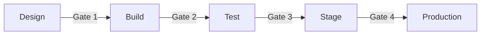

# Agent Blueprint Promotion Gates

**Last Updated:** January 2026
**Version:** v1.2.6

---

## Overview

This playbook provides a comprehensive gate model for governing agent promotions through the Agent 365 Blueprint lifecycle. Gates are approval checkpoints that validate agents meet governance, security, and compliance requirements before advancing to the next phase.

!!! note "Preview Features"
    Agent 365 Blueprints are in preview. Gate configurations should be tested thoroughly before production use.

---

## Why Gates Matter for FSI

| Regulatory Driver | Gate Requirement |
|-------------------|------------------|
| **FINRA 4511** | Documented approval chain for agent changes |
| **SOX 404** | Segregation of duties in promotion approvals |
| **SEC 17a-4** | Audit trail of promotion decisions |
| **GLBA 501(b)** | Security review before customer data access |
| **OCC 2011-12** | Model risk validation before deployment |

---

## Blueprint Lifecycle Phases



| Phase | Purpose | Governance Focus |
|-------|---------|------------------|
| **Design** | Requirements and architecture | Business justification, data sources |
| **Build** | Development and configuration | Technical implementation, connector setup |
| **Test** | Validation and quality assurance | Functional testing, security scanning |
| **Stage** | Pre-production verification | UAT, compliance review, rollback testing |
| **Production** | Live deployment | Final approval, monitoring activation |

---

## Gate Model Summary

| Gate | Transition | Zone 2 Requirements | Zone 3 Requirements |
|------|------------|---------------------|---------------------|
| **Gate 1** | Design → Build | Technical review | Architecture review + Data classification |
| **Gate 2** | Build → Test | QA sign-off | QA + Security scan |
| **Gate 3** | Test → Stage | Manager approval | Manager + Compliance review |
| **Gate 4** | Stage → Production | Business owner | CAB + Compliance + Legal (if customer-facing) |

---

## Gate Types

### Approval Gates

Human-in-the-loop approval required before promotion.

| Approver Role | Gate 1 | Gate 2 | Gate 3 | Gate 4 |
|---------------|--------|--------|--------|--------|
| Technical Lead | Zone 2+ | - | - | - |
| QA Lead | - | Zone 2+ | - | - |
| Manager | - | - | Zone 2+ | Zone 2 |
| Compliance Officer | Zone 3 | - | Zone 3 | Zone 3 |
| CAB | - | - | - | Zone 3 |
| Legal | - | - | - | Customer-facing |

### Automated Gates

System-enforced validation before promotion.

| Check Type | Description | Required For |
|------------|-------------|--------------|
| **Security Scan** | Credential exposure, injection vulnerabilities | Gate 2 (Zone 3) |
| **DLP Validation** | Connector DLP policy compliance | Gate 2 (All) |
| **Test Coverage** | Minimum test case execution | Gate 3 (All) |
| **Performance Baseline** | Response time thresholds | Gate 3 (Zone 3) |
| **Rollback Verification** | Previous version restoration test | Gate 4 (Zone 3) |

### Documentation Gates

Required artifacts before promotion.

| Artifact | Gate 1 | Gate 2 | Gate 3 | Gate 4 |
|----------|--------|--------|--------|--------|
| Requirements document | ✓ | - | - | - |
| Data source declaration | ✓ | - | - | - |
| Technical design | - | ✓ | - | - |
| Test plan | - | ✓ | - | - |
| Test results | - | - | ✓ | - |
| Security scan report | - | - | ✓ | - |
| UAT sign-off | - | - | - | ✓ |
| Rollback plan | - | - | - | ✓ |
| Compliance attestation | - | - | - | ✓ (Zone 3) |

---

## Quick Start

### 1. Assess Current State

Evaluate existing agents against gate requirements:

```powershell
# Export agents lacking gate documentation
Get-AdminPowerAppAgent | ForEach-Object {
    $agent = $_
    $metadata = Get-AdminPowerAppAgentMetadata -AgentId $agent.Id

    [PSCustomObject]@{
        AgentName = $agent.DisplayName
        Zone = $metadata.GovernanceZone
        HasRequirements = $null -ne $metadata.RequirementsDocUrl
        HasTestPlan = $null -ne $metadata.TestPlanUrl
        HasSecurityScan = $null -ne $metadata.SecurityScanDate
        CurrentPhase = $metadata.BlueprintPhase
    }
} | Where-Object { -not $_.HasRequirements -or -not $_.HasTestPlan }
```

### 2. Define Gate Criteria

Establish criteria for each gate by zone (see [Gate Definitions](gate-definitions.md)).

### 3. Implement Gate Workflows

Configure approval workflows in Power Automate or Azure DevOps (see [Implementation Guide](implementation-guide.md)).

### 4. Monitor Gate Compliance

Track gate passage rates and identify bottlenecks:

```kql
// Gate passage monitoring
OfficeActivity
| where TimeGenerated > ago(30d)
| where Operation in ("BlueprintPromotion", "BlueprintDemotion")
| extend
    gate = tostring(parse_json(AuditData).Gate),
    result = tostring(parse_json(AuditData).Result),
    zone = tostring(parse_json(AuditData).Zone)
| summarize
    Passed = countif(result == "Approved"),
    Rejected = countif(result == "Rejected"),
    PassRate = round(100.0 * countif(result == "Approved") / count(), 1)
    by gate, zone
| order by gate asc
```

---

## RACI for Gate Approvals

| Activity | Developer | Tech Lead | QA Lead | Manager | Compliance | CAB |
|----------|-----------|-----------|---------|---------|------------|-----|
| **Gate 1: Design Review** | A | R | C | I | C (Z3) | - |
| **Gate 2: Build Complete** | A | C | R | I | - | - |
| **Gate 3: Test Complete** | I | C | A | R | R (Z3) | - |
| **Gate 4: Production Deploy** | I | C | C | A (Z2) | R (Z3) | A (Z3) |

**Legend:** R = Responsible, A = Accountable, C = Consulted, I = Informed

---

## Playbook Contents

| Document | Description |
|----------|-------------|
| [Gate Definitions](gate-definitions.md) | Detailed criteria, evidence artifacts, and zone requirements for each gate |
| [Implementation Guide](implementation-guide.md) | Portal and PowerShell setup for gate workflows |

---

## Integration Points

| System | Integration Purpose |
|--------|---------------------|
| **Power Platform ALM** | Solution export/import with gate checkpoints |
| **Azure DevOps** | Pipeline gates for automated validation |
| **ServiceNow** | Change management ticket linkage |
| **SharePoint** | Document storage for gate artifacts |
| **Microsoft Teams** | Approval notifications and escalations |

---

## Related Resources

- [Control 2.3 - Change Management](../../../controls/pillar-2-management/2.3-change-management-and-release-planning.md)
- [Control 2.5 - Testing and Validation](../../../controls/pillar-2-management/2.5-testing-validation-and-quality-assurance.md)
- [Control 2.13 - Documentation](../../../controls/pillar-2-management/2.13-documentation-and-record-keeping.md)
- [Agent Promotion Checklist](../../agent-lifecycle/agent-promotion-checklist.md)
- [Platform Change Governance](../platform-change-governance/index.md)

---

*FSI Agent Governance Framework v1.2.6 - January 2026*
