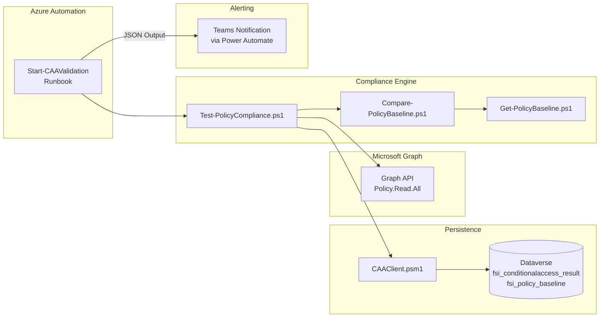

# Conditional Access Automation

**Status:** May 2026 - FSI-AgentGov v1.6.2
**Related Controls:** 1.11 (Conditional Access & MFA), 1.23 (Step-Up Authentication), 1.18 (Application-Level RBAC)

---

## Purpose

This playbook provides a reference architecture for automated Conditional Access (CA) policy compliance validation in regulated financial services organizations. The solution supports continuous monitoring of CA policy state, drift detection against approved baselines, and structured compliance reporting with Dataverse persistence for audit trail purposes.

---

## Problem Statement

Financial services organizations face a compliance gap between CA policy design and operational reality:

1. **Manual Review Doesn't Scale:** Reviewing CA policies manually across zones is error-prone and time-intensive
2. **Policy Drift Goes Undetected:** Changes to CA policies (by administrators or through tenant defaults) may not be identified until the next scheduled review
3. **Audit Evidence Gaps:** Point-in-time screenshots do not provide continuous compliance evidence for regulatory examination
4. **Zone Coverage Inconsistency:** Zone-specific CA requirements (MFA strength, session controls, break-glass exclusions) vary and are difficult to validate manually

**Result:** Compliance gaps between documented CA policy requirements and actual tenant configuration, with insufficient continuous evidence for FINRA 3110, SEC 17a-3/4, and SOX 404 examinations.

---

## Solution Overview

An Azure Automation runbook executes daily CA policy compliance validation using `Test-PolicyCompliance.ps1`. The runbook evaluates deployed CA policies against zone-specific baselines, detects configuration drift across five dimensions, persists results to Dataverse for audit trail, and generates structured JSON output for downstream alerting.

> :inbox_tray: **Download diagram:** [PNG](../../../images/diagrams/index-solution-overview-3.png) | [SVG](../../../images/diagrams/index-solution-overview-3.svg)

---

## Components

| Component | Purpose | Location |
|-----------|---------|----------|
| `Start-CAAValidationRunbook.ps1` | Azure Automation entry point — certificate-based auth, structured JSON output | `scripts/` |
| `Test-PolicyCompliance.ps1` | Core compliance validation — 6 checks across CA policies | `scripts/` |
| `CAAClient.psm1` | Dataverse persistence module — Web API client for results and baselines | `scripts/private/` |
| `Compare-PolicyBaseline.ps1` | Baseline drift comparison — 5-dimension drift analysis | `scripts/private/` |
| `Get-PolicyBaseline.ps1` | Baseline snapshot capture — exports current CA state | `scripts/private/` |
| `Connect-GraphSession.ps1` | Graph authentication helper — certificate and interactive flows | `scripts/private/` |
| `Get-ZoneClassification.ps1` | Zone classification — determines zone from policy naming convention | `scripts/private/` |
| `caa_client.py` | Dataverse schema deployment — creates tables and columns via Web API | `scripts/` |
| `conditional-access-automation.psd1` | PowerShell module manifest — dependency and metadata declarations | `scripts/` |

---

## Compliance Checks Performed

The validation engine performs six categories of compliance checks:

| Check | Description | Severity |
|-------|-------------|----------|
| **1. Policy Existence** | Validates expected CA policy templates exist per zone | Critical |
| **2. Policy State** | Verifies policies are enabled (not report-only or disabled) | Critical |
| **3. Break-Glass Exclusion** | Confirms break-glass accounts are excluded from all CA policies | Error |
| **4. MFA/Grant Controls** | Validates MFA strength requirements per zone (phishing-resistant for Zone 3) | Error |
| **5. Zone Coverage** | Checks session control completeness across zones | Warning |
| **6. Baseline Drift** | 5-dimension drift analysis against saved baselines | Warning |

Zone 3 findings are automatically escalated by one severity level to reflect the higher risk profile of enterprise-managed environments.

---

## Regulatory Alignment

| Regulation | Requirement | How This Solution Helps |
|------------|-------------|------------------------|
| **FINRA 3110** | Supervisory system for compliance procedures | Daily automated validation provides continuous supervisory evidence |
| **SEC 17a-3/4** | Records preservation with audit trail | Dataverse persistence supports compliance history with access controls |
| **SOX 302/404** | Internal control testing and certification | Automated validation supports control testing evidence |
| **GLBA 501(b)** | Administrative safeguards | CA policy validation helps verify access control safeguards |
| **OCC Bulletin 2026-13 (formerly OCC 2011-12)** | Model risk documentation | Zone-specific validation documents risk-tiered security controls |

---

## Framework Integration

| Control | How CAA Supports |
|---------|-----------------|
| [1.11 - Conditional Access & MFA](../../../controls/pillar-1-security/1.11-conditional-access-and-phishing-resistant-mfa.md) | Validates CA policies match zone requirements |
| [1.23 - Step-Up Authentication](../../../controls/pillar-1-security/1.23-step-up-authentication-for-agent-operations.md) | Verifies step-up auth policies for sensitive operations |
| [1.18 - Application-Level RBAC](../../../controls/pillar-1-security/1.18-application-level-authorization-and-role-based-access-control-rbac.md) | Checks agent authentication policy coverage |

---

## Playbook Structure

| Document | Purpose |
|----------|---------|
| [Overview](index.md) | Solution architecture, components, and regulatory alignment (this page) |
| [Deployment Guide](deployment-guide.md) | End-to-end deployment instructions across 5 phases |

---

## Prerequisites

- **Microsoft 365 E5** (or E3 + Entra ID P2) for Conditional Access
- **Azure Automation account** with PowerShell 7.x runbook support
- **Power Platform environment** with Dataverse (for persistence)
- **Entra ID app registration** with `Policy.Read.All` and `Application.Read.All` Graph permissions
- **Certificate** for Azure Automation authentication (no client secrets for production)

---

## Getting Started

1. **Read [Deployment Guide](deployment-guide.md)** for end-to-end setup instructions
2. **Phase 1:** Create app registration and configure certificate authentication
3. **Phase 2:** Deploy Dataverse schema using `caa_client.py`
4. **Phase 3:** Install PowerShell modules in Azure Automation
5. **Phase 4:** Import and configure the runbook with daily schedule
6. **Phase 5:** Validate end-to-end execution and alerting

---

*Updated: May 2026 | Version: v1.6.2 | UI Verification Status: Current*
