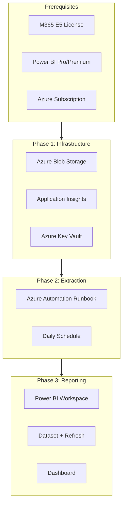

# Deployment Guide

**Parent:** [Deny Event Correlation Report](index.md)

---

## Overview

This guide provides end-to-end deployment instructions for the deny event correlation solution across your environment.

---

## Deployment Architecture



---

## Prerequisites Checklist

### Licensing

- [ ] Microsoft 365 E5 or E5 Compliance (for Audit Premium)
- [ ] Power BI Pro (per-user) or Power BI Premium (capacity)
- [ ] Azure subscription (for storage and automation)

### Permissions

| Task | Required Role |
|------|---------------|
| Search-UnifiedAuditLog | Purview Audit Reader or Compliance Administrator |
| Application Insights API | Reader role on App Insights resource |
| Azure Automation | Automation Contributor |
| Power BI publish | Workspace Contributor or Admin |

### Service Accounts

Create a dedicated service account for automated extraction:

1. Create user: `svc-deny-report@contoso.com`
2. Assign: Purview Audit Reader
3. Configure: Password never expires or use managed identity
4. Store credentials in Azure Key Vault

---

## Phase 1: Infrastructure Setup

### Step 1.1: Create Azure Storage Account

```powershell
# Create resource group
az group create --name rg-fsi-governance --location eastus

# Create storage account
az storage account create `
    --name stfsigovernance `
    --resource-group rg-fsi-governance `
    --location eastus `
    --sku Standard_LRS `
    --kind StorageV2

# Create container for deny events
az storage container create `
    --name deny-events `
    --account-name stfsigovernance

# Enable immutable storage (for SEC 17a-4)
az storage container immutability-policy create `
    --resource-group rg-fsi-governance `
    --account-name stfsigovernance `
    --container-name deny-events `
    --period 2555  # 7 years in days
```

### Step 1.2: Create Azure Key Vault

```powershell
# Create Key Vault
az keyvault create `
    --name kv-fsi-governance `
    --resource-group rg-fsi-governance `
    --location eastus

# Store Exchange Online credentials
az keyvault secret set `
    --vault-name kv-fsi-governance `
    --name "ExoServiceAccount" `
    --value "svc-deny-report@contoso.com"

az keyvault secret set `
    --vault-name kv-fsi-governance `
    --name "ExoServicePassword" `
    --value "YourSecurePassword"

# Store App Insights API key
az keyvault secret set `
    --vault-name kv-fsi-governance `
    --name "AppInsightsApiKey" `
    --value "YourApiKey"
```

### Step 1.3: Configure Application Insights

For each Zone 2/3 Copilot Studio agent:

1. Open Copilot Studio portal
2. Select agent > **Settings** > **Generative AI**
3. Enable **Advanced settings**
4. Enter Application Insights connection string
5. Save and Publish

---

## Phase 2: Automation Setup

### Step 2.1: Create Azure Automation Account

```powershell
# Create Automation Account
az automation account create `
    --name aa-fsi-governance `
    --resource-group rg-fsi-governance `
    --location eastus

# Import required modules
$modules = @(
    "ExchangeOnlineManagement",
    "Az.Storage",
    "Az.KeyVault"
)

foreach ($module in $modules) {
    az automation module create `
        --automation-account-name aa-fsi-governance `
        --resource-group rg-fsi-governance `
        --name $module `
        --content-link "https://www.powershellgallery.com/api/v2/package/$module"
}
```

### Step 2.2: Create Orchestration Runbook

Create runbook `Invoke-DailyDenyReport`:

```powershell
<#
.SYNOPSIS
    Daily orchestration for deny event extraction
.DESCRIPTION
    Runs all three extraction scripts and uploads to blob storage
#>

param(
    [string]$KeyVaultName = "kv-fsi-governance",
    [string]$StorageAccountName = "stfsigovernance",
    [string]$ContainerName = "deny-events"
)

# Get credentials from Key Vault
$exoUser = Get-AzKeyVaultSecret -VaultName $KeyVaultName -Name "ExoServiceAccount" -AsPlainText
$exoPass = Get-AzKeyVaultSecret -VaultName $KeyVaultName -Name "ExoServicePassword" -AsPlainText
$appInsightsKey = Get-AzKeyVaultSecret -VaultName $KeyVaultName -Name "AppInsightsApiKey" -AsPlainText

# Connect to Exchange Online
$securePass = ConvertTo-SecureString $exoPass -AsPlainText -Force
$credential = New-Object PSCredential($exoUser, $securePass)
Connect-ExchangeOnline -Credential $credential -ShowBanner:$false

# Date range
$startDate = (Get-Date).AddDays(-1).Date
$endDate = (Get-Date).Date
$dateStamp = $startDate.ToString("yyyy-MM-dd")

# Create temp directory
$tempDir = Join-Path $env:TEMP "DenyReport-$dateStamp"
New-Item -ItemType Directory -Path $tempDir -Force | Out-Null

# Run extraction scripts
Write-Output "Extracting CopilotInteraction deny events..."
& .\Export-CopilotDenyEvents.ps1 -StartDate $startDate -EndDate $endDate `
    -OutputPath "$tempDir\CopilotDenyEvents-$dateStamp.csv"

Write-Output "Extracting DLP events..."
& .\Export-DlpCopilotEvents.ps1 -StartDate $startDate -EndDate $endDate `
    -OutputPath "$tempDir\DlpCopilotEvents-$dateStamp.csv"

Write-Output "Extracting RAI telemetry..."
& .\Export-RaiTelemetry.ps1 -ApiKey $appInsightsKey `
    -AppInsightsAppId $env:AppInsightsAppId `
    -StartDate $startDate -EndDate $endDate `
    -OutputPath "$tempDir\RaiTelemetry-$dateStamp.csv"

# Upload to blob storage
$storageContext = New-AzStorageContext -StorageAccountName $StorageAccountName -UseConnectedAccount

Get-ChildItem $tempDir -Filter "*.csv" | ForEach-Object {
    Set-AzStorageBlobContent `
        -File $_.FullName `
        -Container $ContainerName `
        -Blob "$dateStamp/$($_.Name)" `
        -Context $storageContext `
        -Force
    Write-Output "Uploaded: $($_.Name)"
}

# Cleanup
Disconnect-ExchangeOnline -Confirm:$false
Remove-Item $tempDir -Recurse -Force

Write-Output "Daily deny report complete for $dateStamp"
```

### Step 2.3: Schedule Runbook

```powershell
# Create daily schedule
az automation schedule create `
    --automation-account-name aa-fsi-governance `
    --resource-group rg-fsi-governance `
    --name "DailyDenyReport" `
    --frequency Day `
    --interval 1 `
    --start-time "2026-01-27T06:00:00Z"

# Link schedule to runbook
az automation job schedule create `
    --automation-account-name aa-fsi-governance `
    --resource-group rg-fsi-governance `
    --runbook-name "Invoke-DailyDenyReport" `
    --schedule-name "DailyDenyReport"
```

---

## Phase 3: Power BI Deployment

### Step 3.1: Import Template

1. Download `DenyEventCorrelation.pbit` from FSI-AgentGov-Solutions
2. Open in Power BI Desktop
3. When prompted, enter parameters:
   - Storage Account URL: `https://stfsigovernance.blob.core.windows.net/deny-events/`
   - Latest Date: `2026-01-26` (or current date)

### Step 3.2: Configure Data Source Credentials

1. In Power BI Desktop: **Transform Data** > **Data source settings**
2. Select Azure Blob Storage source
3. Configure authentication:
   - Account key, or
   - Azure AD (if configured)

### Step 3.3: Publish to Service

1. **Home** > **Publish**
2. Select workspace: "FSI Governance Reports"
3. After publish, open Power BI Service

### Step 3.4: Configure Scheduled Refresh

1. In Power BI Service, go to dataset settings
2. **Scheduled refresh** > Enable
3. Configure:
   - Frequency: Daily
   - Time: 7:00 AM (after extraction completes at 6 AM)
4. **Data source credentials** > Edit credentials

---

## Verification Checklist

### Phase 1 Verification

- [ ] Storage account created with immutable policy
- [ ] Key Vault contains all required secrets
- [ ] Application Insights receiving Copilot Studio telemetry

### Phase 2 Verification

- [ ] Automation account created with required modules
- [ ] Runbook executes without errors (test run)
- [ ] CSV files appear in blob storage after test run
- [ ] Schedule created and linked to runbook

### Phase 3 Verification

- [ ] Power BI template imported successfully
- [ ] Data refreshes without credential errors
- [ ] Dashboard displays data from all three sources
- [ ] Scheduled refresh configured and working

---

## Troubleshooting

### Common Issues

| Issue | Cause | Resolution |
|-------|-------|------------|
| "No audit data returned" | Permission or date range | Verify Audit Reader role; check date range |
| "App Insights query failed" | Invalid API key | Regenerate API key in Azure portal |
| "Blob upload failed" | Storage permissions | Grant Storage Blob Data Contributor role |
| "Power BI refresh failed" | Credential expiry | Update credentials in dataset settings |

### Log Locations

| Component | Log Location |
|-----------|--------------|
| Azure Automation | Automation Account > Jobs > Output |
| Power BI refresh | Dataset > Refresh history |
| Application Insights | App Insights > Logs (KQL) |

---

## Maintenance

### Weekly Tasks

- [ ] Review runbook job history for failures
- [ ] Check Power BI refresh history
- [ ] Verify data completeness (compare event counts)

### Monthly Tasks

- [ ] Rotate API keys if required by policy
- [ ] Review storage costs
- [ ] Archive old data beyond retention period

### Quarterly Tasks

- [ ] Review and update extraction scripts for schema changes
- [ ] Test disaster recovery (restore from backup)
- [ ] Update documentation for any changes

---

## Support

For issues with this solution:

1. Check [Troubleshooting](../../../playbooks/control-implementations/1.7/troubleshooting.md) for audit log issues
2. Review [Microsoft Learn: Copilot Audit](https://learn.microsoft.com/en-us/purview/audit-copilot)
3. Open issue in [FSI-AgentGov-Solutions](https://github.com/judeper/FSI-AgentGov-Solutions/issues)

---

*FSI Agent Governance Framework v1.2 - January 2026*
