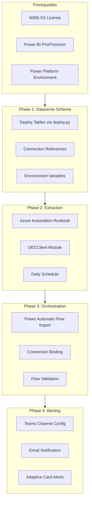

# Deployment Guide

**Parent:** [Deny Event Correlation Report](index.md)

---

## Overview

This guide provides end-to-end deployment instructions for the Deny Event Correlation (DEC) solution v2.0. The v2.0 architecture uses Microsoft Dataverse as the central data store, replacing the v1.x Azure Blob Storage approach with a unified Power Platform data layer.

---

## Deployment Architecture


```mermaid
flowchart TB
    subgraph Prerequisites
        M365[M365 E5 License]
        PBI[Power BI Pro/Premium]
        PP[Power Platform Environment]
    end

    subgraph Phase1[Phase 1: Dataverse Schema]
        SCHEMA[Deploy Tables via deploy.py]
        CONNREF[Connection References]
        ENVVAR[Environment Variables]
    end

    subgraph Phase2[Phase 2: Extraction]
        RUNBOOK[Azure Automation Runbook]
        DECCLIENT[DECClient Module]
        SCHEDULE[Daily Schedule]
    end

    subgraph Phase3[Phase 3: Orchestration]
        FLOW[Power Automate Flow Import]
        FLOWCFG[Connection Binding]
        FLOWTEST[Flow Validation]
    end

    subgraph Phase4[Phase 4: Alerting]
        TEAMS[Teams Channel Config]
        EMAIL[Email Notification]
        ADAPTIVE[Adaptive Card Alerts]
    end

    Prerequisites --> Phase1
    Phase1 --> Phase2
    Phase2 --> Phase3
    Phase3 --> Phase4
```

---

## Prerequisites Checklist

### Licensing

- [ ] Microsoft 365 E5 or E5 Compliance (for Audit Premium)
- [ ] Power BI Pro (per-user) or Power BI Premium (capacity)
- [ ] Power Platform environment with Dataverse database provisioned

### Permissions

| Task | Required Role |
|------|---------------|
| Search-UnifiedAuditLog | Purview Audit Reader or Purview Compliance Admin |
| Application Insights API | Monitoring Reader on App Insights resource |
| Dataverse table deployment | System Administrator or System Customizer on the target environment |
| Azure Automation | Automation Contributor |
| Power BI publish | Workspace Contributor or Admin |

### Service Accounts

Create a dedicated Entra ID App Registration for automated extraction:

1. Create App Registration in **Entra ID** > **App registrations**
2. Add API permission: **Office 365 Exchange Online** > **Application** > `Exchange.ManageAsApp`
3. Add API permission: **Dataverse** > **Application** > `user_impersonation`
4. Grant admin consent (tenant admin)
5. Assign Entra role: **Purview Audit Reader**
6. Create a client secret or upload a certificate
7. Store credentials in Azure Key Vault

---

## Phase 1: Dataverse Schema Deployment

### Step 1.1: Run the Schema Deployment Script

The `deploy.py` script creates four Dataverse tables, shared option sets, connection references, and environment variables.

```bash
# From the repository root
cd maintainers-local/solutions-staging/deny-event-correlation-report

# Install Python dependencies
pip install -r requirements.txt

# Deploy schema to target environment
python deploy.py \
    --environment-url https://your-org.crm.dynamics.com \
    --tenant-id <tenant-guid> \
    --client-id <app-registration-client-id>
```

The script creates:

| Table | Description |
|-------|-------------|
| `fsi_DenyEvent` | Raw deny events from all three sources |
| `fsi_DenyCorrelation` | Correlated event groups |
| `fsi_DenyAlert` | Generated alerts from correlation patterns |
| `fsi_DenyValidationHistory` | Validation and extraction audit trail |

### Step 1.2: Verify Deployed Schema

1. Navigate to **Power Apps** > **Tables** in your target environment
2. Confirm all four tables are present with `fsi_` prefix
3. Check that option sets `fsi_acv_zone` (0-3) and `fsi_acv_severity` (1-5) exist

### Step 1.3: Configure Environment Variables

Set these environment variables in the Power Platform environment:

| Variable | Example Value | Purpose |
|----------|---------------|---------|
| `DEC_DataverseUrl` | `https://your-org.crm.dynamics.com` | Dataverse endpoint |
| `DEC_TenantId` | `<tenant-guid>` | Entra ID tenant |
| `DEC_KeyVaultName` | `kv-fsi-governance` | Azure Key Vault for credentials |

### Step 1.4: Create Azure Key Vault

```powershell
# Create Key Vault (if not already provisioned)
az keyvault create `
    --name kv-fsi-governance `
    --resource-group rg-fsi-governance `
    --location eastus

# Store Exchange Online App Registration client secret
az keyvault secret set `
    --vault-name kv-fsi-governance `
    --name "sp-exchangeonline" `
    --value "<app-registration-client-secret>"

# Store App Insights service principal client secret
az keyvault secret set `
    --vault-name kv-fsi-governance `
    --name "sp-appinsights" `
    --value "<appinsights-sp-client-secret>"
```

!!! warning "No Hardcoded Credentials"
    Never store user passwords or API keys directly in scripts. All credentials must be retrieved from Azure Key Vault at runtime using `Get-AzKeyVaultSecret`.

### Step 1.5: Configure Application Insights

For each Zone 2/3 Copilot Studio agent:

1. Open Copilot Studio portal
2. Select agent > **Settings** > **Generative AI**
3. Enable **Advanced settings**
4. Enter Application Insights connection string
5. Save and Publish

---

## Phase 2: Automation Setup

### Step 2.1: Create Azure Automation Account

```powershell
# Create Automation Account
az automation account create `
    --name aa-fsi-governance `
    --resource-group rg-fsi-governance `
    --location eastus

# Import required modules
$modules = @(
    "ExchangeOnlineManagement",
    "Az.KeyVault",
    "Az.Accounts"
)

foreach ($module in $modules) {
    az automation module create `
        --automation-account-name aa-fsi-governance `
        --resource-group rg-fsi-governance `
        --name $module `
        --content-link "https://www.powershellgallery.com/api/v2/package/$module"
}
```

### Step 2.2: Deploy DECClient Module

Upload the `DECClient.psm1` shared module to the Automation Account:

1. In Azure portal, navigate to **Automation Account** > **Modules**
2. Select **Add a module** > **Browse from gallery** or upload custom
3. Upload `DECClient.psm1` from the solution's `scripts/private/` directory
4. Verify module is imported successfully

### Step 2.3: Create Orchestration Runbook

The orchestration runbook runs all three extraction scripts and writes results to Dataverse via the DECClient module:

```powershell
#Requires -Version 7.0
#Requires -Modules @{ ModuleName="Az.Accounts"; ModuleVersion="3.0.0" }, @{ ModuleName="Az.KeyVault"; ModuleVersion="5.0.0" }, @{ ModuleName="ExchangeOnlineManagement"; ModuleVersion="3.0.0" }

<#
.SYNOPSIS
    Daily orchestration for deny event extraction and Dataverse ingestion.
.DESCRIPTION
    Runs all three extraction scripts (CopilotInteraction, DLP, RAI) using
    Entra ID service principal authentication via DECClient module. Events
    are written directly to Dataverse tables.
#>
[CmdletBinding()]
param(
    [Parameter(Mandatory)][string]$TenantId,
    [Parameter(Mandatory)][string]$ClientId,
    [Parameter(Mandatory)][string]$KeyVaultName,
    [Parameter(Mandatory)][string]$DataverseEnvironmentUrl,
    [Parameter(Mandatory)][string]$AppInsightsAppId,
    [string]$AppInsightsSecretName = 'sp-appinsights',
    [string]$CertificateThumbprint,
    [ValidateSet('1','2','3')][string]$Zone,
    [int]$DaysBack = 1,
    [switch]$DryRun
)

$ErrorActionPreference = 'Stop'
Import-Module "$PSScriptRoot/private/DECClient.psm1" -Force

# Common parameters for all extraction scripts
$commonParams = @{
    TenantId     = $TenantId
    ClientId     = $ClientId
    KeyVaultName = $KeyVaultName
    DaysBack     = $DaysBack
    WriteToDataverse       = $true
    DataverseEnvironmentUrl = $DataverseEnvironmentUrl
}
if ($Zone) { $commonParams['Zone'] = $Zone }
if ($CertificateThumbprint) { $commonParams['CertificateThumbprint'] = $CertificateThumbprint }

# Run extraction scripts — events written directly to Dataverse
Write-Output "Extracting CopilotInteraction deny events..."
& .\Export-CopilotDenyEvents.ps1 @commonParams

Write-Output "Extracting DLP events..."
& .\Export-DlpCopilotEvents.ps1 @commonParams

Write-Output "Extracting RAI telemetry..."
$raiParams = $commonParams.Clone()
$raiParams.Remove('TenantId') # RAI uses AppInsightsAppId instead
& .\Export-RaiTelemetry.ps1 -AppInsightsAppId $AppInsightsAppId `
    -SecretName $AppInsightsSecretName @raiParams

# Run correlation engine
Write-Output "Running deny event correlation..."
& .\Invoke-DenyEventCorrelation.ps1 -DataverseEnvironmentUrl $DataverseEnvironmentUrl `
    -TenantId $TenantId -ClientId $ClientId -KeyVaultName $KeyVaultName

Disconnect-ExchangeOnline -Confirm:$false -ErrorAction SilentlyContinue
Write-Output "Daily deny report complete."
```

### Step 2.4: Schedule Runbook

```powershell
# Create daily schedule
az automation schedule create `
    --automation-account-name aa-fsi-governance `
    --resource-group rg-fsi-governance `
    --name "DailyDenyReport" `
    --frequency Day `
    --interval 1 `
    --start-time "2026-02-15T06:00:00Z"

# Link schedule to runbook
az automation job schedule create `
    --automation-account-name aa-fsi-governance `
    --resource-group rg-fsi-governance `
    --runbook-name "Invoke-DailyDenyReport" `
    --schedule-name "DailyDenyReport"
```

---

## Phase 3: Power Automate Flow Import

The DEC-DailyOrchestrator Power Automate flow automates daily extraction, correlation, alert evaluation, and notification routing. Full setup details are in the solutions-staging `FLOW_SETUP.md` guide.

### Step 3.1: Import the Flow

1. Locate the flow definition: `deny-event-correlation-report/templates/dec-daily-orchestrator-flow.json`
2. Navigate to [Power Automate](https://make.powerautomate.com) and select the target environment
3. Go to **My flows** → **Import** → **Import Package (Legacy)**
4. Upload `dec-daily-orchestrator-flow.json`
5. Map each connection reference:

| Connection Reference | Connector |
|---------------------|-----------|
| `fsi_cr_dataverse_denyeventcorrelation` | Dataverse |
| `fsi_cr_office365_denyeventcorrelation` | Office 365 Outlook |
| `fsi_cr_teams_denyeventcorrelation` | Microsoft Teams |

### Step 3.2: Configure Flow Parameters

After import, edit the flow and verify these parameters match your environment:

| Parameter | Value |
|-----------|-------|
| Automation Account Name | `aa-fsi-governance` |
| Resource Group | `rg-fsi-governance` |
| Runbook Name | `Invoke-DailyDenyReport` |
| Subscription ID | Your Azure subscription ID |

### Step 3.3: Bind Connection References

1. Navigate to **Power Platform admin center** → **Environments** → select your environment
2. Go to **Solutions** → locate the DEC solution
3. Open each connection reference and bind to an active connection
4. Verify connections show **Connected** status

### Step 3.4: Enable and Test the Flow

1. Turn on the flow
2. Run a manual test: select **Test** → **Manually** → **Run flow**
3. Verify the run history shows success for all actions
4. Check that deny events and correlation records appear in Dataverse tables

---

## Phase 4: Teams and Email Alerting

### Step 4.1: Configure Teams Channel

1. Create or identify a Teams channel for DEC alert delivery (e.g., "FSI Governance Alerts")
2. Record the **Group ID** (Team ID) and **Channel ID**
3. Verify the Teams connection account has permission to post to the channel

### Step 4.2: Set Alert Environment Variables

Update the Dataverse environment variables for alert routing:

| Variable | Value |
|----------|-------|
| `fsi_DEC_TeamsGroupId` | Teams group (team) GUID |
| `fsi_DEC_TeamsChannelId` | Teams channel GUID |

### Step 4.3: Configure Alert Thresholds

The alert evaluation engine uses these settings:

| Setting | Default | Description |
|---------|---------|-------------|
| `fsi_DEC_AnomalyThresholdSigma` | 2.0 | Standard deviations for volume anomaly alerts |

Adjust the threshold based on your organization's baseline deny event volume. A lower value generates more alerts; a higher value reduces noise.

### Step 4.4: Verify Alert Delivery

1. Trigger a test alert by temporarily lowering the anomaly threshold
2. Confirm the adaptive card appears in the configured Teams channel
3. Confirm email notification arrives for the configured recipients
4. Restore the anomaly threshold to the production value

---

## Phase 5: Power BI Deployment

For detailed Power BI setup, data model, DAX measures, and dashboard configuration, see the dedicated [Power BI Correlation Dashboard](power-bi-correlation.md) playbook.

### Quick Start

1. Download `DenyEventCorrelation.pbit` from FSI-AgentGov-Solutions
2. Open in Power BI Desktop and enter the Dataverse environment URL when prompted
3. Authenticate with organizational account (Entra ID)
4. Publish to Power BI Service workspace: "FSI Governance Reports"
5. Configure scheduled refresh (daily, after extraction completes)

---

## Verification Checklist

### Phase 1 Verification

- [ ] Dataverse tables created (4 tables with `fsi_` prefix)
- [ ] Option sets `fsi_acv_zone` and `fsi_acv_severity` exist
- [ ] Environment variables configured in Power Platform
- [ ] Key Vault contains all required secrets
- [ ] Application Insights receiving Copilot Studio telemetry (Zone 2/3 agents)

### Phase 2 Verification

- [ ] Automation account created with required modules
- [ ] DECClient module imported into Automation Account
- [ ] Runbook executes without errors (test run)
- [ ] Deny event records appear in Dataverse `fsi_DenyEvent` table after test run
- [ ] Correlation records appear in `fsi_DenyCorrelation` table
- [ ] Schedule created and linked to runbook

### Phase 3 Verification

- [ ] Power Automate flow imported and visible in the target environment
- [ ] All three connection references bound to active connections
- [ ] Flow parameters match Azure Automation configuration
- [ ] Manual test run completes without errors
- [ ] Flow run history shows all actions succeeded

### Phase 4 Verification

- [ ] Teams Group ID and Channel ID environment variables set
- [ ] Anomaly threshold configured appropriately for environment
- [ ] Test alert delivered to Teams channel as adaptive card
- [ ] Test email notification received by configured recipients

### Phase 5 Verification

- [ ] Power BI template imported with Dataverse connector
- [ ] Data refreshes without credential errors
- [ ] Dashboard displays data from all three sources
- [ ] Scheduled refresh configured and working

---

## Migration from v1.x (Azure Blob)

If you are upgrading from the v1.x Azure Blob architecture:

1. Deploy the Dataverse schema (Phase 1 above)
2. Run a one-time backfill of historical data from Blob to Dataverse
3. Update automation runbooks to use `--WriteToDataverse` flag
4. Reconfigure Power BI to use Dataverse connector instead of Blob/CSV sources
5. After validation, decommission Azure Blob storage containers

---

## Troubleshooting

### Common Issues

| Issue | Cause | Resolution |
|-------|-------|------------|
| "No audit data returned" | Permission or date range | Verify Purview Audit Reader role; check date range |
| "App Insights query failed" | Token or permission issue | Verify Monitoring Reader role on App Insights; check Key Vault secret |
| "Key Vault access denied" | Missing RBAC | Grant Key Vault Secrets User role to the service principal |
| "Dataverse write failed" | Missing permission or schema | Verify System User role in Dataverse; confirm tables deployed |
| "Power BI refresh failed" | Credential expiry | Update organizational account credentials in dataset settings |

### Log Locations

| Component | Log Location |
|-----------|--------------|
| Azure Automation | Automation Account > Jobs > Output |
| Dataverse writes | `fsi_DenyValidationHistory` table (validation audit trail) |
| Power BI refresh | Dataset > Refresh history |
| Application Insights | App Insights > Logs (KQL) |

---

## Maintenance

### Weekly Tasks

- [ ] Review runbook job history for failures
- [ ] Check Power BI refresh history
- [ ] Verify data completeness in Dataverse (compare event counts)

### Monthly Tasks

- [ ] Rotate Key Vault secrets if required by policy
- [ ] Review certificate expiry for certificate-based authentication
- [ ] Review Dataverse storage usage
- [ ] Archive data beyond retention period (per Zone 3 retention policy)

### Quarterly Tasks

- [ ] Review and update extraction scripts for schema changes
- [ ] Test disaster recovery (restore from backup)
- [ ] Update documentation for any changes

---

## Support

For issues with this solution:

1. Check [Troubleshooting](../../../playbooks/control-implementations/1.7/troubleshooting.md) for audit log issues
2. Review [Microsoft Learn: Copilot Audit](https://learn.microsoft.com/en-us/purview/audit-copilot)
3. Open issue in [FSI-AgentGov-Solutions](https://github.com/judeper/FSI-AgentGov-Solutions/issues)

---

*FSI Agent Governance Framework v1.2.47 - February 2026*
