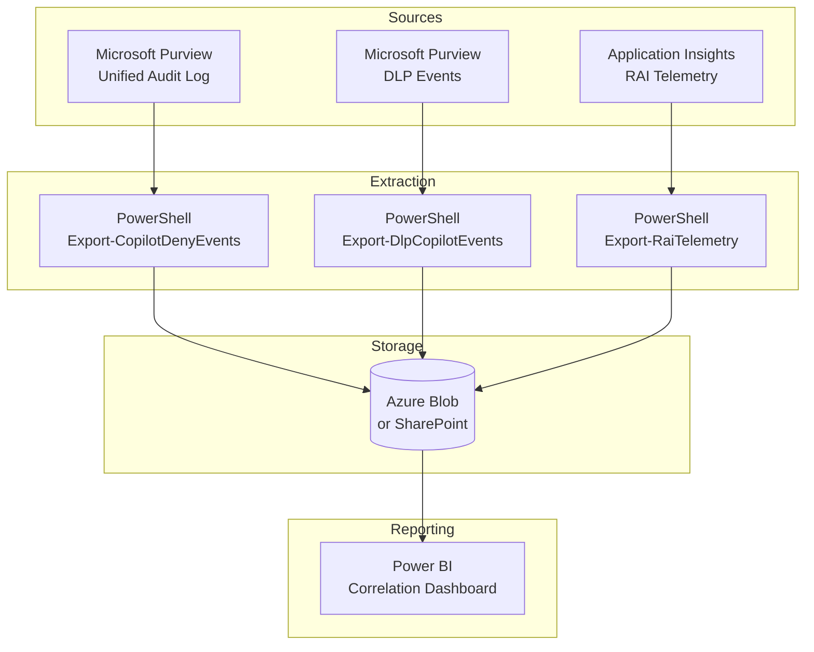

# Deny Event Correlation Report

**Status:** January 2026 - FSI-AgentGov v1.2
**Related Controls:** 1.7 (Audit Logging), 1.8 (Runtime Protection), 3.2 (Usage Analytics), 3.3 (Compliance Reporting)

---

## Purpose

This playbook provides a deployable solution for producing daily operational reports that correlate "deny/no content returned" events across three Microsoft data sources for Copilot and Copilot Studio agents. The solution addresses FSI regulatory requirements for demonstrating AI governance control effectiveness.

**Applies to:** Zone 2/3 environments; recommended for any organization requiring daily evidence of AI agent deny events.

---

## Problem Statement

Financial services organizations need to demonstrate that their AI governance controls are **actively working** by showing:

1. **Policy blocks are occurring** when agents attempt to access restricted content
2. **RAI filters are active** and blocking inappropriate responses
3. **DLP policies are enforced** for the Microsoft 365 Copilot location

**Current gap:** These events are logged in three separate systems with no native correlation:

| Event Type | Data Source | Native Export |
|------------|-------------|---------------|
| CopilotInteraction deny | Microsoft Purview Audit | Search-UnifiedAuditLog |
| DLP rule matches | Microsoft Purview Audit | Search-UnifiedAuditLog |
| RAI content filtering | Application Insights | KQL / REST API |

---

## Solution Overview

A scheduled pipeline extracts deny events from all three sources and correlates them in Power BI for daily operational reporting.



---

## Data Sources

### Source 1: Microsoft Purview Audit (CopilotInteraction)

**Key Fields for Deny Detection:**

```json
{
  "AccessedResources": [{
    "Status": "failure",
    "PolicyDetails": {
      "PolicyId": "...",
      "PolicyName": "...",
      "Action": "deny"
    },
    "XPIADetected": true,
    "SensitivityLabelId": "..."
  }],
  "Messages": [{
    "JailbreakDetected": true
  }]
}
```

**Export method:** `Search-UnifiedAuditLog -RecordType CopilotInteraction`

### Source 2: Microsoft Purview DLP (Copilot Location)

DLP policies targeting "Microsoft 365 Copilot and Copilot Chat" generate events when:

- Sensitivity labels trigger blocking rules
- Sensitive Information Types (SITs) are detected in prompts
- Override actions are taken by users

**Export method:** `Search-UnifiedAuditLog -RecordType DlpRuleMatch`

### Source 3: Application Insights (RAI Telemetry)

Copilot Studio agents configured with Application Insights log `ContentFiltered` events when Azure AI Content Safety blocks a response.

**Export method:** KQL query via Application Insights REST API

---

## Regulatory Alignment

| Regulation | Requirement | How This Solution Helps |
|------------|-------------|------------------------|
| **FINRA 25-07** | AI governance evidence | Daily evidence of controls actively blocking inappropriate content |
| **FINRA 4511** | Records retention | Deny events exported to compliant storage |
| **SEC 17a-3/4** | Supervision evidence | Shows AI agent behavior is monitored and controlled |
| **GLBA 501(b)** | Safeguards evidence | DLP blocking demonstrates NPI protection |
| **OCC 2011-12** | Model risk controls | RAI telemetry shows model guardrails are functioning |

---

## Framework Integration

This playbook extends four framework controls:

| Control | How This Playbook Supports |
|---------|---------------------------|
| [1.7 - Audit Logging](../../../controls/pillar-1-security/1.7-comprehensive-audit-logging-and-compliance.md) | Extracts CopilotInteraction and DLP events |
| [1.8 - Runtime Protection](../../../controls/pillar-1-security/1.8-runtime-protection-and-external-threat-detection.md) | Captures RAI telemetry for content filtering |
| [3.2 - Usage Analytics](../../../controls/pillar-3-reporting/3.2-usage-analytics-and-activity-monitoring.md) | Provides daily operational monitoring |
| [3.3 - Compliance Reporting](../../../controls/pillar-3-reporting/3.3-compliance-and-regulatory-reporting.md) | Generates examination-ready evidence |

---

## Implementation Kit

The FSI-AgentGov-Solutions repository provides deployable components:

| Component | Description |
|-----------|-------------|
| **PowerShell Scripts** | Daily extraction from Purview and App Insights |
| **KQL Queries** | Pre-built queries for all three data sources |
| **Power BI Template** | Correlation dashboard with daily refresh |
| **Documentation** | Prerequisites, deployment, troubleshooting |

**Repository:** [FSI-AgentGov-Solutions](https://github.com/judeper/FSI-AgentGov-Solutions) → `deny-event-correlation-report/`

---

## Playbook Structure

| Document | Purpose |
|----------|---------|
| [Purview Audit Extraction](purview-audit-extraction.md) | CopilotInteraction deny event extraction |
| [DLP Event Extraction](dlp-event-extraction.md) | DLP signal correlation for Copilot location |
| [App Insights RAI Telemetry](app-insights-rai-telemetry.md) | Copilot Studio RAI setup and extraction |
| [Power BI Correlation](power-bi-correlation.md) | Dashboard correlation model |
| [Deployment Guide](deployment-guide.md) | End-to-end deployment instructions |

---

## Prerequisites

### Required

- Microsoft 365 E5 or E5 Compliance (Audit Premium for extended retention)
- Power BI Pro or Premium (for scheduled refresh)
- Azure subscription (if using Azure Blob storage)
- Permissions: Purview Audit Reader, Security Reader

### For RAI Telemetry (Optional but Recommended)

- Azure Application Insights resource
- Copilot Studio Premium license
- Each agent configured with App Insights connection string

---

## Quick Start

1. **Read [Purview Audit Extraction](purview-audit-extraction.md)** to understand CopilotInteraction deny events
2. **Configure [App Insights RAI Telemetry](app-insights-rai-telemetry.md)** for Copilot Studio agents
3. **Deploy scripts** from FSI-AgentGov-Solutions repository
4. **Import Power BI template** and configure data source connections
5. **Schedule daily refresh** and configure alerts for high-severity events

---

*FSI Agent Governance Framework v1.2 - January 2026*
