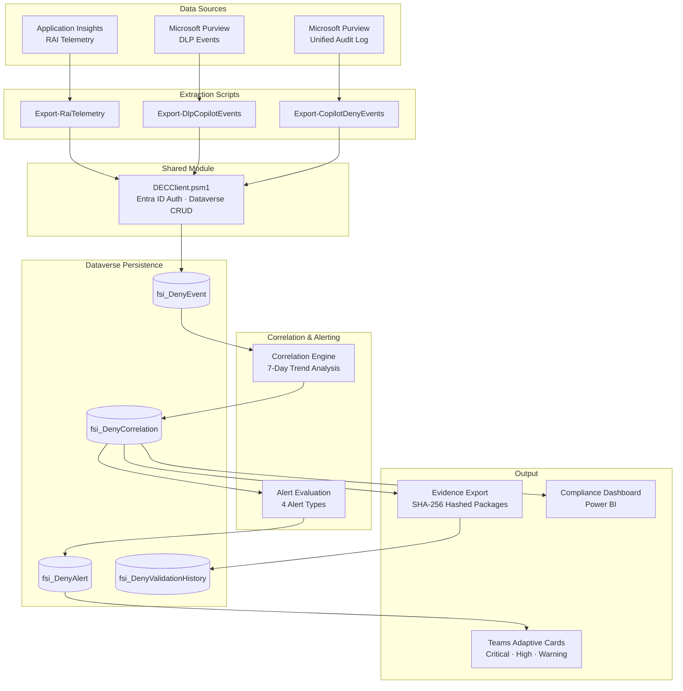
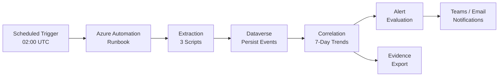

# Deny Event Correlation Report

**Version:** v2.0.0 | **Status:** Production Ready | **Updated:** February 2026
**Related Controls:** 1.5 (DLP & Sensitivity Labels), 1.7 (Audit Logging), 1.8 (Runtime Protection), 3.4 (Incident Reporting)

---

## Purpose

This playbook provides a deployable solution for correlating "deny/no content returned" events across three Microsoft data sources for Copilot and Copilot Studio agents. The v2.0.0 architecture uses Dataverse for persistent storage, Power Automate for daily orchestration, Teams adaptive cards for severity-based alerting, anomaly detection for trend analysis, and SHA-256 integrity-hashed evidence export for regulatory examination readiness.

**Applies to:** Zone 2/3 environments; recommended for any organization requiring daily evidence of AI agent deny events.

---

## Problem Statement

Financial services organizations need to demonstrate that their AI governance controls are **actively working** by showing:

1. **Policy blocks are occurring** when agents attempt to access restricted content
2. **RAI filters are active** and blocking inappropriate responses
3. **DLP policies are enforced** for the Microsoft 365 Copilot location

**Current gap:** These events are logged in three separate systems with no native correlation:

| Event Type | Data Source | Native Export |
|------------|-------------|---------------|
| CopilotInteraction deny | Microsoft Purview Audit | Search-UnifiedAuditLog |
| DLP rule matches | Microsoft Purview Audit | Search-UnifiedAuditLog |
| RAI content filtering | Application Insights | KQL / REST API |

---

## Solution Overview

A daily automated pipeline extracts deny events from all three sources, persists them in Dataverse, runs correlation with 7-day trend analysis, evaluates alert thresholds, and delivers severity-based notifications via Teams adaptive cards — with SHA-256 hashed evidence packages available for regulatory examination.


```mermaid
flowchart TB
    subgraph Sources["Data Sources"]
        AUDIT[Microsoft Purview<br/>Unified Audit Log]
        DLP[Microsoft Purview<br/>DLP Events]
        APPINS[Application Insights<br/>RAI Telemetry]
    end

    subgraph Extraction["Extraction Scripts"]
        PS1[Export-CopilotDenyEvents]
        PS2[Export-DlpCopilotEvents]
        PS3[Export-RaiTelemetry]
    end

    subgraph SharedModule["Shared Module"]
        CLIENT[DECClient.psm1<br/>Entra ID Auth · Dataverse CRUD]
    end

    subgraph Dataverse["Dataverse Persistence"]
        EVENTS[(fsi_DenyEvent)]
        CORR[(fsi_DenyCorrelation)]
        ALERTS[(fsi_DenyAlert)]
        HISTORY[(fsi_DenyValidationHistory)]
    end

    subgraph Processing["Correlation & Alerting"]
        ENGINE[Correlation Engine<br/>7-Day Trend Analysis]
        ALERTEVAL[Alert Evaluation<br/>4 Alert Types]
    end

    subgraph Output["Output"]
        TEAMS[Teams Adaptive Cards<br/>Critical · High · Warning]
        EVIDENCE[Evidence Export<br/>SHA-256 Hashed Packages]
        DASHBOARD[Compliance Dashboard<br/>Power BI]
    end

    AUDIT --> PS1
    DLP --> PS2
    APPINS --> PS3
    PS1 --> CLIENT
    PS2 --> CLIENT
    PS3 --> CLIENT
    CLIENT --> EVENTS
    EVENTS --> ENGINE
    ENGINE --> CORR
    CORR --> ALERTEVAL
    ALERTEVAL --> ALERTS
    ALERTS --> TEAMS
    CORR --> EVIDENCE
    EVIDENCE --> HISTORY
    CORR --> DASHBOARD
```

> :inbox_tray: **Download diagram:** [PNG](../../../images/diagrams/index-solution-overview-2.png) | [SVG](../../../images/diagrams/index-solution-overview-2.svg)

---

## Data Sources

### Source 1: Microsoft Purview Audit (CopilotInteraction)

**Key Fields for Deny Detection:**

```json
{
  "AccessedResources": [{
    "Status": "failure",
    "PolicyDetails": {
      "PolicyId": "...",
      "PolicyName": "...",
      "Action": "deny"
    },
    "XPIADetected": true,
    "SensitivityLabelId": "..."
  }],
  "Messages": [{
    "JailbreakDetected": true
  }]
}
```

**Export method:** `Search-UnifiedAuditLog -RecordType CopilotInteraction`

### Source 2: Microsoft Purview DLP (Copilot Location)

DLP policies targeting "Microsoft 365 Copilot and Copilot Chat" generate events when:

- Sensitivity labels trigger blocking rules
- Sensitive Information Types (SITs) are detected in prompts
- Override actions are taken by users

**Export method:** `Search-UnifiedAuditLog -RecordType DlpRuleMatch`

### Source 3: Application Insights (RAI Telemetry)

Copilot Studio agents configured with Application Insights log `ContentFiltered` events when Azure AI Content Safety blocks a response.

**Export method:** KQL query via Application Insights REST API

---

## Regulatory Alignment

| Regulation | Requirement | How This Solution Helps |
|------------|-------------|------------------------|
| **FINRA 3110** | AI supervision evidence | Daily evidence of controls actively blocking inappropriate content |
| **FINRA 4511** | Records retention | Deny events exported to compliant storage with zone-based retention |
| **FINRA 25-07** | Communications recordkeeping | Automated deny event monitoring supports recordkeeping oversight |
| **SEC 17a-3/4** | Supervision evidence | Shows AI agent behavior is monitored and controlled |
| **SOX 302/404** | Internal controls | Correlation engine provides evidence of functioning internal controls |
| **GLBA 501(b)** | Safeguards evidence | DLP blocking demonstrates NPI protection |
| **OCC Bulletin 2026-13 (formerly OCC 2011-12)** | Model risk controls | RAI telemetry shows model guardrails are functioning |

---

## Framework Integration

This playbook extends four framework controls:

| Control | How This Playbook Supports |
|---------|---------------------------|
| [1.5 - DLP and Sensitivity Labels](../../../controls/pillar-1-security/1.5-data-loss-prevention-dlp-and-sensitivity-labels.md) | Captures DLP deny events from the Copilot location policy |
| [1.7 - Audit Logging](../../../controls/pillar-1-security/1.7-comprehensive-audit-logging-and-compliance.md) | Extracts CopilotInteraction and DLP events |
| [1.8 - Runtime Protection](../../../controls/pillar-1-security/1.8-runtime-protection-and-external-threat-detection.md) | Captures RAI telemetry for content filtering |
| [3.4 - Incident Reporting](../../../controls/pillar-3-reporting/3.4-incident-reporting-and-root-cause-analysis.md) | Feeds severity-based alerts to incident reporting workflows |

---

## Implementation Kit

The FSI-AgentGov-Solutions repository provides deployable components:

| Component | Description |
|-----------|-------------|
| **PowerShell Extraction Scripts (3)** | Export-RaiTelemetry, Export-CopilotDenyEvents, Export-DlpCopilotEvents |
| **DECClient.psm1** | Shared module with Entra ID auth, Dataverse CRUD, 15 functions |
| **Dataverse Schema (4 tables)** | fsi_DenyEvent, fsi_DenyCorrelation, fsi_DenyAlert, fsi_DenyValidationHistory |
| **Correlation Engine** | Invoke-DenyEventCorrelation.ps1 with 7-day trend analysis |
| **Alert Evaluation** | Invoke-DECAlertEvaluation.ps1 with 4 alert types |
| **Power Automate Flow** | DEC-DailyOrchestrator with Azure Automation integration |
| **Teams Adaptive Cards** | Severity-based alert templates (Critical/High/Warning) |
| **Evidence Export** | Export-DenyEventEvidence.ps1 with SHA-256 hashing |
| **Retention Management** | Set-DECRetentionRules.ps1 (90d/365d/730d by zone) |
| **Deployment Scripts** | Python deployment orchestrator for Dataverse infrastructure |

**Repository:** [deny-event-correlation-report](https://github.com/judeper/FSI-AgentGov-Solutions/tree/main/deny-event-correlation-report) (v2.0.0)

**Solution Documentation:**

- [prerequisites.md](https://github.com/judeper/FSI-AgentGov-Solutions/tree/main/deny-event-correlation-report/docs/prerequisites.md) — Licensing, permissions, infrastructure requirements
- [SCHEMA.md](https://github.com/judeper/FSI-AgentGov-Solutions/tree/main/deny-event-correlation-report/docs/SCHEMA.md) — Dataverse table definitions and relationships
- [FLOW_SETUP.md](https://github.com/judeper/FSI-AgentGov-Solutions/tree/main/deny-event-correlation-report/docs/FLOW_SETUP.md) — Power Automate orchestration configuration
- [EVIDENCE_EXPORT.md](https://github.com/judeper/FSI-AgentGov-Solutions/tree/main/deny-event-correlation-report/docs/EVIDENCE_EXPORT.md) — SHA-256 evidence package setup
- [troubleshooting.md](https://github.com/judeper/FSI-AgentGov-Solutions/tree/main/deny-event-correlation-report/docs/troubleshooting.md) — Common issues and resolution steps

---

## Dataverse Architecture

The v2.0.0 solution uses a 4-table Dataverse schema for persistent storage of deny events and correlation results.

| Table | Purpose | Key Fields (conceptual) |
|-------|---------|------------------------|
| **fsi_DenyEvent** | Raw deny events from all 3 sources | fsi_deny_event_id, fsi_source_type, fsi_event_timestamp, fsi_agent_id, fsi_filter_severity, fsi_zone |
| **fsi_DenyCorrelation** | Correlated event groups with trend data | fsi_deny_correlation_id, fsi_correlation_pattern, fsi_event_count, fsi_first_seen, fsi_last_seen |
| **fsi_DenyAlert** | Generated alerts with routing metadata | fsi_deny_alert_id, fsi_alert_severity, fsi_alert_type, fsi_acknowledged |
| **fsi_DenyValidationHistory** | Validation and extraction audit trail | fsi_deny_validation_id, fsi_run_timestamp, fsi_records_processed, fsi_export_status |

> **Note:** Key fields shown are primary columns. See [SCHEMA.md](https://github.com/judeper/FSI-AgentGov-Solutions/tree/main/deny-event-correlation-report/docs/SCHEMA.md) for canonical column definitions and data types.

**Relationships:** fsi_DenyEvent → fsi_DenyCorrelation (many-to-one), fsi_DenyCorrelation → fsi_DenyAlert (one-to-many), evidence exports reference fsi_DenyCorrelation records.

**Option set reuse:** EventType, Severity, Zone, and AlertType option sets are shared across tables to maintain consistency.

---

## Daily Orchestration

The DEC-DailyOrchestrator Power Automate flow coordinates the end-to-end pipeline:

1. **Trigger** — Scheduled recurrence (daily at 02:00 UTC, configurable)
2. **Azure Automation** — Invokes runbook that executes extraction scripts in sequence
3. **Extraction** — Three PowerShell scripts extract deny events from Purview Audit, Purview DLP, and Application Insights via DECClient.psm1
4. **Persistence** — DECClient.psm1 writes extracted events to fsi_DenyEvent in Dataverse
5. **Correlation** — Invoke-DenyEventCorrelation.ps1 groups related events, calculates 7-day trends, flags anomalies
6. **Alert Evaluation** — Invoke-DECAlertEvaluation.ps1 evaluates correlation results against alert thresholds
7. **Notification** — Power Automate routes alerts to Teams channels and email based on severity
8. **Evidence** — On-demand or scheduled evidence export generates SHA-256 hashed packages


```mermaid
flowchart LR
    SCHED[Scheduled Trigger<br/>02:00 UTC] --> AUTO[Azure Automation<br/>Runbook]
    AUTO --> EXT[Extraction<br/>3 Scripts]
    EXT --> DV[Dataverse<br/>Persist Events]
    DV --> CORR[Correlation<br/>7-Day Trends]
    CORR --> ALERT[Alert<br/>Evaluation]
    ALERT --> NOTIFY[Teams / Email<br/>Notifications]
    CORR --> EVID[Evidence<br/>Export]
```

> :inbox_tray: **Download diagram:** [PNG](../../../images/diagrams/index-daily-orchestration.png) | [SVG](../../../images/diagrams/index-daily-orchestration.svg)

---

## Alert Routing

The alert evaluation engine classifies events into four severity levels with configurable routing:

| Severity | Trigger Condition | Default Routing |
|----------|-------------------|-----------------|
| **Critical** | Volume anomaly > 3σ from 7-day baseline, or jailbreak/XPIA detected | Teams channel + email to Security Operations + Compliance |
| **High** | Daily deny count exceeds zone threshold, or new policy block pattern | Teams channel + email to AI Governance team |
| **Warning** | Deny volume trending upward > 25% week-over-week | Teams channel notification |
| **Info** | Daily summary with no anomalies | Dashboard only (no push notification) |

**Teams Adaptive Cards** include: event summary, affected agents, zone classification, trend sparkline, and one-click links to Compliance Dashboard and Dataverse records.

---

## Evidence Export

The evidence export pipeline produces regulatory examination-ready packages:

1. **Selection** — Query fsi_DenyCorrelation for target date range and zone
2. **Assembly** — Compile correlated events with source metadata, policy details, and trend context
3. **Hashing** — Generate SHA-256 hash for each evidence package to support tamper detection
4. **Mapping** — Tag each package with applicable regulatory references (FINRA 4511, SEC 17a-4, etc.)
5. **Storage** — Write package to compliant storage with fsi_DenyValidationHistory audit record

Evidence packages support the [Compliance Dashboard](https://github.com/judeper/FSI-AgentGov-Solutions/tree/main/compliance-dashboard) unified evidence integration, enabling cross-solution evidence aggregation.

---

## Zone-Based Retention

Retention rules align with governance zone risk profiles:

| Zone | Retention Period | Rationale |
|------|-----------------|-----------|
| **Zone 1** (Personal Productivity) | 90 days | Lower risk, individual use |
| **Zone 2** (Team Collaboration) | 365 days | Moderate risk, shared data access |
| **Zone 3** (Enterprise Managed) | 730 days | Highest risk, regulatory examination readiness |

Set-DECRetentionRules.ps1 enforces retention policies by purging fsi_DenyEvent records beyond the zone-specific threshold while preserving correlated summaries in fsi_DenyCorrelation for the full retention period.

---

## Playbook Structure

| Document | Purpose |
|----------|---------|
| [Purview Audit Extraction](purview-audit-extraction.md) | CopilotInteraction deny event extraction |
| [DLP Event Extraction](dlp-event-extraction.md) | DLP signal correlation for Copilot location |
| [App Insights RAI Telemetry](app-insights-rai-telemetry.md) | Copilot Studio RAI setup and extraction |
| [Power BI Correlation](power-bi-correlation.md) | Dashboard correlation model |
| [Deployment Guide](deployment-guide.md) | End-to-end deployment instructions |

---

## Prerequisites

### Required

- Microsoft 365 E5 or E5 Compliance (Audit Premium for extended retention)
- Power Platform environment with Dataverse
- Power Automate Premium license (for Azure Automation connector)
- Azure subscription with Azure Automation account
- Permissions: Purview Audit Reader, Security Reader, Dataverse System Customizer

### For RAI Telemetry (Optional but Recommended)

- Azure Application Insights resource
- Copilot Studio Premium license
- Each agent configured with App Insights connection string

### For Alerting

- Microsoft Teams channel for governance notifications
- Exchange Online mailbox for email routing (optional)

---

## Scalability Considerations

### Power Automate Orchestration

| License | Daily Runs | Run Duration Limit |
|---------|-----------|-------------------|
| Power Automate Premium | Unlimited | 30 days per run |
| Power Automate per Flow | Unlimited | 30 days per run |

### Dataverse Storage

| Tier | Included Storage | Scaling |
|------|-----------------|---------|
| Per-app | 1 GB database + 1 GB file | Add capacity packs |
| Per-user | 5 GB database + 5 GB file | Pooled across users |

!!! warning "Storage Planning"
    With three extraction sources running daily, plan for approximately 50-100 MB/month of Dataverse storage. Monitor usage in the Power Platform Admin Center and add capacity before reaching limits.

### Audit Log Query Limits

| Parameter | Limit | Mitigation |
|-----------|------:|------------|
| Records per query | 50,000 | Use `-SessionId` for pagination |
| Date range | 90 days | Audit Premium extends to 1 year |
| Concurrent sessions | 3 per user | Use dedicated service account |

### Compliance Storage

For long-term retention meeting SEC 17a-4 and FINRA 4511, use Azure Immutable Blob Storage with time-based retention policies. This storage option has been validated by Cohasset Associates for regulatory compliance.

For complete scalability guidance, see the [Solutions Architecture Guide](../../../reference/solutions-architecture-guide.md).

---

## Quick Start

1. **Read [Purview Audit Extraction](purview-audit-extraction.md)** to understand CopilotInteraction deny events
2. **Configure [App Insights RAI Telemetry](app-insights-rai-telemetry.md)** for Copilot Studio agents
3. **Deploy Dataverse schema** from the FSI-AgentGov-Solutions repository
4. **Configure Power Automate flow** using [FLOW_SETUP.md](https://github.com/judeper/FSI-AgentGov-Solutions/tree/main/deny-event-correlation-report/docs/FLOW_SETUP.md)
5. **Set up Teams alerting** and configure severity routing
6. **Schedule daily extraction** and verify correlation results in Compliance Dashboard

---

*FSI Agent Governance Framework v1.2.51 - February 2026*
