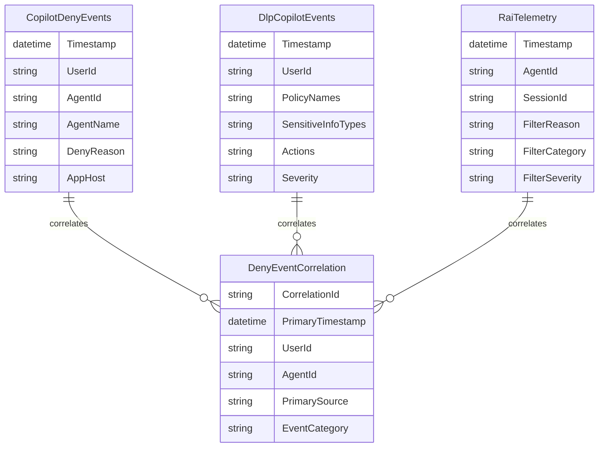

# Power BI Correlation Dashboard

**Parent:** [Deny Event Correlation Report](index.md)

---

## Overview

This guide describes the Power BI data model and dashboard for correlating deny events across three sources: Purview CopilotInteraction, Purview DLP, and Application Insights RAI telemetry.

---

## Data Model Architecture

### Source Tables



### Correlation Table

The `DenyEventCorrelation` table joins events using:

1. **UserId** - Primary key for Purview events
2. **AgentId** - Link between Purview and RAI telemetry
3. **Timestamp window** - ±5 minutes for related events

---

## Data Refresh Configuration

### Data Sources

| Source | Connection Type | Refresh Method |
|--------|-----------------|----------------|
| CopilotDenyEvents.csv | File/Blob | Daily scheduled |
| DlpCopilotEvents.csv | File/Blob | Daily scheduled |
| RaiTelemetry.csv | File/Blob | Daily scheduled |

### Recommended Refresh Schedule

| Zone | Refresh Frequency | Time |
|------|-------------------|------|
| Zone 2 | Daily | 7:00 AM local |
| Zone 3 | Every 4 hours | 6 AM, 10 AM, 2 PM, 6 PM, 10 PM |

---

## DAX Measures

### Total Deny Events

```dax
Total Deny Events =
    COUNTROWS(CopilotDenyEvents) +
    COUNTROWS(DlpCopilotEvents) +
    COUNTROWS(RaiTelemetry)
```

### Deny Events by Category

```dax
Policy Block Count =
    CALCULATE(
        COUNTROWS(CopilotDenyEvents),
        CONTAINSSTRING(CopilotDenyEvents[DenyReason], "PolicyBlock")
    )

XPIA Count =
    CALCULATE(
        COUNTROWS(CopilotDenyEvents),
        CONTAINSSTRING(CopilotDenyEvents[DenyReason], "XPIA")
    )

Jailbreak Count =
    CALCULATE(
        COUNTROWS(CopilotDenyEvents),
        CONTAINSSTRING(CopilotDenyEvents[DenyReason], "Jailbreak")
    )

RAI Filter Count = COUNTROWS(RaiTelemetry)

DLP Match Count = COUNTROWS(DlpCopilotEvents)
```

### Daily Trend

```dax
Daily Deny Trend =
    CALCULATE(
        [Total Deny Events],
        DATESINPERIOD(
            'Date'[Date],
            MAX('Date'[Date]),
            -30,
            DAY
        )
    )
```

### High Severity Count

```dax
High Severity Events =
    CALCULATE(COUNTROWS(DlpCopilotEvents), DlpCopilotEvents[Severity] = "High") +
    CALCULATE(COUNTROWS(RaiTelemetry), RaiTelemetry[FilterSeverity] = "High")
```

---

## Dashboard Pages

### Page 1: Executive Summary

| Visual | Data | Purpose |
|--------|------|---------|
| **KPI Card** | Total Deny Events (24h) | Quick health check |
| **KPI Card** | High Severity Count | Immediate attention items |
| **Pie Chart** | Events by Category | Distribution overview |
| **Line Chart** | Daily Trend (30 days) | Pattern identification |

### Page 2: Event Details

| Visual | Data | Purpose |
|--------|------|---------|
| **Table** | All deny events (sortable) | Drill-down investigation |
| **Bar Chart** | Events by Agent | Identify problematic agents |
| **Bar Chart** | Events by User | Identify user patterns |
| **Slicer** | Date range, Event type, Severity | Filtering |

### Page 3: Correlation Analysis

| Visual | Data | Purpose |
|--------|------|---------|
| **Matrix** | UserId × Event Source | Multi-source correlation |
| **Scatter Plot** | Timestamp vs Events | Temporal clustering |
| **Table** | Correlated event groups | Related event investigation |

### Page 4: Policy Effectiveness

| Visual | Data | Purpose |
|--------|------|---------|
| **Bar Chart** | DLP policies triggered | Policy utilization |
| **Table** | SITs detected with counts | Data exposure patterns |
| **KPI Card** | Override rate | Policy friction measure |

---

## Alerting Integration

### Power BI Data Alerts

Configure alerts for Zone 3 environments:

1. Pin KPI card to dashboard
2. Set alert threshold (e.g., High Severity > 0)
3. Configure email notification

### Power Automate Integration

For 15-minute SLA response:

```
Trigger: When Power BI data alert triggers
Action 1: Post to Teams channel
Action 2: Create incident in ServiceNow/Jira
Action 3: Send email to Security Operations
```

---

## Power Query Transformations

### CopilotDenyEvents Transformation

```powerquery
let
    Source = Csv.Document(File.Contents("CopilotDenyEvents.csv")),
    PromotedHeaders = Table.PromoteHeaders(Source),
    ChangedTypes = Table.TransformColumnTypes(PromotedHeaders, {
        {"Timestamp", type datetime},
        {"UserId", type text},
        {"AgentId", type text},
        {"AgentName", type text},
        {"DenyReason", type text},
        {"AppHost", type text}
    }),
    AddedEventSource = Table.AddColumn(ChangedTypes, "EventSource", each "CopilotInteraction"),
    AddedCategory = Table.AddColumn(AddedEventSource, "Category", each
        if Text.Contains([DenyReason], "PolicyBlock") then "Policy Block"
        else if Text.Contains([DenyReason], "XPIA") then "XPIA Detection"
        else if Text.Contains([DenyReason], "Jailbreak") then "Jailbreak Attempt"
        else "Resource Failure"
    )
in
    AddedCategory
```

### Correlation Query

```powerquery
let
    // Combine all events
    AllEvents = Table.Combine({
        Table.SelectColumns(CopilotDenyEvents, {"Timestamp", "UserId", "AgentId", "Category"}),
        Table.SelectColumns(DlpCopilotEvents, {"Timestamp", "UserId", "Category"}),
        Table.SelectColumns(RaiTelemetry, {"timestamp", "agentId", "filterCategory"})
    }),

    // Add correlation window (round to 5-minute buckets)
    AddedWindow = Table.AddColumn(AllEvents, "CorrelationWindow", each
        DateTime.From(Number.RoundDown(Number.From([Timestamp]) * 288) / 288)
    ),

    // Group by user and window
    Grouped = Table.Group(AddedWindow, {"UserId", "CorrelationWindow"}, {
        {"Events", each _, type table},
        {"EventCount", each Table.RowCount(_), Int64.Type}
    })
in
    Grouped
```

---

## Template Deployment

### Using the Power BI Template (.pbit)

1. Download `DenyEventCorrelation.pbit` from FSI-AgentGov-Solutions
2. Open in Power BI Desktop
3. Configure data source paths:
   - CopilotDenyEvents.csv location
   - DlpCopilotEvents.csv location
   - RaiTelemetry.csv location
4. Refresh data
5. Publish to Power BI Service

### Data Source Options

| Storage | Connection String |
|---------|-------------------|
| Local folder | `C:\DenyReports\` |
| SharePoint | `https://contoso.sharepoint.com/sites/compliance/deny-reports/` |
| Azure Blob | `https://contoso.blob.core.windows.net/deny-events/` |

---

## Security Considerations

### Row-Level Security (RLS)

For multi-business unit deployments, implement RLS:

```dax
// RLS Role: BusinessUnitFilter
[BusinessUnit] = USERPRINCIPALNAME()
// Or use a mapping table for complex scenarios
```

### Data Classification

The deny event data may contain:

- User identities (PII)
- Policy names (internal config)
- SIT match details (indicators of sensitive data)

**Recommendation:** Apply "Internal - Confidential" sensitivity label to the Power BI report.

---

## Next Steps

- [Deployment Guide](deployment-guide.md) - End-to-end deployment instructions
- Download template from [FSI-AgentGov-Solutions](https://github.com/judeper/FSI-AgentGov-Solutions)

---

*FSI Agent Governance Framework v1.2 - January 2026*
