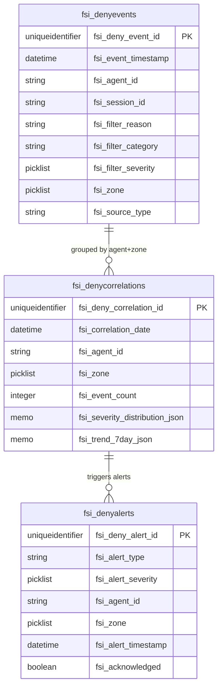

# Power BI Correlation Dashboard

**Parent:** [Deny Event Correlation Report](index.md)

---

## Overview

This guide describes the Power BI data model and dashboard for visualizing deny event correlations across three sources: Purview CopilotInteraction, Purview DLP, and Application Insights RAI telemetry. The v2.0 data model connects to **Dataverse** tables (`fsi_denyevents`, `fsi_denycorrelations`, `fsi_denyalerts`) as the primary data source.

---

## Data Model Architecture

### Dataverse Tables


```mermaid
erDiagram
    fsi_denyevents {
        uniqueidentifier fsi_deny_event_id PK
        datetime fsi_event_timestamp
        string fsi_agent_id
        string fsi_session_id
        string fsi_filter_reason
        string fsi_filter_category
        picklist fsi_filter_severity
        picklist fsi_zone
        string fsi_source_type
    }

    fsi_denycorrelations {
        uniqueidentifier fsi_deny_correlation_id PK
        datetime fsi_correlation_date
        string fsi_agent_id
        picklist fsi_zone
        integer fsi_event_count
        memo fsi_severity_distribution_json
        memo fsi_trend_7day_json
    }

    fsi_denyalerts {
        uniqueidentifier fsi_deny_alert_id PK
        string fsi_alert_type
        picklist fsi_alert_severity
        string fsi_agent_id
        picklist fsi_zone
        datetime fsi_alert_timestamp
        boolean fsi_acknowledged
    }

    fsi_denyevents ||--o{ fsi_denycorrelations : "grouped by agent+zone"
    fsi_denycorrelations ||--o{ fsi_denyalerts : "triggers alerts"
```

### Correlation Logic

The `fsi_denycorrelations` table provides pre-computed daily summaries grouped by:

1. **AgentId** — Groups events per Copilot Studio agent
2. **Zone** — Governance zone classification (Zone 1/2/3)
3. **Time window** — Configurable correlation window (default 24 hours)

---

## Data Refresh Configuration

### Data Sources

| Source | Connection Type | Refresh Method |
|--------|-----------------|----------------|
| fsi_denyevents (Dataverse) | Dataverse connector | Daily scheduled |
| fsi_denycorrelations (Dataverse) | Dataverse connector | Daily scheduled |
| fsi_denyalerts (Dataverse) | Dataverse connector | Daily scheduled |

### Recommended Refresh Schedule

| Zone | Refresh Frequency | Time |
|------|-------------------|------|
| Zone 2 | Daily | 7:00 AM local |
| Zone 3 | Every 4 hours | 6 AM, 10 AM, 2 PM, 6 PM, 10 PM |

---

## DAX Measures

### Total Deny Events

```dax
Total Deny Events =
    COUNTROWS(fsi_denyevents)
```

### Deny Events by Category

```dax
Policy Block Count =
    CALCULATE(
        COUNTROWS(fsi_denyevents),
        CONTAINSSTRING(fsi_denyevents[fsi_filter_category], "PolicyViolation")
    )

XPIA Count =
    CALCULATE(
        COUNTROWS(fsi_denyevents),
        CONTAINSSTRING(fsi_denyevents[fsi_filter_category], "XPIA")
    )

Jailbreak Count =
    CALCULATE(
        COUNTROWS(fsi_denyevents),
        CONTAINSSTRING(fsi_denyevents[fsi_filter_category], "Jailbreak")
    )

Content Safety Count =
    CALCULATE(
        COUNTROWS(fsi_denyevents),
        CONTAINSSTRING(fsi_denyevents[fsi_filter_category], "ContentSafety")
    )
```

### Events by Source Type

```dax
Purview Audit Count =
    CALCULATE(
        COUNTROWS(fsi_denyevents),
        fsi_denyevents[fsi_source_type] = "PurviewAudit"
    )

Purview DLP Count =
    CALCULATE(
        COUNTROWS(fsi_denyevents),
        fsi_denyevents[fsi_source_type] = "PurviewDlp"
    )

RAI Telemetry Count =
    CALCULATE(
        COUNTROWS(fsi_denyevents),
        fsi_denyevents[fsi_source_type] = "RaiTelemetry"
    )
```

### Daily Trend

```dax
Daily Deny Trend =
    CALCULATE(
        [Total Deny Events],
        DATESINPERIOD(
            fsi_denyevents[fsi_event_timestamp],
            MAX(fsi_denyevents[fsi_event_timestamp]),
            -30,
            DAY
        )
    )
```

### High Severity Events

```dax
High Severity Events =
    CALCULATE(
        COUNTROWS(fsi_denyevents),
        fsi_denyevents[fsi_filter_severity] = 4
    ) -- fsi_acv_severity value 4 = Failed

Active Alerts =
    CALCULATE(
        COUNTROWS(fsi_denyalerts),
        fsi_denyalerts[fsi_acknowledged] = FALSE()
    )
```

---

## Dashboard Pages

### Page 1: Executive Summary

| Visual | Data | Purpose |
|--------|------|---------|
| **KPI Card** | Total Deny Events (24h) | Quick health check |
| **KPI Card** | High Severity Events | Immediate attention items |
| **KPI Card** | Active Alerts | Unacknowledged alert count |
| **Pie Chart** | Events by Source Type | Distribution across PurviewAudit, PurviewDlp, RaiTelemetry |
| **Line Chart** | Daily Trend (30 days) | Pattern identification |

### Page 2: Event Details

| Visual | Data | Purpose |
|--------|------|---------|
| **Table** | `fsi_denyevents` (sortable) | Drill-down investigation |
| **Bar Chart** | Events by Agent (`fsi_agent_id`) | Identify problematic agents |
| **Bar Chart** | Events by Zone | Zone-level distribution |
| **Slicer** | Date range, Source type, Severity, Zone | Filtering |

### Page 3: Correlation Analysis

| Visual | Data | Purpose |
|--------|------|---------|
| **Matrix** | Agent × Zone event counts | Multi-zone correlation |
| **Line Chart** | 7-day trend per agent (from `fsi_trend_7day_json`) | Trend direction |
| **Table** | `fsi_denycorrelations` summaries | Daily correlation review |

### Page 4: Alerts and Policy Effectiveness

| Visual | Data | Purpose |
|--------|------|---------|
| **Table** | `fsi_denyalerts` (active) | Unacknowledged alerts |
| **Bar Chart** | Alert type distribution | Volume anomaly vs new agent vs zone critical |
| **KPI Card** | Alert acknowledgment rate | Operational responsiveness |
| **Bar Chart** | Events by filter category | Policy effectiveness overview |

---

## Alerting Integration

### Power BI Data Alerts

Configure alerts for Zone 3 environments:

1. Pin KPI card to dashboard
2. Set alert threshold (e.g., High Severity > 0)
3. Configure email notification

### Power Automate Integration

For 15-minute SLA response:

```
Trigger: When Power BI data alert triggers
Action 1: Post to Teams channel
Action 2: Create incident in ServiceNow/Jira
Action 3: Send email to Security Operations
```

---

## Power Query Transformations

### Deny Events Query (Dataverse)

```powerquery
let
    Source = CommonDataService.Database("https://your-org.crm.dynamics.com"),
    DenyEvents = Source{[Name="fsi_denyevents"]}[Data],
    SelectedColumns = Table.SelectColumns(DenyEvents, {
        "fsi_deny_event_id", "fsi_event_timestamp", "fsi_agent_id",
        "fsi_session_id", "fsi_filter_reason", "fsi_filter_category",
        "fsi_filter_severity", "fsi_zone", "fsi_source_type"
    }),
    RenamedColumns = Table.RenameColumns(SelectedColumns, {
        {"fsi_event_timestamp", "Timestamp"},
        {"fsi_agent_id", "AgentId"},
        {"fsi_filter_reason", "DenyReason"},
        {"fsi_filter_category", "Category"},
        {"fsi_source_type", "SourceType"},
        {"fsi_filter_severity", "Severity"},
        {"fsi_zone", "Zone"}
    }),
    TypedColumns = Table.TransformColumnTypes(RenamedColumns, {
        {"Timestamp", type datetimezone}
    })
in
    TypedColumns
```

### Correlations Query (Dataverse)

```powerquery
let
    Source = CommonDataService.Database("https://your-org.crm.dynamics.com"),
    Correlations = Source{[Name="fsi_denycorrelations"]}[Data],
    SelectedColumns = Table.SelectColumns(Correlations, {
        "fsi_deny_correlation_id", "fsi_correlation_date", "fsi_agent_id",
        "fsi_zone", "fsi_event_count", "fsi_severity_distribution_json",
        "fsi_trend_7day_json"
    }),
    RenamedColumns = Table.RenameColumns(SelectedColumns, {
        {"fsi_correlation_date", "CorrelationDate"},
        {"fsi_agent_id", "AgentId"},
        {"fsi_event_count", "EventCount"},
        {"fsi_zone", "Zone"}
    }),
    // Parse trend JSON for 7-day direction
    AddedTrendDirection = Table.AddColumn(RenamedColumns, "TrendDirection", each
        try Json.Document([fsi_trend_7day_json])[Direction] otherwise "Unknown"
    )
in
    AddedTrendDirection
```

### Alerts Query (Dataverse)

```powerquery
let
    Source = CommonDataService.Database("https://your-org.crm.dynamics.com"),
    Alerts = Source{[Name="fsi_denyalerts"]}[Data],
    SelectedColumns = Table.SelectColumns(Alerts, {
        "fsi_deny_alert_id", "fsi_alert_type", "fsi_alert_severity",
        "fsi_agent_id", "fsi_zone", "fsi_alert_timestamp",
        "fsi_alert_message", "fsi_acknowledged"
    }),
    RenamedColumns = Table.RenameColumns(SelectedColumns, {
        {"fsi_alert_type", "AlertType"},
        {"fsi_alert_severity", "Severity"},
        {"fsi_agent_id", "AgentId"},
        {"fsi_zone", "Zone"},
        {"fsi_alert_timestamp", "AlertTimestamp"},
        {"fsi_alert_message", "Message"},
        {"fsi_acknowledged", "Acknowledged"}
    })
in
    RenamedColumns
```

### Legacy Alternative: CSV Data Sources

If your organization has not yet deployed the Dataverse schema, you can use CSV file exports as an interim data source. The extraction scripts support file export via the `-OutputPath` and `-OutputFormat` parameters.

```powerquery
// Example: CSV-based deny events (legacy)
let
    Source = Csv.Document(
        File.Contents("C:\Reports\CopilotDenyEvents-2026-02-10.csv"),
        [Delimiter=",", Encoding=65001, QuoteStyle=QuoteStyle.Csv]
    ),
    PromotedHeaders = Table.PromoteHeaders(Source, [PromoteAllScalars=true])
in
    PromotedHeaders
```

!!! note "CSV Limitations"
    CSV data sources do not support incremental refresh, cross-table
    relationships, or automatic correlation summaries. Migrate to the
    Dataverse connector for the full DEC experience.

---

## Template Deployment

### Using the Power BI Template (.pbit)

1. Download `DenyEventCorrelation.pbit` from FSI-AgentGov-Solutions
2. Open in Power BI Desktop
3. Configure Dataverse connection:
   - Dataverse Environment URL: `https://your-org.crm.dynamics.com`
4. Authenticate with organizational account (Entra ID)
5. Refresh data
6. Publish to Power BI Service

### Data Source Configuration

| Setting | Value |
|---------|-------|
| Connector | Dataverse |
| Environment URL | `https://your-org.crm.dynamics.com` |
| Authentication | Organizational account (Entra ID) |

---

## Security Considerations

### Row-Level Security (RLS)

For multi-business unit deployments, implement RLS:

```dax
// RLS Role: BusinessUnitFilter
[BusinessUnit] = USERPRINCIPALNAME()
// Or use a mapping table for complex scenarios
```

### Data Classification

The deny event data may contain:

- User identities (PII)
- Policy names (internal config)
- SIT match details (indicators of sensitive data)

**Recommendation:** Apply "Internal - Confidential" sensitivity label to the Power BI report.

---

## Next Steps

- [Deployment Guide](deployment-guide.md) - End-to-end deployment instructions
- Download template from [FSI-AgentGov-Solutions](https://github.com/judeper/FSI-AgentGov-Solutions)

---

*FSI Agent Governance Framework v1.2.38 - February 2026*
