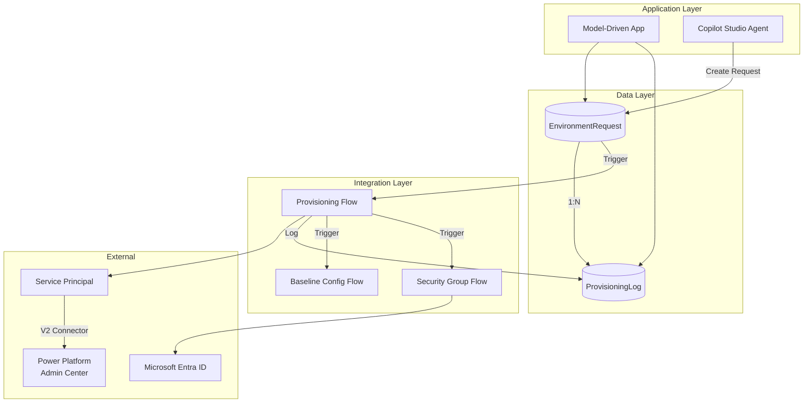
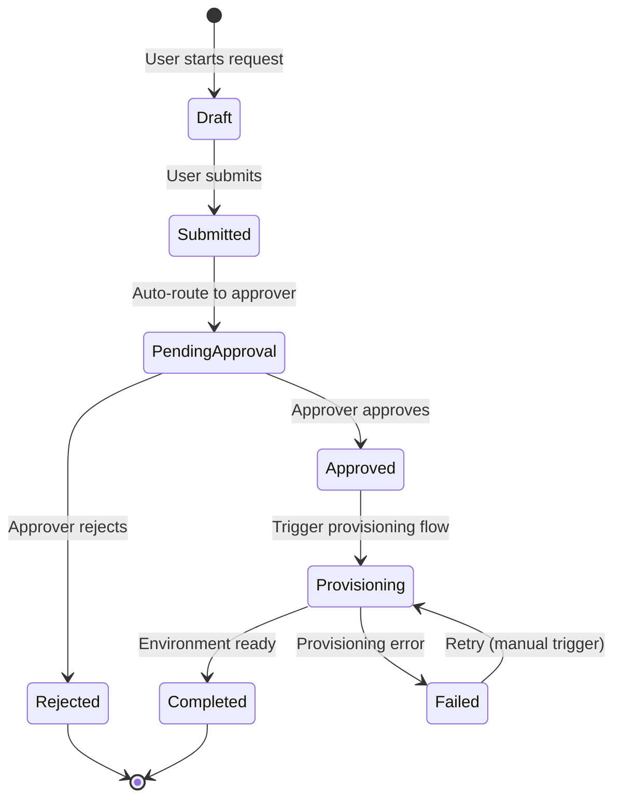
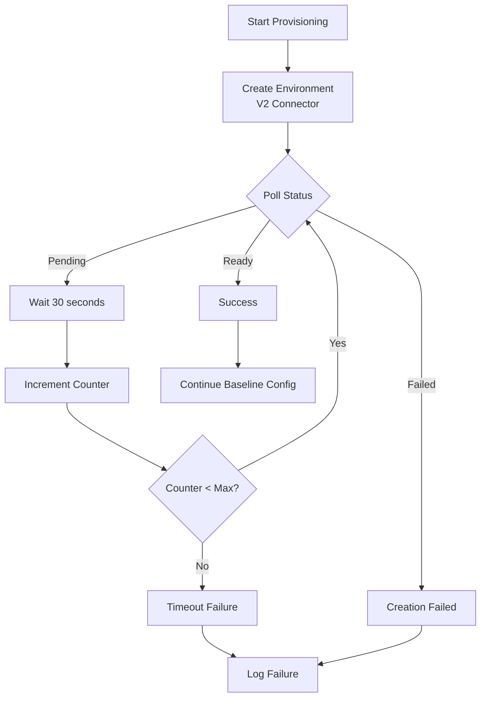
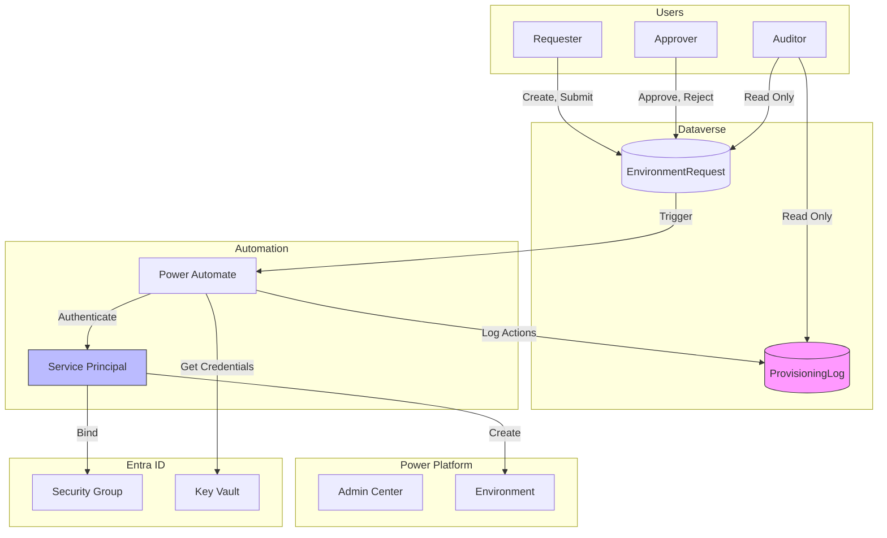

# Environment Lifecycle Management - Architecture

**Status:** January 2026 - FSI-AgentGov v1.2.12
**Related Controls:** 2.1 (Managed Environments), 2.2 (Environment Groups), 2.3 (Change Management), 2.8 (Access Control & SoD), 1.7 (Audit Logging)

---

## Overview

This document defines the canonical reference architecture for Environment Lifecycle Management, including Dataverse schema, Service Principal lifecycle, security model, and fault tolerance patterns.

---

## Core Architectural Constraints

| Constraint | Description | Implication |
|------------|-------------|-------------|
| **Managed from Creation** | Environments created as Managed Environments | No post-creation conversion required |
| **Environment Group Binding** | Environments auto-join zone-appropriate group | Rules apply immediately, no policy gap |
| **Service Principal Identity** | Automation uses dedicated app identity | Decoupled from human lifecycle |
| **Append-Only Audit Trail** | ProvisioningLog records protected from standard modification | Organization-owned table with access controls |
| **Async Provisioning** | Environment creation is non-deterministic (1-30+ min) | Polling pattern with defined timeouts |

---

## Component Overview



---

## Data Layer: Dataverse Tables

### Table 1: EnvironmentRequest (Primary Request Table)

The primary table storing all environment requests with workflow state.

!!! warning "Schema Prefix Note"
    The documentation uses `er_` and `pl_` prefixes for clarity. When creating tables in Dataverse, use your organization's publisher prefix (e.g., `fsi_`). The actual schema names will be `fsi_environmentrequest`, `fsi_provisioninglog`, etc.

#### Choice Field Value Definitions

When creating Choice columns in Dataverse, you must specify both the label and integer value. Use these exact values:

| Choice Column | Label | Value (Integer) |
|---------------|-------|-----------------|
| **er_state** | Draft | 1 |
| | Submitted | 2 |
| | PendingApproval | 3 |
| | Approved | 4 |
| | Rejected | 5 |
| | Provisioning | 6 |
| | Completed | 7 |
| | Failed | 8 |
| **er_zone** | Zone 1 | 1 |
| | Zone 2 | 2 |
| | Zone 3 | 3 |
| **er_environmenttype** | Sandbox | 1 |
| | Production | 2 |
| | Developer | 3 |
| **er_region** | United States | 1 |
| | Europe | 2 |
| | United Kingdom | 3 |
| | Australia | 4 |
| **er_datasensitivity** | Public | 1 |
| | Internal | 2 |
| | Confidential | 3 |
| | Restricted | 4 |
| **er_expectedusers** | Just me (1) | 1 |
| | Small team (2-10) | 2 |
| | Large team (11-50) | 3 |
| | Department (50+) | 4 |
| **pl_action** | RequestCreated | 1 |
| | ZoneClassified | 2 |
| | ApprovalRequested | 3 |
| | Approved | 4 |
| | Rejected | 5 |
| | ProvisioningStarted | 6 |
| | EnvironmentCreated | 7 |
| | ManagedEnabled | 8 |
| | GroupAssigned | 9 |
| | SecurityGroupBound | 10 |
| | BaselineConfigApplied | 11 |
| | DLPAssigned | 12 |
| | ProvisioningCompleted | 13 |
| | ProvisioningFailed | 14 |
| | RollbackInitiated | 15 |
| | RollbackCompleted | 16 |
| | CredentialRotated | 17 |
| | UserSynced | 18 |
| | RolesAssigned | 19 |
| | AuditingConfigured | 20 |
| | SessionTimeoutConfigured | 21 |
| | SharingLimitsConfigured | 22 |
| **pl_actortype** | User | 1 |
| | ServicePrincipal | 2 |
| | System | 3 |

!!! note "Zone Classification Algorithm"
    Zone is automatically determined by the Copilot intake agent based on data sensitivity, customer data, financial data, and external access attributes. See [implementation-copilot-intake.md#classification-algorithm](implementation-copilot-intake.md#classification-algorithm) for the complete algorithm.

#### Column Definitions

| Field Name | Data Type | Description | Required |
|------------|-----------|-------------|----------|
| `er_requestid` | GUID (PK) | Unique request identifier | Auto |
| `er_requestnumber` | Auto Number | Human-readable request number (REQ-00001). Configure format: `REQ-{SEQNUM:5}` with seed value 1 and starting number 1. | Auto |
| `er_environmentname` | Text (100) | Requested environment display name | Yes |
| `er_environmenttype` | Choice | Sandbox / Production / Developer | Yes |
| `er_region` | Choice | Geographic region (US, EU, UK, etc.) | Yes |
| `er_zone` | Choice | Zone 1 / Zone 2 / Zone 3 | Yes |
| `er_zonerationale` | Multi-line | Justification for zone selection | Zone 2/3 |
| `er_zoneautoflags` | Text (500) | Auto-detected zone triggers (PII, financial, external) | Auto |
| `er_businessjustification` | Multi-line | Business purpose for environment | Yes |
| `er_datasensitivity` | Choice | Public / Internal / Confidential / Restricted | Yes |
| `er_expectedusers` | Choice | Expected user population size | Yes |
| `er_securitygroupid` | Text (100) | Entra security group for environment access | Zone 2/3 |
| `er_requester` | Lookup (User) | User who submitted request | Auto |
| `er_requestedon` | DateTime | Request submission timestamp | Auto |
| `er_state` | Choice | Draft / Submitted / PendingApproval / Approved / Rejected / Provisioning / Completed / Failed | Workflow |
| `er_approver` | Lookup (User) | User who approved/rejected | Workflow |
| `er_approvedon` | DateTime | Approval timestamp | Workflow |
| `er_approvalcomments` | Multi-line | Approver comments (required for rejection) | Conditional |
| `er_environmentid` | Text (100) | Created environment ID (post-provisioning) | Auto |
| `er_environmenturl` | URL | Link to created environment | Auto |
| `er_provisioningstarted` | DateTime | Provisioning flow start timestamp | Auto |
| `er_provisioningcompleted` | DateTime | Provisioning flow completion timestamp | Auto |

**Table Settings:**

- **Ownership:** User-owned (enables row-level security; requesters see own requests)
- **Auditing:** Full auditing enabled (all fields, all operations)
- **Business Rules:**
  - `er_zonerationale` required when `er_zone` is Zone 2 or Zone 3
  - `er_securitygroupid` required when `er_zone` is Zone 2 or Zone 3
  - `er_approvalcomments` required when `er_state` transitions to Rejected

### Table 2: ProvisioningLog (1:N from EnvironmentRequest)

Append-only audit trail of all provisioning actions with access controls. Organization-owned with restricted privileges to prevent standard user modification.

| Field Name | Data Type | Description |
|------------|-----------|-------------|
| `pl_logid` | GUID (PK) | Unique log entry identifier |
| `pl_environmentrequest` | Lookup | Parent request (Restrict Delete) |
| `pl_sequence` | Whole Number | Action sequence (1, 2, 3...) |
| `pl_action` | Choice | RequestCreated / ZoneClassified / ApprovalRequested / Approved / Rejected / ProvisioningStarted / EnvironmentCreated / ManagedEnabled / GroupAssigned / SecurityGroupBound / BaselineConfigApplied / DLPAssigned / ProvisioningCompleted / ProvisioningFailed / RollbackInitiated / RollbackCompleted / CredentialRotated / UserSynced / RolesAssigned / AuditingConfigured / SessionTimeoutConfigured / SharingLimitsConfigured |
| `pl_actiondetails` | Multi-line | JSON payload with action-specific details |
| `pl_actor` | Text (200) | UPN or Service Principal ID that performed action |
| `pl_actortype` | Choice | User / ServicePrincipal / System |
| `pl_timestamp` | DateTime | Action timestamp (auto-set) |
| `pl_success` | Boolean | Action succeeded |
| `pl_errormessage` | Multi-line | Error details if failed |
| `pl_correlationid` | Text (100) | Power Automate run correlation ID |

**Table Settings:**

- **Ownership:** Organization-owned (read-only after creation for standard users)
- **Auditing:** Enabled (provides secondary audit trail via Dataverse audit)
- **Relationship:** Restrict delete (cannot delete request with logs)
- **Security:** No Update or Delete privileges for any role (access control enforcement)

!!! warning "Access Control Limitations"
    These controls are **defense-in-depth measures**, not true immutability. System Administrators retain full Dataverse access regardless of role configuration. For compliance-grade immutability (e.g., SEC 17a-4 WORM requirement), see [Evidence and Audit](evidence-and-audit.md#worm-export-option) for export to immutable storage.

### Relationship Definition

```text
EnvironmentRequest (1) ──────┬──────> (N) ProvisioningLog
                             │
                    pl_environmentrequest (Lookup)
                    Behavior: Referential, Restrict Delete
```

---

## Workflow State Machine

| State | Description | Required Actions | Next States |
|-------|-------------|------------------|-------------|
| **Draft** | Request in progress | Requester completing form | Submitted |
| **Submitted** | Request submitted for review | None | PendingApproval |
| **PendingApproval** | Awaiting approver action | Approver assigned | Approved, Rejected |
| **Approved** | Approval granted | Approval recorded | Provisioning |
| **Rejected** | Request denied | Rejection reason required | (Terminal) |
| **Provisioning** | Environment being created | Provisioning flow running | Completed, Failed |
| **Completed** | Environment ready | Environment ID populated | (Terminal) |
| **Failed** | Provisioning failed | Error logged | Provisioning (retry) |



---

## Security Model

### Security Roles

| Role Name | Persona | Read Scope | Write Scope | Key Privileges |
|-----------|---------|------------|-------------|----------------|
| **ELM Requester** | Any authorized user | User (own requests) | User (own drafts) | Create request, Submit, View own logs |
| **ELM Approver** | Manager / Governance | Business Unit | Approval fields only | Approve/Reject, View BU requests |
| **ELM Admin** | Provisioning automation | Organization | Full (via flow) | All provisioning actions |
| **ELM Auditor** | Compliance / Audit | Organization (read-only) | None | Read all tables, export capability |

### Segregation of Duties

Per Control 2.8 requirements:

- **Requester cannot approve own request** - Enforced via `er_approver ≠ er_requester` validation
- **Approvers cannot create requests for themselves** - Workflow rule prevents self-service bypass
- **Service Principal performs provisioning** - Automation identity separate from human approvers

### Field-Level Security

| Field | ELM Requester | ELM Approver | ELM Admin | ELM Auditor |
|-------|---------------|--------------|-----------|-------------|
| `er_state` | Read (own) | Read/Write (BU) | Read/Write | Read |
| `er_approver` | Read | Read/Write | Read | Read |
| `er_environmentid` | Read | Read | Read/Write | Read |
| `pl_*` (all log fields) | Read (own request) | Read (BU) | Create only | Read |

### ProvisioningLog Access Controls

The ProvisioningLog table uses layered access controls to protect audit data:

1. **Organization Ownership:** Table owned by organization, not individual users
2. **No Update Privilege:** No security role grants Update permission
3. **No Delete Privilege:** No security role grants Delete permission
4. **Create-Only Access:** ELM Admin role has Create privilege only
5. **Dataverse Auditing:** Secondary audit trail captures any access attempts

!!! info "What These Controls Prevent vs. Allow"

    | Threat | Prevented? | Notes |
    |--------|------------|-------|
    | Standard user modification | ✅ Yes | Role-based security blocks |
    | ELM Admin modification | ✅ Yes | Only Create privilege granted |
    | System Administrator modification | ❌ No | Full Dataverse access retained |
    | Direct API modification by privileged users | ❌ No | Requires additional monitoring |
    | Forensic evidence of any access | ✅ Yes | Dataverse audit captures attempts |

    For organizations requiring true immutability (e.g., SEC 17a-4 WORM), export to Azure Blob Storage with immutability policies. See [Evidence and Audit](evidence-and-audit.md#worm-export-option).

**Validation for Examiners:**

```powershell
# Verify ProvisioningLog has no Update/Delete privileges assigned
# Uses Dataverse Web API — Get-CrmRolePrivilege does not exist in published modules
$env = Get-AdminPowerAppEnvironment -EnvironmentName "<env-guid>"
$uri = "$($env.InternalUrl)/api/data/v9.2/roles?" +
       "`$filter=name eq 'ELM Admin'&`$expand=roleprivileges_association"
$result = Invoke-RestMethod -Uri $uri -Headers @{ Authorization = "Bearer $token" }
$result.value.roleprivileges_association |
    Where-Object { $_.privilegeid -match "pl_provisioninglog" }
# Expected: Only Create privilege with appropriate depth
```

---

## Service Principal Lifecycle

### Creation Process

#### Step 1: Register Application in Entra ID

1. Navigate to **Microsoft Entra admin center** > **Applications** > **App registrations**
2. Select **New registration**
3. Configure:
   - **Name:** `ELM-Provisioning-ServicePrincipal`
   - **Supported account types:** Accounts in this organizational directory only (Single tenant)
   - **Redirect URI:** Leave blank (not required for service principal)
4. Click **Register**
5. Copy and save the following values:
   - **Application (client) ID:** `xxxxxxxx-xxxx-xxxx-xxxx-xxxxxxxxxxxx`
   - **Directory (tenant) ID:** `xxxxxxxx-xxxx-xxxx-xxxx-xxxxxxxxxxxx`

#### Step 2: Create Client Secret or Certificate

**Option A: Client Secret (Development/Test)**

1. In the app registration, navigate to **Certificates & secrets**
2. Select **Client secrets** > **New client secret**
3. Configure:
   - **Description:** `ELM Provisioning Secret`
   - **Expires:** 6 months (rotate every 90 days recommended)
4. Click **Add**
5. **Copy the secret value immediately** - it won't be shown again
6. Store the secret in **Azure Key Vault** (see Step 4)

**Option B: Certificate (Production - Recommended)**

1. Generate a self-signed certificate or obtain one from your CA:
   ```powershell
   $cert = New-SelfSignedCertificate -Subject "CN=ELM-Provisioning-ServicePrincipal" -CertStoreLocation "Cert:\CurrentUser\My" -KeyExportPolicy Exportable -KeySpec Signature -KeyLength 2048 -KeyAlgorithm RSA -HashAlgorithm SHA256 -NotAfter (Get-Date).AddYears(1)
   Export-Certificate -Cert $cert -FilePath "ELM-ServicePrincipal.cer"
   ```
2. In the app registration, navigate to **Certificates & secrets**
3. Select **Certificates** > **Upload certificate**
4. Upload the `.cer` file
5. Export the private key (`.pfx`) and store in Azure Key Vault

#### Step 3: Register as Power Platform Management Application

!!! important "This step grants tenant-wide Power Platform admin permissions"
    Registration as a Management Application provides implicit permissions for environment management without requiring API permissions in Entra ID.

1. Navigate to **Power Platform admin center** (admin.powerplatform.microsoft.com)
2. Select **Settings** (gear icon) > **Admin settings** > **Power Platform settings**
3. Scroll to **Service principal** section
4. Select **New service principal**
5. Enter the **Application (client) ID** from Step 1
6. Click **Create**
7. Verify the service principal appears in the list with status **Enabled**

**Implicit Permissions Granted:**

Once registered as a Management Application, the Service Principal can:

| Operation | Scope |
|-----------|-------|
| Create environments | Tenant-wide |
| Read environment properties | Tenant-wide |
| Update environment settings | Tenant-wide |
| Enable Managed Environments | Tenant-wide |
| Add environments to Environment Groups | Tenant-wide |

**Not Granted (Principle of Least Privilege):**

- Delete environments
- Modify DLP policies directly
- Access environment data

#### Step 4: Store Credentials in Azure Key Vault

1. Navigate to **Azure Portal** > **Key Vaults** > Select your vault (or create one)
2. Select **Secrets** > **Generate/Import**
3. Configure:
   - **Name:** `ELM-ServicePrincipal-Secret` (or `ELM-ServicePrincipal-Certificate` for certificate)
   - **Value:** The client secret value (or certificate password)
4. Click **Create**
5. Grant the Power Automate connection identity access:
   - Navigate to **Access policies** > **Add Access Policy**
   - **Secret permissions:** Get
   - **Principal:** Search for Power Automate or the identity running your flows

### Permission Scope

!!! warning "Service Principal Security Group Bypass"
    Service Principals registered as Power Platform Management Applications **bypass environment-level Security Group restrictions**. When you configure an environment to restrict access to a specific Entra Security Group, users in that group are limited—but the Service Principal retains full access regardless of group membership.

    **Risk:** A compromised or misconfigured Service Principal can access any environment in the tenant, even those restricted by Security Groups.

    **Mitigations:**

    | Control | Implementation | Frequency |
    |---------|----------------|-----------|
    | **Row-Level Security (RLS)** | Configure Dataverse RLS to limit data visibility | At deployment |
    | **Column-Level Security** | Protect sensitive columns from Service Principal access | At deployment |
    | **Service Principal Audit** | Monitor SP actions via ProvisioningLog and Dataverse audit | Continuous |
    | **Credential Rotation** | Rotate SP credentials every 90 days | Quarterly |
    | **Privilege Review** | Audit SP permissions and registered Management Applications | Quarterly |

    **Source:** Zenity research on Power Platform Service Principal permissions (June 2025)

!!! note "Permissions via Management Application Registration"
    When registered as a Power Platform Management Application (Step 3 above), the Service Principal receives implicit permissions without requiring Entra ID API permissions. The table below documents what operations are available.

**Available Operations (via Management Application):**

| Operation | API Endpoint | Granted |
|-----------|--------------|---------|
| Create environments | Power Platform for Admins V2 connector | Yes |
| Read environment status | Power Platform for Admins V2 connector | Yes |
| Update environment settings | BAP API | Yes |
| Enable Managed Environment | BAP API | Yes |
| Add to Environment Group | BAP API | Yes |

**No Additional Entra ID API Permissions Required:**

The Service Principal does **not** need `PowerApps-Advisor` or other Entra ID API permissions for environment provisioning. Management Application registration provides all necessary access.

**Principle of Least Privilege:**

- Service Principal **cannot** delete environments
- Service Principal **cannot** modify DLP policies (uses Environment Group inheritance)
- Service Principal **cannot** access environment data

### Credential Rotation Schedule

| Credential Type | Rotation Period | Notification Lead Time |
|-----------------|-----------------|------------------------|
| Client Secret | 90 days | 14 days |
| Certificate | 1 year | 30 days |

**Rotation Process:**

1. Generate new credential in Entra ID (keep old active)
2. Update Azure Key Vault with new credential
3. Test provisioning flow with new credential
4. Revoke old credential after successful test
5. Log rotation in ProvisioningLog with action `CredentialRotated`

### Audit Identity

All Service Principal actions are logged with:

- **Actor:** Service Principal App ID
- **ActorType:** `ServicePrincipal`
- **CorrelationId:** Power Automate run ID

This enables clear attribution in audit queries:

```kql
OfficeActivity
| where TimeGenerated > ago(7d)
| where UserId == "<Service-Principal-AppId>"
| project TimeGenerated, Operation, ResultStatus
```

---

## Fault Tolerance Architecture

### Async Polling Pattern

Environment creation is non-deterministic (typically 1-30 minutes, can exceed 60 minutes for complex configurations). The provisioning flow implements a polling pattern:



**Polling Configuration:**

| Parameter | Value | Rationale |
|-----------|-------|-----------|
| **Poll Interval** | 30 seconds | Balance between responsiveness and API throttling |
| **Max Retries** | 120 (60 minutes total) | Accommodate slow provisioning |
| **Timeout Action** | Log failure, notify admin | Don't orphan half-created environments |

### Error Handling Matrix

| Error Type | Detection | Response | Retry |
|------------|-----------|----------|-------|
| **Environment creation failed** | V2 connector error response | Log error, set state=Failed | Manual after investigation |
| **Polling timeout** | Counter exceeds max | Log timeout, alert admin | Check environment status manually |
| **Security group not found** | Entra API 404 | Log error, halt provisioning | After group is created |
| **Environment Group assignment failed** | PPAC API error | Log error, continue (non-blocking) | Automatic retry 3x |
| **Baseline config failed** | Web API error | Log error, continue provisioning | Automatic retry 3x |
| **Service Principal auth failed** | 401/403 response | Log error, alert admin, halt | After credential refresh |

### Rollback Procedures

When provisioning fails after environment creation, a partial environment may exist:

**Rollback Decision Matrix:**

| Failure Point | Environment Exists? | Rollback Action |
|---------------|---------------------|-----------------|
| Before Create | No | None needed; log failure |
| After Create, before Managed | Yes (unmanaged) | Delete environment OR continue manually |
| After Managed, before Group | Yes (managed) | Continue manually (environment is usable) |
| After Group, before baseline | Yes (governed) | Continue manually (governance applied) |
| After baseline config | Yes (configured) | Mark complete (minor config items can be manual) |

**Rollback Flow:**

1. Log `RollbackInitiated` to ProvisioningLog
2. Attempt environment deletion (if within first 5 minutes)
3. If deletion fails, flag for manual admin review
4. Log `RollbackCompleted` or `RollbackFailed`

### Concurrent Provisioning Limits

To prevent Service Principal throttling:

| Limit | Value | Enforcement |
|-------|-------|-------------|
| **Concurrent flows** | 5 | Power Automate concurrency control |
| **Requests per minute** | 10 | Flow trigger throttling |
| **Daily environment creations** | 50 | Dataverse business rule |

**Queuing Behavior:**

When concurrent limit is reached, new requests are queued with `er_state = Approved` until a slot opens. The provisioning flow polls for approved requests every 5 minutes.

---

## Security Model Diagram



---

## Model-Driven App Blueprint

### Views

| View Name | Filter | Purpose |
|-----------|--------|---------|
| My Requests | `er_requester = currentuser` | Requester's own requests |
| Pending My Approval | `er_state = PendingApproval AND er_approver = currentuser` | Approver work queue |
| All Pending | `er_state = PendingApproval` | Admin oversight |
| Provisioning in Progress | `er_state = Provisioning` | Monitor active provisioning |
| Failed Requests | `er_state = Failed` | Remediation queue |
| Completed This Month | `er_state = Completed AND er_provisioningcompleted >= startOfMonth` | Metrics |

### Dashboard: Environment Lifecycle Overview

| Tile | Visualization | Data |
|------|---------------|------|
| Requests by State | Stacked bar | Count grouped by `er_state` |
| Requests by Zone | Pie chart | Count grouped by `er_zone` |
| Pending Approvals | Count | `er_state = PendingApproval` |
| Avg Provisioning Time | KPI | Average (Completed - ProvisioningStarted) |
| Failed This Week | Alert list | `er_state = Failed AND er_requestedon >= startOfWeek` |

### Form Layout

**Main Form Tabs:**

1. **Request Details** - Environment name, type, region, zone, justification
2. **Classification** - Zone rationale, auto-flags, data sensitivity
3. **Approval** - Approver, status, comments
4. **Provisioning** - Environment ID, URL, timestamps
5. **Audit Trail** - ProvisioningLog subgrid (read-only)

---

## Related Documents

| Document | Relationship |
|----------|-------------|
| [Overview](index.md) | Playbook introduction and regulatory alignment |
| [Copilot Intake Agent](implementation-copilot-intake.md) | Conversational request collection |
| [Provisioning Flows](implementation-provisioning.md) | Power Automate implementation |
| [Labs](labs.md) | Hands-on implementation exercises |
| [Evidence and Audit](evidence-and-audit.md) | Compliance evidence mapping |

---

*FSI Agent Governance Framework v1.2.12 - January 2026*
