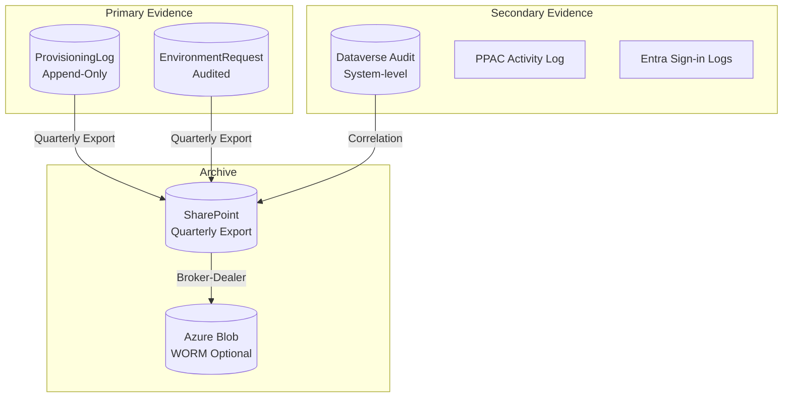

# Environment Lifecycle Management - Evidence and Audit

**Status:** January 2026 - FSI-AgentGov v1.2.12
**Related Controls:** 1.7 (Audit Logging), 2.13 (Documentation), 3.3 (Compliance Reporting)

---

## Overview

This document defines evidence standards, retention requirements, and examination response procedures for Environment Lifecycle Management. The ProvisioningLog table serves as an append-only audit trail with access controls for all provisioning activities.

!!! info "Audit Trail vs. True Immutability"
    The ProvisioningLog provides strong access controls that prevent standard users from modifying records. However, for organizations requiring compliance-grade immutability (e.g., SEC 17a-4 WORM storage), additional export to immutable storage is recommended. See [WORM Export Option](#worm-export-option) below.

---

## Evidence Architecture



---

## ProvisioningLog Access Controls

### Protection Mechanism

The ProvisioningLog uses layered access controls to protect audit data:

| Layer | Mechanism | Verification |
|-------|-----------|--------------|
| **1. Table Ownership** | Organization-owned (not user-owned) | Table settings in Power Apps |
| **2. Security Role Privileges** | No Update or Delete privileges granted | Role privilege audit |
| **3. Dataverse Auditing** | Secondary audit trail of any access | Audit log query |
| **4. Application Logic** | No update/delete actions in flows | Flow definition review |

### What These Controls Prevent vs. Allow

| Threat | Mitigated? | Notes |
|--------|------------|-------|
| Standard user creating false records | ✅ Yes | Only ELM Admin role has Create |
| Standard user modifying existing records | ✅ Yes | No Update privileges granted |
| Standard user deleting records | ✅ Yes | No Delete privileges granted |
| System Administrator modification | ❌ No | Full Dataverse access bypasses roles |
| Direct Dataverse Web API by privileged users | ❌ No | API access respects privileges but not for sysadmin |
| Forensic detection of unauthorized access | ✅ Yes | Dataverse audit captures all operations |

!!! warning "Defense-in-Depth, Not True Immutability"
    These controls provide strong protection against standard users but do not achieve cryptographic immutability. System Administrators retain full access to Dataverse regardless of security role configuration. For SEC 17a-4 compliance or similar requirements, export to WORM storage is required.

### Security Role Configuration

**ELM Admin Role - ProvisioningLog Privileges:**

| Privilege | Level | Granted |
|-----------|-------|---------|
| Create | Organization | Yes |
| Read | Organization | Yes |
| Write | None | **No** |
| Delete | None | **No** |
| Append | None | **No** |
| AppendTo | None | **No** |

**Verification Query (PowerShell):**

!!! note "Prerequisites"
    This script requires the **Microsoft.Xrm.Data.PowerShell** module. Install with:
    ```powershell
    Install-Module -Name Microsoft.Xrm.Data.PowerShell -Scope CurrentUser
    ```

```powershell
# Prerequisites: Microsoft.Xrm.Data.PowerShell module
# Install-Module -Name Microsoft.Xrm.Data.PowerShell -Scope CurrentUser

# Connect to Dataverse
$conn = Connect-CrmOnline -ServerUrl "https://yourorg.crm.dynamics.com" -Interactive

# Verify no role has Update/Delete on ProvisioningLog
try {
    $roles = Get-CrmRecords -conn $conn -EntityLogicalName role -Fields name,roleid
    foreach ($role in $roles.CrmRecords) {
        $privs = Get-CrmRecords -conn $conn -EntityLogicalName roleprivileges -FilterAttribute roleid -FilterOperator eq -FilterValue $role.roleid -Fields privilegedepthmask,privilegeid

        foreach ($priv in $privs.CrmRecords) {
            $privilege = Get-CrmRecord -conn $conn -EntityLogicalName privilege -Id $priv.privilegeid -Fields name

            if ($privilege.name -like "*fsi_provisioninglog*" -and ($privilege.name -like "*Write*" -or $privilege.name -like "*Delete*")) {
                Write-Warning "Role '$($role.name)' has Update/Delete on ProvisioningLog!"
            }
        }
    }
    Write-Host "Verification complete. If no warnings appeared, ProvisioningLog is properly secured."
}
catch {
    Write-Error "Error during verification: $_"
}
```

### Examiner Demonstration

When examiners question audit trail integrity:

1. **Show table ownership:** Settings > Table > Ownership = Organization
2. **Show security roles:** No role has Write/Delete privileges
3. **Show Dataverse audit:** Any modification attempt would be logged
4. **Demonstrate failed update:** Attempt manual update, show error

**Expected Error:**

```
Error: Principal user does not have prvWritefsi_provisioninglog privilege
```

!!! tip "Transparency with Examiners"
    Be transparent that these are access controls, not cryptographic immutability:

    - **What you can demonstrate:** Role-based controls prevent standard users from modification, and Dataverse audit captures any access attempts including by privileged users.
    - **What you should acknowledge:** System Administrators retain full platform access. If true immutability is required, explain your WORM export process (see below).
    - **Compensating control:** Point to Dataverse audit as forensic evidence layer that would detect any unauthorized modification by privileged users.

    This transparency builds examiner confidence rather than overclaiming capabilities.

---

## Evidence Categories

### Category 1: Request Evidence

| Evidence Type | Source | Retention | Purpose |
|---------------|--------|-----------|---------|
| Environment Request Record | EnvironmentRequest table | 6 years | Request details, business justification |
| Zone Classification | EnvironmentRequest.er_zone | 6 years | Risk tier assignment |
| Auto-Detection Flags | EnvironmentRequest.er_zoneautoflags | 6 years | Classification rationale |
| Approval Decision | EnvironmentRequest.er_approver, er_approvedon | 6 years | Authorization evidence |
| Rejection Reason | EnvironmentRequest.er_approvalcomments | 6 years | Denial documentation |

### Category 2: Provisioning Evidence

| Evidence Type | Source | Retention | Purpose |
|---------------|--------|-----------|---------|
| Provisioning Sequence | ProvisioningLog | 6 years | Complete action trail |
| Service Principal Actions | ProvisioningLog.pl_actor | 6 years | Automation identity |
| Configuration Applied | ProvisioningLog.pl_actiondetails | 6 years | Baseline config proof |
| Error Details | ProvisioningLog.pl_errormessage | 6 years | Failure investigation |
| Flow Correlation | ProvisioningLog.pl_correlationid | 6 years | Cross-reference to flow runs |

### Category 3: Environment Evidence

| Evidence Type | Source | Retention | Purpose |
|---------------|--------|-----------|---------|
| Environment ID | EnvironmentRequest.er_environmentid | 6 years | Created asset identifier |
| Environment URL | EnvironmentRequest.er_environmenturl | 6 years | Access location |
| Managed Status | PPAC / ProvisioningLog | 6 years | Governance mode |
| Group Membership | PPAC / ProvisioningLog | 6 years | Zone rule inheritance |

---

## Retention Requirements

### By Zone

| Zone | Minimum Retention | Recommended | Regulatory Driver |
|------|-------------------|-------------|-------------------|
| **Zone 1** | 3 years | 3 years | Internal policy |
| **Zone 2** | 6 years | 6 years | FINRA 4511 |
| **Zone 3** | 6 years | 10 years | SEC 17a-3/4, conservative buffer |

### By Evidence Type

| Evidence Type | Readily Accessible | Archived | Total |
|---------------|-------------------|----------|-------|
| ProvisioningLog | 3 years | 3-7 years | 6-10 years |
| EnvironmentRequest | 3 years | 3-7 years | 6-10 years |
| Dataverse Audit | 3 years | 3-7 years | 6-10 years |
| Flow Run History | 28 days | Export to SharePoint | Per above |

### Broker-Dealer Considerations

Organizations subject to SEC 17a-4 may require WORM storage:

!!! note "WORM Requirement"
    Per October 2022 SEC amendments (effective May 2023), broker-dealers can use either WORM storage OR an audit-trail alternative. The ProvisioningLog + Dataverse auditing constitutes an audit-trail alternative when:

    1. Records cannot be rewritten or erased
    2. Audit trail captures all access and modification attempts
    3. Records are indexed and retrievable

#### WORM Export Option

For organizations electing WORM storage:

!!! note "Prerequisites"
    - **Microsoft.Xrm.Data.PowerShell** module for Dataverse access
    - **Az.Storage** module for Azure Blob operations
    - Azure Storage Account with immutability policy support (Blob storage with versioning enabled)

```powershell
# Prerequisites
# Install-Module -Name Microsoft.Xrm.Data.PowerShell -Scope CurrentUser
# Install-Module -Name Az.Storage -Scope CurrentUser

# Connect to Dataverse
$conn = Connect-CrmOnline -ServerUrl "https://yourorg.crm.dynamics.com" -Interactive

# Connect to Azure
Connect-AzAccount

# Configuration
$storageAccount = "fsiauditarchive"
$resourceGroup = "rg-fsi-audit"
$container = "elm-evidence"
$quarter = "Q" + [Math]::Ceiling((Get-Date).Month / 3)
$blob = "provisioninglog-$(Get-Date -Format 'yyyy')-$quarter.json"

try {
    # Export ProvisioningLog (all records)
    $data = Get-CrmRecords -conn $conn -EntityLogicalName fsi_provisioninglog -AllRecords
    $jsonExport = $data.CrmRecords | ConvertTo-Json -Depth 10
    $jsonExport | Out-File "export.json" -Encoding UTF8

    # Upload with immutability
    $ctx = (Get-AzStorageAccount -ResourceGroupName $resourceGroup -Name $storageAccount).Context
    $blobResult = Set-AzStorageBlobContent -File "export.json" -Container $container -Blob $blob -Context $ctx -Force

    # Set immutability policy (requires blob versioning enabled on storage account)
    Set-AzStorageBlobImmutabilityPolicy -Container $container -Blob $blob -ExpiresOn (Get-Date).AddYears(10) -PolicyMode Unlocked -Context $ctx

    Write-Host "Export complete: $blob"
    Write-Host "Immutability policy set for 10 years"
}
catch {
    Write-Error "Export failed: $_"
}
finally {
    # Clean up local file
    if (Test-Path "export.json") { Remove-Item "export.json" }
}
```

---

## Quarterly Export Procedure

!!! tip "Automated Export Available"
    The FSI-AgentGov-Solutions repository includes Python scripts that automate quarterly evidence export with SHA-256 integrity hashing. See [environment-lifecycle-management/scripts](https://github.com/judeper/FSI-AgentGov-Solutions/tree/main/environment-lifecycle-management/scripts):

    - `export_quarterly_evidence.py` - Export EnvironmentRequest and ProvisioningLog with manifest
    - `validate_immutability.py` - Verify no unauthorized modifications

    These scripts use MSAL Confidential Client authentication suitable for scheduled automation.

### Step 1: Export ProvisioningLog

!!! note "Prerequisites"
    Install the Microsoft.Xrm.Data.PowerShell module:
    ```powershell
    Install-Module -Name Microsoft.Xrm.Data.PowerShell -Scope CurrentUser
    ```

```powershell
# Connect to Dataverse
$conn = Connect-CrmOnline -ServerUrl "https://yourorg.crm.dynamics.com" -Interactive

# Export ProvisioningLog for quarter
$startDate = (Get-Date).AddMonths(-3)
$endDate = Get-Date

# OData date format: yyyy-MM-ddTHH:mm:ssZ
$startDateStr = $startDate.ToUniversalTime().ToString("yyyy-MM-ddTHH:mm:ssZ")
$endDateStr = $endDate.ToUniversalTime().ToString("yyyy-MM-ddTHH:mm:ssZ")

# Build FetchXML query (more reliable than OData filter with dates)
$fetchXml = @"
<fetch>
  <entity name="fsi_provisioninglog">
    <all-attributes />
    <filter type="and">
      <condition attribute="fsi_timestamp" operator="ge" value="$startDateStr" />
      <condition attribute="fsi_timestamp" operator="le" value="$endDateStr" />
    </filter>
    <order attribute="fsi_timestamp" />
  </entity>
</fetch>
"@

try {
    $logs = Get-CrmRecordsByFetch -conn $conn -Fetch $fetchXml

    # Calculate SHA-256 hash for integrity
    $jsonExport = $logs.CrmRecords | ConvertTo-Json -Depth 10
    $hash = [System.Security.Cryptography.SHA256]::Create().ComputeHash(
        [System.Text.Encoding]::UTF8.GetBytes($jsonExport)
    )
    $hashString = [BitConverter]::ToString($hash) -replace '-'

    # Save with hash
    $quarter = "Q" + [Math]::Ceiling((Get-Date).Month / 3)
    $exportPath = "ProvisioningLog-$(Get-Date -Format 'yyyy')-$quarter.json"
    $jsonExport | Out-File $exportPath -Encoding UTF8
    Write-Host "Exported $($logs.CrmRecords.Count) records to $exportPath"
    Write-Host "Export hash: $hashString"
}
catch {
    Write-Error "Export failed: $_"
}
```

### Step 2: Export EnvironmentRequest

```powershell
# Reuse the connection from Step 1 ($conn)
# Reuse date variables from Step 1 ($startDateStr, $endDateStr)

# Build FetchXML query for EnvironmentRequest
$fetchXml = @"
<fetch>
  <entity name="fsi_environmentrequest">
    <all-attributes />
    <filter type="and">
      <condition attribute="fsi_requestedon" operator="ge" value="$startDateStr" />
      <condition attribute="fsi_requestedon" operator="le" value="$endDateStr" />
    </filter>
    <order attribute="fsi_requestedon" />
  </entity>
</fetch>
"@

try {
    $requests = Get-CrmRecordsByFetch -conn $conn -Fetch $fetchXml

    $jsonExport = $requests.CrmRecords | ConvertTo-Json -Depth 10
    $hash = [System.Security.Cryptography.SHA256]::Create().ComputeHash(
        [System.Text.Encoding]::UTF8.GetBytes($jsonExport)
    )
    $hashString = [BitConverter]::ToString($hash) -replace '-'

    $quarter = "Q" + [Math]::Ceiling((Get-Date).Month / 3)
    $exportPath = "EnvironmentRequest-$(Get-Date -Format 'yyyy')-$quarter.json"
    $jsonExport | Out-File $exportPath -Encoding UTF8
    Write-Host "Exported $($requests.CrmRecords.Count) records to $exportPath"
    Write-Host "Export hash: $hashString"
}
catch {
    Write-Error "Export failed: $_"
}
```

### Step 3: Archive to SharePoint

1. Upload exports to SharePoint document library
2. Apply retention label (6 years minimum)
3. Record hash in manifest file
4. Lock folder (prevent deletion during retention)

### Step 4: Verify Integrity

```powershell
# Quarterly integrity check
$manifest = Get-Content "manifest.json" | ConvertFrom-Json
foreach ($export in $manifest.exports) {
    $content = Get-Content $export.path
    $currentHash = [System.Security.Cryptography.SHA256]::Create().ComputeHash(
        [System.Text.Encoding]::UTF8.GetBytes($content)
    )
    $currentHashString = [BitConverter]::ToString($currentHash) -replace '-'

    if ($currentHashString -ne $export.hash) {
        Write-Error "Integrity check failed for $($export.path)"
    } else {
        Write-Host "Verified: $($export.path)"
    }
}
```

---

## Examination Response

### Common Examiner Questions

| Question | Evidence Source | Response |
|----------|-----------------|----------|
| "How do you ensure environments are properly classified?" | EnvironmentRequest.er_zone, er_zoneautoflags | Show auto-classification logic, Compliance review for Zone 3 |
| "Can provisioning records be modified?" | ProvisioningLog table settings, security roles | Demonstrate organization-owned, no update/delete privileges |
| "Who approved this environment?" | EnvironmentRequest.er_approver, er_approvedon | Direct lookup with timestamp |
| "What configuration was applied?" | ProvisioningLog action details | JSON payload with specific settings |
| "How long are records retained?" | Retention policy documentation | Show policy, demonstrate archive |

### Evidence Package Contents

When responding to examination requests, compile:

1. **Request Summary**
   - EnvironmentRequest record
   - Zone classification with flags
   - Business justification

2. **Approval Chain**
   - Approver identity
   - Approval timestamp
   - Compliance review (Zone 3)

3. **Provisioning Audit Trail**
   - Complete ProvisioningLog sequence
   - Service Principal actions
   - Configuration details

4. **Environment Status**
   - Current Managed Environment status
   - Environment Group membership
   - Current governance settings

### Sample Evidence Query

```powershell
# Generate examination evidence package for specific request
# Usage: .\Get-EvidencePackage.ps1 -RequestNumber "REQ-00142" -DataverseUrl "https://yourorg.crm.dynamics.com"

param(
    [Parameter(Mandatory=$true)]
    [string]$RequestNumber,
    [string]$DataverseUrl = "https://yourorg.crm.dynamics.com"
)

# Prerequisites
# Install-Module -Name Microsoft.Xrm.Data.PowerShell -Scope CurrentUser

try {
    # Connect to Dataverse
    $conn = Connect-CrmOnline -ServerUrl $DataverseUrl -Interactive

    # Get the Environment Request by Request Number
    $requestFetch = @"
<fetch top="1">
  <entity name="fsi_environmentrequest">
    <all-attributes />
    <filter>
      <condition attribute="fsi_requestnumber" operator="eq" value="$RequestNumber" />
    </filter>
  </entity>
</fetch>
"@

    $requestResult = Get-CrmRecordsByFetch -conn $conn -Fetch $requestFetch

    if ($requestResult.CrmRecords.Count -eq 0) {
        throw "Request $RequestNumber not found"
    }

    $request = $requestResult.CrmRecords[0]
    Write-Host "Found request: $($request.fsi_environmentname)"

    # Get associated Provisioning Logs
    $logsFetch = @"
<fetch>
  <entity name="fsi_provisioninglog">
    <all-attributes />
    <filter>
      <condition attribute="fsi_environmentrequest" operator="eq" value="$($request.fsi_environmentrequestid)" />
    </filter>
    <order attribute="fsi_sequence" />
  </entity>
</fetch>
"@

    $logsResult = Get-CrmRecordsByFetch -conn $conn -Fetch $logsFetch
    Write-Host "Found $($logsResult.CrmRecords.Count) provisioning log entries"

    # Build evidence package
    $evidence = @{
        metadata = @{
            generatedOn = (Get-Date).ToUniversalTime().ToString("yyyy-MM-ddTHH:mm:ssZ")
            generatedBy = $env:USERNAME
            requestNumber = $RequestNumber
            recordCount = $logsResult.CrmRecords.Count
        }
        request = $request
        provisioningLog = $logsResult.CrmRecords
    }

    # Calculate integrity hash (before adding hash to object)
    $jsonForHash = $evidence | ConvertTo-Json -Depth 10
    $hash = [System.Security.Cryptography.SHA256]::Create().ComputeHash(
        [System.Text.Encoding]::UTF8.GetBytes($jsonForHash)
    )
    $evidence.metadata.integrityHash = [BitConverter]::ToString($hash) -replace '-'

    # Export
    $outputPath = "EvidencePackage-$RequestNumber-$(Get-Date -Format 'yyyyMMdd').json"
    $evidence | ConvertTo-Json -Depth 10 | Out-File $outputPath -Encoding UTF8

    Write-Host "Evidence package exported to: $outputPath"
    Write-Host "Integrity hash: $($evidence.metadata.integrityHash)"
}
catch {
    Write-Error "Failed to generate evidence package: $_"
}
```

---

## Dataverse Audit Correlation

Dataverse system auditing provides a secondary verification layer:

### Query Dataverse Audit

```kql
// KQL for Log Analytics (if Dataverse audit exported)
DataverseAuditLog
| where TimeGenerated > ago(90d)
| where EntityLogicalName == "fsi_provisioninglog"
| project TimeGenerated, UserId, Operation, RecordId
| order by TimeGenerated desc
```

### PowerShell Audit Query

```powershell
# Query Dataverse audit for ProvisioningLog access
$auditQuery = @"
<fetch>
  <entity name="audit">
    <attribute name="createdon"/>
    <attribute name="userid"/>
    <attribute name="operation"/>
    <attribute name="objectid"/>
    <filter>
      <condition attribute="objecttypecode" operator="eq" value="fsi_provisioninglog"/>
    </filter>
    <order attribute="createdon" descending="true"/>
  </entity>
</fetch>
"@

$audits = Get-CrmRecordsByFetch -conn $conn -Fetch $auditQuery
```

---

## Monitoring and Alerts

### Suspicious Activity Alerts

Configure alerts for:

| Event | Detection | Response |
|-------|-----------|----------|
| Privilege escalation attempt | Audit log: role privilege change | Investigate, document |
| Direct table modification attempt | Dataverse audit: failed update | Investigate, document |
| Export to unauthorized location | DLP policy violation | Block, investigate |
| Unusual query volume | Activity anomaly | Review access logs |
| Service Principal accessing unexpected environment | SP audit: environment access | Investigate, document |

### Quarterly Service Principal Audit

!!! warning "Required Quarterly Review"
    Service Principals bypass environment-level Security Group restrictions. Conduct quarterly audits to verify SP permissions remain appropriate.

**Quarterly Audit Checklist:**

- [ ] Verify SP credentials have been rotated within 90 days
- [ ] Review Management Application registrations in PPAC
- [ ] Audit SP actions in ProvisioningLog for unexpected activity
- [ ] Verify SP cannot access environments outside ELM scope
- [ ] Document review findings and any remediation actions
- [ ] Report findings to AI Governance Lead

**Audit Query (KQL):**

```kql
// Service Principal activity in last 90 days
OfficeActivity
| where TimeGenerated > ago(90d)
| where UserId == "<Service-Principal-AppId>"
| summarize ActionCount = count() by Operation, bin(TimeGenerated, 1d)
| order by TimeGenerated desc
```

### Weekly Integrity Check

```powershell
# Weekly automated integrity verification
# Run this as a scheduled task or Azure Automation runbook

# Prerequisites
# Install-Module -Name Microsoft.Xrm.Data.PowerShell -Scope CurrentUser

param(
    [string]$DataverseUrl = "https://yourorg.crm.dynamics.com",
    [string]$AlertEmail = "security@contoso.com"
)

try {
    # Connect to Dataverse
    $conn = Connect-CrmOnline -ServerUrl $DataverseUrl -Interactive

    # Get records from last 7 days
    $startDate = (Get-Date).AddDays(-7).ToUniversalTime().ToString("yyyy-MM-ddTHH:mm:ssZ")

    $fetchXml = @"
<fetch>
  <entity name="fsi_provisioninglog">
    <all-attributes />
    <filter>
      <condition attribute="fsi_timestamp" operator="ge" value="$startDate" />
    </filter>
    <order attribute="fsi_timestamp" />
  </entity>
</fetch>
"@

    $recentLogs = Get-CrmRecordsByFetch -conn $conn -Fetch $fetchXml
    Write-Host "Retrieved $($recentLogs.CrmRecords.Count) records from last 7 days"

    # Check for any modification attempts in Dataverse audit
    $auditFetch = @"
<fetch top="100">
  <entity name="audit">
    <attribute name="createdon"/>
    <attribute name="userid"/>
    <attribute name="operation"/>
    <attribute name="objectid"/>
    <filter type="and">
      <condition attribute="objecttypecode" operator="eq" value="fsi_provisioninglog" />
      <condition attribute="operation" operator="in">
        <value>2</value><!-- Update -->
        <value>3</value><!-- Delete -->
      </condition>
      <condition attribute="createdon" operator="ge" value="$startDate" />
    </filter>
  </entity>
</fetch>
"@

    $auditRecords = Get-CrmRecordsByFetch -conn $conn -Fetch $auditFetch

    if ($auditRecords.CrmRecords.Count -gt 0) {
        Write-Warning "ALERT: $($auditRecords.CrmRecords.Count) modification attempts detected on ProvisioningLog!"
        # Send alert email (implement based on your notification system)
        # Send-MailMessage -To $AlertEmail -Subject "ProvisioningLog Integrity Alert" -Body "..."
    }
    else {
        Write-Host "Integrity check passed. No modification attempts detected."
    }
}
catch {
    Write-Error "Integrity check failed: $_"
    # Send failure alert
}
```

---

## Related Documents

| Document | Relationship |
|----------|-------------|
| [Architecture](architecture.md) | ProvisioningLog table design |
| [Control 1.7 - Audit Logging](../../../controls/pillar-1-security/1.7-comprehensive-audit-logging-and-compliance.md) | Framework audit requirements |
| [Control 2.13 - Documentation](../../../controls/pillar-2-management/2.13-documentation-and-record-keeping.md) | Record keeping standards |
| [Evidence Standards Reference](../../../reference/evidence-standards.md) | Cross-framework evidence guidance |

---

*FSI Agent Governance Framework v1.2.10 - January 2026*
