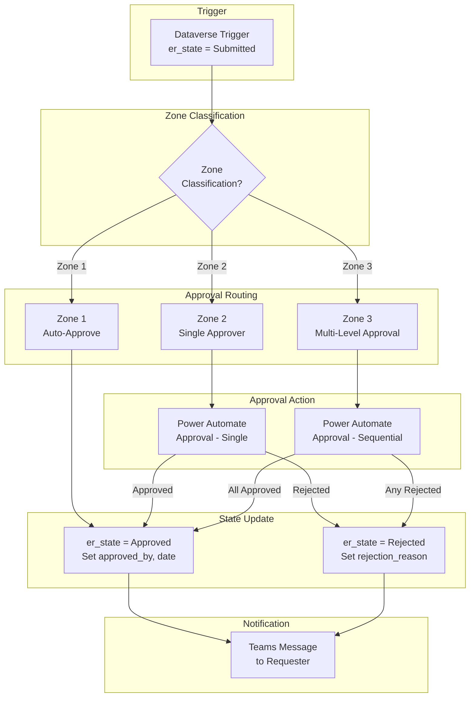

# Environment Lifecycle Management - Approval Flow

**Status:** February 2026 - FSI-AgentGov v1.2.47
**Related Controls:** 2.2 (Environment Groups), 2.8 (Access Control & SoD), 2.3 (Change Management)

---

## Overview

The approval flow is triggered when the Copilot intake agent submits an environment request (sets `er_state` to `Submitted`). The flow routes the request to appropriate approver(s) based on zone classification, updates the request state to `Approved` or `Rejected`, and notifies the requester of the outcome.

This document provides implementation guidance for building the Power Automate approval flow that bridges the intake agent and provisioning flows.

---

## Approval Flow Architecture



---

## Trigger Configuration

### Dataverse Trigger Setup

1. Create a new **Automated cloud flow** in Power Automate
2. Select trigger: **When a row is added, modified or deleted** (Microsoft Dataverse)
3. Configure trigger properties:

| Property | Value |
|----------|-------|
| **Change type** | Modified |
| **Table name** | EnvironmentRequest |
| **Scope** | Organization |
| **Filter rows** | `er_state eq 'Submitted'` |
| **Select columns** | `er_state` |
| **Run as** | Flow owner (service account recommended) |

!!! note "Trigger Filtering"
    The `Filter rows` property restricts the trigger to fire only when `er_state` changes to `Submitted`. This prevents the flow from running on every row modification and avoids approval loops when the flow itself updates the row state.

---

## Approval Routing Logic

### Zone Classification Check

After the trigger fires, retrieve the full request record and branch based on zone classification:

1. **Get row** — Retrieve the full EnvironmentRequest record using the row ID from the trigger
2. **Condition** — Branch on `er_zone_classification` value

### Zone 1: Auto-Approve

Zone 1 (Personal Productivity) environments carry the lowest risk and can be auto-approved:

1. **Update row** — Set `er_state` to `PendingApproval` (for audit trail)
2. **Delay** — Optional 30-second delay (allows for manual override if needed)
3. **Update row** — Set:
   - `er_state` = `Approved`
   - `er_approved_by` = `System (Auto-Approve)`
   - `er_approved_date` = `utcNow()`
4. **Post message** — Notify requester via Teams

!!! tip "Auto-Approve Governance"
    Although Zone 1 environments are auto-approved, the flow still records approval metadata for audit trail purposes. This supports FINRA 4511 record-keeping requirements even for low-risk environments.

### Zone 2: Single Approver

Zone 2 (Team Collaboration) environments require approval from the Power Platform Admin:

1. **Update row** — Set `er_state` to `PendingApproval`
2. **Start and wait for an approval** — Configure:

| Property | Value |
|----------|-------|
| **Approval type** | Approve/Reject - First to respond |
| **Title** | `Environment Request: [er_environment_name] (Zone 2)` |
| **Assigned to** | Power Platform Admin email (or distribution group) |
| **Details** | Include: requester, business purpose, data sensitivity, zone classification |
| **Item link** | Deep link to the EnvironmentRequest record in model-driven app |

3. **Condition** — Check approval outcome:
   - **Approved:** Update state (see State Update section)
   - **Rejected:** Update state with rejection reason

### Zone 3: Multi-Level Approval

Zone 3 (Enterprise Managed) environments require sequential approval from both the Power Platform Admin and the Compliance Officer:

1. **Update row** — Set `er_state` to `PendingApproval`
2. **Start and wait for an approval (Level 1)** — Power Platform Admin:

| Property | Value |
|----------|-------|
| **Approval type** | Approve/Reject - First to respond |
| **Title** | `[Level 1/2] Environment Request: [er_environment_name] (Zone 3)` |
| **Assigned to** | Power Platform Admin |
| **Details** | Include all request details plus zone escalation justification |

3. **Condition** — If Level 1 rejected, skip Level 2 and go to rejection
4. **Start and wait for an approval (Level 2)** — Compliance Officer:

| Property | Value |
|----------|-------|
| **Approval type** | Approve/Reject - First to respond |
| **Title** | `[Level 2/2] Environment Request: [er_environment_name] (Zone 3)` |
| **Assigned to** | Compliance Officer |
| **Details** | Include request details plus Level 1 approval confirmation |

5. **Condition** — Check Level 2 outcome

!!! warning "Segregation of Duties"
    The requester must not be the same person as any approver. If the requester holds the Power Platform Admin or Compliance Officer role, the flow should route to an alternate approver. This supports Control 2.8 (Access Control & Segregation of Duties) requirements.

---

## Approval Action Configuration

### Approval Request Details Template

Use the following HTML template for the approval details field:

```html
<h3>Environment Request Details</h3>
<table>
  <tr><td><b>Environment Name:</b></td><td>@{triggerOutputs()?['body/er_environment_name']}</td></tr>
  <tr><td><b>Requested By:</b></td><td>@{triggerOutputs()?['body/er_requested_by']}</td></tr>
  <tr><td><b>Business Purpose:</b></td><td>@{triggerOutputs()?['body/er_business_purpose']}</td></tr>
  <tr><td><b>Zone Classification:</b></td><td>@{triggerOutputs()?['body/er_zone_classification']}</td></tr>
  <tr><td><b>Data Sensitivity:</b></td><td>@{triggerOutputs()?['body/er_data_sensitivity']}</td></tr>
  <tr><td><b>Has Customer Data:</b></td><td>@{triggerOutputs()?['body/er_has_customer_data']}</td></tr>
  <tr><td><b>Has Financial Data:</b></td><td>@{triggerOutputs()?['body/er_has_financial_data']}</td></tr>
  <tr><td><b>External Access:</b></td><td>@{triggerOutputs()?['body/er_has_external_access']}</td></tr>
</table>
```

---

## State Update

### On Approve

Update the EnvironmentRequest row with:

| Column | Value |
|--------|-------|
| `er_state` | `Approved` |
| `er_approved_by` | Approver name (from approval response) |
| `er_approved_date` | `utcNow()` |

For Zone 3 multi-level approvals, concatenate both approver names:

- `er_approved_by` = `Level 1: [Admin Name], Level 2: [Compliance Name]`

### On Reject

Update the EnvironmentRequest row with:

| Column | Value |
|--------|-------|
| `er_state` | `Rejected` |
| `er_rejection_reason` | Approver comments (from approval response) |

---

## Notification Configuration

### Approval Notification

Send a Teams adaptive card to the requester on approval:

| Field | Value |
|-------|-------|
| **Recipient** | `er_requested_by` email |
| **Title** | `✅ Environment Request Approved: [er_environment_name]` |
| **Body** | Environment name, zone, approved by, expected provisioning time |

### Rejection Notification

Send a Teams message to the requester on rejection:

| Field | Value |
|-------|-------|
| **Recipient** | `er_requested_by` email |
| **Title** | `❌ Environment Request Rejected: [er_environment_name]` |
| **Body** | Environment name, zone, rejected by, rejection reason, resubmission guidance |

---

## Error Handling

### Approval Timeout

Configure timeout handling for stale approvals:

| Zone | Timeout | Action |
|------|---------|--------|
| Zone 1 | N/A (auto-approve) | N/A |
| Zone 2 | 48 hours | Escalate to AI Governance Lead |
| Zone 3 | 72 hours | Escalate to AI Governance Lead + notify requester |

**Timeout Implementation:**

1. Add a **parallel branch** alongside the approval action
2. Add a **Delay** action set to the timeout duration
3. After the delay, check if approval is still pending
4. If pending, send escalation notification and cancel the approval

### Escalation Path

For stale approvals that exceed the timeout:

1. **Post message to Teams** — Notify AI Governance Lead of stale approval
2. **Send email** — Email the original approver with reminder
3. **Update row** — Add `er_escalation_note` with timestamp and reason

### Flow Failure Recovery

1. **Configure run-after** on error branches to catch failures
2. **Update row** on failure — Set `er_state` to `Error` with error details
3. **Notify admin** — Send Teams message to Power Platform Admin with flow run URL

---

## Testing Checklist

- [ ] Zone 1 request auto-approves within 60 seconds
- [ ] Zone 2 request routes to Power Platform Admin
- [ ] Zone 3 request routes sequentially (Admin → Compliance)
- [ ] Rejection at Level 1 skips Level 2 for Zone 3
- [ ] Requester receives Teams notification on approval
- [ ] Requester receives Teams notification on rejection
- [ ] State transitions are recorded in Dataverse (audit trail)
- [ ] Segregation of duties: requester cannot approve own request
- [ ] Timeout escalation triggers after configured duration

---

*FSI Agent Governance Framework v1.2.47 - February 2026*
