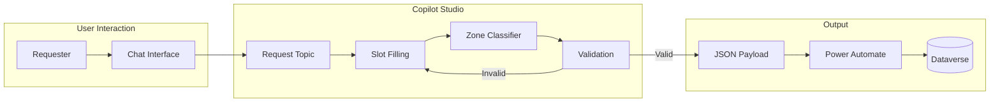

# Environment Lifecycle Management - Copilot Intake Agent

**Status:** January 2026 - FSI-AgentGov v1.2.10
**Related Controls:** 2.2 (Environment Groups), 2.15 (Environment Routing)

---

## Overview

This document provides implementation guidance for the Copilot Studio intake agent that collects environment requests through conversational interface, performs zone classification, and triggers provisioning workflows.

---

## Intake Agent Architecture



---

## Topic Configuration

### Main Topic: Request New Environment

**Trigger Phrases:**

- "I need a new environment"
- "Create an environment"
- "Request environment"
- "New Power Platform environment"
- "Provision environment"

### Slot Definitions

!!! note "Copilot Studio Entity Types"
    Copilot Studio uses specific entity types. For open-ended text responses, use **User's entire response**. For yes/no questions, use **Confirmation** (not "Boolean"). For multiple choice, use **Choice**.

| Slot Name | Entity Type | Prompt | Validation |
|-----------|-------------|--------|------------|
| `environmentName` | User's entire response | "What would you like to name this environment? Use format: DEPT-Purpose-TYPE (e.g., FIN-Reporting-PROD)" | Required, validated via condition node |
| `environmentType` | Choice | "What type of environment do you need?" | Options: Sandbox, Production, Developer |
| `region` | Choice | "Which geographic region should host this environment?" | Options: United States, Europe, United Kingdom, Australia |
| `businessPurpose` | User's entire response | "Please describe the business purpose for this environment (at least 20 characters)." | Required, length validated via condition |
| `expectedUsers` | Choice | "How many users will use this environment?" | Options: Just me (1), Small team (2-10), Large team (11-50), Department (50+) |
| `dataSensitivity` | Choice | "What's the highest data sensitivity level for data in this environment?" | Options: Public, Internal, Confidential, Restricted |
| `hasCustomerData` | Confirmation | "Will this environment process customer or client data?" | Yes/No confirmation |
| `hasFinancialData` | Confirmation | "Will this environment handle financial transaction data?" | Yes/No confirmation |
| `hasExternalAccess` | Confirmation | "Will external parties (clients, vendors) access this environment?" | Yes/No confirmation |
| `securityGroupName` | User's entire response | "What Entra security group should have access? (Enter the group name)" | Conditional, required for Zone 2/3 |

**Entity Type Reference:**

| Use Case | Correct Entity Type | NOT |
|----------|--------------------|----|
| Open-ended text input | **User's entire response** | String |
| Yes/No question | **Confirmation** | Boolean |
| Multiple choice | **Choice** (with options defined) | Enum |
| Number input | **Number** | Integer |

### Slot Flow Logic

```
Start
├── Collect: environmentName
├── Collect: environmentType
├── Collect: region
├── Collect: businessPurpose
├── Collect: expectedUsers
├── Collect: dataSensitivity
├── Collect: hasCustomerData
├── Collect: hasFinancialData
├── Collect: hasExternalAccess
├── Execute: Zone Classification
├── IF Zone 2 or 3:
│   ├── Collect: securityGroupName
│   └── Collect: zoneRationale (if Zone 3)
├── Execute: Validation
├── Display: Summary for confirmation
└── Submit: JSON to Power Automate
```

---

## Zone Classification Logic

### Automatic Zone Triggers

The intake agent evaluates responses to determine zone classification:

| Trigger Condition | Classification | Flag Added to `er_zoneautoflags` |
|-------------------|----------------|----------------------------------|
| `dataSensitivity = Restricted` | Zone 3 | `RESTRICTED_DATA` |
| `hasCustomerData = true` | Zone 3 | `CUSTOMER_PII` |
| `hasFinancialData = true` | Zone 3 | `FINANCIAL_TRANSACTIONS` |
| `hasExternalAccess = true` | Zone 3 | `EXTERNAL_ACCESS` |
| `dataSensitivity = Confidential` | Zone 2 (minimum) | `CONFIDENTIAL_DATA` |
| `environmentType = Production` | Zone 2 (minimum) | `PRODUCTION_WORKLOAD` |
| `expectedUsers` = "Small team (2-10)" or higher | Zone 2 (minimum) | `TEAM_WORKLOAD` |
| None of the above | Zone 1 | (none) |

### Classification Algorithm

```javascript
// Pseudocode for zone classification
function classifyZone(slots) {
    let zone = 1;
    let flags = [];

    // Zone 3 triggers (any one escalates to Zone 3)
    if (slots.dataSensitivity === 'Restricted') {
        zone = 3;
        flags.push('RESTRICTED_DATA');
    }
    if (slots.hasCustomerData === true) {
        zone = 3;
        flags.push('CUSTOMER_PII');
    }
    if (slots.hasFinancialData === true) {
        zone = 3;
        flags.push('FINANCIAL_TRANSACTIONS');
    }
    if (slots.hasExternalAccess === true) {
        zone = 3;
        flags.push('EXTERNAL_ACCESS');
    }

    // Zone 2 triggers (escalate to Zone 2 if not already Zone 3)
    if (zone < 2) {
        if (slots.dataSensitivity === 'Confidential') {
            zone = 2;
            flags.push('CONFIDENTIAL_DATA');
        }
        if (slots.environmentType === 'Production') {
            zone = 2;
            flags.push('PRODUCTION_WORKLOAD');
        }
        // expectedUsers is now a Choice: "Just me (1)", "Small team (2-10)", "Large team (11-50)", "Department (50+)"
        if (slots.expectedUsers !== 'Just me (1)') {
            zone = 2;
            flags.push('TEAM_WORKLOAD');
        }
    }

    return { zone, flags };
}
```

### Zone Classification Review Process

!!! important "Control 2.2 Alignment"
    Per Control 2.2 (Environment Groups and Tier Classification), **Compliance Officer approves tier classifications**. Automatic zone triggers **flag for review**, not auto-approve.

**Review Workflow:**

1. **Zone 1 Requests:** Auto-approved (no Compliance review required)
2. **Zone 2 Requests:** Manager approval required; Compliance review optional
3. **Zone 3 Requests:** Manager approval AND Compliance Officer review required

**Zone Escalation (User Disagrees with Classification):**

When the user believes auto-classification is incorrect:

1. Agent presents classification with flags: "Based on your responses, this requires Zone 3 governance due to: CUSTOMER_PII, FINANCIAL_TRANSACTIONS"
2. User can acknowledge or dispute
3. If disputed, agent collects:
   - `zoneDisputeRationale`: Why user believes different zone appropriate
   - Routes to AI Governance Lead for classification decision
4. AI Governance Lead reviews and sets final zone
5. Override documented in ProvisioningLog with rationale

**Zone Override (Classified Higher Than Requested):**

```
Agent: "Based on your responses indicating customer data access, this environment
        requires Zone 3 governance. Do you want to:
        1. Accept Zone 3 classification
        2. Remove customer data from scope (reclassify as Zone 2)
        3. Request classification review by AI Governance Lead"

User: [Selection]
```

---

## Validation Rules

### Pre-Submission Validation

| Field | Rule | Error Message |
|-------|------|---------------|
| `environmentName` | No existing environment with same name | "An environment named '{name}' already exists. Please choose a different name." |
| `environmentName` | Matches naming convention | "Environment name must start with department code (e.g., FIN-MyEnvironment)" |
| `securityGroupName` | Group exists in Entra (Zone 2/3) | "Security group '{name}' not found. Please verify the group name." |
| `businessPurpose` | Minimum 20 characters | "Please provide more detail about the business purpose (minimum 20 characters)." |

### Naming Convention Enforcement

FSI organizations typically enforce naming conventions:

```
Pattern: {DeptCode}-{Purpose}-{Type}
Examples:
  - FIN-InvestmentTracking-PROD
  - COMP-RegulatoryReporting-SANDBOX
  - IT-AgentDevelopment-DEV
```

**Copilot Studio Implementation (Condition Node):**

Since Copilot Studio doesn't support regex validation natively, implement validation using a Condition node after collecting the input:

1. After the **Question** node for `environmentName`, add a **Condition** node
2. Configure the condition:
   - **Variable:** `Topic.environmentName`
   - **Operator:** matches pattern (or use Power Fx)
3. In the **Power Fx** condition, use:

```
IsMatch(Topic.environmentName, "^[A-Z]{2,4}-[A-Za-z0-9]+-[A-Z]+$")
```

4. **If false branch:** Add a **Message** node with the error:
   > "Environment name must follow the pattern: DEPT-Purpose-TYPE (e.g., FIN-Reporting-PROD). Please try again."
5. **Then redirect** back to the `environmentName` question using **Go to another topic** > **Current topic** with redirect to the question node

**Alternative: Use Power Automate Validation**

For complex validation, pass the value to a Power Automate flow that:
1. Validates the naming convention
2. Checks for duplicate environment names
3. Returns validation result to the agent

---

## JSON Output Schema

The intake agent produces a JSON payload for Power Automate:

!!! note "Region Code Format"
    The JSON payload uses lowercase region codes (e.g., `unitedstates`, `europe`, `unitedkingdom`, `australia`) for Power Platform API compatibility. Dataverse stores the region as a Choice integer (1-4). The provisioning flow maps between these formats.

```json
{
  "requestId": "guid-generated-by-agent",
  "timestamp": "2026-01-29T14:30:00Z",
  "requester": {
    "upn": "john.smith@contoso.com",
    "displayName": "John Smith",
    "department": "Finance"
  },
  "environment": {
    "name": "FIN-QuarterlyReporting-PROD",
    "type": "Production",
    "region": "unitedstates"
  },
  "classification": {
    "zone": 3,
    "autoFlags": ["CUSTOMER_PII", "FINANCIAL_TRANSACTIONS"],
    "dataSensitivity": "Confidential",
    "zoneRationale": "Environment will process quarterly financial reports containing customer account data."
  },
  "access": {
    "securityGroupId": "12345678-1234-1234-1234-123456789012",
    "securityGroupName": "FIN-QuarterlyReporting-Users",
    "expectedUserCount": 25
  },
  "businessContext": {
    "purpose": "Quarterly financial reporting automation for SEC 10-Q filings",
    "expectedUsers": "Finance reporting team, 25 users including 3 external auditors"
  },
  "approvalRequired": {
    "manager": true,
    "compliance": true,
    "zoneReviewRequired": false
  }
}
```

---

## Power Automate Integration

### Call an Action (Recommended)

Copilot Studio natively integrates with Power Automate using **Call an action**. This is the recommended pattern as it:

- Uses built-in authentication (no API keys required)
- Passes user context automatically
- Supports input/output parameter mapping
- Works within the same environment

**Configuration Steps:**

1. In the Copilot Studio topic, add a **Call an action** node
2. Select **Create a flow** or choose an existing flow
3. The flow must have:
   - **Power Automate trigger:** "Run a flow from Copilot" (not HTTP trigger)
   - **Inputs:** Define parameters matching topic variables
   - **Outputs:** Return values to the agent (e.g., request number)

**Flow Trigger Configuration:**

```json
{
  "type": "Request",
  "kind": "PowerAppV2",
  "inputs": {
    "schema": {
      "type": "object",
      "properties": {
        "environmentName": { "type": "string" },
        "environmentType": { "type": "string" },
        "region": { "type": "string" },
        "zone": { "type": "integer" },
        "zoneFlags": { "type": "string" },
        "dataSensitivity": { "type": "string" },
        "hasCustomerData": { "type": "boolean" },
        "hasFinancialData": { "type": "boolean" },
        "hasExternalAccess": { "type": "boolean" },
        "businessPurpose": { "type": "string" },
        "expectedUsers": { "type": "string" },
        "securityGroupName": { "type": "string" },
        "zoneRationale": { "type": "string" }
      },
      "required": ["environmentName", "environmentType", "region", "zone"]
    }
  }
}
```

!!! warning "HTTP Triggers Not Recommended"
    Avoid using HTTP-triggered flows with API Key authentication. API Keys in Copilot Studio:

    - Cannot be stored securely (visible in flow configuration)
    - Require manual rotation
    - Don't pass user context automatically

    Use **Call an action** with native Power Automate integration instead.

### Flow Actions (High-Level)

1. **Parse JSON** - Validate incoming payload
2. **Create EnvironmentRequest** - Upsert to Dataverse
3. **Log RequestCreated** - ProvisioningLog entry
4. **Log ZoneClassified** - ProvisioningLog entry with flags
5. **Determine Approver** - Based on zone and requester's manager
6. **Create Approval** - Power Automate Approval action
7. **Update Request State** - Set to PendingApproval
8. **Notify Approver** - Email/Teams notification

---

## Conversation Flow Example

```
User: I need a new environment

Agent: I'd be happy to help you request a new Power Platform environment.
       Let me collect some information.

       What would you like to name this environment?

User: FIN-BudgetForecasting-PROD

Agent: Great! What type of environment do you need?
       • Sandbox (for testing and development)
       • Production (for business operations)
       • Developer (for individual development)

User: Production

Agent: Which geographic region should host this environment?
       • United States
       • Europe
       • United Kingdom
       • Australia

User: United States

Agent: Please describe the business purpose for this environment.

User: Automated budget forecasting for the finance department using AI agents

Agent: Who will be using this environment?

User: Finance planning team, about 12 users

Agent: What's the highest data sensitivity level for data in this environment?
       • Public
       • Internal
       • Confidential
       • Restricted

User: Confidential

Agent: Will this environment process customer or client data?

User: Yes, it will use historical customer transaction data for forecasting

Agent: Will this environment handle financial transaction data?

User: Yes

Agent: Will external parties (clients, vendors) access this environment?

User: No

Agent: Based on your responses, this environment requires **Zone 3** governance
       due to:
       • Customer PII processing
       • Financial transaction data

       Zone 3 environments require:
       • Compliance Officer approval (in addition to manager)
       • Security group access control
       • Full audit logging and 7-10 year retention

       What Entra security group should have access to this environment?

User: FIN-BudgetForecast-Team

Agent: Please provide a brief rationale for the Zone 3 classification.

User: Environment processes historical customer transaction data for AI-powered
      budget forecasting, requiring enhanced governance controls

Agent: Let me confirm your request:

       **Environment Details**
       • Name: FIN-BudgetForecasting-PROD
       • Type: Production
       • Region: United States

       **Classification**
       • Zone: 3 (Enterprise Managed)
       • Triggers: Customer PII, Financial Transactions
       • Data Sensitivity: Confidential

       **Access**
       • Security Group: FIN-BudgetForecast-Team

       **Approval Required**
       • Manager: Yes
       • Compliance Officer: Yes

       Is this correct?

User: Yes

Agent: Your environment request has been submitted (REQ-00142).

       Next steps:
       1. Your manager will receive an approval request
       2. Compliance Officer will review the Zone 3 classification
       3. Once approved, the environment will be provisioned automatically
       4. You'll receive a notification when the environment is ready

       You can track your request status in the Environment Request portal.
```

---

## Copilot Studio Configuration

### Topics to Create

| Topic Name | Purpose | Trigger |
|------------|---------|---------|
| **Request Environment** | Main intake flow | "new environment", "create environment" |
| **Check Request Status** | Status lookup | "status of my request", "REQ-xxxxx" |
| **Cancel Request** | Cancel pending request | "cancel request", "withdraw" |
| **Help** | Guidance and FAQs | "help", "what can you do" |

### System Topics to Customize

- **Greeting:** Add environment request option to welcome
- **Fallback:** Route unknown intents to Request Environment or Help
- **End of Conversation:** Provide request tracking link

### Authentication

Configure Copilot Studio authentication to:

1. **Require user sign-in** - Enables requester identification
2. **Access user profile** - Gets UPN, display name, manager
3. **Pass tokens to flows** - Enables secure Power Automate calls

---

## Export Considerations

!!! warning "Copilot Studio Export Limitations"
    Copilot Studio agents can be exported as Power Platform solutions, but not all configurations export cleanly. Verify the following before including agent export in your deployment kit:

    - Topic flows export correctly
    - Slot definitions preserved
    - Authentication settings require manual reconfiguration
    - Power Automate connections require reconnection in target environment

**Recommended Approach:**

1. Document agent configuration in this playbook (source of truth)
2. Export solution as backup/reference
3. Plan for manual reconfiguration of authentication in target environments

---

## Related Documents

| Document | Relationship |
|----------|-------------|
| [Architecture](architecture.md) | Data model and security context |
| [Provisioning Flows](implementation-provisioning.md) | What happens after intake |
| [Labs](labs.md#lab-2-copilot-intake-agent) | Hands-on intake agent build |

---

*FSI Agent Governance Framework v1.2.10 - January 2026*
