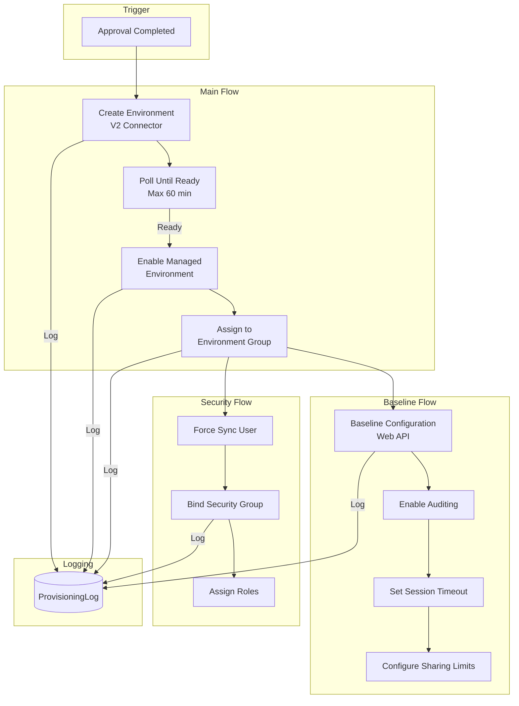
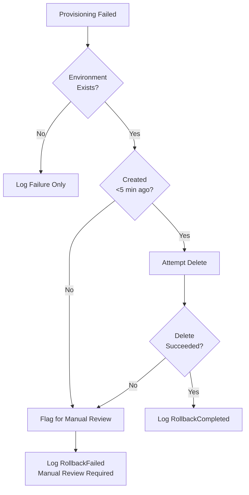

# Environment Lifecycle Management - Provisioning Flows

**Status:** January 2026 - FSI-AgentGov v1.2.12
**Related Controls:** 2.1 (Managed Environments), 2.2 (Environment Groups), 2.3 (Change Management)

---

## Overview

This document provides implementation guidance for Power Automate provisioning flows that create environments with consistent baseline configuration using Service Principal identity.

---

## Provisioning Architecture



---

## Flow 1: Main Provisioning Flow

### Trigger

**Type:** Dataverse - When a row is modified
**Table:** EnvironmentRequest
**Filter:** `er_state eq 'Approved'`

### Service Principal Connection

The flow uses a Service Principal connection for Power Platform for Admins V2 connector with credentials retrieved from Azure Key Vault.

!!! danger "Security: Never Pass Secrets Through Trigger Body"
    Never retrieve secrets via trigger body as trigger data may be logged. Always use a dedicated Key Vault action to retrieve secrets.

**Step 1: Add Azure Key Vault Connection**

Create a connection to Azure Key Vault using managed identity or service principal:

1. In Power Automate, add **Azure Key Vault** connector
2. Select **Get secret** action
3. Configure:
   - **Vault name:** Your Key Vault name
   - **Secret name:** `ELM-ServicePrincipal-Secret`

**Step 2: Retrieve Secret at Runtime**

Add this action before any Power Platform API calls:

```json
{
  "Get_Service_Principal_Secret": {
    "type": "ApiConnection",
    "inputs": {
      "host": {
        "connection": {
          "name": "@parameters('$connections')['keyvault']['connectionId']"
        }
      },
      "method": "get",
      "path": "/secrets/@{encodeURIComponent('ELM-ServicePrincipal-Secret')}/value"
    },
    "runtimeConfiguration": {
      "secureData": {
        "properties": ["inputs", "outputs"]
      }
    }
  }
}
```

**Step 3: Configure Power Platform for Admins V2 Connection**

Create the Service Principal connection in Power Automate:

1. Navigate to **make.powerautomate.com** > **Connections**
2. Select **New connection** > **Power Platform for Admins V2**
3. Choose **Connect with Service Principal**
4. Enter:
   - **Tenant ID:** `<your-tenant-id>`
   - **Client ID:** `<service-principal-app-id>`
   - **Client Secret:** Retrieved from Key Vault (not hardcoded)

!!! note "Connection Reference"
    For production deployments, use Connection References in solutions so the connection can be configured per environment without modifying the flow.

### Initialize Flow Variables

Before the main provisioning steps, initialize variables that will be used throughout the flow:

**Action:** Initialize variable (repeat for each variable)

| Variable Name | Type | Expression |
|---------------|------|------------|
| `pollCount` | Integer | `0` |
| `environmentGroupName` | String | `@{if(equals(triggerBody()?['er_zone'], 1), 'FSI-Personal-Dev', if(equals(triggerBody()?['er_zone'], 2), 'FSI-Team-Collaboration', 'FSI-Enterprise-Production'))}` |
| `resolvedGroupId` | String | `""` (populated after Environment Group lookup) |
| `auditRetentionDays` | Integer | `@{if(equals(triggerBody()?['er_zone'], 3), 2557, if(equals(triggerBody()?['er_zone'], 2), 365, 180))}` |
| `sessionTimeoutMinutes` | Integer | `@{if(equals(triggerBody()?['er_zone'], 3), 120, if(equals(triggerBody()?['er_zone'], 2), 480, 1440))}` |

```json
{
  "Initialize_sessionTimeoutMinutes": {
    "type": "InitializeVariable",
    "inputs": {
      "variables": [
        {
          "name": "sessionTimeoutMinutes",
          "type": "integer",
          "value": "@if(equals(triggerBody()?['er_zone'], 3), 120, if(equals(triggerBody()?['er_zone'], 2), 480, 1440))"
        }
      ]
    },
    "runAfter": {}
  }
}
```

### Step 1: Log Provisioning Started

**Action:** Dataverse - Add a new row
**Table:** ProvisioningLog

```json
{
  "pl_environmentrequest": "@{triggerBody()['er_requestid']}",
  "pl_sequence": 1,
  "pl_action": "ProvisioningStarted",
  "pl_actiondetails": {
    "requestNumber": "@{triggerBody()['er_requestnumber']}",
    "environmentName": "@{triggerBody()['er_environmentname']}",
    "zone": "@{triggerBody()['er_zone']}"
  },
  "pl_actor": "<Service-Principal-AppId>",
  "pl_actortype": "ServicePrincipal",
  "pl_correlationid": "@{workflow()['run']['name']}"
}
```

### Step 2: Create Environment

**Action:** Power Platform for Admins V2 - Create Environment

| Parameter | Value | Notes |
|-----------|-------|-------|
| **Location** | See Region Mapping below | Maps to Power Platform region |
| **Display Name** | `@{triggerBody()['er_environmentname']}` | From request |
| **Environment Type** | `@{triggerBody()['er_environmenttype']}` | Sandbox/Production |
| **Currency** | `USD` | Or configurable per region |
| **Language** | `1033` | English (US) |

**Region Mapping (Choice Integer to API String):**

Dataverse stores region as a Choice integer (1-4), but the Power Platform API requires lowercase string region codes. Add a **Compose** action to map the region before the Create Environment step:

| Choice Value | Choice Label | API Region Code |
|--------------|--------------|-----------------|
| 1 | United States | `unitedstates` |
| 2 | Europe | `europe` |
| 3 | United Kingdom | `unitedkingdom` |
| 4 | Australia | `australia` |

**Expression:**

```
@{if(equals(triggerBody()?['er_region'], 1), 'unitedstates',
    if(equals(triggerBody()?['er_region'], 2), 'europe',
    if(equals(triggerBody()?['er_region'], 3), 'unitedkingdom',
    'australia')))}
```

Use this expression for the **Location** parameter in the Create Environment action.

!!! warning "Security Group Binding"
    The Power Platform for Admins V2 connector does **not** support `SecurityGroupId` at environment creation time. Security group binding must be performed as a separate post-creation step using the Update Environment action or BAP API. See **Flow 2: Security Group Binding** for implementation.

**Post-Creation Security Group Binding:**

After the environment is created and ready, bind the security group:

```json
{
  "Update_Environment_Security_Group": {
    "type": "ApiConnection",
    "inputs": {
      "host": {
        "connection": {
          "name": "@parameters('$connections')['shared_powerplatformforadmins']['connectionId']"
        }
      },
      "method": "patch",
      "path": "/environments/@{outputs('Create_Environment')?['body']?['name']}",
      "body": {
        "properties": {
          "linkedEnvironmentMetadata": {
            "securityGroupId": "@{triggerBody()?['er_securitygroupid']}"
          }
        }
      }
    },
    "runAfter": {
      "Poll_Until_Ready": ["Succeeded"]
    }
  }
}
```

### Step 3: Poll Until Ready (Async Pattern)

Environment creation is asynchronous. The flow must poll for completion:

**Do Until Configuration:**

| Parameter | Value |
|-----------|-------|
| **Condition** | `@or(equals(body('Get_Environment')?['properties']?['provisioningState'], 'Succeeded'), equals(body('Get_Environment')?['properties']?['provisioningState'], 'Failed'))` |
| **Limit Count** | 120 |
| **Timeout** | PT60M |

!!! important "Exit on Both Success and Failure"
    The Do Until condition must exit on both `Succeeded` AND `Failed` states. Otherwise, a failed environment creation will cause the loop to timeout unnecessarily instead of failing fast.

**Loop Contents:**

1. **Delay:** 30 seconds
2. **Get Environment:** Power Platform for Admins V2 - Get Environment
3. **Increment Variable:** `pollCount`
4. **Condition:** Check for failure states

**Termination Conditions:**

| Condition | Action |
|-----------|--------|
| `provisioningState == 'Succeeded'` | Exit loop, continue flow |
| `provisioningState == 'Failed'` | Exit loop, log failure, terminate |
| `pollCount >= 120` | Exit loop, log timeout, terminate |

```json
// Timeout handling
{
  "actions": {
    "Check_Timeout": {
      "type": "If",
      "expression": "@greaterOrEquals(variables('pollCount'), 120)",
      "actions": {
        "Log_Timeout": { /* Log ProvisioningFailed with TimeoutExceeded */ },
        "Update_Request_Failed": { /* Set er_state = Failed */ },
        "Terminate_Timeout": {
          "type": "Terminate",
          "inputs": {
            "runStatus": "Failed",
            "runError": {
              "code": "ProvisioningTimeout",
              "message": "Environment provisioning exceeded 60-minute timeout"
            }
          }
        }
      }
    }
  }
}
```

### Step 4: Enable Managed Environment

**Action:** HTTP with Microsoft Entra ID (preauthorized)
**Method:** POST
**URI:** `https://api.bap.microsoft.com/providers/Microsoft.BusinessAppPlatform/environments/{environmentId}/enableGovernanceConfiguration?api-version=2021-04-01`

!!! note "Preauthorized Connector Authentication"
    The **HTTP with Microsoft Entra ID (preauthorized)** connector handles OAuth token acquisition automatically. Do not add manual Authorization headers—the connector injects the bearer token based on the connection's service principal credentials.

**Headers:**
```json
{
  "Content-Type": "application/json"
}
```

**Body:**
```json
{
  "protectionLevel": "Standard"
}
```

**Log Action:** `ManagedEnabled`

### Step 5: Assign to Environment Group

#### Step 5a: Resolve Environment Group ID

Environment Groups are referenced by GUID, not display name. Query the Environment Groups API to resolve the group ID:

**Action:** HTTP with Microsoft Entra ID (preauthorized)
**Method:** GET
**URI:** `https://api.bap.microsoft.com/providers/Microsoft.BusinessAppPlatform/environmentGroups?api-version=2021-04-01`

**Headers:**
```json
{
  "Content-Type": "application/json"
}
```

**Retry Configuration:**

Configure retry policy for transient failures:

```json
{
  "retryPolicy": {
    "type": "exponential",
    "count": 3,
    "interval": "PT10S",
    "minimumInterval": "PT5S",
    "maximumInterval": "PT1H"
  }
}
```

**Post-Processing:**

Add a **Filter array** action to find the group by display name:

```json
{
  "Filter_Environment_Groups": {
    "type": "Query",
    "inputs": {
      "from": "@outputs('Get_Environment_Groups')?['body']?['value']",
      "where": "@equals(item()?['displayName'], variables('environmentGroupName'))"
    }
  }
}
```

Extract the group ID:

```json
@first(body('Filter_Environment_Groups'))?['id']
```

!!! warning "Validate Group Exists"
    Add a condition to check if the filter returned results. If the group is not found, log an error and terminate gracefully rather than failing on the assignment step.

**Validation Condition:**

```json
{
  "Check_Group_Found": {
    "type": "If",
    "expression": "@equals(length(body('Filter_Environment_Groups')), 0)",
    "actions": {
      "Log_Group_Not_Found": {
        "type": "ApiConnection",
        "inputs": {
          "host": { "connection": { "name": "@parameters('$connections')['dataverse']['connectionId']" } },
          "method": "post",
          "path": "/v2/datasets/@{encodeURIComponent(parameters('org'))}/tables/@{encodeURIComponent('fsi_provisioninglogs')}/items",
          "body": {
            "pl_action": "ProvisioningFailed",
            "pl_errormessage": "Environment Group '@{variables('environmentGroupName')}' not found",
            "pl_success": false
          }
        }
      },
      "Terminate_Group_Not_Found": {
        "type": "Terminate",
        "inputs": {
          "runStatus": "Failed",
          "runError": {
            "code": "EnvironmentGroupNotFound",
            "message": "Environment Group '@{variables('environmentGroupName')}' not found. Verify the group exists in Power Platform admin center."
          }
        }
      }
    }
  }
}
```

#### Step 5b: Add Environment to Group

**Action:** HTTP with Microsoft Entra ID (preauthorized)
**Method:** POST
**URI:** `https://api.bap.microsoft.com/providers/Microsoft.BusinessAppPlatform/environmentGroups/@{variables('resolvedGroupId')}/addEnvironments?api-version=2021-04-01`

**Headers:**
```json
{
  "Content-Type": "application/json"
}
```

**Body:**
```json
{
  "environments": [
    {
      "id": "@{outputs('Create_Environment')?['body']?['name']}"
    }
  ]
}
```

**Group Selection Logic:**

| Zone | Environment Group Name |
|------|----------------------|
| Zone 1 | `FSI-Personal-Dev` |
| Zone 2 | `FSI-Team-Collaboration` |
| Zone 3 | `FSI-Enterprise-Production` |

!!! warning "Migration Note: Environment Group Naming"
    Previous versions of this guide used longer naming conventions (`FSI-Zone1-PersonalProductivity`, `FSI-Zone2-TeamCollaboration`, `FSI-Zone3-EnterpriseManagedEnvironment`). Existing deployments using the old names should update their environment group display names in Power Platform admin center or update the `environmentGroupName` variable mapping in their provisioning flows to match the Control 2.2 canonical convention shown above.

**Retry Configuration:**

Configure retry policy in the HTTP action settings:

```json
{
  "retryPolicy": {
    "type": "exponential",
    "count": 3,
    "interval": "PT30S",
    "minimumInterval": "PT10S",
    "maximumInterval": "PT1H"
  }
}
```

**Log Action:** `GroupAssigned`

!!! note "DLP Policy Inheritance"
    When an environment joins an Environment Group, DLP policies configured at the group level apply immediately. This removes the exposure window mentioned in the critique - policies are active before any user can access the environment.

---

## Flow 2: Security Group Binding

### Trigger

**Type:** Dataverse - When a row is modified
**Table:** EnvironmentRequest
**Filter:** `er_state eq 'Provisioning' and er_securitygroupid ne null`

### Step 0: Validate Security Group Exists

Before binding, verify the security group exists in Entra ID:

**Action:** HTTP with Microsoft Entra ID (preauthorized)
**Method:** GET
**URI:** `https://graph.microsoft.com/v1.0/groups/@{triggerBody()?['er_securitygroupid']}`

**Headers:**
```json
{
  "Content-Type": "application/json"
}
```

**Error Handling:**

Wrap the validation in a **Scope** with proper `runAfter` configuration:

```json
{
  "Validate_Security_Group_Scope": {
    "type": "Scope",
    "actions": {
      "Get_Security_Group": {
        "type": "Http",
        "inputs": {
          "method": "GET",
          "uri": "https://graph.microsoft.com/v1.0/groups/@{triggerBody()?['er_securitygroupid']}"
        }
      },
      "Check_Group_Response": {
        "type": "If",
        "expression": "@equals(outputs('Get_Security_Group')['statusCode'], 200)",
        "actions": {
          "Continue_Binding": { }
        },
        "else": {
          "actions": {
            "Terminate_Validation_Failed": {
              "type": "Terminate",
              "inputs": {
                "runStatus": "Failed",
                "runError": {
                  "code": "SecurityGroupNotFound",
                  "message": "Security group @{triggerBody()?['er_securitygroupid']} not found in Entra ID"
                }
              }
            }
          }
        },
        "runAfter": { "Get_Security_Group": ["Succeeded"] }
      }
    },
    "runAfter": { "Log_Provisioning_Started": ["Succeeded"] }
  },
  "Handle_Validation_Error": {
    "type": "Scope",
    "actions": {
      "Log_Validation_Failed": {
        "type": "ApiConnection",
        "inputs": {
          "body": {
            "pl_action": "ProvisioningFailed",
            "pl_errormessage": "Security group validation failed",
            "pl_success": false
          }
        }
      },
      "Update_Request_State_Failed": {
        "type": "ApiConnection",
        "inputs": {
          "body": { "er_state": "Failed" }
        }
      }
    },
    "runAfter": {
      "Validate_Security_Group_Scope": ["Failed", "TimedOut", "Skipped", "Cancelled"]
    }
  }
}
```

!!! note "Scope Error Handling Pattern"
    The `Handle_Validation_Error` scope runs only when `Validate_Security_Group_Scope` fails. Include all non-success states (`Failed`, `TimedOut`, `Skipped`, `Cancelled`) in the `runAfter` configuration to ensure comprehensive error handling.

### Step 1: Force Sync User

Before assigning roles, the automation identity must be synced to the new environment:

**Action:** HTTP with Microsoft Entra ID (preauthorized)
**Method:** POST
**URI:** `https://{environmentUrl}/api/data/v9.2/systemusers`

!!! note "Preauthorized Connector Authentication"
    The **HTTP with Microsoft Entra ID (preauthorized)** connector automatically adds the Authorization header with a bearer token. Configure the connection to use your Dataverse environment URL as the base resource.

**Headers:**
```json
{
  "Content-Type": "application/json",
  "MSCRM.SuppressDuplicateDetection": "true"
}
```

**Body:**
```json
{
  "domainname": "<service-principal-upn>",
  "applicationid": "<service-principal-app-id>",
  "azureactivedirectoryobjectid": "<service-principal-object-id>",
  "businessunitid@odata.bind": "/businessunits({rootBusinessUnitId})"
}
```

!!! note "Required Fields for Service Principal Sync"
    The `azureactivedirectoryobjectid` field is required for proper service principal synchronization. This is the Object ID from the Enterprise Application (not the App Registration Application ID).

**Retry Configuration:**

| Parameter | Value |
|-----------|-------|
| **Count** | 5 |
| **Interval** | PT10S |
| **Type** | Fixed |

**Rationale:** User sync can fail immediately after environment creation while Dataverse initializes. 5 retries with 10-second intervals allows time for initialization.

**Log Action:** `UserSynced`

### Step 2: Bind Security Group

**Action:** Power Platform for Admins V2 - Update Environment
**Parameter:** `securityGroupId`

**Log Action:** `SecurityGroupBound`

### Step 3: Assign Security Roles

For Zone 2/3 environments, assign baseline roles to the security group:

**Action:** HTTP with Microsoft Entra ID (preauthorized)
**Method:** POST
**URI:** `https://{environmentUrl}/api/data/v9.2/teams({teamId})/teammembership_association/$ref`

**Headers:**

| Header | Value |
|--------|-------|
| Content-Type | application/json |

**Body:**
```json
{
  "@odata.id": "https://{environmentUrl}/api/data/v9.2/systemusers({userId})"
}
```

**Error Handling:**
- 404: Team not found - verify security group sync completed in Step 2
- 400: User already a member - log and continue (idempotent)
- 403: Insufficient privileges - verify service principal has System Administrator role

**Retry Configuration:**

| Parameter | Value |
|-----------|-------|
| **Count** | 3 |
| **Interval** | PT5S |
| **Type** | Fixed |

**Log Action:** `RolesAssigned`

---

## Flow 3: Baseline Configuration

### Trigger

**Type:** Child flow (called from Main Provisioning Flow)

### Input Parameters

| Parameter | Type | Description |
|-----------|------|-------------|
| `environmentId` | String | Target environment ID |
| `environmentUrl` | String | Dataverse URL |
| `zone` | Number | Governance zone (1, 2, 3) |
| `requestId` | String | EnvironmentRequest ID (for logging) |

### Prerequisite: Resolve Organization ID

Before configuring baseline settings, retrieve the organization ID (root business unit ID) from Dataverse:

**Action:** HTTP with Microsoft Entra ID (preauthorized)
**Method:** GET
**URI:** `https://{environmentUrl}/api/data/v9.2/organizations?$select=organizationid,name`

**Store Result:**

```json
{
  "Set_OrgId": {
    "type": "SetVariable",
    "inputs": {
      "name": "orgId",
      "value": "@first(body('Get_Organization')?['value'])?['organizationid']"
    }
  }
}
```

!!! note "Organization ID"
    The organization ID is retrieved from the `organizations` entity. There is only one organization record per Dataverse environment. This ID is required for PATCH operations on organization settings.

### Step 1: Enable Auditing

**Action:** HTTP with Microsoft Entra ID (preauthorized)
**Method:** PATCH
**URI:** `https://{environmentUrl}/api/data/v9.2/organizations(@{variables('orgId')})`

**Body:**
```json
{
  "isauditenabled": true,
  "isuseraccessauditenabled": true,
  "auditretentionperiodv2": "@{if(equals(parameters('zone'), 3), 2557, if(equals(parameters('zone'), 2), 365, 180))}"
}
```

**Zone-Specific Audit Retention:**

| Zone | Retention Days | Rationale |
|------|----------------|-----------|
| Zone 1 | 180 | Standard 6-month coverage |
| Zone 2 | 365 | 1-year team accountability |
| Zone 3 | 2557 | 7-year regulatory (FINRA 4511) |

**Log Action:** `AuditingConfigured`

### Step 2: Set Session Timeout

**Action:** HTTP with Microsoft Entra ID (preauthorized)
**Method:** PATCH
**URI:** `https://{environmentUrl}/api/data/v9.2/organizations(@{variables('orgId')})`

**Body:**
```json
{
  "sessiontimeoutenabled": true,
  "sessiontimeoutinmins": "@{if(equals(parameters('zone'), 3), 120, if(equals(parameters('zone'), 2), 480, 1440))}"
}
```

**Zone-Specific Session Timeout:**

| Zone | Timeout (minutes) | Rationale |
|------|-------------------|-----------|
| Zone 1 | 1440 (24 hours) | Convenience for personal use |
| Zone 2 | 480 (8 hours) | Standard workday |
| Zone 3 | 120 (2 hours) | Enhanced security for sensitive data |

**Log Action:** `SessionTimeoutConfigured`

### Step 3: Configure Sharing Limits

Sharing limits are configured through the Managed Environment settings. Since the environment was enabled as a Managed Environment in Step 4 of the main flow, these settings are applied via the governance configuration API.

**Option A: Using BAP API (HTTP Action)**

**Action:** HTTP with Microsoft Entra ID (preauthorized)
**Method:** PATCH
**URI:** `https://api.bap.microsoft.com/providers/Microsoft.BusinessAppPlatform/environments/{environmentId}/governanceConfiguration?api-version=2021-04-01`

**Headers:**
```json
{
  "Content-Type": "application/json"
}
```

**Body:**
```json
{
  "settings": {
    "extendedSettings": {
      "limitSharingToSecurityGroups": "@{if(equals(parameters('zone'), 1), 'false', 'true')}",
      "excludeEnvironmentFromAnalysis": "false"
    }
  }
}
```

!!! note "Sharing Limits via Managed Environment Settings"
    Specific sharing limits (maxShareLimit for canvas apps, flows, copilots) are configured through the Power Platform admin center Managed Environment settings or via PowerShell. The API supports enabling/disabling sharing to security groups but individual limits require PowerShell:

**Option B: Using PowerShell (Recommended for Full Control)**

```powershell
# Configure sharing limits via PowerShell
$environmentId = "@{outputs('Create_Environment')?['body']?['name']}"

Set-AdminPowerAppEnvironmentGovernanceConfiguration `
    -EnvironmentName $environmentId `
    -EnableLimitSharingToSecurityGroups $true `
    -CanvasAppSharingLimit $(if ($zone -eq 3) { 20 } elseif ($zone -eq 2) { 50 } else { -1 }) `
    -FlowSharingLimit $(if ($zone -eq 3) { 10 } elseif ($zone -eq 2) { 25 } else { -1 })
```

**Log Action:** `SharingLimitsConfigured`

---

## Error Handling and Rollback

### Error Handling Matrix

| Error Type | HTTP Code | Detection | Response |
|------------|-----------|-----------|----------|
| **Authentication failure** | 401, 403 | Connector error | Log, alert admin, terminate |
| **Environment creation failed** | 400, 500 | V2 connector error | Log error details, set state=Failed |
| **Rate limiting** | 429 | Connector retry | Automatic retry with backoff |
| **Timeout** | - | Poll count exceeded | Log timeout, set state=Failed |
| **Group assignment failed** | 400, 404 | HTTP response | Retry 3x, then log warning (non-blocking) |
| **Baseline config failed** | 400, 500 | HTTP response | Retry 3x, then log warning (non-blocking) |

### Scope Error Handling

Wrap each major operation in a Scope with error handling:

```json
{
  "Create_Environment_Scope": {
    "type": "Scope",
    "actions": {
      "Create_Environment": { /* V2 connector action */ },
      "Log_Environment_Created": { /* Success log */ }
    },
    "runAfter": { "Log_Provisioning_Started": ["Succeeded"] }
  },
  "Handle_Create_Environment_Error": {
    "type": "Scope",
    "actions": {
      "Log_Create_Failed": {
        /* Log ProvisioningFailed */
      },
      "Update_Request_Failed": {
        /* Set er_state = Failed */
      },
      "Terminate_On_Create_Failure": {
        "type": "Terminate",
        "inputs": {
          "runStatus": "Failed"
        }
      }
    },
    "runAfter": {
      "Create_Environment_Scope": ["Failed", "TimedOut", "Skipped", "Cancelled"]
    }
  }
}
```

!!! note "Complete Error Handling"
    Include all non-success states in `runAfter`: `Failed`, `TimedOut`, `Skipped`, and `Cancelled`. This ensures the error handler runs regardless of how the scope terminates.

### Rollback Procedure

When provisioning fails after environment creation:

**Rollback Decision Flow:**



**Rollback Actions:**

1. **Log RollbackInitiated** to ProvisioningLog
2. **Get environment details** to verify it exists
3. **Check creation timestamp** - only auto-delete if <5 minutes old
4. **Attempt deletion** if eligible
5. **Log RollbackCompleted or RollbackFailed**
6. **Notify admin** if manual review required

**PowerShell Manual Rollback:**

```powershell
# Manual rollback for failed provisioning
$environmentId = "00000000-0000-0000-0000-000000000000"

# Verify environment state
$env = Get-AdminPowerAppEnvironment -EnvironmentName $environmentId
Write-Host "Environment: $($env.DisplayName), State: $($env.EnvironmentType)"

# Delete if appropriate
if ($env.CreatedTime -gt (Get-Date).AddHours(-1)) {
    Remove-AdminPowerAppEnvironment -EnvironmentName $environmentId -Confirm:$false
    Write-Host "Environment deleted"
} else {
    Write-Warning "Environment is too old for auto-deletion. Review manually."
}
```

---

## Concurrent Flow Management

### Concurrency Control

Configure the Main Provisioning Flow trigger with concurrency limits:

| Setting | Value | Rationale |
|---------|-------|-----------|
| **Degree of Parallelism** | 5 | Prevent Service Principal throttling |
| **Maximum Wait Calls** | 10 | Queue additional requests |

**Trigger Configuration:**

```json
{
  "type": "ApiConnectionWebhook",
  "inputs": {
    /* ... */
  },
  "runtimeConfiguration": {
    "concurrency": {
      "runs": 5
    }
  }
}
```

### Queue Monitoring

When flows are queued, monitor the backlog:

```kql
// Power Automate run queue monitoring
let flowId = "<Main-Provisioning-Flow-Id>";
PowerAutomateActivity
| where TimeGenerated > ago(1h)
| where FlowId == flowId
| where Status == "Waiting"
| summarize QueuedCount = count() by bin(TimeGenerated, 5m)
| order by TimeGenerated desc
```

---

## Completion and Notification

### Step: Mark Provisioning Complete

**Action:** Dataverse - Update a row
**Table:** EnvironmentRequest

**Values:**
```json
{
  "er_state": "Completed",
  "er_environmentid": "@{outputs('Create_Environment')?['body']?['name']}",
  "er_environmenturl": "@{outputs('Create_Environment')?['body']?['properties']?['linkedEnvironmentMetadata']?['instanceUrl']}",
  "er_provisioningcompleted": "@{utcNow()}"
}
```

### Step: Log Completion

**Action:** Dataverse - Add a new row (ProvisioningLog)

```json
{
  "pl_action": "ProvisioningCompleted",
  "pl_actiondetails": {
    "environmentId": "@{outputs('Create_Environment')?['body']?['name']}",
    "environmentUrl": "@{outputs('Create_Environment')?['body']?['properties']?['linkedEnvironmentMetadata']?['instanceUrl']}",
    "totalDuration": "@{dateDifference(triggerBody()['er_approvedon'], utcNow())}",
    "configurationApplied": {
      "managed": true,
      "environmentGroup": "@{variables('environmentGroupName')}",
      "auditRetention": "@{variables('auditRetentionDays')}",
      "sessionTimeout": "@{variables('sessionTimeoutMinutes')}",
      "sharingLimits": true
    }
  },
  "pl_success": true
}
```

### Step: Notify Requester

**Action:** Send an email (V2) or Post to Teams

**Subject:** Your environment is ready: @{triggerBody()['er_environmentname']}

**Body:**
```
Your environment request has been provisioned successfully.

**Environment Details:**
- Name: @{triggerBody()['er_environmentname']}
- URL: @{outputs('Create_Environment')?['body']?['properties']?['linkedEnvironmentMetadata']?['instanceUrl']}
- Zone: @{triggerBody()['er_zone']}
- Request: @{triggerBody()['er_requestnumber']}

**Governance Configuration Applied:**
- Managed Environment: Enabled
- Environment Group: @{variables('environmentGroupName')}
- Audit Retention: @{variables('auditRetentionDays')} days
- Session Timeout: @{variables('sessionTimeoutMinutes')} minutes

You can access your environment now. Please review the governance policies in the Welcome Content.
```

---

## Related Documents

| Document | Relationship |
|----------|-------------|
| [Architecture](architecture.md) | Service Principal and security context |
| [Copilot Intake Agent](implementation-copilot-intake.md) | How requests are collected |
| [Labs](labs.md#lab-3-provisioning-flow) | Hands-on flow build |

---

*FSI Agent Governance Framework v1.2.12 - January 2026*
