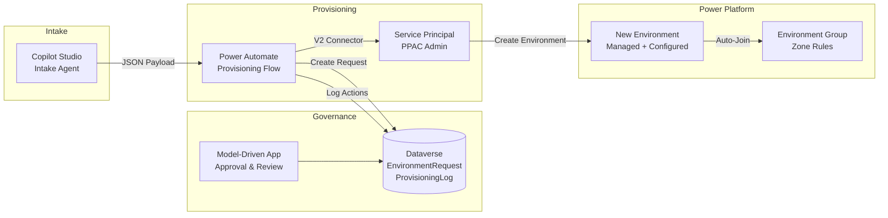

# Environment Lifecycle Management

**Status:** January 2026 - FSI-AgentGov v1.2.12
**Related Controls:** 2.1 (Managed Environments), 2.2 (Environment Groups), 2.3 (Change Management), 2.8 (Access Control & SoD), 2.13 (Documentation), 2.15 (Environment Routing), 1.7 (Audit Logging), 3.1 (Agent Inventory), 3.2 (Usage Analytics), 3.6 (Orphaned Agent Detection)

---

## Purpose

This playbook provides a canonical reference architecture for automated, governed Power Platform environment provisioning in regulated financial services organizations. The solution addresses governance gaps created by manual provisioning processes and applies consistent security controls from environment creation.

**Applies to:** Zone 2/3 environments; recommended for any organization managing Power Platform environments under regulatory oversight.

---

## Problem Statement

Financial services organizations face a compliance gap between:

1. **Manual Provisioning:** Administrators create environments ad-hoc via portal, leading to inconsistent configuration
2. **Security Control Gaps:** Auditing, DLP policies, and session timeouts applied post-creation (or forgotten entirely)
3. **Audit Trail Gaps:** No structured record of who requested what environment, why, and who approved it
4. **Inconsistent Classification:** Zone/tier assignment varies by administrator interpretation

**Result:** Environment sprawl with inconsistent governance posture, delayed security control application, and insufficient audit evidence for regulatory examination.

---

## Solution Overview

A Copilot Studio intake agent collects environment requirements through conversational interface, automatically classifies governance zone, and triggers Power Automate provisioning flows that create environments with consistent baseline configuration.



**Key Components:**

| Component | Purpose |
|-----------|---------|
| **Copilot Studio Agent** | Conversational intake with slot validation and zone classification |
| **Dataverse Tables** | EnvironmentRequest (requests), ProvisioningLog (append-only audit trail) |
| **Power Automate Flows** | Provisioning orchestration with Service Principal identity |
| **Service Principal** | Decoupled admin identity for automation (no human credential dependencies) |
| **Environment Groups** | Zone rule inheritance applies consistent governance from creation |

---

## Path Selection

Unlike Platform Change Governance (which offers Path A/B options), Environment Lifecycle Management follows a single implementation path. Organizations customize by:

1. **Zone Coverage:** Start with Zone 3 only, expand to Zone 2, then Zone 1
2. **Approval Complexity:** Simple (manager only) vs. Complex (multi-level with CAB)
3. **Integration Depth:** Standalone vs. integrated with ITSM/ServiceNow

| Starting Point | Recommended For | Complexity |
|---------------|-----------------|------------|
| **Zone 3 Only** | Initial pilot, highest-risk environments | Lower |
| **Zone 2+3** | Production deployment for governed workloads | Medium |
| **All Zones** | Complete governance coverage | Higher |

---

## Critical Design Principles

### Managed Environment from Creation

All Zone 2/3 environments are created **as Managed Environments from the start**, not converted post-creation:

- **Security First:** Sharing limits, usage insights, and solution checker active immediately
- **No Exposure Window:** Users cannot create policy-violating resources before controls apply
- **Audit Integrity:** Full activity logging from first user action

### Environment Group Auto-Assignment

Environments automatically join their zone's Environment Group at creation:

- **Rule Inheritance:** Zone rules (DLP, authentication, CUA disabled) apply immediately
- **Consistent Posture:** Reduces configuration drift between similar environments
- **Simplified Management:** Single rule set per zone, not per-environment

### Service Principal Identity

Provisioning uses a dedicated Service Principal (not human admin credentials):

- **Lifecycle Independence:** Automation unaffected by human password expiry, MFA changes, or departure
- **Audit Clarity:** Service Principal actions clearly attributed in audit logs
- **Least Privilege:** Scoped to environment creation only, not global admin

### Zone Classification Review

Automatic zone triggers (PII, financial data, external access) **flag for Compliance Officer review**, not auto-approve:

- **Aligns with Control 2.2:** Compliance Officer approves tier classifications
- **Escalation Path:** Disputed classifications route to AI Governance Lead
- **Override Documented:** Any zone override requires documented rationale

---

## Regulatory Alignment

| Regulation | Requirement | How This Solution Helps |
|------------|-------------|------------------------|
| **FINRA 4511** | Records of business activities (6+ years) | ProvisioningLog provides append-only request/approval/action audit trail with access controls |
| **SEC 17a-3/4** | Records preservation with audit trail | Dataverse change tracking, quarterly export to compliant storage |
| **SOX 302/404** | Internal control assessment and certification | Documented approval workflows, segregation of duties (requester ≠ approver) |
| **GLBA 501(b)** | Administrative safeguards for customer information | Baseline configuration applies consistent security controls at creation |
| **OCC 2011-12** | Model risk documentation | Zone classification documents risk tier for agent workloads |

---

## Framework Integration

This playbook supports multiple framework controls:

| Control | How Environment Lifecycle Management Supports |
|---------|----------------------------------------------|
| [2.1 - Managed Environments](../../../controls/pillar-2-management/2.1-managed-environments.md) | Creates environments as Managed from start |
| [2.2 - Environment Groups](../../../controls/pillar-2-management/2.2-environment-groups-and-tier-classification.md) | Auto-assigns to zone-appropriate group with governance rules |
| [2.3 - Change Management](../../../controls/pillar-2-management/2.3-change-management-and-release-planning.md) | Environment creation follows controlled change process |
| [2.8 - Access Control & SoD](../../../controls/pillar-2-management/2.8-access-control-and-segregation-of-duties.md) | Requester cannot approve own environment request |
| [2.13 - Documentation](../../../controls/pillar-2-management/2.13-documentation-and-record-keeping.md) | ProvisioningLog provides governance records |
| [2.15 - Environment Routing](../../../controls/pillar-2-management/2.15-environment-routing.md) | Intake agent routes requests to appropriate zone |
| [1.7 - Audit Logging](../../../controls/pillar-1-security/1.7-comprehensive-audit-logging-and-compliance.md) | All provisioning actions logged to append-only ProvisioningLog |
| [3.1 - Agent Inventory](../../../controls/pillar-3-reporting/3.1-agent-inventory-and-metadata-management.md) | New environments registered in inventory automatically |
| [3.2 - Usage Analytics](../../../controls/pillar-3-reporting/3.2-usage-analytics-and-activity-monitoring.md) | Baseline config enables usage insights from day one |
| [3.6 - Orphaned Agent Detection](../../../controls/pillar-3-reporting/3.6-orphaned-agent-detection-and-remediation.md) | Unapproved/rejected requests don't create orphaned environments |

---

## Implementation Kit

The FSI-AgentGov-Solutions repository provides deployable artifacts:

| Component | Description | Location |
|-----------|-------------|----------|
| **Documentation** | Prerequisites, schema, security roles, flow configuration, Copilot setup, troubleshooting | `docs/` |
| **Deployment Scripts** | Automated Dataverse schema, roles, rules, views, field security | `scripts/deploy.py` |
| **Operational Scripts** | Service Principal registration, evidence export, role verification, immutability validation | `scripts/` |
| **Templates** | Sample EnvironmentRequest JSON, Copilot Studio output schema | `templates/` |
| **Setup Guide** | Phased deployment checklist with automation status markers | `SETUP_CHECKLIST.md` |

**Automated Deployment (Lab/Dev):**

```bash
# Install dependencies
pip install -r scripts/requirements.txt

# Full deployment with interactive auth
python scripts/deploy.py \
    --environment-url https://<your-org>.crm.dynamics.com \
    --tenant-id <tenant-id> \
    --interactive
```

This creates tables, columns, security roles, business rules, views, and field security profiles. For production, use the manual setup process for full audit trail.

**Note:** Copilot Studio agents and Power Automate flows must be created manually (no deployment API).

**Repository:** [FSI-AgentGov-Solutions/environment-lifecycle-management](https://github.com/judeper/FSI-AgentGov-Solutions/tree/main/environment-lifecycle-management)

---

## Playbook Structure

| Document | Purpose |
|----------|---------|
| [Architecture](architecture.md) | Dataverse schema, Service Principal lifecycle, security model, fault tolerance |
| [Copilot Intake Agent](implementation-copilot-intake.md) | Conversational intake configuration and zone classification |
| [Approval Flow](implementation-approval.md) | Approval routing by zone with multi-level support |
| [Provisioning Flows](implementation-provisioning.md) | Power Automate provisioning with baseline configuration |
| [Labs](labs.md) | Hands-on exercises (Labs 1-4) |
| [Evidence and Audit](evidence-and-audit.md) | Evidence standards mapping, ProvisioningLog access controls, examination response |

---

## Prerequisites

### Required

- Power Platform environment (for hosting Copilot Studio agent and Dataverse)
- Microsoft 365 E3/E5 licenses for users
- Power Platform Admin or Global Admin (for initial Service Principal setup)
- Entra ID Application Administrator (for app registration)

### Recommended

- Familiarity with Power Platform Administration
- Understanding of [Control 2.2 (Environment Groups)](../../../controls/pillar-2-management/2.2-environment-groups-and-tier-classification.md) tier model
- Existing Environment Groups configured for Zone 1/2/3

---

## Getting Started

1. **Read [Architecture](architecture.md)** to understand the data model, Service Principal security, and fault tolerance patterns
2. **Configure Service Principal** per architecture guidance (app registration, PPAC Management Application)
3. **Complete [Lab 1](labs.md#lab-1-dataverse-schema)** to deploy Dataverse tables and security roles
4. **Implement [Copilot Intake Agent](implementation-copilot-intake.md)** for request collection
5. **Implement [Provisioning Flows](implementation-provisioning.md)** for automated environment creation
6. **Configure evidence collection** per [Evidence and Audit](evidence-and-audit.md)

---

*FSI Agent Governance Framework v1.2.12 - January 2026*
