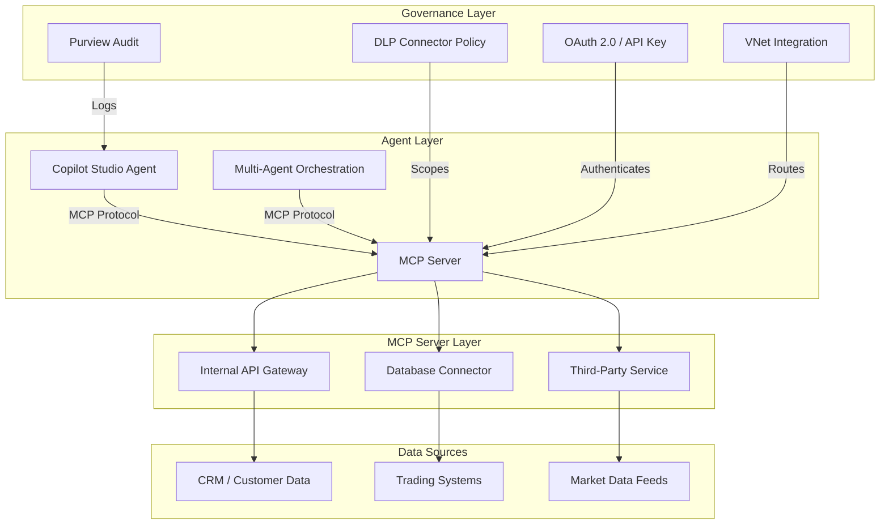
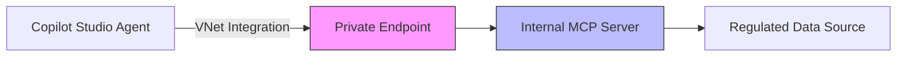

# MCP Server Governance for FSI

**Last Updated:** March 2026
**Version:** v1.6.2

---

## Overview

The **Model Context Protocol (MCP)** is an open standard that enables Microsoft Copilot Studio agents to connect to external data sources and tools through custom MCP servers. In Copilot Studio, organizations can create new MCP servers or connect agents to existing ones, allowing agents to retrieve real-time data from internal APIs, databases, and third-party services.

MCP servers surface as **custom connectors** within the Power Platform connector framework. This means they inherit the same DLP policy controls, environment scoping, and governance mechanisms that apply to any Power Platform connector — but they also introduce new risks specific to regulated environments.

!!! warning "Preview Feature — Custom MCP Servers"
    Custom MCP Servers in Copilot Studio are in **Preview** as of April 2026, with general availability planned for **October 2026**. Configuration options, authentication flows, and administrative controls may change before GA. Organizations should verify current capabilities against [Microsoft Learn documentation](https://learn.microsoft.com/en-us/microsoft-copilot-studio/mcp-create-new-server) before production deployment.

This playbook provides FSI-specific governance guidance for MCP server integration, covering DLP connector policy scoping, authentication governance, network isolation, and audit requirements.

---

## Three flavors of MCP

MCP governance depends on which MCP path is in use. FSI teams should identify the hosting model, administrative surface, and covered controls before approving an agent design because the same protocol can enter through different Microsoft governance surfaces.

**Copilot Studio custom MCP** uses customer- or vendor-hosted MCP servers wired into Copilot Studio agents as custom connectors. The server is hosted outside Microsoft by the customer or vendor, while governance is applied through Power Platform connector governance, DLP and Advanced Connector Policies, environment scope, and Copilot Studio publish review; see Controls 1.4, 1.5, 2.17, and 2.25.

**Microsoft-published MCP servers** are first-party MCP servers shipped and maintained by Microsoft, such as the Microsoft 365 connector MCP. Microsoft hosts and publishes the server, while the tenant governs availability through Microsoft 365 admin center and Agent 365 inventory, app and connector approvals, audit, and reporting surfaces; see Controls 1.2, 1.7, 2.25, 3.13, and 3.14.

**Agent 365 Bring Your Own MCP server (BYO MCP)** covers customer-hosted remote MCP servers registered to Agent 365 through the BYO MCP onboarding surface. The customer hosts and operates the remote MCP server, while Agent 365 registration, Microsoft 365 admin center approval, the Agent 365 Tooling Gateway, Entra permission review, and Defender advanced hunting provide the governance and observability surface; see Controls 1.7, 2.17, 2.25, 2.26, 3.13, and 3.14. Implementation requires verifying current preview capabilities and client-surface support before production use.

---

## FSI Risk Assessment

MCP server integration introduces governance considerations that require attention in regulated financial services environments:

### Data Exfiltration Risk

MCP servers can expose internal APIs, trading systems, customer databases, and other regulated data sources to AI agents. Without proper governance:

- Agents may access data beyond their intended scope
- Sensitive customer information (PII, account data, trading records) could flow through unmanaged channels
- Data may traverse network boundaries in ways that conflict with information barrier requirements

### Unmanaged Connection Proliferation

Without connector governance, business users could create MCP servers that connect to:

- Internal CRM and customer management systems
- Market data feeds subject to exchange licensing agreements
- Trade execution platforms subject to FINRA supervision
- Document repositories containing material non-public information (MNPI)

### Regulatory Implications

| Regulatory Driver | MCP Governance Requirement |
|-------------------|----------------------------|
| **FINRA 3110** | Supervision of agent access to customer-facing data sources |
| **FINRA 4511** | Recordkeeping for agent-to-MCP-server interactions |
| **SEC 17a-4** | Retention of communications routed through MCP servers |
| **GLBA 501(b)** | Safeguards for customer data accessed via MCP connections |
| **OCC Bulletin 2026-13 (formerly OCC 2011-12)** | Model risk assessment for agents using external data sources |
| **SOX 302/404** | Internal controls over financial data accessed by agents |

!!! note "Implementation Caveat"
    Organizations should conduct their own risk assessment specific to the data sources exposed through MCP servers. The regulatory implications above are illustrative — actual requirements depend on the data types, business processes, and jurisdictions involved. Legal and compliance counsel should review MCP deployment plans before production use.

---

## Architecture Overview



---

## DLP Connector Policy Scoping

MCP servers appear as custom connectors in the Power Platform environment. This means they fall under **Advanced Connector Policies (ACP)** and **DLP policy enforcement** — the same mechanisms used for all Power Platform connectors.

### Connector Classification

When an MCP server is registered, classify it within your DLP connector policy:

| Classification | When to Use | Example |
|----------------|-------------|---------|
| **Business** | Approved for use with business data in governed environments | Internal knowledge base MCP server |
| **Non-Business** | Approved for non-sensitive use cases only | Public market data feed (read-only) |
| **Blocked** | Not approved for any use | Unapproved third-party MCP servers |

### Environment-Level Policy Configuration

Apply DLP connector policies at the environment level per [Control 1.4 — Advanced Connector Policies](../../../controls/pillar-1-security/1.4-advanced-connector-policies-acp.md):

```powershell
# Example: Block unapproved MCP custom connectors in a Zone 3 environment
# Retrieve the environment-level DLP policy
$policy = Get-DlpPolicy -PolicyName "Zone3-Production-DLP"

# Add MCP custom connector to the blocked group
# Note: MCP connectors appear as custom connectors with a
# connector ID matching the MCP server registration
Add-CustomConnectorToPolicy `
    -PolicyName "Zone3-Production-DLP" `
    -ConnectorId "/providers/Microsoft.PowerApps/apis/shared_mcp-<server-id>" `
    -GroupName "Blocked"
```

!!! tip "Recommended Approach"
    Block all custom connectors by default and explicitly allowlist approved MCP servers. This prevents unauthorized MCP servers from being used in governed environments.

### Policy Scoping by Zone

- **Zone 2 (Team):** Allow only MCP servers that have completed security review and are classified as "Business" connectors
- **Zone 3 (Enterprise):** Allow only MCP servers that have completed full governance review, penetration testing, and data classification assessment

See [Control 1.5 — DLP and Sensitivity Labels](../../../controls/pillar-1-security/1.5-data-loss-prevention-dlp-and-sensitivity-labels.md) for detailed DLP policy configuration guidance.

---

## Authentication Governance

MCP servers in Copilot Studio support **OAuth 2.0** and **API key** authentication. Authentication method selection has significant governance implications for FSI organizations.

### OAuth 2.0 (Recommended for Production)

OAuth 2.0 is the recommended authentication method for Zone 2 and Zone 3 MCP server deployments:

| Capability | FSI Benefit |
|------------|-------------|
| Token refresh | Reduces credential exposure window |
| Scope limitation | Restricts agent access to specific API operations |
| Consent framework | Supports delegated permission models |
| Token expiration | Limits blast radius of credential compromise |
| Audit trail | Token issuance and refresh events are logged in Entra ID |

**Configuration considerations:**

1. Register MCP server as an **Entra ID application** for centralized identity management
2. Define **granular OAuth scopes** that align with the agent's intended data access
3. Use **delegated permissions** where possible (agent acts on behalf of the user)
4. Set **token lifetime policies** appropriate for the data sensitivity level
5. Enable **Conditional Access policies** for the MCP server's app registration per [Control 1.11](../../../controls/pillar-1-security/1.11-conditional-access-and-phishing-resistant-mfa.md)

### API Key Authentication

API keys are acceptable for internal development and Zone 1 (Personal Productivity) scenarios only:

| Consideration | Guidance |
|---------------|----------|
| Rotation frequency | Rotate per organizational policy (recommended: 90 days or fewer) |
| Storage | Store in Azure Key Vault — never embed in agent configuration |
| Scope | API keys typically grant broad access — compensate with network controls |
| Audit | API key usage is harder to attribute to specific users |

```powershell
# Store MCP server API key in Azure Key Vault
$secretValue = ConvertTo-SecureString "<api-key-value>" -AsPlainText -Force
Set-AzKeyVaultSecret `
    -VaultName "kv-agent-governance" `
    -Name "MCP-Server-APIKey-<server-name>" `
    -SecretValue $secretValue `
    -Expires (Get-Date).AddDays(90) `
    -Tag @{
        Purpose = "MCP Server Authentication"
        Owner   = "agent-governance-team"
        Zone    = "Zone1"
    }
```

### Authentication Decision Matrix

| Factor | OAuth 2.0 | API Key |
|--------|-----------|---------|
| Zone 1 (Personal) | Recommended | Acceptable |
| Zone 2 (Team) | Required | Not recommended |
| Zone 3 (Enterprise) | Required | Not permitted |
| Accesses customer PII | Required | Not permitted |
| Accesses trading data | Required | Not permitted |
| Internal dev/test only | Recommended | Acceptable |

---

## VNet Integration

For Zone 3 (Enterprise) deployments handling regulated data, MCP server traffic should be routed through Azure Virtual Network (VNet) integration per [Control 1.20 — Network Isolation and Private Connectivity](../../../controls/pillar-1-security/1.20-network-isolation-private-connectivity.md).

### Private Endpoint Configuration

Internal MCP servers that expose regulated data sources should be accessible only through private endpoints:



### Network Governance Requirements

| Requirement | Description |
|-------------|-------------|
| **Private DNS** | Configure private DNS zones for MCP server endpoints |
| **NSG rules** | Restrict inbound access to MCP servers from Copilot Studio VNet subnets only |
| **Traffic logging** | Enable NSG flow logs for MCP server traffic — aids in FINRA 4511 recordkeeping |
| **No public endpoints** | Zone 3 MCP servers should not expose public endpoints |
| **Egress controls** | Restrict MCP server outbound traffic to approved destinations only |

!!! note "Implementation Caveat"
    VNet integration for Copilot Studio is subject to Power Platform VNet support capabilities. Organizations should verify current VNet integration options with Microsoft documentation before designing network architectures. Capabilities may evolve between Preview and GA.

---

## Audit and Compliance

MCP server interactions generate audit events that support FSI recordkeeping requirements. Organizations should configure audit capture to help meet regulatory retention obligations.

### Telemetry Capture

MCP server call events are captured through Copilot Studio agent telemetry:

| Audit Signal | Description | Regulatory Mapping |
|-------------|-------------|-------------------|
| MCP server invocation | Agent called an MCP server | FINRA 4511 — business records |
| Data source accessed | Which data source the MCP server queried | SEC 17a-4 — communication records |
| Authentication event | OAuth token issuance or API key usage | GLBA 501(b) — access safeguards |
| DLP policy evaluation | Connector policy enforcement result | SOX 404 — internal controls |
| Error / failure event | MCP server call failures | OCC Bulletin 2026-13 (formerly OCC 2011-12) — model performance |

### Purview Integration

Configure Microsoft Purview to capture and retain MCP-related audit events:

1. **Unified Audit Log (UAL):** MCP server invocations appear as Copilot Studio activity events in the UAL
2. **Retention policies:** Apply retention policies per [Control 1.9](../../../controls/pillar-1-security/1.9-data-retention-and-deletion-policies.md) to meet regulatory minimums
3. **eDiscovery:** MCP interaction records should be searchable via eDiscovery per [Control 1.19](../../../controls/pillar-1-security/1.19-ediscovery-for-agent-interactions.md)

### Retention Requirements

| Regulation | Minimum Retention | Recommended |
|------------|-------------------|-------------|
| FINRA 4511 | 6 years | 7 years |
| SEC 17a-4 | 6 years | 7 years |
| SOX 404 | 7 years | 7 years |
| GLBA | 5 years | 7 years |

!!! warning "Recordkeeping Responsibility"
    MCP server governance aids in meeting recordkeeping obligations but does not by itself satisfy regulatory requirements. Organizations should verify that their end-to-end audit architecture — including MCP server logs, agent telemetry, and Purview retention — collectively supports compliance with applicable regulations. Legal and compliance teams should validate the completeness of the audit trail.

---

## Zone-Specific Guidance

| Governance Requirement | Zone 1 (Personal) | Zone 2 (Team) | Zone 3 (Enterprise) |
|------------------------|-------------------|---------------|---------------------|
| **MCP server approval** | Self-service with guardrails | Security review required | Full governance review + pen test |
| **DLP connector policy** | Tenant-level default | Environment-level policy | Environment-level + custom blocking |
| **Authentication** | OAuth 2.0 recommended; API key acceptable | OAuth 2.0 required | OAuth 2.0 required |
| **Credential storage** | Key Vault recommended | Key Vault required | Key Vault required + rotation policy |
| **VNet integration** | Not required | Recommended for sensitive data | Required |
| **Private endpoints** | Not required | Not required | Required for internal MCP servers |
| **Audit retention** | 30 days (default) | 90 days minimum | 7+ years (regulatory minimum) |
| **Data classification** | Not required | Recommended | Required before MCP server approval |
| **Monitoring** | Basic telemetry | Application Insights recommended | Application Insights + Sentinel required |
| **Multi-agent access** | N/A | Scoped per orchestration | Scoped + monitored per Control 2.17 |

---

## Roles and Responsibilities

| Role | MCP Governance Responsibility |
|------|-------------------------------|
| **Power Platform Admin** | Manage DLP connector policies, approve MCP server registrations, configure environment-level controls |
| **Entra App Admin** | Manage MCP server app registrations, configure OAuth scopes and consent |
| **Purview Compliance Admin** | Configure audit retention, review MCP interaction records |
| **Entra Security Admin** | Monitor MCP server security events, configure Conditional Access for MCP apps |
| **AI Administrator** | Govern Copilot Studio agent-to-MCP bindings, manage agent feature access |
| **Agent Sponsor** | Justify business need for MCP server connections, accept risk for data access |

---

## Related Controls

| Control | Integration Point |
|---------|-------------------|
| [1.4 — Advanced Connector Policies (ACP)](../../../controls/pillar-1-security/1.4-advanced-connector-policies-acp.md) | MCP connectors governed by ACP classification |
| [1.5 — DLP and Sensitivity Labels](../../../controls/pillar-1-security/1.5-data-loss-prevention-dlp-and-sensitivity-labels.md) | DLP enforcement for MCP data flows |
| [1.7 — Comprehensive Audit Logging](../../../controls/pillar-1-security/1.7-comprehensive-audit-logging-and-compliance.md) | Audit capture for MCP server invocations |
| [1.9 — Data Retention and Deletion](../../../controls/pillar-1-security/1.9-data-retention-and-deletion-policies.md) | Retention policies for MCP interaction records |
| [1.11 — Conditional Access and MFA](../../../controls/pillar-1-security/1.11-conditional-access-and-phishing-resistant-mfa.md) | Conditional Access for MCP server app registrations |
| [1.19 — eDiscovery for Agent Interactions](../../../controls/pillar-1-security/1.19-ediscovery-for-agent-interactions.md) | eDiscovery coverage for MCP interaction records |
| [1.20 — Network Isolation and Private Connectivity](../../../controls/pillar-1-security/1.20-network-isolation-private-connectivity.md) | VNet/private endpoint for MCP servers |
| [1.29 — Global Secure Access: Network Controls](../../../controls/pillar-1-security/1.29-global-secure-access-network-controls.md#secure-web-and-ai-gateway-for-copilot-studio-agents) | Outbound network governance for MCP connector traffic — see the Secure Web and AI Gateway subsection for prompt-injection defense, supported MCP traffic controls, and tenant restrictions |
| [2.3 — Change Management and Release Planning](../../../controls/pillar-2-management/2.3-change-management-and-release-planning.md) | Change governance for MCP server deployments |
| [2.7 — Vendor and Third-Party Risk](../../../controls/pillar-2-management/2.7-vendor-and-third-party-risk-management.md) | Third-party MCP server risk assessment |
| [2.17 — Multi-Agent Orchestration Limits](../../../controls/pillar-2-management/2.17-multi-agent-orchestration-limits.md) | Orchestration controls when multiple agents share MCP servers |

---

## Verification Checklist

1. ☐ MCP server inventory documented with data classification for each connected data source
2. ☐ DLP connector policies classify all MCP custom connectors (Business / Non-Business / Blocked)
3. ☐ Unapproved MCP connectors blocked by default in Zone 2 and Zone 3 environments
4. ☐ OAuth 2.0 configured for all Zone 2 and Zone 3 MCP servers
5. ☐ API keys (if used) stored in Azure Key Vault with expiration and rotation policy
6. ☐ VNet integration configured for Zone 3 MCP servers accessing regulated data
7. ☐ Private endpoints configured for internal MCP servers in Zone 3
8. ☐ Purview audit retention policies applied to MCP interaction records
9. ☐ Conditional Access policies applied to MCP server app registrations
10. ☐ Agent sponsor sign-off documented for each MCP server connection
11. ☐ Data classification assessment completed for all MCP-accessible data sources
12. ☐ Monitoring and alerting configured for MCP server error rates and unusual access patterns

---

## Additional Resources

- [Microsoft Learn: Create a New MCP Server in Copilot Studio](https://learn.microsoft.com/en-us/microsoft-copilot-studio/mcp-create-new-server)
- [Microsoft Learn: Bring Your Own MCP server (BYO MCP)](https://learn.microsoft.com/microsoft-agent-365/bring-your-own-mcp)
- [Microsoft Learn: Copilot Studio Planned Features (2026 Wave 1)](https://learn.microsoft.com/en-us/power-platform/release-plan/2026wave1/microsoft-copilot-studio/planned-features)
- [Microsoft Learn: Power Platform DLP Policies](https://learn.microsoft.com/en-us/power-platform/admin/wp-data-loss-prevention)
- [Microsoft Learn: Azure Key Vault Overview](https://learn.microsoft.com/en-us/azure/key-vault/general/overview)
- [Microsoft Learn: Power Platform VNet Support](https://learn.microsoft.com/en-us/power-platform/admin/vnet-support-overview)

---

*Updated: May 2026 | Version: v1.6.2 | UI Verification Status: Current*
