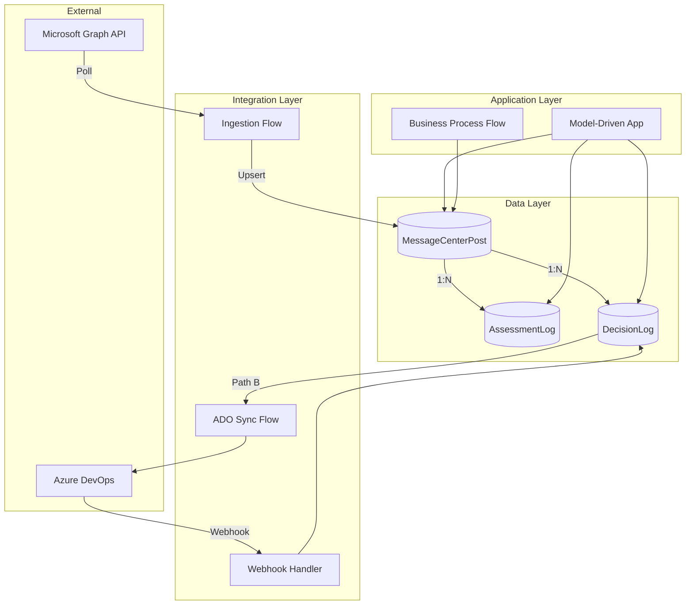
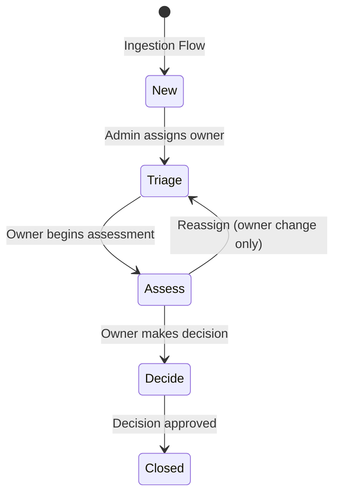

# Platform Change Governance - Architecture

**Status:** January 2026 - FSI-AgentGov v1.2
**Related Controls:** 2.3 (Change Management), 2.10 (Patch Management), 2.13 (Documentation)

---

## Overview

This document defines the canonical reference architecture for Platform Change Governance, including Dataverse schema, security model, and integration patterns.

---

## Core Architectural Constraints

| Constraint | Description | Implication |
|------------|-------------|-------------|
| **No Native Triggers** | Microsoft Graph API does not provide Message Center event triggers | Polling via Power Automate (15-30 min intervals) |
| **Dataverse as SOR** | All governance decisions must be in Dataverse | ADO is downstream execution, not governance record |
| **Immutable Decisions** | DecisionLog records cannot be modified after creation | Corrections require new records with reference to original |
| **Forward-Only State** | Workflow state transitions are forward-only | No backward transitions (audit integrity) |

---

## Component Overview

---

## Data Layer: Dataverse Tables

### Table 1: MessageCenterPost (Primary Governance Table)

The primary table storing all Message Center posts with governance workflow state.

| Field Name | Data Type | Description | Source API Field |
|------------|-----------|-------------|------------------|
| `mc_messagecenterid` | Text (PK, 50 char) | Official MC ID (e.g., MC123456) | `id` |
| `mc_title` | Text (500 char) | Post title | `title` |
| `mc_category` | Choice | preventOrFixIssue / planForChange / stayInformed | `category` |
| `mc_severity` | Choice | normal / high / critical | `severity` |
| `mc_services` | Multi-line text | Affected services (JSON array) | `services` |
| `mc_tags` | Multi-line text | Tags (JSON array) | `tags` |
| `mc_startdatetime` | DateTime | Post start date | `startDateTime` |
| `mc_enddatetime` | DateTime | Post end date | `endDateTime` |
| `mc_actionrequiredby` | DateTime | Deadline for action | `actionRequiredByDateTime` |
| `mc_body` | Multi-line (rich text) | Full HTML content | `body.content` |
| `mc_state` | Choice | New / Triage / Assess / Decide / Closed | Workflow-driven |
| `mc_impactassessment` | Choice | None / Low / Medium / High | User-entered |
| `mc_relevance` | Choice | Not Applicable / Informational / Action Required | User-entered |
| `mc_decision` | Choice | Accept / Defer / Escalate / No Action Required | User-entered |
| `mc_decisionrationale` | Multi-line text | Required when State = Decide | User-entered |
| `mc_owner` | Lookup (User) | Assigned administrator | Manual/auto-routing |
| `mc_lastmodifieddatetime` | DateTime | Last modified in Message Center | `lastModifiedDateTime` |

**Table Settings:**

- **Ownership:** User-owned (enables row-level security)
- **Auditing:** Full auditing enabled (all fields, all operations)
- **Primary Key:** `mc_messagecenterid` (upsert key for idempotent ingestion)

### Table 2: AssessmentLog (1:N from MessageCenterPost)

Tracks all assessment activities for a Message Center post. Multiple assessments may occur if initial assessment requires revision.

| Field Name | Data Type | Description |
|------------|-----------|-------------|
| `al_assessmentid` | GUID (PK) | Unique identifier |
| `al_messagecenterpost` | Lookup | Parent post (Restrict Delete) |
| `al_assessedby` | Lookup (User) | User who assessed |
| `al_assessedon` | DateTime | Assessment timestamp |
| `al_impactassessment` | Choice | None / Low / Medium / High |
| `al_notes` | Multi-line text | Detailed assessment notes |
| `al_recommendedaction` | Choice | Implement / Defer / Dismiss / Escalate |
| `al_affectedsystems` | Multi-line text | Affected systems (comma-separated) |

**Table Settings:**

- **Ownership:** User-owned
- **Auditing:** Enabled
- **Relationship:** Restrict delete (cannot delete post with assessments)

### Table 3: DecisionLog (1:N from MessageCenterPost)

Immutable record of governance decisions. Organization-owned to prevent user modification.

| Field Name | Data Type | Description |
|------------|-----------|-------------|
| `dl_decisionid` | GUID (PK) | Unique identifier |
| `dl_messagecenterpost` | Lookup | Parent post (Restrict Delete) |
| `dl_decidedby` | Lookup (User) | User who decided |
| `dl_decidedon` | DateTime | Decision timestamp |
| `dl_decision` | Choice | Accept / Defer / Escalate / No Action Required |
| `dl_decisionrationale` | Multi-line text | Required (min 50 characters) |
| `dl_externalticketreference` | Text (200 char) | Optional external reference |
| `dl_ado_workitem_id` | Whole Number | Azure DevOps work item ID (Path B) |
| `dl_ado_workitem_url` | URL | Link to ADO work item (Path B) |
| `dl_ado_state` | Text (100 char) | ADO state synced back (Path B) |
| `dl_ado_lastmodified` | DateTime | Last ADO sync timestamp (Path B) |

**Table Settings:**

- **Ownership:** Organization-owned (read-only after creation)
- **Auditing:** Enabled
- **Relationship:** Restrict delete
- **Business Rule:** DecisionRationale minimum 50 characters

### Optional Tables

**AssignmentQueue:** Predefined routing queues for automated assignment.

| Field | Type | Description |
|-------|------|-------------|
| `aq_queuename` | Text | Queue name (e.g., "Exchange Team") |
| `aq_defaultowner` | Lookup (User) | Default assignee |
| `aq_routingcriteria` | Multi-line | JSON criteria for auto-routing |

**ExclusionRule:** Alert fatigue mitigation rules.

| Field | Type | Description |
|-------|------|-------------|
| `er_rulename` | Text | Rule name |
| `er_exclusioncriteria` | Multi-line | JSON criteria for auto-closure |
| `er_isactive` | Boolean | Rule active flag |

---

## Workflow State Machine

| State | Description | Required Actions | Evidence Captured | Who Can Transition |
|-------|-------------|------------------|-------------------|-------------------|
| **New** | Post ingested, awaiting triage | None (system-created) | Ingestion timestamp | System (Power Automate) |
| **Triage** | Assigned to queue/individual | Owner assigned | Assignment notification sent | Admin Triage role |
| **Assess** | Evaluating impact and relevance | ImpactAssessment, Relevance populated | AssessmentLog entry created | Assigned Owner |
| **Decide** | Final decision made | Decision + DecisionRationale required | DecisionLog entry (immutable) | Owner (Accept/Defer/No Action); Approver (Escalate) |
| **Closed** | Workflow complete, archived | Decision finalized | DecisionLog finalized | Owner or Approver |

**State Transition Rules:**

- Forward-only: No backward transitions allowed (maintains audit integrity)
- Corrections: Create new AssessmentLog or DecisionLog entry; original remains immutable
- Escalation: Only Compliance Reviewer can approve escalated decisions

---

## Security Model

### Security Roles

| Role Name | Persona | Read Scope | Write Scope | Key Privileges |
|-----------|---------|------------|-------------|----------------|
| **MC Admin** | Admin Triage | Organization (all posts) | Organization | Assign Owner, Update State (New → Triage) |
| **MC Owner** | Workstream Owner | User (only assigned posts) | User (only owned) | Create AssessmentLog/DecisionLog, Update State |
| **MC Compliance Reviewer** | Compliance | Organization (read-only) | ApprovedBy field only | Approve escalated decisions, Export DecisionLog |
| **MC Auditor** | Internal/External Auditor | Organization (read-only all) | None | Read all tables, access Dataverse audit logs |

### Segregation of Duties

- Users cannot approve their own escalated decisions (enforced via `ApprovedBy ≠ DecidedBy` validation)
- MC Admin cannot make decisions on posts (can only assign and triage)
- MC Auditor has read-only access across all data

### Field-Level Security

| Field | MC Admin | MC Owner | MC Compliance | MC Auditor |
|-------|----------|----------|---------------|------------|
| `mc_owner` | Read/Write | Read | Read | Read |
| `mc_state` | Read/Write (New→Triage) | Read/Write (Triage→Closed) | Read/Write (Escalated) | Read |
| `mc_decisionrationale` | Read | Read/Write | Read/Write | Read |
| `dl_ado_workitem_id` | Read | Read/Write | Read | Read |

---

## Integration Layer

### Flow 1: Message Center Ingestion

**Trigger:** Recurrence (every 15-30 minutes)

**Actions:**

1. **HTTP - Get Access Token**
   - Method: POST
   - URI: `https://login.microsoftonline.com/{tenantId}/oauth2/v2.0/token`
   - Body: `grant_type=client_credentials&client_id={clientId}&client_secret={secret}&scope=https://graph.microsoft.com/.default`

2. **Parse JSON - Extract Access Token**

3. **HTTP - Get Message Center Posts**
   - Method: GET
   - URI: `https://graph.microsoft.com/v1.0/admin/serviceAnnouncement/messages`
   - Headers: `Authorization: Bearer {token}`
   - Query: `$filter=lastModifiedDateTime gt {LastRunTimestamp}&$orderby=lastModifiedDateTime asc`

4. **Apply to Each - Upsert Message Center Posts**
   - Upsert to MessageCenterPost table using `mc_messagecenterid` as alternate key

**Permission Required:** `ServiceMessage.Read.All` (application permission, admin consent required)

### Flow 2: Dataverse → ADO Work Item Creation (Path B)

**Trigger:** When DecisionLog row is created with `dl_decision = Accept` and `dl_ado_workitem_id` is null

**Actions:**

1. **Idempotency Check** - Verify `dl_ado_workitem_id` is null (prevent duplicates)
2. **Azure DevOps - Create Work Item**
   - Work Item Type: User Story
   - Title: From `mc_title`
   - Tags: `MC:{mc_messagecenterid}`
3. **Update DecisionLog** with `dl_ado_workitem_id`, `dl_ado_workitem_url`, `dl_ado_state`

### Flow 3: ADO → Dataverse Webhook (Path B)

**Trigger:** HTTP request (Azure DevOps service hook)

**Actions:**

1. **Parse JSON** - Extract workItemId, state, changedDate
2. **Query DecisionLog** - Find record by `dl_ado_workitem_id`
3. **Update DecisionLog** - Set `dl_ado_state`, `dl_ado_lastmodified`
4. **Return HTTP 200**

---

## Model-Driven App Blueprint

### Views

| View Name | Filter | Purpose |
|-----------|--------|---------|
| New Posts by Category | `mc_state = New` | Admin triage queue |
| High-Severity Posts | `mc_severity = high OR critical` | Priority attention |
| My Assigned Posts | `mc_owner = currentuser` | Owner workload |
| Posts by Service | Group by `mc_services` | Service team filtering |
| Escalated Awaiting Approval | `mc_decision = Escalate AND NOT approved` | Compliance review |

### Dashboard: Message Center Governance Overview

| Tile | Visualization | Data |
|------|---------------|------|
| Posts by State | Stacked bar chart | Count grouped by `mc_state` |
| Posts by Category | Pie chart | Count grouped by `mc_category` |
| High-Severity Action Required | Filtered list | `mc_severity IN (high, critical) AND mc_state != Closed` |
| Closed This Month | KPI | Count where `mc_state = Closed` AND closed this month |
| Avg Time to Decision | KPI | Average (DecisionDate - CreatedOn) |

### Form Layout

**Main Form Tabs:**

1. **Overview** - Title, Category, Severity, Services, State
2. **Content** - Full message body (rich text)
3. **Assessment** - ImpactAssessment, Relevance, AffectedSystems, AssessmentLog subgrid
4. **Decision** - Decision, DecisionRationale, DecisionLog subgrid
5. **ADO Integration** (Path B) - ADO Work Item ID, URL, State
6. **Audit Trail** - Timeline control showing all activities

---

## Evidence Retention Requirements

| Evidence Type | Artifact | Retention Period | Storage Location |
|---------------|----------|------------------|------------------|
| Governance Decisions | DecisionLog table records | 6 years (FINRA 4511) | Dataverse (3 years), SharePoint archive (additional 3) |
| Audit Trail | Dataverse audit logs | 3 years readily accessible + 3 archived (SEC 17a-3/4) | Dataverse → quarterly export to SharePoint |
| Execution Evidence (Path B) | Azure DevOps work item history | Per Azure DevOps retention policy | Azure DevOps (linked via `dl_ado_workitem_url`) |
| Integration Logs | Power Automate flow run history | 28 days (Power Automate default) | Power Automate portal + optional export |

---

## Known Limitations

| Item | Status | Implication |
|------|--------|-------------|
| Native Message Center Event Triggers | Not available | Polling via Graph API required |
| Idempotency Keys for ADO API | Not documented | Custom idempotency logic required |
| Documented ADO ↔ Dataverse Template | Not available | Integration is custom implementation |
| ADO Service Hook Retry Guarantees | Partial docs | Production needs reconciliation jobs |
| Fabric → Message Center Connector | Not available | Custom pipeline required if using Fabric |

---

## Related Documents

| Document | Relationship |
|----------|-------------|
| [Overview](index.md) | Playbook introduction and path selection |
| [Path A Implementation](implementation-path-a.md) | Dataverse-only implementation |
| [Path B Implementation](implementation-path-b.md) | Azure DevOps integration |
| [Labs](labs.md) | Hands-on implementation exercises |
| [Evidence and Audit](evidence-and-audit.md) | Compliance evidence mapping |

---

*FSI Agent Governance Framework v1.2 - January 2026*
