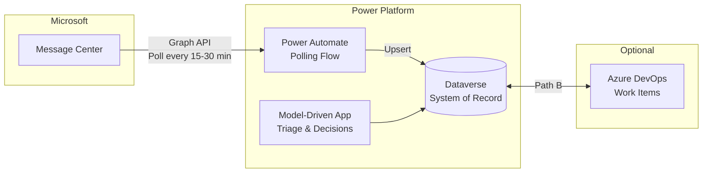

# Platform Change Governance

**Status:** January 2026 - FSI-AgentGov v1.2
**Related Controls:** 2.3 (Change Management), 2.10 (Patch Management), 2.13 (Documentation)

---

## Purpose

This playbook provides canonical reference architecture for operationalizing Microsoft 365 Message Center changes in regulated financial services environments. Organizations receive 100+ Message Center posts monthly, creating alert fatigue while regulatory requirements (FINRA 4511, SEC 17a-3/4, SOX 302/404) mandate documented change management with audit trails.

**Applies to:** Zone 2/3 environments; recommended for any organization managing Microsoft platform changes under regulatory oversight.

---

## Problem Statement

Financial services organizations face a compliance gap between:

1. **Volume:** 100+ Microsoft 365 Message Center posts per month across Power Platform, Microsoft 365, and related services
2. **Regulatory Requirements:** FINRA 4511 and SEC 17a-4 require documented decision rationale for system changes
3. **Current Tooling:** Message Center provides notifications but no governance workflow, decision logging, or audit trail

**Result:** Platform administrators either over-react (treating all changes as critical) or under-react (missing important updates), with no documented evidence of decision-making for regulatory examination.

---

## Solution Overview

Dataverse serves as the **governance system-of-record** for all Message Center change decisions, providing:

- Structured triage, assessment, and decision workflows
- Immutable audit trail via Dataverse change tracking
- Role-based access with segregation of duties
- Optional bi-directional sync with Azure DevOps for engineering teams

---

## Path Selection Decision Framework

Two implementation paths address different organizational needs:

| Criterion | Path A (Dataverse Only) | Path B (Dataverse + ADO) |
|-----------|-------------------------|--------------------------|
| **Primary Use Case** | Simple task tracking, governance | Complex engineering work items, sprint planning |
| **Team Maturity** | Business users, product managers | Engineering teams with DevOps practices |
| **Work Item Complexity** | Flat task lists | Hierarchical backlogs (Epic → Feature → User Story) |
| **Integration with Source Code** | Not required | Tightly coupled with Git repos, pull requests, CI/CD |
| **Training Investment** | Minimal | Significant; requires ADO training |
| **Audit Trail** | Basic governance logs | Detailed work item history, field changes, relation tracking |
| **Recommended For** | Most FSI organizations | Large IT organizations with existing ADO investment |

!!! tip "Start with Path A"
    Most organizations should implement Path A first. Path B can be added later if Azure DevOps integration becomes necessary. Path A provides complete regulatory compliance without the additional complexity of bi-directional sync.

---

## Critical Design Principles

### Dataverse as System-of-Record

All governance decisions **must** be recorded in Dataverse, not Azure DevOps:

- **Audit Integrity:** Dataverse change tracking provides immutable audit trail
- **Regulatory Access:** Compliance officers access Dataverse directly without ADO licenses
- **Data Residency:** Dataverse data residency aligns with Microsoft 365 tenant
- **Retention Control:** Dataverse supports Microsoft Purview retention policies

Azure DevOps (Path B) serves as a **downstream execution system**, not the governance record.

### Constraint: Polling Required

!!! warning "No Native Message Center Event Triggers"
    Microsoft Graph API does not provide webhook/event triggers for Message Center posts. Polling via scheduled Power Automate flow is the only supported integration pattern.

**Safe Polling Interval:** 15-30 minutes balances timeliness with Graph API throttling risk.

---

## Regulatory Alignment

| Regulation | Requirement | How This Solution Helps |
|------------|-------------|------------------------|
| **FINRA 4511** | Records of business activities (6+ years) | DecisionLog table with immutable records, Dataverse auditing |
| **SEC 17a-4** | Records preservation (WORM or audit-trail alternative) | Dataverse change tracking, quarterly export to compliant storage |
| **SOX 302/404** | Internal control assessment and certification | Documented approval workflows, segregation of duties |
| **GLBA 501(b)** | Administrative safeguards for customer information | Controlled change process protects customer-impacting systems |

---

## Framework Integration

This playbook supports three framework controls:

| Control | How Platform Change Governance Supports |
|---------|----------------------------------------|
| [2.3 - Change Management](../../../controls/pillar-2-management/2.3-change-management-and-release-planning.md) | Extends ALM pipelines with Microsoft-initiated change tracking |
| [2.10 - Patch Management](../../../controls/pillar-2-management/2.10-patch-management-and-system-updates.md) | Operationalizes Message Center monitoring with structured workflow |
| [2.13 - Documentation](../../../controls/pillar-2-management/2.13-documentation-and-record-keeping.md) | Provides governance records meeting SEC 17a-4 requirements |

---

## Implementation Kit

The FSI-AgentGov-Solutions repository provides deployable Power Platform components:

| Component | Description |
|-----------|-------------|
| **Dataverse Solution** | Tables, columns, security roles, views |
| **Power Automate Flows** | Message Center ingestion, ADO sync (Path B) |
| **Model-Driven App** | Triage, assessment, decision interface |
| **Environment Variables** | Configuration for tenant-specific values |

**Repository:** [FSI-AgentGov-Solutions](https://github.com/judeper/FSI-AgentGov-Solutions) (separate repository for deployable solutions)

---

## Playbook Structure

| Document | Purpose |
|----------|---------|
| [Architecture](architecture.md) | Canonical reference architecture, Dataverse schema, security model |
| [Path A: Dataverse Only](implementation-path-a.md) | Step-by-step implementation for baseline governance |
| [Path B: Dataverse + ADO](implementation-path-b.md) | Azure DevOps integration for engineering teams |
| [Labs](labs.md) | Hands-on exercises (Labs 1-3) |
| [Evidence and Audit](evidence-and-audit.md) | Evidence standards mapping, retention requirements |

---

## Prerequisites

### All Paths

- Power Platform environment (Developer, Sandbox, or Production)
- Microsoft 365 E3/E5 licenses
- Azure AD app registration with `ServiceMessage.Read.All` permission
- Power Platform Admin or Dataverse System Admin role

### Path B Additional

- Azure DevOps organization with Project Administrator access
- Understanding of Azure DevOps work items and service hooks

---

## Getting Started

1. **Read [Architecture](architecture.md)** to understand the data model and security requirements
2. **Complete [Lab 1](labs.md#lab-1-message-center-ingestion)** to build the ingestion pipeline
3. **Implement [Path A](implementation-path-a.md)** for baseline governance
4. **Optionally implement [Path B](implementation-path-b.md)** if Azure DevOps integration is required
5. **Configure evidence collection** per [Evidence and Audit](evidence-and-audit.md)

---

*FSI Agent Governance Framework v1.2 - January 2026*
