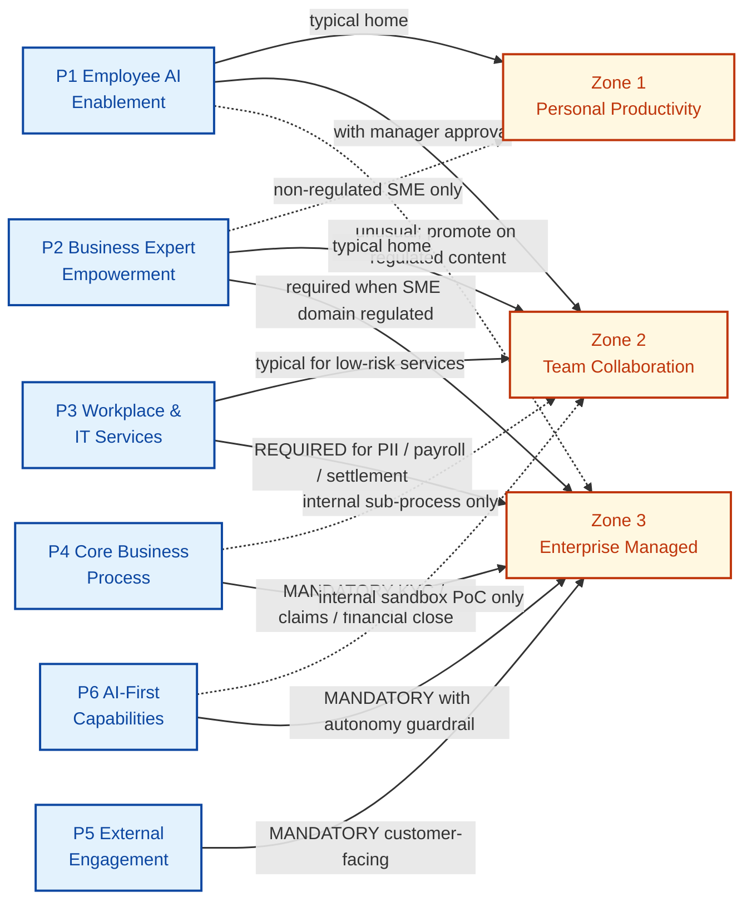

<!-- verify-language-rules: allow-second-tier  reason: "Canonical CAPE crosswalk and FSI Maturity Translation Table — verbatim CAPE Level 500 descriptors and reframings appear here by design as the single source of truth for reframing elsewhere." -->

# Microsoft CAPE × FSI-AgentGov Crosswalk

> **Audience:** AI Governance Lead, Chief Compliance Officer, AI Program Sponsor / CIO, Microsoft FSI Customer Success Architects (CSAs).
> **Purpose:** Map Microsoft's Copilot Acceleration Engineering (CAPE) Frontier Transformation Patterns and Agentic AI Maturity Model to the FSI-AgentGov 78-control governance framework, with US financial-services regulatory overlays on every pattern.
> **Sources:** Microsoft CAPE *Agentic Transformation Patterns Playbook* ([aka.ms/AgenticTransformationPatterns](https://aka.ms/AgenticTransformationPatterns)) and *CAPE Walking Deck* ([aka.ms/CAPEAgenticeCOEWalkingDeck](https://aka.ms/CAPEAgenticeCOEWalkingDeck)). Both shortlinks resolve to the same playbook PDF (verified by SHA-256). Retrieved: 2026-05-09.
> **Position:** FSI-AgentGov is a **pattern-aware FSI governance framework** (see [Council decision D1, Option B](https://github.com/judeper/FSI-AgentGov)). CAPE provides the strategic vocabulary (patterns, capability drivers, CoE functions); FSI-AgentGov provides the regulator-grade controls and FSI-specific guardrails. CAPE is one of several aligned external frameworks alongside [NIST AI RMF](nist-ai-rmf-crosswalk.md) and ISO/IEC 42001.

---

## How to use this crosswalk

This document is the canonical reference when CAPE vocabulary intersects with FSI governance work. It does not replace the framework — it **translates** between Microsoft's industry-agnostic strategy language and the FSI controls, zones, and regulatory anchors that an examiner expects to see.

Three primary use cases:

1. **CSA conversation with a customer who has read CAPE.** The customer arrives with phrases like "we want to deploy Pattern 5" or "we are at Maturity Level 300 in Governance & Security." Use the [Vocabulary reconciliation](#2-vocabulary-reconciliation) and [Pattern × Zone fit matrix](#3-pattern-zone-fit-matrix) sections to translate those statements into FSI Zone classifications and the specific controls that must be in place before that pattern is allowed in production.

2. **Chief Compliance Officer mapping a CAPE pattern to FINRA / SEC / OCC / Fed exposure.** Each pattern in [Section 4](#4-pattern-deep-dives) carries a six-row **Regulatory Exposure** callout that names the primary regulations, the default zone, the mandatory controls, the autonomy cap, the examiner red flags, and the CAPE language to reframe. Take that callout into the regulatory exam workpaper directly.

3. **AI Governance Lead identifying which controls "light up" for a chosen pattern.** Pick the pattern (or patterns; CAPE notes most organizations run 2–3 simultaneously), read the deep-dive, and use the *Mandatory FSI-AgentGov controls* row as the implementation checklist that supports compliance with the regulatory exposure.

This crosswalk does **not** replace the [Control Index](../controls/CONTROL-INDEX.md), the [Zones and Tiers](../framework/zones-and-tiers.md) doc, or the [Regulatory Framework](../framework/regulatory-framework.md). When an FSI control exists, defer to the control documentation as the source of truth. When CAPE language and FSI language diverge, this crosswalk states the FSI position.

---

## 1. Microsoft CAPE at a glance (paraphrased + cited)

The following summaries paraphrase Microsoft's CAPE materials with FSI framing. No Microsoft text is reproduced verbatim. Refer to the source PDF at [aka.ms/AgenticTransformationPatterns](https://aka.ms/AgenticTransformationPatterns) for the full definitions.

### 1.1 The six Frontier Transformation Patterns

CAPE positions the patterns as **design choices, not stages** — most organizations run two or three concurrently (Source: Patterns Playbook, p. 4 and *Walking Deck*, slide 4). Each pattern has a target maturity profile across the five capability drivers and a single "scale-breaker" capability that will block scaling first.

| # | Pattern | What agents do (FSI framing) | Scale-breaker (per CAPE) | Default FSI Zone |
|---|---|---|---|---|
| 1 | **Employee AI Enablement** | Personal productivity and drafting assistance (research, summarization, scheduling) where the human retains decision authority. | Organization & Culture (300) | Zone 1, occasionally Zone 2 |
| 2 | **Business Expert Empowerment** | Knowledge agents that scale the judgment of a small number of subject-matter experts (e.g., compliance Q&A, policy interpretation). | Technology & Data (300, knowledge quality) | Zone 2, Zone 3 if the expert domain is regulated |
| 3 | **Workplace & IT Services** | Internal services (HR helpdesk, IT support, facilities) where agents operate end-to-end with human escalation. | Business Strategy (400, end-to-end service design) | Zone 2, Zone 3 if the service touches PII, payroll, or trade settlement |
| 4 | **Core Business Process Transformation** | Agents woven into business-critical flows (KYC, claims, financial close, order-to-cash, regulatory reporting). | Business Strategy (500, formal process redesign) | **Zone 3 (mandatory in FSI)** |
| 5 | **External Engagement** | Customer- and partner-facing agents (servicing, advisory support, intake). | Governance & Security (500, identity isolation + disclosure) | **Zone 3 (mandatory in FSI)** |
| 6 | **AI-First Capabilities** | Net-new capabilities only possible with AI (continuous optimization, predictive planning, multi-agent orchestration). | Technology & Data (500, multi-agent orchestration) | **Zone 3 (mandatory in FSI), with the autonomy guardrail in §4.6** |

Sources: *Patterns Playbook*, pp. 4–6, 16–24; *Walking Deck*, slides 4–14.

### 1.2 The five Capability Drivers (100–500 maturity scale)

CAPE introduces five **Capability Drivers** scored on a 100–500 maturity scale (Source: *Patterns Playbook*, pp. 25–34; *Walking Deck*, slides 7–8). The model is designed as a **diagnostic** for finding the weakest driver (the "scale-breaker") rather than as a scorecard.

| Driver | What it measures (paraphrased) |
|---|---|
| **AI Strategy & Experience** | Deliberate planning, investment in, and evolution of AI across the organization. |
| **Business Strategy** | Depth of AI integration into business processes and outcome measurement. |
| **AI Governance & Security** | Risk management, compliance, monitoring, and responsible AI practices. |
| **Technology & Data** | Platform maturity, architecture, data quality, and telemetry. |
| **Organization & Culture** | Adoption enablement, skills, and AI-positive culture. |

The five maturity levels are paraphrased from CAPE as:

| Level | Name | Signal (CAPE paraphrase) |
|---|---|---|
| 100 | Initial | Siloed pilots, no governance, fragmented tooling. |
| 200 | Repeatable | Patterns emerging, basic guardrails, early standards. |
| 300 | Defined | Formal strategy, documented governance, KPIs tied to outcomes. |
| 400 | Capable | Cross-functional, integrated lifecycle, proactive risk management. |
| 500 | Optimized | AI-first culture, continuous iteration, predictive governance. |

The **CAPE core insight** is that the *weakest* driver is the scaling ceiling, regardless of how strong the others are (Source: *Walking Deck*, slide 8 *Key Insight*; *Patterns Playbook*, p. 27). FSI-AgentGov adopts the diagnostic framing without adopting the descriptors verbatim — see [the FSI Maturity Translation Table](#fsi-maturity-translation-table) below for the per-driver Level 500 reframings required for examiner-defensible posture.

> **Detailed treatment:** the per-driver descriptors and FSI-translated profile guidance live in [`docs/framework/agentic-capability-drivers.md`](../framework/agentic-capability-drivers.md). This crosswalk includes only the disambiguating overview and the translation table.

### 1.3 The Frontier Center of Excellence (Govern / Enable / Optimize / Scale)

CAPE describes a **Frontier Center of Excellence (CoE)** as the missing operating system between successful agent pilots and reliable enterprise impact (Source: *Patterns Playbook*, pp. 56–62; *Walking Deck*, slides 16–19). The CoE is described as four functions:

| Function | Activities (paraphrased) |
|---|---|
| **Govern** | Release gates, audit trails, compliance monitoring, risk classification. |
| **Enable** | Templates, training, community, best practices, office hours. |
| **Optimize** | Monitoring, evaluation, accuracy tracking, drift detection, improvement cycles. |
| **Scale** | Intake pipeline, patterns, reuse, standardized architecture, portfolio management. |

CAPE describes three CoE shapes — **Centralized**, **Hybrid**, and **Federated** — chosen by pattern (Source: *Patterns Playbook*, pp. 9–24 per pattern). FSI-AgentGov adopts the four-function vocabulary as a layer above the existing [Operating Model](../framework/operating-model.md) and [Governance Cadence](../framework/governance-cadence.md), with a hard guardrail that **federation does not transfer regulated supervisory accountability** under FINRA Rule 3110, OCC Bulletin 2026-13 (formerly OCC Bulletin 2011-12), or Fed SR 26-2 (formerly SR 11-7).

> **Detailed treatment:** the FSI CoE blueprint, decision-rights matrix, role mapping, and anti-patterns live in [`docs/framework/agentic-coe.md`](../framework/agentic-coe.md).

---

## 2. Vocabulary reconciliation

Three vocabulary collisions create the most confusion when an FSI customer reads CAPE alongside FSI-AgentGov. This section disambiguates them.

### 2.1 Pillars (FSI) vs Capability Drivers (CAPE)

| FSI-AgentGov "Pillar" | CAPE "Capability Driver" |
|---|---|
| 1. Security (29 controls) | (CAPE has no direct equivalent — Security is a horizontal layer in CAPE; in FSI it is a discrete control family.) |
| 2. Management (26 controls) | Crosses *AI Governance & Security* + *AI Strategy & Experience*. |
| 3. Reporting (14 controls) | Crosses *AI Governance & Security* + *Technology & Data* (telemetry). |
| 4. SharePoint (9 controls) | Crosses *Technology & Data* (knowledge quality and grounding). |
| (CAPE-only) | *AI Strategy & Experience* — vision, sponsorship, experience design. |
| (CAPE-only) | *Business Strategy* — process redesign, outcome measurement. |
| (CAPE-only) | *Organization & Culture* — adoption enablement, skills. |

> **Critical disambiguation:** "**Pillar**" in FSI-AgentGov refers to the four control families (Security, Management, Reporting, SharePoint). "**Capability Driver**" or "**Driver**" refers to the five CAPE dimensions (AI Strategy & Experience, Business Strategy, AI Governance & Security, Technology & Data, Organization & Culture). The two MUST NOT be conflated. FSI-AgentGov uses "pillar" for its own control families only and never for CAPE drivers; CAPE language reproduced anywhere in FSI documentation uses "Capability Driver" or "Driver" only. See `CONTRIBUTING.md` (Phase 1 update) for the language rule.

### 2.2 CAPE "Tier 1/2/3" vs FSI "Zone 1/2/3"

CAPE uses **Tier 1 / Tier 2 / Tier 3** to describe risk-blast-radius governance posture (Source: *Patterns Playbook*, p. 46). FSI-AgentGov uses **Zone 1 / Zone 2 / Zone 3** for the same conceptual axis. The two scales are equivalent at the conceptual level, but FSI-AgentGov retains its own terminology because (a) the FSI Zone model carries documented per-zone control thresholds and audit-retention requirements (see [Zones and Tiers](../framework/zones-and-tiers.md)), and (b) "Tier" is overloaded inside US FSI (Tier 1 capital, Tier 1/2/3 environment classification).

| CAPE term | FSI-AgentGov term | Risk profile | Audit retention |
|---|---|---|---|
| Tier 1 — Low risk | **Zone 1 — Personal Productivity** | Personal scope, no customer data, no regulated workflow | 30 days |
| Tier 2 — Medium risk | **Zone 2 — Team Collaboration** | Department scope, internal data, manager approval | 1 year |
| Tier 3 — High risk | **Zone 3 — Enterprise Managed** | Regulated/customer data, governance committee approval, full FINRA/SEC/OCC scrutiny | 10 years (immutable) |

> **Where the mapping is not a perfect 1:1:** CAPE places Pattern 3 (Workplace & IT Services) in Tier 2 by default. In FSI, the same pattern is **Zone 3** when the service touches trade settlement, customer files, payroll, or PII — this is documented in [Section 3](#3-pattern-zone-fit-matrix). The FSI override is examiner-defensible; the CAPE default is not.

### 2.3 Three maturity scales (distinct, NOT mathematically merged)

FSI-AgentGov customers will encounter **three distinct maturity scales**. They each measure a different thing. They are deliberately **not** combined into a single number, because doing so produces reports where the two numbers can disagree about the same configuration — an examiner-facing footgun.

| Scale | Where it lives | What it measures | Output |
|---|---|---|---|
| **Per-control governance levels** (Baseline / Recommended / Regulated) | Every control file in `docs/controls/pillar-*/` | The implementation depth of a single control | Tri-state per control |
| **Assessment engine maturity** (0–4) | `assessment/manifest/controls.json` and the prefilled assessment report | Aggregated control evidence vs zone thresholds | 0 (Not Started) → 4 (Optimized) per control + overall |
| **CAPE Capability Driver maturity** (100–500) | [`docs/framework/agentic-capability-drivers.md`](../framework/agentic-capability-drivers.md) and the *Frontier Readiness* parallel assessment | Strategic readiness across five drivers; diagnostic for finding the scale-breaker | 100–500 per driver |

**No published mapping table converts between these scales.** A control at "Recommended" implementation does not numerically equal "Driver maturity 300"; an "assessment engine 3" does not equal "CAPE 400." If a customer asks "what does Driver Governance & Security 400 mean for my control 2.6 implementation?" the correct answer is: the two answer different questions, run both diagnostics, and read them side by side.

This is a deliberate design decision (see Council Split S3, dissent preserved). Customers seeking a single "compliance score" should refer to the per-control assessment summary, not the CAPE diagnostic.

---

## 3. Pattern × Zone fit matrix

This matrix states, for each CAPE pattern, which FSI zones are *typical*, which require *additional governance work*, and which are *not currently supported* in FSI without explicit regulator pre-approval.

| Pattern | Zone 1 (Personal) | Zone 2 (Team) | Zone 3 (Enterprise Managed) |
|---|---|---|---|
| **1 — Employee AI Enablement** | ✅ Typical home | ✅ Permitted with manager approval | ⚠ Permitted but unusual; if customer-data is touched, treat as another pattern |
| **2 — Business Expert Empowerment** | ⚠ Permitted only for non-regulated SME content | ✅ Typical home | ✅ Required when SME domain is regulated (compliance, model risk, supervisory) |
| **3 — Workplace & IT Services** | ❌ Not appropriate | ✅ Typical home for low-risk services | ✅ **Required** when service touches PII, payroll, trade settlement, or customer files |
| **4 — Core Business Process Transformation** | ❌ Not appropriate | ⚠ Only for non-customer-facing internal sub-processes | ✅ **Mandatory** in FSI; applies to KYC, claims, financial close, regulatory reporting |
| **5 — External Engagement** | ❌ Not appropriate | ❌ Not appropriate | ✅ **Mandatory** in FSI; subject to FINRA 2210, Reg BI, ECOA/Reg B, Reg E, GLBA 501(b), state AI disclosure laws |
| **6 — AI-First Capabilities** | ❌ Not appropriate | ⚠ Permitted only for fully internal sandbox capabilities with no production decision rights | ✅ **Mandatory** in FSI **with the autonomy guardrail in §4.6**; OCC Bulletin 2026-13 (formerly OCC 2011-12) and SR 26-2 model risk apply |

Legend: ✅ supported · ⚠ permitted with caveats · ❌ not appropriate (architecture mismatch) · **Mandatory** (cannot deploy below this zone in FSI).

The diagram below visualizes the same matrix. Solid arrows = typical / supported home; dashed arrows = permitted with caveats; thick arrows (`==>`) = mandatory in FSI. Absence of an arrow means the pattern × zone combination is not appropriate. The table above remains the source of truth.

Editable Mermaid source: [`docs/images/diagrams/source/cape/pattern-zone-matrix.mmd`](../images/diagrams/source/cape/pattern-zone-matrix.mmd). See the [Diagram Catalog](diagram-catalog.md) for export instructions and the full inventory of CAPE-alignment diagrams.

---

## 4. Pattern deep-dives

> **Translation depth (per Council Split S2):** Patterns 1–3 receive paragraph-level FSI translation plus the standard six-row Regulatory Exposure callout. Patterns 4–6 receive full deep-dives because each independently triggers multiple US regulatory regimes that uniform paragraph-level treatment would misrepresent.
>
> Each pattern carries a **Regulatory Exposure** admonition with six fixed rows. CCOs should treat the callout as the examiner-facing summary; the surrounding prose explains FSI context and is not a substitute for the underlying control documentation.

### Pattern 1 — Employee AI Enablement

**FSI translation.** CAPE describes this pattern as "every employee uses capable AI assistants" for drafting, summarization, research, and personal workflow automation, with the human retaining decision-making authority (Source: *Patterns Playbook*, pp. 7–8; *Walking Deck*, slide 9). In FSI, this pattern is the typical entry point for Microsoft 365 Copilot and personal Copilot Studio agents. The FSI risk profile is dominated by inadvertent disclosure (PII, MNPI, customer files reaching personal drafts) and supervision gaps when the personal output later becomes a customer communication. The pattern is **Zone 1 by default**, with promotion to Zone 2 as soon as agent output is shared into team channels or used in customer workflows. The CAPE *Organization & Culture (300)* scale-breaker becomes, in FSI terms, the supervisory-training and acceptable-use program required by FINRA Rule 3110 and the firm's WSP.

!!! danger "Regulatory Exposure — Pattern 1 (Employee AI Enablement)"
    | Row | Content |
    |---|---|
    | **Primary regulations** | FINRA Rule 3110 (supervision), GLBA 501(b) (safeguards), state privacy law (CCPA/CPRA where applicable), FINRA Rule 2210 if drafted content reaches a customer. |
    | **Default zone** | Zone 1 — promote to Zone 2 the moment output is shared beyond the individual; Zone 3 if regulated content is generated. |
    | **Mandatory FSI-AgentGov controls** | [1.5](../controls/pillar-1-security/1.5-data-loss-prevention-dlp-and-sensitivity-labels.md), [1.7](../controls/pillar-1-security/1.7-comprehensive-audit-logging-and-compliance.md), [1.11](../controls/pillar-1-security/1.11-conditional-access-and-phishing-resistant-mfa.md), [2.14](../controls/pillar-2-management/2.14-training-and-awareness-program.md), [2.23](../controls/pillar-2-management/2.23-user-consent-and-ai-disclosure-enforcement.md), [3.2](../controls/pillar-3-reporting/3.2-usage-analytics-and-activity-monitoring.md). |
    | **Autonomy cap** | Agent recommends only; the human authors and is accountable. No agent action that reaches an external party without human attestation. |
    | **Examiner red flags** | "Show me the audit trail of who used Copilot to draft this customer communication"; "show me the training record for this associated person on AI-generated content review"; evidence that PII or MNPI was redacted before agent processing. |
    | **CAPE language to reframe** | *"Agent acts on decisions"* → "Agent recommends; the human decides and is accountable"; *"Self-improving"* (descriptors at Level 500) → "monitored and version-controlled, with retraining gated by independent review." |

### Pattern 2 — Business Expert Empowerment

**FSI translation.** CAPE positions this pattern as scaling SME judgment across the organization through knowledge agents (Source: *Patterns Playbook*, pp. 9–10; *Walking Deck*, slide 10). The CAPE scale-breaker is *Technology & Data (300)* because — in CAPE's framing — knowledge quality is the credibility of the agent. In FSI, the pattern is most often deployed for compliance Q&A (e.g., a knowledge agent over the WSP), policy interpretation, model documentation lookup, and supervisory support. The FSI risk profile centers on: (a) agent answers becoming the firm's *de facto* policy interpretation without supervisor attestation, (b) RAG corpus drift when policies change, (c) misuse by associated persons to evidence "I asked the system" as a substitute for principal review. The pattern lands in Zone 2 for non-regulated SME content and in Zone 3 whenever the SME domain is regulated.

!!! danger "Regulatory Exposure — Pattern 2 (Business Expert Empowerment)"
    | Row | Content |
    |---|---|
    | **Primary regulations** | FINRA Rule 3110, FINRA Rule 4511 (books and records — the Q&A trail is a record), SEC 17a-4 (record retention), OCC Bulletin 2026-13 (formerly OCC 2011-12) / Fed SR 26-2 if the SME content is model-related. |
    | **Default zone** | Zone 2; **Zone 3 if the SME domain is regulated** (compliance, supervision, model risk, fair lending). |
    | **Mandatory FSI-AgentGov controls** | [2.5](../controls/pillar-2-management/2.5-testing-validation-and-quality-assurance.md), [2.13](../controls/pillar-2-management/2.13-documentation-and-record-keeping.md), [2.16](../controls/pillar-2-management/2.16-rag-source-integrity-validation.md), [3.10](../controls/pillar-3-reporting/3.10-hallucination-feedback-loop.md), [4.1](../controls/pillar-4-sharepoint/4.1-sharepoint-information-access-governance-iag-restricted-content-discovery.md), [4.6](../controls/pillar-4-sharepoint/4.6-grounding-scope-governance.md). |
    | **Autonomy cap** | Agent answers are advisory only. A documented human supervisor (the named SME) must attest to and own any answer relied upon for a regulatory or supervisory decision. |
    | **Examiner red flags** | "Show me the version of the WSP the agent was answering against on date X"; "show me the source documents the agent retrieved"; "who is the named SME accountable for the policy interpretation the agent gave?"; hallucination rate over the retention period. |
    | **CAPE language to reframe** | *"The agent's credibility IS the product"* → "the named SME is accountable for the answer; the agent retrieves and presents source material"; *"Self-improving"* → "RAG corpus is version-controlled; model and prompt changes are change-managed under [Control 2.3](../controls/pillar-2-management/2.3-change-management-and-release-planning.md)." |

### Pattern 3 — Workplace & IT Services

**FSI translation.** CAPE positions this pattern as agents running internal services (HR, IT helpdesk, facilities) end-to-end, with humans handling escalations (Source: *Patterns Playbook*, pp. 11–12; *Walking Deck*, slide 12). The CAPE scale-breaker is *Business Strategy (400)* — end-to-end service design. In FSI, the pattern is straightforward when the service is purely internal and non-regulated (e.g., facilities ticket triage). It becomes **Zone 3** when the service touches payroll (SOX 404 ICFR), trade settlement support (FINRA 4511 books and records), HR records of registered persons (FINRA 3110 supervision implications), or customer files (Reg P privacy, GLBA). CAPE's default Tier 2 placement understates the risk for FSI in those cases.

!!! danger "Regulatory Exposure — Pattern 3 (Workplace & IT Services)"
    | Row | Content |
    |---|---|
    | **Primary regulations** | FINRA Rule 3110 (when service touches registered-person supervision), FINRA Rule 4511 (records), SOX 302/404 (when service touches financial close or payroll), Reg P (when service touches customer files), GLBA 501(b), state breach notification statutes. |
    | **Default zone** | Zone 2 for non-regulated internal services; **Zone 3 when the service touches payroll, trade settlement support, registered-person HR records, or customer files**. |
    | **Mandatory FSI-AgentGov controls** | [1.7](../controls/pillar-1-security/1.7-comprehensive-audit-logging-and-compliance.md), [1.18](../controls/pillar-1-security/1.18-application-level-authorization-and-role-based-access-control-rbac.md), [2.1](../controls/pillar-2-management/2.1-managed-environments.md), [2.3](../controls/pillar-2-management/2.3-change-management-and-release-planning.md), [2.8](../controls/pillar-2-management/2.8-access-control-and-segregation-of-duties.md), [3.1](../controls/pillar-3-reporting/3.1-agent-inventory-and-metadata-management.md), [3.4](../controls/pillar-3-reporting/3.4-incident-reporting-and-root-cause-analysis.md). |
    | **Autonomy cap** | Agent may resolve a service request only within documented routing rules; any action that affects payroll, trading, or customer files requires named human approval per Control 2.8. |
    | **Examiner red flags** | "Show me the inventory of internal-service agents and the data each has access to"; "show me the SoD evidence for the agent that resolved this payroll ticket"; "show me the change-management record for the last update to this agent's routing logic." |
    | **CAPE language to reframe** | *"Run internal services end-to-end"* → "operate internal services within documented decision boundaries with human escalation"; *"Adaptive, autonomous processes"* (Level 500 descriptor) → "configurable behavior within version-controlled parameters." |

---

### Pattern 4 — Core Business Process Transformation **[DEEP DIVE]**

**FSI translation.** CAPE describes this pattern as agents woven into business-critical end-to-end flows: the Playbook explicitly cites *claims processing* (Source: *Patterns Playbook*, p. 16) and references "invoice, supply chain, compliance" workflows in the *Walking Deck* (slide 13). In US financial services, this pattern is the highest-stakes deployment shape. The candidate flows are:

- **Know-Your-Customer (KYC) and Customer Due Diligence (CDD)** — intake, identity verification, sanctions screening, beneficial-ownership analysis, ongoing CDD refresh.
- **Insurance and lending claims processing** — first-notice-of-loss intake, document classification, fraud-signal triage, adjuster routing, payment authorization.
- **Financial close** — accruals, reconciliations, journal-entry generation, variance investigation, sub-ledger consolidation.
- **Order-to-cash and procure-to-pay** — invoice extraction, three-way match, exception routing, payment release.
- **Regulatory reporting** — data aggregation, schedule preparation, narrative generation, attestation routing.

Each of these independently triggers a different US regulatory regime. Treating them with a single paragraph would misrepresent the regulatory profile.

**Required Zone 3 governance.** Pattern 4 cannot deploy below Zone 3 in FSI. The Zone 3 prerequisites in [Zones and Tiers](../framework/zones-and-tiers.md) — Governance Committee approval, Managed Environments, comprehensive testing, full audit retention, business continuity plan — are non-negotiable and predate any Pattern 4 work.

**Mandatory FSI-AgentGov controls (call out from the callout below).** Beyond the Zone 3 baseline, Pattern 4 requires:

- **Model risk (OCC Bulletin 2026-13 (formerly OCC 2011-12) / SR 26-2):** [2.6](../controls/pillar-2-management/2.6-model-risk-management-sr-26-2.md). Every decisioning model in the flow needs a documented model risk tier, validation report, and ongoing monitoring plan. The CAPE phrase "agents make routine decisions autonomously and escalate exceptions to humans" lands directly on §V (ongoing monitoring, outcomes analysis, change control) of OCC Bulletin 2026-13 (formerly OCC 2011-12).
- **Supervision (FINRA 3110):** [2.12](../controls/pillar-2-management/2.12-supervision-and-oversight-finra-rule-3110.md). A designated registered principal (B-D) or designated control function (bank) is the named supervisor; the agent is not.
- **Books and records (FINRA 4511 / SEC 17a-3 and 17a-4 / CFTC 1.31):** [1.7](../controls/pillar-1-security/1.7-comprehensive-audit-logging-and-compliance.md), [2.13](../controls/pillar-2-management/2.13-documentation-and-record-keeping.md), [3.1](../controls/pillar-3-reporting/3.1-agent-inventory-and-metadata-management.md), [3.11](../controls/pillar-3-reporting/3.11-centralized-agent-inventory-enforcement.md). Every decision the agent makes is a record; the model version, prompt, retrieved sources, and inputs must be reconstructable for the full retention period.
- **Bias, fair lending (Reg B / ECOA, FHA):** [2.11](../controls/pillar-2-management/2.11-bias-testing-and-fairness-assessment.md), [2.18](../controls/pillar-2-management/2.18-automated-conflict-of-interest-testing.md). KYC outcomes that influence credit (directly or indirectly) trigger Reg B; the firm must be able to state the *principal reasons* for an adverse action.
- **Testing and validation:** [2.5](../controls/pillar-2-management/2.5-testing-validation-and-quality-assurance.md), [2.20](../controls/pillar-2-management/2.20-adversarial-testing-and-red-team-framework.md). Pre-production and ongoing.
- **RAG and grounding integrity:** [2.16](../controls/pillar-2-management/2.16-rag-source-integrity-validation.md), [4.1](../controls/pillar-4-sharepoint/4.1-sharepoint-information-access-governance-iag-restricted-content-discovery.md), [4.6](../controls/pillar-4-sharepoint/4.6-grounding-scope-governance.md), [4.8](../controls/pillar-4-sharepoint/4.8-item-level-permission-scanning-agent-knowledge-sources.md). The KYC or claims agent's source documents must be authoritative, current, and access-controlled.
- **Hallucination and exception management:** [3.10](../controls/pillar-3-reporting/3.10-hallucination-feedback-loop.md), [3.12](../controls/pillar-3-reporting/3.12-agent-governance-exception-and-override-management.md).
- **Change management:** [2.3](../controls/pillar-2-management/2.3-change-management-and-release-planning.md). Any retraining, prompt change, or RAG corpus change is a change event subject to SR 26-2 re-validation thresholds.

**Autonomy cap.** Decisions made by the agent must be *reproducible* from the logged inputs, the model version, and the prompt. Material model changes (re-training, prompt redesign, RAG corpus change) trigger independent re-validation per OCC Bulletin 2026-13 (formerly OCC 2011-12) §V. Where the agent's output influences credit, suitability, or any consumer-impacting decision, a designated human supervisor must record approval before the decision is final.

**Examiner Q&A pre-empts.** A CCO preparing an OCC, FINRA, or Fed examination on a Pattern 4 deployment should be able to answer:

1. "Show me the model validation report for this KYC agent and the date of last independent re-validation."
2. "Who is the designated registered principal supervising this claims agent's decisions?"
3. "Reconstruct this declined application: what were the inputs, the model version, the prompt, the retrieved sources, and the *principal reasons* for the adverse action?"
4. "What is the change-management ticket for the most recent retraining, and what re-baselining was performed against fair-lending metrics?"
5. "Show me the inventory of every agent in this flow (multi-agent chains count individually) and each agent's owner, supervisor, and last-monitored date."
6. "Show me the bias-testing results for the customer-segment slices for the last four quarters."

**CAPE phrases to reframe in any Pattern 4 documentation:**

- *"Agents make routine decisions autonomously"* → "The agent executes a defined decision class within documented parameters; the supervisor of record retains accountability and the decision is reproducible from logged inputs and model artifacts."
- *"Escalate exceptions to humans"* → "Route to a named supervisor per documented escalation matrix; escalation does not relieve the supervisor of routine sampling obligations."
- *"Adaptive, autonomous processes"* (Level 500 descriptor) → "Adaptive processes with documented autonomy limits, reviewed at the cadence required by the controlling regulation."

!!! danger "Regulatory Exposure — Pattern 4 (Core Business Process Transformation)"
    | Row | Content |
    |---|---|
    | **Primary regulations** | OCC Bulletin 2026-13 (formerly OCC Bulletin 2011-12) / Fed SR 26-2 (model risk), SOX 302/404 (financial close ICFR), BSA/AML 31 CFR 1020.220 + OFAC (KYC/CDD), Reg B / ECOA 12 CFR 1002.9 (fair lending principal reasons), FINRA Rule 3110 (supervision), FINRA Rule 4511 / SEC 17a-3 and 17a-4 / CFTC 1.31 (books and records). |
    | **Default zone** | **Zone 3 — mandatory.** No Pattern 4 deployment in Zone 1 or Zone 2 in FSI. |
    | **Mandatory FSI-AgentGov controls** | [2.5](../controls/pillar-2-management/2.5-testing-validation-and-quality-assurance.md), [2.6](../controls/pillar-2-management/2.6-model-risk-management-sr-26-2.md), [2.8](../controls/pillar-2-management/2.8-access-control-and-segregation-of-duties.md), [2.11](../controls/pillar-2-management/2.11-bias-testing-and-fairness-assessment.md), [2.12](../controls/pillar-2-management/2.12-supervision-and-oversight-finra-rule-3110.md), [2.13](../controls/pillar-2-management/2.13-documentation-and-record-keeping.md), [2.16](../controls/pillar-2-management/2.16-rag-source-integrity-validation.md), [2.18](../controls/pillar-2-management/2.18-automated-conflict-of-interest-testing.md), [1.7](../controls/pillar-1-security/1.7-comprehensive-audit-logging-and-compliance.md), [3.1](../controls/pillar-3-reporting/3.1-agent-inventory-and-metadata-management.md), [3.10](../controls/pillar-3-reporting/3.10-hallucination-feedback-loop.md), [3.11](../controls/pillar-3-reporting/3.11-centralized-agent-inventory-enforcement.md). |
    | **Autonomy cap** | Agent decisions must be reproducible from logged inputs, model version, and prompt. Human-in-the-loop required for any consumer-impacting decision (credit, claim outcome, account status). Material model changes trigger independent re-validation under OCC Bulletin 2026-13 (formerly OCC 2011-12) §V. |
    | **Examiner red flags** | Model validation report dated > 12 months old; no documented designated supervisor; decision reconstruction takes > 1 business day; bias testing not stratified by protected-class proxies; multi-agent chains where individual agents lack inventory entries. |
    | **CAPE language to reframe** | *"Agents make routine decisions autonomously"* → "Agent executes within documented decision boundaries; supervisor retains accountability"; *"Self-improving systems"* → "Continuously monitored, version-controlled, change-managed"; *"Sense-decide-act loops"* → not appropriate for Pattern 4 in FSI Zone 3. |

---

### Pattern 5 — External Engagement **[DEEP DIVE]**

**FSI translation.** CAPE positions this pattern as agents engaging customers, partners, and ecosystems directly, "delivering differentiated experiences at scale while maintaining trust, control, and accountability" (Source: *Patterns Playbook*, pp. 19–20; *Walking Deck*, slide 11). CAPE's framing — that "one bad customer interaction is a brand crisis" — understates the FSI exposure. In US financial services, every customer-facing agent interaction is simultaneously: a communication subject to FINRA Rule 2210 (if a broker-dealer); a recommendation subject to Reg BI's care, conflict, and disclosure obligations (if recommending securities or accounts); a credit-related communication subject to ECOA / Reg B (if discussing credit terms); an electronic-fund-transfer communication subject to Reg E (12 CFR 1005) error-resolution obligations (if discussing EFTs); a privacy event subject to GLBA 501(b) (any PII path); and, increasingly, a state-AI-disclosure event under California SB 1001/SB 243, Utah SB 149, and the Colorado AI Act.

**Required Zone 3 governance.** Pattern 5 cannot deploy below Zone 3 in FSI. CAPE's *Organization & Culture (200)* target maturity for this pattern is, in FSI terms, *insufficient* — supervisor culture and training (Org & Culture in CAPE language) must reach the *Defined / 300* equivalent before Pattern 5 enters production, regardless of CAPE's pattern-specific target.

**FSI use cases.**

- Customer servicing agents (account inquiries, transaction lookups, statement explanations).
- Advisory support agents that surface educational content (must not give individualized investment advice without principal pre-approval).
- Claims intake agents (insurance, deposit dispute) that capture but do not adjudicate.
- Loan or account-opening intake agents that collect application data but do not make credit decisions.

**Mandatory FSI-AgentGov controls (beyond the Zone 3 baseline):**

- **Disclosure (FINRA 2210, Reg BI, state AI laws):** [2.19](../controls/pillar-2-management/2.19-customer-ai-disclosure-and-transparency.md), [2.21](../controls/pillar-2-management/2.21-ai-marketing-claims-and-substantiation.md), [2.23](../controls/pillar-2-management/2.23-user-consent-and-ai-disclosure-enforcement.md). Pre-interaction disclosure must be plain-language, must state the existence of a human-escalation path, and (for B-Ds) must satisfy FINRA 2210(b)(1) principal pre-approval where applicable to retail communications.
- **Supervision (FINRA 3110, FINRA Notice 24-09 technology-neutral):** [2.12](../controls/pillar-2-management/2.12-supervision-and-oversight-finra-rule-3110.md). The agent is not an associated person; the firm bears the same supervisory obligation for the agent's communications and recommendations as it does for an associated person's. Ex-post sampling alone does not suffice for customer-facing recommendations.
- **Bias, fair lending:** [2.11](../controls/pillar-2-management/2.11-bias-testing-and-fairness-assessment.md). Required for any agent whose output influences credit terms or decisions.
- **Content moderation and runtime protection:** [1.27](../controls/pillar-1-security/1.27-ai-agent-content-moderation-enforcement.md), [1.8](../controls/pillar-1-security/1.8-runtime-protection-and-external-threat-detection.md).
- **Identity isolation (CAPE's stated scale-breaker):** [1.18](../controls/pillar-1-security/1.18-application-level-authorization-and-role-based-access-control-rbac.md), [1.22](../controls/pillar-1-security/1.22-information-barriers.md), [2.26](../controls/pillar-2-management/2.26-entra-agent-id-identity-governance.md). The customer-facing agent must run under an isolated agent identity with documented data-access scope.
- **Audit logging, hallucination feedback, observability:** [1.7](../controls/pillar-1-security/1.7-comprehensive-audit-logging-and-compliance.md), [3.10](../controls/pillar-3-reporting/3.10-hallucination-feedback-loop.md), [3.14](../controls/pillar-3-reporting/3.14-agent-365-observability-sdk.md).
- **Vendor risk (if the model or content moderation is delivered by a third party):** [2.7](../controls/pillar-2-management/2.7-vendor-and-third-party-risk-management.md).

**Autonomy cap.** Agent may answer factual questions about the customer's existing account, surface educational content, and route to a human. Agent may **not** recommend securities, recommend accounts, give individualized investment advice, make credit decisions, or resolve a Reg E error dispute without a designated human supervisor recording approval per [Control 2.12](../controls/pillar-2-management/2.12-supervision-and-oversight-finra-rule-3110.md).

**Examiner Q&A pre-empts.**

1. "Show me the consent record for the customer who interacted with the agent on date X."
2. "Show me the principal pre-approval for the retail communication template the agent used on date X."
3. "Reconstruct the disclosure the customer was shown before this interaction began."
4. "Show me the FINRA 2210 filing record for any communication template that requires it."
5. "What was the Reg E error-resolution disclosure shown when the customer asked about an unauthorized EFT?"
6. "Show me the bias testing for the customer-segment slices that received the loan-eligibility responses last quarter."
7. "Show me the GLBA 501(b) safeguards for the agent's data access and the Annual Privacy Notice provided to the customer."

**CAPE phrases to reframe:**

- *"One bad customer interaction is a brand crisis"* → "A non-compliant customer-facing interaction is a UDAAP, FINRA 2210, or Reg BI exposure event."
- *"Agents engage customers directly"* → "The agent serves customers within documented disclosure and supervision boundaries; a registered principal or covered person retains accountability."
- *Level 500 culture descriptor "AI-first culture"* → "Trained-supervisor culture with documented review obligations."

!!! danger "Regulatory Exposure — Pattern 5 (External Engagement)"
    | Row | Content |
    |---|---|
    | **Primary regulations** | FINRA Rule 2210 (communications with the public — retail communications and principal pre-approval), FINRA Rule 3110 (supervision; Notice 24-09 technology-neutral), Reg BI (15 USC 80b-3a; care, disclosure, conflict, compliance obligations), ECOA / Reg B 12 CFR 1002 (fair lending; principal-reasons for adverse action), Reg E 12 CFR 1005 (EFT error resolution disclosure), GLBA 501(b) (safeguards), CFPB UDAAP (12 USC 5531), state AI disclosure laws (CA SB 1001/SB 243, UT SB 149, CO AI Act), state breach notification statutes. |
    | **Default zone** | **Zone 3 — mandatory.** No Pattern 5 deployment in Zone 1 or Zone 2 in FSI. |
    | **Mandatory FSI-AgentGov controls** | [1.7](../controls/pillar-1-security/1.7-comprehensive-audit-logging-and-compliance.md), [1.8](../controls/pillar-1-security/1.8-runtime-protection-and-external-threat-detection.md), [1.27](../controls/pillar-1-security/1.27-ai-agent-content-moderation-enforcement.md), [2.7](../controls/pillar-2-management/2.7-vendor-and-third-party-risk-management.md), [2.11](../controls/pillar-2-management/2.11-bias-testing-and-fairness-assessment.md), [2.12](../controls/pillar-2-management/2.12-supervision-and-oversight-finra-rule-3110.md), [2.19](../controls/pillar-2-management/2.19-customer-ai-disclosure-and-transparency.md), [2.21](../controls/pillar-2-management/2.21-ai-marketing-claims-and-substantiation.md), [2.23](../controls/pillar-2-management/2.23-user-consent-and-ai-disclosure-enforcement.md), [2.26](../controls/pillar-2-management/2.26-entra-agent-id-identity-governance.md), [3.10](../controls/pillar-3-reporting/3.10-hallucination-feedback-loop.md), [3.14](../controls/pillar-3-reporting/3.14-agent-365-observability-sdk.md). |
    | **Autonomy cap** | Agent may serve factual account/educational queries and route to a human. Agent may **not** recommend securities or accounts, give individualized investment advice, make credit decisions, or resolve Reg E disputes without recorded human supervisor approval. |
    | **Examiner red flags** | No pre-interaction disclosure record; missing principal pre-approval for retail communications; unable to produce the consent record for a specific customer interaction; bias testing absent or not stratified; FINRA 2210 filing gaps. |
    | **CAPE language to reframe** | *"Agents engage customers directly"* → "Agent serves customers within disclosure and supervision boundaries"; *"AI-first culture"* (Level 500) → "Trained-supervisor culture with documented review obligations"; *"Self-optimising operations"* → "Monitored operations with change-managed optimization." |

---

### Pattern 6 — AI-First Capabilities **[DEEP DIVE]**

**FSI translation.** CAPE positions this pattern as net-new capabilities only possible with AI: continuous-optimization engines, predictive planning systems, autonomous workflow generation, multi-agent orchestration (Source: *Patterns Playbook*, pp. 22–24; *Walking Deck*, slide 14). The CAPE descriptors include "sense-decide-act autonomous loops," "continuous learning loops," and "agents that design and optimize their own processes." Each of these phrases is a textbook OCC Bulletin 2026-13 (formerly OCC 2011-12) high-risk model description with the additional regulatory complication that "learning from outcomes" implies in-production drift outside change management.

> **FSI guardrail (Council decision D3, accepted by user):**
>
> **Fully autonomous customer-impacting Pattern 6 deployments are not currently supported in Zone 3 without documented regulator pre-approval.**
>
> This is a deliberate framework position. Pattern 6 deployments in Zone 3 are permitted **only** where (a) the agent's actions do not directly affect a customer (internal optimization, internal predictive planning, internal multi-agent research orchestration), or (b) a documented human supervisor is in the decision loop for every customer-impacting outcome, or (c) the firm has obtained documented pre-approval from its primary regulator(s) (OCC, Fed, SEC, FINRA, state regulator) for the specific deployment shape.

**FSI use cases (where Pattern 6 is appropriate without regulator pre-approval):**

- Internal continuous-optimization engines (e.g., trading-cost analysis, internal capacity planning) where the output informs a human decision.
- Predictive planning agents for liquidity forecasting where the output is a recommendation to Treasury.
- Multi-agent research orchestration where each component agent is individually inventoried and individually supervisable.
- Internal anomaly-detection multi-agent systems whose outputs feed into existing AML/fraud workflows under the supervision of [Control 2.12](../controls/pillar-2-management/2.12-supervision-and-oversight-finra-rule-3110.md).

**Required Zone 3 governance.** Pattern 6 cannot deploy below Zone 3 in FSI. The Zone 3 baseline plus the OCC Bulletin 2026-13 (formerly OCC 2011-12) high-risk model tier are non-negotiable.

**Mandatory FSI-AgentGov controls (beyond the Zone 3 baseline):**

- **Model risk (high-risk tier):** [2.6](../controls/pillar-2-management/2.6-model-risk-management-sr-26-2.md). Pattern 6 systems are presumed *high-risk* under OCC Bulletin 2026-13 (formerly OCC 2011-12) unless the firm documents otherwise. Independent validation, ongoing monitoring, outcomes analysis, and change control are required by §V.
- **Multi-agent orchestration limits (the highest-leverage Pattern 6 control):** [2.17](../controls/pillar-2-management/2.17-multi-agent-orchestration-limits.md). Every agent in a chain must be individually inventoried under [Control 3.1](../controls/pillar-3-reporting/3.1-agent-inventory-and-metadata-management.md) and individually supervisable under [Control 2.12](../controls/pillar-2-management/2.12-supervision-and-oversight-finra-rule-3110.md). Chained-agent decisions where reasoning cannot be attributed to a specific agent fail Reg B's principal-reasons requirement and FINRA 3110's supervisory-attribution requirement.
- **Adversarial testing:** [2.20](../controls/pillar-2-management/2.20-adversarial-testing-and-red-team-framework.md). Pattern 6's "learning loops" expand the attack surface; periodic red-team exercises are required.
- **Hallucination feedback and observability SDK:** [3.10](../controls/pillar-3-reporting/3.10-hallucination-feedback-loop.md), [3.14](../controls/pillar-3-reporting/3.14-agent-365-observability-sdk.md). The continuous-monitoring evidence base.
- **Bias testing:** [2.11](../controls/pillar-2-management/2.11-bias-testing-and-fairness-assessment.md). Required wherever the system's output influences a consumer-impacting decision.
- **Documentation and audit logging:** [1.7](../controls/pillar-1-security/1.7-comprehensive-audit-logging-and-compliance.md), [2.13](../controls/pillar-2-management/2.13-documentation-and-record-keeping.md). Every agent-to-agent message in the chain is part of the books and records under FINRA 4511 / SEC 17a-4 / CFTC 1.31.
- **Change management gate:** [2.3](../controls/pillar-2-management/2.3-change-management-and-release-planning.md). No production weight, prompt, or RAG corpus change without independent validator sign-off and re-baselining of bias and accuracy metrics. *In-production weight or behavior changes outside change management are not permitted in Zone 3.*

**Autonomy cap.** No fully autonomous customer-impacting deployment in Zone 3 (per the framework guardrail above). For permitted Pattern 6 shapes, autonomy is bounded by: (a) documented decision-rights matrix; (b) every agent in a chain individually supervisable; (c) every material model change re-validated by an independent function before production; (d) reasoning capture sufficient to satisfy Reg B principal-reasons obligations wherever the output influences a consumer decision.

**Examiner Q&A pre-empts.**

1. "Show me the OCC Bulletin 2026-13 (formerly OCC 2011-12) model-risk-tier classification for each agent in this multi-agent system."
2. "Show me the independent validation report and the date of last re-validation."
3. "Reconstruct the decision pathway through the agent chain that produced this output. Which agent contributed which piece of reasoning?"
4. "Show me the change-management ticket for the most recent retraining or prompt change, and the re-baselining results."
5. "Show me the inventory entries (Control 3.1) for every individual agent in this chain, with owners and supervisors."
6. "What is the firm's documented position on autonomy boundaries for this system, and where is the regulator pre-approval (if applicable)?"
7. "Show me the adversarial testing results for the chained system, not only the individual agents."

**CAPE phrases that should not appear in Pattern 6 documentation in FSI:**

- *"Sense-decide-act autonomous loops"* → "Sensor-driven decision support with documented human approval gates."
- *"Self-improving systems"* → "Continuously monitored systems with change-managed retraining."
- *"Agents that design and optimize their own processes"* → "Systems whose configuration parameters are tunable within version-controlled bounds, with material changes subject to independent validation."
- *"Continuous learning loops"* → "Monitoring-driven retraining gated by independent validation."
- *"Predictive self-optimising operations"* (Level 500 descriptor) → "Model-monitored optimization with human-in-the-loop tuning."

!!! danger "Regulatory Exposure — Pattern 6 (AI-First Capabilities)"
    | Row | Content |
    |---|---|
    | **Primary regulations** | OCC Bulletin 2026-13 (formerly OCC Bulletin 2011-12) / Fed SR 26-2 (model risk — presumed high-risk tier), FINRA Rule 3110 (supervision; multi-agent attribution), FINRA Rule 4511 / SEC 17a-3 and 17a-4 / CFTC 1.31 (books and records — agent-to-agent messages), Reg B / ECOA 12 CFR 1002.9 (principal-reasons for adverse action), SOX 302/404 (where the system affects financial reporting), NYDFS Cybersecurity Regulation 23 NYCRR 500 (where in scope). |
    | **Default zone** | **Zone 3 — mandatory.** Customer-impacting fully autonomous Pattern 6 deployments are **not currently supported** without documented regulator pre-approval. |
    | **Mandatory FSI-AgentGov controls** | [1.7](../controls/pillar-1-security/1.7-comprehensive-audit-logging-and-compliance.md), [2.3](../controls/pillar-2-management/2.3-change-management-and-release-planning.md), [2.5](../controls/pillar-2-management/2.5-testing-validation-and-quality-assurance.md), [2.6](../controls/pillar-2-management/2.6-model-risk-management-sr-26-2.md), [2.11](../controls/pillar-2-management/2.11-bias-testing-and-fairness-assessment.md), [2.13](../controls/pillar-2-management/2.13-documentation-and-record-keeping.md), [2.17](../controls/pillar-2-management/2.17-multi-agent-orchestration-limits.md), [2.20](../controls/pillar-2-management/2.20-adversarial-testing-and-red-team-framework.md), [3.1](../controls/pillar-3-reporting/3.1-agent-inventory-and-metadata-management.md), [3.10](../controls/pillar-3-reporting/3.10-hallucination-feedback-loop.md), [3.14](../controls/pillar-3-reporting/3.14-agent-365-observability-sdk.md). |
    | **Autonomy cap** | No fully autonomous customer-impacting deployment in Zone 3 without documented regulator pre-approval. Where permitted: every agent in a chain individually supervisable; every material model change re-validated by an independent function before production; reasoning capture sufficient for Reg B principal-reasons. |
    | **Examiner red flags** | Multi-agent chains where individual agents lack inventory entries; "learning" or "self-improving" descriptors in firm artifacts; in-production weight or prompt changes outside change management; absent independent validation function; absent reasoning capture in chains that influence consumer outcomes. |
    | **CAPE language to reframe** | *"Sense-decide-act autonomous loops"* → "Sensor-driven decision support with human approval gates"; *"Self-improving systems"* → "Continuously monitored, change-managed systems"; *"Continuous learning loops"* → "Monitoring-driven retraining gated by independent validation"; *"Predictive self-optimising operations"* → "Model-monitored optimization with human-in-the-loop tuning." |

---

### FSI Maturity Translation Table

CAPE's Level 500 maturity descriptors are written for an industry-agnostic audience. Several of them, if adopted into FSI documentation verbatim, are direct landmines under OCC Bulletin 2026-13 (formerly OCC 2011-12), Fed SR 26-2, FINRA Rule 3110, FINRA Rule 4511, and Reg B. The table below records the verbatim CAPE descriptor (for reference only), the regulatory landmine, and the FSI-acceptable reframing. **Use the FSI reframing in any FSI document.**

| CAPE descriptor (verbatim from source) | Why it's a regulatory landmine | FSI-AgentGov reframing |
|---|---|---|
| *"Self-improving systems"* (Technology & Data 500) | Implies in-production model self-modification outside change management; OCC Bulletin 2026-13 (formerly OCC 2011-12) §V (change control); FINRA Rule 3110 supervision of associated changes; FINRA 4511 books-and-records of model state. | "Continuously monitored, version-controlled systems where retraining is gated by independent validation." |
| *"Autonomous decision-making"* (recurring across drivers) | Implies decisions without human review; Reg B fair-lending principal-reasons obligation; Reg BI care obligation; FINRA 3110 supervision; SR 26-2 model risk. | "Pre-approved decision automation operating within documented bounds with named supervisor accountability." |
| *"Adaptive, autonomous processes"* (Business Strategy 500) | Implies behavior change without governance review; OCC Bulletin 2026-13 (formerly OCC 2011-12) §V; FINRA 3110 supervision-of-change. | "Configurable behavior within version-controlled parameters; material change triggers governance review." |
| *"Predictive, self-optimising operations"* (AI Governance & Security 500) | Implies model self-modification; FINRA 4511 books-and-records of model state; SR 26-2 ongoing monitoring. | "Model-monitored optimization where parameter tuning is human-in-the-loop and change-managed." |
| *"AI-first culture, autonomous, self-improving"* (Organization & Culture 500) | Implies culture norms around unsupervised model evolution; FINRA 3110 supervisor culture; FINRA 2210 communications culture. | "Trained-supervisor culture with documented review obligations and continuous-improvement discipline within change control." |
| *"Agent decides"* / *"agent approves"* (recurring across patterns) | Implies the agent has supervisory authority; FINRA 3110 supervision must be discharged by a designated registered principal; OCC Bulletin 2026-13 (formerly OCC 2011-12) model accountability. | "Agent recommends; the designated supervisor approves and is accountable." |
| *"Sense-decide-act autonomous loops"* (Pattern 6) | Implies closed-loop autonomy without human oversight; OCC Bulletin 2026-13 (formerly OCC 2011-12) high-risk model; Reg B principal-reasons; FINRA 3110. | "Sensor-driven decision support with documented human approval gates and reasoning capture." |
| *"Continuous learning loops"* (Pattern 6) | Implies in-production learning outside change management; OCC Bulletin 2026-13 (formerly OCC 2011-12) §V change control. | "Monitoring-driven retraining gated by independent validation and bias re-baselining." |
| *"Agents that design and optimize their own processes"* (Pattern 6) | Implies the system writes its own controls; SOX 404 ICFR; OCC Bulletin 2026-13 (formerly OCC 2011-12) model governance; FINRA 3110 supervision-of-change. | "Systems whose configuration parameters are tunable within version-controlled bounds; material changes subject to independent validation." |
| *"Without human review"* (across multiple Level 400/500 descriptors) | Implies the absence of supervisor review; FINRA 3110; Reg BI care; Reg B; OCC Bulletin 2026-13 (formerly OCC 2011-12). | "With documented per-decision sampling and exception review by a named supervisor." |

This table is the single source of truth for FSI reframing of CAPE language. The phrases in the left column may appear elsewhere in FSI-AgentGov documentation **only** in (a) this translation table and (b) the *CAPE language to reframe* row of the Regulatory Exposure callouts above. Outside these contexts, the FSI reframing is required and the Phase 1 extension to `scripts/verify_language_rules.py` enforces this for `docs/framework/**`, `docs/controls/**`, and `docs/reference/cco-quick-reference.md`.

---

## 5. Pattern × Solution mapping

The companion repository [`FSI-AgentGov-Solutions`](https://github.com/judeper/FSI-AgentGov-Solutions) catalogs 35 reference implementations aligned to the 78-control framework. The table below is a **first-pass forward-looking mapping** of CAPE patterns to existing solutions, derived from the council's solutions-lead memo. Full pattern tagging in the solutions manifest is a v1.6.0 deliverable (see [Council Split S5](#9-related-documents)); until then, this mapping is advisory only and should be cross-checked against [`docs/reference/solutions-index.md`](solutions-index.md).

| Pattern | Most relevant existing solutions | Primary controls implemented |
|---|---|---|
| **1 — Employee AI Enablement** | Action Confirmation Auditor; Inactivity Timeout Enforcement; Conditional Access Automation | 1.11, 1.23, 2.22, 2.23 |
| **2 — Business Expert Empowerment** | RAG Source Validator; Hallucination Tracker; Agent Knowledge Source Scanner; Compliance Dashboard | 2.16, 3.10, 4.6, 4.8 |
| **3 — Workplace & IT Services** | Environment Lifecycle Management; Pipeline Governance Cleanup; Segregation Detector; Audit Compliance Manager | 2.1, 2.3, 2.8, 1.7 |
| **4 — Core Business Process Transformation** | Model Risk Management Automation; FINRA Supervision Workflow; COI Testing; Hallucination Tracker | 2.6, 2.12, 2.18, 3.10 |
| **5 — External Engagement** | Content Moderation Monitor; Action Confirmation Auditor; FINRA Supervision Workflow *(no dedicated customer-disclosure solution exists yet — gap)* | 1.27, 2.12, 2.19, 2.21 |
| **6 — AI-First Capabilities** | Agent Communication Restriction Detector; Agent Observability Foundation; Hallucination Tracker; Cross-Solution Integration *(no dedicated multi-agent orchestration monitor exists yet — gap)* | 2.17, 3.10, 3.14, 2.20 |

**Identified solution gaps (recommended for v1.6.0+ scope):** Customer Agent Disclosure Tracker (Pattern 5), External Agent Incident Response (Pattern 5), Multi-Agent Orchestration Monitor (Pattern 6), Continuous Agent Optimization Engine (Pattern 6), Knowledge Quality Validator (Pattern 2). See the integration plan §7c.

---

## 6. CAPE × FSI Regulatory mapping (cross-reference)

This crosswalk does not duplicate the full regulation-to-control matrix. The authoritative regulatory mapping is [`docs/reference/regulatory-mappings.md`](regulatory-mappings.md), which organizes by regulation (FINRA 4511, FINRA 3110, SEC 17a-4, OCC Bulletin 2026-13 (formerly OCC 2011-12), GLBA 501(b), Reg E, Reg P, ECOA, SOX, CFTC 1.31, NYDFS Cybersecurity, etc.). The forward-looking [`docs/reference/cco-quick-reference.md`](cco-quick-reference.md) provides the inverse view (regulation → control → evidence artifact → examiner question → owning role) and is the recommended starting point for an examiner-facing summary.

The CAPE overlay added by this crosswalk is the **per-pattern Regulatory Exposure callouts** in Section 4 above. Each callout names the regulations triggered by the pattern, the mandatory controls that support compliance with them, and the examiner red flags. CCOs should treat the callouts as the conversational summary; `regulatory-mappings.md` and the underlying control documentation are the workpaper-grade artifacts.

The same FSI controls map to multiple external frameworks. See the [NIST AI RMF crosswalk](nist-ai-rmf-crosswalk.md) for the GOVERN/MAP/MEASURE/MANAGE alignment; the patterns introduced by CAPE intersect predominantly with NIST GOVERN 1.x (policies and processes), MAP 2.x (system categorization), MEASURE 2.x (trustworthiness evaluation), and MANAGE 3.x (lifecycle risk management). Customers comparing the two frameworks side by side should use both crosswalks together rather than choosing one.

---

## 7. Frequently asked questions

**Q: When should we use this crosswalk versus the framework directly?**
A: Use this crosswalk when CAPE vocabulary appears in a customer conversation or a strategic conversation with the CIO/CCO. Use the framework directly (Control Index, Zones and Tiers, Regulatory Framework) when the conversation is implementation. The crosswalk is a translator, not an authority.

**Q: Why three maturity scales? Can we publish a conversion table?**
A: No. The three scales answer different questions — per-control implementation depth, aggregated control evidence vs zone thresholds, and strategic readiness diagnostic. A conversion table inevitably produces reports where the two numbers disagree about the same configuration, which becomes an examiner footgun. Run the diagnostics that match the question; read them side by side.

**Q: Why don't we adopt CAPE's "Tier 1/2/3" terminology?**
A: Three reasons. (1) "Zone 1/2/3" is already the FSI vocabulary across 78 controls, 312 playbooks, and the assessment engine; renaming would force a v2.0.0 break with no compensating value. (2) "Tier" is overloaded inside US FSI (Tier 1 capital, environment Tier 1/2/3). (3) The FSI Zone model carries documented per-zone control thresholds and audit-retention requirements that CAPE Tier does not. The crosswalk in [Section 2.2](#22-cape-tier-123-vs-fsi-zone-123) states the equivalence; we use Zone everywhere else.

**Q: Where does the Frontier CoE blueprint live?**
A: In [`docs/framework/agentic-coe.md`](../framework/agentic-coe.md). This crosswalk only introduces the four CoE functions (Govern / Enable / Optimize / Scale) at a vocabulary level. The detailed FSI CoE shape — including the federation guardrail that CoE federation does not transfer regulated supervisory accountability — is in the framework doc.

**Q: How do I choose a pattern for a candidate use case?**
A: Start with the [Pattern × Zone Fit Matrix](#3-pattern-zone-fit-matrix). If the use case is customer-facing or has a customer-decision impact, the answer is almost always Pattern 4, Pattern 5, or Pattern 6 — and Zone 3 mandatory. If it's internal productivity, Pattern 1 in Zone 1 is the typical home. Most organizations end up running 2–3 patterns simultaneously; CAPE explicitly documents this as the norm.

**Q: What if a customer organization is "at CAPE Maturity Level 400 in Governance & Security"?**
A: That tells you the customer has formal, partly-automated governance. It does **not** tell you whether the FSI controls (2.6, 2.12, 1.7, 3.1, etc.) are implemented at the Recommended or Regulated level for the relevant zone. Run the FSI control assessment to answer that question; the CAPE diagnostic answers a different question (where is the strategic scale-breaker?).

**Q: What about FINRA Notice 25-07?**
A: FINRA Notice 25-07 covers workplace modernization and is **not** an AI-specific notice — it is sometimes mis-cited by counsel as the FINRA AI position. The relevant FINRA AI notice is Notice 24-09 (technology-neutral application of supervisory rules to AI). See [`regulatory-framework.md`](../framework/regulatory-framework.md) for the existing warning callout and the correct citation chain.

**Q: What happens if Microsoft updates CAPE?**
A: The retrieval date in the source citation at the top of this document will become stale. Drift management for this doc is owned by maintainers: when Microsoft publishes updated CAPE materials (Walking Deck, Patterns Playbook, or Agentic CoE Playbook), refresh the source citation at the top of this file and re-verify pattern definitions, scale-breaker assignments, and CoE descriptions. The 6-row Regulatory Exposure callout structure is FSI-authored and will not drift.

**Q: Why does the Pattern 6 callout say "not currently supported" for fully autonomous customer-impacting deployments?**
A: This is a deliberate framework position (Council decision D3, accepted by user). Pattern 6 deployments described as "sense-decide-act loops," "continuous learning loops," or "self-improving systems" — when applied to customer-impacting decisions in Zone 3 — are operating on a deployment shape no major US regulator has yet blessed. The framework's posture is that such deployments require documented regulator pre-approval. Customers that wish to deploy outside this guardrail should engage their primary regulator directly and document the engagement before relying on FSI-AgentGov as an attestation framework.

**Q: Can a control belong to more than one pattern?**
A: Yes — many controls (1.7, 2.12, 3.1, 3.10) appear in every Pattern 4–6 callout. This is expected; the mandatory-controls row is the union of regulatory triggers, not a partition.

**Q: I'm a Microsoft FSI CSA. Where do I send a customer who says "we're starting our CAPE journey"?**
A: Read `docs/reference/csa-quick-reference.md` and `docs/reference/csa-positioning-guide.md` (both Phase 4 deliverables) for the conversation playbook. The two-line summary: lead with the CAPE pattern conversation, anchor every pattern decision in the FSI Zone, and bring the Regulatory Exposure callout into the CCO meeting from day one.

**Q: How does the CAPE 90-day play interact with the FSI Phase 0/1/2 roadmap?**
A: They are complementary, not competing. CAPE's 30-day Foundation phase corresponds approximately to the first half of FSI Phase 0; FSI Phase 0 is intentionally longer (60 days) because of the Zone 3 governance committee, managed-environment provisioning, and committee charter prerequisites. See `docs/framework/adoption-roadmap.md` for the side-by-side comparison (Phase 2 update).

---

## 8. Source attribution and drift management

### Citations

- Microsoft. *Agentic Transformation Patterns Playbook* (PDF). Available at [aka.ms/AgenticTransformationPatterns](https://aka.ms/AgenticTransformationPatterns). Retrieved: 2026-05-09.
- Microsoft. *CAPE Frontier Transformation Patterns Walking Deck* (PPTX). Available at [aka.ms/CAPEAgenticeCOEWalkingDeck](https://aka.ms/CAPEAgenticeCOEWalkingDeck). Retrieved: 2026-05-09.
- Microsoft. *Agentic AI Maturity Model* — companion self-assessment available at [aka.ms/AgentMaturityModel](https://aka.ms/AgentMaturityModel) and [aka.ms/adoptionpulse](https://aka.ms/adoptionpulse). Retrieved: 2026-05-09.
- Microsoft. *Copilot Acceleration Team* — [aka.ms/WeAreCAT](https://aka.ms/WeAreCAT).
- Microsoft. *Copilot Agent Stories* — [aka.ms/CopilotAgentStories](https://aka.ms/CopilotAgentStories).

The two source documents (Walking Deck and Playbook) were verified to be the same content delivered through different shortlinks (SHA-256 match). Page and slide citations in this document refer to those source files as retrieved on the date above.

### Drift management

aka.ms shortlinks may be silently retargeted; Microsoft may release updated CAPE materials at any cadence. Drift management for this doc is the maintainer's responsibility — when Microsoft sources change:

- Refresh each source URL and "Retrieved" date in the citation block above.
- Recompute the SHA-256 of the retrieved file(s) and update the verification note.
- Re-verify the sections of this crosswalk most likely to be affected by the source change (see priority order below) and patch FSI-translated content as needed.

The 6-row Regulatory Exposure callouts are **FSI-authored** and will not drift with CAPE updates; they may need updates when the FSI regulatory landscape shifts (e.g., new state AI laws, new FINRA notices). Pattern definitions, scale-breaker assignments, CoE shapes, and Maturity Level descriptors are **CAPE-authored paraphrases** and are the parts of this document most likely to require updates following a CAPE source change.

### IP and licensing posture

This document paraphrases Microsoft CAPE materials with citation. No verbatim Microsoft text is reproduced. Source PDFs are not embedded in the FSI-AgentGov repository. Customers wishing to consult the original Microsoft materials should follow the aka.ms links above.

---

## 9. Related documents

**Within FSI-AgentGov:**

- [`docs/framework/transformation-patterns.md`](../framework/transformation-patterns.md) — lean framework-layer summary of the six patterns with links back to this crosswalk for the deep-dives.
- [`docs/framework/agentic-capability-drivers.md`](../framework/agentic-capability-drivers.md) — full FSI treatment of the five Capability Drivers and the 100–500 maturity scale, including the per-driver target profiles by pattern.
- [`docs/framework/agentic-coe.md`](../framework/agentic-coe.md) — Frontier CoE blueprint adapted for FSI: four functions, three CoE shapes by FSI institution archetype, federation guardrail, anti-patterns.
- [`docs/reference/cco-quick-reference.md`](cco-quick-reference.md) — CCO-facing surface mirroring the CSA Quick Reference: regulation → control → evidence artifact → examiner question → owning role. *(Phase 1 deliverable.)*
- `docs/reference/csa-quick-reference.md` — Partner/CSA engagement summary; pattern-to-control quick lookup; conversation starters by audience. *(Phase 4 deliverable.)*
- `docs/reference/csa-positioning-guide.md` — Positioning narrative and competitive differentiation. *(Phase 4 deliverable.)*
- [`docs/reference/nist-ai-rmf-crosswalk.md`](nist-ai-rmf-crosswalk.md) — NIST AI RMF GOVERN/MAP/MEASURE/MANAGE crosswalk; complementary to this document.
- [`docs/reference/regulatory-mappings.md`](regulatory-mappings.md) — Regulation-to-control mapping (FINRA 4511, FINRA 3110, SEC 17a-3 and 17a-4, OCC Bulletin 2026-13 (formerly OCC 2011-12), SR 26-2, GLBA 501(b), Reg E, ECOA/Reg B, SOX, CFTC 1.31, NYDFS).
- [`docs/reference/role-catalog.md`](role-catalog.md) — Canonical FSI role names, including the *Microsoft CAPE Role Mapping* cross-reference table.
- [`docs/framework/zones-and-tiers.md`](../framework/zones-and-tiers.md) — Three-Zone governance model and per-zone requirements.
- [`docs/framework/regulatory-framework.md`](../framework/regulatory-framework.md) — US FSI regulatory landscape and zone-by-zone regulatory exposure.
- [`docs/controls/CONTROL-INDEX.md`](../controls/CONTROL-INDEX.md) — Master list of all 78 controls.

**External:**

- Microsoft CAPE — [aka.ms/AgenticTransformationPatterns](https://aka.ms/AgenticTransformationPatterns), [aka.ms/CAPEAgenticeCOEWalkingDeck](https://aka.ms/CAPEAgenticeCOEWalkingDeck), [aka.ms/AgentMaturityModel](https://aka.ms/AgentMaturityModel).
- NIST AI Risk Management Framework 1.0 — [nist.gov/itl/ai-risk-management-framework](https://www.nist.gov/itl/ai-risk-management-framework).
- ISO/IEC 42001:2023 AI Management Systems — [iso.org/standard/81230.html](https://www.iso.org/standard/81230.html).
- FINRA — [finra.org](https://www.finra.org/), Notice 24-09 (technology-neutral supervision).
- OCC Bulletin 2026-13 (formerly OCC Bulletin 2011-12) / Fed SR 26-2 — model risk management.
- US Treasury *AI in Financial Services* report (December 2024).

---

*FSI Agent Governance Framework v1.6.2 | Updated: May 2026 | CAPE source last verified: 2026-05-09 | UI Verification Status: Current*
