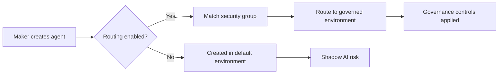

# Control 2.15: Environment Routing and Auto-Provisioning

## Overview

**Control ID:** 2.15
**Control Name:** Environment Routing and Auto-Provisioning
**Regulatory Reference:** OCC 2011-12 (operational risk), FINRA 3110 (supervision), GLBA 501(b)
**Setup Time:** 1-2 hours initial setup

---

## Description

Environment routing automatically directs makers to appropriate Power Platform environments based on security group membership, preventing unauthorized creation of agents and apps in the default environment. This is a critical control for preventing "shadow AI" - unauthorized agent creation outside governed environments.

See [Environment routing](https://learn.microsoft.com/en-us/power-platform/admin/default-environment-routing) for detailed capabilities.

---

## Key Capabilities

| Capability | Description | FSI Relevance |
|------------|-------------|---------------|
| **Automatic maker routing** | Direct makers to governed environments | Prevents shadow AI |
| **Security group-based rules** | Route by AD group membership | Role-based governance |
| **Resource type control** | Enable routing per resource type | Granular control |
| **Priority-based rules** | Up to 25 rules with priority ordering | Complex org structures |
| **Developer environment provisioning** | Auto-create personal dev environments | Controlled innovation |

---

## Governance Levels

### Level 1 - Baseline

| Requirement | Configuration |
|-------------|---------------|
| Routing enabled | Copilot Studio routing enabled |
| Default rule | Route all makers ("Everyone") to developer environments |
| Documentation | Routing policy documented |

**Minimum requirements:**
- Enable environment routing for Copilot Studio
- Create at least one routing rule
- Communicate policy to makers

### Level 2-3 - Recommended

| Requirement | Configuration |
|-------------|---------------|
| All resource types | Routing enabled for Power Apps, Flows, and Copilot Studio |
| Security group rules | Different groups routed to appropriate environment groups |
| Zone alignment | Rules map to Zone 1/2/3 environment groups |
| Monitoring | Track routing effectiveness |

**FSI recommendations:**
- Create separate rules for different business units
- Route compliance-sensitive groups to Zone 2+ environments
- Enable routing for all resource types to prevent gaps

### Level 4 - Regulated/High-Risk

| Requirement | Configuration |
|-------------|---------------|
| Comprehensive routing | All resource types, all makers routed |
| No default environment access | Block direct creation in default environment |
| Audit trail | Log all routing decisions |
| Exception process | Documented process for routing exceptions |

**FSI requirements:**
- Zero tolerance for shadow AI in default environment
- All routing rules documented and approved
- Regular review of routing effectiveness

---

## Configuration Steps

### Step 1: Access Environment Routing

1. Open [Power Platform Admin Center](https://admin.powerplatform.microsoft.com)
2. Navigate to **Manage → Environment groups**
3. Click **Environment routing** in the toolbar (opens "Create and manage environment routing rules" panel)

### Step 2: Enable Resource Types

In the "Turn on environment routing for" section, enable routing for:

| Resource Type | Checkbox | Recommendation |
|---------------|----------|----------------|
| **Power Apps** | ☑️ | Enable for all zones |
| **Power Automate cloud flows** | ☑️ | Enable for all zones |
| **Power Automate desktop flows** | ☑️ | Enable if using RPA |
| **Copilot Studio** | ☑️ | **Critical** - Enable for agent governance |

> **FSI Recommendation:** Enable all resource types to prevent governance gaps. Makers may create flows or apps that interact with agents.

### Step 3: Create Routing Rules

Click **+ New rule** to create a routing rule:

1. **Rule Name:** Auto-generated or custom name
2. **Security Group:** Select AD security group (or "Everyone")
3. **Environment Group:** Select target environment group

**Rule structure:**

| Field | Description | Example |
|-------|-------------|---------|
| Rule Name | Identifier for the rule | "Route-Compliance-Team" |
| Priority | Processing order (1 = first) | 1, 2, 3... |
| Security Group | AD group to match | "Compliance Department" |
| Environment Group | Destination for matched makers | "Zone 2 - Team Collaboration" |

### Step 4: Configure Priority Order

Rules are processed in priority order (1 = highest priority):

1. Use **↑** and **↓** arrows to reorder rules
2. More specific rules should have higher priority
3. "Everyone" rule should be lowest priority (catch-all)

**Example priority structure:**

| Priority | Security Group | Environment Group | Rationale |
|----------|----------------|-------------------|-----------|
| 1 | IT-Admins | Zone 3 - Enterprise | Admins need production access |
| 2 | Compliance-Team | Zone 2 - Compliance | Compliance-specific environment |
| 3 | Development-Team | Zone 2 - Development | Dev team environment |
| 4 | Everyone | Zone 1 - Personal Dev | Default for all others |

### Step 5: Save and Verify

1. Review all rules and priorities
2. Close the panel (changes auto-save)
3. Test by having a user create a new resource
4. Verify they are routed to the correct environment

---

## Recommended Rule Configurations

### Basic Configuration (Small Organization)

| Priority | Security Group | Environment Group |
|----------|----------------|-------------------|
| 1 | Everyone | Developer Environments |

**Effect:** All makers routed to personal developer environments.

### Standard Configuration (Medium Organization)

| Priority | Security Group | Environment Group |
|----------|----------------|-------------------|
| 1 | Power-Platform-Admins | Zone 3 - Enterprise |
| 2 | Business-Analysts | Zone 2 - Team |
| 3 | Everyone | Zone 1 - Personal Dev |

### Enterprise Configuration (Large FSI Organization)

| Priority | Security Group | Environment Group |
|----------|----------------|-------------------|
| 1 | Platform-Admins | Enterprise Production |
| 2 | Compliance-Officers | Compliance Environments |
| 3 | Trading-Desk | Trading Environments |
| 4 | Wealth-Management | Wealth Environments |
| 5 | Operations | Operations Environments |
| 6 | IT-Development | Development Environments |
| 7 | Everyone | Personal Developer |

---

## Shadow AI Prevention

Environment routing is the primary control for preventing shadow AI:

### What is Shadow AI?

Shadow AI occurs when makers create agents, apps, or flows in the default environment outside of governance controls. This creates:

- **Compliance risk:** Unmonitored AI interactions with customer data
- **Security risk:** Ungoverned data access and sharing
- **Operational risk:** Unsupported, undocumented solutions

### How Routing Prevents Shadow AI

### Verification

To verify shadow AI prevention:

1. Check default environment for new resources
2. Review routing logs (if available)
3. Monitor environment group resource counts
4. Conduct periodic audits of default environment

---

## Developer Environment Auto-Provisioning

When routing to "Developer Environments" group:

| Feature | Behavior |
|---------|----------|
| **Auto-creation** | Personal developer environment created on first use |
| **Naming** | Named after the user (e.g., "John Smith's Environment") |
| **Limit** | Up to 3 developer environments per user |
| **Governance** | Inherits environment group rules |

See [Create developer environment](https://learn.microsoft.com/en-us/power-platform/developer/create-developer-environment) for details.

### FSI Considerations

- Developer environments count toward tenant capacity
- Consider lifecycle management for inactive environments
- Apply Zone 1 governance rules to developer environment group

---

## Verification & Testing

| Step | Action | Expected Result |
|------|--------|-----------------|
| 1 | Navigate to Environment routing | Panel opens with current rules |
| 2 | Verify resource types enabled | All relevant types checked |
| 3 | Review rule priorities | Rules in correct order |
| 4 | Test as different users | Users routed to correct environments |
| 5 | Check default environment | No new unauthorized resources |

### Test Scenarios

| Scenario | Test User | Expected Destination |
|----------|-----------|---------------------|
| Admin creates agent | Platform Admin | Enterprise Production |
| Analyst creates app | Business Analyst | Team Environment |
| New employee creates flow | No specific group | Personal Developer |

---

## Integration with Other Controls

| Control | Integration |
|---------|-------------|
| **2.1 Managed Environments** | Routed environments should be managed |
| **2.2 Environment Groups** | Routing targets environment groups |
| **1.4 Connector Policies** | DLP applies in routed environments |

**Best Practice:** Configure environment groups and their rules BEFORE enabling routing. This ensures makers are routed to properly governed environments.

---

## Regulatory Context

**Primary Regulations:** OCC 2011-12, FINRA 3110, GLBA 501(b)

| Regulation | Environment Routing Support |
|------------|----------------------------|
| OCC 2011-12 | Operational risk control for AI/ML systems |
| FINRA 3110 | Supervisory control over agent creation |
| GLBA 501(b) | Data protection via governed environments |

### Examination Considerations

Regulators may ask:
- How do you prevent unauthorized AI agent creation?
- What controls exist to ensure agents are created in governed environments?
- How do you monitor for shadow AI?

**Documentation:** Maintain evidence of routing configuration, rules, and periodic audits.

---

## Troubleshooting

| Issue | Possible Cause | Resolution |
|-------|----------------|------------|
| User not routed | Not in any security group | Add to appropriate group or use "Everyone" rule |
| Wrong environment | Rule priority incorrect | Adjust priority order |
| Routing not working | Resource type not enabled | Enable checkbox for resource type |
| Developer env not created | Capacity limit reached | Review tenant capacity |

---

## Related Controls

- [Control 2.1: Managed Environments](./2.1-managed-environments.md) - Environment-level governance
- [Control 2.2: Environment Groups](./2.2-environment-groups-and-tier-classification.md) - Group-level rules
- [Control 3.1: Agent Inventory](../pillar-3-reporting/3.1-agent-inventory-and-metadata-management.md) - Track agent locations

---

## Support & Questions

For implementation support or questions about this control, contact:
- AI Governance Lead (governance direction)
- Compliance Officer (regulatory requirements)
- Power Platform Admin (technical setup)

---

*Last Updated: December 2025*
*Version: 1.0 Beta*
