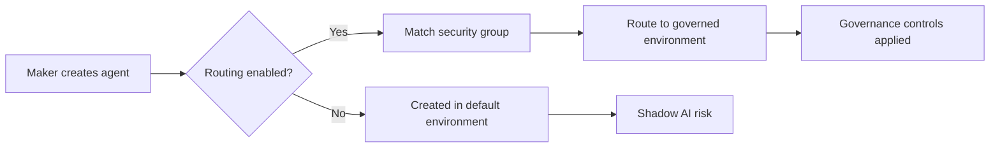

# Control 2.15: Environment Routing and Auto-Provisioning

## Overview

**Control ID:** 2.15
**Control Name:** Environment Routing and Auto-Provisioning
**Regulatory Reference:** OCC 2011-12 (operational risk), FINRA 3110 (supervision), GLBA 501(b)
**Setup Time:** 1-2 hours initial setup

---

### Purpose

Environment routing ensures that makers are automatically directed to appropriately governed Power Platform environments based on their security group membership, preventing the creation of ungoverned "shadow AI" in the default environment. This is critical for financial services organizations to maintain regulatory compliance and operational control over AI agent development and deployment.

---

### Description

Environment routing automatically directs makers to appropriate Power Platform environments based on security group membership, preventing unauthorized creation of agents and apps in the default environment. This is a critical control for preventing "shadow AI" - unauthorized agent creation outside governed environments.

See [Environment routing](https://learn.microsoft.com/en-us/power-platform/admin/default-environment-routing) for detailed capabilities.

---

### Key Capabilities

| Capability | Description | FSI Relevance |
|------------|-------------|---------------|
| **Automatic maker routing** | Direct makers to governed environments | Prevents shadow AI |
| **Security group-based rules** | Route by AD group membership | Role-based governance |
| **Resource type control** | Enable routing per resource type | Granular control |
| **Priority-based rules** | Up to 25 rules with priority ordering | Complex org structures |
| **Developer environment provisioning** | Auto-create personal dev environments | Controlled innovation |

---

## Prerequisites

**Primary Owner Admin Role:** Power Platform Admin
**Supporting Roles:** Environment Admin

### Licenses Required

| License | Purpose | Required For |
|---------|---------|-------------|
| Power Apps Premium | Environment routing capabilities | All routed environments |
| Copilot Studio | Agent creation and governance | Agent routing |
| Power Automate Premium | Flow routing capabilities | Flow governance |
| Power Platform Admin | Admin center access | Configuration |

### Permissions Required

| Role | Purpose | Assignment Method |
|------|---------|-------------------|
| Power Platform Admin | Configure routing rules | Entra ID / M365 Admin |
| Global Admin | Full tenant access | Entra ID |
| Dynamics 365 Admin | Environment management | M365 Admin Center |

### Dependencies

| Dependency | Description | Verification |
|------------|-------------|--------------|
| Environment Groups | Routing targets environment groups | Check PPAC → Environment groups |
| Security Groups | AD groups for routing rules | Check Entra ID → Groups |
| Managed Environments | Target environments should be managed | Check PPAC → Environments |
| DLP Policies | Data policies in target environments | Check PPAC → Data policies |

### Pre-Setup Checklist

- [ ] Environment groups created and configured
- [ ] Security groups identified for routing rules
- [ ] Target environments are Managed Environments
- [ ] DLP policies applied to target environment groups
- [ ] Routing policy documented and approved
- [ ] Communication plan for makers prepared

---

## Governance Levels

### Level 1 - Baseline

| Requirement | Configuration |
|-------------|---------------|
| Routing enabled | Copilot Studio routing enabled |
| Default rule | Route all makers ("Everyone") to developer environments |
| Documentation | Routing policy documented |

**Minimum requirements:**

- Enable environment routing for Copilot Studio
- Create at least one routing rule
- Communicate policy to makers

### Level 2-3 - Recommended

| Requirement | Configuration |
|-------------|---------------|
| All resource types | Routing enabled for Power Apps, Flows, and Copilot Studio |
| Security group rules | Different groups routed to appropriate environment groups |
| Governance alignment | Rules map to personal/team/enterprise environment groups |
| Monitoring | Track routing effectiveness |

**FSI recommendations:**

- Create separate rules for different business units
- Route compliance-sensitive groups to team/enterprise environments
- Enable routing for all resource types to prevent gaps

### Level 4 - Regulated/High-Risk

| Requirement | Configuration |
|-------------|---------------|
| Comprehensive routing | All resource types, all makers routed |
| No default environment access | Block direct creation in default environment |
| Audit trail | Log all routing decisions |
| Exception process | Documented process for routing exceptions |

**FSI requirements:**

- Zero tolerance for shadow AI in default environment
- All routing rules documented and approved
- Regular review of routing effectiveness

---

## Setup & Configuration

<a id="configuration-steps"></a>

### Step 1: Access Environment Routing

1. Open [Power Platform Admin Center](https://admin.powerplatform.microsoft.com)
2. Navigate to **Manage → Environment groups**
3. Click **Environment routing** in the toolbar (opens "Create and manage environment routing rules" panel)

### Step 2: Enable Resource Types

In the "Turn on environment routing for" section, enable routing for:

| Resource Type | Checkbox | Recommendation |
|---------------|----------|----------------|
| **Power Apps** | ☑️ | Enable for all zones |
| **Power Automate cloud flows** | ☑️ | Enable for all zones |
| **Power Automate desktop flows** | ☑️ | Enable if using RPA |
| **Copilot Studio** | ☑️ | **Critical** - Enable for agent governance |

!!! tip "FSI Recommendation"
    Enable all resource types to prevent governance gaps. Makers may create flows or apps that
    interact with agents.

### Step 3: Create Routing Rules

Click **+ New rule** to create a routing rule:

1. **Rule Name:** Auto-generated or custom name
2. **Security Group:** Select AD security group (or "Everyone")
3. **Environment Group:** Select target environment group

**Rule structure:**

| Field | Description | Example |
|-------|-------------|---------|
| Rule Name | Identifier for the rule | "Route-Compliance-Team" |
| Priority | Processing order (1 = first) | 1, 2, 3... |
| Security Group | AD group to match | "Compliance Department" |
| Environment Group | Destination for matched makers | "Team Collaboration" |

### Step 4: Configure Priority Order

Rules are processed in priority order (1 = highest priority):

1. Use **↑** and **↓** arrows to reorder rules
2. More specific rules should have higher priority
3. "Everyone" rule should be lowest priority (catch-all)

**Example priority structure:**

| Priority | Security Group | Environment Group | Rationale |
|----------|----------------|-------------------|-----------|
| 1 | IT-Admins | Enterprise Managed | Admins need production access |
| 2 | Compliance-Team | Team Collaboration (Compliance) | Compliance-specific environment |
| 3 | Development-Team | Team Collaboration (Development) | Dev team environment |
| 4 | Everyone | Personal Productivity (Developer) | Default for all others |

### Step 5: Save and Verify

1. Review all rules and priorities
2. Close the panel (changes auto-save)
3. Test by having a user create a new resource
4. Verify they are routed to the correct environment

---

### Recommended Rule Configurations

### Basic Configuration (Small Organization)

| Priority | Security Group | Environment Group |
|----------|----------------|-------------------|
| 1 | Everyone | Developer Environments |

**Effect:** All makers routed to personal developer environments.

### Standard Configuration (Medium Organization)

| Priority | Security Group | Environment Group |
|----------|----------------|-------------------|
| 1 | Power-Platform-Admins | Enterprise Managed |
| 2 | Business-Analysts | Team Collaboration |
| 3 | Everyone | Personal Productivity (Developer) |

### Enterprise Configuration (Large FSI Organization)

| Priority | Security Group | Environment Group |
|----------|----------------|-------------------|
| 1 | Platform-Admins | Enterprise Production |
| 2 | Compliance-Officers | Compliance Environments |
| 3 | Trading-Desk | Trading Environments |
| 4 | Wealth-Management | Wealth Environments |
| 5 | Operations | Operations Environments |
| 6 | IT-Development | Development Environments |
| 7 | Everyone | Personal Developer |

---

### Shadow AI Prevention

Environment routing is the primary control for preventing shadow AI:

### What is Shadow AI?

Shadow AI occurs when makers create agents, apps, or flows in the default environment outside of governance controls. This creates:

- **Compliance risk:** Unmonitored AI interactions with customer data
- **Security risk:** Ungoverned data access and sharing
- **Operational risk:** Unsupported, undocumented solutions

### How Routing Prevents Shadow AI



### Verification

To verify shadow AI prevention:

1. Check default environment for new resources
2. Review routing logs (if available)
3. Monitor environment group resource counts
4. Conduct periodic audits of default environment

---

### Developer Environment Auto-Provisioning

When routing to "Developer Environments" group:

| Feature | Behavior |
|---------|----------|
| **Auto-creation** | Personal developer environment created on first use |
| **Naming** | Named after the user (e.g., "John Smith's Environment") |
| **Limit** | Up to 3 developer environments per user |
| **Governance** | Inherits environment group rules |

See [Create developer environment](https://learn.microsoft.com/en-us/power-platform/developer/create-developer-environment) for details.

### FSI Considerations

- Developer environments count toward tenant capacity
- Consider lifecycle management for inactive environments
- Apply personal productivity governance rules to the developer environment group

---

### PowerShell Configuration

### Get Environment Routing Configuration

```powershell
# Connect to Power Platform
Connect-PowerPlatform

# Get all environment groups (routing targets)
$envGroups = Get-AdminPowerAppEnvironmentGroup

foreach ($group in $envGroups) {
    Write-Host "`n=== $($group.DisplayName) ===" -ForegroundColor Cyan
    Write-Host "Group ID: $($group.EnvironmentGroupId)"
    Write-Host "Description: $($group.Description)"

    # List environments in group
    $envs = Get-AdminPowerAppEnvironment | Where-Object {
        $_.Properties.environmentGroup -eq $group.EnvironmentGroupId
    }
    Write-Host "Environments in group: $($envs.Count)"
}
```

### Create Routing Rules (Note: Primarily Portal)

!!! note
    Environment routing rules are primarily configured through the Power Platform Admin Center
    portal. PowerShell can be used to prepare and verify the configuration.

```powershell
# Verify security groups exist before creating routing rules
function Test-RoutingSecurityGroups {
    param(
        [string[]]$GroupNames
    )

    foreach ($groupName in $GroupNames) {
        $group = Get-AzureADGroup -SearchString $groupName
        if ($group) {
            Write-Host "✓ Security group found: $groupName ($($group.ObjectId))" -ForegroundColor Green
        } else {
            Write-Host "✗ Security group NOT found: $groupName" -ForegroundColor Red
        }
    }
}

# Example: Verify groups for FSI routing
$fsiGroups = @(
    "Power-Platform-Admins",
    "Compliance-Officers",
    "Trading-Desk",
    "Wealth-Management",
    "IT-Development"
)
Test-RoutingSecurityGroups -GroupNames $fsiGroups
```

### Get Security Groups for Routing

```powershell
# List all security groups suitable for routing rules
Get-AzureADGroup -All $true | Where-Object {
    $_.SecurityEnabled -eq $true -and $_.MailEnabled -eq $false
} | Select-Object DisplayName, ObjectId, Description | Format-Table -AutoSize

# Get members of a specific routing group
function Get-RoutingGroupMembers {
    param([string]$GroupName)

    $group = Get-AzureADGroup -SearchString $GroupName | Select-Object -First 1
    if ($group) {
        $members = Get-AzureADGroupMember -ObjectId $group.ObjectId
        Write-Host "`nMembers of $GroupName ($($members.Count) total):" -ForegroundColor Cyan
        $members | Select-Object DisplayName, UserPrincipalName | Format-Table
    }
}

Get-RoutingGroupMembers -GroupName "Compliance-Officers"
```

### Export Routing Configuration

```powershell
# Export environment routing configuration for compliance documentation
function Export-RoutingConfiguration {
    param([string]$OutputPath = ".\EnvironmentRoutingConfig.json")

    $config = @{
        ExportDate = Get-Date -Format "yyyy-MM-dd HH:mm:ss"
        EnvironmentGroups = @()
        SecurityGroups = @()
    }

    # Get environment groups
    $envGroups = Get-AdminPowerAppEnvironmentGroup
    foreach ($group in $envGroups) {
        $envs = Get-AdminPowerAppEnvironment | Where-Object {
            $_.Properties.environmentGroup -eq $group.EnvironmentGroupId
        }

        $config.EnvironmentGroups += @{
            Name = $group.DisplayName
            Id = $group.EnvironmentGroupId
            Description = $group.Description
            EnvironmentCount = $envs.Count
            Environments = $envs | Select-Object DisplayName, EnvironmentName
        }
    }

    # Export to JSON
    $config | ConvertTo-Json -Depth 5 | Out-File -FilePath $OutputPath -Encoding UTF8
    Write-Host "Exported routing configuration to $OutputPath" -ForegroundColor Green
}

Export-RoutingConfiguration -OutputPath ".\FSI-Routing-Config.json"
```

### Monitor Routing Effectiveness

```powershell
# Monitor for shadow AI in default environment
function Get-DefaultEnvironmentResources {
    # Get the default environment
    $defaultEnv = Get-AdminPowerAppEnvironment | Where-Object {
        $_.EnvironmentType -eq "Default"
    } | Select-Object -First 1

    if ($defaultEnv) {
        Write-Host "=== Default Environment Analysis ===" -ForegroundColor Yellow
        Write-Host "Environment: $($defaultEnv.DisplayName)"

        # Get apps in default environment (potential shadow AI indicators)
        $apps = Get-AdminPowerApp -EnvironmentName $defaultEnv.EnvironmentName
        Write-Host "Power Apps: $($apps.Count)" -ForegroundColor $(if ($apps.Count -gt 10) { "Red" } else { "Green" })

        # Get flows in default environment
        $flows = Get-AdminFlow -EnvironmentName $defaultEnv.EnvironmentName
        Write-Host "Flows: $($flows.Count)" -ForegroundColor $(if ($flows.Count -gt 20) { "Red" } else { "Green" })

        # Report recent creations (last 30 days) - potential routing bypasses
        $recentDate = (Get-Date).AddDays(-30)
        $recentApps = $apps | Where-Object { $_.CreatedTime -gt $recentDate }

        if ($recentApps.Count -gt 0) {
            Write-Host "`nRecent apps created in default environment (last 30 days):" -ForegroundColor Red
            $recentApps | Select-Object DisplayName, @{N='Creator';E={$_.Owner.displayName}}, CreatedTime | Format-Table
        } else {
            Write-Host "`nNo new apps in default environment (last 30 days) - Routing effective!" -ForegroundColor Green
        }
    }
}

Get-DefaultEnvironmentResources
```

---

## Financial Sector Considerations

### Regulatory Mapping

| Regulation | Requirement | Environment Routing Support |
|------------|-------------|----------------------------|
| OCC 2011-12 | Operational risk management for technology systems | Routes makers to governed environments with appropriate controls |
| FINRA 3110 | Supervisory system for business activities | Enforces routing rules based on role/group membership |
| GLBA 501(b) | Administrative safeguards for customer information | Directs makers to environments with proper data policies |
| SOX 302/404 | Internal controls over financial reporting | Audit trail of routing decisions and environment assignments |

### Governance Tier Routing Configuration

| Governance Tier | Target Environment Group | Security Groups | Routing Priority |
|-----------------|-------------------------|-----------------|------------------|
| Enterprise Managed | Production Environments | Platform-Admins, Senior-Compliance | 1 (Highest) |
| Team Collaboration | Team/Department Environments | Compliance-Officers, Trading-Desk, Operations | 2-5 |
| Personal Productivity | Developer Environments | Everyone (catch-all) | Lowest |

### FSI Example Configuration

```yaml
# FSI Environment Routing Configuration Example
# For compliance documentation and implementation reference

Routing_Configuration:
  Organization: "FSI Financial Services"
  ConfigurationDate: "2025-01-15"

  Resource_Types_Enabled:
    Power_Apps: true
    Power_Automate_Cloud_Flows: true
    Power_Automate_Desktop_Flows: true
    Copilot_Studio: true  # Critical for agent governance

  Routing_Rules:
    - Priority: 1
      Name: "Route-Platform-Admins"
      Security_Group: "Power-Platform-Admins"
    Target_Environment_Group: "Enterprise Managed - Production"
      Rationale: "Admins need production access for management"

    - Priority: 2
      Name: "Route-Compliance-Team"
      Security_Group: "Compliance-Officers"
    Target_Environment_Group: "Team Collaboration - Compliance"
      Rationale: "Compliance-specific environment with enhanced controls"

    - Priority: 3
      Name: "Route-Trading-Operations"
      Security_Group: "Trading-Desk"
    Target_Environment_Group: "Team Collaboration - Trading"
      Rationale: "Trading-specific data policies and connectors"

    - Priority: 4
      Name: "Route-Wealth-Management"
      Security_Group: "Wealth-Management-Team"
    Target_Environment_Group: "Team Collaboration - Wealth"
      Rationale: "Client data protection requirements"

    - Priority: 5
      Name: "Route-IT-Development"
      Security_Group: "IT-Development"
    Target_Environment_Group: "Team Collaboration - Development"
      Rationale: "Development and testing environment"

    - Priority: 6
      Name: "Route-Everyone-Default"
      Security_Group: "Everyone"
    Target_Environment_Group: "Personal Productivity - Developer"
      Rationale: "Catch-all for personal development, auto-provision dev environments"

  Shadow_AI_Prevention:
    Default_Environment_Monitoring: "Weekly"
    Alert_Threshold: 5  # Alert if more than 5 new resources in default env
    Audit_Frequency: "Monthly"

  Examination_Evidence:
    - "Routing rules screenshot from PPAC"
    - "Security group membership lists"
    - "Default environment audit reports"
    - "Routing effectiveness metrics"
```

### Examination Considerations

Regulators may ask:

- How do you prevent unauthorized AI agent creation?
- What controls exist to ensure agents are created in governed environments?
- How do you monitor for shadow AI?
- What is your process for routing exceptions?

**Documentation:** Maintain evidence of routing configuration, rules, and periodic audits.

---

### Zone-Specific Configuration

**Zone 1 (Personal Productivity):**

- Apply a baseline minimum of Environment Routing and Auto-Provisioning controls that impacts tenant-wide safety (where applicable), and document any exceptions for personal agents.
- Avoid expanding scope beyond the user’s own data unless explicitly justified.
- Rationale: reduces risk from personal use while keeping friction low; legal/compliance can tighten later.

**Zone 2 (Team Collaboration):**

- Apply the control for shared agents and shared data sources; require an identified owner and an approval trail.
- Validate configuration in a pilot environment before broader rollout; retain evidence (screenshots/exports/logs).
- Rationale: shared agents increase blast radius; controls must be consistently applied and provable.

**Zone 3 (Enterprise Managed):**

- Require the strictest configuration for Environment Routing and Auto-Provisioning controls and enforce it via policy where possible (not manual-only).
- Treat changes as controlled (change ticket + documented testing); retain evidence (screenshots/exports/logs).
- Rationale: enterprise agents handle the most sensitive content and are the highest audit/regulatory risk.

## Verification & Testing

| Step | Action | Expected Result |
|------|--------|-----------------|
| 1 | Navigate to Environment routing | Panel opens with current rules |
| 2 | Verify resource types enabled | All relevant types checked |
| 3 | Review rule priorities | Rules in correct order |
| 4 | Test as different users | Users routed to correct environments |
| 5 | Check default environment | No new unauthorized resources |

### Test Scenarios

| Scenario | Test User | Expected Destination |
|----------|-----------|---------------------|
| Admin creates agent | Platform Admin | Enterprise Production |
| Analyst creates app | Business Analyst | Team Environment |
| New employee creates flow | No specific group | Personal Developer |

---

### Integration with Other Controls

| Control | Integration |
|---------|-------------|
| **2.1 Managed Environments** | Routed environments should be managed |
| **2.2 Environment Groups** | Routing targets environment groups |
| **1.4 Connector Policies** | DLP applies in routed environments |

**Best Practice:** Configure environment groups and their rules BEFORE enabling routing. This ensures makers are routed to properly governed environments.

---

## Troubleshooting & Validation

<a id="troubleshooting"></a>

### Issue: Users Not Being Routed to Expected Environment

**Symptoms:** Makers end up in wrong environment or default environment

**Solutions:**

1. Verify user is member of the correct security group in Entra ID
2. Check rule priority order - more specific rules should have higher priority
3. Confirm the routing rule is targeting the correct environment group
4. Wait 15-30 minutes for group membership changes to propagate
5. Have user sign out and back in to refresh group claims

### Issue: Routing Rules Not Appearing

**Symptoms:** Cannot see or create routing rules in admin center

**Solutions:**

1. Verify you have Power Platform Admin or Global Admin role
2. Check that environment groups exist (routing requires environment groups)
3. Ensure tenant has required licensing (Power Apps Premium)
4. Try accessing from a different browser or incognito mode
5. Clear browser cache and cookies

### Issue: Resource Type Routing Not Working

**Symptoms:** Routing works for some resource types but not others

**Solutions:**

1. Verify the specific resource type checkbox is enabled in routing settings
2. Check if maker has direct environment access bypassing routing
3. Confirm DLP policies aren't blocking creation in target environment
4. Review if maker is Environment Admin (admins may bypass routing)
5. Test with a non-admin user account

### Issue: Developer Environment Not Auto-Provisioned

**Symptoms:** User routed to Developer Environments group but no environment created

**Solutions:**

1. Check tenant has available environment capacity
2. Verify user hasn't exceeded 3 developer environment limit
3. Confirm user has appropriate license for environment creation
4. Check for any tenant-wide restrictions on environment creation
5. Review audit logs for failed environment creation attempts

### Issue: Shadow AI Detected Despite Routing

**Symptoms:** New resources appearing in default environment

**Solutions:**

1. Verify all resource types are enabled for routing (apps, flows, Copilot Studio)
2. Check if resources were created before routing was enabled
3. Review if users have direct maker access to default environment
4. Audit security group memberships - ensure all makers are covered
5. Consider blocking direct creation in default environment via environment settings

---

## Additional Resources

<a id="microsoft-learn-references"></a>

- [Environment Routing Overview](https://learn.microsoft.com/en-us/power-platform/admin/default-environment-routing) - Core routing concepts
- [Environment Groups](https://learn.microsoft.com/en-us/power-platform/admin/environment-groups) - Routing targets
- [Create Developer Environments](https://learn.microsoft.com/en-us/power-platform/developer/create-developer-environment) - Auto-provisioning details
- [Managed Environments Overview](https://learn.microsoft.com/en-us/power-platform/admin/managed-environment-overview) - Target environment governance
- [Security Groups and Teams](https://learn.microsoft.com/en-us/power-platform/admin/control-user-access) - Group-based access control
- [Power Platform Admin PowerShell](https://learn.microsoft.com/en-us/power-platform/admin/powershell-getting-started) - Automation and monitoring

---

## Related Controls

| Control | Relationship |
|---------|-------------|
| [Control 2.1: Managed Environments](./2.1-managed-environments.md) | Target environments should be Managed Environments for enhanced governance |
| [Control 2.2: Environment Groups](./2.2-environment-groups-and-tier-classification.md) | Routing targets environment groups with governance-tier-based rules |
| [Control 1.1: Restrict Agent Publishing](../pillar-1-security/1.1-restrict-agent-publishing-by-authorization.md) | Complements routing with publishing controls |
| [Control 1.4: Advanced Connector Policies](../pillar-1-security/1.4-advanced-connector-policies-acp.md) | DLP policies apply in routed environments |

---

## Support & Questions

For implementation support or questions about this control, contact:

- AI Governance Lead (governance direction)
- Compliance Officer (regulatory requirements)
- Power Platform Admin (technical setup)
---

**Updated:** Dec 2025  
**Version:** v1.0 Beta (Dec 2025)  
**UI Verification Status:** ❌ Needs verification
