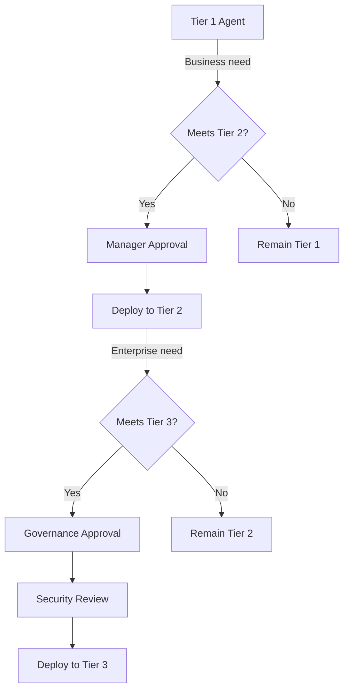
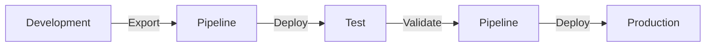
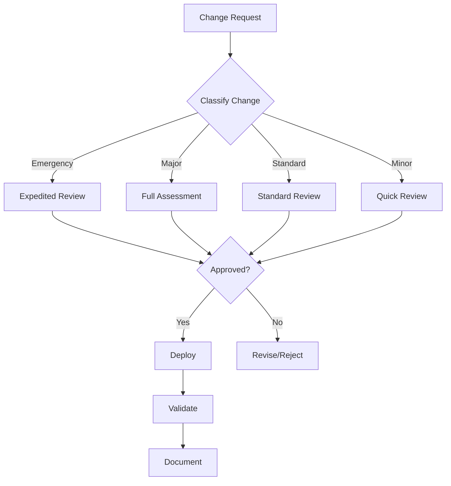

# Control 2.3: Change Management and Release Planning

## Overview

**Control ID:** 2.3  
**Control Name:** Change Management and Release Planning  
**Regulatory Reference:** FINRA 4511, SOX 404, GLBA 501(b), SEC 17a-4  
**Setup Time:** 2-4 hours  

---

### Purpose

Change management and release planning provides structured governance over all modifications to AI agents, ensuring that every change—whether a configuration update, tier promotion, or version release—follows a controlled, documented, and approved process. For financial services institutions, this control is essential for maintaining regulatory compliance, preserving audit trails that demonstrate oversight, and protecting against unauthorized or untested changes reaching production environments that could impact customers or expose the organization to risk.

---

### Description

Change management ensures that all modifications to agents are controlled, documented, and approved before deployment. This includes promotions between governance tiers, configuration changes, and version updates. Power Platform provides ALM (Application Lifecycle Management) pipelines for automated, controlled deployments.

See [Overview of pipelines](https://learn.microsoft.com/en-us/power-platform/alm/pipelines) for ALM capabilities.

---

### Key Capabilities

| Capability | Description | FSI Relevance |
|------------|-------------|---------------|
| **ALM Pipelines** | Automated solution deployment | Controlled promotion |
| **Solution versioning** | Track agent versions | Audit trail |
| **Approval workflows** | Gate deployments | Compliance enforcement |
| **Rollback capability** | Revert failed changes | Business continuity |

---

### Governance Tier Promotion Process

### Promotion Overview



### Promotion Requirements

| Promotion | Requirements | Approvers | Documentation |
|-----------|--------------|-----------|---------------|
| **1 → 2** | Business justification, basic testing | Manager, Environment owner | Request form, test results |
| **2 → 3** | Full assessment, security review | Governance committee, Compliance, Security | Full package |
| **Within tier** | Change documentation | Environment owner | Change record |

### Promotion Checklist

#### Tier 1 to Tier 2

- [ ] Business justification documented
- [ ] Manager approval obtained
- [ ] Basic security review completed
- [ ] Target environment identified
- [ ] Solution exported from Tier 1
- [ ] Deployment plan created
- [ ] Rollback plan defined

#### Tier 2 to Tier 3

- [ ] All Tier 1→2 requirements
- [ ] Governance committee approval
- [ ] Full security assessment
- [ ] Compliance review completed
- [ ] Performance testing passed
- [ ] User acceptance testing completed
- [ ] Production readiness checklist
- [ ] Monitoring plan defined
- [ ] Support procedures documented

---

### ALM Pipeline Integration

### Pipeline Overview

Power Platform pipelines enable automated, governed deployments:



See [Set up pipelines](https://learn.microsoft.com/en-us/power-platform/alm/set-up-pipelines) for configuration.

### Pipeline Configuration by Governance Tier

| Tier | Pipeline Required | Stages | Approval Gates |
|------|-------------------|--------|----------------|
| Tier 1 | No | N/A | N/A |
| Tier 2 | Recommended | Dev → Test | Manager |
| Tier 3 | **Required** | Dev → Test → Prod | Multiple |

### Setting Up Pipelines

1. **Create pipeline environment** (host for pipeline configuration)
2. **Define stages** (development, test, production)
3. **Configure deployment settings** per stage
4. **Add approval gates** as required
5. **Test pipeline** with non-production solution

### Running Pipelines

1. Open agent solution in source environment
2. Select **Deploy** from solution menu
3. Choose target stage
4. Wait for approvals (if configured)
5. Monitor deployment progress
6. Validate in target environment

See [Run pipelines](https://learn.microsoft.com/en-us/power-platform/alm/run-pipeline) for detailed steps.

### PPAC Deployment Section

The Power Platform Admin Center provides a dedicated **Deployment** section (top-level navigation) for pipeline administration:

**Accessing Deployment:**

1. Open [Power Platform Admin Center](https://admin.powerplatform.microsoft.com)
2. Navigate to **Deployment** in left navigation
3. Select sub-section: Overview, Pipelines, Settings, or Catalogs

**Deployment Overview:**

- Pipelines activity dashboard
- Pending approvals count
- Failed deployments count
- Quick access to setup guides

**Deployment Settings:**

| Setting | Description | FSI Recommendation |
|---------|-------------|-------------------|
| **Enable Auto-Conversion of Target Environments to Managed** | Automatically converts target environments to Managed | Enable for enterprise managed |
| **Solution deployments across regions** | Allow cross-region deployments | Configure per policy |
| **Allow makers to import shared solution deployments** | Makers can import shared solutions | Enable for team/enterprise |

!!! warning
    Target environments in pipelines must be enabled as Managed Environments. This ensures every
    environment used in pipelines meets Microsoft Enterprise compliance standards.

### Power Apps Pipeline View

Makers access pipelines from Power Apps:

1. Open [Power Apps](https://make.powerapps.com)
2. Navigate to **Solutions**
3. Select **Pipelines** from toolbar
4. Create pipeline, add stages, manage deployments

**Toolbar options:** Create pipeline, Edit pipeline, Add stage, Delete pipeline, Refresh, Manage pipelines, View deployments

See [Admin deployment hub](https://learn.microsoft.com/en-us/power-platform/alm/admin-deployment-hub) for details.

---

### Change Types and Workflows

### Change Classification

| Change Type | Examples | Risk Level | Approval |
|-------------|----------|------------|----------|
| **Emergency** | Security fix, critical bug | High | Expedited |
| **Major** | New functionality, architecture change | High | CAB |
| **Standard** | Enhancements, non-critical fixes | Medium | Manager |
| **Minor** | Documentation, cosmetic changes | Low | Self-service |

### Approval Matrix by Governance Tier

| Change Type | Tier 1 | Tier 2 | Tier 3 |
|-------------|--------|--------|--------|
| Emergency | Self-service | Manager + Security | CAB + CISO |
| Major | Self-service | Manager + Security | CAB |
| Standard | Self-service | Manager | Manager + Security |
| Minor | Self-service | Self-service | Manager |

### Change Request Process



---

## Prerequisites

**Primary Owner Admin Role:** Power Platform Admin
**Supporting Roles:** Pipeline Admin, Environment Admin

### Licenses Required

| License | Purpose | Required/Optional |
|---------|---------|-------------------|
| Power Apps Premium | Solution management, pipeline execution | Required |
| Copilot Studio | Agent development and deployment | Required |
| Power Automate Premium | Approval workflow automation | Required |
| Azure DevOps | Extended CI/CD capabilities | Optional |
| GitHub Enterprise | Source control integration | Optional |

### Permissions Required

| Role | Purpose | Scope |
|------|---------|-------|
| Power Platform Admin | Configure pipelines, manage deployments | Tenant-wide |
| Environment Admin | Manage target environments | Per environment |
| Solution Publisher | Export/import solutions | Per environment |
| Pipeline Administrator | Create and manage pipelines | Pipeline host environment |
| Deployment Pipeline User | Execute deployments | Assigned pipelines |
| System Administrator | Configure approval workflows | Dataverse |

### Dependencies

| Dependency | Description | Status Check |
|------------|-------------|---------------|
| Managed Environments | Target environments must be Managed | Admin Center > Environments |
| Environment Groups | Organize environments for pipelines | Verify groups exist |
| Solution Framework | Agents packaged as solutions | Verify solution structure |
| Dataverse | Required for pipelines | Included with Premium |
| Approval Connectors | Power Automate approvals connector | Verify not blocked by DLP |

### Pre-Setup Checklist

- [ ] Confirm Power Apps Premium licenses assigned to pipeline administrators
- [ ] Verify target environments are enabled as Managed Environments
- [ ] Identify pipeline host environment for your organization
- [ ] Document approval chain (Manager, Security, CAB) for each governance tier
- [ ] Review existing change management policies for integration points
- [ ] Confirm Power Automate approval connector is allowed in DLP policies
- [ ] Identify Azure DevOps project if using extended ALM (optional)

---

## Governance Levels

### Level 1 - Baseline

| Requirement | Configuration |
|-------------|---------------|
| Change documentation | All changes documented |
| Basic approval | Manager approval for production |
| Version tracking | Solution versioning enabled |

**Minimum requirements:**

- Document all agent changes
- Require approval before production deployment
- Maintain version history

### Level 2-3 - Recommended

| Requirement | Configuration |
|-------------|---------------|
| ALM pipelines | Pipelines for tier 2+ deployments |
| Approval workflows | Automated approval gates |
| Testing gates | Automated testing before promotion |
| Change records | Formal change documentation |

**FSI recommendations:**

- Configure pipelines for all tier 2-3 agents
- Implement automated approval workflows
- Require testing validation before deployment
- Maintain comprehensive change records

### Level 4 - Regulated/High-Risk

| Requirement | Configuration |
|-------------|---------------|
| CAB process | Formal Change Advisory Board |
| Review period | Minimum 48-hour review for major changes |
| Automated testing | Mandatory pre-deployment testing |
| Rollback capability | Tested rollback procedures |
| Audit trail | Complete change history |

**FSI requirements:**

- Formal CAB for tier 3 changes
- 48-hour minimum review period (except emergencies)
- Automated testing in pipeline
- Documented and tested rollback procedures
- Complete audit trail for regulatory examinations

---

### Rollback Procedures

### Rollback Triggers

| Trigger | Action | Timeline |
|---------|--------|----------|
| Critical failure | Immediate rollback | <1 hour |
| Performance degradation | Assess, then rollback | <4 hours |
| User-reported issues | Investigate, then decide | <24 hours |
| Compliance concern | Hold, assess, decide | Immediate hold |

### Rollback Process

1. **Identify issue** and classify severity
2. **Notify stakeholders** (users, management)
3. **Execute rollback** via pipeline or manual restore
4. **Validate restoration** of previous version
5. **Document incident** and root cause
6. **Plan remediation** before next attempt

### Solution Backup Strategy

| Tier | Backup Frequency | Retention |
|------|------------------|-----------|
| Tier 1 | On change | 30 days |
| Tier 2 | Before deployment | 90 days |
| Tier 3 | Before deployment + daily | 1 year |

---

### Documentation Requirements

### Change Record Contents

| Field | Description | Required |
|-------|-------------|----------|
| Change ID | Unique identifier | Yes |
| Description | What is being changed | Yes |
| Justification | Why the change is needed | Yes |
| Risk assessment | Potential impact | Tier 2-3 |
| Test results | Validation evidence | Tier 2-3 |
| Approvals | Who approved | Yes |
| Deployment date | When deployed | Yes |
| Validation | Post-deployment confirmation | Yes |

### Audit Trail

Maintain records for:

- Change requests and approvals
- Deployment logs (pipeline or manual)
- Test results
- Rollback events
- Post-deployment validation

---

## Setup & Configuration

### PowerShell Configuration

### Prerequisites

```powershell
# Install required modules
Install-Module -Name Microsoft.PowerApps.Administration.PowerShell -Force -AllowClobber
Install-Module -Name Microsoft.PowerApps.PowerShell -Force -AllowClobber
Install-Module -Name Microsoft.Xrm.Tooling.CrmConnector.PowerShell -Force -AllowClobber

# Connect to Power Platform
Add-PowerAppsAccount
```

### Export Solution Commands

```powershell
# Export a solution (unmanaged) for development
$environmentUrl = "https://[your-env].crm.dynamics.com"
$solutionName = "FSIAgentSolution"
$exportPath = "C:\Solutions\$solutionName.zip"

# Connect to environment
$conn = Connect-CrmOnline -ServerUrl $environmentUrl -Interactive

# Export unmanaged solution
Export-CrmSolution -conn $conn -SolutionName $solutionName -SolutionFilePath $exportPath -Managed $false
Write-Host "Exported unmanaged solution to: $exportPath"

# Export managed solution for deployment
$managedPath = "C:\Solutions\${solutionName}_managed.zip"
Export-CrmSolution -conn $conn -SolutionName $solutionName -SolutionFilePath $managedPath -Managed $true
Write-Host "Exported managed solution to: $managedPath"
```

### Import Solution Commands

```powershell
# Import solution to target environment
$targetEnvironmentUrl = "https://[target-env].crm.dynamics.com"
$solutionPath = "C:\Solutions\FSIAgentSolution_managed.zip"

# Connect to target environment
$targetConn = Connect-CrmOnline -ServerUrl $targetEnvironmentUrl -Interactive

# Import managed solution with upgrade
Import-CrmSolution -conn $targetConn -SolutionFilePath $solutionPath -OverwriteUnmanagedCustomizations $true -PublishWorkflows $true
Write-Host "Solution imported successfully"

# Import with async processing for large solutions
$importJob = Import-CrmSolutionAsync -conn $targetConn -SolutionFilePath $solutionPath
Write-Host "Import job started: $($importJob.ImportJobId)"
```

### Solution Version Management

```powershell
# Get current solution version
function Get-SolutionVersion {
    param(
        [Parameter(Mandatory=$true)]
        [string]$EnvironmentUrl,
        [Parameter(Mandatory=$true)]
        [string]$SolutionName
    )

    $conn = Connect-CrmOnline -ServerUrl $EnvironmentUrl -Interactive
    $solution = Get-CrmRecords -conn $conn -EntityLogicalName solution -FilterAttribute uniquename -FilterOperator eq -FilterValue $SolutionName -Fields version

    return $solution.CrmRecords[0].version
}

# Update solution version before export
function Update-SolutionVersion {
    param(
        [Parameter(Mandatory=$true)]
        [string]$EnvironmentUrl,
        [Parameter(Mandatory=$true)]
        [string]$SolutionName,
        [Parameter(Mandatory=$true)]
        [string]$NewVersion
    )

    $conn = Connect-CrmOnline -ServerUrl $EnvironmentUrl -Interactive
    $solution = Get-CrmRecords -conn $conn -EntityLogicalName solution -FilterAttribute uniquename -FilterOperator eq -FilterValue $SolutionName -Fields solutionid

    $solutionUpdate = @{
        "solutionid" = $solution.CrmRecords[0].solutionid
        "version" = $NewVersion
    }

    Set-CrmRecord -conn $conn -EntityLogicalName solution -Fields $solutionUpdate
    Write-Host "Solution version updated to: $NewVersion"
}

# Example: Increment version
$currentVersion = Get-SolutionVersion -EnvironmentUrl $environmentUrl -SolutionName "FSIAgentSolution"
Write-Host "Current version: $currentVersion"

# Parse and increment minor version
$versionParts = $currentVersion.Split('.')
$versionParts[2] = [int]$versionParts[2] + 1
$newVersion = $versionParts -join '.'

Update-SolutionVersion -EnvironmentUrl $environmentUrl -SolutionName "FSIAgentSolution" -NewVersion $newVersion
```

### Get Solution Components

```powershell
# List all components in a solution
function Get-SolutionComponents {
    param(
        [Parameter(Mandatory=$true)]
        [string]$EnvironmentUrl,
        [Parameter(Mandatory=$true)]
        [string]$SolutionName
    )

    $conn = Connect-CrmOnline -ServerUrl $EnvironmentUrl -Interactive

    # Get solution ID
    $solution = Get-CrmRecords -conn $conn -EntityLogicalName solution -FilterAttribute uniquename -FilterOperator eq -FilterValue $SolutionName -Fields solutionid
    $solutionId = $solution.CrmRecords[0].solutionid

    # Get solution components
    $components = Get-CrmRecords -conn $conn -EntityLogicalName solutioncomponent -FilterAttribute solutionid -FilterOperator eq -FilterValue $solutionId -Fields componenttype,objectid,rootcomponentbehavior

    # Component type mapping
    $componentTypes = @{
        1 = "Entity"
        2 = "Attribute"
        3 = "Relationship"
        9 = "Option Set"
        10 = "Entity Relationship"
        25 = "Connection Role"
        29 = "Workflow"
        59 = "System Form"
        60 = "Web Resource"
        61 = "Site Map"
        62 = "Connection Role"
        65 = "Hierarchy Rule"
        66 = "Custom Control"
        80 = "Model-driven App"
        300 = "Canvas App"
        371 = "Connector"
        372 = "Environment Variable Definition"
        380 = "AI Model"
        10029 = "Copilot Studio Agent"
    }

    foreach ($component in $components.CrmRecords) {
        $typeName = $componentTypes[$component.componenttype]
        if (-not $typeName) { $typeName = "Type $($component.componenttype)" }
        Write-Host "$typeName : $($component.objectid)"
    }

    return $components
}

# Example usage
Get-SolutionComponents -EnvironmentUrl $environmentUrl -SolutionName "FSIAgentSolution"
```

### Pipeline Automation Script

```powershell
# Automated deployment pipeline script
function Invoke-FSIPipelineDeployment {
    param(
        [Parameter(Mandatory=$true)]
        [string]$SolutionName,
        [Parameter(Mandatory=$true)]
        [string]$SourceEnvironment,
        [Parameter(Mandatory=$true)]
        [string]$TargetEnvironment,
        [Parameter(Mandatory=$true)]
        [ValidateSet("Zone1","Zone2","Zone3")]
        [string]$TargetZone,
        [Parameter(Mandatory=$true)]
        [string]$ChangeRequestId,
        [string]$ApproverEmail
    )

    $timestamp = Get-Date -Format "yyyyMMdd-HHmmss"
    $logFile = "C:\Logs\Deployment_${SolutionName}_${timestamp}.log"

    function Write-Log {
        param($Message)
        $logEntry = "$(Get-Date -Format 'yyyy-MM-dd HH:mm:ss'): $Message"
        Add-Content -Path $logFile -Value $logEntry
        Write-Host $logEntry
    }

    Write-Log "Starting deployment pipeline for $SolutionName"
    Write-Log "Change Request: $ChangeRequestId"
    Write-Log "Source: $SourceEnvironment -> Target: $TargetEnvironment ($TargetZone)"

    try {
        # Step 1: Connect to source environment
        Write-Log "Connecting to source environment..."
        $sourceConn = Connect-CrmOnline -ServerUrl $SourceEnvironment -Interactive

        # Step 2: Get and increment version
        $currentVersion = Get-SolutionVersion -EnvironmentUrl $SourceEnvironment -SolutionName $SolutionName
        $versionParts = $currentVersion.Split('.')
        $versionParts[3] = [int]$versionParts[3] + 1
        $newVersion = $versionParts -join '.'
        Update-SolutionVersion -EnvironmentUrl $SourceEnvironment -SolutionName $SolutionName -NewVersion $newVersion
        Write-Log "Version updated: $currentVersion -> $newVersion"

        # Step 3: Export solution
        $exportPath = "C:\Solutions\${SolutionName}_${newVersion}_managed.zip"
        Export-CrmSolution -conn $sourceConn -SolutionName $SolutionName -SolutionFilePath $exportPath -Managed $true
        Write-Log "Solution exported to: $exportPath"

        # Step 4: Tier-specific approval check
        if ($TargetZone -eq "Tier3") {
          Write-Log "Tier 3 deployment requires CAB approval. Pausing for approval..."
            # In production, integrate with approval system
            Write-Log "Manual approval required. Confirm approval before proceeding."
        }

        # Step 5: Connect to target and import
        Write-Log "Connecting to target environment..."
        $targetConn = Connect-CrmOnline -ServerUrl $TargetEnvironment -Interactive

        Write-Log "Importing solution..."
        Import-CrmSolution -conn $targetConn -SolutionFilePath $exportPath -OverwriteUnmanagedCustomizations $true -PublishWorkflows $true
        Write-Log "Solution imported successfully"

        # Step 6: Validation
        Write-Log "Validating deployment..."
        $deployedVersion = Get-SolutionVersion -EnvironmentUrl $TargetEnvironment -SolutionName $SolutionName
        if ($deployedVersion -eq $newVersion) {
            Write-Log "VALIDATION PASSED: Version $deployedVersion deployed successfully"
        } else {
            Write-Log "VALIDATION WARNING: Expected $newVersion, found $deployedVersion"
        }

        Write-Log "Deployment completed successfully"
        return @{
            Success = $true
            Version = $newVersion
            ChangeRequest = $ChangeRequestId
            LogFile = $logFile
        }

    } catch {
        Write-Log "ERROR: $($_.Exception.Message)"
        Write-Log "Deployment failed. Rollback may be required."
        return @{
            Success = $false
            Error = $_.Exception.Message
            LogFile = $logFile
        }
    }
}

# Example execution
$deploymentResult = Invoke-FSIPipelineDeployment `
    -SolutionName "FSIAgentSolution" `
    -SourceEnvironment "https://dev-fsi.crm.dynamics.com" `
    -TargetEnvironment "https://prod-fsi.crm.dynamics.com" `
    -TargetZone "Zone3" `
    -ChangeRequestId "CHG-2025-001234"
```

---

## Financial Sector Considerations

### Regulatory Context

**Primary Regulations:** FINRA 4511, SOX 404, GLBA 501(b), SEC 17a-4

| Regulation | Change Management Requirement |
|------------|------------------------------|
| FINRA 4511 | Maintain records of all AI system changes |
| SOX 404 | Document IT controls and change processes |
| GLBA 501(b) | Control changes to systems with customer data |
| SEC 17a-4 | Preserve change records per retention requirements |

### Examination Considerations

Regulators may request:

- Change management policy documentation
- Sample change requests with approvals
- Deployment logs and pipeline history
- Rollback procedures and test evidence
- Audit trail for specific agents

---

### Regulatory Mapping

| Regulation | Section | Requirement | Control Alignment |
|------------|---------|-------------|-------------------|
| FINRA 4511 | 4511(a) | Records of all business activities | Change records provide audit trail of AI system modifications |
| SOX 404 | 404(a) | Internal control assessment | Change management demonstrates IT control effectiveness |
| GLBA | 501(b) | Administrative safeguards | Controlled changes protect customer information systems |
| SEC 17a-4 | 17a-4(f) | Record preservation | Change records retained per regulatory requirements |
| NIST CSF | PR.IP-3 | Configuration change control | Formal change control process with authorization |
| OCC 2011-12 | III.C | Change management | Model risk management includes change governance |

### Governance Tier Change Management Requirements

| Requirement | Tier 1 | Tier 2 | Tier 3 |
|-------------|-------------------|-----------------|---------------------|
| **Change Documentation** | Recommended | Required | Required + Detailed |
| **Approval Level** | Self-service | Manager | CAB + Compliance |
| **Testing Requirement** | Basic | Functional | Full regression |
| **Review Period** | None | 24 hours | 48 hours minimum |
| **Rollback Plan** | Optional | Required | Required + tested |
| **Pipeline Usage** | Optional | Recommended | Required |
| **Audit Trail** | Basic | Standard | Comprehensive |
| **CAB Review** | No | Major changes only | All changes |
| **Security Review** | No | Risk-based | All changes |

### FSI Change Management Workflow YAML

```yaml
# FSI Change Management Workflow Configuration
# Use with Power Platform pipelines or Azure DevOps

name: FSI-Agent-Change-Management
change-classification:
  emergency:
    description: "Security fixes, critical production issues"
    max-response-time: "4 hours"
    approval-path:
      - role: "Security Officer"
        timeout: "1 hour"
      - role: "CISO"
        timeout: "2 hours"
    post-deployment:
      - retrospective-required: true
      - cab-review-within: "48 hours"

  major:
    description: "New functionality, architecture changes, tier promotions"
    approval-path:
      - role: "Business Owner"
        timeout: "24 hours"
      - role: "Security Review"
        timeout: "48 hours"
      - role: "CAB"
        meeting: "weekly"
      - role: "Compliance Officer"
        timeout: "24 hours"
    testing-requirements:
      - unit-tests: required
      - integration-tests: required
      - user-acceptance: required
      - security-scan: required
      - performance-test: required

  standard:
    description: "Enhancements, non-critical fixes"
    approval-path:
      - role: "Manager"
        timeout: "48 hours"
      - role: "Environment Owner"
        timeout: "24 hours"
    testing-requirements:
      - unit-tests: required
      - integration-tests: recommended

  minor:
    description: "Documentation, cosmetic changes"
    approval-path:
      - role: "Peer Review"
        timeout: "24 hours"
    testing-requirements:
      - unit-tests: recommended

tier-promotion:
  tier1-to-tier2:
    trigger: "Manual request"
    gates:
      - name: "Business Justification"
        type: "manual"
        approver: "Manager"
      - name: "Security Baseline"
        type: "automated"
        checks:
          - dlp-policy-compliant
          - no-critical-vulnerabilities
      - name: "Environment Ready"
        type: "automated"
        checks:
          - target-is-managed-environment
          - connector-policies-verified
    post-promotion:
      - notify: ["Environment Owner", "Governance Team"]
      - update-inventory: true

  tier2-to-tier3:
    trigger: "Formal request with justification"
    gates:
      - name: "Business Case"
        type: "manual"
        approver: "Executive Sponsor"
      - name: "Governance Review"
        type: "manual"
        approver: "Governance Committee"
      - name: "Security Assessment"
        type: "manual"
        approver: "Security Team"
        documentation-required:
          - threat-model
          - data-flow-diagram
          - access-control-matrix
      - name: "Compliance Review"
        type: "manual"
        approver: "Compliance Officer"
      - name: "Full Testing"
        type: "automated"
        checks:
          - all-tests-passed
          - performance-benchmarks-met
          - accessibility-compliant
      - name: "CAB Approval"
        type: "manual"
        approver: "Change Advisory Board"
    post-promotion:
      - notify: ["CISO", "Compliance", "Executive Sponsor"]
      - update-inventory: true
      - schedule-first-review: "30 days"

pipeline-stages:
  development:
    environment-type: "sandbox"
    auto-deploy: true
    quality-gates: []

  test:
    environment-type: "managed"
    auto-deploy: false
    approval-required:
      - "Developer Lead"
    quality-gates:
      - automated-tests-pass
      - solution-checker-clean

  uat:
    environment-type: "managed"
    auto-deploy: false
    approval-required:
      - "Business Owner"
      - "QA Lead"
    quality-gates:
      - uat-signoff
      - performance-baseline

  production:
    environment-type: "managed"
    auto-deploy: false
    approval-required:
      - "Release Manager"
      - "Security Officer"
      - "CAB Representative"
    quality-gates:
      - all-previous-gates-passed
      - rollback-tested
      - monitoring-configured
    deployment-windows:
      preferred: "Sunday 02:00-06:00 UTC"
      blackout-periods:
        - "End of quarter (last 5 business days)"
        - "Major regulatory filing periods"

rollback-policy:
  automatic-rollback-triggers:
    - error-rate-threshold: "5%"
    - response-time-threshold: "300% of baseline"
    - critical-exception-count: 10
  manual-rollback-authority:
    - "Release Manager"
    - "On-call Engineer"
    - "Security Officer"
  rollback-sla:
    zone3: "< 1 hour"
    zone2: "< 4 hours"

audit-retention:
  change-requests: "7 years"
  deployment-logs: "7 years"
  approval-records: "7 years"
  test-results: "3 years"
  rollback-events: "7 years"
```

---

### Zone-Specific Configuration

**Zone 1 (Personal Productivity):**

- Apply a baseline minimum of Change Management and Release Planning controls that impacts tenant-wide safety (where applicable), and document any exceptions for personal agents.
- Avoid expanding scope beyond the user’s own data unless explicitly justified.
- Rationale: reduces risk from personal use while keeping friction low; legal/compliance can tighten later.

**Zone 2 (Team Collaboration):**

- Apply the control for shared agents and shared data sources; require an identified owner and an approval trail.
- Validate configuration in a pilot environment before broader rollout; retain evidence (screenshots/exports/logs).
- Rationale: shared agents increase blast radius; controls must be consistently applied and provable.

**Zone 3 (Enterprise Managed):**

- Require the strictest configuration for Change Management and Release Planning controls and enforce it via policy where possible (not manual-only).
- Treat changes as controlled (change ticket + documented testing); retain evidence (screenshots/exports/logs).
- Rationale: enterprise agents handle the most sensitive content and are the highest audit/regulatory risk.

## Verification & Testing

| Step | Action | Expected Result |
|------|--------|-----------------|
| 1 | Review pipeline configuration | Pipelines exist for tier 2-3 |
| 2 | Check approval gates | Gates configured per tier |
| 3 | Review change history | All changes documented |
| 4 | Test rollback procedure | Previous version restorable |
| 5 | Verify audit trail | Complete change records |

---

## Troubleshooting & Validation

<a id="troubleshooting"></a>

### Common Issues and Solutions

| Issue | Symptoms | Root Cause | Solution |
|-------|----------|------------|----------|
| Pipeline deployment fails | "Access denied" error during import | Missing permissions on target environment | Verify user has System Administrator or Environment Admin role on target |
| Solution import conflicts | "Component already exists" warning | Unmanaged customizations in target | Enable "Overwrite Unmanaged Customizations" in import settings |
| Approval stuck in pending | Deployment blocked, no timeout | Approver hasn't received notification | Check Power Automate flow runs, verify approver email, check spam folder |
| Version mismatch after deploy | Deployed version differs from expected | Multiple solutions with same name | Use unique solution publisher prefix, verify solution uniquename |
| Rollback fails | Cannot restore previous version | Previous version not retained | Implement backup strategy, export before each deployment |

### Detailed Troubleshooting Steps

**Issue: Pipeline not visible in Power Apps**

1. Verify user is assigned to the pipeline in host environment
2. Check that source environment is added to pipeline stages
3. Confirm user has minimum "Basic User" security role
4. Refresh the Power Apps browser session
5. Verify pipeline host environment is accessible

**Issue: Solution export fails with missing dependencies**

1. Run Solution Checker on the solution before export
2. Identify missing dependencies in the error message
3. Add required dependent solutions to the target first
4. Use "Export including required components" option
5. Review solution component dependencies in maker portal

**Issue: Managed solution cannot be modified in target**

1. This is expected behavior for managed solutions (governance protection)
2. All changes must be made in the unmanaged source environment
3. Re-export and import the updated managed solution
4. For emergency fixes, use holding solutions (not recommended for production)

**Issue: Environment routing conflicts with pipeline targets**

1. Verify Environment Routing rules don't override pipeline destinations
2. Check that pipeline target matches governance tier assignment
3. Review environment group membership and routing priorities
4. Consult with Platform Admin to align routing and pipeline configurations

---

## Additional Resources

<a id="microsoft-learn-references"></a>

| Topic | URL | Description |
|-------|-----|-------------|
| Overview of Pipelines | [learn.microsoft.com](https://learn.microsoft.com/en-us/power-platform/alm/pipelines) | Introduction to Power Platform ALM pipelines |
| Set Up Pipelines | [learn.microsoft.com](https://learn.microsoft.com/en-us/power-platform/alm/set-up-pipelines) | Step-by-step pipeline configuration guide |
| Run Pipelines | [learn.microsoft.com](https://learn.microsoft.com/en-us/power-platform/alm/run-pipeline) | Executing and monitoring pipeline deployments |
| Solution Concepts | [learn.microsoft.com](https://learn.microsoft.com/en-us/power-platform/alm/solution-concepts-alm) | Understanding solutions for ALM |
| Deployment Pipelines | [learn.microsoft.com](https://learn.microsoft.com/en-us/power-platform/alm/pipelines) | Power Platform pipelines for deployment |
| Extend Pipelines with Azure DevOps | [learn.microsoft.com](https://learn.microsoft.com/en-us/power-platform/alm/extend-pipelines) | Advanced CI/CD integration patterns |

---

## Related Controls

| Control | Relationship |
|---------|-------------|
| [Control 2.1: Managed Environments](./2.1-managed-environments.md) | Environment governance |
| [Control 2.5: Testing and Validation](./2.5-testing-validation-and-quality-assurance.md) | Testing requirements |
| [Control 2.15: Environment Routing](./2.15-environment-routing.md) | Environment placement |
| [Control 3.1: Agent Inventory](../pillar-3-reporting/3.1-agent-inventory-and-metadata-management.md) | Version tracking |

---

## Support & Questions

For implementation support or questions about this control, contact:

- AI Governance Lead (governance direction)
- Compliance Officer (regulatory requirements)
- Power Platform Admin (technical setup)
---

**Updated:** Dec 2025  
**Version:** v1.0 Beta (Dec 2025)  
**UI Verification Status:** ❌ Needs verification
