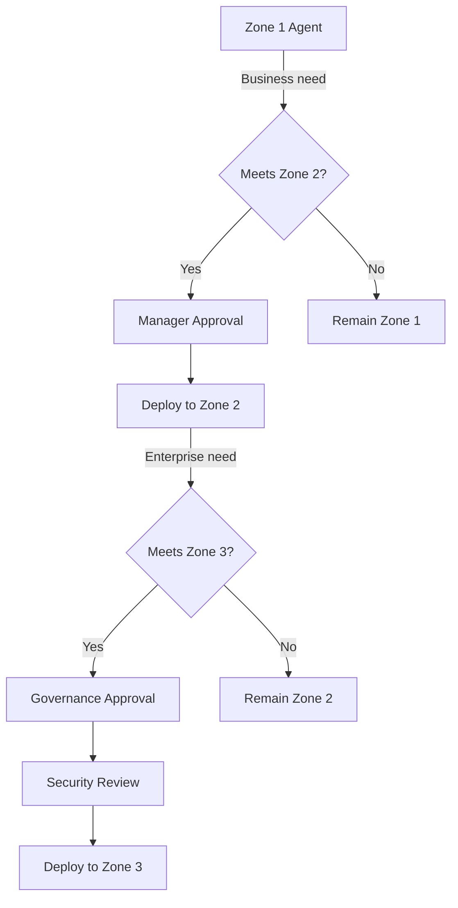
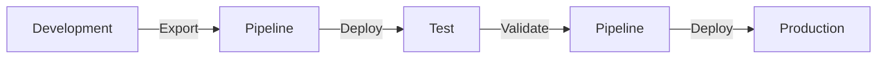
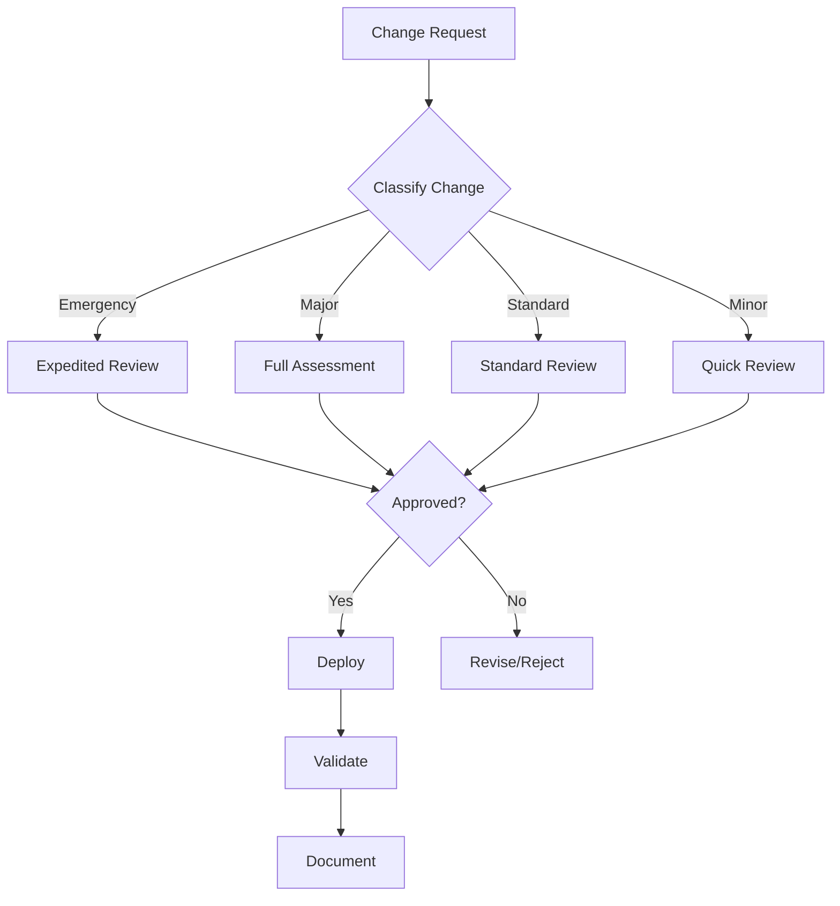

# Control 2.3: Change Management and Release Planning

## Overview

**Control ID:** 2.3
**Control Name:** Change Management and Release Planning
**Regulatory Reference:** FINRA 4511, SOX 404, GLBA 501(b), SEC 17a-4
**Setup Time:** 2-4 hours

---

## Description

Change management ensures that all modifications to agents are controlled, documented, and approved before deployment. This includes zone promotions, configuration changes, and version updates. Power Platform provides ALM (Application Lifecycle Management) pipelines for automated, controlled deployments.

See [Overview of pipelines](https://learn.microsoft.com/en-us/power-platform/alm/pipelines) for ALM capabilities.

---

## Key Capabilities

| Capability | Description | FSI Relevance |
|------------|-------------|---------------|
| **ALM Pipelines** | Automated solution deployment | Controlled promotion |
| **Solution versioning** | Track agent versions | Audit trail |
| **Approval workflows** | Gate deployments | Compliance enforcement |
| **Rollback capability** | Revert failed changes | Business continuity |

---

## Zone Promotion Process

### Zone Promotion Overview

### Zone Promotion Requirements

| Promotion | Requirements | Approvers | Documentation |
|-----------|--------------|-----------|---------------|
| **Zone 1 → Zone 2** | Business justification, basic testing | Manager, Environment owner | Request form, test results |
| **Zone 2 → Zone 3** | Full assessment, security review | Governance committee, Compliance, Security | Full package |
| **Within Zone** | Change documentation | Environment owner | Change record |

### Promotion Checklist

#### Zone 1 to Zone 2

- [ ] Business justification documented
- [ ] Manager approval obtained
- [ ] Basic security review completed
- [ ] Target environment identified
- [ ] Solution exported from Zone 1
- [ ] Deployment plan created
- [ ] Rollback plan defined

#### Zone 2 to Zone 3

- [ ] All Zone 1→2 requirements
- [ ] Governance committee approval
- [ ] Full security assessment
- [ ] Compliance review completed
- [ ] Performance testing passed
- [ ] User acceptance testing completed
- [ ] Production readiness checklist
- [ ] Monitoring plan defined
- [ ] Support procedures documented

---

## ALM Pipeline Integration

### Pipeline Overview

Power Platform pipelines enable automated, governed deployments:

See [Set up pipelines](https://learn.microsoft.com/en-us/power-platform/alm/set-up-pipelines) for configuration.

### Pipeline Configuration by Zone

| Zone | Pipeline Required | Stages | Approval Gates |
|------|-------------------|--------|----------------|
| Zone 1 | No | N/A | N/A |
| Zone 2 | Recommended | Dev → Test | Manager |
| Zone 3 | **Required** | Dev → Test → Prod | Multiple |

### Setting Up Pipelines

1. **Create pipeline environment** (host for pipeline configuration)
2. **Define stages** (development, test, production)
3. **Configure deployment settings** per stage
4. **Add approval gates** as required
5. **Test pipeline** with non-production solution

### Running Pipelines

1. Open agent solution in source environment
2. Select **Deploy** from solution menu
3. Choose target stage
4. Wait for approvals (if configured)
5. Monitor deployment progress
6. Validate in target environment

See [Run pipelines](https://learn.microsoft.com/en-us/power-platform/alm/run-pipeline) for detailed steps.

### PPAC Deployment Section

The Power Platform Admin Center provides a dedicated **Deployment** section (top-level navigation) for pipeline administration:

**Accessing Deployment:**
1. Open [Power Platform Admin Center](https://admin.powerplatform.microsoft.com)
2. Navigate to **Deployment** in left navigation
3. Select sub-section: Overview, Pipelines, Settings, or Catalogs

**Deployment Overview:**
- Pipelines activity dashboard
- Pending approvals count
- Failed deployments count
- Quick access to setup guides

**Deployment Settings:**

| Setting | Description | FSI Recommendation |
|---------|-------------|-------------------|
| **Enable Auto-Conversion of Target Environments to Managed** | Automatically converts target environments to Managed | Enable for Zone 3 |
| **Solution deployments across regions** | Allow cross-region deployments | Configure per policy |
| **Allow makers to import shared solution deployments** | Makers can import shared solutions | Enable for Zone 2+ |

> **Important:** Target environments in pipelines must be enabled as Managed Environments. This ensures every environment used in pipelines meets Microsoft Enterprise compliance standards.

### Power Apps Pipeline View

Makers access pipelines from Power Apps:

1. Open [Power Apps](https://make.powerapps.com)
2. Navigate to **Solutions**
3. Select **Pipelines** from toolbar
4. Create pipeline, add stages, manage deployments

**Toolbar options:** Create pipeline, Edit pipeline, Add stage, Delete pipeline, Refresh, Manage pipelines, View deployments

See [Admin deployment hub](https://learn.microsoft.com/en-us/power-platform/alm/admin-deployment-hub) for details.

---

## Change Types and Workflows

### Change Classification

| Change Type | Examples | Risk Level | Approval |
|-------------|----------|------------|----------|
| **Emergency** | Security fix, critical bug | High | Expedited |
| **Major** | New functionality, architecture change | High | CAB |
| **Standard** | Enhancements, non-critical fixes | Medium | Manager |
| **Minor** | Documentation, cosmetic changes | Low | Self-service |

### Approval Matrix by Zone

| Change Type | Zone 1 | Zone 2 | Zone 3 |
|-------------|--------|--------|--------|
| Emergency | Self-service | Manager + Security | CAB + CISO |
| Major | Self-service | Manager + Security | CAB |
| Standard | Self-service | Manager | Manager + Security |
| Minor | Self-service | Self-service | Manager |

### Change Request Process

---

## Governance Levels

### Level 1 - Baseline

| Requirement | Configuration |
|-------------|---------------|
| Change documentation | All changes documented |
| Basic approval | Manager approval for production |
| Version tracking | Solution versioning enabled |

**Minimum requirements:**
- Document all agent changes
- Require approval before production deployment
- Maintain version history

### Level 2-3 - Recommended

| Requirement | Configuration |
|-------------|---------------|
| ALM pipelines | Pipelines for Zone 2+ deployments |
| Approval workflows | Automated approval gates |
| Testing gates | Automated testing before promotion |
| Change records | Formal change documentation |

**FSI recommendations:**
- Configure pipelines for all Zone 2-3 agents
- Implement automated approval workflows
- Require testing validation before deployment
- Maintain comprehensive change records

### Level 4 - Regulated/High-Risk

| Requirement | Configuration |
|-------------|---------------|
| CAB process | Formal Change Advisory Board |
| Review period | Minimum 48-hour review for major changes |
| Automated testing | Mandatory pre-deployment testing |
| Rollback capability | Tested rollback procedures |
| Audit trail | Complete change history |

**FSI requirements:**
- Formal CAB for Zone 3 changes
- 48-hour minimum review period (except emergencies)
- Automated testing in pipeline
- Documented and tested rollback procedures
- Complete audit trail for regulatory examinations

---

## Rollback Procedures

### Rollback Triggers

| Trigger | Action | Timeline |
|---------|--------|----------|
| Critical failure | Immediate rollback | <1 hour |
| Performance degradation | Assess, then rollback | <4 hours |
| User-reported issues | Investigate, then decide | <24 hours |
| Compliance concern | Hold, assess, decide | Immediate hold |

### Rollback Process

1. **Identify issue** and classify severity
2. **Notify stakeholders** (users, management)
3. **Execute rollback** via pipeline or manual restore
4. **Validate restoration** of previous version
5. **Document incident** and root cause
6. **Plan remediation** before next attempt

### Solution Backup Strategy

| Zone | Backup Frequency | Retention |
|------|------------------|-----------|
| Zone 1 | On change | 30 days |
| Zone 2 | Before deployment | 90 days |
| Zone 3 | Before deployment + daily | 1 year |

---

## Documentation Requirements

### Change Record Contents

| Field | Description | Required |
|-------|-------------|----------|
| Change ID | Unique identifier | Yes |
| Description | What is being changed | Yes |
| Justification | Why the change is needed | Yes |
| Risk assessment | Potential impact | Zone 2-3 |
| Test results | Validation evidence | Zone 2-3 |
| Approvals | Who approved | Yes |
| Deployment date | When deployed | Yes |
| Validation | Post-deployment confirmation | Yes |

### Audit Trail

Maintain records for:
- Change requests and approvals
- Deployment logs (pipeline or manual)
- Test results
- Rollback events
- Post-deployment validation

---

## Verification & Testing

| Step | Action | Expected Result |
|------|--------|-----------------|
| 1 | Review pipeline configuration | Pipelines exist for Zone 2-3 |
| 2 | Check approval gates | Gates configured per zone |
| 3 | Review change history | All changes documented |
| 4 | Test rollback procedure | Previous version restorable |
| 5 | Verify audit trail | Complete change records |

---

## Regulatory Context

**Primary Regulations:** FINRA 4511, SOX 404, GLBA 501(b), SEC 17a-4

| Regulation | Change Management Requirement |
|------------|------------------------------|
| FINRA 4511 | Maintain records of all AI system changes |
| SOX 404 | Document IT controls and change processes |
| GLBA 501(b) | Control changes to systems with customer data |
| SEC 17a-4 | Preserve change records per retention requirements |

### Examination Considerations

Regulators may request:
- Change management policy documentation
- Sample change requests with approvals
- Deployment logs and pipeline history
- Rollback procedures and test evidence
- Audit trail for specific agents

---

## Related Controls

- [Control 2.1: Managed Environments](./2.1-managed-environments.md) - Environment governance
- [Control 2.5: Testing and Validation](./2.5-testing-validation-and-quality-assurance.md) - Testing requirements
- [Control 2.15: Environment Routing](./2.15-environment-routing.md) - Environment placement
- [Control 3.1: Agent Inventory](../pillar-3-reporting/3.1-agent-inventory-and-metadata-management.md) - Version tracking

---

## Support & Questions

For implementation support or questions about this control, contact:
- AI Governance Lead (governance direction)
- Compliance Officer (regulatory requirements)
- Power Platform Admin (technical setup)

---

*Last Updated: December 2025*
*Version: 1.0 Beta*
