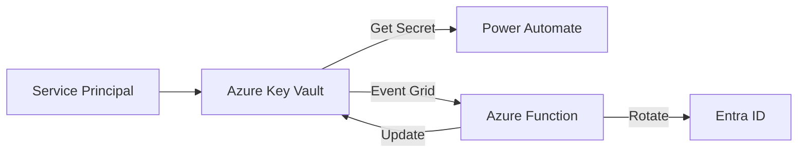
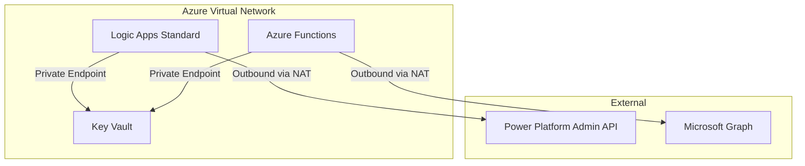
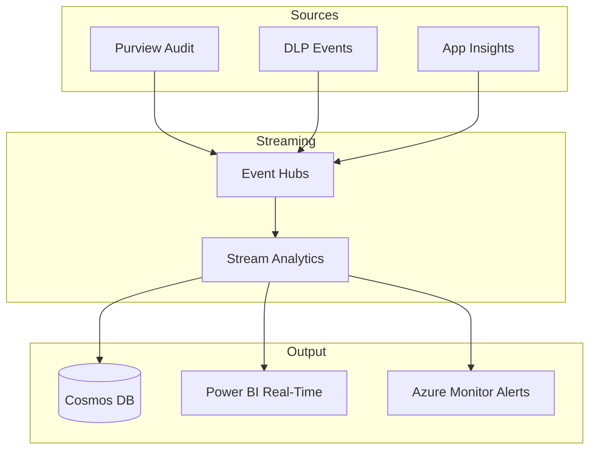

# Solutions Architecture Guide

Reference guide for enterprise scalability, platform selection, and operational limits for FSI-AgentGov-Solutions.

---

## Overview

This guide provides architecture guidance for organizations deploying FSI-AgentGov-Solutions at enterprise scale. It documents platform limits, alternative architectures, and operational best practices validated against Microsoft guidance.

**Last Updated:** January 2026

---

## Platform Selection Guide

### Automation Platform Comparison

Microsoft provides three primary automation platforms. Each serves different use cases within FSI-AgentGov-Solutions.

| Platform | Best For | Current Usage |
|----------|----------|---------------|
| **Power Automate** | Dataverse triggers, citizen dev, Teams integration | ELM, MCM |
| **Logic Apps Standard** | VNet deployment, enterprise retry policies, B2B | Alternative for high-security scenarios |
| **Azure Functions** | Custom logic, high-volume processing, APIs | Alternative for DEC correlation |

### Decision Criteria

**Use Power Automate when:**

- Triggering from Dataverse record changes
- Sending Teams adaptive cards or approval flows
- Requiring citizen developer maintenance
- Using Microsoft 365 connectors natively

**Consider Logic Apps Standard when:**

- Deploying inside Azure Virtual Network (VNet isolation required)
- Requiring custom retry policies with precise control
- Processing high-volume B2B integrations
- Needing integration with on-premises systems

**Consider Azure Functions when:**

- Implementing complex transformation logic
- Building custom APIs or microservices
- Requiring sub-second latency
- Processing high-volume data pipelines

### FSI-AgentGov-Solutions Alignment

| Solution | Current Platform | Alternative | Migration Rationale |
|----------|------------------|-------------|---------------------|
| **Environment Lifecycle Management** | Power Automate | Logic Apps Standard | If VNet isolation required for service principal |
| **Message Center Monitor** | Power Automate | Logic Apps Standard | If Graph API calls must traverse private network |
| **Pipeline Governance Cleanup** | PowerShell | Azure Functions | If scheduling via Azure Automation preferred |
| **Deny Event Correlation** | PowerShell + Power BI | Azure Functions + Stream Analytics | If near-real-time correlation required |

**Sources:**
- [Integration and automation platform options in Azure](https://learn.microsoft.com/en-us/azure/azure-functions/functions-compare-logic-apps-ms-flow-webjobs)
- [Power Automate vs Logic Apps](https://learn.microsoft.com/en-us/microsoft-365/community/power-automate-vs-logic-apps)

---

## Scalability Limits Reference

### Power Platform Request Limits

Power Automate actions consume "Power Platform requests" counted against license entitlements.

| License Type | Daily Request Limit | Transition Period Limit |
|--------------|--------------------:|------------------------:|
| Microsoft 365 / Office 365 | 6,000 | 10,000 |
| Dynamics 365 Team Member | 6,000 | 25,000 |
| Dynamics 365 Professional | 40,000 | 100,000 |
| Dynamics 365 Enterprise | 40,000 | 100,000 |
| Power Automate Premium (per user) | Unlimited (within service limits) | — |
| Power Automate Process (per flow) | 250,000 | — |

!!! warning "How Requests Are Counted"
    Every trigger/action in a flow generates Power Platform requests—including compose actions, variable initialization, and HTTP calls. Both succeeded and failed actions count. Only skipped actions are excluded.

**Connector-Specific Throttling:**

Connectors have separate limits as service protection mechanisms:

| Connector | Limit |
|-----------|-------|
| SharePoint | 600 actions per minute per connection |
| Dataverse | 6,000 API calls per 5-minute window |
| Exchange Online | 10,000 API calls per 10-minute window |

**Sources:**
- [Limits of automated, scheduled, and instant flows](https://learn.microsoft.com/en-us/power-automate/limits-and-config)
- [Power Automate licensing FAQ](https://learn.microsoft.com/en-us/power-platform/admin/power-automate-licensing/faqs)

---

### Microsoft Graph API Throttling

Graph API throttling applies to all solutions using Microsoft 365 data.

| Limit Type | Value | Scope |
|------------|------:|-------|
| Global limit | 130,000 requests / 10 seconds | Per app across all tenants |
| Per-tenant limit | Varies by service | Per tenant |
| Per-app per-user per-tenant | 50% of total tenant limit | Starting September 2025 |

**Service-Specific Examples:**

| Service | Read Limit | Write Limit |
|---------|----------:|------------:|
| Intune | 2,000 / 20 seconds (tenant) | 200 / 20 seconds (tenant) |
| Teams | 10,000 / 10 seconds (app) | 2,000 / 10 seconds (app) |
| Directory | 10,000 / 10 seconds (tenant) | — |

**Best Practices:**

1. **Use Delta Queries** - Request only changed data since last query
2. **Implement Batching** - Combine up to 20 requests per batch
3. **Cache frequently-accessed data** - Reduce redundant calls
4. **Use exponential backoff** - Honor Retry-After headers on 429 responses
5. **Consider Graph Data Connect** - For bulk extraction without throttling

!!! tip "Message Center Monitor Guidance"
    MCM uses `ServiceMessage.Read.All` which has generous limits. Polling every 30 minutes is well within throttling thresholds for most tenants.

**Sources:**
- [Microsoft Graph throttling guidance](https://learn.microsoft.com/en-us/graph/throttling)
- [Microsoft Graph service-specific throttling limits](https://learn.microsoft.com/en-us/graph/throttling-limits)

---

### Dataverse Capacity

As of December 2025, Microsoft significantly increased default Dataverse capacity.

| License | Previous Database Capacity | New Database Capacity (Dec 2025) |
|---------|---------------------------:|---------------------------------:|
| Power Apps Per App | 5 GB | 15 GB |
| Power Apps Premium | 10 GB | 20 GB |
| Power Automate Premium | 10 GB | 20 GB |
| Dynamics 365 Sales/CS | 10 GB | 30 GB |
| Copilot Studio | 5 GB | 15 GB |

!!! note "No Technical Limit"
    There's no technical limit on Dataverse environment size—limits are entitlement-based. Organizations can purchase additional capacity if needed.

**ELM Capacity Guidance:**

For Environment Lifecycle Management:

- EnvironmentRequest records: ~2 KB each
- ProvisioningLog records: ~1 KB each
- 100 environments/month = ~0.5 MB/month
- 15 GB default capacity supports years of requests

**Sources:**
- [Dataverse capacity-based storage details](https://learn.microsoft.com/en-us/power-platform/admin/capacity-storage)
- [Flexible Dataverse capacity announcement](https://www.microsoft.com/en-us/power-platform/blog/2025/12/04/dataverse-capacity/)

---

### Power BI Refresh Limits

Power BI dataset refresh limits affect Deny Event Correlation reporting.

| License Tier | Scheduled Refreshes/Day | API/XMLA Refreshes | Refresh Timeout |
|--------------|------------------------:|-------------------:|----------------:|
| Power BI Pro | 8 | N/A | 2 hours |
| Power BI Premium Per User (PPU) | 48 | Unlimited* | 5 hours |
| Power BI Premium Capacity | 48 | Unlimited* | 24 hours (configurable) |

*Unlimited via XMLA endpoint, constrained by capacity resources

!!! warning "DEC Report Implications"
    With Power BI Pro, deny event reports can only refresh 8 times daily (every 3 hours). For near-real-time monitoring, Premium capacity is required.

**Dataset Size Limits:**

| License | Max Dataset Size |
|---------|----------------:|
| Power BI Pro | 1 GB |
| Power BI PPU | 100 GB |
| Power BI Premium | 400 GB |

**Sources:**
- [Data refresh in Power BI](https://learn.microsoft.com/en-us/power-bi/connect-data/refresh-data)
- [What is Power BI Premium?](https://learn.microsoft.com/en-us/fabric/enterprise/powerbi/service-premium-what-is)

---

### Audit Log Query Limits

Search-UnifiedAuditLog has limits affecting deny event extraction.

| Parameter | Limit | Mitigation |
|-----------|------:|------------|
| Records per query | 50,000 | Use pagination with -SessionId |
| Date range | 90 days (default) | Audit Premium extends to 1 year |
| Concurrent sessions | 3 per user | Use service account with dedicated sessions |
| Query timeout | 5 minutes | Narrow date range, add filters |

**DEC Extraction Guidance:**

For high-volume tenants:

1. Query in 1-hour windows
2. Use `-SessionId` for pagination
3. Export incrementally to storage
4. Schedule during off-peak hours

**Sources:**
- [Search-UnifiedAuditLog documentation](https://learn.microsoft.com/en-us/powershell/module/exchange/search-unifiedauditlog)

---

## Secret Management Best Practices

### Service Principal Credential Rotation

All FSI-AgentGov-Solutions using service principals should implement automated rotation.

| Credential Type | Recommended Rotation | Maximum Validity |
|-----------------|---------------------:|-----------------:|
| Client Secret | 60-90 days | 2 years |
| Certificate | 1 year | 3 years |

### Azure Key Vault Integration

**Recommended Pattern:**

**Implementation Steps:**

1. Store credentials in Azure Key Vault (not Dataverse or flow variables)
2. Configure Key Vault expiry notifications via Event Grid
3. Implement rotation Azure Function triggered 30 days before expiry
4. Use dual credential pattern for zero-downtime rotation

**Dual Credential Pattern:**

1. Generate new credential while old remains valid
2. Update Key Vault with new credential
3. Test automation with new credential
4. Revoke old credential after verification
5. Log rotation event for audit

!!! warning "Azure Key Vault API Retirement: February 27, 2027"
    Azure Key Vault APIs created before February 1, 2026 will be retired on **February 27, 2027**. New Key Vault instances created after this date enforce Azure RBAC as the default permission model.

    **Required Actions:**

    1. Audit existing Key Vault instances using Access Policy permission model
    2. Migrate to Azure RBAC permission model before retirement date
    3. Update automation scripts to use RBAC-based authentication
    4. Test credential rotation workflows after migration

    **Source:** [Azure Key Vault API retirement](https://learn.microsoft.com/en-us/azure/key-vault/general/rbac-migration)

**Sources:**
- [Rotation tutorial for resources with two sets of credentials](https://learn.microsoft.com/en-us/azure/key-vault/secrets/tutorial-rotation-dual)
- [Best practices for secrets management in Key Vault](https://learn.microsoft.com/en-us/azure/key-vault/secrets/secrets-best-practices)

---

## Compliance Storage Patterns

### Azure Immutable Blob Storage

For Deny Event Correlation Report storage, Azure Immutable Blob Storage provides SEC 17a-4 and FINRA 4511 validated compliance.

**SEC 17a-4 Compliance Options (Post-May 2023):**

Following the October 2022 SEC amendments (effective May 3, 2023), broker-dealers may satisfy 17a-4(f) through **either** of two approaches:

| Approach | Description | Azure Implementation |
|----------|-------------|---------------------|
| **WORM Storage** | Non-rewritable, non-erasable format (traditional) | Immutable Blob with time-based retention policy |
| **Audit Trail Alternative** | Time-stamped modification history for all changes | Blob versioning + change feed + access logging |

!!! tip "Choosing an Approach"
    Most organizations continue with WORM for simplicity and Cohasset validation. The audit-trail alternative is suitable for organizations requiring occasional record amendments with full modification history.

**Regulatory Validation:**

Cohasset Associates validated Azure Immutable Blob Storage for:

- SEC Rule 17a-4(f) (WORM approach)
- CFTC Rule 1.31(c)-(d) (principles-based; WORM not required by CFTC)
- FINRA Rule 4511

**Configuration for DEC:**

| Setting | Value | Rationale |
|---------|-------|-----------|
| Retention policy | Time-based, locked | Meets regulatory WORM requirements |
| Retention period | 6 years | SEC 17a-4 minimum |
| Storage tier | Cool or Archive | Cost optimization for rarely-accessed data |
| Immutable at container level | Yes | Prevents accidental deletion |

**Cost Optimization:**

- Use Hot tier for current month data (active analysis)
- Transition to Cool after 30 days (occasional access)
- Transition to Archive after 1 year (compliance retention only)

**Sources:**
- [Overview of immutable storage for blob data](https://learn.microsoft.com/en-us/azure/storage/blobs/immutable-storage-overview)
- [Azure Storage compliance offerings](https://learn.microsoft.com/en-us/azure/storage/common/storage-compliance-offerings)

---

## CoE Starter Kit Alignment

Microsoft's Power Platform Center of Excellence (CoE) Starter Kit provides governance patterns that complement FSI-AgentGov-Solutions.

### Comparison Matrix

| Capability | CoE Starter Kit | FSI-AgentGov-Solutions | Recommendation |
|------------|-----------------|------------------------|----------------|
| **Environment inventory** | Yes (comprehensive) | No | Use CoE Starter Kit |
| **Environment provisioning** | Basic request form | Zone-based with approvals | Use ELM for FSI compliance |
| **Pipeline discovery** | Yes (Core module) | Yes (cleanup focused) | Complementary |
| **Message Center monitoring** | Yes (Innovation module) | Yes (governance-focused) | Either; MCM has simpler setup |
| **Deny event correlation** | No | Yes | Use DEC |
| **Power BI governance reports** | Yes (extensive) | Limited | Use CoE Starter Kit |

### Integration Opportunities

| Scenario | Integration Approach |
|----------|---------------------|
| Existing CoE deployment | Add ELM for zone-based provisioning, DEC for deny visibility |
| Greenfield FSI deployment | Deploy FSI-AgentGov-Solutions first, consider CoE for broader inventory |
| Enterprise hybrid | CoE for platform-wide governance, FSI solutions for AI agent-specific controls |

**Sources:**
- [Power Platform Center of Excellence Starter Kit overview](https://learn.microsoft.com/en-us/power-platform/guidance/coe/overview)
- [CoE Starter Kit modules](https://learn.microsoft.com/en-us/power-platform/guidance/coe/starter-kit-explained)

---

## Alternative Architecture Patterns

### High-Security Deployment (VNet Isolation)

For organizations requiring network isolation:

**Changes from Standard Deployment:**

| Component | Standard | VNet Isolated |
|-----------|----------|---------------|
| Automation | Power Automate | Logic Apps Standard |
| Secret storage | Key Vault (public) | Key Vault (private endpoint) |
| Data storage | SharePoint/Dataverse | Azure Blob (private endpoint) |
| Monitoring | Power Automate analytics | Azure Monitor |

### Streaming Architecture (Near Real-Time)

For organizations requiring near-real-time deny event correlation:

**Trade-offs:**

| Factor | Batch (Current) | Streaming |
|--------|-----------------|-----------|
| Latency | 3+ hours | Seconds |
| Cost | Lower (Power BI Pro) | Higher (Event Hubs + Stream Analytics) |
| Complexity | Simple scripts | Event-driven architecture |
| Skill requirement | PowerShell, Power BI | Azure streaming services |

---

## Related Documentation

- [Solutions Index](solutions-index.md) - Complete solution catalog
- [Solutions Integration](../framework/solutions-integration.md) - Framework-to-solutions mapping
- [ELM Architecture](../playbooks/advanced-implementations/environment-lifecycle-management/architecture.md) - Detailed ELM architecture
- [DEC Playbook](../playbooks/advanced-implementations/deny-event-correlation-report/index.md) - Deny Event Correlation overview
- [FSI-AgentGov-Solutions Repository](https://github.com/judeper/FSI-AgentGov-Solutions) - Deployable components

---

*FSI Agent Governance Framework v1.2.32 - January 2026*
